# CLI：元数据定义和语义

此规范提供了元数据的规范性描述：其物理布局 (以文件格式) 、其逻辑内容 (作为一组表格及关系) 、以及其语义 (从假设的汇编器 ILASM)。

此部分专注于元数据的语义和结构。元数据的语义决定了 VES 的大部分操作，使用 CIL 的汇编语言 ILAsm 的语法进行描述。ILAsm 语法本身被视为此国际标准的规范性部分。

汇编语言实际上只是用于指定文件中元数据和该文件中的 CIL 指令的语法。指定的 ILAsm 提供了一种直接交换为 CLI 编写的程序的方法，从而无需使用高级语言；它还提供了一种方便的方式来表达示例。元数据的语义也可以独立于存储元数据的实际格式直接进行描述。

---
## 1. 验证和校验
<a id="validation-and-verification"></a>

**验证** (_Validation_) 是指对任何文件应用一组测试，以检查文件的格式、元数据和 CIL 是否自一致性。这些测试目的在于确保文件符合本规范的要求。当符合 CLI 规范的实现面临一个不符合规范的文件时，其行为是未指定的。

**校验** (_Verification_) 是指检查 CIL 及其相关元数据，以确保 CIL 代码序列不允许访问程序逻辑地址空间之外的内存。结合验证测试，校验确保程序不能访问未被授权访问的内存或其他资源。

底层类型系统健全性的数学证明是可能的，并为验证要求提供了基础。除了这些规则，此标准将以下内容视为未指定：
 * 执行此类算法的时间 (如果有)。
 * 在验证失败时，符合规范的实现应该做什么。

下图使这种关系更清晰：

 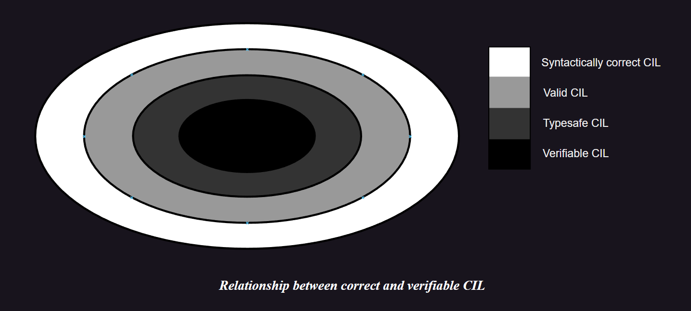

在上图中，最外层包含了所有由 ILAsm 语法允许的代码。下一个内圈代表所有正确有效的 CIL 代码。次内圈代表所有类型安全的代码。最内层包含所有可验证的代码。类型安全代码和可验证代码之间的区别是 **可证明性** (_provability_)：通过 VES 验证算法的代码按定义是 *可验证的*；但是，这个简单的算法也会拒绝某些代码，即使更深入的分析会将其揭示为真正的类型安全。

验证过程非常严格。有许多程序可以通过验证，但会在校验中失败。VES 不能保证这些程序不会访问它们未被授权访问的内存或资源。它们可能已经被正确地构造，以使它们不访问这些资源。因此，是否安全地运行这些程序是信任的问题，而不是数学证明的问题。通常符合 CLI 规范的实现能够允许执行 *不可验证的代码* (有效的代码，但未通过校验)，尽管这可能受限于部分不属于此标准管理的信任控制。符合 CLI 规范的实现应允许执行可验证的代码，尽管它们可能受限于一些额外的实现所指定的信任控制。

---
## 2. Hello World

一个简单的 ILAsm。`"Hello world!"` 通过调用 `System.Console` 类中的静态方法 `WriteLine` 来写入的，该类是标准程序集 `mscorlib` 的一部分。

```cil
.assembly extern mscorlib {}
.assembly hello {}
.method static public void main() cil managed
{   
    .entrypoint
    .maxstack 1

    ldstr "Hello world!"
    call void [mscorlib]System.Console::WriteLine(class System.String)
    ret
}
```

**.assembly extern** 声明引用了一个外部程序集 `mscorlib`，它包含了 `System.Console` 的定义。第二行的 **.assembly** 声明了这个程序的程序集的名称，程序集是 CLI 可执行内容的部署单元。**.method** 声明定义了全局方法 `main`，其主体紧随其后。主体的第一行表明这个方法是程序集的入口点 (**.entrypoint**)，主体的第二行指定它最多需要一个堆栈槽 (**.maxstack**)。

`main` 方法只包含三个指令：`ldstr`、`call` 和 `ret`。`ldstr` 指令将字符串常量 `"Hello world!"` 压入堆栈，`call` 指令调用 `System.Console::WriteLine`，将字符串作为其唯一的参数传递。在 CIL 中，字符串字面量是标准类 `System.String` 的实例。`call` 指令应包含被调用方法的完整签名。最后一个指令，`ret` 表明从 `main` 返回。

---
## 3. 通用语法
### 3.1. 通用语法表示法

本部分使用了 BNF 语法表示法的修改形式，以下是这种表示法的简要总结：
- 终端符号以等宽字体书写，例如 **.assembly**、**extern** 和 **float64**；仅由标点字符组成的终端符号被包含在单引号中，例如 `':'`、`'['` 和 `'('`。
- 语法类别的名称以大写和斜体表示，例如 _ClassDecl_，并应被实际类别的实例替换。
- 放在 "`[ ]`" 括号中的项 (例如 [ _Filename_ ] 和 [ _Float_ ]) 是可选的，任何后跟 " * " 的项 (例如 _HexByte_* 和 [ `'.'` _Id_ ]*) 可以出现零次或多次。
- 字符 `|` 表示其两侧的项目都是可以接受的 (例如 `true` | `false`)。
- 选项按字母顺序排序 (按 ASCII 顺序，且不区分大小写)。如果规则以可选项开始，那么在排序时不会考虑这个可选项。

ILAsm 是一种区分大小写的语言，所有的终端符号都应该与本条款中指定的大小写一致。一条像

<pre>
    <em>Top</em> ::= <em>Int32</em> | float <em>Float</em> | floats [ <em>Float</em> [ ',' <em>Float</em> ]* ] | else <em>QSTRING</em>
</pre>

这样的语法会认为以下都是有效的：

```cil
    12
    float 3
    float –4.3e7
    floats
    floats 2.4
    floats 2.4, 3.7
    else "Something \t weird"
```

但以下所有的都是无效的：

```cil
    3, 4
    else 3
    float 4.3, 2.4
    float else
    stuff
```

>---
### 3.2. 基本语法类别

这些类别用于描述输入的语法约束，用于传达元数据中编码信息的逻辑限制：

- _Int32_ 是一个十进制数或 "`0xF`" 十六进制数，应该用 32 位表示。ILAsm 没有 8 位或 16 位整数常量的概念。但是，有时会需要这样常量的情况 (如 `int8(...)` 和 `int16(...)`) 并接受一个 _Int32_，且只使用最低有效字节。

+ _Int64_ 是一个十进制数或 "`0xF`" 十六进制数，应该用 64 位表示。

- _HexByte_ 是一个十六进制数，是来自集合 `0` ~ `9`，`a` ~ `f` 或 `A` ~ `F` 的一对字符。

+ _RealNumber_ 是任何对浮点数的语法表示，与所有其他语法类别的表示都不同。在这个部分，用句点 (`.`) 来分隔整数部分和小数部分，用 "`e`" 或 "`E`" 来分隔尾数和指数。句点或尾数分隔符 (但不能同时省略) 可以省略。一个完整的汇编器可能还提供无穷大和 **NaN** 的语法。

- _QSTRING_ 是一个被双引号 (`"`) 标记包围的字符串。在字符串中，支持转义字符 (`\t`
  水平制表符、`\n` 换行符、`\XXX` 三个八进制数字以表示一个具有该值的字节。`+` 运算符可以用来拼接字符串字面量。一个长字符串可以通过在每行使用 `+` 和一个新的字符串来分割成多行；另一种方法是在一行的最后一个字符使用 `\`，在这种情况下，该字符和其后的换行符不会被输入到生成的字符串中。在 `\` 和下一行的第一个非空白字符之间的任何空白字符 (空格，换行，回车，和制表符) 都会被忽略。要在 _QSTRING_ 中包含一个双引号字符，需要使用八进制转义序列。一个完整的汇编器需要处理支持 Unicode 编码所需的全部问题。

   ```cil
   // "`Hello World from CIL!`"
   ldstr "Hello " + "World " +
   "from CIL!"
   // or
   ldstr "Hello World\
         \040from CIL!"
   ```
+ _SQSTRING_ 就像 _QSTRING_ 一样，只是 _SQSTRING_ 使用单引号 (`'`) 标记而不是双引号。要在 _SQSTRING_ 中包含一个单引号字符，使用八进制转义序列。
  
- _ID_ 是一个连续的字符字符串，它以字母字符 (`A` ~ `Z`，`a` ~ `z`) 或 "`_`"、"`$`"、"`@`"、"`` ` ``" 或 "`?`" 开头，后随任意数量的字母数字字符 (`A` ~ `Z`，`a` ~ `z`，`0` ~ `9`) 或字符 "`_`"、"`$`"、"`@`"、"`` ` ``"，和 "`?`"。_ID_ 只有两种用途：
   * 作为 CIL 指令的标签。
   * 作为 _Id_。

>---
### 3.3. 标识符

标识符用于命名实体。简单的标识符等同于 _ID_。然而，ILAsm 语法允许使用 Unicode 字符集组成任何标识符。标识符应该放在单引号内。以下是这种语法的总结：
<pre>
   <em id="Id">Id</em> ::= <em>ID</em> | <em>SQSTRING</em>
</pre>

只有当关键字出现在单引号中时，才能将关键字用作标识符。通过用点 (`.`) 分隔相邻的两个 *Id*，可以将几个 *Id* 组合成一个更大的 _Id_。以这种方式形成的 _Id_ 被称为 _DottedName_。

<pre>
   <em id="DottedName">DottedName</em> ::= <em>Id</em> [ '.' <em>Id</em> ]*
</pre>
 
_DottedName_ 是为了方便提供的，因为 "`.`" 可以使用 _SQSTRING_ 语法包含在 _Id_ 中。在语法中，当 `'.'` 被认为是一个常见字符时 (例如，在完全限定类型名中)，使用 _DottedName_。以下是简单的标识符：

 ```
 A   Test   $Test   @Foo?   ?_X_   MyType`1

 'Weird Identifier'   'Odd\102Char'   'Embedded\nReturn'

 System.Console   'My Project'.'My Component'.'My Name'   System.IComparable`1
 ```

>---
### 3.4. 标签和标签列表
<a id="id"></a>

标签作为一种编程便利提供，它们代表元数据中编码的一个数字。标签所代表的值通常是从当前方法的开始到某个偏移量的字节数，尽管精确的编码方式取决于标签出现在逻辑元数据结构或 CIL 流中的位置。

一个简单的标签是一个特殊的名字，代表一个地址。在语法上，标签等同于 _Id_。因此，标签可以被单引号引起来，并且可以包含 Unicode 字符。

标签列表是由逗号分隔的，可以是任何组合的简单标签。

<pre>
   <em id="LabelOrOffset">LabelOrOffset</em> ::= <em>Id</em>
   <em id="Labels">Labels</em> ::= <em>LabelOrOffset</em> [ ',' <em>LabelOrOffset</em> ]*
</pre>

在一个真正的汇编器中，_LabelOrOffset_ 的语法可能允许直接指定一个数字，而不是所需的符号标签。

ILAsm 区分两种类型的标签：代码标签和数据标签。代码标签后面跟着一个冒号 ("`:`")，代表要执行的指令的地址。代码标签出现在指令之前，它们代表紧接标签的指令地址。一个特定的代码标签名在一个方法中不能声明多次。

与代码标签相反，数据标签指定了一块数据位置，并且不包含冒号字符。数据标签不能用作代码标签，代码标签不能用作数据标签。一个特定的数据标签名在一个模块中不能声明多次。

<pre>
   <em id="CodeLabel">CodeLabel</em> ::= <em>Id</em> ':'
   <em id="DataLabel">DataLabel</em> ::= <em>Id</em>
</pre>

以下定义了一个代码标签，`ldstr_label`，它代表 `ldstr` 指令的地址：

```cil
ldstr_label: ldstr "A label"
```

>---
### 3.5. 十六进制字节列表

字节列表仅由一个或多个十六进制字节组成。

<pre>
    <em id="Bytes">Bytes</em> ::= <em>HexByte</em> [ <em>HexByte</em>* ]
</pre>

>---
### 3.6. 浮点数

有两种不同的方式来指定一个浮点数：
 1. 作为一个 _RealNumber_。
 2. 使用关键字 **float32** 或 **float64**，后随一个括号中的整数，其中整数值是所需浮点数的二进制表示。例如，`float32(1)` 结果是 4 字节值 `1.401298E-45`，而 `float64(1)` 的结果是 8 字节值 `4.94065645841247E-324`。

<pre>
    <em>Float32</em> ::= <em>RealNumber</em> | float32 '(' <em>Int32</em>  ')'
    <em>Float64</em> ::= <em>RealNumber</em> | float64 '(' <em>Int64</em>  ')'
</pre>

例如：

```cil
    5.5
    1.1e10
    float64(128)  // 这会产生一个 8 字节的值，其位序列与整数值 128 的位序列相同。
```

>---
### 3.7. 源文件行信息
<a id="ExternSourceDecl"></a>

元数据并未编码关于变量的词法范围或源代码行号到 CIL 指令的映射信息。然而为了创建信息的替代编码，指定一个汇编器语法来提供这些信息是有用的。

**.line** 接受一个行号，可选后随一个列号 (前面带有冒号)，可选后随一个单引号字符串，该字符串指定行号所引用的文件的名称：

<pre>
    <em>ExternSourceDecl</em> ::= .line <em>Int32</em> [ ':' <em>Int32</em> ][ <em>SQSTRING</em> ]
</pre>

>---
### 3.8. 文件名
<a id="Filename"></a>

某些语法元素需要提供一个文件名。文件名就像任何其他名称一样，其中 "`.`" 被视为正常的组成字符。文件名的具体语法遵循底层操作系统的规范。

<pre>
    <em>Filename</em> ::= <em>DottedName</em>
</pre>

>---
### 3.9. 特性和元数据

类型及其成员使用特性在它们定义上附加了描述性信息。最常见的特性是预定义的，并且在元数据中有特定的编码。此外，元数据提供了一种方式，使用几种不同的编码将用户定义的特性附加到元数据上。

从语法角度来看，有几种在 ILAsm 中指定特性的方式：

 * **使用内置在 ILAsm 中的特殊语法**。例如，在 _ClassAttr_ 中的关键字 **private** 指定类型的可见性应被限制为只允许在定义的程序集中访问。

 - **在 ILAsm 中使用通用语法**。例如非终结符 _CustomDecl_ 描述了这种语法。对于一些称为伪自定义特性的特性，这个语法实际上会在元数据中设置特殊的编码。

 * **安全特性被特殊处理**。在 ILAsm 中有特殊的语法，允许直接描述表示安全特性的 XML。虽然所有其它在标准库或用户提供的扩展中定义的特性都使用一个公共机制在元数据中编码，但安全特性 (直接或间接继承自 `System.Security.Permissions.SecurityAttribute`) 应按照 [「_DeclSecurity: 0x0E_」](#DeclSecurity_0x0E) 中的描述进行编码。

>---
### 3.10. ILAsm 源文件
<a id="il-top-impl"></a>

_ilasm_ 的输入是一系列的顶级声明，如下所定义：

<pre>
    <em id="ILFile">ILFile</em> ::= <em>Decl</em>*
</pre>

下面显示了顶级声明的完整语法。参考子项包含了此语法对应产生式的详细信息。这些产生式以 `'.'` 前缀的名字开始。这样的名字被称为指令。

 | _Decl_ ::=                                                                                 | 参考                      |
 | :----------------------------------------------------------------------------------------- | ------------------------- |
 | `.assembly` _DottedName_ `'{'` _AsmDecl_* `'}'`                                            | §[[↗]](#assembly)         |
 | \| `.assembly extern` _DottedName_ `'{'` _AsmRefDecl_* `'}'`                               | §[[↗]](#assembly-extern)  |
 | \| `.class` _ClassHeader_ `'{'` _ClassMember_* `'}'`                                       | §[[↗]](#class)            |
 | \| `.class extern` _ExportAttr_ _DottedName_ `'{'` _ExternClassDecl_* `'}'`                | §[[↗]](#class-extern)     |
 | \| `.corflags` _Int32_                                                                     | §[[↗]](#corflags)         |
 | \| `.custom` _CustomDecl_                                                                  | §[[↗]](#custom)           |
 | \| `.data` _DataDecl_                                                                      | §[[↗]](#data)             |
 | \| `.field` _FieldDecl_                                                                    | §[[↗]](#field)            |
 | \| `.file` [ `nometadata` ] _Filename_ `.hash` `'='` `'('` _Bytes_ `')'` [ `.entrypoint` ] | §[[↗]](#file)             |
 | \| `.method` _MethodHeader_ `'{'` _MethodBodyItem_* `'}'`                                  | §[[↗]](#method)           |
 | \| `.module` [ _Filename_ ]                                                                | §[[↗]](#module)           |
 | \| `.module extern` _Filename_                                                             | §[[↗]](#module-extern)    |
 | \| `.mresource` [ `public`  \| `private` ] _DottedName_ `'{'` _ManResDecl_* `'}'`          | §[[↗]](#mresource)        |
 | \| `.subsystem` _Int32_                                                                    | §[[↗]](#subsystem)        |
 | \| `.vtfixup` _VTFixupDecl_                                                                | §[[↗]](#vtfixup)          |
 | \| _ExternSourceDecl_                                                                      | §[[↗]](#ExternSourceDecl) |
 | \| _SecurityDecl_                                                                          | §[[↗]](#SecurityDecl)     |

---
## 4. 程序集、清单和模块

在 CLI 中，程序集和模块是分组构造，每个都在 CLI 中扮演不同的角色。

**程序集** (_assembly_) 是作为一个单元部署的一个或多个模块的集合。程序集总是包含一个 **清单** (_manifest_)，该清单指定：

 * 程序集的版本、名称、区域性和安全要求。
 * (如果有的话) 哪些其他文件属于程序集，以及每个文件的加密哈希。清单本身位于文件的元数据部分，该文件始终是程序集的一部分。
 * 要从程序集中导出的其他文件中定义的类型。在与清单相同的文件中定义的类型是基于类型本身的特性进行导出的。
 * (可选的) 清单本身的数字签名，以及用于计算它的公钥。

**模块** (_module_) 是一个包含在程序集中指定格式的可执行内容的单个文件。如果模块包含一个清单，那么它还指定了构成程序集的模块 (包括它自己)。一个程序集的所有组成文件中只能包含一个清单。对于要执行的程序集 (而不是简单地被动态加载)，清单应该位于包含入口点的模块中。

虽然一些编程语言引入了 *namespace* 命名空间的概念，但 CLI 对这个概念的唯一支持是作为元数据编码技术。类型名称总是由包含它们定义的程序集的完全限定名称来指定。

> 下面是一个关于模块、程序集和文件之间关系的图示：

 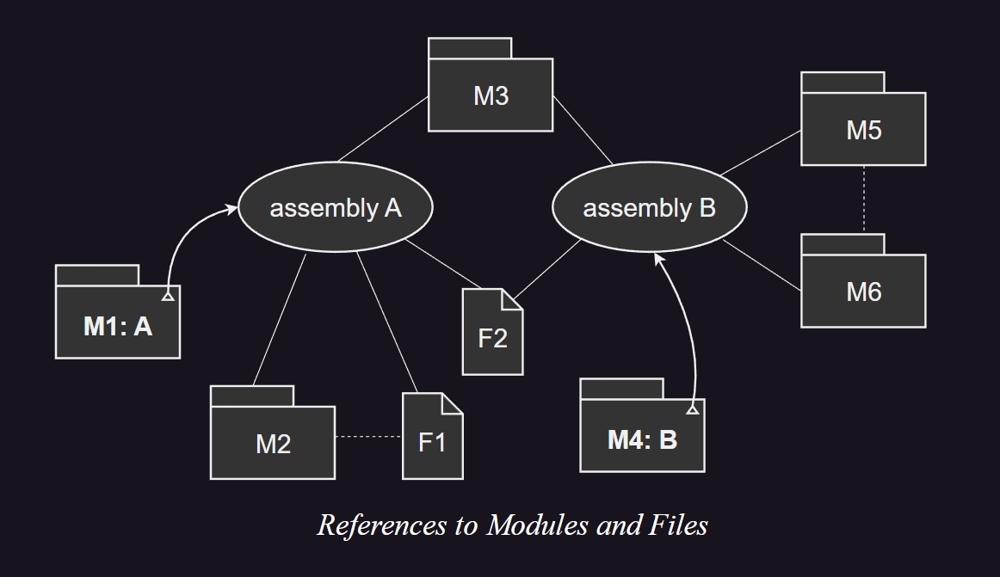

图中显示了八个文件，以 _M_ 开头的文件表示一个模块。以 _F_ 开头的文件可以表示为资源文件 (如位图) 或其他不包含 CIL 代码的文件。

文件 _M1_ 和 _M4_ 除了声明模块外，还声明了一个程序集，分别是程序集 _A_ 和 _B_。_M1_ 和 _M4_ 中的程序集声明引用了其他模块，用直线显示。例如，程序集 _A_ 引用了 _M2_ 和 _M3_，程序集 _B_ 引用了 _M3_ 和 _M5_。这两个程序集都引用了 _M3_。

通常，一个模块只属于一个程序集，但是也可以在程序集之间共享。当程序集 _A_ 在运行时加载时，将为它加载 _M3_ 的一个实例。当程序集 _B_ 加载到同一个应用程序域中时，_M3_ 可能同时被程序集 _A_ 和 _B_ 共享。两个程序集也都引用了 _F2_，对此适用类似的规则。

模块 _M2_ 引用了 _F1_，用虚线显示。因此，当执行 _A_ 时，_F1_ 将作为程序集 _A_ 的一部分加载。因此，文件引用也应该出现在程序集声明中。同样，_M5_ 引用了另一个模块 _M6_，当执行 _B_ 时，_M6_ 将成为 _B_ 的一部分。由此可见，程序集 _B_ 也应该有一个对 _M6_ 的模块引用。

>---
### 4.1. 程序集定义
<a id="assembly"></a>

程序集是指包含元数据中清单的模块。清单的信息是从以下部分的语法中创建的：

 | _Decl_ ::=                                                                                 | 参考                     |
 | :----------------------------------------------------------------------------------------- | ------------------------ |
 | `.assembly` _DottedName_ `'{'` _AsmDecl_* `'}'`                                            | §[[↗]](#assembly)        |
 | \| `.assembly extern` _DottedName_ `'{'` _AsmRefDecl_* `'}'`                               | §[[↗]](#assembly-extern) |
 | \| `.corflags` _Int32_                                                                     | §[[↗]](#corflags)        |
 | \| `.file` [ `nometadata` ] _Filename_ `.hash` `'='` `'('` _Bytes_ `')'` [ `.entrypoint` ] | §[[↗]](#file)            |
 | \| `.module extern` _Filename_                                                             | §[[↗]](#module-extern)   |
 | \| `.mresource` [ `public` \| `private` ] _DottedName_ `'{'` _ManResDecl_* `'}'`           | §[[↗]](#mresource)       |
 | \| `.subsystem` _Int32_                                                                    | §[[↗]](#subsystem)       |
 | \| ...                                                                                     |                          |

**.assembly** 指令声明了清单，并指定当前模块属于哪个程序集。一个模块最多只能包含一个 **.assembly** 指令。_DottedName_ 指定了程序集的名称。由于一些平台以不区分大小写的方式处理名称，因此不应声明只在大小写上有区别的两个程序集。

<a id = "corflags"></a>**.corflags** 指令在输出 PE 文件的 CLI 头部设置一个字段。符合 CLI 规范的实现应该期望这个字段的值为 1。为了向后兼容，保留了三个最低有效位。未来这个标准的版本可能会为 8 到 65,535 之间的值提供定义。因此，实验性和非标准的使用应该使用大于 65,535 的值。

<a id="subsystem"></a>**.subsystem** 指令只在程序集直接执行时使用 (而不是作为其他程序的库使用)。这个指令通过在 PE 文件头部存储指定值来指定程序所需的应用程序环境类型。虽然可以提供任何 32 位整数值，但符合 CLI 规范的实现只需要认同以下两个值：
 * 如果值为 2，程序应该使用适合具有图形用户界面的应用程序的任何约定来运行。
 * 如果值为 3，程序应该使用适合具有直接控制台连接的应用程序的任何约定来运行。

```cil
.assembly CountDown
{ 
    //...
    .hash algorithm 32772
    .ver 1:0:0:0
}
.file Counter.dll .hash = (BA D9 7D 77 31 1C 85 4C 26 9C 49 E7  02 BE E7 52 3A CB 17 AF)
.subsystem 0x0003 // WindowsCui
.corflags 0x00000001 // ILOnly
```

#### 4.1.1. *AsmDecl*：程序集信息
<a id="AsmDecl"></a>

 | _AsmDecl_ ::=                                               | 描述                               | 参考                    |
 | :---------------------------------------------------------- | ---------------------------------- | ----------------------- |
 | `.custom` _CustomDecl_                                      | 自定义特性                         | §[[↗]](#custom)         |
 | \| `.hash algorithm` _Int32_                                | 在 **.file** 指令中使用的哈希算法  | §[[↗]](#hash-algorithm) |
 | \| `.culture` _QSTRING_                                     | 为其构建此程序集的区域性           | §[[↗]](#culture)        |
 | \| `.publickey` `'='` `'('` _Bytes_ `')'`                   | 发起者公钥。                       | §[[↗]](#publickey)      |
 | \| `.ver` _Int32_ `':'` _Int32_ `':'` _Int32_ `':'` _Int32_ | 主版本号、次版本号、构建号和修订号 | §[[↗]](#ver)            |
 | \| _SecurityDecl_                                           | 所需、期望或禁止的权限             | §[[↗]](#SecurityDecl)   |

##### 4.1.1.1. hash algorithm：哈希算法
<a id="hash-algorithm"></a>

<pre>
    <em>AsmDecl</em> ::= .hash algorithm <em>Int32</em> | ...
</pre>

当一个程序集由多个文件组成时，程序集的清单会指定除自身文件外的每个文件的名称和内容的加密哈希。用于计算哈希的算法可以被指定，并且对于包含在程序集中的所有文件，这个算法应该是相同的。所有的值都保留用于未来的使用，符合 CLI 规范的实现应该使用 SHA-1 哈希函数，并且应该使用值 32772 (0x8004) 来指定这个算法。

在标准化时，SHA-1 被选为最广泛可用的最佳技术。选择了一个单一算法原因是所有符合 CLI 的实现都需要实现所有算法，以确保可执行映像的可移植性。

```cil
.assembly Test
{ 
    //...
	.hash algorithm 0x00008004 // SHA1
    //...
}
```

##### 4.1.1.2. culture：区域性
<a id="culture"></a>

<pre>
    <em>AsmDecl</em> ::= .culture <em>QSTRING</em> | ...
</pre>

当存在时，这表示程序集已经针对特定的区域性进行了定制。这里应该使用的字符串是被 `System.Globalization.CultureInfo` 类接受的那些字符串。当用于比较程序集引用和程序集定义时，这些字符串应该以不区分大小写的方式进行比较。

Culture 名称遵循 [IETF RFC1766](https://datatracker.ietf.org/doc/rfc1766/) 的名称。它的格式为 “`<language>-<country/region>`"，其中 `<language>` 是 [ISO 639-1](https://www.iso.org/iso-639-language-code) 中指定的小写两字母代码。`<country/region>` 是 [ISO 3166](https://www.iso.org/iso-3166-country-codes.html) 中的大写两字母代码。

##### 4.1.1.3. publickey：发起者公钥
<a id="publickey"></a>

<pre>
    <em>AsmDecl</em> ::= .publickey '(' <em>Bytes</em> ')' | ...
</pre>

CLI 元数据允许程序集的发起者计算该程序集的加密哈希 (使用 SHA-1 哈希函数)，然后使用 RSA 算法和发起者选择的 ***公钥*** / ***私钥*** 对对其进行加密。这个结果 (一个 SHA1/RSA 数字签名) 可以与 RSA 算法所需的密钥对的公共部分一起存储在元数据中。

**.publickey** 指令用于指定用于计算签名的公钥。为了计算哈希，先将签名清零，然后计算哈希，最后将结果存储到签名中。

标准库中的所有程序集都使用公钥 `00 00 00 00 00 00 00 00 04 00 00 00 00 00 00 00`。在这个标准中，这个密钥被称为 **标准公钥** (_Standard Public Key_)。

对程序集的引用在编译时捕获了其中一些信息。在运行时，程序集引用中包含的信息可以与在运行时定位的程序集的清单中的信息结合起来，以确保在创建引用时 (编译时) 和解析时 (运行时) 看到的程序集都使用了相同的私钥。

强名称 (_Strong Name_,*SN*) 签名过程使用标准的哈希和密码算法进行强名称签名，大部分 PE 文件上都生成了 SHA-1 哈希。该哈希值使用 SN 私钥进行 RSA 签名。出于验证目的，公钥以及签名的哈希值都存储在 PE 文件中。

除以下部分外，PE 文件的所有部分都被哈希：

* ***Authenticode Signature entry*** (授权码签名)：PE 文件可以使用授权码签名。授权码签名包含在 PE Header Data Directory 的偏移 128 的 8 字节条目 ("Certificate Table")，以及 PE 文件在此目录项指定范围内的内容。在符合规范的 PE 文件中，此条目应为零。

 * ***Strong Name Blob*** (强名称)：CLI Header 文件的偏移 32 的 8 字节条目 ("StrongNameSignature")，以及 PE 文件中此 RVA 包含的哈希数据的内容。如果 8 字节条目为 0，则没有关联的强名称签名。

 * ***PE Header Checksum*** (校验和)：PE Header Windows NT-Specific Fields 的偏移 64 的 4 字节条目 ("File Checksum")。在符合规范的 PE 文件中，此条目应为零。

##### 4.1.1.4. ver：程序集版本
<a id="ver"></a>

<pre>
    <em>AsmDecl</em> ::= .ver <em>Int32</em> ':' <em>Int32</em> ':' <em>Int32</em> ':' <em>Int32</em> | ...
</pre>

 
程序集的版本号被指定为四个 32 位整数。这个版本号应在编译时捕获，并用作编译模块内对程序集的所有引用的一部分。

所有标准化的程序集应将最后两个 32 位整数设置为 0。此标准对版本号的使用没有其他要求，尽管建议个别实现者应避免将最后两个整数都设置为 0，以避免与此标准的未来版本发生冲突。

如果为标准化的程序集添加了任何额外的功能或需要实现 VES 的任何额外特性，那么此标准的未来版本应更改为标准化程序集指定的前两个整数中的一个或两个。此外，此标准的未来版本应更改为 **mscorlib** 程序集指定的前两个整数中的一个或两个，以便其版本号可以 (如果需要) 用来区分运行程序所需的执行引擎的不同版本。

一个符合规范的实现可以完全忽略版本号，或者在绑定时要求它们必须精确匹配，或者它可以表现出任何其他被认为合适的行为。按照惯例：
 1. 这些整数中的第一个被认为是 **主版本号** (_major_)，具有相同名称但主版本号不同的程序集是不可互换的。例如，假设一个不能向后兼容的产品的显著重写。
 2. 这些整数中的第二个被认为是 **次版本号** (_minor_)，具有相同名称和主版本号，但次版本号不同的程序集，表示有显著增强且认为是向后兼容的。例如，一个产品的 “点发布” 或一个完全向后兼容的新版本。
 3. 这些整数中的第三个被认为是 **构建号** (_build_)，只有构建号不同的程序集，认为是从相同的源重新编译。例如，处理器、平台或编译器的改变。
 4. 这些整数中的第四个被认为是 **修订号** (_revision_)，具有相同的名称、主版本号和次版本号，但修订号不同的程序集，认为是完全可互换的。例如，修复以前发布的程序集中的安全漏洞。

#### 4.1.2. mresource：清单资源
<a id="mresource"></a>

**清单资源** (_manifest resource_) 只是与程序集相关联的一个命名数据项。清单资源是使用 **.mresource** 指令引入的，该指令将清单资源添加到由的 **.assembly** 声明开始的程序集清单中。

<pre>
    <em>Decl</em> ::= .mresource  [ public | private ]  <em>DottedName</em> '{' <em>ManResDecl</em> '}' | ...
</pre>

如果清单资源被声明为 **public**，则它将从程序集中导出。如果它被声明为 **private**，则不会导出，此时，它只能在程序集内部使用。_DottedName_ 是资源的名称。

 | _ManResDecl_ ::=                     | 描述                                                            | 参考                     |
 | :----------------------------------- | --------------------------------------------------------------- | ------------------------ |
 | `.assembly extern` _DottedName_      | 显示资源在名为 _DottedName_ 的外部程序集中。                    | §[[↗]](#assembly-extern) |
 | \| `.custom` _CustomDecl_            | 自定义特性。                                                    | §[[↗]](#CustomDecl)      |
 | \| `.file` _DottedName_ `at` _Int32_ | 显示资源在名为 _DottedName_ 的文件中，位于 _Int32_ 字节偏移处。 |                          |

对于存储在非模块文件中的资源 (例如，附加的文本文件)，应使用单独的 (顶级) **.file** <sup>[[↗]](#file)</sup> 在清单中声明文件，并且字节偏移量应为零。在另一个程序集中定义的资源可以使用 **.assembly extern** 进行引用，这要求程序集必须已在单独的 (顶级) **.assembly extern** 指令中定义。

#### 4.1.3. file：程序集关联文件
<a id="file"></a>

程序集可以与其他文件 (如文档和执行期间使用的其他文件) 关联。**.file** 声明用于将对此类文件的引用添加到程序集的清单中：

<pre>
    <em>Decl</em> ::= .file  [ nometadata ]  <em>Filename</em> .hash '=' '(' <em>Bytes</em> ')' [ .entrypoint ] | ...
</pre>
 
如果文件不是符合此规范的模块，则指定特性 **nometadata**。标记为 **nometadata** 的文件可以有任何格式，它们被视为纯数据文件。

<a id="hash"></a>**.hash** 后面的 _Bytes_ 指定了为文件计算的哈希值。VES 应在访问此文件之前重新计算此哈希值，如果两者不匹配，行为是未指定的。用于计算此哈希值的算法由 **.hash algorithm** 指定。

如果指定 **.entrypoint** 指令，则表示多模块程序集的入口点包含在此文件中。

>---
### 4.2. assembly extern：引用程序集
<a id="assembly-extern"></a>

<pre>
    <em>Decl</em> ::= .assembly extern <em>DottedName</em> [ as <em>DottedName</em> ] '{' <em>AsmRefDecl</em>* '}' | ...
</pre>

程序集通过元数据协调其包含的文件对其它程序集的所有访问，它要求执行程序集的清单中包含的执行代码引用的任何程序集的声明来完成的。顶级 **.assembly extern** 声明用于此目的。可选的 **as** 子句提供了一个别名，允许 ILAsm 寻址具有相同名称，但版本、区域性等不同的外部程序集。

在 **.assembly extern** 中使用的 _DottedName_ 应与 **.assembly** 指令声明的程序集名称完全匹配，区分大小写。一个程序集可能被存储在一个文件中，即使文件系统是不区分大小写的，但在元数据内部存储的名称是区分大小写的，并且应完全匹配。

 | _AsmRefDecl_ ::=                                            | 描述                                 | 参考                    |
 | :---------------------------------------------------------- | ------------------------------------ | ----------------------- |
 | `.hash` `'='` `'('` _Bytes_ `')'`                           | 引用程序集的哈希                     | §[[↗]](#hash)           |
 | \| `.custom` _CustomDecl_                                   | 自定义特性                           | §[[↗]](#custom)         |
 | \| `.culture` _QSTRING_                                     | 引用的程序集的区域性                 | §[[↗]](#culture)        |
 | \| `.publickeytoken` `'='` `'('` _Bytes_ `')'`              | 发起者公钥的 SHA-1 哈希的低 8 字节。 | §[[↗]](#publickeytoken) |
 | \| `.publickey` `'='` `'('` _Bytes_ `')'`                   | 发起者的完整公钥                     | §[[↗]](#publickey)      |
 | \| `.ver` _Int32_ `':'` _Int32_ `':'` _Int32_ `':'` _Int32_ | 主版本号，次版本号，构建号和修订号   | §[[↗]](#ver)            |

这些声明与 **.assembly** 声明相同，除了添加了 <a id="publickeytoken"></a>**.publickeytoken**。此声明用于在程序集引用中存储发起者公钥的 SHA-1 哈希的低 8 字节，而不是完整的公钥。

程序集引用可以存储完整的公钥或 8 字节的公钥 _token_  *Public Key Token*。两个都可以用来验证在编译时或运行时为程序集签名的同一私钥。两者并不需要同时存在，虽然两者都可以存储。

符合 CLI 规范的实现不需要执行这个验证，但它可以这样做，且它可以拒绝加载任何验证失败的程序集。符合 CLI 规范的实现也可以拒绝允许访问一个程序集，除非程序集引用包含公钥或公钥 _token_ 。无论是使用公钥还是公钥 _token_ ，符合 CLI 规范的实现都应该做出相同的访问决策。

存储在程序集引用中的公钥或公钥 _token_ 用于确保被引用的程序集和实际在运行时使用的程序集都是由拥有同一私钥的实体产生的，因此可以假定它们是为了相同的目的。虽然完整的公钥在密码学上更安全，但它在引用中需要更多的存储空间。使用公钥 _token_ 可以减少存储引用所需的空间，同时只稍微削弱了验证过程。

为了验证程序集的内容自创建以来没有被篡改，应使用的是程序集自身标识中的完整公钥，而不是存储在对程序集的引用中的公钥或公钥 _token_ 。

```CIL
.assembly extern MyComponents 
{ 
    .publickeytoken = (BB AA BB EE 11 22 33 00)
    .hash = (2A 71 E9 47 F5 15 E6 07 35 E4 CB E3 B4 A1 D3 7F 7F A0 9C 24)
    .ver 2:10:2002:0
}
```

>---
### 4.3. module：模块声明
<a id= "module"></a>

所有的 CIL 文件都是模块，并通过元数据中携带的逻辑名称引用，而不是通过它们的文件名。

<pre>
    <em>Decl</em> ::= .module <em>Filename</em> | ...
</pre>

```cil
.module CountDown.exe
```

>---
### 4.4. module extern：模块引用
<a id= "module-extern"></a>

当一个项目在当前程序集中，但是属于除包含清单之外的其他模块时，应使用 **.module extern** 指令在程序集的清单中声明已定义模块。引用程序集的 **.module extern** 指令中使用的名称应与已定义模块的 **.module** 指令中使用的名称完全匹配。

<pre>
    <em>Decl</em> ::= .module extern <em>Filename</em> | ...
</pre>

```cil
.module extern Counter.dll
```

>---
### 4.5. 在模块或程序集内部的声明
<a id="assembly-inside-decl"></a>

在模块或程序集内部的声明由以下语法指定。

 | _Decl_ ::=                                                | 参考                      |
 | :-------------------------------------------------------- | ------------------------- |
 | \| `.class` _ClassHeader_ `'{'` _ClassMember_* `'}'`      | §[[↗]](#class)            |
 | \| `.custom` _CustomDecl_                                 | §[[↗]](#custom)           |
 | \| `.data` _DataDecl_                                     | §[[↗]](#data)             |
 | \| `.field` _FieldDecl_                                   | §[[↗]](#field)            |
 | \| `.method` _MethodHeader_ `'{'` _MethodBodyItem_* `'}'` | §[[↗]](#method)           |
 | \| _ExternSourceDecl_                                     | §[[↗]](#ExternSourceDecl) |
 | \| _SecurityDecl_                                         | §[[↗]](#SecurityDecl)     |
 | \| ...                                                    |                           |

### 4.6. class extern：导出类型定义
<a id="class-extern"></a>

清单模块 (每个程序集只能有一个) 包含 **.assembly** 指令。如果要导出在程序集的任何其他模块中定义的类型，需要在程序集的清单中有一个清单项声明。以下语法用于在清单中构造这样的项：

<pre>
    <em>Decl</em> ::= .class extern <em>ExportAttr</em> <em>DottedName</em> { <em>ExportClassDecl</em> } | ...
    <em>ExternClassDecl</em> ::= .file <em>DottedName</em>
    <em>ExternClassDecl</em> ::= .class extern <em>DottedName</em> | .custom <em>CustomDecl</em>
</pre>
 
_ExportAttr_ 值应为 **public** 或 **nested public**，并应与类型的可见性匹配。

例如，假设一个程序集由两个模块 `A.EXE` 和 `B.DLL` 组成。`A.EXE` 包含清单。公共类 `Foo` 在 `B.DLL` 中定义。为了导出它，必须在 `A.EXE` 中包含一个 **.class extern** 指令。在 `A.EXE` 中定义的公共类 `Bar` 则不需要任何 **.class extern** 指令。

工具应该能够检索单个清单模块，以确定程序集定义的类型的完整集合。因此，程序集内其他模块的信息都可以在清单模块中被复制。按照惯例，清单模块也被称为程序集。     

### 4.7. class extern forwarder：类型转发器
<a id="class-extern-forwarder"></a>

类型转发器 (*type forwarders*) 表示原本在此程序集中的类型现在位于另一个程序集中，VES 应将类型的引用解析到另一个程序集。类型转发信息存储在 _ExportedType_ 表中。以下语法用于在 _ExportedType_ 表中构造清单项：

<pre>
    <em>Decl</em> ::= .class extern forwarder <em>DottedName</em> '{' .assembly extern <em>DottedName</em> '}' | ...
</pre>

如果类型移动到另一个程序集，类型转发器允许引用该类型的原始程序集的程序集，并且能够正确运行而无需重新编译。

---
## 5. 类型和签名

元数据提供了定义和引用类型的机制。无论该类型是接口、类还是值类型，用于引用类型的机制分为两部分：

 * 用户定义的类型的逻辑描述，这些类型被引用，但通常不在当前模块中定义。这些信息存储在元数据的一个表中 ([「_TypeRef: 0x01_」](#TypeRef_0x01))。
 * 对一个或多个类型引用以及各种修饰符进行编码的签名。非终结符 **Type** 中对签名进行了描述。

### 5.1. CLI 类型
<a id= "Type"></a>

以下语法完全指定了 CLI 系统的所有内置类型 (包括指针类型)。它还显示了可以在 CLI 系统中定义的用户定义类型的语法：

 | *Type* ::=                                                   | 描述                                                                                                          | 参考                                |
 | :----------------------------------------------------------- | ------------------------------------------------------------------------------------------------------------- | ----------------------------------- |
 | `'!'` _Int32_                                                | 类型定义中的泛型参数，从 0 开始按索引访问                                                                     | §[[↗]](#!)                          |
 | \| `'!!'` _Int32_                                            | 方法定义中的泛型参数，从 0 开始按索引访问                                                                     | §[[↗]](#!!)                         |
 | \| `bool`                                                    | 布尔值                                                                                                        | §[[↗]](#build-in)                   |
 | \| `char`                                                    | 16 位 Unicode 代码点                                                                                          | §[[↗]](#build-in)                   |
 | \| `class` _TypeReference_                                   | 用户定义的引用类型                                                                                            | §[[↗]](#TypeReference)              |
 | \| `float32`                                                 | 32 位浮点数                                                                                                   | §[[↗]](#build-in)                   |
 | \| `float64`                                                 | 64 位浮点数                                                                                                   | §[[↗]](#build-in)                   |
 | \| `int8`                                                    | 有符号 8 位整数                                                                                               | §[[↗]](#build-in)                   |
 | \| `int16`                                                   | 有符号 16 位整数                                                                                              | §[[↗]](#build-in)                   |
 | \| `int32`                                                   | 有符号 32 位整数                                                                                              | §[[↗]](#build-in)                   |
 | \| `int64`                                                   | 有符号 64 位整数                                                                                              | §[[↗]](#build-in)                   |
 | \| `method` _CallConv_ _Type_ `'*'` `'('` _Parameters_ `')'` | 方法指针                                                                                                      | §[[↗]](#method-pointer)             |
 | \| `native int`                                              | 32 位或 64 位有符号整数，其大小是平台特定的                                                                   | §[[↗]](#build-in)                   |
 | \| `native unsigned int`                                     | 32 位或 64 位无符号整数，其大小是平台特定的                                                                   | §[[↗]](#build-in)                   |
 | \| `object`                                                  | 参见 `System.Object`                                                                                          |                                     |
 | \| `string`                                                  | 参见 `System.String`                                                                                          |                                     |
 | \| _Type_ `'&'`                                              | 指向 _Type_ 的托管指针。_Type_ 不应是托管指针类型或 **typedref**                                              | §[[↗]](#pointer)                    |
 | \| *Type* `'*'`                                              | 指向 *Type* 的非托管指针                                                                                      | §[[↗]](#pointer)                    |
 | \| *Type* `'<'` *GenArgs* `'>'`                              | 泛型类型的实例化                                                                                              | §[[↗]](#GenArgs)                    |
 | \| _Type_ `'['` [ *Bound* [ `','` *Bound* ]*] `']'`          | _Type_ 的数组，可选的秩 (维数) 和边界。                                                                       | §[数组](#array) 和 §[向零](#vector) |
 | \| _Type_ `modopt` `'('` _TypeReference_ `')'`               | 调用方可以忽略的自定义修饰符。                                                                                | §[[↗]](#modreq&modopt)              |
 | \| _Type_ `modreq` `'('` _TypeReference_ `')'`               | 调用方可以识别的自定义修饰符。                                                                                | §[[↗]](#modreq&modopt)              |
 | \| _Type_ `pinned`                                           | 仅用于局部变量。垃圾收集器不应移动引用的值。                                                                  | §[[↗]](#pinned)                     |
 | \| `typedref`                                                | 类型引用 (即，类型为 `System.TypedReference` 的值)，由 `mkrefany` 创建并由 `refanytype` 或 `refanyval` 使用。 | §[[↗]](#build-in)                   |
 | \| `valuetype` _TypeReference_                               | (未装箱的) 用户定义的值类型                                                                                   | §[[↗]](#valuetype-semantics)        |
 | \| `unsigned int8`                                           | 无符号 8 位整数                                                                                               | §[[↗]](#build-in)                   |
 | \| `unsigned int16`                                          | 无符号 16 位整数                                                                                              | §[[↗]](#build-in)                   |
 | \| `unsigned int32`                                          | 无符号 32 位整数                                                                                              | §[[↗]](#build-in)                   |
 | \| `unsigned int64`                                          | 无符号 64 位整数                                                                                              | §[[↗]](#build-in)                   |
 | \| `void`                                                    | 无类型。只允许作为返回类型或作为 `void *` 的一部分                                                            | §[[↗]](#build-in)                   |

在几种情况下，语法允许使用稍微简单一些的表示法来指定类型；例如，"`System.GC`" 可以代替 "`class System.GC`"。这样的表示法被称为 **类型规范** (_type specifications_)：

 | _TypeSpec_ ::=                         | 参考                   |
 | :------------------------------------- | ---------------------- |
 | `'['` [ `.module` ] *DottedName* `']'` | §[[↗]](#TypeReference) |
 | \| _TypeReference_                     | §[[↗]](#build-in)      |
 | \| _Type_                              | §[[↗]](#Type)          |

#### 5.1.1. modreq & modopt
<a id="modreq&modopt"></a>

使用 **modreq** ("*required modifier*"，必需修饰符) 和 **modopt** ("optional modifier"，可选修饰符) 定义的自定义修饰符与自定义特性相似，不同之处在于修饰符是签名的一部分，而不是附加到声明上的。每个修饰符都将一个类型引用与签名中的一个项目关联起来。

CLI 本身应以相同的方式处理必需和可选修饰符。仅通过添加一个自定义修饰符 (必需或可选) 而进行区别的两个签名不应被认为是匹配的。自定义修饰符对 VES 的操作没有其他影响。

必需和可选修饰符之间的区别对于 CLI 以外的处理元数据的工具 (通常是编译器和程序分析器) 很重要。必需修饰符表示被修改的项目有一种特殊的语义，不应被忽略，而可选修饰符可以简单地被忽略。例如，C 编程语言中的 `const` 限定符可以用一个可选修饰符来建模，例如被调用方法的参数有一个 `const` 限定，但调用方不需要以任何特殊的方式处理它。另一方面，应该在 C++ 中复制构造的参数应用一个必需的自定义特性标记，因为它是进行调用的调用方。    

#### 5.1.2. pinned
<a id="pinned"></a>

**pinned** 的签名编码只能出现在描述局部变量的签名中。当一个具有 **pinned** 局部变量的方法正在执行时，VES 不应重新定位局部变量引用的对象。也就是说，如果 CLI 的实现使用了一个可以移动对象的垃圾收集器，那么收集器不应移动被正在活跃的局部固定变量引用的对象。

如果非托管指针被用来解引用托管对象，这些对象应该被固定。例如，当一个托管对象被传递给一个操作非托管数据的方法时，就需要将该托管对象固定。

>---
### 5.2. 内置类型
<a id="build-in"></a>

CLI 的内置类型在基础类库中有对应的值类型定义。在签名中应该只使用它们的特殊编码来引用它们 (即，不使用通用的 **valuetype** _TypeReference_ 语法)。

>---
### 5.3. TypeReference：用户定义类型的引用
<a id="TypeReference"></a>

用户定义的类型是通过使用它们的完全名称和解析范围引用的，或者使用同一模块中的类型定义。_TypeReference_ 用于捕获完全名称和解析范围：

<pre>
    <em>TypeReference</em> ::= [ <em>ResolutionScope</em> ] <em>DottedName</em> [ '/' <em>DottedName</em> ]*
    <em id="ResolutionScope">ResolutionScope</em> ::= '[' .module <em>Filename</em> ']' | '[' <em>AssemblyRefName</em> ']'
    <em id="AssemblyRefName">AssemblyRefName</em> ::= <em>DottedName</em>
</pre>

以下解析范围是为非嵌套类型指定的：
 * **当前模块 (也是程序集)**：这是最常见的情况，如果没有指定解析范围，则默认为此。只有当定义出现在与引用相同的模块中时，类型才会被解析为定义。引用同一模块和程序集中类型的类型引用最好使用类型定义表示。在不可能 (例如，当引用具有编译器控制的可访问性的嵌套类型时) 或方便 (例如，在一些一次性编译器中) 的情况下，这些类型引用是等效的且可以使用。

 + **不同的模块，当前程序集**：解析范围应是模块引用，语法使用符号 **[** **.module** _Filename_ **]**。只有当引用的模块和类型已经被当前程序集声明，且在程序集的清单中有条目时，类型才会被解析为定义。在这种情况下，清单并未与引用模块一起物理存储。

 * **不同的程序集**：解析范围应是程序集引用，语法使用符号 **[** _AssemblyRefName_ **]**。引用的程序集应该在当前程序集的清单中声明，类型应该在引用的程序集的清单中声明，并且类型应该被标记为从该程序集导出。

 - 对于嵌套类型，解析范围总是封闭类型。这在语法上通过使用 ("`/`") 来分隔封闭类型名称和嵌套类型的名称来表示。

在基础类库中定义的类型 `System.Console` (在名为 `mscorlib` 的程序集中找到) ：

```cil
.assembly extern mscorlib { }
.class [mscorlib]System.Console 
```

引用当前程序集中名为 `x` 的模块中名为 `C.D` 的类型：

```cil
.module extern x
.class [.module x]C.D
```

引用另一个名为 `MyAssembly` 程序集中的 `Foo.Bar` 类型的嵌套 `C` 类型：

```cil
.assembly extern MyAssembly { }
.class [MyAssembly]Foo.Bar/C
```

>---
### 5.4. 本地数据类型
<a id="method-marshal"></a>

一些 CLI 的实现被托管在现有的操作系统或运行时平台之上，这些平台指定了执行某些功能所需的数据类型。元数据通过指定如何将 CLI 的内置和用户定义类型 **封送** (_marshalled_) 到本地数据类型或如何将从本地数据类型封送回 CIL 数据类型，来与这些 *本地数据类型* (_Native data types_) 进行交互。这种封送信息可以被指定为 (使用关键字 **marshal**) ：
 * **方法的返回类型**，表示实际返回了一个本地数据类型，并且应该被封送回指定的 CLI 数据类型。
 - **方法的参数**，表示由调用方提供的 CLI 数据类型被封送到指定的本地数据类型。如果参数是通过引用传递的，那么在调用完成时，更新的值应该从本地数据类型封送回 CLI 数据类型。
 * **用户定义类型的字段**，表示任何试图将其中包含的对象传递给平台方法的尝试都应生成对象的副本，并用指定的本地数据类型替代字段。如果对象是通过引用传递的，那么在调用完成时，更新的值应被封送回 CLI 数据类型。

以下表格列出了 CLI 支持的所有本地类型，并为每个类型提供了描述。所有在 0 ~ 63 (包含) 范围内的编码值都保留用于与现有 CLI 实现的向后兼容。64 ~ 127 范围内的值保留用于此标准和相关标准的未来使用。

 | _NativeType_ ::=                                  | 描述                                                                                                                                                                                                                | 对应类库中 `UnmanagedType` 的枚举项名称 |
 | :------------------------------------------------ | ------------------------------------------------------------------------------------------------------------------------------------------------------------------------------------------------------------------- | --------------------------------------- |
 | `'['` `']'`                                       | 本地数组。类型和大小在运行时由实际封送的数组确定。                                                                                                                                                                  | `LPArray`                               |
 | \| `bool`                                         | 布尔值。4 字节整数值，其中任何非零值表示 TRUE，0 表示 FALSE。                                                                                                                                                       | `Bool`                                  |
 | \| `float32`                                      | 32 位浮点数。                                                                                                                                                                                                       | `R4`                                    |
 | \| `float64`                                      | 64 位浮点数。                                                                                                                                                                                                       | `R8`                                    |
 | \| [ `unsigned` ] `int`                           | 有符号或无符号整数，大小足以在平台上保存一个指针                                                                                                                                                                    | `SysUInt` 或 `SysInt`                   |
 | \| [ `unsigned` ] `int8`                          | 有符号或无符号 8 位整数                                                                                                                                                                                             | `U1` 或 `I1`                            |
 | \| [ `unsigned` ] `int16`                         | 有符号或无符号 16 位整数                                                                                                                                                                                            | `U2` 或 `I2`                            |
 | \| [ `unsigned` ] `int32`                         | 有符号或无符号 32 位整数                                                                                                                                                                                            | `U4` 或 `I4`                            |
 | \| [ `unsigned` ] `int64`                         | 有符号或无符号 64 位整数                                                                                                                                                                                            | `U8` 或 `I8`                            |
 | \| `lpstr`                                        | 指向以 null 结尾的 ANSI 字符数组的指针。代码页是实现特定的。                                                                                                                                                        | `LPStr`                                 |
 | \| `lpwstr`                                       | 指向以 null 结尾的 Unicode 字符数组的指针。字符编码是实现特定的。                                                                                                                                                   | `LPWStr`                                |
 | \| `method`                                       | 函数指针。                                                                                                                                                                                                          | `FunctionPtr`                           |
 | \| _NativeType_ `'['` `']'`                       | _NativeType_ 的数组。长度在运行时由实际封送的数组的大小确定。                                                                                                                                                       | `LPArray`                               |
 | \| _NativeType_ `'['` _Int32_ `']'`               | 长度为 _Int32_ 的 _NativeType_ 的数组。                                                                                                                                                                             | `LPArray`                               |
 | \| _NativeType_ `'['` `'+'` _Int32_ `']'`         | 具有运行时提供的元素大小的 _NativeType_ 的数组。_Int32_ 指定了当前方法的一个参数 (从参数编号 0 开始计数)，在运行时，该参数将包含数组元素的大小 (以字节为单位)。只能应用于方法，不能应用于字段。                     | `LPArray`                               |
 | \| _NativeType_ `'['` _Int32_ `'+'` _Int32_ `']'` | 具有运行时提供的元素大小的 _NativeType_ 的数组。第一个 _Int32_ 指定了数组中的元素数量。第二个 _Int32_ 指定了当前方法的哪个参数 (从参数编号 0 开始计数) 将指定数组中的额外元素数量。只能应用于方法，不能应用于字段。 | `LPArray`                               |

方法 `M1` 接受两个参数：一个 `int32`，和一个包含 5 个 `bool` 的数组。

```csharp
int M1([MarshalAs(UnmanagedType.I4)] int v1, 
       [MarshalAs(UnmanagedType.LPArray, SizeConst = 5)] bool[] arr);
```
```cil
.method int32 M1( int32 marshal(int32) v1, 
                  bool[] marshal([5]) arr)
```

方法 `M2` 接受两个参数：一个 `int32`，和一个 `bool` 的数组：该数组中的元素数量由第一个参数的值给出。

```csharp
int M2([MarshalAs(UnmanagedType.I4)] int v1, 
       [MarshalAs(UnmanagedType.LPArray, SizeParamIndex = 1)] bool[] arr)
```
```cil
.method int32 M2( int32 marshal(int32) v1, 
                  bool[] marshal(bool[+1]) arr)
```

方法 `M3` 接受两个参数：一个 `int32`，和一个 `bool` 的数组：该数组中的元素数量由 7 加上第一个参数的值给出。

```csharp
int M3([MarshalAs(UnmanagedType.I4)] int v1, 
       [MarshalAs(UnmanagedType.LPArray, SizeConst = 7, SizeParamIndex = 1)] bool[] arr);

```
```cil
 .method int32 M3( int32 marshal(int32) v1, 
                   bool[] marshal(bool[7+1]) arr)
```

---
## 6. 可见性，可访问性和隐藏
<a id="visibility-accessibility-hide"></a>

[第一部分](./01_CLI%20基本概念和体系结构.md/#visible) 中指定了可见性和可访问性。除了这些特性，元数据还存储了关于方法名隐藏的信息。**隐藏** (_hiding_) 控制了从基类型继承的哪些方法名可用于编译时的名称绑定。

>---
### 6.1. 顶级类型的可见性和嵌套类型的可访问性

*可见性* (_Visibility_) 只附加到顶级类型，只有两种可能：对同一程序集内的类型可见，或不受程序集影响的外部类型可见。

```csharp
public class PublicAccessibility;
internal struct AssemblyAccessibility;
```
```cil
.class public {...} PublicAccessibility extends [System.Runtime]System.Object {...}
.class private {...} AssemblyAccessibility extends [System.Runtime]System.ValueType {...}
```

对于嵌套类型 (即，是另一种类型的成员的类型)，嵌套类型具有一个 **可访问性** (_accessibility_)，进一步细化了可以引用该类型的方法集范围。嵌套类型可以具有七种可访问性模式，但没有自己的直接可见性特性，它使用其封闭类型的可见性。

因为顶级类型的可见性控制了其所有成员名称的可见性，所以嵌套类型不能比它的封闭类型更可见。也就是说，如果封闭类型只在程序集内可见，那么具有 **public** 可访问性的嵌套类型仍然只在该程序集内可用。相反，具有 **assembly** 可访问性的嵌套类型即使其封闭类型在程序集外可见，也限制在程序集内使用。

为了使所有类型的编码一致且紧凑，顶级类型的可见性和嵌套类型的可访问性使用逻辑模型中的相同机制进行编码，参见  [***TypeAttributes***](#TypeAttributes)。

>---
### 6.2. 可访问性

可访问性直接在元数据中编码，参见 [「_MethodDef: 0x06_」](#MethodDef_0x06)。

>---
### 6.3. 隐藏

隐藏是一个编译时概念，适用于类型的单个方法。CTS 指定了两种隐藏机制，由单个位指定：

 * *hide-by-name*，意味着在给定类型中引入的名称会隐藏所有具有相同名称的同类继承成员。
 * *hide-by-name-and-sig*，意味着在给定类型中引入的名称会隐藏任何同类的继承成员，它们具有完全相同的类型 (在嵌套类型和字段的情况下) 或签名 (在方法、属性和事件的情况下)。

没有运行时对隐藏的支持。符合 CLI 规范的实现会将所有引用视为标记了 *hide-by-name-and-sig* 的名称，对应于 **hidebysig**。期望实现 *hide-by-name* 效果的编译器可以通过标记方法定义为 **newslot** 特性，并正确选择用于解析方法引用的类型来实现。

```csharp
class Base
{
    public virtual void HideByName() { }
    public void HideBySig() { }
}
class Derive : Base
{
    public override void HideByName() { };
    public new int HideBySig() => default;
}
```
```cil
.class private {...} Base
	extends [System.Runtime]System.Object
{
	.method public hidebysig newslot virtual 
		instance void HideByName () cil managed {...}
	.method public hidebysig 
		instance void HideBySig () cil managed {...}
} 
.class private {...} Derive extends Base
{
	.method public hidebysig virtual 
		instance void HideByName () cil managed {...}
	.method public hidebysig 
		instance int HideBySig () cil managed {...}
}
```

---
## 7. 泛型
<a id="generic-type"></a>

泛型允许使用一种模式来定义一整套类型和方法，其中包含一中叫 **泛型参数** (_generic parameters_) 的占位符。这些泛型参数根据需求被特定类型替换，以实例化实际需要的泛型构造。例如，`class List<T>{}`，表示可能的 `List` 族，`List<string>`、`List<int>` 和 `List<Button>` 是三种可能的实例化。然而，这些类型的 CLS-*compliant* 名称实际上是类 ``List`1<T>``, ``List`1<string>``, ``List`1<int>`` 和 ``List`1<Button>``。

泛型类型由一个名称后跟一个 `<…>` 分隔的泛型参数列表组成，如 `C<T>`。在同一范围内，不应定义具有相同名称但泛型参数数量不同的两个或多个泛型类型。然而，为了在源语言级别允许对泛型参数数目进行重载，定义了 CLS Rule 43 来将泛型类型名称映射到唯一的 CIL 名称。该规则规定，具有一个或多个泛型参数的类型 `C` 的 CLS-*compliant* 名称，应该有一个形式为 "`` `n ``" 的后缀，其中 `n` 是一个十进制整数常量 (没有前导零)，表示 `C` 具有的泛型参数的数量。例如：类型 `C`，`C<T>` 和 `C<K,V>` 的 CLS 规范名称分别是 `C`，``C`1<T>`` 和 ``C`2<K,V>``。所有标准库类型的名称都是符合 CLS 规范的；例如，``System.Collections.Generic.IEnumerable`1<T>``。

在详细讨论泛型之前，这里是一些新术语的定义：
 * ``public class List`1<T> {}`` 是一个 *泛型类型定义*。
 * `<T>` 是一个泛型参数列表，`T` 是一个泛型参数。
 * ``List`1<T>`` 是一个 *泛型类型*；它有时被称为 *泛型类型* 或 *开放泛型类型*，因为它至少有一个泛型参数。
 * ``List`1<int>`` 是一个 *封闭泛型类型*，因为它没有未绑定的泛型参数。 (它有时被称为 *实例化的* 泛型类型或泛型类型 *实例化*)。
 * 泛型包括既不严格开放也不严格封闭的泛型类型；例如，从给定 ``.public class B`2<T,U> {}`` 的基类 `B` 派生的 ``.public class D`1<V> extends B`2<!0,int32> {}`` 类型。
 * 如果需要区分泛型类型和普通类型，后者被称为 *非泛型类型*。
 * `<int>` 是一个泛型参数列表，`int` 是一个泛型参数。
 * 本标准保持了泛型参数和泛型实参之间的区别。如果可能的话，当谈到 ``List`1<int>`` 时，使用短语 "`int` 是用于泛型参数 `T` 的类型"。 (在反射中，这有时被称为 "`T` 被绑定到 `int`") 
 * "`(C1, …, Cn) T`" 中的 `(C1, …, Cn)` 是对泛型参数 `T` 的 _泛型参数约束_。

```csharp
class C<S,T> where S: I1,I2 where T : Base, I3;
```
```cil
class C`2<(I1,I2) S, (Base,I3) T> { … }
```

这表示一个名为 `C` 的类，有两个泛型参数，`S` 和 `T`。`S` 被约束为实现两个接口，`I1` 和 `I2`。`T` 被约束为从类 `Base` 派生，并且还要实现接口 `I3`。

在泛型类型定义中，其泛型参数是通过它们的索引引用的。泛型参数零被引用为 `!0`，泛型参数一被引用为 `!1`，依此类推。同样，在泛型方法定义的主体中，其泛型参数是通过它们的索引引用的；泛型参数零被引用为 `!!0`，泛型参数一被引用为 `!!1`，依此类推。

```csharp
class C<S, T> : Base<S, T>
{
    public void Fun<K>(K k) { }
}
```
```cil
.class private {...} C`2<S, T> extends class Base`2<!0, !1>
{
    .method public hidebysig instance void Fun<K> (!!K k) cil managed {...}
}
```

### 7.1. 泛型类型定义
<a id="generic-define"></a>

泛型类型定义是包含泛型参数的定义。每个这样的泛型参数可以有一个名称和一个可选的约束集 —— 泛型参数应该是 *可赋值给* 的类型。也允许使用可选的变体符号。泛型参数在以下声明中是有效的：

 * 其约束 (例如，``.class … C`1<(class IComparable`1<!0>) T>)``) 

 * 任何基类，类型定义从其派生 (例如，``.class … MultiSet`1<T> extends class Set`1<!0[]>``) 

 * 任何类型定义实现的接口 (例如，``.class … Hashtable`2<K,D> implements class IDictionary`2<!0,!1>``) 

 * 所有成员 (实例和静态字段、方法、构造函数、属性和事件)，除了嵌套类。C# 允许在嵌套类中使用来自封闭类的泛型参数，但在元数据中为嵌套类定义添加任何所需的额外泛型参数。

泛型类型定义可以包括静态、实例和虚方法。

泛型类型定义受到以下限制：

 * 泛型参数本身不能用于指定基类或任何实现的接口。例如，``.class … G`1<T> extends !0`` 是无效的。然而，当基类或接口嵌套在另一个泛型类型中时，使用该泛型参数是有效的。例如，``.class … G`1<T> extends class H`1<!0>`` 和 ``.class … G`1<T> extends class B`2<!0,int32>`` 是有效的。这允许在定义时而不是在实例化时检查泛型类型的有效性。例如，在 ``.class … G`1<T> extends !0`` 中，派生不知道哪些方法将覆盖其他方法，因为关于基类的信息不可用；实际上，甚至不知道 `T` 是否是一个类：它可能是一个数组或一个接口。同样对于 ``.class … C`2<(!1)T,U>``，对 `U` 的定义一无所知。

 + 可变参数方法不能是泛型类型的成员。实现这个特性需要相当大的努力。由于可变参数在目标 CLI 的语言中的使用非常有限，所以决定从泛型类型中排除可变参数方法。

 * 当忽略泛型参数时，继承或接口层次结构中不应有循环。假设定义一个图，其节点是可能的泛型 (但开放的) 类和接口，其边是以下内容：

     * 如果一个 (可能的泛型) 类或接口 _D_ 扩展或实现一个类或接口 _B_，则从 _D_ 到 _B_ 添加一条边。
     * 如果一个 (可能的泛型) 类或接口 _D_ 扩展或实现一个实例化的类或接口 _B_&lt;_T1_, ..., _Tn_&gt;，则从 _D_ 到 _B_ 添加一条边。
     * 如果图中不包含循环，则图是有效的。 (这个算法是非泛型类型规则的自然推广。) 

>---
### 7.2. 泛型和递归继承图
<a id="generic-inherit"></a>

尽管继承图不能直接循环，但在父类或接口中给出的实例化可能引入直接或间接的循环依赖，其中一些是允许的 (例如，`C : IComparable<C>`)，而一些是不允许的 (例如，给定 `class B<U>` 时，`class A<T> : B<A<A<T>>>`)。

每个类型定义都应生成一个有限的实例化闭包。实例化闭包定义如下：

 1. 创建一个包含单个泛型类型定义的集合。
 2. 通过添加在集合中所有类型的基类和实现接口的类型签名中引用的所有泛型类型，形成这个集合的闭包。在这个集合中包括嵌套实例化，所以一个引用类型 `Stack<List<T>>` 实际上既实例化 `List<T>` 也实例化 `Stack<List<T>>`。
 3. 构造一个图：
     * 其节点是集合中类型的形式类型参数。根据需要使用 ***α-renaming*** (又 ***α-conversion***) 来避免名称冲突。
     * 如果 _T_ 出现为在某个引用类型 _D_\<&hellip;, _U_, &hellip;\> 中要替换 _U_ 的实际类型参数，从 _T_ 到 _U_ 添加一个非扩展边 (&rarr;)。
     * 如果 _T_ 出现在引用类型 _D_\<&hellip;, _U_, &hellip;\> 中要替换 _U_ 的实际类型参数内部 (但不作为)，从 _T_ 到 _U_ 添加一个扩展边 (&rArr;)。

一个扩展循环是在实例化闭包中包含至少一个扩展边 (&rArr;) 的循环。当且仅当上述构造的图中不包含扩展循环时，系统的实例化闭包是有限的。

> 扩展循环示例

```csharp
class B<U>;
class A<T> : B<A<A<T>>>;
```

生成边 (使用 &rArr; 表示扩展边，&rarr; 表示非扩展边) 

 * `T` &rarr; `T` (由引用类型 `A<T>` 生成)
 * `T` &rArr; `T` (由引用类型 `A<A<T>>` 生成)，是一个扩展循环
 * `T` &rArr; `U` (由引用类型 `B<A<A<T>>>` 生成)

这个图包含一个扩展循环，所以实例化闭包是无限的。

> 有限闭包示例

```csharp
class B<U>;
class A<T> : B<A<T>>;
```

生成边 (使用 &rArr; 表示扩展边，&rarr; 表示非扩展边) 

 * `T` &rarr; `T` (由引用类型 `A<T>` 生成)
 * `T` &rArr; `U` (由引用类型 `B<A<T>>` 生成)

这个图不包含扩展循环，所以实例化闭包是有限的。

> 非扩展循环示例

```csharp
class P<T>
class C<U,V> : P<D<V,U>>
class D<W,X> : P<C<W,X>>
```

生成边 (使用 &rArr; 表示扩展边，&rarr; 表示非扩展边) 

 * `U` &rarr; `X`, `V` &rarr; `W`, `U` &rArr; `T`, `V` &rArr; `T` (由引用类型 `D<V,U>` 和 `P<D<V,U>>` 生成)
 * `W` &rarr; `U`, `X` &rarr; `V`, `W` &rArr; `T`, `X` &rArr; `T` (由引用类型 `C<W,X>` 和 `P<C<W,X>>` 生成)

这个图包含非扩展循环 (例如 `U` &rarr; `X` &rarr; `V` &rarr; `W` &rarr; `U`)，但没有扩展循环，所以实例化闭包是有限的。

>---
### 7.3. 泛型方法定义

泛型方法定义是包含泛型参数列表的定义。泛型方法可以在非泛型类型中定义；或者在泛型类型中定义，在这种情况下，方法的泛型参数应该是其包含类型泛型参数的补充。与泛型类型定义一样，泛型方法定义上的每个泛型参数都有一个名称和一个可选的约束集。

泛型方法可以是静态的、实例的或虚拟的。类的静态或实例构造器 (分别为 `.cctor` 或 `.ctor`) 不能是泛型的。

方法的泛型参数在方法的签名和主体以及泛型参数约束中都是有效的。签名包括方法的返回类型。所以在 ``.method … !!0 M`1<T>() { … }`` 中，`!!0` 是有效的 —— 它是 ``M`1<T>`` 的泛型参数，即使它在声明中先于该参数。

泛型实例 (虚拟和非虚拟) 方法可以定义为泛型类型的成员，在这种情况下，泛型类型和泛型方法的泛型参数都在方法签名和主体以及方法泛型参数的约束中是有效的。

>---
### 7.4. GenArgs：实例化泛型类型 
<a id="GenArgs"></a>

_GenArgs_ 用于表示泛型参数列表：

<pre>
    <em>GenArgs</em> ::= <em>Type</em> [ ',' <em>Type</em> ]*
</pre>

如果一个类型不包含泛型参数，我们说它是 **封闭的** (_closed_)；否则，它是 **开放的** (_open_)。

给定的泛型类型定义可以用 **泛型参数** (_generic arguments_) 进行 **实例化** (_instantiated_)，以产生一个实例化类型。在实例化中的泛型参数的数量应与类型或方法定义中指定的泛型参数的数量相匹配。

```cil
// C# class: new MyList<int>()
newobj instance void class MyList`1<int32>::.ctor()
// C# struct: new Pair<int, Pair<string, int>>();
initobj valuetype Pair`2<int32, valuetype Pair<string,int32>>
```

CLI 不支持部分实例化泛型类型。并且，泛型类型不应在元数据签名的二进制信息中的任何地方出现未实例化。

以下类型不能用作实例化 (泛型类型或方法) 的参数：
 * 托管指针 **byref** 类型 (例如，``System.Generic.Collection.List`1<string&>`` 是无效的)。**byref** 参见第一部分 [[↗]](./01_CLI%20基本概念和体系结构.md/#byref)
 * **byref-like** 类型，即包含可以指向 CIL 求值堆栈的字段的值类型 (例如，`List<System.RuntimeArgumentHandle>` 是无效的)。**byref-like** 参见第一部分 [[↗]](./01_CLI%20基本概念和体系结构.md/#byref-like)
 * 类型引用 **typed reference** 类型 (例如，`List<System.TypedReference>` 是无效的)。**typed reference** 参见第一部分 [[↗]](./01_CLI%20基本概念和体系结构.md/#typedref)
 * 非托管指针 "`*`" 类型 (例如，`List<int32*>` 是无效的)
 * `void` (例如，`List<System.Void>` 是无效的) 

**byref**s 类型不能用作泛型参数，实际上大多数的实例化将是无效的。由于在泛型类型中不允许将 **byrefs** 作为字段类型或方法返回类型，因此例如在 ``MyList`1<string&>`` 的定义中，不能声明类型为 `!0` 的字段，也不能返回类型为 `!0` 的方法。

非托管指针被禁止，因为根据当前的规范，非托管指针在技术上不是 `System.Object` 的子类。这个限制可以被取消，但是目前运行时强制执行这个限制。
 
实例化类型的对象应携带足够的信息，以便在运行时恢复它们的确切类型 (包括它们的泛型参数的类型和数量)。这是为了正确实现类型转换和实例测试，以及在反射能力 (`System.Object::GetType`) 中使用。

>---
### 7.5. 泛型参数的协变和逆变
<a id="variant"></a>

CLI 支持泛型参数的协变和逆变，但只在接口和委托类的签名中。符号 "`+`" 用于表示协变的泛型参数，而 "`-`" 用于表示逆变的泛型参数。一般在方法中协变的泛型参数可以用于方法返回，不能用作方法参数；而逆变的泛型参数可以用于方法参数，而不能用作方法返回。

假设有一个泛型接口，它在其一个泛型参数中是协变的，如 ``IA`1<+T>``。只要 ``GenArgB`` := ``GenArgA`` 符合赋值兼容性，那么所有的实例都满足 ``IA`1<GenArgB>`` := ``IA`1<GenArgA>``。例如类型为 ``IA`1<string>`` 的实例可以赋值给类型为 ``IA`1<object>`` 的局部变量。

泛型逆变在相反的意义上操作：假设有一个逆变的接口 ``IB`1<-T>``，只要 ``GenArgA`` := ``GenArgB``，那么 ``IB`1<GenArgB>`` := ``IB`1<GenArgA>``。

```csharp
// 协变参数可以用作结果类型
interface IEnumerator<+T>  // C# 使用 out 表示协变，因此实际写作 IEnumerator<out T>
{
    T Current { get; }
    bool MoveNext();
}
// 协变参数可以用在协变的结果类型中
interface IEnumerable<+T>
{
    IEnumerator<T> GetEnumerator();
}
// 逆变参数可以用作参数类型
interface IComparer<-T> // C# 使用 in 表示逆变，因此实际写作 IComparer<in T>
{
    bool Compare(T x, T y);
}
// 逆变参数可以用在逆变的接口类型中
interface IKeyComparer<-T> : IComparer<T>
{
    bool Equals(T x, T y);
    int GetHashCode(T obj);
}
// 一个逆变的委托类型
delegate void EventHandler<-T>(T arg);
// 没有注解表示非变化。非变量参数可以用在任何地方。
// 以下类型应该是非变量的，因为T出现在方法参数中
// 以及在协变接口类型中
interface ICollection<T> : IEnumerable<T>
{
    void CopyTo(T[] array, int index);
    int Count { get; }
}
```

>---
### 7.6. 实例化类型的赋值兼容性

假设 `Employee` := `Manager`，

```csharp
IEnumerable<Manager> eManager = ...
IEnumerable<Employee> eEmployee = eManager;               // 协变

IComparer<object> objComp = ...
IComparer<string> strComp = objComp;                      // 逆变

EventHandler<Employee> employeeHandler = ...
EventHandler<Manager> managerHandler = employeeHandler;   // 逆变
```

则给定以下内容：

```csharp
// 接口变体
interface IConverter<-T,+U> {
    U Convert(T x);
}
IConverter<string, object> := IConverter<object, string>

// 委托变体
delegate U Function<-T,+U>(T arg);
Function<string, object> := Function<object, string>.
```

则给定以下内容：

```csharp
IComparer<object> objComp = ...
// 逆变和接口继承
IKeyComparer<string> strKeyComp = objComp; 

IEnumerable<string[]> strArrEnum = …
// 在 IEnumerable 和数组上的协变
IEnumerable<object[]> objArrEnum = strArrEnum;

IEnumerable<string>[] strEnumArr = ...
// 在 IEnumerable 和数组上的协变
IEnumerable<object>[] objEnumArr = strEnumArr; 

IComparer<object[]> objArrComp = ...
// 在 IComparer 和数组上的逆变
IComparer<string[]> strArrComp = objArrComp; 

IComparer<object>[] objCompArr = ...
// 在 IComparer 和数组上的逆变
IComparer<string>[] strCompArr = objCompArr;
```

>---
### 7.7. 成员签名的有效性

为了实现类型安全，有必要对协变和逆变泛型类型的成员签名的良构性施加额外的要求。

 * 协变参数只能出现在类型定义的 "*producer* "、"*reader* " 或 "*getter* " 位置；即在
     * 方法的结果类型
     * 继承的接口

 - 逆变参数只能出现在类型定义的 "*consumer* "、"*writer* " 或 "*setter* " 位置；即在
     * 方法的参数类型

 * 非变量参数可以出现在任何地方。

> generic type definition

**泛型类型定义** (_generic type definition_)：如果 _G_ 是一个接口或委托类型，给定 _S_ = \<_var_<sub>1</sub> _T_<sub>1</sub>, &hellip;, _var_<sub>_n_</sub> _T_<sub>_n_</sub>\> (其中 _var_<sub>_n_</sub> 是 `+`、`-` 或 *无*)，如果以下每条都成立，则泛型类型定义 _G_\<_var_<sub>1</sub> _T_<sub>1</sub>, &hellip;, _var_<sub>_n_</sub> _T_<sub>_n_</sub>\> 是有效的：
 * 每个实例方法和虚方法声明都相对于 _S_ 是有效的
 * 每个继承的接口声明都相对于 _S_ 是有效的
 * 对静态成员、实例构造器或类型自己的泛型参数约束没有限制。

给定带注解的泛型参数 _S_ = \<_var_<sub>1</sub> _T_<sub>1</sub>, &hellip;, _var_<sub>_n_</sub> _T_<sub>_n_</sub>\>，我们定义类型定义的各个组件相对于 _S_ 都是有效的。我们定义一个对注解的否定操作，写作 &not;_S_，表示 “将负数翻转为正数，正数翻转为负数”。定义：
 * “相对于 _S_ 有效” 表示具有 “协变行为”
 * “相对于 &not;_S_ 有效” 表示具有 “逆变行为”
 * “相对于 _S_ 和 &not;_S_ 有效” 表示具有 “非变体行为”。即表示，所有出现的泛型参数都应该是非变体。

> Method

**方法**：若要方法签名 _t_ _method_(_t_<sub>1</sub>, &hellip;, _t_<sub>_n_</sub>) 相对于 _S_ 是有效的，则需要满足：
 * 它的结果类型签名 _t_ 相对于 _S_ 是有效的；并且
 * 每个参数类型签名 _t_<sub>_i_</sub> 相对于 &not;_S_ 是有效的。
 * 每个方法泛型参数约束类型 _t_<sub>_j_</sub> 相对于 &not;_S_ 是有效的。

结果表现为协变，参数表现为逆变。泛型参数的约束也表现为逆变。

> Type signatures

**类型签名**：如果 _t_ 是
 * 非泛型类型 (例如，普通的类或值类型)，
 * 泛型参数 _T_<sub>_i_</sub>，其中 _var_<sub>_i_</sub> 是 `+` 或 _无_ (即，它是一个标记为协变或非变体的泛型参数)，
 * 数组类型 _u_ [ ]，并且 _u_ 相对于 _S_ 是有效的；如果数组类型表现为协变，
 * 闭合的泛型类型 _G_\<_t_<sub>1</sub>,&hellip;,_t_<sub>_n_</sub>\>，对于每一个都满足时：
   * 如果 _G_ 的第 _i_ 个参数被声明为协变，则 _t_<sub>i</sub> 相对于 _S_ 是有效的；
   * 如果 _G_ 的第 _i_ 个参数被声明为逆变，则 _t_<sub>_i_</sub> 相对于 &not;_S_ 是有效的；
   * 如果 _G_ 的第 _i_ 个参数被声明为非变体，则 _t_<sub>_i_</sub> 相对于 _S_ 和相对于 &not;_S_ 是有效的；

则类型签名 _t_ 相对于 _S_ 是有效的。

>---
### 7.8. 签名和绑定

泛型类型的成员 (字段和方法) 在 CIL 指令中使用元数据 _token_ 引用，该 _token_ 指定了 _MemberRef_ 中的一个项。抽象地说，引用由两部分组成：
 1. 声明成员的类型，在这种情况下，是泛型类型定义的实例化。例如：``IComparer`1<String>``。
 2. 成员的名称和泛型 (未实例化) 签名。例如：``int32 Compare(!0,!0)``。

对于不同的成员，在实例化时可能具有相同的类型，它们可以通过 _MemberRef_ 区分。

```cil
.class public C`2<S,T> {
    .field string f
    .field !0 f
    .method instance void m(!0 x) {...}
    .method instance void m(!1 x) {...}
    .method instance void m(string x) {...}
}
```

封闭类型 ``C`2<string,string>`` 是有效的：它有三个名为 `m` 的方法，所有的参数类型都相同；和两个名为 `f` 的字段，类型相同。它们都通过上述的 _MemberRef_ 编码区分：

```cil
string C`2<string, string>::f
!0  C<string, string>::f
void C`2<string, string>::m(!0)
void C`2<string, string>::m(!1)
void C`2<string, string>::m(string)
```

源语言可能如何解决这种重载的方式取决于每种单独的语言。有许多语言可能不允许这样的重载。

>---
### 7.9. 继承和重写

在泛型存在的情况下，这个定义以明显的方式扩展。具体来说，为了确定一个成员是否隐藏 (对于静态或实例成员) 或重写 (对于虚方法) 来自基类或接口的成员，只需将每个泛型参数替换为其泛型实参，并比较结果成员签名。

假设有一个基类 `B` 和一个派生类 `D` 的定义。

```cil
.class B
{ .method public virtual void V(int32 i) { … } }

.class D extends B
{ .method public virtual void V(int32 i) { … } }
```

在类 `D` 中，`D.V` 重写了继承的方法 `B.V`，因为它们的名称和签名匹配。

在泛型存在的情况下，这个简单的例子如何扩展？其中类 `D` 派生自泛型实例化：

```cil
.class B`1<T>
{ .method public virtual void V(!0) { … } }

.class D extends B`1<int32>
{ .method public virtual void V(int32) { … } }

.class E extends B`1<string>
{ .method public virtual void V(int32) { … } }
```

类 `D` 派生自 `B<int32>`。并且类 `B<int32>` 定义了方法：

```cil
public virtual void V(int32 t) { … }
```

我们只需将 `B` 的泛型参数 `T` 替换为特定的泛型参数 `int32`，它与方法 `D.V` 匹配 (名称和签名相同)。因此，由于上述非泛型示例中的相同原因，很明显 `D.V` 重写了继承的方法 `B.V`。

与此形成对比的是类 `E`，它派生自 `B<string>`。在这种情况下，用字符串替换 `B` 的 `T`，我们看到 `B.V` 有这个签名：

```cil
public virtual void V(string t) { … }
```

这个签名与方法 `E.V` 不同，因此它并没有重写基类的 `B.V` 方法。

如果在替换基类泛型参数后，两个方法导致相同的名称和签名 (包括返回类型)，则可能导致类型定义无效。以下内容说明了这一点：

```cil
.class B`1<T>
{ 
    .method public virtual void V(!0 t)     { … }
    .method public virtual void V(string x) { … }
}

.class D extends B`1<string> { } 
```

类 `D` 在某些语言中可能无效，因为它将从 `B<string>` 继承两个具有相同签名的方法：

```cil
void V(string)
```

然而，下面的 `D` 版本是有效的：

```cil
.class D extends B`1<string>
{ 
    .method public virtual void  V(string t)  { … }
    .method public virtual void  W(string t)
    {   
        …
        .override  method instance void class B`1<string>::V(!0)
        …
    }
}
```

当重写泛型方法 (即，具有自己的泛型参数的方法) 时，泛型参数的数量必须完全匹配被重写的方法。如果被重写的泛型方法对其泛型参数有一个或多个约束，那么：
 * 重写方法只能对相同的泛型参数有约束；
 * 由重写方法指定的任何泛型参数的约束都不能比被重写方法为相同泛型参数指定的约束更严格； 

在重写方法的主体中，只有直接在其签名中指定的约束才适用。当一个方法被调用时，将执行与 `call` 或 `callvirt` 指令中的元数据 _token_ 关联的约束。

>---
### 7.10. 显式方法重写

无论是泛型还是非泛型，类型都可以使用显式重写来实现特定的虚方法 (无论该方法是在接口还是基类中引入的)。

在泛型存在的情况下，重写规则的扩展如下：

 * 如果实现方法是非泛型类型或封闭泛型类型的一部分，那么声明方法应该是该类型的基类或该类型实现的接口的一部分。

    ```cil
    .class interface I`1<T>
    { 
        .method public abstract virtual void M(!0) {}
    }
   
    .class C implements class I`1<string>
    { 
        .override method instance void class I`1<string>::M(!0) with
               method instance void class C::MInC(string)
        .method virtual void MInC(string s)
        { 
            ldstr "I.M"
            call void [mscorlib]System.Console::WriteLine(string)
            ret
        }
    }
    ```

 * 如果实现方法是泛型的，那么声明的方法也应该是泛型的，并且应该具有与被重写的方法相同数量的方法泛型参数。实现方法和声明方法都不应该是实例化的泛型方法。这意味着实例化的泛型方法不能用于实现接口方法，也不可能为具有特定泛型参数的泛型方法实例化提供特殊方法。
   
    ```cil
    .class interface I
    { 
        .method public abstract virtual void M<T>(!!0) {}
        .method public abstract virtual void N() {}
    }
    ```

   下面的任何一个 **.override** 语句都是不允许的

    ```cil
    .class C implements class I`1<string>
    { 
        .override class I::M<string> with instance void class C::MInC(string)
        .override class I::N with instance void class C::MyFn<string>
        .method virtual void MInC(string s) { … }
        .method virtual void MyFn<T>() { … }
    }
    ```

>---
### 7.11. 泛型参数的约束

在泛型类或泛型方法上声明的泛型参数可以被一个或多个类型 (参考 [「_GenericParamConstraint: 0x2C_」](#GenericParamConstraint_0x2C))，和一个或多个 [*特殊约束*](#special-genpars) **约束** (_constrained_)。泛型参数只能使用满足所有指定特殊约束并且是 *可赋值给* (当装箱时) 每个声明的约束的泛型参数实例化。

泛型参数约束应至少具有与泛型类型定义或泛型方法定义本身相同的可见性。

对泛型参数约束没有其他限制。特别是，以下用法是有效的：
 * 泛型类的泛型参数的约束可以递归引用泛型参数，甚至可以引用类本身。

   ```cil
   .class public Set`1<(class IComparable`1<!0>) T> { … }

   // 表示只能由派生类实例化！
   .class public C`1<(class C<!0>) T> {} 
   .class public D extends C`1<class D> { … } 
   ```

 * 泛型方法的泛型参数约束可以递归引用泛型方法和其封闭类 (如果是泛型) 的泛型参数。约束也可以引用封闭类本身。

   ```cil
   .class public A`1<T> {
       .method public void M<(class IDictionary<!0,!!0>) U>() {}
   }
   ```

 * 泛型参数约束可以是泛型参数或非泛型类型，如数组。

   ```cil
   .class public List`1<T> {
       // U 的约束是 T 本身
       .method public void AddRange<(!0) U>(class IEnumerable`1<!!0> items) { … }
   }
   ```

泛型参数可以有多个约束：最多继承一个基类 (如果没有指定，CLI 默认继承自 `System.Object`) ；并实现零个或多个接口。以下声明显示了一个泛型类 `OrderedSet<T>`，其中泛型参数 `T` 被约束为既继承自类 `Employee`，又实现接口 `IComparable<T>`：

 ```cil
 .class OrderedSet`1<(Employee, class [mscorlib]System.IComparable`1<!0>) T> { … }
 ```
 
对泛型参数的约束只限制了泛型参数可以用哪些类型实例化。**验证** 要求，通过满足约束的已知泛型参数提供的字段、属性或方法，不能通过泛型参数直接访问 / 调用，除非它最先被装箱，或者 `callvirt` 指令的前缀是 `constrained.` 前缀指令。

>---
### 7.12. 对泛型类型的成员的引用

引用泛型类型成员的 CIL 指令被一般化，以允许引用封闭构造类型的成员。引用中指定的泛型参数的数量应与泛型类型定义中指定的类型参数数量匹配。引用方法的 CIL 指令被一般化，以允许引用封闭构造类型的泛型方法。

---
## 8. 类型定义 
<a id="class"></a>

类型 (即，类、值类型和接口) 可以在模块的顶级定义：

<pre>
    <em>Decl</em> ::= .class <em>ClassHeader</em> '{' <em>ClassMember</em>* '}' | ...
</pre>

此声明创建的逻辑元数据表在 [「_TypeDef: 0x02_」](#TypeDef_0x02) 中指定。

出于历史原因，用于定义类型的许多语法类别在其名称中错误地使用了 “class” 而不是 “type”。所有的类都是类型，但是 “types” 是一个更广泛的术语，包括值类型和接口。

>---
### 8.1. ClassHeader：Type Header

***Type Header*** 包括：

 * 任意数量的类型特性
 * 可选的泛型参数
 * 一个名称 (一个 _Id_) 
 * 一个基类型 (或基类类型)，默认为 `[mscorlib]System.Object`，以及
 * 一个可选的接口列表，该类型及其所有派生类型都应满足这些接口的协议。

<pre>
    <em>ClassHeader</em> ::= <em>ClassAttr</em>I* <em>Id</em> [ '<' <em>GenPars</em> '>' ] [ extends <em>TypeSpec</em> [ implements <em>TypeSpec</em> ] [ ',' <em>TypeSpec</em> ]* ]
</pre>

在定义泛型类型时使用可选的泛型参数 _GenPars_ [[↗]](#special-genpars)。

<a id="extends"></a>**extends** 关键字指定了类型的 **基类型** (_base Type_)。一个类型应该只从另一个类型扩展。如果没有指定类型，*ilasm* 将添加一个 **extends** 子句使类型继承自 `System.Object`。

<a id="implements"></a>**implements** 关键字指定了类型的 **接口** (_interfaces_)。在此处列出的接口，类型为其声明的所有具体实现都将支持该接口的协议，包括提供该接口声明的任何虚方法的实现。

在 **implements** 关键字后的 _TypeSpec_ 的从左到右的顺序在 [「_InterfaceImpl: 0x09_」](#InterfaceImpl_0x09) 表中被保留为从上到下的顺序。这是为了支持接口调度中的 [差异解析](#internal-virtual) 时所必需的。

下面这段代码声明了类 `CounterTextBox`，它扩展了程序集 `System.Windows.Forms` 中的类 `System.Windows.Forms.TextBox`，并实现了当前程序集的模块 `Counter` 中的接口 `CountDisplay`。特性 **private**、**auto** 和 **autochar** 在后面的子小节中有描述。

```cil
.class private auto autochar CounterTextBox
    extends [System.Windows.Forms]System.Windows.Forms.TextBox
    implements [.module Counter]CountDisplay
{ // 类的主体 }
```

类型可以附加任意数量的自定义特性。自定义特性的附加方式如 [**custom**](#custom) 节所述。类型的其他 (预定义) 特性可以分为指定可见性、类型布局信息、类型语义信息、继承规则、互操作信息和特殊处理信息的特性。以下各小节对每组预定义特性提供了更多信息。

 | _ClassAttr_ ::=         | 描述                                                 | 参考                                   |
 | :---------------------- | ---------------------------------------------------- | -------------------------------------- |
 | `abstract`              | 类型是抽象的。                                       | §[[↗]](#abstract)                      |
 | \| `ansi`               | 将字符串作为 ANSI 封送到平台。                       | §[[↗]](#ansi)                          |
 | \| `auto`               | 字段的布局由 CLI 自动提供。                          | §[[↗]](#auto)                          |
 | \| `autochar`           | 将字符串作为 ANSI 或 Unicode (平台特定) 封送到平台。 | §[[↗]](#autochar)                      |
 | \| `beforefieldinit`    | 在调用静态方法之前不需要初始化类型。                 | §[[↗]](#beforefieldinit)               |
 | \| `explicit`           | 字段的布局是明确提供的。                             | §[[↗]](#explicit)                      |
 | \| `interface`          | 声明一个接口。                                       | §[[↗]](#type-semantics-attr)           |
 | \| `nested assembly`    | 嵌套类型的 *assembly* 可访问性。                     | §[[↗]](#visibility-accessibility-attr) |
 | \| `nested famandassem` | 嵌套类型的 *family* 和 *assembly* 可访问性。         | §[[↗]](#visibility-accessibility-attr) |
 | \| `nested family`      | 嵌套类型的 *family* 可访问性。                       | §[[↗]](#visibility-accessibility-attr) |
 | \| `nested famorassem`  | 嵌套类型的 *family* 或 *assembly* 可访问性。         | §[[↗]](#visibility-accessibility-attr) |
 | \| `nested private`     | 嵌套类型的 *private* 可访问性。                      | §[[↗]](#visibility-accessibility-attr) |
 | \| `nested public`      | 嵌套类型的 *public* 可访问性。                       | §[[↗]](#visibility-accessibility-attr) |
 | \| `private`            | 顶级类型的 *private* 可见性。                        | §[[↗]](#visibility-accessibility-attr) |
 | \| `public`             | 顶级类型的 *public* 可见性。                         | §[[↗]](#visibility-accessibility-attr) |
 | \| `rtspecialname`      | 运行时的特殊处理。                                   | §[[↗]](#rtspecialname)                 |
 | \| `sealed`             | 该类型不能被派生。                                   | §[[↗]](#sealed)                        |
 | \| `sequential`         | 字段的布局是顺序的。                                 | §[[↗]](#sequential)                    |
 | \| `serializable`       | 保留，表示此类型可以被序列化。                       | §[[↗]](#serializable)                  |
 | \| `specialname`        | 工具可能会进行特殊处理。                             | §[[↗]](#specialname)                   |
 | \| `unicode`            | 将字符串作为 Unicode 封送到平台。                    | §[[↗]](#unicode)                       |

#### 8.1.1. ClassAttr：可见性和可访问性特性
<a id="visibility-accessibility-attr"></a>

<pre>
    <em>ClassAttr</em> ::= ... | nested assembly | nested famandassem | nested family | nested famorassem | nested private | nested public | private | public 
</pre>

可见性和可访问性参考第一部分的 [可见性与可访问性](./01_CLI%20基本概念和体系结构.md/#visible)。

一个不在其他类型内部的类型应该有且仅有一个可见性 (**private** 或 **public**)，并且不应该有可访问性。嵌套类型不应该有可见性，但是应该有且仅有一个可访问性特性 **nested assembly**、**nested famandassem**、**nested family**、**nested famorassem**、**nested private** 或 **nested public**。顶级类型的默认可见性是 **private**。嵌套类型的默认可访问性是 **nested private**。

```csharp
// file: Test.cs
file class CompilerControlledVisibility;
public class PublicAccessibility
{
    public class PublicVisibility;
    internal class AssemblyVisibility;
    internal protected class FamilyOrAssemblyVisibility;
    protected class FamilyVisibility;
    private protected class  FamilyAndAssemblyVisibility;
    private class PrivateVisibility;
}
```
```cil
.class private {...}  // 限制在 Test.cs 编译单元内
'<Test>FE0E857C12E4F36F091DEE5BFB3AA3BEF22492C30764B343CB0BDF28898FC3C92__CompilerControlledVisibility'
	extends [System.Runtime]System.Object {...}

.class public {...} PublicVisibility extends [System.Runtime]System.Object
{
	// Nested Types
	.class nested public {...} PublicVisibility	extends [System.Runtime]System.Object {...}
	.class nested assembly {...} AssemblyVisibility extends [System.Runtime]System.Object {...}
	.class nested famorassem {...} FamilyOrAssemblyVisibility extends [System.Runtime]System.Object {...}
	.class nested family {...} FamilyVisibility extends [System.Runtime]System.Object {...}
	.class nested famandassem {...} FamilyAndAssemblyVisibility extends [System.Runtime]System.Object {...}
	.class nested private {...} PrivateVisibility extends [System.Runtime]System.Object {...}
}
```

#### 8.1.2. ClassAttr：类型布局特性
<a id="layout-attr"></a>

<pre>
    <em>ClassAttr</em> ::= ... | auto | explicit | sequential
</pre>
 
类型布局指定了类型实例的字段如何排列。给定的类型应该只指定一个布局特性。按照惯例，如果没有指定布局特性，*ilasm* 将提供 **auto**。布局特性包括：
- **auto**<a id="auto"></a>：布局应由 CLI 完成，没有用户提供的约束。
- **explicit**<a id="explicit"></a>：字段的布局是 [明确提供](#ctrl-layout) 的。然而，泛型类型不应该有明确的布局。
- **sequential**<a id="sequential"></a>：CLI 应该根据逻辑元数据表 ([「_Field: 0x04_」"](#Field_0x04)) 中字段的顺序来排列字段。

默认的 **auto** 布局应该为正在执行代码的平台提供最佳布局。**sequential** 布局旨在指示 CLI 在单个平台上匹配 C 和 C++ 等语言遵循的布局规则，这在仍然保证可验证布局的情况下是可能的。**explicit** 布局允许 CIL 生成器指定精确的布局语义。

```csharp
[StructLayout(LayoutKind.Auto)]
class AutoLayoutClass;
[StructLayout(LayoutKind.Explicit)]
struct ExplicitLayoutStruct;
[StructLayout(LayoutKind.Sequential)]
record struct SequentialLayoutRecord;
```
```cil
.class private auto {...} AutoLayoutClass 
    extends [System.Runtime]System.Object {...}
.class private explicit {...} ExplicitLayoutStruct 
    extends [System.Runtime]System.ValueType {...}
.class private sequential {...} SequentialLayoutRecord
	extends [System.Runtime]System.ValueType
	implements class [System.Runtime]System.IEquatable`1<valuetype SequentialLayoutRecord> {...}
```

#### 8.1.3. ClassAttr：类型语义特性
<a id="type-semantics-attr"></a>

<pre>
    <em>ClassAttr</em> ::= ... | interface
</pre>
 
类型语义特性指定应定义接口、类还是值类型。接口语义特性指定一个接口。如果此特性不存在，并且定义扩展 (直接或间接) `System.ValueType`，并且定义不是 `System.Enum`，则应定义一个值类型。否则，应定义一个类。

`System.IComparable` 是一个接口，因为接口语义特性存在。

 ```cil
 .class interface public abstract auto ansi 'System.IComparable' { … }
 ```

`System.Double` 直接扩展 `System.ValueType`；`System.Double` 不是类型 `System.Enum`；所以 `System.Double` 是一个值类型。

 ```cil
 .class public sequential ansi serializable sealed beforefieldinit
     'System.Double' extends System.ValueType implements System.IComparable,
      … { … }
 ```

尽管 `System.Enum` 直接扩展 `System.ValueType`，但 `System.Enum` 不是值类型，所以它是一个类。

 ```cil
 .class public abstract auto ansi serializable beforefieldinit 'System.Enum'
     extends System.ValueType implements System.IComparable, … { … }
 ```

`System.Random` 是一个类，因为它不是接口或值类型。

 ```cil
 .class public auto ansi serializable beforefieldinit 'System.Random'
     extends System.Object { … }
 ```

注意，值类型的运行时大小不应超过 1 MByte (0x100000 字节)。

#### 8.1.4. ClassAttr：继承特性
<a id="Inheritance-attr"></a>

<pre>
    <em>ClassAttr</em> ::= ... | abstract | sealed
</pre>

指定特殊语义的特性是 **abstract** 和 **sealed**。这些特性可以一起使用：
- **abstract** <a id="abstract"></a>指定此类型不应实例化。如果一个类型包含抽象方法，那么该类型应声明为抽象类型。
- **sealed** <a id="sealed"></a>指定一个类型不应有派生类。所有值类型都应该是密封的。

密封类型的虚方法实际上是实例方法，因为它们不能被重写。框架作者应谨慎使用密封类，因为它们不提供方便的用户可扩展性构建块。当一个类 (通常是多个接口) 的一组虚方法的实现变得相互依赖或严重依赖潜在派生类无法看到的实现细节时，可能需要密封类。

一个既是抽象又是密封的类型应该只有静态成员，并且作为某些语言所称的 “命名空间” 或 “静态类”。

```csharp
namespace MySpace
{
    class MyClass;
    struct MyStruct;
    sealed class MySealedClass;
    abstract class MyAbstractClass;
}
```
```cil
.namespace MySpace
{
	.class private auto ansi beforefieldinit MySpace.MyClass
		extends [System.Runtime]System.Object { ... }
	
    .class private sequential ansi sealed beforefieldinit MySpace.MyStruct
		extends [System.Runtime]System.ValueType { ... }
	
    .class private auto ansi sealed beforefieldinit MySpace.MySealedClass
		extends [System.Runtime]System.Object { ... }

	.class private auto ansi abstract beforefieldinit MySpace.MyAbstractClass
		extends [System.Runtime]System.Object
	{
		// Methods
		.method public hidebysig newslot abstract virtual 
			instance void MyAbMethod () cil managed { }
        ...
    }
}        
```

#### 8.1.5. ClassAttr：互操作特性
<a id="interoperation-attr"></a>

<pre>
    <em>ClassAttr</em> ::= ... | ansi | autochar | unicode
</pre>

这些特性用于与非托管代码的互操作。它们指定了在对类调用方法 (静态的、实例的或虚拟的) 时，如果该方法的参数或返回类型为 `System.String` 并且本身没有指定封送行为，应使用的默认行为。任何类型只能指定一个值，**ansi** 是默认值。互操作特性包括：
- **ansi** <a id="ansi"></a>指定封送应从 ANSI 字符串到 ANSI 字符串。
- **autochar** <a id="autochar"></a>根据运行 CLI 的平台，指定封送行为 (ANSI 或 Unicode)。
- **unicode** <a id="unicode"></a>指定封送应从 Unicode 字符串到 Unicode 字符串。

```csharp
[module: DefaultCharSet(CharSet.Unicode)]
class DefaultInteroper
{
    [DllImport("MyLib", CharSet = CharSet.Unicode)] // from native (or other) to C#
    internal extern static string ImportMethod();
}
[StructLayout(LayoutKind.Auto, CharSet = CharSet.Ansi)]
class AnsiInteroper;
[StructLayout(LayoutKind.Auto, CharSet = CharSet.Auto)]  // autochar
class AutocharInteroper;
[StructLayout(LayoutKind.Auto, CharSet = CharSet.Unicode)]  // unicode
class UnicodeInteroper;
```
```cil
// DefaultInteroper use module-settings 
.class private auto unicode beforefieldinit DefaultInteroper
	extends [System.Runtime]System.Object
{
    // ImportMethod use unicode
	.method assembly hidebysig static pinvokeimpl("MyLib" unicode winapi) 
		string ImportMethod () cil managed preservesig {}
    ...
} 
// AnsiInteroper use ansi
.class private auto ansi beforefieldinit AnsiInteroper
	extends [System.Runtime]System.Object { ... }

// AutocharInteroper use autochar
.class private auto autochar beforefieldinit AutocharInteroper
	extends [System.Runtime]System.Object { ... }

// UnicodeInteroper use unicode
.class private auto unicode beforefieldinit UnicodeInteroper
	extends [System.Runtime]System.Object { ... }
```

除了这三个特性，*类型 _token_ * [_TypeAttributes_](#TypeAttributes) 还指定了一组额外的位模式 (`CustomFormatClass` 和 `CustomStringFormatMask`)，它们没有标准化的含义。如果这些位被设置，但是语言实现没有提供对它们的支持，将抛出 `System.NotSupportedException` 异常。

#### 8.1.6. ClassAttr：特殊处理特性
<a id="special-handling-attr"></a>

<pre>
    <em>ClassAttr</em> ::= ... | beforefieldinit | rtspecialname | serializable | specialname
</pre>

这些特性可以以任何方式组合。
- **beforefieldinit** <a id="beforefieldinit"></a>指示 CLI 在调用静态方法之前不需要初始化类型。参考 [_类型初始化器_](#type-initializer)
- **rtspecialname** <a id="rtspecialname"></a>表示此项的名称对 CLI 具有特殊意义。目前没有定义特殊类型名称；这是为未来使用准备的。任何标记为 **rtspecialname** 的项目也应标记为 **specialname**。
- **serializable** <a id="serializable"></a>保留供将来使用，以指示类型的字段要序列化到数据流中 (如果实现提供了此类支持)。
- **specialname** <a id="specialname"></a>表示此项的名称对 CLI 以外的工具可能具有特殊意义。

如果一个特性项被 CLI 特殊对待，那么工具也应该意识到这一点。反之则不然。

#### 8.1.7. GenPars：泛型参数
<a id="special-genpars"></a>

在定义泛型类型时，会包含泛型参数。

<pre>
    <em>GenPars</em> ::= <em>GenPar</em> [ ',' <em>GenPars</em> ]
</pre>

_GenPar_ 非终结符有以下产生式：

<pre>
    <em>GenPars</em> ::= [ <em>GenParAttribs</em> ]* [ '(' [ <em>GenConstraints</em> ] ')' ] <em>Id</em>
    <em>GenParAttribs</em> ::= '+' | '-' | class | valuetype | .ctor
    <em>GenConstraints</em> ::= <em>Type</em> [ ',' <em>GemContraints</em> ]
</pre>


**`+`** 表示协变的泛型参数。**`-`** 表示逆变的泛型参数。参考 [_协变与逆变_](#variant)

**class** 是一个特殊目的的约束，将 _Id_ 约束为引用类型。这包括通过类或基类型约束本身被约束为引用类型的类型参数。
**valuetype** 是一个特殊目的的约束，将 _Id_ 约束为值类型，但该类型不得为 `System.Nullable<T>` 或 `System.Nullable<T>` 的任何具体封闭类型。这包括本身被约束为值类型的类型参数。
**.ctor** 是一个特殊目的的约束，将 _Id_ 约束为具有公共无参数构造函数 (默认构造函数) 的具体引用类型 (即，非抽象) 或值类型。这包括本身被约束为具体引用类型或值类型的类型参数。

**class** 和 **valuetype** 不应同时为同一 _Id_ 指定。

 ```cil
 .class C< + class .ctor (class System.IComparable`1<!0>) T > { … }
 ```

这声明了一个泛型类 `C<T>`，它有一个名为 `T` 的协变泛型参数。`T` 被约束为必须实现 ``System.IComparable`1<T>``, 并且必须是具有公共默认构造函数的具体类。

在 _GenPars_ 产生式中，_Id_ 不应有重复。

```csharp
class GeneClassA<T> where T: class;   // class 约束
class GeneClassB<T> where T: struct;  // valuetype 约束
class GeneClassC<T> where T: new();   // .ctor 约束
```
```cil
// class constraint
.class private auto ansi beforefieldinit GeneClassA`1<class T>  
	extends [System.Runtime]System.Object { ... }

// valuetype constraint
.class private auto ansi beforefieldinit GeneClassB`1<valuetype .ctor ([System.Runtime]System.ValueType) T>
	extends [System.Runtime]System.Object { ... }

// .ctor constraint
.class private auto ansi beforefieldinit GeneClassC`1<.ctor T>
	extends [System.Runtime]System.Object { ... }    
```

给定接口 `I1` 和 `I2`，以及类 `Base` 的适当定义，以下代码定义了一个类 `Dict`，它有两个泛型参数，`K` 和 `V`，其中 `K` 被约束为实现接口 `I1` 和 `I2`，`V` 被约束为派生自类 `Base`：

 ```cil
 .class Dict`2<(I1,I2)K, (Base)V> { … }
 ```

以下表格显示了一组代表性类型的类型和特殊约束的有效组合。第一组行 (类型约束 `System.Object`) 适用于未指定基类约束或基类约束为 `System.Object` 的情况。符号 &check; 表示 “设置”，符号 &cross; 表示 “未设置”，符号 * 表示 “设置或未设置” 或 “不关心”。

 |      类型约束      | 特殊约束  |               |           | 含义                                                                                      |
 | :----------------: | :-------: | :-----------: | :-------: | ----------------------------------------------------------------------------------------- |
 |                    | **class** | **valuetype** | **.ctor** |
 | (`System.Object`)  |  &cross;  |    &cross;    |  &cross;  | 任何类型                                                                                  |
 |                    |  &check;  |    &cross;    |  &cross;  | 任何引用类型                                                                              |
 |                    |  &check;  |    &cross;    |  &check;  | 有默认构造函数的任何引用类型                                                              |
 |                    |  &cross;  |    &check;    |     *     | 除 `System.Nullable<T>` 外的任何值类型                                                    |
 |                    |  &cross;  |    &cross;    |  &check;  | 有公共默认构造函数的任何类型                                                              |
 |                    |  &check;  |    &check;    |     *     | 无效                                                                                      |
 | `System.ValueType` |  &cross;  |    &cross;    |  &check;  | 包括 `System.Nullable<T>` 的任何值类型                                                    |
 |                    |  &cross;  |    &check;    |     *     | 除 `System.Nullable<T>` 外的任何值类型                                                    |
 |                    |  &cross;  |    &cross;    |  &cross;  | 任何值类型和 `System.ValueType`，以及 `System.Enum`                                       |
 |                    |  &check;  |    &cross;    |  &cross;  | 只有 `System.ValueType` 和 `System.Enum`                                                  |
 |                    |  &check;  |    &cross;    |  &check;  | 没有意义：不能实例化 (没有可实例化的引用类型可以从`System.ValueType`派生)                 |
 |                    |  &check;  |    &check;    |     *     | 无效                                                                                      |
 |   `System.Enum`    |  &cross;  |    &cross;    |  &check;  | 任何枚举类型                                                                              |
 |                    |  &cross;  |    &check;    |     *     |
 |                    |  &cross;  |    &cross;    |  &cross;  | 任何枚举类型和 `System.Enum`                                                              |
 |                    |  &check;  |    &cross;    |  &cross;  | 只有 `System.Enum`                                                                        |
 |                    |  &check;  |    &cross;    |  &check;  | 没有意义：不能实例化 (没有可实例化的引用类型可以从`System.Enum`派生)                      |
 |                    |  &check;  |    &check;    |     *     | 无效                                                                                      |
 | `System.Exception` |  &cross;  |    &cross;    |  &cross;  | `System.Exception`，或任何从 `System.Exception`派生的类                                   |
 |                    |  &cross;  |    &cross;    |  &check;  | 有公共默认构造函数的任何 `System.Exception`                                               |
 |                    |  &check;  |    &cross;    |  &cross;  | `System.Exception`，或任何从 `System.Exception`派生的类。这与未指定类约束时的结果完全相同 |
 |                    |  &check;  |    &cross;    |  &check;  | 有公共默认构造函数的任何`Exception`                                                       |
 |                    |  &cross;  |    &check;    |     *     | 没有意义：不能实例化 (值类型不能从引用类型派生)                                           |
 |                    |  &check;  |    &check;    |     *     | 无效                                                                                      |
 | `System.Delegate`  |  &cross;  |    &cross;    |  &cross;  | `System.Delegate`，或任何从 `System.Delegate`派生的类                                     |
 |                    |  &cross;  |    &cross;    |  &check;  | 没有意义：不能实例化 (没有默认构造函数)                                                   |
 |                    |  &check;  |    &cross;    |  &cross;  | `System.Delegate`，或任何从 `System.Delegate`派生的类                                     |
 |                    |  &check;  |    &cross;    |  &check;  | 有公共 **.ctor** 的任何 `Delegate`。对于已知的委托 (`System.Delegate`) 无效               |
 |                    |  &cross;  |    &check;    |     *     | 没有意义：不能实例化 (值类型不能从引用类型派生)                                           |
 |                    |  &check;  |    &check;    |     *     | 无效                                                                                      |
 |   `System.Array`   |  &cross;  |    &cross;    |  &cross;  | 任何数组                                                                                  |
 |                    |     *     |    &cross;    |  &check;  | 没有意义：不能实例化 (没有默认构造函数)                                                   |
 |                    |  &check;  |    &cross;    |  &cross;  | 任何数组                                                                                  |
 |                    |  &cross;  |    &check;    |     *     | 没有意义：不能实例化 (值类型不能从引用类型派生)                                           |
 |                    |  &check;  |    &check;    |     *     | 无效                                                                                      |


以下实例化是否被允许或禁止，取决于约束。在所有这些实例中，声明本身是允许的。标记为无效的项目表示尝试实例化指定类型失败，而标记为有效的项目则没有。

> **valuetype** 约束组合

 ```cil
 .class public auto ansi beforefieldinit Bar`1<valuetype T>
        Valid      ldtoken  class Bar`1<int32>                           
        Invalid    ldtoken  class Bar`1<class [mscorlib]System.Exception>
        Invalid    ldtoken  class Bar`1<Nullable`1<int32>>               
        Invalid    ldtoken  class Bar`1<class [mscorlib]System.ValueType>
 ```

> **class** 约束组合

 ```cil
 .class public auto ansi beforefieldinit 'Bar`1'<class T>
        Invalid    ldtoken  class Bar`1<int32>                              
        Valid      ldtoken  class Bar`1<class [mscorlib]System.Exception>
        Invalid    ldtoken  class Bar`1<valuetype [mscorlib]System.Nullable`1<int32>>
        Valid      ldtoken  class Bar`1<class [mscorlib]System.ValueType>
 ```

> **class System.ValueType** 约束组合

 ```cil
 .class public auto ansi beforefieldinit Bar`1<(class  [mscorlib]System.ValueType) T>
        Valid       ldtoken  class Bar`1<int32>
        Invalid     ldtoken  class Bar`1<class [mscorlib]System.Exception>
        Valid       ldtoken  class Bar`1<valuetype [mscorlib]System.Nullable`1<int32>>
        Valid       ldtoken  class Bar`1<class [mscorlib]System.ValueType>
 ```

> **class (int32)** 约束组合

 ```cil
 .class public auto ansi beforefieldinit Bar`1<class (int32)> T>
        Invalid     ldtoken  class Bar`1<int32>
        Invalid     ldtoken  class Bar`1<class [mscorlib]System.Exception> 
        Invalid     ldtoken  class Bar`1<valuetype [mscorlib]System.Nullable`1<int32>>
        Invalid     ldtoken  class Bar`1<class [mscorlib]System.ValueType>     
 ```

此类型无法实例化，因为没有引用类型可以扩展 `int32`

> **valuetype System.Exception** 约束组合 

 ```cil
 .class public auto ansi beforefieldinit Bar`1<valuetype (class [mscorlib]System.Exception)> T>
        Invalid     ldtoken  class Bar`1<int32>                   
        Invalid     ldtoken  class Bar`1<class [mscorlib]System.Exception>            
        Invalid     ldtoken  class Bar`1<valuetype [mscorlib]System.Nullable`1<int32>> 
        Invalid     ldtoken  class Bar`1<class [mscorlib]System.ValueType>            
 ```

此类型无法实例化，因为没有值类型可以扩展 `System.Exception`

> **.ctor Foo** 约束组合

 ```cil
 // 其中 Foo 没有公共的 .ctor，但是 `FooBar`，它从 `Foo` 派生，有一个公共的 .ctor：
 .class public auto ansi beforefieldinit Bar`1<.ctor (class Foo) T>
        Invalid     ldtoken  class Bar`1<class Foo>
        Valid       ldtoken  class Bar`1<class FooBar>
 ```

>---
### 8.2. 类型定义的主体
<a id="class-type-member"></a>

一个类型可以包含任意数量的进一步声明。指令 **.event**，**.field**，**.method** 和 **.property** 用于声明类型的成员。类型声明中的 **.class** 指令用于创建 [嵌套类型](#nested-types)。

 | _ClassMember_ ::=                                                                                                              | 描述                                                           | 参考                      |
 | :----------------------------------------------------------------------------------------------------------------------------- | -------------------------------------------------------------- | ------------------------- |
 | `.class` _ClassHeader_ `'{'` _ClassMember_* `'}'`                                                                              | 定义一个嵌套类型。                                             | §[[↗]](#nested-types)     |
 | \| `.custom` _CustomDecl_                                                                                                      | 自定义特性。                                                   | §[[↗]](#custom)           |
 | \| `.data` _DataDecl_                                                                                                          | 定义与类型关联的静态数据。                                     | §[[↗]](#data)             |
 | \| `.event` _EventHeader_ `'{'` _EventMember_* `'}'`                                                                           | 声明一个事件。                                                 | §[[↗]](#event)            |
 | \| `.field` _FieldDecl_                                                                                                        | 声明属于类型的字段。                                           | §[[↗]](#field)            |
 | \| `.method` _MethodHeader_ `'{'` _MethodBodyItem_* `'}'`                                                                      | 声明类型的方法。                                               | §[[↗]](#method)           |
 | \| `.override` _TypeSpec_ `'::'` _MethodName_ `with` _CallConv_ _Type_ _TypeSpec_ `'::'` _MethodName_ `'('` _Parameters_ `')'` | 指定第一个方法被第二个方法的定义覆盖。                         | §[[↗]](#override)         |
 | \| `.pack` _Int32_                                                                                                             | 用于字段的显式布局。                                           | §[[↗]](#pack)             |
 | \| `.param type` `'['` _Int32_ `']'`                                                                                           | 为泛型类型指定一个类型参数；用于将自定义特性与该类型参数关联。 | §[[↗]](#param-type)       |
 | \| `.property` _PropHeader_ `'{'` _PropMember_* `'}'`                                                                          | 声明类型的属性。                                               | §[[↗]](#property)         |
 | \| `.size` _Int32_                                                                                                             | 用于字段的显式布局。                                           | §[[↗]](#size)             |
 | \| _ExternSourceDecl_                                                                                                          | 源代码行信息。                                                 | §[[↗]](#ExternSourceDecl) |
 | \| _SecurityDecl_                                                                                                              | 声明性安全权限。                                               | §[[↗]](#SecurityDecl)     |

在 **.class** 类型声明 [[↗]](#class) 中，**.method** 定义的自上而下的顺序在 [「_MethodDef: 0x06_」](#MethodDef_0x06) 表中保留。这是支持接口调度中的差异解析 [[↗]](#internal-virtual) 所必需的。

>---
### 8.3. 引入和重写虚方法

通过提供方法的直接实现 (使用 [方法定义](#MethodHeader)) 并且不指定它为 **newslot** [[↗]](#newslot)，可以重写基类型的虚方法。也可以使用 **.override** [[↗]](#override) 使用现有的方法体来实现给定的虚声明。

#### 8.3.1. 引入虚方法
<a id="impl-newslot-virtual"></a>

通过定义虚方法 [[↗]](#MethodHeader) 在继承层次中引入虚方法。定义可以标记为 **newslot**，以始终为定义类及其派生类创建新的虚方法：
 * 如果定义被标记为 **newslot**，则定义始终创建新的虚方法，即使基类提供了匹配的虚方法。通过包含方法定义的类或通过从该类派生的类对虚方法的引用，都指向新的定义 (除非在派生类中被 **newslot** 定义隐藏)。任何不通过包含方法定义的类，也不通过其派生类对虚方法的引用，都指向原始定义。
 * 如果定义没有被标记为 **newslot**，则定义只有在未从基类继承相同名称和签名的虚方法时才创建新的虚方法。因此，当虚方法被标记为 **newslot** 时，其引入不会影响其基类中匹配虚方法的任何现有引用。

#### 8.3.2. .override 指令
<a id="override"></a>

**.override** 指令指定在此类型中，一个虚方法应由具有相同签名但名称不同的虚方法实现 (重写)。此指令可用于为从基类继承的虚方法或此类型实现的接口中指定的虚方法提供实现。**.override** 指令在元数据中指定了 **方法实现** (_Method Implementation_，[_MethodImpl_](#MethodImpl))。

<pre>
    <em>ClassMember</em> ::= .override <em>TypeSpec</em> '::' <em>MethodName</em> with <em>CallConv</em> <em>Type</em> <em>TypeSpec</em> '::' <em>MethodName</em> '(' <em>Parameters</em> ')'

    <em>ClassMember</em> ::= .override method <em>CallConv</em> <em>Type</em> <em>TypeSpec</em> '::' <em>MethodName</em> <em>GenArity</em> (' <em>Parameters</em> ')' 
                        with method <em>CallConv</em> <em>Type</em> <em>TypeSpec</em> '::' <em>MethodName</em> <em>GenArity</em> (' <em>Parameters</em> ')' | ...

    <em>GenArity</em> ::= [ '<' '[' <em>Int32</em> ']' '>' ]
</pre>
 
_Int32_ 是泛型参数的数量。第一对 _TypeSpec_::_MethodName_ 指定正在被的重写虚方法，是从当前类型实现的接口中的虚方法或继承的虚方法。剩余的信息指定提供实现的虚方法。

虽然这里指定的语法 (以及实际的元数据格式 [[↗]](#MethodImpl_0x19)) 允许任何虚方法用于提供实现，但符合规范的程序应提供直接在包含 **.override** 指令的类型上实现的虚方法。

元数据的设计比所有 VES 的实现所期望的更具表现力。下面显示了 **.override** 指令的典型用法。为接口中声明的方法提供了实现。

 ```cil
 .class interface I
 { 
    .method public virtual abstract void M() cil managed {}
 }
.class C implements I
 { 
    .method virtual public void M2()
    { // body of M2  }
    .override I::M with instance void C::M2()
 }
 ```

**.override** 指令指定 `C::M2` 主体应提供实现，用于在 `C` 类的对象上实现 `I::M`。

#### 8.3.3. 可访问性和重写

如果指定了 **strict**  _token_  [[↗]](#MethodAttributes)，则只有可访问的虚方法可以被重写。

如果一个类型通过 _MethodImpl_ 重写了一个继承的方法，它可以 *扩大* 或 *缩小* 那个方法的可访问性。

如果一个类型通过非 _MethodImpl_ 的方式覆盖了一个继承的方法，它可以扩大，但不能缩小该方法的可访问性。如果一个类型的客户端被允许访问该类型的一个方法，那么它也应该能够在任何派生类型中访问该方法 (通过名称和签名标识)。下表在这个上下文中指定了 *narrow* 和 *widen* —— "Yes" 表示派生类可以应用那种可访问性，"No" 表示它是无效的。


 | 派生类\基类型可访问性   | Compiler-controlled | private | family | assembly | famandassem | famorassem | public |
 | ----------------------- | ------------------- | ------- | ------ | -------- | ----------- | ---------- | ------ |
 | **Compiler-controlled** | 见注释 3            | No      | No     | No       | No          | No         | No     |
 | **private**             | 见注释 3            | Yes     | No     | No       | No          | No         | No     |
 | **family**              | 见注释 3            | Yes     | Yes    | No       | Yes         | 见注释 1   | No     |
 | **assembly**            | 见注释 3            | Yes     | No     | 见注释 2 | 见注释 2    | No         | No     |
 | **famandassem**         | 见注释 3            | Yes     | No     | No       | 见注释 2    | No         | No     |
 | **famorassem**          | 见注释 3            | Yes     | Yes    | 见注释 2 | Yes         | Yes        | No     |
 | **public**              | 见注释 3            | Yes     | Yes    | Yes      | Yes         | Yes        | Yes    |

 1. "Yes"，前提是两者在不同的程序集中；否则，"No"。
 2. "Yes"，前提是两者在同一个程序集中；否则，"No"。
 3. "Yes"，前提是两者在同一个模块中；否则，"No"。
   PS: 即使可能无法由派生类访问，一个方法也可以被重写。


如果一个方法具有 **assembly** 可访问性，那么如果它被一个不同程序集中的方法重写，那么它应该具有 **public** 可访问性。类似的规则适用于 **famandassem**，其中也允许 **famorassem** 在程序集外部。在这两种情况下，**assembly** 或 **famandassem** 分别可以在同一个程序集内部使用。

对 **famorassem** 有一个特殊的规则，如表中所示。这是派生类显然缩小了可访问性的唯一情况。一个 **famorassem** 方法可以被另一个程序集中的类型以 **family** 可访问性重写。因为没有办法指定 **family** 或特定的其他程序集，所以无法指定可访问性应该保持不变。为了避免缩小访问，将需要指定一个 **public** 的可访问性，这将强制扩大访问，即使这不是预期的。作为一种妥协，允许 **family** 单独的轻微缩小。

#### 8.3.4. 重写对派生类的影响

当在父类型中重写一个方法时，重写将根据以下规则应用于派生类：
 * 如果派生类提供了一个虚方法的实现，那么该方法不受父类型中该方法的任何重写的影响。
 * 否则，如果父类型中重写了该方法，那么重写将被继承，但受到派生类中的任何重写的限制。这意味着，如果父类型用方法 _B_ 重写了方法 _A_，并且派生类没有提供方法 _A_ 的实现或重写，但提供了方法 _B_ 的重写实现，那么在派生类中，将是派生类的 _B_ 实现重写方法 _A_。这可以被认为是虚槽覆盖。

考虑以下内容 (为了清晰起见，摘录出来；所有方法都声明为 **public hidebysig virtual instance**) ：

 ```cil
 .class interface I
 {
    .method newslot abstract void foo() {...}
 }
 .class A implements I
 {
    .method newslot void foo() {...}
 }
 .class B extends A
 { 
    .method newslot void foo1() {.override I::foo ... }
 }
 .class C extends B
 {
    .method void foo1() {...}
    .method void foo2() {.override A::foo ... }
 }
 .class D extends C
 {
    .method newslot void foo() {...}
    .method void foo1(){...}
    .method void foo2(){...}
 }
 ```

对于这个示例，以下表格展示了对各种类型的对象调用的行为样本：

 | 对象类型 | 方法调用 (`callvirt`) | 调用的方法 | 注释                                                                            |
 | -------- | --------------------- | ---------- | ------------------------------------------------------------------------------- |
 | `B`      | `I::foo()`            | `B::foo1`  | 显式重写                                                                        |
 | `C`      | `I::foo()`            | `C::foo1`  | 从 `B` 继承了对虚函数 `foo1` 的 `I::foo` 重写                                   |
 | `C`      | `A::foo()`            | `C::foo2`  | 显式重写                                                                        |
 | `C`      | `B::foo1()`           | `C::foo1`  | 虚重写                                                                          |
 | `D`      | `I::foo()`            | `D::foo1`  | 继承了对虚函数 `foo1` 的 `I::foo` 重写                                          |
 | `D`      | `A::foo()`            | `D::foo2`  | 对虚 `C::foo2` 的 `A::foo` 显式重写 (`D::foo` 不重写这个，因为它是 **newslot**) |
 | `D`      | `B::foo1()`           | `D::foo1`  | 虚重写                                                                          |
 | `D`      | `C::foo1()`           | `D::foo1`  | 虚重写                                                                          |

>---
### 8.4. 方法实现要求

一个类型 (具体或抽象) 可以提供
 * 它引入的实例、静态和虚方法的实现
 * 它指定对接口方法的实现，或指定对基类方法的实现
 * 从基类继承的虚方法的替代实现
 * 从抽象基类型继承的抽象方法的实现

一个具体 (即，非抽象) 类型应直接或通过继承实现
 * 由类型本身声明的所有方法
 * 该类型实现的接口的所有虚方法
 * 该类型从其基类型继承的所有虚方法

>---
### 8.5. 特殊成员

有三种特殊成员，它们都是可以作为类型的一部分定义的方法：实例构造器、实例终结器和类型初始化器。

#### 8.5.1. 实例构造器
<a id="type-constructor"></a>

**实例构造器** (_instance constructor_) 初始化一个类型的实例，并在通过 `newobj` 指令创建一个类型的实例时被调用。实例构造器应该是一个实例方法 (不是静态或虚方法)，它应该被命名为 `.ctor`，并被标记为 **instance**、**rtspecialname** 和 **specialname** [[↗]](#special-handle-attr)。

实例构造器可以有参数，但不应有返回值。实例构造器不能接受泛型类型参数。实例构造器可以被重载 (即，一个类型可以有多个实例构造器)。一个类型的每个实例构造器都应有唯一的签名。与其他方法不同，注释为 **initonly** 特性 [[↗]](#initonly-field) 类型的字段可以在实例构造器内被写入。

下面显示了一个不带任何参数的实例构造器的定义：

```cil
.class X {
    .method public rtspecialname specialname instance void .ctor() cil managed
    { 
        .maxstack 1
        // call super constructor
        ldarg.0  // load this pointer
        call instance void [mscorlib]System.Object::.ctor()
        // do other initialization work
        ret
    }
}
```

#### 8.5.2. 实例终结器

终结器的行为在第一部分 [终结器](./01_CLI%20基本概念和体系结构.md/#finalizer) 中有规定。对于特定类型的 *finalize* 方法，是通过在 `System.Object` 中重写虚方法 `Finalize` 来指定的。

#### 8.5.3. 类型初始化器
<a id="type-initializer"></a>

一个类型 (类，接口，或值类型) 可以包含一个特殊的方法叫做 **类型初始化器** (_type initializer_)，用于初始化类型本身。这个方法应该是静态的，不接受参数，无返回值，被标记为 **rtspecialname** 和 **specialname** [[↗]](#special-handle-attr)，并且被命名为 `.cctor`。

就像实例构造器一样，类型初始化器中可以写入类型被 **initonly** 特性注释的静态字段 [[↗]](#initonly-field)。

下面展示了一个类型初始化器的定义：

```cil
.class public EngineeringData extends [mscorlib]System.Object
{
    .field private static initonly float64[] coefficient
    .method private specialname rtspecialname static void .cctor() cil managed
    {
        .maxstack 1 

        // 分配一个包含 4 个 Double 的数组
        ldc.i4.4
        newarr     [mscorlib]System.Double
        // 将 initonly 字段指向新数组
        stsfld     float64[] EngineeringData::coefficient
        // 初始化数组元素的代码在这里
        ...
        ret
    }
}
```

类型初始化器通常是简单的方法，从存储的常量或通过简单计算来初始化类型的静态字段。但是，对于类型初始化器中允许使用的代码没有限制。

##### 8.5.3.1. 类型初始化保证
<a id="type-init-guarantees"></a>

CLI 将提供以下关于类型初始化的保证，参见 [_宽松保证_](#relaxed-guarantees) 和 [_竞争与死锁_](#races-and-deadlocks)：

 > I. 类型初始化器何时被执行在第一部分的 [_类型初始化方法_](./01_CLI%20基本概念和体系结构.md/#cctor-init) 中有规定。

 > III. 对于任何给定的类型，类型初始化器应该只执行一次，除非被用户代码明确调用。

 > VI. 在类型初始化器完成执行之前，除了那些直接或间接从类型初始化器调用的方法外，没有其他方法能够访问类型的成员。

##### 8.5.3.2. 宽松保证
<a id="relaxed-guarantees"></a>

可以使用特性 **beforefieldinit** [[↗]](#beforefieldinit) 标记一个类型，以表示在 [_类型初始化保证_](#type-init-guarantees) 中指定的保证不是必需的。特别是，不需要提供上述中最后的 VI 保证：在调用或引用静态方法之前，不需要执行类型初始化器。

当代码可以在多个应用程序域中执行时，确保这个最后的 VI 保证变得特别昂贵。同时，对大量托管代码的检查表明，这个 VI 保证很少需要，因为类型初始化器几乎总是用于初始化静态字段的简单方法。因此，让 CIL 生成器 (可能是程序员) 决定是否需要这个保证，可以在需要时提供效率，但要付出一致性保证的代价。

##### 8.5.3.3. 竞争和死锁
<a id="races-and-deadlocks"></a>

除了指定的 [_类型初始化保证_](#type-init-guarantees) 外，CLI 还应确保从类型初始化器调用的代码有两个进一步的保证：

 > III. 类型的静态变量在任何访问之前都处于已知状态。
 
 > V. 仅类型初始化本身不会创建死锁，除非在类型初始化器调用的代码中 (直接或间接) 显式调用阻塞操作。

考虑以下两个类定义：

```cil
.class public A extends [mscorlib]System.Object
{ 
    .field static public class A a
    .field static public class B b
    .method public static rtspecialname specialname void .cctor ()
    { 
        ldnull   // b = null
        stsfld class B A::b
        ldsfld class A B::a // a = B.a
        stsfld class A A::a
        ret
    }
}

.class public B extends [mscorlib]System.Object
{ 
    .field static public class A a
    .field static public class B b
    .method public static rtspecialname specialname void .cctor ()
    { 
        ldnull   // a = null
        stsfld class A B::a
        ldsfld class B A::b // b = A.b
        stsfld class B B::b
        ret
    }
}
```

加载这两个类后，尝试引用任何静态字段都会导致问题，因为 `A` 和 `B` 的类型初始化器都要求先调用另一个的类型初始化器。要求在其初始化完成之前不允许访问类型将创建死锁情况。相反，CLI 提供了一个较弱的保证：初始化器将开始运行，但不必完成。但是，仅此一点就会使类型的完全未初始化状态可见，这将使得保证可重复的结果变得困难。

当类型初始化在多线程系统中进行时，存在类似但更复杂的问题。在这些情况下，例如，两个单独的线程可能开始尝试访问不同类型 (`A` 和 `B`) 的静态变量，然后每个线程都必须等待另一个完成初始化。

以下是一个粗略的算法概述，以确保上述第 I 点和第 II 点：
- 在类加载时 (因此在初始化时间之前) 将零或 `null` 存储到类型的所有静态字段中。
- 如果类型已初始化，表示完成。
  - a. 如果类型尚未初始化，尝试获取初始化锁。
  - b. 如果成功，记录此线程负责初始化类型并继续执行步骤 c。
      - 如果不成功，看看这个线程或任何等待这个线程完成的线程是否已经持有锁。
      - 如果是，则返回，因为阻塞将创建死锁。这个线程现在将看到类型的不完全初始化状态，但不会出现死锁。
      - 如果不是，阻塞直到类型初始化然后返回。
  - c. 初始化基类类型，然后初始化此类型实现的所有接口。
  - d. 执行此类型的类型初始化代码。
  - f. 将类型标记为已初始化，并释放初始化锁，唤醒任何等待此类型初始化的线程，然后返回。

>---
### 8.6. 嵌套类型

嵌套类型在第一部分 [[↗]](#nested-types) 中有规定。关于与嵌套类型相关的逻辑表的信息，请参见 [「_NestedClass: 0x29_」](#NestedClass_0x29)。

嵌套类型不与其封闭类型的实例相关联。嵌套类型有自己的基类型，并且可以独立于其封闭类型进行实例化。这意味着，封闭类型的实例成员不能使用嵌套类型的 **this** 指针访问。

只要那些成员是静态的，或者嵌套类型有对封闭类型实例的引用，嵌套类型就可以访问其封闭类型的任何成员，包括私有成员。因此通过使用嵌套类型，一个类型可以给另一个类型访问其私有成员的权限。

另一方面，封闭类型不能访问嵌套类型的任何 **private** 或 **family** 成员。只有具有 **assembly**、**famorassem** 或 **public** 可访问性的成员才能被封闭类型访问。

下面显示了在另一个类中声明的类。每个类都声明了一个字段。嵌套类可以访问这两个字段，而封闭类无法访问封闭类的字段 `b`。

 ```cil
 .class public auto ansi X
 { 
     .field static private int32 a
     .class auto ansi nested public Y
     { 
         .field static private int32 b
         // ...
     }
 }
 ```

>---
### 8.7. 控制实例布局
<a id="ctrl-layout"></a>

CLI 支持顺序和显式布局控制，参见 [_类型布局特性_](#layout-attr)。对于显式布局，还需要指定实例的精确布局；另请参见  [「_FieldRVA: 0x1D_」](#FieldRVA_0x1D) 和 [「_FieldLayout: 0x10_」](#FieldLayout_0x10)。

<pre>
    <em>FieldDecl</em> ::= [ '[' <em>Int32</em> ']' ] <em>FieldAttr</em>* <em>Type</em> <em>Id</em>
</pre>

声明开始处的方括号中指定的可选 `int32` 指定了从类型实例的开始的字节偏移量。对于给定类型 _t_，这个开始指的是在类型 _t_ 中显式定义的成员集的开始，排除了所有在类型 _t_ 直接或间接继承的任何类型中定义的成员。这种形式的显式布局控制不应与使用 **at** 符号指定的全局字段一起使用 [[↗]](#at-field)。

偏移值应为非负数。可以以这种方式重叠字段，尽管对象引用占用的偏移量不应与内置值类型占用的偏移量或另一个对象引用的一部分重叠。一个对象引用可以完全重叠另一个对象引用，但这是不可验证的。

可以使用指针算术和 `ldind` 间接加载字段，或使用指针和 `stind` 间接存储字段来访问字段。参见 [「_FieldLayout: 0x10_」](#FieldLayout_0x10) 和 [「_FieldRVA: 0x1D_」](#FieldRVA_0x1D) 了解此信息的编码。对于显式布局，每个字段都应分配一个偏移量。

<a id="pack"></a>**.pack** 指令指定字段应放置在运行时对象的字节地址上，这些地址是指定数字的倍数，或者是该字段类型的自然对齐 (以较小者为准)。例如，`.pack 2` 将允许 32 位宽的字段在偶数地址上开始，而没有任何 **.pack** 指令，它们将被自然对齐；也就是说，放置在 4 的倍数的地址上。**.pack** 后面的整数应为以下之一：0、1、2、4、8、16、32、64 或 128。零值表示使用的 _pack_ 大小应匹配当前平台的默认值。任何具有显式布局控制的类型都不应提供 **.pack** 指令。

<a id="size"></a>**.size** 指令指示最小大小，并表示允许填充。因此，分配的内存量是布局计算的大小和 **.size** 指令的最大值。如果此指令用于值类型，那么大小应小于 1 MByte。

控制实例布局的元数据不是 “提示”，它是 VES 的一个组成部分，所有符合 CLI 的实现都应支持。

> 下面的类使用其字段的顺序布局：

```csharp
[StructLayout(LayoutKind.Sequential)]
public class SequentialClass
{
    public int a;
    public int b;
}
```
```cil
.class sequential public SequentialClass
{ 
    .field public int32 a  // store at offset 0 bytes
    .field public int32 b  // store at offset 4 bytes
}
```

> 下面的类使用其字段的显式布局：

```csharp
[StructLayout(LayoutKind.Explicit)]
public class ExplicitClass
{
    [FieldOffset(0)]
    public int a;
    [FieldOffset(6)]
    public int b;
}
```
```cil
.class explicit public ExplicitClass
{ 
    .field [0] public int32 a // store at offset 0 bytes
    .field [6] public int32 b // store at offset 6 bytes
}
```

> 下面的值类型使用 **.pack** 将其字段打包在一起：

```csharp
[StructLayout(LayoutKind.Auto, Pack = 2)]
public struct PackStruct
{
    public int a;
    public int b;
}
```
```cil
.class value sealed public PackStruct extends [mscorlib]System.ValueType
{ 
    .pack 2
  
    .field  public int8  a  // store at offset 0 bytes
    .field  public int32 b // store at offset 2 bytes (not 4)
}
```

> 下面的类指定了一个连续的 16 字节块：

```csharp
[StructLayout(LayoutKind.Auto, Size = 16)]
public class BlobClass { }
```
```cil
.class public BlobClass
{ 
    .size 16
}
```

>---
### 8.8. 全局字段和方法

除了具有静态成员的类型外，许多语言都有数据和方法不是类型一部分的概念。这些被称为 **全局** (_global_) 字段和方法。

识别 CLI 中的全局字段和方法的最简单方法是想象它们只是一个不可见的 **抽象** 公共类的成员。实际上，CLI 定义了这样一个特殊的类，名为 `<Module>`，它没有基类型，也不实现任何接口。这个类是一个顶级类，它不是嵌套的。唯一明显的区别在于当多个模块合并在一起时，如何处理这个特殊类的定义，就像类加载器所做的那样。这个过程被称为 **元数据合并** (_metadata merging_)。

对于普通类型，如果元数据合并了同一类型的两个定义，它只是丢弃一个定义，假设它们是等价的，并且在使用类型时没有发现任何异常。然而，对于持有全局成员的特殊类，成员在合并时跨所有模块联合。如果同一个名字似乎在多个模块中为跨模块使用而定义，那么就会出现错误。

详细来说：
 * 如果不存在相同种类 (字段或方法) 、名称和签名的成员，那么将此成员添加到输出类中。
 * 如果有重复项，并且除 **compiler-controlled** 之外的可访问性不超过一个，那么将它们全部添加到输出类中。
 * 如果有重复项，并且两个或更多项的可访问性不是 **compiler-controlled**，则发生错误。

严格来说，CLI 不支持全局静态变量，即使全局字段和方法可能被认为是这样。模块中的所有全局字段和方法都由制造的类 "`<Module>`" 拥有。然而，每个模块都有自己的 "`<Module>`" 类。甚至没有办法引用另一个模块中这样的一个全局字段或方法 (早期绑定)。但是，可以通过反射 (后期绑定) 访问到它们。

```csharp
Console.WriteLine(typeof(int).Module.Name);  // System.Private.CoreLib.dll
```

---
## 9. 类的语义
<a id="class-semantics"></a>

如第一部分的 [_类型继承_](./01_CLI%20基本概念和体系结构.md/#class-inherit) 所述，类在一个在继承层次结构中定义类型。一个类 (除了内置类 `System.Object` 和特殊类 `<Module>`) 应该声明一个确切的基类。一个类应该声明它实现的零个或多个接口 [[↗]](#interface-semantics)。一个具体类可以被实例化来创建一个对象，但是一个 **抽象** 类 (**abstract** [[↗]](#Inheritance-attr)) 不应该被实例化。一个类可以定义字段 (静态的或实例的)、方法 (静态的、实例的或虚拟的)、事件、属性和嵌套类型 (类、值类型或接口)。

类的实例 (即，对象) 只能通过显式使用 `newobj` 指令创建。当创建一个使用类类型的变量或字段 (例如，调用一个具有类类型的局部变量的方法) 时，该值最初应该为 `null`，这是一个特殊的值，它与所有类类型相等，即使它不是任何特定类的实例。

---
## 10. 接口的语义
<a id= "interface-semantics"></a>

如第一部分的 [_接口定义_](./01_CLI%20基本概念和体系结构.md/#interface-definition) 所述，每个接口都定义了其他类型可以实现的协议。接口可以有静态字段和方法，但不能有实例字段或方法。接口可以定义虚方法，但只有当这些方法是 **abstract** 时才可以，参考第一部分的 [_方法定义_](./01_CLI%20基本概念和体系结构.md/#method-difinition) 和 [*MethodAttr : abstract*](#MethAttr-abstract)。

接口不能定义实例字段的原因与 CLI 不支持基类型的多重继承的原因相同：在动态加载数据类型的情况下，没有已知的实现技术既能在使用时高效，又能在不使用时没有成本。相比之下，提供静态字段和方法不需要影响实例的布局，因此不会发生这些问题。

接口可以嵌套在任何类型 (接口、类或值类型) 内部。

>---
### 10.1. 实现接口

类和值类型应 **实现** (_implement_) 零个或多个接口。实现接口意味着类或值类型的所有具体实例都应为接口中声明的每个 **抽象** (_abstract_) 虚方法提供实现。为了实现接口，类或值类型应显式声明实现 (在其类型定义中使用 **implements** 特性 [[↗]](#implements)) 或从已提供接口实现的基类派生。

**抽象** 类 (因为它不能被实例化) 可以不需要为它继承接口中的虚方法提供实现，而从它派生的任何具体类都应该提供实现。

仅为接口的所有 **抽象** 方法提供实现并不足以使类型实现该接口。从概念上讲，接口代表了一个协议，相比在 **抽象** 方法集中捕获的需求，接口可以具有更多的要求。从实现的角度来看，这允许类型的布局只受那些显式声明的接口的约束。

接口应声明它们需要实现零个或多个其他接口。如果一个接口 _A_ 声明它需要实现的另一个接口 _B_，那么 _A_ 隐式声明它需要实现 _B_ 所需的所有接口。如果类或值类型声明它实现了 _A_，那么所有具体实例都应提供 _A_ 和 _A_ 中隐式所需的所有接口中声明的虚方法的实现。类不需要显式声明它实现了 _A_ 所要求的所有接口。

下面的类实现了在模块 `Counter` 中定义的接口 `IStartStopEventSource`。

```cil
.class private auto autochar StartStopButton
    extends [System.Windows.Forms]System.Windows.Forms.Button
    implements [.module Counter]IstartStopEventSource
{ // class body }
```

>---
### 10.2. 在接口上实现虚方法
<a id="internal-virtual"></a>

实现接口的类需要为该接口定义的 **抽象** 虚方法提供实现。有三种提供此实现的机制：
 * 直接指定实现，使用与接口中出现的相同的名称和签名。
 * 从基类型继承现有的实现。
 * 使用显式方法实现 (_MethodImpl_ [[↗]](#MethodImpl))。

如果由于类型参数的差异，给定接口方法有多个实现，那么类上接口声明的顺序以及方法声明的顺序，决定了哪个方法被调用。在接口方法调用的规范中使用了以下术语 (参考示例 [[↗]](#interface-impl-exam))：

 * 对于类型 _T_ 实现 _I_<sub>1</sub>,&hellip;,_I_<sub>_n_</sub>，_n_ ≥ 0，_I_<sub>_x_</sub> 被称为类型的 **显式接口** (_explicit interfaces_)，并形成一个有序列表；_I_<sub>_x_</sub> 是为 _T_ 列在 _InterfaceImpl_ [[↗]](#InterfaceImpl_0x09) 表项中的接口，按行从上到下排序。

 - 类型 _T_ 的 **继承 / 实现树** (_inheritance/implements tree_) 是按以下方式形成的 _n_ - 叉树：
     * 树的根是 _T_
     * 如果 _T_ 派生自 _S_；即其 _TypeDef_ [[↗]](#TypeDef_0x02) 表中 _Extends_ 字段引用 _S_；那么根节点的第一个子节点是类型 _S_ 的继承 / 实现树。
     * 如果 _T_ 有一个或多个显式接口，_I_<sub>_x_</sub>，那么每个 _I_<sub>_x_</sub> 的继承 / 实现树是根节点的子节点，按顺序排列。

 * 类型 _T_ 的接口和超类的 **类型声明顺序** (_type declaration order_) 是类型 _T_ 的继承 / 实现树的后序深度优先遍历，任何类型的第二个和后续的重复项被省略。具有不同类型参数的同一接口的出现不被视为重复。一个类可以通过指定不同的泛型参数，提供同一接口的多个实现。这会产生一个同一接口方法的方法列表。

 - 类型 _T_ 的方法的 **方法声明顺序** (_method declaration order_) 是其基类型 (如果有) 的方法声明顺序，后面跟着 _T_ 的非重写方法 (按照它们在 _T_ 的 _MethodDef_ [[↗]](#MethodDef_0x06) 表中从上到下列出的顺序)。

VES 将使用以下算法来确定接口抽象虚方法在类的开放形式上的适当实现：

 * 创建一个接口表，该表为接口定义的每个虚方法提供一个空列表。

 - 如果接口是此类的显式声明接口 (**explicit interface**)：

     * 如果类定义了任何名称和签名与接口上的虚方法匹配的 **public virtual** 方法，那么将这些方法按 _类型声明顺序_ 添加到该接口方法的列表中。对于顺序相关的示例，参见示例 6 [[↗]](#interface-impl-exam-6)。
     * 如果此类 (直接或继承) 上有任何公共 **virtual** 方法，其名称和签名与接口方法相同，并且其泛型类型参数与此类或其继承链中的任何类的该接口方法的现有列表中的任何方法不完全匹配，那么将它们按 _类型声明顺序_ 添加到接口上相应方法的列表中。
     * 如果有多个具有相同名称、签名和泛型类型参数的方法，只有在 _方法声明顺序_ 中的最后一个方法被添加到列表中。对于重复方法的示例，参见示例 4 [[↗]](#interface-impl-exam-4) 。
     * 应用为此类指定的所有 *MethodImpl*s，将显式指定的虚方法放入到该方法的接口列表中，代替那些继承的或通过名称匹配选择的具有相同泛型类型参数的方法。如果对于同一接口方法有多个方法 (即，具有不同的泛型类型参数)，则将它们按照关联接口的 _类型声明顺序_  放入列表中。
     * 如果当前类不是 **abstract** 并且对于此类和其所有继承链中的所有类，仍有任何接口方法具有空插槽 (即，具有空列表的插槽)，那么程序无效。

当调用接口方法时，VES 将使用以下算法来确定要调用的适当方法：

 * 从调用接口方法的实例的运行时类开始，使用其如上构造的接口表，并替换调用类指定的任何泛型参数 (如果有) ： 

    1. 对于与接口方法关联的列表中的每个方法，如果存在一个方法，其泛型类型参数对于此实例化完全匹配 (或者没有泛型类型参数)，那么调用第一个方法。一旦替换了泛型参数，列表中可能有重复项，在这种情况下，将调用第一个匹配的方法。
    2. 否则，如果列表中存在一个方法，其泛型类型参数具有正确的协变关系，那么调用列表中的第一个此类方法。
    3. 如果在此类中找不到方法，返回到第 1 步，使用继承链中的下一个类 (即，当前类的 _Extends_ 字段) 
    4. 如果找不到方法，那么引发 `System.InvalidCastException`

在存在泛型类型参数的情况下，在泛型类型参数完全实例化时且匹配的情况下，类上隐式实现接口的方法可能优先于基类型中显式实现接口的方法。参见示例 3 [[↗]](#interface-impl-exam-3).

在存在变体接口的情况下，按变体匹配的类上方法可能优先于基类型中精确匹配的方法。参见示例 5 [[↗]](#interface-impl-exam-5)。

一个类型可能提供同一接口的具有相同泛型参数的多个实现。在这种情况下，是声明的顺序决定了接口方法调用时应使用哪个实现。这意味着改变声明顺序可以改变行为。参见示例 6 [[↗]](#interface-impl-exam-6)。

#### 10.2.1. 接口实现示例
<a id="interface-impl-exam"></a>

这些示例说明了解析接口调用规则的应用。示例使用了 ilasm 语法的缩写形式 (例如，`I<T>` 代替 ``I`1<T>``，'`:`' 作为扩展或实现的缩写)，并且 **继承 / 实现树** 图省略了 `System.Object`。

以下是使用的接口：

```cil
IExp<T> { void M() {} }       // 声明方法 M 的接口
IImp<T> : IExp<T> {}          // 需要 IExp<T> 的接口
IVar<-T> { void P(T) {} }     // 带有方法 P 的逆变接口
IVarImp : IVar<A> {}          // 隐式变体接口 
```

以下简单类型用作泛型类型参数 (为了简洁，像 `I<class A>` 这样的实例化被缩写为 `I<A>`，所以读者应注意 `A`，`B` 和 `C` 是实际类型，而不是类型参数) ：

```cil
A {}
B : A {}
C : B {}
```

以下类型用于说明接口的实现：

```cil
abstract S1<T,U> : IExp<!0> {
    void MImpl() {.override IExp<!0>::M()...}
    void P(!0){...}
    void P(!1){...}
}
S2 : S1<C,C>, IImp<C>, IVar<C> {
    void M(){...}
}
S3 : S2, IExp<C>, IVar<A> {
    void M(){...}
    newslot void P(A){...}
}
S4<V> : S1<A,B>, IVarImp, IVar<B>, IImp<!0> {
     newslot void M(){...}
}
```

**显式接口**：类型的显式接口是直接列在其实现列表中的接口 (例如，对于 `S2`，它只是 `IImp<C>` 和 `IVar<C>`，而不是 `IExp<C>`，尽管它是 `IImp<C>` 所需的，并通过父类型 `S1<C,C>` 隐式实现)。

**继承/实现树**：以下是 `S3` 和 `S4` 的继承 / 实现树 (事实上，在这个示例中，`S2` 的树是 `S3` 的树的一个真子集) ：

  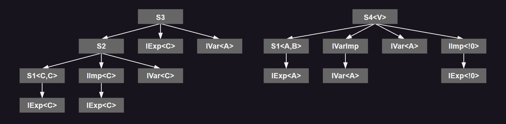

**类型声明顺序**：类型 `S2`，`S3` 和 `S4` 的类型声明顺序如下：

```
    S2    : IExp<C>, S1<C,C>, IImp<C>, IVar<C>, S2
    S3    : IExp<C>, S1<C,C>, IImp<C>, IVar<C>, S2, IVar<A>, S3
    S4<V> : IExp<A>, S1<A,B>, IVar<A>, IVarImp, IVar<B>, IExp<!0>, IImp<!0>, S4<!0>
```

`IExp<C>` 在 `S3` 的类型声明顺序中只出现一次，尽管它出现在 `IImp<C>` 下的树中。这是因为第二次出现是重复的。然而，`IExp<!0>` 出现在 `S4<V>` 的继承 / 实现树中，因为它不是 `IExp<A>` 的重复。

**方法声明顺序**：这些类型的方法声明顺序如下：

```
    S1<T,U>: S1<!0,!1>::MImpl(), S1<!0,!1>::P(!0), S1<!0,!1>::P(!1)
    S2     : S1<C,C>::MImpl(), S1<C,C>::P(!0:C), S1<C,C>::P(!1:C), S2::M()
    S3     : S1<C,C>::MImpl(), S1<C,C>::P(!0:C), S1<C,C>::P(!1:C), S3::M(), S3::P(A)
    S4<V>  : S1<A,B>::MImpl(), S1<A,B>::P(A), S1<A,B>::P(B), S4<!0>::M()
```

注意，**newslot** 方法在列表中单独出现，而重写则在列表中替换被重写的方法。上面的列表显示了扩展或实现类型声明的泛型参数替换，但使用 `!n` 表示法来标识定义类型中的原始类型参数，其中它是模糊的 (例如，`S1<C,C>::P(!0:C)` 指的是 `S1` 中的第一个 `P` 方法，其中第一个类型参数绑定到类型 `C`)。

以下是接口表：

 | 类        | 接口方法        | 实现列表                                                   |
 | --------- | --------------- | ---------------------------------------------------------- |
 | `S1<T,U>` | `IExp<T>::M()`  | `(IExp<!0>)S1<!0,!1>::MImpl()`                             |
 | `S2`      | `IVar<T>::P(T)` | `(IVar<C>)S1<C,C>::P(!1:C)`                                |
 | `S3`      | `IExp<T>::M()`  | `(IExp<C>)S3::M()`                                         |
 | &nbsp;    | `IVar<T>::P(T)` | `(IVar<A>)S3::P(A)`                                        |
 | `S4<V>`   | `IExp<T>::M()`  | `(IExp<!0>)S4<!0>::M()`                                    |
 | &nbsp;    | `IVar<T>::P(T)` | `(IVar<A>)S1<A,B>::P(!0:A)`<br>`(IVar<B>)S1<A,B>::P(!1:B)` |

以下是几个代码序列。这些序列假设 `a`、`c`、`s2`、`s3` 和 `s4` 分别是类型 `A`、`C`、`S2`、`S3` 和 `S4<A>` 的局部变量的索引。

> case 1：隐式实现<a id= "interface-impl-exam-1"></a>

 ```cil
 ldloc      s2
 callvirt   IExp<C>::M()  // 1: Calls S1<!0,!1>::MImpl()
 ```

尽管 `S2` 为 `IExp<C>::M()` 提供了一个匹配的方法，但它没有被添加到实现列表中，因为 `IExp<C>` 不是 `S2` 的显式接口，而且父类型 `S1<C,C>` 已经提供了一个匹配。

> case 2：显式实现<a id= "interface-impl-exam-2"></a>

 ```cil
 ldloc      s3
 callvirt   IExp<C>::M()  // 2: Calls S3::M()
 ```

对于 `S3` 的情况就不同了，因为 `IExp<C>` 是 `S3` 的显式接口，所以它的匹配 `M()` 方法被添加到了实现列表中。

> case 3：隐式实现与不同类型参数<a id= "interface-impl-exam-3"></a>

 ```cil
 ldloc      s4
 callvirt   IExp<A>::M()  // 3: Calls S4<A>::M()
 ```

`S4<V>` 是一个稍微不同的情况。虽然它只是隐式地实现了 `IExp<!0>`，但它在类型参数上与其父类实现的 `IExp<A>` 不同 (即，父类实例化固定为 `IExp<A>`，而隐式实现未绑定为 `IExp<!0>`)。所以它的匹配 `M()` 被添加到了列表中，并且即使当 `S4` 用显式父类实现的匹配类型参数实例化时，也会调用它，因为接口表是从开放类型构造的。

> case 4：实例化后的重复方法 (方法顺序) <a id= "interface-impl-exam-4"></a>

 ```cil
 ldloc      s2
 ldloc      c
 callvirt   IVar<C>::P(C) // 4: Calls S1<C,C>::P(!1:C)
 ```

`S1<C,C>` 上的两个 `P` 方法都匹配 `IVar<C>::P(C)`，保留最后一个匹配的方法。

> case 5：变体匹配 vs. 父类上的精确匹配<a id= "interface-impl-exam-5"></a>

 ```cil
 ldloc      s3
 ldloc      c
 callvirt   IVar<C>::P(C) // 5: Calls S3::P(A)
 ```

尽管 `S3::P(A)` 是 `IVar<C>::P(C)` 的变体匹配，但 `S2<A,B::IVar<A>::P(A)` 在其父类上是精确匹配。然而，变体匹配是在搜索父类型之前找到的。

> case 6：接口声明顺序<a id= "interface-impl-exam-6"></a>

 ```cil
 ldloc      s4
 ldloc      c
 callvirt   IVar<C>::P(C) // 6: Calls S1<A,B>::P(!0:A)
 ```

尽管 `IVar<A>` 不是 `S4<A>` 的显式接口，但它在接口顺序中排在 `IVar<B>` 之前。这就是为什么调用解析为 `S1<A,B>::P(!0:A)`，而不是 `S1<A,B>::P(!1:B)`。注意，这与 `S4<V>` 的类型参数无关，它只影响 `IImp<!0>` 接口实现。


---
## 11. 值类型的语义
<a id="valuetype-semantics"></a>

与引用类型不同，值类型 [[↗]](./01_CLI%20基本概念和体系结构.md/#valuetype-and-reference) 不是通过使用引用来访问，而是直接存储在该类型的位置中。

值类型用于描述小数据项的类型。它们可以与 C++ 中的结构体 (而不是指向结构体的指针) 类型进行比较。与引用类型相比，值类型的访问速度更快，因为没有额外的间接引用。作为数组的元素，它们不需要为指针以及数据本身分配内存。典型的值类型有复数、几何点和日期。

像其他类型一样，值类型可以有字段 (静态或实例) 、方法 (静态、实例或虚拟) 、属性、事件和嵌套类型。某个值类型的值可以通过一个称为 **装箱** (_boxing_) 的过程转换为相应引用类型的实例 (当定义值类型时，VES 会自动创建一个类作为其 **装箱形式**，_boxed form_)。装箱的值类型可以通过一个称为 **拆箱** (_unboxing_) 的过程转换回其值类型表示形式，即 **拆箱形式** (_unboxed form_)。值类型应该是密封的，并且它们应该有一个基类型，要么是 `System.ValueType`，要么是 `System.Enum`。值类型应该实现零个或多个接口，但这只在它们的装箱形式中有意义。

未装箱的值类型不被视为另一种类型的子类型，对未装箱的值类型使用 `isinst` 指令是无效的。然而，`isinst` 指令可以用于装箱的值类型。未装箱的值类型不应被赋值为 *null*，并且它们不应与 *null* 进行比较。

值类型支持与引用类型相同的布局控制 [[↗]](#ctrl-layout)。这在从本地代码导入值时尤其重要。

由于值类型表示数据的直接布局，因此不允许递归结构定义，例如 (在 C# 中) `struct S {S x; S y;}`。结构体应该有一个非循环的有限 **展平图** (***flattening graph***)：

对于值类型 *S*，定义 *S* 的展平图 *G* 为最小的有向图，满足：
 * *S* 在 *G* 中。
 * 每当 *T* 在 *G* 中，并且 *T* 有值类型 *X* 的实例字段，那么 *X* 在 *G* 中，并且从 *T* 到 *X* 有一条边。
 * 每当 *T* 在 *G* 中，并且 *T* 有值类型 *Y* 的静态字段，那么 *Y* 在 *G* 中。

```csharp
class C<U> { }
struct S1<V> {
    S1<V> x;
}
struct S2<V> {
    static S2<V> x;
}
struct S3<V> {
    static S3<C<V>> x;
}
struct S4<V> {
    S4<C<V>>[] x;
}
```

结构类型 `S1` 有一个有限但循环的展平图，是无效的；`S2` 有一个有限的非循环展平图，是有效的；`S3` 有一个无限的非循环展平图，是无效的；`S4` 有一个有限的非循环展平图，是有效的，因为字段 `S4<C<V>>.x` 是引用类型，而不是值类型。

`C<U>` 类型对于示例并不是严格必需的，但如果没有使用它，可能不清楚以下类型的问题是从字段类型中 `S3<...>` 的内部出现还是外部出现。

```csharp
struct S3<V> {
    static S3<S3<V>> x;
}
```

>---
### 11.1. 值类型的引用

值类型的非装箱形式应使用 **valuetype** 关键字后跟类型引用来引用。值类型的装箱形式应使用 **boxed** 关键字后跟类型引用来引用。

<pre>
    <em>ValueTypeReference</em> ::=  boxed <em>TypeReference</em> | valuetype <em>TypeReference</em> 
</pre>

```csharp
struct S
{   void Fun(S s, ref S rs, ValueType os, ref ValueType ros) { } }
```
```cil
.class S extends [System.Runtime]System.ValueType{
    .method instance void Fun (
			valuetype S s,
			valuetype S& rs,
			class [System.Runtime]System.ValueType os,
			class [System.Runtime]System.ValueType& ros
        ) cil managed { ... }        
}
```

>---
### 11.2. 初始化值类型

与类一样，值类型可以具有实例构造器 [[↗]](#type-constructor) 和类型初始化器 [[↗]](#type-initializer)。但不同于类的是，值类型中类类型的字段会自动初始化为 *null*，而以下规则是关于 (未装箱的) 值类型初始化的唯一保证：
 * 当类型被加载 [[↗]](#races-and-deadlocks) 时，静态变量应被初始化为零，因此当类型被加载时，类型为值类型的静态变量将被初始化为零。
 * 如果 _method header_ [[↗]](#method-header) 中设置了 **localsinit** 位，则局部变量应被初始化为零。
 * 数组应被初始化为零。
 * 在调用实例构造器之前，类的实例 (即，对象) 应被初始化为零。

保证未装箱值类型的自动初始化既困难又昂贵，尤其是在支持线程本地存储并允许在 CLI 外部创建线程并传递给 CLI 进行管理的平台上。
 
装箱的值类型是类，并遵循类的规则。

`initobj` 指令在程序控制下执行零初始化。如果值类型有一个构造器，那么可以创建其未装箱类型的实例，就像对类一样。`newobj` 指令与初始化器及其参数一起使用，以分配和初始化实例。值类型的实例将在堆栈上分配。基类库提供了 `System.Array.Initialize` 方法来将未装箱值类型的数组中的所有实例初始化为零。

下面的代码声明并初始化了三个值类型变量。第一个变量被初始化为零，第二个通过调用实例构造器进行初始化，第三个通过在堆栈上创建对象并将其存储到局部变量中进行初始化。

```cil
.assembly Test { }
.assembly extern System.Drawing {
    .ver 1:0:3102:0
    .publickeytoken = (b03f5f7f11d50a3a)
}
 
.method public static void Start()
{   
    .maxstack 3
    .entrypoint
    .locals init (valuetype [System.Drawing]System.Drawing.Size Zero,
                  valuetype [System.Drawing]System.Drawing.Size Init,
                  valuetype [System.Drawing]System.Drawing.Size Store)

    // Zero initialize the local named Zero
    ldloca Zero           // load address of local variable
    initobj valuetype [System.Drawing]System.Drawing.Size

    // Call the initializer on the local named Init
    ldloca Init           // load address of local variable
    ldc.i4 425            // load argument 1 (width)
    ldc.i4 300            // load argument 2 (height) 
    call instance void [System.Drawing]System.Drawing.Size::.ctor(int32, int32) 

    // Create a new instance on the stack and store into Store. Note that
    // stobj is used here - but one could equally well use stloc, stfld, etc.
    ldloca Store
    ldc.i4 425            // load argument 1 (width)
    ldc.i4 300            // load argument 2 (height)
    newobj instance void [System.Drawing]System.Drawing.Size::.ctor(int32, int32)
    stobj valuetype [System.Drawing]System.Drawing.Size
    ret
}
```

### 11.3. 值类型的方法

值类型可以有静态、实例和虚方法。值类型的静态方法的定义和调用方式与类类型的静态方法相同。与类一样，可以使用 `call` 指令调用装箱或未装箱值类型的实例和虚方法。`callvirt` 指令不应用于未装箱的值类型，但可以用于装箱的值类型。

类的实例和虚方法应被编码为期望将类实例的引用作为 `this` 指针。相比之下，值类型的实例和虚方法应被编码为期望将值类型的未装箱实例的托管指针。当将装箱值类型作为 `this` 指针传递给由未装箱值类型提供实现的虚方法时，CLI 应将装箱值类型转换为未装箱值类型的托管指针。

此操作与拆箱实例相同，因为 `unbox` 指令被定义为返回一个与原始装箱实例共享内存的值类型的托管指针。下图表示值类型的装箱和未装箱表示之间的关系。

 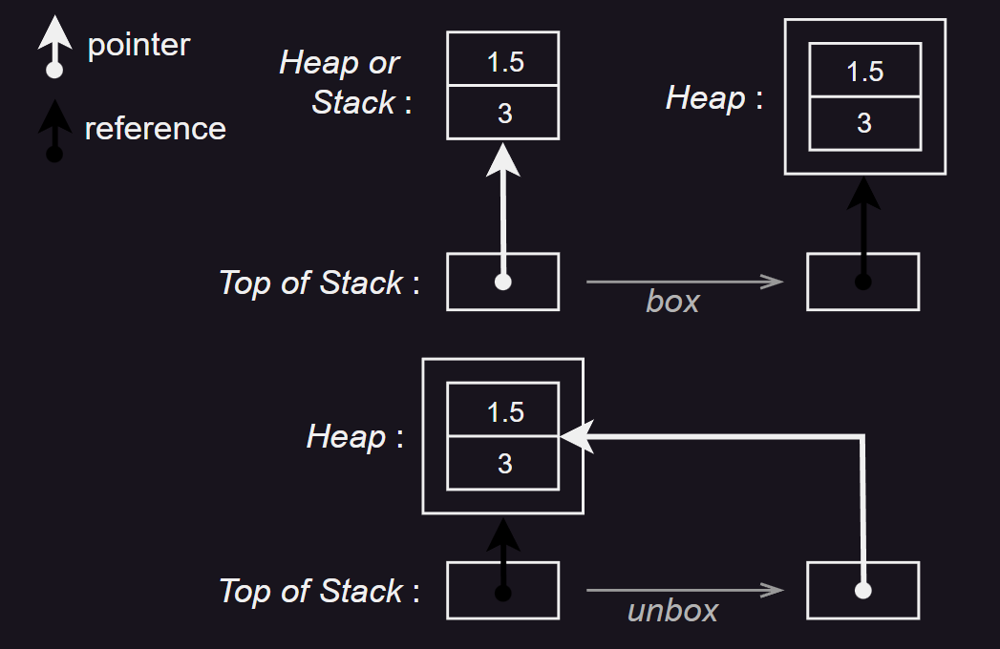

在值类型上使用实例方法的一个重要用途是改变实例的内部状态。如果使用未装箱值类型的实例作为 `this` 指针，这是无法做到的，因为它将操作值的副本，而不是原始值：当将未装箱的值类型作为参数传递时，它们会被复制。

虚方法被用来使多种类型能够共享实现代码，这要求所有实现虚方法的类共享由首次引入方法的类定义的公共表示。由于值类型可以 (并且在基类库中确实可以) 实现 `System.Object` 上定义的接口和虚方法，因此重要的是虚方法可以使用装箱的值类型进行调用，因此可以像操作实现接口的任何其他类型一样操作它。这也致使要求执行环境 (_Execution Environment_) 在虚拟调用上自动拆箱值类型。

> 给定 CIL 指令和实例方法声明类型下的 `this` 指针类型

 | &nbsp;     | 值类型 (装箱或未装箱) 方法 | 接口方法 | 对象类型方法 |
 | ---------- | -------------------------- | -------- | ------------ |
 | `call`     | 值类型的托管指针           | 无效     | 对象引用     |
 | `callvirt` | 值类型的托管指针           | 对象引用 | 对象引用     |

以下将值类型 `int32` 的整数转换为字符串。`int32` 对应于基类库中定义的未装箱值类型 `System.Int32`。假设整数声明为：

 ```cil
 .locals init (int32 x)
 ```

然后如下所示进行调用：

 ```cil
 ldloca x  // load managed pointer to local variable
 call instance string valuetype [mscorlib]System.Int32::ToString()
 ```

然而，如果使用 `System.Object` (一个类) 作为类型引用，而不是 `System.Int32` (一个值类型)，则在调用之前应将 `x` 的值装箱，代码变为：

 ```cil
 ldloc x
 box valuetype [mscorlib]System.Int32
 callvirt instance string [mscorlib]System.Object::ToString()
 ```

---
## 12. 特殊类型的语义

特殊类型是指那些从 CIL 引用但没有提供定义的类型：VES 根据来自引用的可用信息自动提供定义。

>---
### 12.1. 向量
<a id="vector"></a>

<pre>
    <em>Type</em> ::= ... | <em>Type</em> '[' ']' 
</pre>

向量是具有零下界的单维数组。它们在 CIL 指令中有直接支持 (`newarr`、`ldelem`、`stelem` 和 `ldelema`)。CIL 框架还提供了处理多维数组和具有非零下界的单维数组的方法 [[↗]](#array)。如果两个向量的元素类型相同，无论它们的实际上界如何，它们都具有相同的类型。

向量具有固定的大小和元素类型，这些在创建时确定。所有的 CIL 指令都应该遵守这些值。也就是说，它们应该可靠地检测以下尝试：索引超出向量的末尾，将错误类型的数据存储到向量的元素中，以及获取数据类型不正确的向量元素的地址。

声明一个字符串的向量：

 ```cil
 .field string[] errorStrings
 ```

声明一个函数指针的向量：

 ```cil
 .field method instance void*(int32) [] myVec
 ```

创建一个包含 4 个字符串的向量，并将其存储到字段 `errorStrings` 中。这 4 个字符串位于 `errorStrings[0]` 到 `errorStrings[3]`：

 ```cil
 ldc.i4.4
 newarr string
 stfld string[] CountDownForm::errorStrings
 ```

将字符串 `"First"` 存储到 `errorStrings[0]`：

 ```cil
 ldfld string[] CountDownForm::errorStrings
 ldc.i4.0
 ldstr "First"
 stelem
 ```

向量是 `System.Array` 的子类型，`System.Array` 是 CLI 预定义的一个抽象类。它提供了可以应用于所有向量的几个方法。

>---
### 12.2. 数组
<a id="array"></a>

尽管向量通过 CIL 指令直接支持，但 VES 通过创建抽象类 `System.Array` 的子类型来支持所有其他数组。

<pre>
    <em>Type</em> ::= ... | <em>Type</em> '[' [ <em>Bound</em> [ ',' <em>Bound</em> ]*] ']' 
</pre>

数组的 *rank* 是其维度的数量。CLI 不支持秩为 0 的数组。数组 (向量除外) 的类型应由其元素的类型和维度的数量确定。

 | _Bound_ ::=                | 描述                                                   |
 | :------------------------- | ------------------------------------------------------ |
 | `'...'`                    | 下界和上界未指定。在多维数组的情况下，可以省略 `'...'` |
 | \| _Int32_                 | 零下界，_Int32_ 上界                                   |
 | \| _Int32_ `'...'`         | 只指定了下界                                           |
 | \| _Int32_ `'...'` _Int32_ | 同时指定了上下界                                       |

VES 为数组创建的类包含几个由 VES 提供实现的方法：
 * 一个构造函数，它接受一系列 `int32` 参数，每个维度一个，这些参数指定从第一个维度开始的每个维度中的元素数量。假定下界为零。
 * 一个构造函数，它接受的 `int32` 参数的数量是数组维度的两倍。这些参数成对出现 —— 每个维度一对 —— 每对的第一个参数指定该维度的下界，第二个参数指定该维度的元素总数。注意向量不是用这个构造函数创建的，因为向量假定下界为零。
 * 一个 `Get` 方法，它接受一系列 `int32` 参数，每个维度一个，并返回一个值，其类型是数组的元素类型。此方法用于访问数组的特定元素，其中参数指定要返回的元素的每个维度的索引，从第一个开始。
 * 一个 `Set` 方法，它接受一系列 `int32` 参数，每个维度一个，后面跟着一个值，其类型是数组的元素类型。`Set` 的返回类型是 `void`。此方法用于设置数组的特定元素，其中参数指定要设置的元素的每个维度的索引，从第一个开始，最后一个参数指定要存储到目标元素中的值。
 * 一个 `Address` 方法，它接受一系列 `int32` 参数，每个维度一个，其返回类型是数组元素类型的托管指针。此方法用于返回数组的特定元素的托管指针，其中参数指定要返回其地址的元素的每个维度的索引，从第一个开始。

下面创建了一个字符串的数组 `MyArray`，有两个维度，索引为 5…10 和 3…7。然后它将字符串 `"One"` 存储到 `MyArray[5, 3]` 中，检索它并打印出来。然后它计算 `MyArray[5, 4]` 的地址，将 `"Test"` 存储到其中，检索它，并打印出来。

```csharp
// 可以视为在 CSharp 中的等效代码
static void Start()
{
    string[,] myArray = (string[,]) Array.CreateInstance(typeof(string), [6, 5], [5, 3]);
    myArray[5,3] = "One";
    Console.WriteLine(myArray[5, 3]);
    ref var ro  = ref myArray[5, 4];
    ro = "Test";
    Console.WriteLine(myArray[5, 4]);
}
```
```cil
.assembly Test { }
.assembly extern mscorlib { }

.method public static void Start()
{ 
    .maxstack 5
    .entrypoint
    .locals (class [mscorlib]System.String[,] myArray)

    ldc.i4.5 // 加载维度 1 的下界
    ldc.i4.6 // 加载维度 1 的 (上界 - 下界 + 1) 
    ldc.i4.3 // 加载维度 2 的下界
    ldc.i4.5 // 加载维度 2 的 (上界 - 下界 + 1) 
    newobj instance void string[,]::.ctor(int32, int32, int32, int32)
    stloc  myArray

    ldloc myArray
    ldc.i4.5
    ldc.i4.3
    ldstr "One"
    call instance void string[,]::Set(int32, int32, string)

    ldloc myArray
    ldc.i4.5
    ldc.i4.3
    call instance string string[,]::Get(int32, int32)
    call void [mscorlib]System.Console::WriteLine(string)

    ldloc myArray
    ldc.i4.5
    ldc.i4.4
    call instance string & string[,]::Address(int32, int32)
    ldstr "Test"
    stind.ref

    ldloc myArray
    ldc.i4.5
    ldc.i4.4
    call instance string string[,]::Get(int32, int32)
    call void [mscorlib]System.Console::WriteLine(string)

    ret
}
```

在多维数组中，元素可以被认为是在连续的内存中布局的，但是数组的数组则不同 —— 数组的每个维度 (除最后一个外) 都持有一个数组引用。例如：

 

左边是一个 [6, 10] 的矩形数组。右边不是一个而是五个数组。垂直数组是一个数组的数组，它引用了四个水平数组。垂直数组的第一和第二元素都引用了同一个水平数组。

多维数组的所有维度都应该有相同的大小。但是在数组的数组中，可以引用不同大小的数组。例如，右边的图显示了垂直数组引用了长度为 7，7，2，null (即，没有数组)，4 和 1 的数组。

在 CIL 指令集或 VES 中，这些所谓的 *锯齿形数组* 没有特殊的支持。它们只是向量，其元素可以引用其他 (递归地) 锯齿形数组。

>---
### 12.3. 枚举

**枚举** (*enumeration*，简称 *enum*) 定义了一组具有相同类型的符号。一个类型当且仅当它的直接基类型为 `System.Enum` 时才是枚举。由于 `System.Enum` 本身的直接基类型为 `System.ValueType`，枚举是值类型。枚举的符号由 **底层** (_underlying_) 整数类型 (`bool`, `char`, `int8`, `unsigned int8`, `int16`, `unsigned int16`, `int32`, `unsigned int32`, `int64`, `unsigned int64`, `native int`, `unsigned native int`) 之一表示。

与 Pascal 不同，CLI 并不保证枚举类型的值是与其中一个符号对应的整数。实际上，CLS 定义了一种使用枚举来表示位标志的约定，这些位标志可以组合形成枚举类型本身未命名的整数值 [[↗]](./01_CLI%20基本概念和体系结构.md/#enum-flags)。

枚举遵守其他值类型之外的一些额外限制。枚举只能包含字段作为成员 (它们甚至不能定义类型初始化器或实例构造器)；它们不应实现任何接口；它们应具有自动字段布局；它们应有且只有一个实例字段，且该字段应为枚举的底层类型；所有其他字段应为 **static** 和 **literal** [[↗]](#field-attr)；并且它们不应使用 `initobj` 指令进行初始化。这些限制使得枚举具有非常高效的实现。

单个必需的实例字段存储枚举实例的值。枚举的 **static literal** 字段声明了枚举符号到底层值的映射。所有这些字段都应具有枚举的类型，并应具有为它们赋值的字段初始化元数据 [[↗]](#field-init)。

出于绑定目的 (例如，为了从用于调用它的方法引用中定位方法定义)，枚举应与其底层类型区分开来。对于所有其他目的，包括代码的验证和执行，未装箱的枚举可以自由地与其底层类型互换。枚举可以被装箱为相应的装箱实例类型，但是这种类型不与底层类型的装箱类型相同，因此装箱不会丢失枚举的原始类型。

下面示例声明一个枚举类型，然后创建该类型的局部变量。将底层类型的常量存储到枚举中 (显示为从底层类型到枚举类型的自动强制转换)。返回加载枚举并将其作为底层类型打印 (显示自动强制转换返回)。最后，加载枚举的地址并提取实例字段的内容，然后将其打印出来。

```cil
.assembly Test { }
.assembly extern mscorlib { }

.class sealed public ErrorCodes extends [mscorlib]System.Enum
{ 
    .field public unsigned int8 MyValue
    .field public static literal valuetype ErrorCodes no_error = int8(0)
    .field public static literal valuetype ErrorCodes format_error = int8(1)
    .field public static literal valuetype ErrorCodes overflow_error = int8(2)
    .field public static literal valuetype ErrorCodes nonpositive_error = int8(3)
}

.method public static void Start()
{ 
    .maxstack 5
    .entrypoint
    .locals init (valuetype ErrorCodes errorCode)

    ldc.i4.1           // load 1 (= format_error)
    stloc errorCode    // store in local, note conversion to enum
    ldloc errorCode
    call void [mscorlib]System.Console::WriteLine(int32)
    ldloca errorCode   // address of enum
    ldfld unsigned int8 valuetype ErrorCodes::MyValue
    call void [mscorlib]System.Console::WriteLine(int32)
    ret
}
```

>---
### 12.4. 指针类型
<a id="pointer"></a>

<pre>
    <em>Type</em> ::= ... | <em>Type</em>'&' | <em>Type</em>'*'
</pre>

**指针类型** (_pointer type_) 应通过指定一个包含其指向位置的类型签名来定义。*指针* 可以是托管的 (_managed_，报告给 CLI 垃圾收集器，由 `&` 表示) 或 **非托管的** (_unmanaged_，不报告给 CLI 垃圾收集器，由 `*` 表示) 

**指针** (_pointers_) 可以包含字段 (对象或值类型) 的地址，或数组元素的地址。指针与对象引用的不同之处在于，它们不指向整个类型实例，而是指向实例的内部。CLI 提供了两种对指针的类型安全操作：
 * 加载指针引用位置的值。
 * 将值 _V_ 存储到指针 _P_ 引用的位置，其中 _V_ 的类型是 *可赋值给* _P_ 引用的类型。

对于指向同一数组或对象的指针，支持以下算术操作：

 * 将一个整数值加到一个指针上 (其中该值被解释为字节数)，结果是同一种类的指针
 * 从指针中减去一个整数值 (其中该值被解释为字节数)，结果是同一种类的指针。不允许从整数值中减去一个指针。
 * 两个指针，无论种类如何，都可以相互减去，产生一个整数值，该值指定它们引用的地址之间的字节数。

指针在 32 位架构上与 `unsigned int32` 兼容，在 64 位架构上与 `unsigned int64` 兼容。它们最好被视为 `unsigned int`，其大小根据运行时机器架构的不同而变化。

CIL 指令集包含计算字段、局部变量、参数和向量元素地址的指令：

 | 指令      | 描述               |
 | --------- | ------------------ |
 | `ldarga`  | 加载参数的地址     |
 | `ldelema` | 加载向量元素的地址 |
 | `ldflda`  | 加载字段的地址     |
 | `ldloca`  | 加载局部变量的地址 |
 | `ldsflda` | 加载静态字段的地址 |

一旦一个指针被加载到堆栈上，`ldind` 种类的指令可以用来加载它指向的数据项。同样，`stind` 种类的指令可以用来将数据存储到位置。

如果地址不在当前应用程序域内，CLI 将为 `ldflda` 指令抛出 `InvalidOperationException`。这种情况通常只出现在使用基类型为 `System.MarshalByRefObject` 的对象时。

#### 12.4.1. 非托管指针
<a id="unmanaged-pointer"></a>

非托管指针 (`*`) 是 C 和 C++ 等语言中使用的传统指针。它们的使用没有限制，尽管在大多数情况下，它们可能会导致无法验证的代码。虽然将包含非托管指针的位置标记为无符号整数是完全有效的 (实际上，VES 就是这样处理它们的)，但通常最好将它们标记为指向特定数据类型的非托管指针。这是通过在返回值、局部变量或参数的签名中使用 `*` 来实现，或者在字段或数组元素中使用指针类型来实现。

 * 非托管指针不会被报告给垃圾收集器，并且可以以任何方式使用，就像整数一样。
 * 可验证的代码不能解引用非托管指针。
 * 未验证   的代码可以将非托管指针传递给期望托管指针的方法。只有在以下情况之一为真时，这才是安全的：
     1. 非托管指针引用的内存不在 CLI 用于存储对象实例的内存中 (“垃圾收集内存” 或 “托管内存”)。
     2. 非托管指针包含对象内字段的地址。
     3. 非托管指针包含数组元素的地址。
     4. 非托管指针包含数组中最后一个元素后面的元素所在的地址。

#### 12.4.2. 托管指针
<a id="managed-pointer"></a>

托管指针 (`&`) 可以指向值类型的实例、对象的字段、值类型的字段、数组的元素，或者存储数组末尾刚过去的元素的地址 (用于指向托管数组的指针索引)。托管指针不能为 *null*，即使它们不指向托管内存，也应该报告给垃圾收集器。

托管指针是通过在返回值、局部变量或参数的签名中使用 `&`，或者在字段或数组元素中使用 **byref** 类型来指定的。

 * 托管指针可以作为参数传递，存储在局部变量中，并作为值返回。
 * 如果参数是通过引用传递的，那么相应的参数就是一个托管指针。
 * 托管指针不能存储在静态变量、数组元素或对象或值类型的字段中。
 * 托管指针与对象引用不可互换。
 * 托管指针不能指向另一个托管指针，但它可以指向对象引用或值类型。
 * 托管指针可以指向局部变量，或方法参数
 * 不指向托管内存的托管指针可以被转换 (使用 `conv.u` 或 `conv.ovf.u`) 为非托管指针，但这是不可验证的。
 * 错误地将托管指针转换为非托管指针的未验证代码可能会严重损害 CLI 的完整性。

>---
### 12.5. 方法指针
<a id="method-pointer"></a>

<pre>
    <em>Type</em> ::= ... | method <em>CallConv</em> <em>Type</em> '*' '(' <em>Parameters</em> ')'
</pre>

方法指针类型的变量应存储指向方法入口点的地址，该方法的签名与方法指针的类型 **方法签名兼容** (*method-signature-compatible-with*)。可以使用 `ldftn` 指令获取静态或实例方法的指针，而可以使用 `ldvirtftn` 指令获取虚方法的指针。可以使用 `calli` 指令并通过方法指针调用方法。

像其他指针一样，方法指针在 64 位架构上与 `unsigned int64` 兼容，在 32 位架构上与 `unsigned int32` 兼容。然而，首选的用法是 `unsigned native int`，它在 32 位和 64 位架构上都可以工作。

以下示例使用指针调用方法。方法 `MakeDecision::Decide` 返回一个指向 `AddOne` 或 `Negate` 的方法指针，每次调用时交替。主程序调用 `MakeDecision::Decide` 三次，每次调用后使用 `calli` 指令调用指定的方法。打印的输出是 "`-1 2 -1`" 时，表示成功的交替调用。

```cil
.assembly Test { }
.assembly extern mscorlib { }
 
.method public static int32 AddOne(int32 Input)
{ 
    .maxstack 5

    ldarg Input
    ldc.i4.1
    add
    ret
}

.method public static int32 Negate(int32 Input)
{ 
    .maxstack 5

    ldarg Input
    neg
    ret
}

.class value sealed public MakeDecision extends
       [mscorlib]System.ValueType
{ 
    .field static bool Oscillate
    .method public static method int32 *(int32) Decide()
    { 
        ldsfld bool valuetype MakeDecision::Oscillate
        dup
        not
        stsfld bool valuetype MakeDecision::Oscillate
        brfalse NegateIt
        ldftn int32 AddOne(int32)
        ret

    NegateIt:
        ldftn int32 Negate(int32)
        ret
    }
}

.method public static void Start()
{ 
    .maxstack 2
    .entrypoint

    ldc.i4.1
    call method int32 *(int32) valuetype MakeDecision::Decide()
    calli int32(int32)
    call  void [mscorlib]System.Console::WriteLine(int32)

    ldc.i4.1
    call method int32 *(int32) valuetype MakeDecision::Decide()
    calli int32(int32)
    call  void [mscorlib]System.Console::WriteLine(int32)

    ldc.i4.1
    call method int32 *(int32) valuetype MakeDecision::Decide()
    calli int32(int32)
    call  void [mscorlib]System.Console::WriteLine(int32)

    ret
}
```

>---
### 12.6. 委托
<a id= "delegate"></a>

委托 [[↗]](./01_CLI%20基本概念和体系结构.md/#delegate-types) 是函数指针的面向对象等价物。与函数指针不同，委托是面向对象的、类型安全的，并且安全。委托是引用类型，并以类的形式声明。委托应具有 `System.Delegate` 基类型。

委托应声明为密封的，委托应具有的唯一成员是这里指定的前两个或所有四个方法。这些方法应声明为 **runtime** 和 **managed** (参见 [_方法的实现特性_](#method-init-attr) )。它们不应有主体，因为该主体将由 VES 自动创建。委托上可用的其他方法是从基类库中的类 `System.Delegate` 继承的。委托方法包括：
 * 实例构造函数 (名为 `.ctor` 并标记为 **specialname** 和 **rtspecialname**，参见 [_类型构造器_](#type-constructor) ) 应恰好接受两个参数，第一个参数的类型为 `System.Object`，第二个参数的类型为 `System.IntPtr`。当实际调用时 (通过 `newobj` 指令)，第一个参数应是定义目标方法的类 (或其派生类) 的实例，第二个参数应是要调用方法的方法指针。
 + `Invoke`方法应为 **virtual**，其签名约束了可以绑定的目标方法，参见 [_委托签名的兼容性_](#delegate-signature)。验证器将对委托上 `Invoke` 方法的调用等同于对任何其他方法的调用。

 * 如果存在，`BeginInvoke` 方法 [[↗]](#delegate-begininvoke) 应为 **virtual** 的，并且具有与 `Invoke` 方法相关但不相同的签名。签名有两处不同。首先，它的返回类型应为 `System.IAsyncResult`。其次，在 `Invoke` 的参数之后还有两个额外的参数：第一个类型为 `System.AsyncCallback`，第二个类型为 `System.Object`。

 + `EndInvoke` 方法 [[↗]](#delegate-endinvoke) 应为 **virtual**，并具有与 `Invoke` 方法相同的返回类型。它应接受与 `Invoke` 中托管指针的参数作为参数，与它们在 `Invoke` 的签名中出现的顺序相同。此外，应有一个额外的类型为 `System.IAsyncResult` 的参数。

除非另有说明，标准委托类型应提供两个可选的异步方法：`BeginInvoke` 和 `EndInvoke`。

下面声明了一个用于调用接受单个整数并返回无结果的函数的委托。它提供了所有四个方法，因此可以同步或异步调用。因为没有参数是通过引用传递的 (即，作为托管指针)，所以 `EndInvoke` 没有额外的参数。

<a id="dele-exam"></a>

```csharp
delegate void StartStopEventHandler(int action);
```
```cil
.assembly Test { }
.assembly extern mscorlib { }

.class private sealed StartStopEventHandler extends [mscorlib]System.Delegate
{ 
    .method public specialname rtspecialname instance void .ctor(object Instance,  
        native int Method) runtime managed {}
  
    .method public virtual void Invoke(int32 action) runtime managed {}
    
    .method public virtual class [mscorlib]System.IAsyncResult BeginInvoke(
        int32 action, class [mscorlib]System.AsyncCallback callback,
        object Instance) runtime managed {}
  
    .method public virtual void EndInvoke(class
        [mscorlib]System.IAsyncResult result) runtime managed {}
}
```

与任何类一样，使用 `newobj` 指令与实例构造函数一起创建委托实例。构造函数的第一个参数应该是要调用该方法的对象，如果方法是静态方法，则该参数应为 null。第二个参数应该是指向对应类上的方法的方法指针，并且具有与被实例化的委托类相匹配的签名。

#### 12.6.1. 委托签名兼容性
<a id="delegate-signature"></a>

本节定义了 ***委托可赋值给*** (_delegate-assignable-to_) 的关系，它是 *方法签名兼容* ([[↗]](./01_CLI%20基本概念和体系结构.md/#method-signature-compatible-with)) 的变体，并涵盖了委托构造。

委托通过 `newobj` 指令绑定到目标方法，如果目标是实例方法，则传递目标方法的方法指针和对象引用；如果目标是静态方法，则传递目标方法指针和 null。方法的签名可用时，通过 `ldftn`、`ldvirtftn` 或任一的 *load* IL 指令将目标方法加载到求值堆栈上。

**委托的签名** (_signature of a delegate_) 是委托类型上的 `Invoke` 方法的签名。签名不包括在委托创建时绑定的 **this** 指针的类型 (如果有)。

委托只能在以下情况下可验证时才能绑定到目标方法：
 1. 目标方法的签名是 *委托可赋值给* 委托的签名；
 2. 如果目标是实例方法，对象引用的验证类型是 *验证可赋值给* 目标方法的 `this` 签名；如果目标方法是静态方法，对象引用的验证类型则是 `null`。

委托构造的特殊验证规则由 `newobj` 指令捕获。

*委托可赋值给* 关系是根据参数类型定义的，忽略任何 **this** 参数 (如果有) 、返回类型和调用约定。自定义修饰符不被视为必要，也不会影响兼容性。

当且仅当满足以下所有条件时，类型为 _T_ 的目标方法或委托是 *委托可赋值给* 类型为 _D_ 的委托：
 1. _T_ 和 _D_ 的调用约定应完全匹配，忽略静态方法和实例方法之间的区别 (即，**this** 参数 (如果有) 不被特殊对待)。*委托可赋值给* 不考虑 **this** 的类型 (如果有)，这是由上述额外的验证规则所涵盖的。
 2. _T_ 和 _D_ 具有相同数量的参数，如果 _T_ 是方法，则忽略任何 `this` 参数。
 3. 对于 _T_ 的每个参数类型 _U_，如果 _T_ 是方法，则忽略任何 `this` 参数，以及 _D_ 的对应类型 _V_，_U_ 是 *可赋值给*[[↗]](./01_CLI%20基本概念和体系结构.md/#assignable-to) _V_。

 4. _T_ 的返回类型 _U_ 和 _D_ 的返回类型 _V_，_V_ 是 *可赋值给* _U_。

#### 12.6.2. 对委托的同步调用

对委托的同步调用方式对应于常规的方法调用，通过在委托上调用名为 `Invoke` 的虚方法来执行。委托本身是此调用的第一个参数 (它充当 **this** 指针)，后面跟着签名中指定的其他参数。进行此调用时，调用方将阻塞，直到被调用的方法返回。被调用的方法应在与调用方相同的线程上执行。

继续前面的 [示例](#dele-exam)，定义一个类 `Test`，该类声明了一个方法 `onStartStop`，适合用作委托的目标。

```cil
.class public Test
{ 
    .field public int32 MyData
    .method public void onStartStop(int32 action)
    { 
        // put your code here
        ret
    }
    .method public specialname rtspecialname instance void .ctor(int32 Data)
    {   
        // call base class constructor, store state, etc.
        ret        
    }
}
```

然后定义一个主程序。这个程序构造了一个 `Test` 的实例，然后创建了一个指向该实例的 `onStartStop` 方法的委托。最后，调用委托。

```cil
.method public static void Start()
{ 
    .maxstack 3
    .entrypoint
    .locals (
        class StartStopEventHandler DelegateOne,
        class Test InstanceOne )
    
    // Create instance of Test class
    ldc.i4.1
    newobj instance void Test::.ctor(int32)
    stloc InstanceOne 

    // Create delegate to onStartStop method of that class
    ldloc InstanceOne
    ldftn instance void Test::onStartStop(int32)
    newobj void StartStopEventHandler::.ctor(object, native int)
    stloc DelegateOne

    // Invoke the delegate, passing 100 as an argument
    ldloc DelegateOne
    ldc.i4 100
    callvirt instance void StartStopEventHandler::Invoke(int32)
    ret
}
```

注意，上面的示例创建了一个非虚函数的委托。如果 `onStartStop` 是一个虚函数，使用以下代码序列代替：

```cil
    ldloc InstanceOne
    dup
    ldvirtftn instance void Test::onStartStop(int32)
    newobj void StartStopEventHandler::.ctor(object, native int)
    stloc DelegateOne

    // Invoke the delegate, passing 100 as an argument
    ldloc DelegateOne
```

上面的代码序列应使用 `dup` —— 而不是两次 `ldloc InstanceOne`。`dup` 代码序列很容易被识别为类型安全的，而替代方案则需要更复杂的分析。代码的可验证性在第三部分中讨论。

#### 12.6.3. 委托的异步调用

在异步模式下，调用被分派，调用方将继续执行而不等待方法返回。被调用的方法将在一个单独的线程上执行。使用 `BeginInvoke` 和 `EndInvoke` 方法异步调用委托。

如果调用方线程在被调用方完成之前终止，被调用方线程不受影响。被调用方线程继续执行并静默终止。被调用方可以抛出异常，任何未处理的异常通过 `EndInvoke` 方法传播到调用方。

##### 12.6.3.1. BeginInvoke 方法
<a id="delegate-begininvoke"></a>

对委托的异步调用应该从对 `BeginInvoke` 方法的虚调用开始。`BeginInvoke` 类似于 `Invoke` 方法，但有两个不同之处：
 * 它有两个额外的参数，附加到列表中，类型为 `System.AsyncCallback` 和 `System.Object`。
 * 方法的返回类型是 `System.IAsyncResult`。

尽管 `BeginInvoke` 方法因此包括表示返回值的参数，但这些值不会被此方法更新。结果反而是从 `EndInvoke` 方法获取的。与同步调用不同，异步调用应该为调用方提供一种确定调用何时完成的方式。CLI 提供了两种这样的机制。第一种是通过调用返回的结果对象，这个对象是接口 `System.IAsyncResult` 的一个实例，可以用来等待计算结果，也可以查询该结果值以获取方法调用的当前状态，并且它包含传递给 `BeginInvoke` 调用的 `System.Object` 值。

第二种机制是通过传递给 `BeginInvoke` 的 `System.AsyncCallback` 委托。当计算完成或者已经引发了异常致使结果不可用时，VES 将调用这个委托。传递给这个回调委托的值与调用 `BeginInvoke` 返回的值相同。可以为 `System.AsyncCallback` 传递 null 值，以表示 VES 不需要提供回调。

这种模型支持对异步调用的轮询方法 (通过检查返回的 `System.IAsyncResult` 的状态) 和事件驱动方法 (通过提供 `System.AsyncCallback`)。

同步调用通过其返回值和输出参数返回信息。输出参数在 CLI 中表示为具有托管指针类型的参数。只有当 VES 信号异步调用已成功完成时，返回的值和输出参数的值才可用。它们是通过调用开启异步调用委托上的 `EndInvoke` 方法来检索的。

##### 12.6.3.2. EndInvoke 方法
<a id="delegate-endinvoke"></a>

`EndInvoke` 方法可以在 `BeginInvoke` 之后的任何时间被调用。它将暂停调用它的线程，直到异步调用完成。如果调用成功完成，`EndInvoke` 将返回同步调用委托时本应返回的值，而其托管指针参数将指向同步调用的 `out` 参数本应返回的值。

`EndInvoke` 需要作为参数的是原始调用 `BeginInvoke` 返回的值 (这样可以区分对同一委托的不同调用，因为它们可以并发执行)，以及作为参数传递的任何托管指针 (这样可以提供它们的返回值)。

---
## 13. 方法定义、方法引用和方法调用
<a id="method"></a>

方法可以在全局级别 (在任何类型之外) 定义：

<pre>
    <em>Decl</em> ::= ... | .method <em>MethodHeader</em> '{' <em>MethodBodyItem</em>* '}'
</pre>

也可以在类型内部定义：

<pre>
    <em>ClassMember</em> ::= ... | .method <em>MethodHeader</em> '{' <em>MethodBodyItem</em>* '}'
</pre>

>---
### 13.1. 方法描述符

方法描述符在 ILAsm 中有四种结构与方法相关。这些结构对应于不同的元数据结构。参见 [_元数据逻辑格式_](#metadata-format-others)。

#### 13.1.1. MethodDecl：方法声明
<a id= "MethodDecl"></a>

_MethodDecl_ 或方法声明提供了方法名称和签名 (参数和返回类型)，但没有提供其主体。也就是说，方法声明提供了一个 _MethodHeader_，但没有 _MethodBodyItems_。它们在调用点被用来指定一个调用目标 (`call` 或 `callvirt` 指令) 或声明一个抽象方法。_MethodDecl_ 在元数据中没有直接的逻辑对应项：它可以是 _Method_ 或 _MethodRef_。

#### 13.1.2. Method：方法定义
<a id="Method"></a>

一个 _Method_，或者说方法定义，提供了方法名、特性、签名和主体。也就是说，一个方法定义提供了一个 _MethodHeader_ 以及一个或多个 _MethodBodyItems_。主体包括方法的 CIL 指令、异常处理程序、局部变量信息，以及关于方法的其他运行时或自定义元数据。参见 [「_MethodDef: 0x06_」](#MethodDef_0x06)。

#### 13.1.3. MethodRef：方法引用
<a id ="MethodRef"></a>

_MethodRef_ 或方法引用，是对方法的引用。当调用一个方法且该方法的定义位于另一个模块或程序集中时，就会使用它。在运行时调用方法之前，VES 应将 _MethodRef_ 解析为 _Method_。如果找不到匹配的 _Method_，VES 将抛出 `System.MissingMethodException`。参见 [「_MemberRef: 0x0A_」](#MemberRef_0x0A)。

#### 13.1.4. MethodImpl：方法实现
<a id="MethodImpl"></a>

_MethodImpl_ 或方法实现为现有的虚方法提供可执行的主体。它将一个 _Method_ (代表主体) 与一个 _MethodDecl_ 或 _Method_ (代表虚方法) 关联起来。当默认机制 (通过名称和签名匹配) 不能提供正确的结果时，_MethodImpl_ 用于为继承的虚方法或接口的虚方法提供实现。参见 [「_MethodImpl: 0x19_」](#MethodImpl_0x19)。

>---
### 13.2. 静态、实例和虚方法
<a id="method-static-instance-virtual"></a>

静态方法是与类型关联的方法，而不是与其实例关联的。

实例方法与类型的实例关联：在实例方法的主体内，可以引用正在操作的特定实例 (通过 *this* 指针)。因此，实例方法只能在类或值类型中定义，而不能在接口或类型之外 (即全局) 定义。然而要注意：
 - 类 (包括装箱的值类型) 上的实例方法，默认情况下有一个 *this* 指针，它是对定义该方法的类的对象引用。
 -  (未装箱的) 值类型上的实例方法，默认情况下有一个 *this* 指针，它是对定义该方法类型的实例的托管指针。
 - 有一种特殊的编码，由调用约定中的语法项 **explicit** 表示，调用约定用于指定 *this* 指针的类型，以覆盖这里指定的默认值。
 - *this* 指针可以为 `null`。

虚方法与类型的实例关联，与实例方法的方式非常相似。与实例方法不同的是，可以以一种方式调用虚方法，即方法的实现将由 VES 在运行时根据用于 *this* 指针的对象类型来选择。当通过 `callvirt` 指令调用时，实现虚方法的特定 _Method_ 在运行时动态确定 (虚调用)；而当通过 `call` 指令调用时，绑定是在编译时决定的。

只有在虚调用 (仅限) 时，继承的概念才变得重要。派生类可以重写从其基类继承的虚方法，提供方法的新实现。方法特性 **newslot** 指定 CLI 不应重写基类型的虚方法定义，而应将新定义视为独立的虚方法定义。

抽象虚方法 (只能在抽象类或接口中定义) 只能通过 `callvirt` 指令调用。同样，抽象虚方法的地址应通过 `ldvirtftn` 指令计算，不应使用 `ldftn` 指令。

对于具体的虚方法，总是可以从包含其定义的类中找到一个可用的实现，因此在运行时不需要特定提供一个类的可用实例。但是，抽象虚方法只能从实现适当接口的子类型或类中获取实现，因此必须提供一个具体实现该方法的类的实例。 

>---
### 13.3. CallConv：调用约定
<a id="calling-convention"></a>

<pre>
    <em>CallConv</em> ::= [ instance [ explicit ]] [ <em>CallKind</em> ]
</pre>

调用约定指定了方法要求它的参数应如何从调用方传递给被调用的方法。调用约定由两部分组成：第一部分处理 *this* 指针的存在和类型，第二部分涉及传输参数的机制。

如果存在 **instance** 特性，它表示应将 *this* 指针传递给方法。这个特性应该用于实例方法和虚方法。

通常，参数列表 (总是跟在调用约定后面) 不提供关于 *this* 指针类型的信息，它可以从其他信息中推断出来。但是，当指定了 **instance explicit** 组合时，随后的参数列表中的第一个类型指定了 *this* 指针的类型，随后的项指定了其他参数本身的类型。

<pre>
    <em>CallKind</em> ::= default | unmanaged cdecl | unmanaged fastcall | unmanaged stdcall | unmanaged thiscall | vararg
</pre>

托管代码只能有 **default** 或 **vararg** 调用种类。**default** 应在所有情况下使用，除非一个方法接受任意数量的参数，在这种情况下应使用 **vararg**。在处理 CLI 之外实现的方法时，能够指定所需的调用约定是很重要的。因此，调用种类有 16 种可能的编码。其中两种用于托管调用种类。有四种在许多平台上具有定义的含义，如：

 * **unmanaged cdecl** 是 Standard C 使用的调用约定
 * **unmanaged stdcall** 指定了一个标准的 C++ 调用
 * **unmanaged fastcall** 是一种特殊优化的 C++ 调用约定
 * **unmanaged thiscall** 是一个将 *this* 指针传递给方法的 C++ 调用

另外四种保留给现有的调用约定，但它们的使用并不是为了最大限度地实现可移植。还有四种保留给未来的标准化，两种用于非标准的实验性使用。(在这个上下文中，"可移植" 是指在所有符合 CLI 的实现上都可用的特性。) 

>---
### 13.4. MethodHeader：定义方法
<a id="MethodHeader"></a>

<pre>
    <em>MethodHeader</em> ::= <em>MethAttr</em>* [ <em>CallConv</em> ] <em>Type</em> 
                            [ marshal '(' [ <em>NativeType</em> ] ')' ] 
                            <em>MethodName</em> [ '<' <em>GenPars</em> '>' ] '(' <em>Parameters</em> ')' <em>ImplAttr</em>*
</pre>

_MethodHeader_ 包括：

 * 调用约定 (_CallConv_，参见 [[↗]](#calling-convention))
 * 任意数量的预定义方法特性 (_MethAttr_，参见 [[↗]](#MethAttr))
 * 带有可选特性的返回类型；没有返回值的方法应使用 **void** 作为返回类型
 * 可选的封送信息 (参见 [[↗]](#method-marshal))
 * 方法名称
 * 可选的泛型参数 (在定义泛型方法时，参见 [[↗]](#special-genpars)) 
 * 签名
 * 以及任意数量的实现特性 (_ImplAttr_，参见 [[↗]](#method-init-attr))


<pre>
    <em>MethodName</em> ::= .cctor | .ctor | <em>DottedName</em> 
</pre>

方法名称可以是简单名称，也可以是用于实例构造函数和类型初始化器的特殊名称。

<pre>
    <em>Parameters</em> ::= [ <em>Param</em> [ ',' <em>Param</em> ]* ]
    <em>Param</em> ::= ... | [ <em>ParamAttr</em>* ] <em>Type</em> [ marshal '(' <em>NativeType</em> ')' ] [ <em>Id</em> ]
</pre>

一个方法可以定义零个或若干方法参数，每个参数可以包含可选的参数特性和可选的封送信息。_Id_ (如果存在) 是参数的名称。参数可以通过使用其名称或参数的从零开始的索引来引用。在 CIL 指令中，它总是使用从零开始的索引进行编码 (使用名称是为了方便在 ILAsm 中使用)。

与调用 **vararg** 方法不同，**vararg** 方法的定义不包括任何省略号 ("`…`") 

<pre>
    <em>ParamAttr</em> ::= '[' in ']' | '[' opt ']' | '[' out ']' 
</pre>
```csharp
interface ISample
{
    void Fun<T>(in int v, out int v3, [Optional] T t, int v4 = 10010);
}
```
```cil
.class interface abstract ISample
{
	.method public hidebysig newslot abstract virtual 
		instance void Fun<T> (
			[in] int32& modreq([System.Runtime]System.Runtime.InteropServices.InAttribute) v,
			[out] int32& v3,
			[opt] !!T t,
			[opt] int32 v4
		) cil managed 
	{
		.param [4] = int32(10010)
	} 
}
```

参数特性应附加到参数上 (参见 [「_Param: 0x08_」](#Param_0x08))，因此它们不是方法签名的一部分。

与参数特性不同的是，自定义修饰符 (**modopt** 和 **modreq**) 是方法签名的一部分。因此，这些修饰符构成了方法协议的一部分，而参数特性则不是。

**in** 和 **out** 只能附加到指针类型 (托管或非托管) 的参数上。它们指定参数是打算向方法提供输入，还是从方法返回一个值，或两者都有。如果没有指定，则假定为 **in**。CLI 本身不强制这些位的语义，尽管它们可以用于优化性能，特别是在调用点和方法位于不同应用程序域、进程或计算机的场景中。

**opt** 指定此参数在从最终用户的角度来看是可选的。要提供的值使用 **.param** 语法存储 (参见 [[↗]](#param))。

#### 13.4.1. MethodBodyItem：方法体
<a id="MethodBody"></a>

方法体应包含程序的指令。它也可以包含标签、附加的语法形式和许多可以为 *ilasm* 提供额外信息且有助于编译某些语言方法的指令。

 | _MethodBodyItem_ ::=                                                                                       | 描述                                                   | 参考                      |
 | :--------------------------------------------------------------------------------------------------------- | ------------------------------------------------------ | ------------------------- |
 | `.custom` _CustomDecl_                                                                                     | 自定义特性的定义。                                     | §[[↗]](#custom)           |
 | \| `.data` _DataDecl_                                                                                      | 将数据发出到数据段。                                   | §[[↗]](#data)             |
 | \| `.emitbyte` _Int32_                                                                                     | 将一个无符号字节发出到方法的代码段。                   | §[[↗]](#emitbyte)         |
 | \| `.entrypoint`                                                                                           | 指定此方法是应用程序的入口点 (只允许一个这样的方法)。  | §[[↗]](#entrypoint)       |
 | \| `.locals` [ `init` ] `'('` _LocalsSignature_ `')'`                                                      | 为此方法定义一组局部变量。                             | §[[↗]](#locals)           |
 | \| `.maxstack` _Int32_                                                                                     | `int32` 指定在执行方法期间求值堆栈上的元素的最大数量。 |                           |
 | \| `.override` _TypeSpec_ `'::'` _MethodName_                                                              | 使用当前方法作为指定方法的实现。                       | §[[↗]](#override)         |
 | \| `.override method` _CallConv_ _Type_ _TypeSpec_ `'::'` _MethodName_ _GenArity_ `'('` _Parameters_ `')'` | 使用当前方法作为指定方法的实现。                       | §[[↗]](#override)         |
 | \| `.param` `'['` _Int32_ `']'` [ `'='` _FieldInit_ ]                                                      | 为参数 _Int32_ 存储一个常量 _FieldInit_ 值             | §[[↗]](#param)            |
 | \| `.param type` `'['` _Int32_ `']'`                                                                       | 指定泛型方法的类型参数。                               | §[[↗]](#param-type)       |
 | \| _ExternSourceDecl_                                                                                      | `.line` 或 `#line`。                                   | §[[↗]](#ExternSourceDecl) |
 | \| _Instr_                                                                                                 | 一条指令。                                             |                           |
 | \| _Id_ `':'`                                                                                              | 一个标签。                                             | §[[↗]](#id)               |
 | \| _ScopeBlock_                                                                                            | 局部变量的词法范围。                                   | §[[↗]](#ScopeBlock)       |
 | \| _SecurityDecl_                                                                                          | `.permission` 或 `.permissionset`。                    | §[[↗]](#SecurityDecl)     |
 | \| _SEHBlock_                                                                                              | 一个异常块。                                           | §[[↗]](#SEHBlock)         |

##### 13.4.1.1. .emitbyte 指令
<a id="emitbyte"></a>

<pre>
    <em>MethodBodyItem</em> ::= ... | .emitbyte <em>Int32</em>
</pre>
 
此指令会导致一个无符号的 8 位值直接被发射到方法的 CIL 流中，就在指令出现的地方。**.emitbyte** 指令用于生成测试。在生成常规程序时不需要它。

##### 13.4.1.2. .entrypoint 指令
<a id="entrypoint"></a>

<pre>
    <em>MethodBodyItem</em> ::= ... | .entrypoint
</pre>

**.entrypoint** 指令将当前方法 (应为静态方法) 标记为应用程序的入口点。VES 将调用此方法来启动应用程序。一个可执行文件应该有且只有一个入口点方法；库中的入口点方法不会被 VES 特别处理。这个入口点方法可以是全局方法，也可以出现在类型内部。 (指令的效果是将此方法的元数据 _token_ 放入 PE 文件的 CLI 头部) 

入口点方法应该不接受参数，或者接受一个字符串的向量。如果它接受一个字符串的向量，那么这些字符串索引 0 包含的第一个参数应该代表可执行文件的参数。指定这些参数的机制是特定于平台的，并未在此处指定。

入口点方法的返回类型应该是 **void**，**int32**，或 **unsigned int32**。如果返回了 **int32** 或 **unsigned int32**，可执行文件可以向主机环境返回一个退出代码。值 0 应该表示应用程序正常终止。

入口点方法的可访问性不应阻止其在开始执行时的使用。一旦开始，VES 应该像对待任何其他方法一样对待入口点。入口点方法不能在泛型类中定义。

下面的代码打印出第一个参数并成功返回到操作系统：

```cil
.method public static int32 MyEntry(string[] s) cil managed
{ 
    .entrypoint
    .maxstack 2
  
    ldarg.0                  // load and print the first argument
    ldc.i4.0
    ldelem.ref
    call void [mscorlib]System.Console::WriteLine(string)
    ldc.i4.0                 // return success
    ret
}
```

##### 13.4.1.3. .locals 指令
<a id="locals"></a>

**.locals** 语句为当前方法声明一个或多个局部变量。

<pre>
    <em>MethodBodyItem</em> ::= ... | .locals [ init ] '(' LocalsSignature ')'
    <em>LocalsSignature</em> ::= <em>Local</em> [ ',' <em>Local</em> ]*
    <em>Local</em> ::= <em>Type</em> [ <em>Id</em> ]
</pre>

如果存在，_Id_ 是相应局部变量的名称。如果指定了 **init**，则根据它们的类型将变量初始化为默认值：引用类型初始化为 `null`，值类型被清零。  

可验证的方法应包含 **init** 关键字。参见第三部分。

下面的代码声明了 4 个局部变量，每个变量都将被初始化为其默认值：

```csharp
void Fun()
{
    int i,j; float f; long[] vect;
}
```
```cil
.method private hidebysig instance void Fun () cil managed 
{
	.maxstack 0
	.locals init (int32 i, int32 j, float32 f, int64[] vect)
    // ...
}
```

如果未指定 **init** 指令，则指示局部变量的声明时不需要初始化为默认值。

```csharp
[SkipLocalsInit]
void Fun()
{
    int i,j; float f; long[] vect;
}
```
```cil
.method private hidebysig instance void Fun () cil managed 
{
	.maxstack 0
	.locals (int32 i, int32 j, float32 f, int64[] vect)
    // ...
}
```

##### 13.4.1.4. .param 指令
<a id="param"></a>

<pre>
    <em>MethodBodyItem</em> ::= ... | .param '[' <em>Int32</em> ']' [ '=' <em>FieldInit</em> ]
</pre>

此指令在元数据中存储与方法参数编号 _Int32_ 关联的常量值，参见 [「_Constant: 0x0B_」](#Constant_0x0B)。虽然 CLI 要求为参数提供一个值，但一些工具可以使用此特性的存在来表明是工具而不是用户打算提供参数的值。与 CIL 指令不同，**.param** 使用索引 0 来指定方法的返回值，使用索引 1 来指定方法的第一个参数，使用索引 2 来指定方法的第二个参数，依此类推。

CLI 对这些值没有任何语义附加，完全由编译器来实现他们希望的任何语义 (例如，所谓的默认参数值)。

```csharp
public static void Fun([Optional, DefaultParameterValue(10086)] int v1, int v2 = 10010) { } 
```
```cil
.method public hidebysig static
	int32 Fun (
		[opt] int32 v1,
		[opt] int32 v2
	) cil managed 
{
	.param [1] = int32(10086)
	.param [2] = int32(10010)
    //...
} 
```

##### 13.4.1.5. .param type 指令
<a id="param-type"></a>

<pre>
    <em>MethodBodyItem</em> ::= ... | .param type '[' <em>Int32</em> ']'
</pre>

此指令允许为泛型类型或方法指定类型参数。_Int32_ 是应用该指令的类型或方法参数的基于 1 的序数。此指令与 **.custom** 指令一起使用，以将自定义特性与类型参数关联。

当在类范围内使用 **.param type** 指令时，它指的是该类的类型参数。当在类定义内的方法范围内使用该指令时，它指的是该方法的类型参数。否则，程序格式不正确。

```csharp
public class G<T, U> where T : notnull
{
#nullable disable
    public void Foo<M>(M m) { }
#nullable enable
}
```
```cil
.class public G`2<T, U> extends [System.Runtime]System.Object
{
	.param type U // or [2] : refer to U
		.custom instance void System.Runtime.CompilerServices.NullableAttribute::.ctor(uint8) = (01 00 02 00 00)
	// Methods
	.method public instance void Foo<M> (!!M m) cil managed 
	{
		.param type M  // or [1] : refer to M 
			.custom instance void System.Runtime.CompilerServices.NullableAttribute::.ctor(uint8) = (01 00 02 00 00)
        ...
	} 
    ...
}
```

#### 13.4.2. 方法上的预定义特性
<a id="MethAttr"></a>

 | _MethAttr_ ::=                                                        | 描述                                     | 参考                       |
 | :-------------------------------------------------------------------- | ---------------------------------------- | -------------------------- |
 | `abstract`                                                            | 方法是抽象的 (也必须是虚的)。            | §[[↗]](#MethAttr-abstract) |
 | \| `assembly`                                                         | 程序集可访问性                           | §[[↗]](#accessibility)     |
 | \| `compilercontrolled`                                               | 编译器控制的可访问性。                   | §[[↗]](#accessibility)     |
 | \| `famandassem`                                                      | **family** 和 **assembly** 可访问性      | §[[↗]](#accessibility)     |
 | \| `family`                                                           | **family** 可访问性                      | §[[↗]](#accessibility)     |
 | \| `famorassem`                                                       | **family** 或 **assembly** 可访问性      | §[[↗]](#accessibility)     |
 | \| `final`                                                            | 此虚方法不能被派生类重写。               | §[[↗]](#final)             |
 | \| `hidebysig`                                                        | 通过签名隐藏。运行时忽略。               | §[[↗]](#hidebysig)         |
 | \| `newslot`                                                          | 指定此方法应在虚方法表中获取新的插槽。   | §[[↗]](#newslot)           |
 | \| `pinvokeimpl` `'('` _QSTRING_ [ `as` _QSTRING_ ] _PinvAttr_* `')'` | 方法实际上是在底层平台的本地代码中实现的 | §[[↗]](#pinvokeimpl)       |
 | \| `private`                                                          | 私有可访问性                             | §[[↗]](#accessibility)     |
 | \| `public`                                                           | 公共可访问性。                           | §[[↗]](#accessibility)     |
 | \| `rtspecialname`                                                    | 方法名需要由运行时以特殊方式处理。       | §[[↗]](#rtspecialname)     |
 | \| `specialname`                                                      | 方法名需要由某些工具以特殊方式处理。     | §[[↗]](#specialname)       |
 | \| `static`                                                           | 方法是 **static** 的。                   | §[[↗]](#method-contract)   |
 | \| `virtual`                                                          | 方法是 **virtual** 的。                  | §[[↗]](#method-contract)   |
 | \| `strict`                                                           | 在重写时检查可访问性                     | §[[↗]](#method-contract)   |

以下预定义特性的组合是无效的：

 * **static** 与 **final**、**newslot** 或 **virtual** 的任何一个组合
 * **abstract** 与 **final** 或 **pinvokeimpl** 的任何一个组合
 * **compilercontrolled** 与 **final**、**rtspecialname**、**specialname** 或 **virtual** 的任何一个组合

##### 13.4.2.1. 可访问性信息
<a id="accessibility"></a>

<pre>
    <em>MethAttr</em> ::= ... | assembly | compilercontrolled | famandassem | family | famorassem | private | public
</pre>

这些特性中只有一个可以应用到给定的方法上。参见第一部分的 [_可见性和可访问性_](./01_CLI%20基本概念和体系结构.md/#visible)。这些特性定义了方法的可访问性，即它们规定了哪些代码可以访问该方法。例如，`public` 特性表示任何代码都可以访问该方法，而 `private` 特性表示只有定义该方法的类的代码才能访问该方法。其他特性提供了更复杂的访问控制，允许在类的继承层次结构中的不同级别进行访问。

##### 13.4.2.2. 方法协议特性
<a id="method-contract"></a>

<pre>
    <em>MethAttr</em> ::= ... | final | hidebysig | static | virtual | strict
</pre>

这些特性可以组合，除非一个方法既是 **static** 又是 **virtual**；只有 **virtual** 方法才能是 **final** 或 **strict**；并且 **abstract** 方法不能是 **final**。

**final** <a id="final"></a>方法不能被此类型的派生类重写。

**hidebysig** <a id="hidebysig"></a>是为工具的使用提供的，被 VES 忽略。它指定声明的方法隐藏所有具有匹配方法签名的基类类型的方法；当省略时，方法应隐藏所有同名的方法，无论签名如何。一些语言 (如 C++) 使用 *hide-by-name* 语义，而其他语言 (如 C#、Java&trade;) 使用 *hide-by-name-and-signature* 语义。

**static** 和 **virtual** 在 [_静态、实例和虚方法_](#method-static-instance-virtual) 中有描述。

只有当它们也是可访问的时，**strict virtual** 方法才能被重写。参见 §[II.23.1.10](ii.23.1.10-flags-for-methods-methodattributes.md)。

```csharp
interface ISample<T, U> where U : ISample<T, U>
{
    static virtual void StaticVirtual(T t) { }
    static abstract U Instance { get; }
}
abstract class BaseSample
{
    internal virtual void Fun() => Console.WriteLine("Base.Fun");
}
class Sample : BaseSample, ISample<int, Sample>
{
    private static readonly Sample s_instance = new Sample();
    public static Sample Instance => s_instance;
    // 重写接口静态虚方法
    static void ISample<int, Sample>.StaticVirtual(int t)
    {
        Console.WriteLine(t);
    }
    // 重写基类方法，并密封
    internal sealed override void Fun() => Console.WriteLine("Sample.Fun");
}
```
```cil
// 接口定义
.class interface private abstract ISample`1<T>
{
    // 静态虚拟方法
	.method public hidebysig virtual static 
		void StaticVirtual (!T t) cil managed { ... }
    // 静态抽象属性
    .method public hidebysig specialname abstract virtual static 
		!U get_Instance () cil managed { ... }
}
// 基类定义
.class private abstract BaseSample extends [System.Runtime]System.Object
{
    // 虚方法定义
	.method assembly hidebysig newslot strict virtual 
		instance void Fun () cil managed { ... }
}
// 实现类定义
.class private Sample extends BaseSample implements class ISample`2<int32, class Sample>
{
    .field private static initonly class Sample s_instance
    .property class Sample Instance() { ... }  // 属性声明
    .method public hidebysig specialname static class Sample get_Instance () cil managed 
	{
		.override method !1 class ISample`2<int32, class Sample>::get_Instance() // 实现静态抽象属性
        ...
    }
    .method private hidebysig static void 'ISample<System.Int32,Sample>.StaticVirtual' (int32 t) cil managed 
	{
		.override method void class ISample`2<int32, class Sample>::StaticVirtual(!0)  // 重写静态虚方法
        ...
    }
    .method assembly final hidebysig virtual instance void Fun () cil managed { ... }  // 密封并重写父类虚方法
}
```

##### 13.4.2.3. 覆盖行为
<a id="newslot"></a>

<pre>
    <em>MethAttr</em> ::= ... | newslot virtual
</pre>

**newslot** 只能与 **virtual** 方法一起使用。参见 [_引入虚方法_](#impl-newslot-virtual)。

```csharp
class Base
{
    public virtual void Fun() => Console.WriteLine("Base.FunA");
}
class Derived : Base
{
    public new virtual void Fun() => Console.WriteLine("Derived.FunB");
    static void Main(string[] args)
    {
        Base b = new Derived();
        b.Fun();   // Base.FunA
    }
}
```
```cil
.class private Base
{
	.method public hidebysig newslot virtual instance void Fun ()
        cil managed { ... }   // 基类虚方法声明
}
.class Derived extends Base
{
	.method public hidebysig newslot virtual instance void Fun () 
        cil managed { ... }   // 子类覆盖声明
}
```


##### 13.4.2.4. 方法特性
<a id="MethAttr-abstract"></a>

<pre>
    <em>MethAttr</em> ::= ... | abstract
</pre>

**abstract** 只能与不是 **final** 的 **virtual** 方法一起使用。它指定方法在定义类型中没有提供实现，但必须由派生类提供。**abstract** 方法只能出现在 **abstract** 类型中 [[↗]](#Inheritance-attr)。

##### 13.4.2.5. 互操作特性
<a id ="pinvokeimpl"></a>

<pre>
    <em>MethAttr</em> ::= ... | pinvokeimpl '(' <em>QSTRING</em> [ as <em>QSTRING</em> ] <em>PinvAttr</em>* ')'
</pre>

参见 [_函数指针调用方法_](#method-pointer-pinvokeimpl) 和 [「_ImplMap: 0x1C_」](#ImplMap_0x1C)。

##### 13.4.2.6. 特殊处理特性
<a id="special-handle-attr"></a>

<pre>
    <em>MethAttr</em> ::= ... | rtspecialname | specialname
</pre>

**rtspecialname** <a id="rtspecialname"></a>特性指定运行时应以特殊方式处理方法名。特殊名称的例子包括 `.ctor` (对象构造函数) 和 `.cctor` (类型初始化器)。

**specialname** <a id="specialname"></a>表示此方法的名称对某些工具有特殊含义。

```csharp
struct Counter
{
    public int counter;
    static Counter() { } // .cctor
    public Counter(int num) => counter = num; // .ctor
    public static Counter operator ++(Counter c)  // op_Increment
    {
        c.counter++;
        return c;
    }
}
```
```cil
.class private sealed Counter extends [System.Runtime]System.ValueType
{
	// Fields
	.field public int32 counter

	// Methods
	.method private hidebysig specialname rtspecialname static 
		void .cctor () cil managed { ... }
	.method public hidebysig specialname rtspecialname 
		instance void .ctor (int32 num) cil managed { ...}
	.method public hidebysig specialname static 
		valuetype Counter op_Increment (valuetype Counter c) cil managed { ... }
} 
```

#### 13.4.3. 方法的实现特性
<a id="method-init-attr"></a>

 | _ImplAttr_ ::=      | 描述                                   | 条款                                 |
 | :------------------ | -------------------------------------- | ------------------------------------ |
 | `cil`               | 方法包含标准的 CIL 代码。              | §[[↗]](#code-impl-attr)              |
 | \| `forwardref`     | 此方法的主体没有在此声明中指定。       | §[[↗]](#method-impl-info)            |
 | \| `internalcall`   | 表示方法主体由 CLI 本身提供            | §[[↗]](#method-impl-info)            |
 | \| `managed`        | 方法是一个托管方法。                   | §[[↗]](#method-managed-or-unmanaged) |
 | \| `native`         | 方法包含本地代码。                     | §[[↗]](#code-impl-attr)              |
 | \| `noinlining`     | 运行时不应将方法内联展开。             | §[[↗]](#method-impl-info)            |
 | \| `nooptimization` | 在生成本地代码时，运行时不应优化方法。 | §[[↗]](#method-impl-info)            |
 | \| `runtime`        | 方法的主体未定义，但由运行时生成。     | §[[↗]](#code-impl-attr)              |
 | \| `synchronized`   | 方法应以单线程方式执行。               | §[[↗]](#method-impl-info)            |
 | \| `unmanaged`      | 指定方法是非托管的。                   | §[[↗]](#method-managed-or-unmanaged) |

##### 13.4.3.1. 代码实现方式
<a id="code-impl-attr"></a>

<pre>
    <em>ImplAttr</em> ::= ... | cil | native | runtime
</pre>

这些特性是互斥的；它们指定了方法包含的代码类型。

**cil** 指定方法体由 cil 代码组成。除非方法被声明为 **abstract**，否则如果使用 **cil**，就必须提供方法体。

**native** 指定方法是使用与其生成的特定处理器相关的本地代码实现的。**native** 方法不应有主体，而应引用声明主体的本地方法。通常，CLI 的 **P/Invoke** 功能用于引用本地方法，参见 [_平台调用_](#method-pinvoke)。

**runtime** 指定方法的实现由运行时自动提供，主要用于委托的方法，参见 [_委托_](#delegate)。

##### 13.4.3.2. 托管或非托管
<a id="method-managed-or-unmanaged"></a>

<pre>
    <em>ImplAttr</em> ::= ... | cil | managed | unmanaged
</pre>

这些不能组合。使用 CIL 实现的方法是 **managed** 的。**unmanaged** 主要用于 P/Invoke，参见 [_平台调用_](#method-pinvoke)。

##### 13.4.3.3. 方法实现信息
<a id="method-impl-info"></a>

<pre>
    <em>ImplAttr</em> ::= ... | forwardref | internalcall | noinlining | nooptimization | synchronized
</pre>

这些特性可以组合：

- **forwardref** <a id="forwardref"></a>指定方法的主体在其他地方提供。当由 VES 加载程序集时，此特性不应存在。它用于将分别编译的模块组合并解析前向引用的工具 (如静态链接器)。

- **internalcall** <a id="internalcall"></a>指定方法主体由 CLI 本身提供 (通常用于系统库中的低级方法)。它不能应用于打算跨 CLI 实现使用的方法。

- **noinlining** <a id="noinlining"></a>指定运行时不应内联此方法。内联是指将调用指令替换为被调用方法的主体的过程，这可以由运行时出于优化目的而完成。**noinlining** 指定此方法的主体不应被 CIL-to-native-code 的编译器包含到任何调用方法的代码中；它应保持为一个单独的例程。

- **nooptimization** <a id="nooptimization"></a>指定 CIL-to-native-code 的编译器不应执行代码优化。指定一个非内联方法可以确保它在调试 (例如，显示堆栈跟踪) 和分析中保持 “可见”。它还为程序员提供了一种机制，可以覆盖 CIL-to-native-code 编译器用于内联的默认启发式方法。

- **synchronized** <a id="synchronized"></a>指定方法的整个主体应该是单线程的。如果此方法是实例方法或虚方法，则在进入方法之前应获取对象上的锁。如果此方法是静态方法，则在进入方法之前应获取其封闭类型上的锁。如果无法获取锁，请求线程不应继续进行，直到它被授予锁。这可能导致死锁。当方法退出时，无论是通过正常返回还是异常，锁都会被释放。使用 `tail.` 调用退出同步方法应该被实现为没有指定 `tail.`。

#### 13.4.4. 方法作用域块
<a od="ScopeBlock"></a>

<pre>
    <em>ScopeBlock</em> ::= '{' <em>MethodBodyItem</em>* '}'
</pre>

_ScopeBlock_ 用于将方法体的元素组合在一起。例如用于指定构成异常处理程序主体的代码序列。

#### 13.4.5. vararg 方法

**vararg** 方法接受可变数量的参数。它们应使用 **vararg** 调用约定。

在每个调用点，都应使用方法引用来描述传递的固定参数和可变参数的类型。参数列表的固定部分应与额外的参数用省略号分隔 [[↗]](./01_CLI%20基本概念和体系结构.md/#method-sign)。

方法引用由 _MethodRef_ [[↗]](#MemberRef_0x0A) 或 _MethodDef_ [[↗]](#MethodDef_0x06) 表示。即使方法在同一程序集中定义，也可能需要 _MethodRef_，因为 _MethodDef_ 只描述参数列表的固定部分。如果调用点没有传递任何额外的参数，那么它可以使用 _MethodDef_ 来调用在同一程序集中定义的 **vararg** 方法。

**vararg** 参数应通过使用 CIL 指令 `arglist` 获取参数列表的句柄来访问【第三部分】。句柄可以用于创建 `System.ArgIterator` 值类型的实例，该实例提供了一种类型安全的机制来访问参数【第四部分】。

下面的示例显示了如何声明一个 **vararg** 方法，以及如何访问第一个 **vararg** 参数，假设至少传递了一个额外的参数给该方法：

```cil
.method public static vararg void MyMethod(int32 required) 
{
    .maxstack 3
    .locals init (valuetype [mscorlib]System.ArgIterator it, int32 x)

    ldloca it    // 初始化迭代器
    initobj  valuetype [mscorlib]System.ArgIterator
    ldloca it
    arglist     // 获取参数句柄
    call instance void [mscorlib]System.ArgIterator::.ctor(valuetype
        [mscorlib]System.RuntimeArgumentHandle)   // 调用迭代器的构造函数
    /* 当检索到参数时，参数值将存储在 x 中，所以加载 x 的地址 */
    ldloca x
    ldloca it
    // 检索参数，对于 required 的参数不重要
    call instance typedref [mscorlib]System.ArgIterator::GetNextArg() 
    call object [mscorlib]System.TypedReference::ToObject(typedref)  /* 检索对象 */
    castclass [mscorlib]System.Int32  // 类型转换并拆箱
    unbox int32
    cpobj int32                       // 将值复制到 x 中
    // 第一个 vararg 参数存储在 x 中
    ret
}
```

>---
### 13.5. 非托管方法
<a id="unmanaged-method"></a>

除了支持托管代码和托管数据外，CLI 还提供了从底层平台访问预先存在的本地代码 (称为非托管代码) 的功能。这些功能必然是特定于平台的，因此在这里仅部分指定。

此标准指定：
 * 文件格式中的一种机制，用于向托管代码提供函数指针，该函数指针可以从非托管代码中调用 [[↗]](#method-transition-thunks)。
 * 一种将某些方法定义标记为在非托管代码中实现的机制 (称为 **平台调用** (_platform invoke_) [[↗]](#method-pinvoke) )。
 * 一种标记调用点的机制，并使用方法指针以指示调用是对非托管方法的调用 [[↗]](#method-pointer-pinvokeimpl)。
 * 一小部分预定义的数据类型，可以在所有 CLI 的实现上使用这些机制进行传递 (封送) [[↗]](#data-type-marshaling)。类型集合可以通过使用自定义特性和修饰符进行扩展，但这些扩展是特定于平台的。

#### 13.5.1. 方法转换嵌入块
<a id="method-transition-thunks"></a>

由于此机制不是 CLI **内核分析** (_Kernel Profile_) 的一部分，因此可能不会出现在所有符合 CLI 的实现中。参见第四部分。

为了从非托管代码调用托管代码，一些平台需要执行特定的转换序列。此外，一些平台要求转换数据类型的表示 (数据封送)。这两个问题都通过 **.vtfixup** 指令解决。此指令可以出现多次，但只能在 CIL 程序集文件的顶级出现，如下面的语法所示：

<pre>
    <em>Decl</em> ::= .vtfixup <em>VTFixupDecl</em> | ... <a href="#il-top-impl">[↗]</a>
</pre>

**.vtfixup** <a id="vtfixup"></a>指令声明在某个内存位置有一个表，其中包含引用方法的元数据 _token_ ，这些方法被转换为方法指针。当包含 **.vtfixup** 指令的文件加载到内存中执行时，CLI 将自动进行此转换。声明指定了表中的条目数量、所需的方法指针的类型、表中条目的宽度和表的位置：

<pre>
    <em>VTFixupDecl</em> ::= [ <em>Int32</em> ] <em>VTFixupAttr</em>* at <em>DataLabel</em>
    <em>VTFixupAttr</em> ::= fromunmanaged | int32 | int64
</pre>

特性 **int32** 和 **int64** 是互斥的，**int32** 是默认值。这些特性指定了表中每个插槽的宽度。每个插槽包含一个 32 位的元数据 _token_  (如果表有 64 位插槽，则用零填充)，CLI 将其转换为与插槽同宽的方法指针。

如果指定了 **fromunmanaged**，CLI 将生成一个嵌入块，该嵌入块将非托管方法调用转换为托管调用，调用该方法并将结果返回到非托管环境。嵌入块还将以平台调用所描述的特定于平台的方式执行数据封送。

ILAsm 语法没有指定创建 _token_ 表的机制，但编译器可以简单地将 _token_ 作为字节文字发出到使用 **.data** 指令指定的块中。

#### 13.5.2. 平台调用
<a id="method-pinvoke"></a>

使用 CLI 的 *平台调用* (也称为 PInvoke 或 p/invoke) 功能可以调用在本地代码中定义的方法。平台调用将从托管状态切换到非托管状态，然后再切换回来，并处理必要的数据封送。需要使用 PInvoke 调用的方法被标记为 **pinvokeimpl**。此外，这些方法应具有实现特性 **native** 和 **unmanaged**。

<pre>
    <em>MethAttr</em> ::= pinvokeimpl '(' <em>QSTRING</em> [ as <em>QSTRING</em> ] <em>PinvAttr</em>* ')' | ... <a href="#param">[↗]</a>
</pre>

第一个引号内的字符串是一个平台特定的描述，指示方法的实现位于何处 (例如，在 Microsoft Windows&trade; 上，这将是实现该方法的 DLL 的名称)。第二个 (可选) 字符串是该方法在该平台上存在的名称，因为平台可以使用名称混淆规则，使得在托管程序中出现的名称与在本地实现中看到的名称不同 (例如，当本地代码由 C++ 编译器生成时，这是常见的)。

只有静态方法，定义在全局范围 (即，类型之外)，可以被标记为 **pinvokeimpl**。声明为 **pinvokeimpl** 的方法不应在定义的一部分中指定主体。

 | _PinvAttr_ ::=   | 描述 (平台特定，仅供参考)        |
 | :--------------- | -------------------------------- |
 | `ansi`           | ANSI 字符集。                    |
 | \| `autochar`    | 自动确定字符集。                 |
 | \| `cdecl`       | 标准 C 风格调用                  |
 | \| `fastcall`    | C 风格快速调用。                 |
 | \| `stdcall`     | 标准 C++ 风格调用。              |
 | \| `thiscall`    | 方法接受一个隐式的 *this* 指针。 |
 | \| `unicode`     | Unicode 字符集。                 |
 | \| `platformapi` | 使用适合目标平台的调用约定。     |

特性 **ansi**、**autochar** 和 **unicode** 是互斥的。它们决定了调用此方法时如何调用封送字符串：**ansi** 是本地代码将接收 (可能也会返回) 一个与 ANSI 字符集编码的字符串对应的平台特定表示 (通常，这将与 C 或 C++ 字符串常量的表示相匹配)；**autochar** 是特定于底层平台的最自然表示的平台特定表示；而 **unicode** 是用于该平台上的 Unicode 方法的字符串编码对应的平台特定表示。

特性 **cdecl**、**fastcall**、**stdcall**、**thiscall** 和 **platformapi** 是互斥的。它们是平台特定的，并指定本地代码的调用约定。

下面显示了位于 Microsoft Windows&trade; DLL `user32.dll` 中的方法 `MessageBeep` 的声明：

```cil
.method public static pinvokeimpl("user32.dll" stdcall) int8
       MessageBeep(unsigned int32) native unmanaged {}
```

#### 13.5.3. 通过函数指针调用方法
<a id="method-pointer-pinvokeimpl"></a>

可以通过函数指针调用非托管方法。使用指针调用托管方法或非托管方法之间没有区别。然而，非托管方法需要声明为 **pinvokeimpl**。使用函数指针调用托管方法在 [_方法指针_](#method-pointer) 中有描述。

#### 13.5.4. 数据类型封送
<a id="data-type-marshaling"></a>

虽然数据类型封送必然是特定于平台的，但此标准规定了一组最小的数据类型，所有符合 CLI 的实现都应支持这些数据类型。可以使用自定义特性和 / 或自定义修饰符以特定于平台的方式支持额外的数据类型，以指定特定实现所需的任何特殊处理。

以下数据类型应由所有符合 CLI 的实现进行封送；它们符合的本地数据类型是特定于实现的：

 * 所有整数数据类型 (**int8**，**int16**，**unsigned int8**，**bool**，**char** 等)，包括本地整数类型。
 * 枚举，作为其底层数据类型。
 * 所有浮点数据类型 (**float32** 和 **float64**)，如果 CLI 实现支持托管代码。
 * 类型 **string**。
 * 对上述任何类型的非托管指针。

此外，以下类型应支持从托管代码到非托管代码的封送，但不必在反向支持 (即，作为调用非托管方法时的返回类型或作为从非托管方法调用到托管方法时的参数) ：
 * 上述任何类型的一维零基数组。
 * 委托 (从非托管代码调用到委托的机制是特定于平台的；不应假定封送委托将生成可以直接从非托管代码使用的函数指针)。

最后，类型 `System.Runtime.InteropServices.GCHandle` 可用于将对象封送到非托管代码。非托管代码接收一个特定于平台的数据类型，该数据类型可以用作特定对象的 “不透明句柄”。

---
## 14. 字段定义和字段引用
<a id="field"></a>

字段是存储程序数据的类型化内存位置 (_typed memory locations_)。CLI 允许声明实例字段和静态字段。静态字段与类型关联，并在该类型的所有实例之间共享，而实例字段与该类型的特定实例关联。一旦实例化，每个实例就有其每个实例字段的自己的副本。CLI 还支持全局字段，这些字段是在任何类型定义之外声明的。全局字段应该是静态的。

字段由 **.field** 指令定义：[[↗]](#Field_0x04)

<pre>
    <em>Field</em> ::= .field <em>FieldDecl</em>
    <em>FieldDecl</em> ::= [ '[' <em>Int32</em> ']' ] <em>FieldAttr</em>* <em>Type</em> <em>Id</em> [ '=' <em>FieldInit</em> | at <em>DataLabel</em> ]
</pre>

_FieldDecl_ 有以下部分：
 * 一个可选的整数，指定字段在实例中的字节偏移量 [[↗]](#ctrl-layout)。如果存在，包含此字段的类型应具有 **explicit** 布局特性。对于全局或静态字段，不应提供偏移量。
 * 任意数量的字段特性 [[↗]](#field-init)。
 * 类型。
 * 名称。
 * 可选地，一个 _FieldInit_ [[↗]](#field-init) 子句或一个 [_DataLabel_](#DataLabel) 子句。

全局字段应该有一个与之关联的数据标签。这指定了 PE 文件中该字段的数据位置。类型的静态字段可以 (但非必需) 分配数据标签。

 ```cil
 .field private class [.module Counter.dll]Counter counter
 .field public static initonly int32 pointCount
 .field private int32 xOrigin
 .field public static int32 count at D_0001B040
 ```

>---
### 14.1. 字段的特性
<a id="field-attr"></a>

字段的特性指定了关于可访问性、协议信息、互操作特性以及特殊处理的信息。

以下各小节包含了关于字段的每组预定义特性的额外信息。

 | _FieldAttr_ ::=                       | 描述                                       | 子句                               |
 | :------------------------------------ | ------------------------------------------ | ---------------------------------- |
 | `assembly`                            | **assembly** 可访问性。                    | §[[↗]](#field-accessibility)       |
 | \| `famandassem`                      | **family** 和 **assembly** 可访问性。      | §[[↗]](#field-accessibility)       |
 | \| `family`                           | **family** 可访问性。                      | §[[↗]](#field-accessibility)       |
 | \| `famorassem`                       | **family** 或 **assembly** 可访问性。      | §[[↗]](#field-accessibility)       |
 | \| `initonly`                         | 标记为常量字段。                           | §[[↗]](#field-contract)            |
 | \| `literal`                          | 指定元数据字段。此字段在运行时不分配内存。 | §[[↗]](#field-contract)            |
 | \| `marshal` `'('` _NativeType_ `')'` | 封送处理信息。                             | §[[↗]](#field-marshal)             |
 | \| `notserialized`                    | 保留 (表示此字段不应被序列化)。            | §[[↗]](#field-contract)            |
 | \| `private`                          | **private** 可访问性。                     | §[[↗]](#field-accessibility)       |
 | \| `compilercontrolled`               | 编译器控制的可访问性。                     | §[[↗]](#field-accessibility)       |
 | \| `public`                           | **public** 可访问性。                      | §[[↗]](#field-accessibility)       |
 | \| `rtspecialname`                    | 运行时的特殊处理。                         | §[[↗]](#field-special-handle-attr) |
 | \| `specialname`                      | 其他工具的特殊名称。                       | §[[↗]](#field-special-handle-attr) |
 | \| `static`                           | 静态字段。                                 | §[[↗]](#field-contract)            |

#### 14.1.1. 可访问性信息
<a id="field-accessibility"></a>

可访问性特性包括 **assembly**、**famandassem**、**family**、**famorassem**、**private**、**compilercontrolled** 和 **public**。这些特性是互斥的。可访问性特性在 [[↗]](#visibility-accessibility-hide) 中有描述。


#### 14.1.2. 字段协议特性
<a id="field-contract"></a>

字段协议特性有 **initonly**，**literal**，**static** 和 **notserialized**。这些特性可以组合；然而，只有 **static** 字段可以是 **literal**。默认情况下，实例字段可以被序列化。

**static**<a id="static-field"></a> 指定字段与类型本身相关联，而不是与类型的实例相关联。静态字段可以在没有类型实例的情况下访问，例如通过静态方法。因此，在应用程序域内，静态字段在类型的所有实例之间共享，任何对此字段的修改都会影响所有实例。如果没有指定 **static**，则创建一个实例字段。

**initonly**<a id="initonly-field"></a> 标记了在初始化后是常量的字段。这些字段只能在构造函数内部发生变化。如果字段是静态字段，那么它只能在声明类型的类型初始化器内部发生变化。如果它是一个实例字段，那么它只能在声明类型的一个实例构造函数中发生变化。它不应在任何其他方法或任何其他构造函数中发生变化，包括派生类的构造函数。在 **initonly** 字段上使用 `ldflda` 或 `ldsflda` 会使代码无法验证。在无法验证的代码中，VES 不需要检查 **initonly** 字段是否在构造函数之外发生变化。如果一个方法改变了一个常量的值，VES 不需要报告任何错误。然而，这样的代码是无效的。

**literal**<a id="literal-field"></a> 指定此字段表示一个常量值；这样的字段应该被赋值。与 **initonly** 字段相比，**literal** 字段在运行时不存在。它们没有分配内存。**literal** 字段成为元数据的一部分，但不能被代码访问。**literal** 字段通过使用 _FieldInit_ 语法 [[↗]](#field-init) 赋值。

生成 CIL 的工具有责任将源代码中对 **literal** 值的引用替换为其实际值。因此，更改 **literal** 值的字段需要重新编译任何引用该常量的代码。因此，**literal** 值不具有版本弹性。

```csharp
[Serializable]
class Sample
{
    static int StaticField;
    readonly int InitonlyField = 10010;
    const int LiteralField = 10086;
}
```
```cil
.class private serializable Sample
{
	// Fields
	.field private static int32 StaticField
	.field private initonly int32 InitonlyField
	.field private static literal int32 LiteralField = int32(10086)
}
```

#### 14.1.3. 互操作属性
<a id="field-marshal"></a>

存在一个用于与预先存在的本地应用程序互操作的特性；它是特定于平台的，不能用在 CLI 的多个实现上运行的代码中。该特性是 **marshal**，它指定当字段的内容传递给非托管代码时，应将其转换为指定的本地数据类型。每个符合 CLI 的实现都有其默认的封送规则和使用 **marshal** 特性进行指定自动转换的限制。另请参阅 [_数据类型封送_](#data-type-marshaling)。

并非所有 CLI 的实现都需要对用户定义的类型进行封送。它在此标准中指定，以便选择提供它的实现将以一致的方式控制其行为。虽然这不足以保证使用此功能的代码的可移植性，但它确实增加了此类代码可能具有可移植性的可能性。

#### 14.1.4. 特殊处理特性
<a id="field-special-handle-attr"></a>

**rtspecialname** 特性表示运行时应以特殊方式处理字段名称。

目前没有需要用 **rtspecialname** 标记的字段名称。它是为了扩展未来的标准化，以及增加字段和方法声明之间的一致性 (实例和类型初始化方法可以用这个特征标记)。按照惯例，枚举的单个实例字段被命名为 "`value__`" 并用 **rtspecialname** 标记。

**specialname** 特性表示字段名称对于运行时以外的工具有特殊含义，通常是因为它标记了对 CLS 有意义的名称。

```csharp
enum SpecialEnum
{
    None, Item1, Item2
}
```
```cil
.class private SpecialEnum extends [System.Runtime]System.Enum
{
	// Fields
	.field public specialname rtspecialname int32 value__
	.field public static literal valuetype SpecialEnum None = int32(0)
	.field public static literal valuetype SpecialEnum Item1 = int32(1)
	.field public static literal valuetype SpecialEnum Item2 = int32(2)
}
```

>---
### 14.2. 字段初始化元数据
<a id="field-init"></a>

_FieldInit_ 元数据可以选择性地添加到字段声明中。此功能的使用不应与数据标签结合使用。

_FieldInit_ 信息存储在元数据中，可以从元数据中查询此信息。但是，CLI 不使用此信息来自动初始化相应的字段。字段初始化器通常与 **literal** 字段或具有默认值的参数一起使用。参见  [「_Constant: 0x0B_」](#Constant_0x0B)。

下表列出了字段初始化器的选项。尽管类型和字段初始化器都存储在元数据中，但并无要求它们匹配。任何的导入编译器都负责将存储的值强制转换为目标字段类型。下表中的描述列提供了额外的信息。

 | _FieldInit_ ::=                               | 描述                                                                     |
 | :-------------------------------------------- | ------------------------------------------------------------------------ |
 | `bool` `'('` `true` \| `false` `')'`          | 布尔值，编码为真或假                                                     |
 | \| `bytearray` `'('` _Bytes_ `')'`            | 字节字符串，存储时不进行转换。可以用一个零字节进行填充，使总字节数为偶数 |
 | \| `char` `'('` _Int32_ `')'`                 | 16 位无符号整数 (Unicode 字符)                                           |
 | \| `float32` `'('` _Float64_ `')'`            | 32 位浮点数，括号中指定浮点数。                                          |
 | \| `float32` `'('` _Int32_ `')'`              | _Int32_ 是 float 的二进制表示                                            |
 | \| `float64` `'('` _Float64_ `')'`            | 64 位浮点数，括号中指定浮点数。                                          |
 | \| `float64` `'('` _Int64_ `')'`              | _Int64_ 是 double 的二进制表示                                           |
 | \| [ `unsigned` ] `int8` `'('` _Int32_ `')'`  | 8 位整数，括号中指定值。                                                 |
 | \| [ `unsigned` ] `int16` `'('` _Int32_ `')'` | 16 位整数，括号中指定值。                                                |
 | \| [ `unsigned` ] `int32` `'('` _Int32_ `')'` | 32 位整数，括号中指定值。                                                |
 | \| [ `unsigned` ] `int64` `'('` _Int64_ `')'` | 64 位整数，括号中指定值。                                                |
 | \| _QSTRING_                                  | 字符串。_QSTRING_ 存储为 Unicode                                         |
 | \| `nullref`                                  | 空对象引用                                                               |

下面显示了这个的典型用法：

```csharp
const bool Boolen = true;
const char Char = '\0';
const float Float = 3.1415f;
const float Float32Binary = 0b_11111111;
const double Float64 = 1.23456;
const double Float64Binary = 0b_10101010;
const byte UInt8 = 8;
const short Int16 = 16;
const int Int32 = 32;
const ulong UInt64 = 64ul;
const string Str = "World";
const string SNull = null;
```
```cil
// Fields
.field private static literal bool Boolen = bool(true)
.field private static literal char Char = char(0)
.field private static literal float32 Float = float32(3.1415)
.field private static literal float32 Float32Binary = float32(255)
.field private static literal float64 Float64 = float64(1.23456)
.field private static literal float64 Float64Binary = float64(170)
.field private static literal uint8 UInt8 = uint8(8)
.field private static literal int16 Int16 = int16(16)
.field private static literal int32 Int32 = int32(32)
.field private static literal uint64 UInt64 = uint64(64)
.field private static literal string Str = "World"
.field private static literal string SNull = nullref
```

这些 **literal** 字段，运行时不为它们分配内存。工具和编译器可以查找这些值，并检测到它的值和类型信息。

>---
### 14.3. 在 PE 文件中嵌入数据
<a id="data"></a>

有几种方式可以声明存储在 PE 文件中的数据字段。在所有情况下，都使用 **.data** 指令。可以通过在顶层使用 **.data** 指令将数据嵌入到 PE 文件中。

<pre>
    <em>Decl</em> ::= .data <em>DataDecl</em> | ... <a href="#class-extern">[↗]</a>
</pre>

数据也可以作为类型的一部分进行声明：

<pre>
    <em>ClassMember</em> ::= .data <em>DataDecl</em> | ... <a href="#class-type-member">[↗]</a>
</pre>

另一种选择是在方法内部声明数据：

<pre>
    <em>MethodBodyItem</em> ::= .data <em>DataDecl</em> | ... <a href="#MethodBody">[↗]</a>
</pre>

#### 14.3.1. 数据声明

**.data** 指令包含一个可选的数据标签和定义实际数据的主体。如果代码要访问数据，则应使用数据标签。

<pre>
    <em>DataDecl</em> ::= [ <em>DataLabel</em> '=' ] <em>DdBody</em>
</pre>

主体由一个数据项或括号中的数据项列表组成，数据项列表类似于数组。

<pre>
    <em>DdBody</em> ::= <em>DdItem</em> | '{' <em>DdItemList</em> '}'
</pre>

项目列表由任意数量的项目组成：

<pre>
    <em>DdItemList</em> ::= <em>DdItem</em> [ ',' <em>DdItemList</em> ]
</pre>

列表可以用来声明与一个标签关联的多个数据项，数据项将按照声明的顺序布局。第一个数据项可以直接通过标签访问。要访问其他项目时需要使用指针算术，将每个数据项的大小加到列表中的下一个项。使用指针算术将使应用程序无法验证。如果要在之后引用每个数据项，它应该有一个 _DataLabel_ [[↗]](#DataLabel)；如果要在数据项之间插入对齐填充，可以省略 _DataLabel_。 

数据项声明数据的类型，并在括号中提供数据。如果数据项列表包含相同类型和初始值的项，以下语法可以用作某些类型的快捷方式：在声明后的 `[ int32 ]` 括号中放入数据项应复制的次数。

 | _DdItem_ ::=                                                   | 描述                 |
 | :------------------------------------------------------------- | -------------------- |
 | `'&'` `'(` _Id_ `')'`                                          | 标签的地址           |
 | \| `bytearray` `'('` _Bytes_ `')'`                             | 字节数组             |
 | \| `char` `'*'` `'('` _QSTRING_ `')'`                          | (Unicode) 字符数组   |
 | \| `float32` [ `'('` _Float64_ `')'` ] [ `'['` _Int32_ `']'` ] | 可复制的 32 位浮点数 |
 | \| `float64` [ `'('` _Float64_ `')'` ] [ `'['` _Int32_ `']'` ] | 可复制的 64 位浮点数 |
 | \| `int8` [ `'('` _Int32_ `')'` ] [ `'['` _Int32_ `']'` ]      | 可复制的 8 位整数    |
 | \| `int16` [ `'('` _Int32_ `')'` ] [ `'['` _Int32_ `']'` ]     | 可复制的 16 位整数   |
 | \| `int32` [ `'('` _Int32_ `')'` ] [ `'['` _Int32_ `']'` ]     | 可复制的 32 位整数   |
 | \| `int64` [ `'('` _Int64_ `')'` ] [ `'['` _Int32_ `']'` ]     | 可复制的 64 位整数   |

以下声明了一个值为 123 的 32 位有符号整数：

 ```cil
 .data theInt = int32(123)
 ```

以下声明了 10 个值为 3 的 8 位无符号整数的复制：

 ```cil
 .data theBytes = int8 (3) [10]
 ```

#### 14.3.2. 从 PE 文件中访问数据
<a id= "at-field"></a>

使用 **.data** 指令在 PE 文件中存储的数据可以通过在数据的特定位置声明的静态变量 (全局的或类型的成员) 来访问：

<pre>
    <em>FieldDecl</em> ::= <em>FieldAttr</em>* <em>Type</em> <em>Id</em> at <em>DataLabel</em> 
</pre>

然后，程序可以像访问任何其他静态变量一样访问数据，以及使用诸如 `ldsfld`，`ldsflda` 等指令。从 PE 文件内部访问数据的能力可能受到平台特定规则的限制，通常与 PE 文件格式本身的部分访问权限有关。

下面访问了在上节的示例中声明的数据。首先需要为数据声明一个静态变量，例如，全局静态变量：

 ```cil
 .field public static int32 myInt at theInt
 ```

然后可以使用静态变量来加载数据：

 ```cil
 // 数据在堆栈上
 ldsfld int32 myInt
 ```
>---
### 14.4. 非 **literal** 静态数据的初始化

许多支持静态数据的语言都提供了一种在程序开始执行之前初始化该数据的方法。有三种常见的机制可以做到这一点，CLI 都支持这三种机制。

#### 14.4.1. 链接时已知的数据

当在程序链接 (或对于没有链接步骤的语言，在编译) 期间已知要存储到静态数据中的正确值时，实际值可以直接存储到 PE 文件中，通常存储到数据区域 [[↗]](#data)。对变量的引用直接指向将此数据放置在内存中的位置，如果文件在链接器假定的地址之外的地址加载，则使用操作系统提供的修复机制来调整对此区域的任何引用。

在 CLI 中，如果静态变量是基础数值类型之一，或者是具有 *explicit* 显式类型布局且没有在值类型中嵌入任何托管对象的嵌入式引用，那么可以直接使用这种技术。在这种情况下，数据像往常一样布局在数据区域中，静态变量通过使用字段声明中的数据标签 (使用 **at** 语法) 分配一个特定的 RVA (即，从 PE 文件开始的偏移量)。

然而，这种机制不能很好地与 CLI 的应用程序域概念交互。应用程序域旨在通过将同一操作系统进程中运行的两个应用程序隔离开来以确保它们没有共享数据。由于 PE 文件在整个进程中是共享的，因此通过此机制访问的任何数据对进程中的所有应用程序域都是可见的，从而违反了应用程序域隔离边界。

>---
### 14.5. 加载时已知的数据

如果在加载 PE 文件之前不知道正确的值时 (例如，如果它包含基于多个 PE 文件的加载地址计算的值)，可以提供任意代码在 PE 文件加载时运行，但是这种机制是特定于平台的，并且可能无法在所有符合 CLI 的实现中使用。

#### 14.5.1. 运行时已知的数据

当正确的值不能在类型布局计算出来之前确定时，用户应在类型初始化器中提供部分代码用来初始化静态数据。关于类型初始化的保证在 [[↗]](#type-init-guarantees) 中有所描述。如下文所述，全局静态变量在 CLI 中被建模为属于某种类型，因此同样的保证适用于全局静态变量和类型静态变量。

由于在首次引用类型之前不需要进行托管类型的布局，因此无法通过简单地在 PE 文件中布局数据来静态初始化托管类型。相反，有一个类型初始化过程，按照以下步骤进行：
 1. 所有静态变量都被置零。
 2. 如果有的话，调用用户提供的类型初始化过程，如 [_类型初始化器_](#type-initializer) 中所述。

在类型初始化过程中有几种技术：

 * ***生成显式代码*** (_Generate explicit code_)，将常量存储到静态变量的适当字段中。对于小型数据结构，这可能是有效的，但它要求将初始化器转换为本地代码，这可能会导致一些代码空间和执行时间的问题。
 * ***装箱值类型*** (_Box value types_)。当静态变量只是基础数值类型或具有显式布局的值类型的装箱版本时，引入一个已知 RVA 的额外静态变量，该变量保存未装箱的实例，然后简单地使用 **box** 指令创建装箱副本。
 * ***从静态本地数组的数据中创建托管数组*** (_Create a managed array from a static native array of data_)。这可以通过将本地数组封送到托管数组来完成。要使用的特定的封送处理取决于本地数组。例如，它可以是 *safearray*。
 * ***默认初始化值类型的托管数组*** (_Default initialize a managed array of a value type_)。基类库提供了一个方法，该方法将每个未装箱值类型的数组元素的存储空间归零 (`System.Runtime.CompilerServices.InitializeArray`)。

---
## 15. 属性定义
<a id="property"></a>

属性是通过使用 **.property** 指令声明的。属性只能在类型内部声明，不支持全局属性。

<pre>
    <em>ClassMember</em> ::= .property <em>PropHeader</em> '{' <em>PropMember</em>* '}'
</pre>

请参阅 [「_Property: 0x17_」](#Property_0x17) 和 [「_PropertyMap: 0x15_」](#PropertyMap_0x15) 了解如何在元数据中存储属性信息。

<pre>
    <em>PropHeader</em> ::= [ specialname ] [ rtspecialname ] <em>CallConv</em> <em>Type</em> <em>Id</em> '(' <em>Parameters</em> ')'
</pre>

**.property** 指令指定了调用约定 (§[II.15.3](ii.15.3-calling-convention.md)) 、类型、名称和括号中的参数。`specialname` 将属性标记为对其他工具*特殊*，而 `rtspecialname` 将属性标记为对 CLI *特殊*。属性的签名 (即，_PropHeader_ 产生) 应与属性的 **.get** 方法的签名匹配 (见下文) 

目前没有需要用 `rtspecialname` 标记的属性名称。它是为了扩展未来的标准化，以及增加属性和方法声明之间的一致性 (实例和类型初始化方法应该用这个特性标记)。CLI 对构成属性的方法没有限制，但 CLS 规定了一组一致性约束。

一个属性可以在其主体中包含任意数量的方法。下表显示了如何识别这些方法，并提供了每种项目的简短描述：

 | _PropMember_ ::=                                                                          | 描述                                           | 参考                      |
 | :---------------------------------------------------------------------------------------- | ---------------------------------------------- | ------------------------- |
 | \| `.custom` _CustomDecl_                                                                 | 自定义特性。                                   | §[[↗]](#custom)           |
 | \| `.get` _CallConv_ _Type_ [ _TypeSpec_ `'::'` ] _MethodName_ `'('` _Parameters_ `')'`   | 指定属性的 *getter*。                          |                           |
 | \| `.other` _CallConv_ _Type_ [ _TypeSpec_ `'::'` ] _MethodName_ `'('` _Parameters_ `')'` | 指定属性的除 *getter* 或 *setter* 之外的方法。 |                           |
 | \| `.set` _CallConv_ _Type_ [ _TypeSpec_ `'::'` ] _MethodName_ `'('` _Parameters_ `')'`   | 指定属性的 *setter*。                          |                           |
 | \| _ExternSourceDecl_                                                                     | `.line` 或 `#line`                             | §[[↗]](#ExternSourceDecl) |

**.get** 指定了此属性的 *getter*。_TypeSpec_ 默认为当前类型。一个属性只能指定一个 *getter*。为了符合 CLS，*getter* 的定义应被标记为 `specialname`。

**.set** 指定了此属性的 *setter*。_TypeSpec_ 默认为当前类型。一个属性只能指定一个 *setter*。为了符合 CLS，*setter* 的定义应被标记为 `specialname`。

**.other** 用于指定此属性包含的任何其他方法。

此外，还可以指定自定义特性或源行声明。

这显示了属性 `count` 的声明。

```cil
.class public auto autochar MyCount extends [mscorlib]System.Object 
{
    .method virtual hidebysig public specialname instance int32 get_Count() 
    { // getter 的主体 }

    .method virtual hidebysig public specialname instance void set_Count(int32 newCount)
    { // setter 的主体 } 

    .method virtual hidebysig public instance void reset_Count() 
    { // refresh 方法的主体 } 

    // 属性的声明
    .property int32 Count() 
    {
        .get instance int32 MyCount::get_Count()
        .set instance void MyCount::set_Count(int32)
        .other instance void MyCount::reset_Count()
    }
}
```

---
## 16. 事件定义
<a id="event"></a>

事件是在类型内部使用 **.event** 指令声明的；没有全局事件。

<pre>
    <em>ClassMember</em> ::= .event <em>EventHeader</em> '{' <em>EventMember</em>* '}' | ... <a href="#generic-type">[↗]</a>
</pre>

参见 [「_Event: 0x14_」](#Event_0x14) 和 [「_DeclSecurity: 0x0E_」](#DeclSecurity_0x0E) 了解如何在元数据中存储事件信息。

<pre>
    <em>EventHeader</em> ::= [ specialname ] [ rtspecialname ] [ <em>TypeSpec</em> ] <em>Id</em>
</pre>
 
在典型的使用中，_TypeSpec_ (如果存在) 标识了一个委托，其签名与传递给事件的 **.fire** 方法的参数匹配。

事件 *head* 可以包含关键字 **specialname** 或 **rtspecialname**。**specialname** 为其他工具标记属性的名称，而 **rtspecialname** 为运行时标记事件的名称为特殊。

目前没有需要用 **rtspecialname** 标记的事件名称。它是为了扩展未来的标准化，以及增加事件和方法 (实例和类型初始化方法应该用这个特性标记) 声明之间的一致性而提供的。

 | _EventMember_ ::=                                                                            | 描述               | 条款                      |
 | :------------------------------------------------------------------------------------------- | ------------------ | ------------------------- |
 | `.addon` _CallConv_ _Type_ [ _TypeSpec_ `'::'` ] _MethodName_ `'('` _Parameters_ `')'`       | 事件的添加方法。   |
 | \| `.custom` _CustomDecl_                                                                    | 自定义特性。       | §[[↗]](#custom)           |
 | \| `.fire` _CallConv_ _Type_ [ _TypeSpec_ `'::'` ] _MethodName_ `'('` _Parameters_ `')'`     | 事件的触发方法。   |
 | \| `.other` _CallConv_ _Type_ [ _TypeSpec_ `'::'` ] _MethodName_ `'('` _Parameters_ `')'`    | 其他方法。         |
 | \| `.removeon` _CallConv_ _Type_ [ _TypeSpec_ `'::'` ] _MethodName_ `'('` _Parameters_ `')'` | 事件的移除方法。   |
 | \| _ExternSourceDecl_                                                                        | `.line` 或 `#line` | §[[↗]](#ExternSourceDecl) |

**.addon** 指令指定 *add* 方法，_TypeSpec_ 默认为与事件相同的类型。CLS 为事件指定命名约定和一致性约束，并要求 *add* 方法的定义被标记为 **specialname**。

**.removeon** 指令指定 *remove* 方法，_TypeSpec_ 默认为与事件相同的类型。CLS 为事件指定命名约定和一致性约束，并要求 *remove* 方法的定义被标记为 **specialname**。

**.fire** 指令指定 *fire* 方法，_TypeSpec_ 默认为与事件相同的类型。CLS 为事件指定命名约定和一致性约束，并要求 *fire* 方法的定义被标记为 **specialname**。

事件可以包含任意数量的其他方法，这些方法使用 **.other** 指令指定。从 CLI 的角度来看，这些方法只通过事件彼此关联。如果它们有特殊的语义，这需要由实现者来记录。事件也可以有与它们关联的自定义特性，并且也可以声明源行信息。

下面展示了如何声明一个事件，其对应的委托，以及事件的 *add*，*remove* 和 *fire* 方法的典型实现。事件和方法在名为 `Counter` 的类中声明。

```cil
// 委托
.class private sealed auto autochar TimeUpEventHandler extends [mscorlib]System.Delegate 
{
    .method public hidebysig specialname rtspecialname instance void 
        .ctor(object 'object', native int 'method') runtime managed {}

    .method public hidebysig virtual instance void 
        Invoke() runtime managed {}

    .method public hidebysig newslot virtual instance class [mscorlib]System.IAsyncResult 
        BeginInvoke(class [mscorlib]System.AsyncCallback callback, object 'object') runtime managed {}

    .method public hidebysig newslot virtual instance void 
        EndInvoke(class [mscorlib]System.IAsyncResult result) runtime managed {}
}

// 声明事件的类
.class public auto autochar Counter extends [mscorlib]System.Object 
{
    // 存储处理程序的字段，初始化为 null
    .field private class TimeUpEventHandler timeUpEventHandler

    // 事件声明
    .event TimeUpEventHandler startStopEvent 
    {
        .addon instance void Counter::add_TimeUp(class TimeUpEventHandler 'handler')
        .removeon instance void Counter::remove_TimeUp(class TimeUpEventHandler 'handler')
        .fire instance void Counter::fire_TimeUpEvent()
    }

    // add 方法，将处理程序与现有的委托组合
    .method public hidebysig virtual specialname instance void 
        add_TimeUp(class TimeUpEventHandler 'handler')
    {
        .maxstack 4
        
        ldarg.0
        dup
        ldfld class TimeUpEventHandler Counter::TimeUpEventHandler
        ldarg 'handler'
        call class[mscorlib]System.Delegate 
            [mscorlib]System.Delegate::Combine(
                class [mscorlib]System.Delegate, 
                class [mscorlib]System.Delegate)
        castclass TimeUpEventHandler
        stfld class TimeUpEventHandler Counter::timeUpEventHandler
        ret
    }

    // remove 方法，从委托中移除处理程序
    .method virtual public specialname void 
        remove_TimeUp(class TimeUpEventHandler 'handler') 
    {
        .maxstack 4
        
        ldarg.0
        dup
        ldfld class TimeUpEventHandler Counter::timeUpEventHandler
        ldarg 'handler'
        call class[mscorlib]System.Delegate 
            [mscorlib]System.Delegate::Remove(
                class [mscorlib]System.Delegate, 
                class [mscorlib]System.Delegate)
        castclass TimeUpEventHandler
        stfld class TimeUpEventHandler Counter::timeUpEventHandler
        ret
    }

    // fire 方法
    .method virtual family specialname void fire_TimeUpEvent() 
    {
        .maxstack 3
        
        ldarg.0
        ldfld class TimeUpEventHandler Counter::timeUpEventHandler
        callvirt instance void TimeUpEventHandler::Invoke()
        ret
    }
} // Counter 类结束
```

---
## 17. 异常处理
<a id="SEHBlock"></a>

在 CLI 中，方法可以定义一系列被称为 _受保护_ 的 CIL 指令。这被称为 _try block_，它可以将一个或多个处理程序 _handlers_ 与该 _try block_ 关联。如果在 _try block_ 内的任何地方执行过程中发生异常，就会创建一个描述问题的异常对象。然后由 CLI 接管，并将控制权从抛出异常的点转移到愿意处理该异常的代码块。

没有两个处理程序 (**fault**，**filter**，**catch** 或 **finally**) 可以有相同的起始地址。当发生异常时，需要将执行地址转换为发生异常的最正确词法嵌套的 **try** 块。

<pre>
    <em>SEHBlock</em> ::= <em>TryBlock</em> <em>SEHClause</em> [ <em>SEHClause</em>* ]
</pre>

接下来的几个子小节通过描述参与异常处理的五种代码块：**try**，**catch**，**filter**，**finally** 和 **fault**，来扩展这个简单的描述。给定的 _TryBlock_ 可以有多少个以及什么类型的 _SEHClause_ 是有限制的，参见第一部分的 [_异常处理_](./01_CLI%20基本概念和体系结构.md/#exception-handle)。

以下是详细描述的剩余语法项：

> _TryBlock_

 | _TryBlock_ ::=              | 描述                                   |
 | :-------------------------- | -------------------------------------- |
 | `.try` _Label_ `to` _Label_ | 保护从第一个标签到第二个标签之前的区域 |
 | \| `.try` _ScopeBlock_      | _ScopeBlock_ 是受保护的                |

> _SEHClause_

 | _SEHClause_ ::=                        | 描述                             |
 | :------------------------------------- | -------------------------------- |
 | `catch` _TypeReference_ _HandlerBlock_ | 捕获指定类型的所有对象           |
 | \| `fault` _HandlerBlock_              | 处理所有异常，但不处理正常退出   |
 | \| `filter` _Label_ _HandlerBlock_     | 只有在过滤器成功时才进入处理程序 |
 | \| `finally` _HandlerBlock_            | 处理所有异常并正常退出           |

> _HandlerBlock_

 | _HandlerBlock_ ::=             | 描述                                     |
 | :----------------------------- | ---------------------------------------- |
 | `handler` _Label_ `to` _Label_ | 处理程序范围从第一个标签到第二个标签之前 |
 | \| _ScopeBlock_                | _ScopeBlock_ 是处理程序块                |

>---
### 17.1. Protected 块

*try*，或 *protected*，或 *guarded* 块是用 **.try** 指令声明的。

<pre>
    <em>TryBlock</em> ::= .try <em>Label</em> to <em>Label</em>
</pre>

在第一种情况下，受保护的块由两个标签分隔。第一个标签是要受保护的第一条指令，而第二个标签是要受保护的最后一条指令之后的指令。这两个标签都应在此点之前定义。

<pre>
    <em>TryBlock</em> ::= .try <em>ScopeBlock</em>
</pre>

第二种情况在 **.try** 指令后使用范围块 [[↗]](#ScopeBlock) —— 该范围内的指令是要受保护的指令。

>---
### 17.2. Handler 块

<pre>
    <em>TryBlock</em> ::= handler <em>Label</em> to <em>Label</em>
</pre>

在第一种情况下，标签包围了处理程序块的指令，第一个标签是处理程序的第一条指令，而第二个标签是处理程序后面的指令。

<pre>
    <em>HandlerBlock</em> ::= <em>ScopeBlock</em>
</pre>

在第二种情况下，处理程序块只是一个作用域块。

>---
### 17.3. Catch 块

使用 **catch** 关键字声明 _catch_ 块。这指定了该子句设计用来处理的异常对象的类型，以及处理程序代码本身。

<pre>
    <em>SEHClause</em> ::= catch <em>TypeReference</em> <em>HandlerBlock</em>
</pre>

```cil
.try 
{
    ...                          // 受保护的指令
    leave exitSEH                // 正常退出
}
catch [mscorlib]System.FormatException 
{
    ...                          // 处理异常
    pop                          // 弹出异常对象
    leave exitSEH                // 离开 catch 处理程序
}
exitSEH:                         // 在此处继续
```

>---
### 17.4. Filter 块

使用 **filter** 关键字声明 _filter_ 块。

<pre>
    <em>SEHClause</em> ::= ... | filter <em>Label</em> <em>HandlerBlock</em> 
    <em>SEHClause</em> ::= ... | filter <em>Scope</em> <em>HandlerBlock</em> 
</pre>

过滤代码从指定的标签开始，结束于处理程序块的第一条指令。CLI 要求过滤块在 CIL 流中必须紧接其对应的处理程序块。 

```cil
.method public static void M() 
{
    .try {
        …              // 受保护的指令
        leave exitSEH  // 正常退出
    }
    filter {
        …              // 决定是否处理
        pop            // 弹出异常对象
        ldc.i4.1       // EXCEPTION_EXECUTE_HANDLER
        endfilter      // 向 CLI 返回答案
    }
    {
        …              // 处理异常
        pop            // 弹出异常对象
        leave exitSEH  // 离开过滤处理程序
    }
exitSEH:
    …
}
```

>---
### 17.5. Finally 块

使用 **finally** 关键字声明 *finally* 块。这指定了处理程序代码。

<pre>
    <em>SEHClause</em> ::= ... | finally <em>HandlerBlock</em> 
</pre>

在 **finally** 处理程序中可以执行的最后一个可能的 CIL 指令应该是 `endfinally`。

```cil
.try
{
    …              // 受保护的指令
    leave exitTry  // 应使用 leave
}
finally 
{
    …              // finally 处理程序
    endfinally
}
exitTry:           // 回到正常
```

>---
### 17.6. Fault 处理程序

使用 **fault** 关键字声明一个 *fault* 块。这指定了处理程序代码，具有以下语法：

<pre>
    <em>SEHClause</em> ::= ... | fault <em>HandlerBlock</em> 
</pre>

在 **fault** 处理程序中可以执行的最后一个可能的 CIL 指令应该是 `endfault`。

```cil
.method public static void M() 
{
startTry:
    …                        // 受保护的指令
    leave exitSEH            // 应使用 leave
endTry:

startFault:
    …                        // fault 处理程序指令
endfault

endFault:
    .try startTry to endTry fault handler startFault to endFault
exitSEH:                     // 回到正常
}
```

---
## 18. 声明性安全
<a id="SecurityDecl"></a>

许多针对 CLI 的语言使用特性语法将声明性安全特性附加到元数据中的项。这些信息实际上是由编译器转换为基于 XML 的表示形式，并存储在元数据中，参见 [「_DeclSecurity: 0x0E_」](#DeclSecurity_0x0E)。相比之下，*ilasm* 要求在其输入中表示转换信息。

<pre>
    <em>SecurityDecl</em> ::= .permissionset <em>SecAction</em> = '(' <em>Bytes</em> ')'
    <em>SecurityDecl</em> ::= .permission <em>SecAction</em> <em>TypeReference</em> '(' <em>NameValPairs</em> ')'

    <em>NameValPairs</em> ::= <em>NameValPair</em> [ ',' <em>NameValPair</em> ]
    <em>NameValPair</em> ::= <em>SQSTRING</em> `=` <em>SQSTRING</em>
</pre>

在 **.permission** 中，_TypeReference_ 指定了权限类，*NameValPair*s 指定了设置。参见 [「_DeclSecurity: 0x0E_」](#DeclSecurity_0x0E)。

在 **.permissionset** 中，字节指定了安全设置的编码版本：

 | _SecAction_ ::=   | 描述                           |
 | :---------------- | ------------------------------ |
 | `assert`          | 断言权限，以便调用方不需要它。 |
 | \| `demand`       | 要求所有调用方的权限。         |
 | \| `deny`         | 拒绝权限，以便检查失败。       |
 | \| `inheritcheck` | 要求派生类的权限。             |
 | \| `linkcheck`    | 要求调用方的权限。             |
 | \| `permitonly`   | 减少权限，以便检查失败。       |
 | \| `reqopt`       | 请求可选的额外权限。           |
 | \| `reqrefuse`    | 拒绝被授予这些权限。           |

---
## 19. 自定义特性
<a id= "custom"></a>

自定义特性向元数据添加用户定义的注解。自定义特性允许将类型的实例与元数据的任何元素一起存储。这种机制可以用于在编译时存储特定于应用程序的信息，并在运行时或当其他工具读取元数据时访问它。虽然任何用户定义的类型都可以用作特性，但是 CLS 遵从性要求特性是基类为 `System.Attribute` 类型的实例。CLI 预定义了一些特性类型并使用它们来控制运行时的行为。一些语言预定义特性类型来表示 CTS 中没有直接表示的语言特性。用户或其他工具可以自定义和使用额外的特性类型。

自定义特性是使用 **.custom** 指令声明的，后面跟着类型构造函数的方法声明，然后是可选的括号中的 _Bytes_：

<pre>
    <em>CustomDecl</em> ::= <em>Ctor</em> [ '=' '(' <em>Bytes</em> ')' ]
</pre>

_Ctor_ 项表示方法声明，特定于方法名为 `.ctor` 的情况。

```cil
custom instance void myAttribute::.ctor(bool, bool) = ( 01 00 00 01 00 00 )
```

自定义特性可以附加到元数据中的任何项，除了自定义特性本身。自定义特性可以附加到程序集、模块、类、接口、值类型、方法、字段、属性、泛型参数和事件 (自定义特性附加到紧接前面的声明上)。 

如果构造函数不带参数，则不需要 _Bytes_ 项。在这种情况下，重要的只是自定义特性的存在。如果构造函数带有参数，它们的值应在 _Bytes_ 项中指定。

下面显示了一个类，它被标记了一个名为 `System.CLSCompliantAttribute` 的特性，以及包含一个被标记名为 `System.ObsoleteAttribute` 特性的方法。

```cil
class public MyClass extends [mscorlib]System.Object
{ 
    .custom instance void [mscorlib]System.CLSCompliantAttribute::.ctor(bool) =
        ( 01 00 01 00 00 )
    
    .method public static void CalculateTotals() cil managed
    { 
        .custom instance void [mscorlib]System.ObsoleteAttribute::.ctor() = ( 01 00 00 00 )
        ret
    }
}
```

>---
### 19.1. CLS 约定：自定义特性的使用

CLS 对自定义特性的使用施加了某些约定，以便改进跨语言操作。

>---
### 19.2. CLI 使用的特性

有两种类型的自定义特性，称为 _非伪自定义特性_ 和 _伪自定义特性_。在定义时，自定义特性和伪自定义特性被不同地处理，如下所示：

 * 自定义特性直接存储到元数据中；保存其定义数据的 *二进制对象* (_blob_) 按原样存储。稍后可以检索该 *二进制对象*。
 * 伪自定义特性被识别是因为其名称是短列表中的一个。而不是直接将其 *二进制对象* 存储在元数据中，而是解析该 *二进制对象*，并使用其中包含的信息来设置元数据表中的位和 / 或字段。然后丢弃该 *二进制对象*；稍后则无法被检索。

因此，伪自定义特性用于捕获用户指令，使用编译器为非伪自定义特性提供的相同语法，但这些用户指令然后被存储到元数据表的更加高效的空间形式中。在运行时检查表的速度比检查非伪自定义特性速度快。

许多自定义特性是由更高层的软件发明的。它们被 CLI 存储并返回，而 CLI 不知道也不关心它们的 “含义”。但是所有伪自定义特性，加上一组非伪自定义特性，对编译器和 CLI 都特别感兴趣。这样自定义特性的一个例子是 `System.Reflection.DefaultMemberAttribute`。它作为一个非伪自定义特性的 *二进制对象* 被存储在元数据中，但是反射在调用类型的默认成员 (特性) 时，使用这个自定义特性。

以下的子小节列出了所有的伪自定义特性和 _显著_ 的自定义特性，其中 _显著_ 意味着 CLI 和 / 或编译器直接关注它们，并以某种方式影响它们的行为。为了防止将来的名称冲突，`System` 命名空间中的所有自定义特性都保留用于标准化。

#### 19.2.1. 伪自定义特性
<a id="pseudo-custom-attr"></a>

下表列出了 CLI 的伪自定义特性。 并非所有这些特性都在此标准中指定，但所有的名称都是保留的，不得用于其他目的。它们在 `System.Reflection`，`System.Runtime.CompilerServices` 和 `System.Runtime.InteropServices` 命名空间中定义。

 | 特性                           | 描述                                                 |
 | ------------------------------ | ---------------------------------------------------- |
 | `AssemblyAlgorithmIDAttribute` | 记录使用的哈希算法的 ID (仅保留)                     |
 | `AssemblyFlagsAttribute`       | 记录此程序集的标志 (仅保留)                          |
 | `DllImportAttribute`           | 提供关于在非托管库中实现的代码的信息                 |
 | `FieldOffsetAttribute`         | 指定字段在其封闭类或值类型中的字节偏移量             |
 | `InAttribute`                  | 表示方法参数是 `[in]` 参数                           |
 | `MarshalAsAttribute`           | 指定数据项在托管代码和非托管代码之间如何进行封送     |
 | `MethodImplAttribute`          | 指定方法实现的详细信息                               |
 | `OutAttribute`                 | 表示方法参数是 `[out]` 参数                          |
 | `StructLayoutAttribute`        | 允许调用者控制类或值类型的字段在托管内存中的布局方式 |

这些特性影响元数据中的位和字段，如下所示：

 * `AssemblyAlgorithmIDAttribute`：设置 _Assembly_._HashAlgId_ 字段。
 * `AssemblyFlagsAttribute`：设置 _Assembly_._Flags_ 字段。
 * `DllImportAttribute`：为带有特性的方法设置 _Method_._Flags_._PinvokeImpl_ 位；还在 _ImplMap_ 表中添加新行 (设置 _MappingFlags_，_MemberForwarded_，_ImportName_ 和 _ImportScope_ 列)。
 * `FieldOffsetAttribute`：为带有特性的字段设置 _FieldLayout_._Offset_ 值。
 * `InAttribute`：为带有特性的参数设置 _Param_._Flags_._In_ 位。
 * `MarshalAsAttribute`：为带有特性的字段设置 _Field_._Flags_._HasFieldMarshal_ 位 (或为带有特性的参数设置 _Param_._Flags_._HasFieldMarshal_ 位)；还在 _FieldMarshal_ 表中为 _Parent_ 和 _NativeType_ 列输入新行。
 * `MethodImplAttribute`：设置带有特性的方法的 _Method_._ImplFlags_ 字段。
 * `OutAttribute`：为带有特性的参数设置 _Param_._Flags_._Out_ 位。
 * `StructLayoutAttribute`：为带有特性的类型设置 _TypeDef_._Flags_._LayoutMask_ 子字段，以及可选的 _TypeDef_._Flags_._StringFormatMask_ 子字段，_ClassLayout_._PackingSize_ 和 _ClassLayout_._ClassSize_ 字段。

#### 19.2.2. CLS 定义的自定义特性

CLS 指定了某些自定义特性，并要求符合规范的语言支持它们。这些特性位于 `System` 下。

 | 特性                      | 描述                                                         |
 | ------------------------- | ------------------------------------------------------------ |
 | `AttributeUsageAttribute` | 用于指定一个特性类的预期用途。                               |
 | `ObsoleteAttribute`       | 表示一个元素不应被使用。                                     |
 | `CLSCompliantAttribute`   | 通过特性对象上的实例字段，指示一个元素是否被声明为符合 CLS。 |

#### 19.2.3. 安全性的自定义特性

以下自定义特性在 `System.Net` 和 `System.Security.Permissions` 命名空间中定义。这些都是基类，在程序集中找到的安全特性的实例将是这些类的子类。

 | 特性                             | 描述                                                                     |
 | -------------------------------- | ------------------------------------------------------------------------ |
 | `CodeAccessSecurityAttribute`    | 这是使用自定义特性进行声明式安全的基本特性类。                           |
 | `DnsPermissionAttribute`         | 用于 `DnsPermission` 的声明式安全的自定义特性类                          |
 | `EnvironmentPermissionAttribute` | 用于 `EnvironmentPermission` 的声明式安全的自定义特性类。                |
 | `FileIOPermissionAttribute`      | 用于 `FileIOPermission` 的声明式安全的自定义特性类。                     |
 | `ReflectionPermissionAttribute`  | 用于 `ReflectionPermission` 的声明式安全的自定义特性类。                 |
 | `SecurityAttribute`              | 这是声明式安全的基本特性类，`CodeAccessSecurityAttribute` 是从它派生的。 |
 | `SecurityPermissionAttribute`    | 指示被特性化的方法是否可以影响安全设置                                   |
 | `SocketPermissionAttribute`      | 用于 `SocketPermission` 的声明式安全的自定义特性类。                     |
 | `WebPermissionAttribute`         | 用于 `WebPermission` 的声明式安全的自定义特性类。                        |

任何其他与安全性相关的自定义特性包含在程序集中 (即，任何从 `System.Security.Permissions.SecurityAttribute` 派生的自定义特性)，都可能导致符合 CLI 的实现在加载时拒绝此类程序集，或者如果尝试访问这些与安全性相关的自定义特性，在运行时抛出异常。这个声明对于任何无法解析的自定义特性都是成立的；与安全性相关的自定义特性只是一个特殊的情况。 

#### 19.2.4. 用于 TLS 的自定义特性

在 `System` 命名空间中定义了一个表示 TLS (线程局部存储) 字段的自定义特性。

 | 特性                    | 描述                           |
 | ----------------------- | ------------------------------ |
 | `ThreadStaticAttribute` | 提供相对于线程的类型成员字段。 |

#### 19.2.5. 其他的自定义特性

以下自定义特性控制 CLI 的各个方面：

 | 特性                              | 命名空间                          | 描述                                                                     |
 | --------------------------------- | --------------------------------- | ------------------------------------------------------------------------ |
 | `ConditionalAttribute`            | `System.Diagnostics`              | 用于标记方法为可调用，基于某些编译时条件。如果条件为假，方法将不会被调用 |
 | `DecimalConstantAttribute`        | `System.Runtime.CompilerServices` | 在元数据中存储十进制常数的值                                             |
 | `DefaultMemberAttribute`          | `System.Reflection`               | 定义了一个类型的成员，该成员是反射的 `InvokeMember` 使用的默认成员。     |
 | `CompilationRelaxationsAttribute` | `System.Runtime.CompilerServices` | 指示来自指令检查的异常是严格的还是宽松的。                               |
 | `FlagsAttribute`                  | `System`                          | 表示枚举应被视为位字段；也就是说，一组标志                               |
 | `IndexerNameAttribute`            | `System.Runtime.CompilerServices` | 在不直接支持属性的编程语言中，指示具有一个或多个参数的属性的名称         |
 | `ParamArrayAttribute`             | `System`                          | 表示该方法将允许在其调用中使用可变数量的参数                             |

---
##  20. 元数据逻辑格式：tables
<a id="MetadataTables"></a>

此节定义了描述元数据的结构，以及它们如何交叉索引。这对应于元数据如何在从 PE 文件读入内存后的布局方式。有关 PE 文件本身内部元数据布局的描述，参见 [_元数据物理布局_](#metadata-physical-layout)。

元数据存储在两种结构中：表 (**_Tables_**，记录数组) 和堆 (**_Heaps_**)。任何模块中都有四个堆：***String Heap***，***Blob Heap***，***UserString Heap*** 和 ***Guid Heap***。前三个是字节数组 (这些堆的有效索引值可能是 0，23，25，39 等)。***Guid Heap*** 是 ***GUID*** 的数组，每个 ***GUID*** 宽 16 字节。它的第一个元素编号为 1，第二个为 2，依此类推。

每个表的每个列的每个条目要么是常数，要么是索引。

常数要么是字面值 (例如，*`ALG_SID_SHA1`* = 4，存储在 **`Assembly`** 表的 *HashAlgId* 列中)，要么是更常见的位掩码。大多数位掩码 (它们几乎都被称为 ***Flags***) 宽 2 字节 (例如，**`Field`** 表中的 ***`Flags`*** 列)，但有几个是 4 字节 (例如，**`TypeDef`** 表中的 ***`Flags`*** 列)。

每个索引值宽度为 2 或 4 字节。索引值指向同一表或另一个表，或者指向四个堆中的一个。只有当用于特定模块时，表中的每个索引值列的大小才会变为 4 字节。因此，如果一个特定列索引的表或表的最高行号适合于 2 字节值，则索引值列只需要宽 2 字节。相反，对于包含 64K 或更多行的表，该表的索引值将宽 4 字节。

表的索引从 1 开始，因此索引 1 表示任何给定元数据表的第一行。索引值为零表示它根本不索引行；也就是说，它的行为就像一个空引用。

索引元数据表的列有两种。有关这些表的物理表示的详细信息，请参见 [[_#~ stream_]](#physicalStream) ：

 * Sample &mdash; 这样的列索引一个表 (唯一)。例如，**`TypeDef`** 表中的 ***`FieldList`*** 列始终索引 **`Field`** 表。因此，该列中的所有值都是简单的整数，这些值给出了目标表中的行号。

 * Coded &mdash; 这样的列可以索引几个表中的任何一个。例如，**`TypeDef`** 表中的 ***`Extends`*** 列可以索引到 **`TypeDef`** 或 **`TypeRef`** 表。该索引值的几位被保留用于定义它的目标表。在大多数情况下，此规范讨论的是索引值在目标表中解码为行号之后的值。规范在描述元数据物理布局的部分中包含了这些编码索引值的描述 [[↗]](#(#metadata-physical-layout))。

元数据保留编译器或代码生成器创建的名称字符串，不做任何更改。本质上，它将每个字符串视为不透明的二进制数据对象 (***blob***)。特别是，它保留了大小写。CLI 对存储在元数据中并随后由 CLI 处理的名称的长度没有限制。

匹配 **`AssemblyRef`** 和 **`ModuleRef`** 到它们对应的 *Assembly* 和 *Module* 应该是不区分大小写的。然而，对于所有其他名称的匹配 (类型，字段，方法，属性，事件) 应该是精确的 &mdash; 所有平台上这个级别的解析都是相同的，无论它们的操作系统或平台是否区分大小写。

表都有一个名称 (例如，“**`Assembly`**”) 和一个数字 (例如，0x20)。每个表的编号都列在以下子小节的标题中。表编号表示它们对应的表在 PE 文件中出现的顺序，并且还有一组位序列 [[↗]](#physicalStream) 用来表示给定的表是否存在。表的编号则是在这组位序列中的位置。

有几个表代表了常规 CLI 文件的扩展。具体来说，**`ENCLog`** 和 **`ENCMap`**，它们出现在一些临时图像中 (这些图像由 “编辑并继续” 或 “增量编译” 的场景中生成)，同时进行调试。这两种表类型被保留以备未来使用。

对一个类型的方法或字段的引用被一起存储在一个名为 **`MemberRef`** 的元数据表中。然而，有时为了更清晰的解释，这个标准区分为了两种引用，分别是 **`MethodRef`** 和 **`FieldRef`**。

某些表需要按主要键 (***Primary Key***) 排序，如下所示：

 | _Table_                      | _Primary Key_           |
 | :--------------------------- | :---------------------- |
 | **`ClassLayout`**            | ***`Parent`***          |
 | **`Constant`**               | ***`Parent`***          |
 | **`CustomAttribute`**        | ***`Parent`***          |
 | **`DeclSecurity`**           | ***`Parent`***          |
 | **`FieldLayout`**            | ***`Field`***           |
 | **`FieldMarshal`**           | ***`Parent`***          |
 | **`FieldRVA`**               | ***`Field`***           |
 | **`GenericParam`**           | ***`Owner`***           |
 | **`GenericParamConstraint`** | ***`Owner`***           |
 | **`ImplMap`**                | ***`MemberForwarded`*** |
 | **`InterfaceImpl`**          | ***`Class`***           |
 | **`MethodImpl`**             | ***`Class`***           |
 | **`MethodSemantics`**        | ***`Association`***     |
 | **`NestedClass`**            | ***`NestedClass`***     |

此外，**`InterfaceImpl`** 表使用 ***`Interface`*** 列作为次要键 (**_Secondary key_**) 进行排序，**`GenericParam`** 表使用 ***`Number`*** 列作为次要键进行排序。

最后，**`TypeDef`** 表有一个特殊的排序约定：封闭类的定义应在其嵌套的所有类的定义之前。

元数据项 (元数据表中的记录) 由元数据 **_token_** 寻址。未编码的元数据 **_token_** 是 4 字节无符号整数，其中最高有效字节包含元数据表索引值，三个最低有效字节包含基于 1 的记录索引值。元数据表及其各自的索引值在后续子小节中描述。

编码的元数据 **_token_** 也包含表和记录索引值，但格式不同。有关编码的详细信息，请参见 [_元数据物理布局_](#metadata-physical-layout)。

>---
### 20.1. 元数据验证规则

下面的子句描述了每种元数据表的模式，并解释了保证发送到任何 PE 文件中的元数据有效的详细规则。检查元数据是否有效可以确保以后的处理 (例如检查 CIL 指令流的类型安全性、构建方法表、CIL-to-native-code 的编译和数据封送处理) 不会导致 CLI 崩溃或以不安全的方式运行。

此外，一些规则用于检查与 CLS 要求的兼容性，即使这些规则与有效元数据无关。这些规则以 |CLS| 标签结尾。

有效元数据的规则引用单个模块。模块是任何元数据的集合，它通常可以被保存到磁盘文件中，包括由编译器和链接器的输出，或脚本编译器的输出 (其中元数据通常只在内存中保存，但实际上从未保存到磁盘文件中)。

这些规则只处理模块内的验证。因此，检查是否符合此标准的软件无需解析在其他模块中定义的引用，或遍历在其他模块中定义的类型层次结构。然而，即使两个模块 A 和 B 分别分析它们各自包含的有效元数据，但是当它们一起审视时，仍然可能出错 (例如，在模块 A 中调用模块 B 中定义的方法，可能通过指定一个调用点签名进行调用，但是该签名与 B 中为该方法定义的签名不匹配)。

所有检查都被分类为 ERROR，WARNING 或 CLS。
 * ERROR 检查报告一些可能会导致 CLI 崩溃或挂起的事物，它可能运行但产生错误的答案，也可能是完全良性的。CLI 的一致性实现可能不接受违反 ERROR 规则的元数据，因此这样的元数据是无效的，并且不可移植。
 - WARNING 检查报告一些事物，它不是真正的错误，但可能是编译器的错误。通常，它表示编译器可以以更紧凑的方式编码相同的信息，或者元数据表示在运行时没有实际使用的构造。所有符合规范的实现都应支持仅违反 WARNING 规则的元数据；因此这样的元数据是有效且可移植的。
 * CLS 检查报告缺乏与 Common Language Specification 的兼容性。这样的元数据是有效且可移植的，但可能存在无法处理它的编程语言，尽管所有符合 CLI 的实现都支持这些构造。

验证规则分为以下几个大类：

 * ***Number of Rows***：行数。少数表只允许一行 (例如，*Module* 表)，大多数表没有这样的限制。

 - ***Unique Rows***：唯一行。任何表都不能包含重复的行，其中 “重复” 是根据其键列或列的组合来定义的。

 * ***Valid Indexes***：有效索引值。作为索引值的列应指向某个有意义的地方，如下所示：

    * 任何行关联 ***String Heap***，***Blob Heap*** 或 ***UserString Heap*** 的索引值都应指向该堆，索引既不指向在其堆开始之前 (偏移量 0)，也不指向其堆结束之后。
    * 任何行关联 ***Guid Heap*** 的索引值都应该位于 1 和此模块中的最大元素编号之间，包括 1 和最大元素编号。
    * 每个指向另一个元数据表的索引值 (行号) 应位于 0 和该表的 “row-count + 1” 之间 (对于某些表，索引值可以指向任意目标表的末尾，这意味着它没有索引任何事物)。

 + ***Valid BitMasks***：有效位掩码。作为位掩码的列只能设置有效的位排列。

 * ***Valid RVAs***：有效相对虚拟地址。对于分配了 ***RVA*** (相对虚拟地址，表示为从相应的 PE 文件加载到内存的地址开始表示的字节偏移量) 的字段和方法，存在一些限制。

下面列出的一些规则实际上并没有描述什么 —— 例如，有些规则声明某个表允许零行或多行 —— 在这种情况下，检查不可能失败。这样做只是为了完整性，记录这些细节确实已经被处理，而不是被忽视。

CLI 对存储在元数据中且随后由 CLI 的实现处理的名称长度没有限制。

>---
### 20.2. Module: 0x00
<a id="Module_0x00"></a>

> *Module* 表有以下列：

| Column                                         |  Kind   | Size  |       Value       | Description                                      | Link |
| :--------------------------------------------- | :-----: | :---: | :---------------: | :----------------------------------------------- | :--- |
| ***`Token`***                                  | Literal |   4   |     00UUUUUU      | 行编号，高位字节表示表编号，低三位字节是行编号。 |      |
| ***`Generation`***                             | Literal |   2   |         0         | 保留，应为 0。                                   |      |
| ***`Name`***                                   |  Index  |   4   | ***String Heap*** | 索引模块的名称。                                 |      |
| ***`Mvid`***                                   |  Index  |   4   |  ***Guid Heap***  | 用于区分同一模块的两个版本的 ***GUID***。        |      |
| ***`EncId`***<br>/***`GenerationId`***         |  Index  |   4   |  ***Guid Heap***  | 保留，应为 0。                                   |      |
| ***`EncBaseId`***<br>/***`BaseGenerationId`*** |  Index  |   4   |  ***Guid Heap***  | 保留，应为 0。                                   |      |

***`Mvid`*** 列应该索引 ***Guid Heap*** 中的一个唯一 ***GUID*** ([[↗]](#guid-heap))，该 ***GUID*** 标识该模块的实例。符合 CLI 的实现可以在读取时忽略 ***`Mvid`***。应该为每个模块新生成一个 ***`Mvid`*** (使用 ISO/IEC 11578:1996 (附录 A) 或其他兼容算法指定的算法)。

术语 ***GUID*** 表示全局唯一标识符，通常使用其十六进制编码显示的 16 字节长的数字。可以通过几种众所周知的算法生成 ***GUID***，包括在 ***RPC*** 和 ***CORBA*** 中用于 ***UUID*** (通用唯一标识符) 的算法，以及在 ***COM*** 中用于 ***CLSID***、***GUID*** 和 ***IID*** 的算法。

虽然 VES 本身不使用 ***`Mvid`***，但其他工具 (如调试器，这超出了本标准的范围) 依赖于 ***`Mvid`*** 来识别模块之间的不同。

可以将 ***`Generation`***、***`EncId`*** 和 ***`EncBaseId`*** 列写为零，并且可以由符合 CLI 的实现忽略。

**`Module`** 表中的行是程序集中的 **.module** 指令的结果 ([[↗]](#module))。

> 元数据验证规则

| Order | Validation Rule                                                                                                                               | Level |
| :---: | :-------------------------------------------------------------------------------------------------------------------------------------------- | :---: |
|  1.   | **`Module`** 表应该包含一行且只有一行。                                                                                                       | ERROR |
|  2.   | ***`Name`*** 应该索引 ***String Heap*** 中的 non-empty 字符串。此字符串应该与解析到此模块的任何相应 **`ModuleRef`**._`Name`_ 字符串完全匹配。 | ERROR |
|  3.   | ***`Mvid`*** 应该索引 ***Guid Heap*** 中的非空 ***GUID***。                                                                                   | ERROR |

>---

### 20.3. TypeRef: 0x01
<a id="TypeRef_0x01"></a>

> *TypeRef* 表有以下列：

| Column                                      |  Kind   | Size  |       Value       | Description                                                                       | Link                                  |
| :------------------------------------------ | :-----: | :---: | :---------------: | :-------------------------------------------------------------------------------- | :------------------------------------ |
| ***`Token`***                               | Literal |   4   |     01UUUUUU      | 行编号，高位字节表示表编号，低三位字节是行编号。                                  |                                       |
| ***`ResolutionScope`***                     |  Index  |   4   |      Tables       | 索引 **`Module`**，**`ModuleRef`**，**`AssemblyRef`** 或 **`TypeRef`** 表，或空。 | [*ResolutionScope*](#ResolutionScope) |
| ***`TypeName`***<br>/***`Name`***           |  Index  |   4   | ***String Heap*** | 索引引用的类型名称标识。                                                          |                                       |
| ***`TypeNamespace`***<br>/***`Namespace`*** |  Index  |   4   | ***String Heap*** | 索引引用的类型的所属空间名称标识。                                                |                                       |

> 元数据验证规则

| Order | Validation Rule                                                                                                                                                                                  |  Level  |
| :---: | :----------------------------------------------------------------------------------------------------------------------------------------------------------------------------------------------- | :-----: |
|  1.   | ***`ResolutionScope`*** 应该严格是以下之一：                                                                                                                                                     |         |
|       | 1. null —— **`ExportedType`** 表中应该有一行对应这个类型 —— 它的 ***`Implementation`*** 字段应该包含一个 **`File`** **_token_** 或一个 **`AssemblyRef`** **_token_**，以说明类型是在哪里定义的。 |  ERROR  |
|       | 2. 一个 **`TypeRef`** **_token_**，如果它是一个嵌套类型 (例如，可以通过检查它的 **`TypeDef`** 表中的 ***`Flags`*** 列来确定 —— 可访问性子字段是 `tdNestedXXX` 集合中的一个)。                    |  ERROR  |
|       | 3. 一个 **`ModuleRef`** **_token_**，目标类型在与当前模块相同的程序集中的另一个模块中定义。                                                                                                      |  ERROR  |
|       | 4. 一个 **`Module`** **_token_**，目标类型在当前模块中定义 —— 这在 CLI (“压缩元数据”) 模块中不应该出现。                                                                                         | WARNING |
|       | 5. 一个 **`AssemblyRef`** **_token_**，目标类型在与当前模块不同的程序集中定义。                                                                                                                  |  ERROR  |
|  2.   | ***`TypeName`*** 应该在 ***String Heap*** 中索引一个 non-empty 字符串。                                                                                                                          |  ERROR  |
|  3.   | ***`TypeNamespace`*** 可以为 null，或 non-null。                                                                                                                                                 |         |
|  4.   | 如果非空，***`TypeNamespace`*** 应该在 ***String Heap*** 中索引一个 non-empty 字符串。                                                                                                           |  ERROR  |
|  5.   | ***`TypeName`*** 字符串应该是一个有效的 CLS 标识符。                                                                                                                                             |   CLS   |
|  6.   | 不应该有重复的行，重复的行具有相同的 ***`ResolutionScope`***，***`TypeName`*** 和 ***`TypeNamespace`***。                                                                                        |  ERROR  |
|  7.   | 使用 CLS 冲突标识符规则比较 ***`TypeName`*** 和 ***`TypeNamespace`*** 的字段时，不应出现重复的行。                                                                                               |   CLS   |


>---
### 20.4. TypeDef: 0x02
<a id="TypeDef_0x02"></a>

> *TypeDef* 表有以下列：

| Column                                      |  Kind   | Size  | Value             | Description                                                                                                                                                                                                | Link                                |
| :------------------------------------------ | :-----: | :---: | :---------------- | :--------------------------------------------------------------------------------------------------------------------------------------------------------------------------------------------------------- | :---------------------------------- |
| ***`Token`***                               | Literal |   4   | 02UUUUUU          | 行编号，高位字节表示表编号，低三位字节是行编号。                                                                                                                                                           |                                     |
| ***`Flags`***<br>/***`Attributes`***        | BitMask |   4   | _TypeAttributes_  | _TypeAttributes_ 类型的位掩码。                                                                                                                                                                            | [_TypeAttributes_](#TypeAttributes) |
| ***`TypeName`***<br>/***`Name`***           |  Index  |   4   | ***String Heap*** | 索引类型名称标识。                                                                                                                                                                                         |                                     |
| ***`TypeNamespace`***<br>/***`Namespace`*** |  Index  |   4   | ***String Heap*** | 索引类型的所属空间名称标识。                                                                                                                                                                               |                                     |
| ***`Extends`***<br>/***`BaseType`***        |  Index  |   4   | Tables            | 索引 **`TypeDef`**，**`TypeRef`** 或 **`TypeSpec`** 表。                                                                                                                                                   | [_TypeDefOrRef_](#physicalStream)   |
| ***`FieldList`***                           |  Index  |   4   | **`Field`**       | 标记了由此类型拥有的一连串字段的第一个。该连续运行继续到以下较小的一个：<br>&emsp;i. **`Field`** 表的最后一行<br>&emsp;ii. 通过检查此 **`TypeDef`** 表中下一行的 ***`FieldList`*** 找到的下一组字段。      |                                     |
| ***`MethodList`***                          |  Index  |   4   | **`MethodDef`**   | 标记了由此类型拥有的一连串方法的第一个。该连续运行继续到以下较小的一个：<br>&emsp;i. **`MethodDef`** 表的最后一行<br>&emsp;ii. 通过检查此 **`TypeDef`** 表中下一行的 ***`MethodList`*** 找到的下一组方法。 |                                     |

**`TypeDef`** 表的第一行代表伪类，该伪类 ("`<Module>`") 作为在模块范围内定义的函数和变量的父类。

任何类型都应该是以下之一，并且只能是以下之一：
 * **Class**：***`Flags`***.*`Interface`* = 0，并最终派生自 `System.Object`。 
 * **Interface**：***`Flags`***.*`Interface`* = 1。 
 * **Value type**：最终派生自 `System.ValueType`。

对于任何给定的类型，都有两个独立且不同的指向其他类型的指针链 (这些指针实际上是作为元数据表索引实现的)。这两个链分别是：
 * ***Extension chain***：扩展链，通过 **`TypeDef`** 表的 ***`Extends`*** 列定义。通常，一个派生类继承扩展一个基类 (始终是一个，有且只有一个基类)。 
 * ***Interface chains***：接口链，通过 **`InterfaceImpl`** 表定义。通常，一个类可以实现零个、一个或多个接口。

这两个链 (扩展和接口) 在元数据中始终保持分离。扩展链表示一对一关系，即一个类扩展 (或 “派生自”) 另一个类 (称为其直接基类)。接口链可以表示一对多关系，即一个类可能实现两个或更多接口。

接口也可以实现一个或多个其他接口 —— 元数据通过 **`InterfaceImpl`** 表存储这些链接 (这里的术语有些不适当，因为接口没有涉及 “***Implementation***”；也许更清晰的名称可能是 *Interface* 表，或 *InterfaceInherit* 表) 

另一种稍微专门化的类型是嵌套类型，它在 ILAsm 中被声明为在封闭类型声明中的词法嵌套。类型是否嵌套可以通过其 ***`Flags`***.*`Visibility`* 子字段的值确定 —— 它应该是 { *`NestedPublic`*, *`NestedPrivate`*, *`NestedFamily`*, *`NestedAssembly`*, *`NestedFamANDAssem`*, *`NestedFamORAssem`* } 集合中的一个。

如果类型是泛型，其参数在 **`GenericParam`** 表 [[↗]](#GenericParam_0x2A) 中定义。**`GenericParam`** 表中的条目引用 **`TypeDef`** 表中的条目；**`TypeDef`** 表没有引用 **`GenericParam`** 表。

继承层次结构的根看起来像这样：

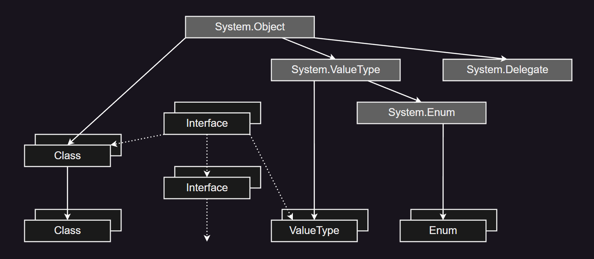

有一个系统定义的根是 `System.Object`。所有的类和值类型最终都应该从 `System.Object` 派生；类可以从其他类派生 (通过一个单一的，非循环的链) 到任何需要的深度。这个 *Extension* 继承链用实箭头表示。

接口不能相互继承；但是，它们可以有零个或多个必需的接口，这些接口应该被实现。*Interface* 需求链显示为虚箭头。它包含了接口和类或值类型之间的链接 —— 后者被称为实现该接口或多个接口。

常规值类型 (即，排除枚举 — 见后文) 被定义为直接从 `System.ValueType` 派生。常规值类型不能派生到一个以上的深度。另一种表述方式是，用户定义的值类型应该是密封的。用户定义的枚举应该直接从 `System.Enum` 派生。枚举不能在 `System.Enum` 以下派生到一个以上的深度。另一种表述方式是，用户定义的枚举应该是密封的。`System.Enum` 直接从 `System.ValueType` 派生。

用户定义的委托从 `System.Delegate` 派生。委托不能派生到一个以上的深度。

关于声明类型的指令，请参见 [_泛型定义_](#generic-type) 和 [_类型定义_](#class)。

> 元数据验证规则

| Order | Validation Rule                                                                                                                                                                                                                                                                                                          | Level |
| :---: | :----------------------------------------------------------------------------------------------------------------------------------------------------------------------------------------------------------------------------------------------------------------------------------------------------------------------- | :---: |
|  1.   | **`TypeDef`** 表可以包含一个或多个行                                                                                                                                                                                                                                                                                     |       |
|  2.   | _Flags:_                                                                                                                                                                                                                                                                                                                 |       |
|       | 1. ***`Flags`*** 只能设置那些指定的值。                                                                                                                                                                                                                                                                                  | ERROR |
|       | 2. 可以设置 0 或 1 个 `SequentialLayout` 和 `ExplicitLayout`；如果没有设置，则默认为 `AutoLayout`。                                                                                                                                                                                                                      | ERROR |
|       | 3. 可以设置 0 或 1 个 `UnicodeClass` 和 `AutoClass`；如果没有设置，则默认为 `AnsiClass`。                                                                                                                                                                                                                                | ERROR |
|       | 4. 如果 ***`Flags`***._`HasSecurity`_ = 1，那么以下条件中至少有一个应该为真：<br>&emsp;&emsp;i.这个类型有一个名为 `SuppressUnmanagedCodeSecurityAttribute` 的自定义特性。<br>&emsp;&emsp;ii. 这个类型有一个名为 `SuppressUnmanagedCodeSecurityAttribute` 的自定义特性。                                                  | ERROR |
|       | 5. 如果这个类型在 **`DeclSecurity`** 表中拥有一行 (或多行)，那么 ***`Flags`***.*`HasSecurity`* 应该是 1。                                                                                                                                                                                                                | ERROR |
|       | 6. 如果这个类型有一个名为 `SuppressUnmanagedCodeSecurityAttribute` 的自定义特性，那么 ***`Flags`***.*`HasSecurity`* 应该是 1。                                                                                                                                                                                           | ERROR |
|       | 7.  注意，接口设置 *`HasSecurity`* 是有效的。然而，安全系统忽略任何附加到该接口的权限请求。                                                                                                                                                                                                                              |       |
|  3.   | ***`Name`*** 应该在 ***String Heap*** 中索引一个 non-empty 字符串。                                                                                                                                                                                                                                                      | ERROR |
|  4.   | ***`TypeName`*** 字符串应该是一个有效的 CLS 标识符。                                                                                                                                                                                                                                                                     |  CLS  |
|  5.   | ***`TypeNamespace`*** 可以为空或非空。                                                                                                                                                                                                                                                                                   | ERROR |
|  6.   | 如果非空，那么 ***`TypeNamespace`*** 应该在 ***String Heap*** 中索引一个 non-empty 字符串。                                                                                                                                                                                                                              |       |
|  7.   | 如果非空，***`TypeNamespace`*** 的字符串应该是一个有效的 CLS 标识符。                                                                                                                                                                                                                                                    |       | CLS                                                                                          |  |
|  8.   | 每个类 (除了 `System.Object` 和特殊类 `<Module>`) 都应该继承一个 (有且只有一个) 其他类 —— 所以对于一个类，***`Extends`*** 应该是非空的。                                                                                                                                                                                 | ERROR |
|  9.   | `System.Object` 应该有一个 ***`Extends`*** 值为 null。                                                                                                                                                                                                                                                                   | ERROR |
|  10.  | `System.ValueType` 应该有一个 ***`Extends`*** 值为 `System.Object`。                                                                                                                                                                                                                                                     | ERROR |
|  11.  | 除了 `System.Object` 和特殊类 `<Module>`，对于任何类，***`Extends`*** 应该索引在 **`TypeDef`**，**`TypeRef`**，或 **`TypeSpec`** 表中的一个有效行，其中有效意味着 1 ≤ row ≤ rowcount。此外，该行本身必须是一个类 (而不是接口或值类型)，该基类不应该被密封 (其 ***`Flags`***.*`Sealed`* 应该是 0)。                       | ERROR |
|  12.  | 一个类不能扩展自身或其子类 (即，它的派生类)，因为这将在层次树中引入循环。                                                                                                                                                                                                                                                | ERROR | (对于泛型类型，参见 [_泛型定义_](#generic-define) 和 [_泛型和递归继承图_](#generic-inherit)) |
|  13.  | 一个接口永远不会扩展另一个类型 —— 所以 ***`Extends`*** 应该为空；接口确实实现了其他接口，但是这种关系是通过 **`InterfaceImpl`** 表捕获的，而不是 ***`Extends`*** 列。                                                                                                                                                    | ERROR |
|  14.  | ***`FieldList`*** 可以为空或非空。                                                                                                                                                                                                                                                                                       |
|  15.  | 一个类或接口可以拥有零个或多个字段。                                                                                                                                                                                                                                                                                     |
|  16.  | 一个值类型应该有一个非零的大小 —— 通过定义至少一个字段，或者提供一个非零的 ***`ClassSize`***。                                                                                                                                                                                                                           | ERROR |
|  17.  | 如果 ***`FieldList`*** 是非空的，它应该索引 **`Field`** 表中的一个有效行，其中有效意味着 1 ≤ row ≤ rowcount+1。                                                                                                                                                                                                          | ERROR |
|  18.  | ***`MethodList`*** 可以为空或非空。                                                                                                                                                                                                                                                                                      |
|  19.  | 一个类型可以拥有零个或多个方法。                                                                                                                                                                                                                                                                                         |
|  20.  | 值类型的运行时大小不应超过 1 MByte (0x100000 字节)。                                                                                                                                                                                                                                                                     | ERROR |
|  21.  | 如果 ***`MethodList`*** 是非空的，它应该索引 **`MethodDef`** 表中的一个有效行，其中有效意味着 1 ≤ row ≤ rowcount+1。                                                                                                                                                                                                     | ERROR |
|  22.  | 一个类如果有一个或多个抽象方法不能被实例化，那么它必须具有 ***`Flags`***.*`Abstract`* = 1。注意类拥有的方法包括从其基类继承以及它实现的接口的所有方法，以及通过其 ***`MethodList`*** 定义的方法。CLI 将在运行时分析类定义；如果它发现一个类有一个或多个抽象方法，但是 ***`Flags`***.*`Abstract`* = 0，它将抛出一个异常。 | ERROR |
|  23.  | 一个接口应该有 ***`Flags`***.*`Abstract`* = 1。                                                                                                                                                                                                                                                                          | ERROR |
|  24.  | 对于一个抽象类型来说，有一个构造方法 (即，一个名为 `.ctor` 的方法) 是有效的。                                                                                                                                                                                                                                            |
|  25.  | 任何非抽象类型 (即 ***`Flags`***.*`Abstract`* = 0) 应该为其抽象类或接口协议要求的每个方法提供一个实现 (提供方法主体)。它的方法可以从其基类继承，从它实现的接口继承，或者由它自己定义。实现可以从其基类继承，或者由它自己定义。                                                                                           | ERROR |
|  26.  | 一个接口 (***`Flags`***.*Interface* = 1) 可以拥有静态字段 (**`Field`**.*Static* = 1) 但不能拥有实例字段 (**`Field`**.*Static* = 0)。                                                                                                                                                                                     | ERROR |
|  27.  | 一个接口不能被密封 (如果 ***`Flags`***.*`Interface`* = 1，那么 ***`Flags`***.*Sealed* 应该是 0)。                                                                                                                                                                                                                        | ERROR |
|  28.  | 一个接口拥有的所有方法 (***`Flags`***.*`Interface`* = 1) 应该是抽象的 (***`Flags`***.*Abstract* = 1)。                                                                                                                                                                                                                   | ERROR |
|  29.  | 在 **`TypeDef`** 表中，基于 ***`TypeNamespace`***+***`TypeName`*** 不应该有重复的行 (除非这是一个嵌套类型 — 见下文)。                                                                                                                                                                                                    | ERROR |
|  30.  | 如果这是一个嵌套类型，那么在 **`TypeDef`** 表中，基于 ***`TypeNamespace`***+***`TypeName`***+_OwnerRowInNestedClassTable_ 不应该有重复的行。                                                                                                                                                                             | ERROR |
|  31.  | 使用 CLS 冲突标识符规则进行比较时，基于 ***`TypeNamespace`***+***`TypeName`*** 的字段，不应该有重复的行 (除非这是一个嵌套类型 — 见下文)。                                                                                                                                                                                |  CLS  |                                                                                              |
|  32.  | 使用 CLS 冲突标识符规则进行比较时，如果是一个嵌套类型，基于 ***`TypeNamespace`***+***`TypeName`***+_OwnerRowInNestedClassTable_ 和 ***`TypeNamespace`***+***`TypeName`*** 的字段，不应该有重复的行。                                                                                                                     |  CLS  |                                                                                              |
|  33.  | 如果 ***`Extends`*** = `System.Enum` (即，类型是用户定义的枚举) 那么：                                                                                                                                                                                                                                                   |
|       | 1. 应该是封闭的 (*`Sealed`* = 1)。                                                                                                                                                                                                                                                                                       | ERROR |
|       | 2. 不应该有自己的任何方法 (***`MethodList`*** 链应该是零长度)。                                                                                                                                                                                                                                                          | ERROR |
|       | 3. 不应该实现任何接口 (此类型在 **`InterfaceImpl`** 表中没有条目)。                                                                                                                                                                                                                                                      | ERROR |
|       | 4. 不应该有任何属性。                                                                                                                                                                                                                                                                                                    | ERROR |
|       | 5. 不应该有任何事件。                                                                                                                                                                                                                                                                                                    | ERROR |
|       | 6. 任何静态字段应该是字面值 (具有 ***`Flags`***.*`Literal`* = 1)。                                                                                                                                                                                                                                                       | ERROR |
|       | 7. 应该有一个或多个 **static literal** 字段，每个字段都具有枚举的类型。                                                                                                                                                                                                                                                  |  CLS  |                                                                                              |
|       | 8. 应该有一个实例字段，为内置整数类型。                                                                                                                                                                                                                                                                                  | ERROR |
|       | 9. 实例字段的 ***`Name`*** 字符串应该是 "`value__`"，该字段应该被标记为 `RTSpecialName`，并且该字段应该具有 CLS 整数类型之一。                                                                                                                                                                                           |  CLS  |                                                                                              |
|       | 10. 除非它们是文字的，否则不应该有任何静态字段。                                                                                                                                                                                                                                                                         | ERROR |
|  34.  | 嵌套类型 (如上所定义) 应该只拥有 **`NestedClass`** 表中的一行，其中 “拥有” 意味着在 **`NestedClass`** 表中的一行，其 ***`NestedClass`*** 列包含此类型定义的    **`TypeDef`**  **_token_**。                                                                                                                              | ERROR |
|  35.  | 值类型应该是封闭的。                                                                                                                                                                                                                                                                                                     | ERROR |


>---
### 20.5. Field: 0x04
<a id="Field_0x04"></a>

> *Field* 表有以下列：

| Column                               |  Kind   | Size  | Value             | Description                                      | Link                                  |
| :----------------------------------- | :-----: | :---: | :---------------- | :----------------------------------------------- | :------------------------------------ |
| ***`Token`***                        | Literal |   4   | 04UUUUUU          | 行编号，高位字节表示表编号，低三位字节是行编号。 |                                       |
| ***`Flags`***<br>/***`Attributes`*** | BitMask |   2   | _FieldAttributes_ | _FieldAttributes_ 类型的位掩码                   | [_FieldAttributes_](#FieldAttributes) |
| ***`Name`***                         |  Index  |   4   | ***String Heap*** | 索引字段的名称                                   |                                       |
| ***`Signature`***                    |  Index  |   4   | ***Blob Heap***   | 索引字段的签名                                   |                                       |

从概念上讲，**`Field`** 表中的每一行都由 **`TypeDef`** 表中的一行 (有且只有一行) 拥有。然而，**`Field`** 表中任何一行的 *owner* 并不存储在 **`Field`** 表本身中。在 **`TypeDef`** 表的每一行中只有一个前向指针 “*forward-pointer*” (***`FieldList`*** 列)，如下图所示。

 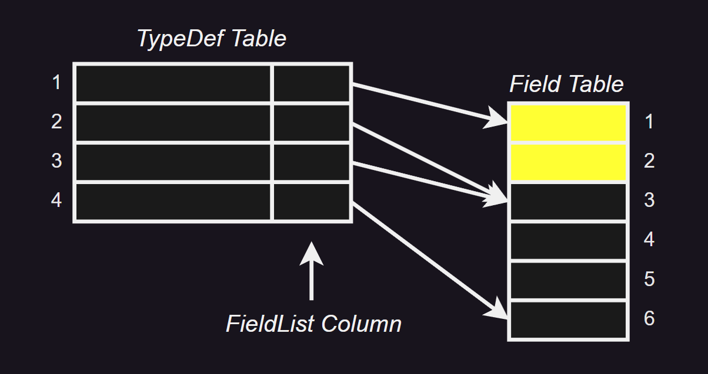

**`TypeDef`** 表有 1 ~ 4 行。**`TypeDef`** 表的第一行对应于 CLI 自动插入的伪类型。它用于表示 **`Field`** 表中对应于全局变量的那些行。**`Field`** 表有 1 ~ 6 行：
 - 类型 1 (`<module>` 的伪类型) 拥有 **`Field`** 表中的 1 和 2 行。
 - 类型 2 在 **`Field`** 表中没有任何行，尽管其 ***`FieldList`*** 索引了 **`Field`** 表中的第 3 行。
 - 类型 3 拥有 **`Field`** 表中的 3 ~ 5 行。
 - 类型 4 拥有 **`Field`** 表中的第 6 行。

因此，在 **`Field`** 表中，行 1 和 2 属于类型 1 (全局变量) ；行 3 ~ 5 属于类型 3；行 6 属于类型 4。

**`Field`** 表中的每一行都是由顶级 **.field** 指令 [[↗]](#il-top-impl) 或类型内的 **.field** 指令 [[↗]](#field) 产生的。

> 元数据验证规则

| Order | Validation Rule                                                                                                                                                                                                                                       | Level |
| :---: | :---------------------------------------------------------------------------------------------------------------------------------------------------------------------------------------------------------------------------------------------------- | :---: |
|  1.   | **`Field`** 表可以包含零行或多行。                                                                                                                                                                                                                    |       |
|  2.   | 在 **`TypeDef`** 表中每一行应有一个 ***`FieldList`***，且只有一个。                                                                                                                                                                                   | ERROR |
|  3.   | **`TypeDef`** 表中的 *owner* 行不能是接口。                                                                                                                                                                                                           |  CLS  |
|  4.   | ***`Flags`*** 只应设置那些指定的值。                                                                                                                                                                                                                  | ERROR |
|  5.   | ***`Flags`*** 的 *`FieldAccessMask`* 子字段应精确地包含 *`CompilerControlled`*、*`Private`*、*`FamANDAssem`*、*`Assembly`*、*`Family`*、*`FamORAssem`* 或 *`Public`* 中的一个 [[↗]](#FieldAttributes)。                                               | ERROR |
|  6.   | ***`Flags`*** 可以设置 *`Literal`* 或 *`InitOnly`* 中的一个或两者都不设置，但不能同时设置两者 [[↗]](#FieldAttributes)。                                                                                                                               | ERROR |
|  7.   | 如果 ***`Flags`***.*`Literal`* = 1，那么 ***`Flags`***.*`Static`* 也应为 1 [[↗]](#FieldAttributes)。                                                                                                                                                  | ERROR |
|  8.   | 如果 ***`Flags`***.*`RTSpecialName`* = 1，那么 ***`Flags`***.*`SpecialName`* 也应为 1 [[↗]](#FieldAttributes)。                                                                                                                                       | ERROR |
|  9.   | 如果 ***`Flags`***.*`HasFieldMarshal`* = 1，那么此行应 “拥有” **`FieldMarshal`** 表中的确切一行 [[↗]](#FieldAttributes)。                                                                                                                             | ERROR |
|  10.  | 如果 ***`Flags`***.*`HasDefault`* = 1，那么此行应 “拥有” **`Constant`** 表中的确切一行 [[↗]](#FieldAttributes)。                                                                                                                                      | ERROR |
|  11.  | 如果 ***`Flags`***.*`HasFieldRVA`* = 1，那么此行应 “拥有” **`FieldRVA`** 表中的确切一行 [[↗]](#FieldAttributes)。                                                                                                                                     | ERROR |
|  12.  | ***`Name`*** 应索引 ***String Heap*** 中的 non-empty 字符串。                                                                                                                                                                                         | ERROR |
|  13.  | ***`Name`*** 字符串应是一个有效的 CLS 标识符。                                                                                                                                                                                                        |  CLS  |
|  14.  | ***`Signature`*** 应索引 ***Blob Heap*** 中的有效字段签名。                                                                                                                                                                                           | ERROR |
|  15.  | 如果 ***`Flags`***.*`CompilerControlled`* = 1 [[↗]](#FieldAttributes)，那么在重复检查中将完全忽略此行。                                                                                                                                               |       |
|  16.  | 如果此字段的 *owner* 是内部生成的类型 `<Module>`，它表示此字段在模块范围内定义 (通常称为全局变量)。在这种情况下：                                                                                                                                     |       |
|       | * ***`Flags`***.*`Static`* 应为 1。                                                                                                                                                                                                                   | ERROR |
|       | * ***`Flags`***.*`MemberAccessMask`* 子字段应为 *`Public`*、*`CompilerControlled`* 或 *`Private`* 中的一个 [[↗]](#FieldAttributes)。                                                                                                                  | ERROR |
|       | * 不允许使用模块范围 (_module scope_) 字段。                                                                                                                                                                                                          |  CLS  |
|  17.  | 基于 _owner_+***`Name`***+***`Signature`***，**`Field`** 表中不应有重复的行，其中 _owner_ 是在 **`TypeDef`** 表中的 _owner_ 行。但如果 ***`Flags`***.*`CompilerControlled`* = 1，那么完全排除此行的重复检查。                                         | ERROR |
|  18.  | 基于 _owner_+***`Name`***，**`Field`** 表中不应有重复的行，其中 ***`Name`*** 字段使用 CLS 冲突标识符规则进行比较。所以例如，"`int i`" 和 "`float i`" 将被视为 CLS 重复。但如果 ***`Flags`***.*`CompilerControlled`* = 1，那么完全排除此行在重复检查。 |  CLS  |
|  19.  | 如果这是一个枚举的字段，那么：                                                                                                                                                                                                                        |       |
|       | * **`TypeDef`** 表中的 *owner* 行应直接派生自 `System.Enum`。                                                                                                                                                                                         | ERROR |
|       | * **`TypeDef`** 表中的 *owner* 行不应有其他实例字段。                                                                                                                                                                                                 |  CLS  |
|       | * 其 ***`Signature`*** 应为 *`ELEMENT_TYPE_U1`*、*`ELEMENT_TYPE_I2`*、*`ELEMENT_TYPE_I4`* 或 *`ELEMENT_TYPE_I8`* 中的一个，参见 [_ELEMENT_TYPE_](#ELEMENT_TYPE)。                                                                                     |  CLS  |
|  20.  | 其 ***`Signature`*** 应为整型。                                                                                                                                                                                                                       | ERROR |

>---
### 20.6. MethodDef: 0x06
<a id="MethodDef_0x06"></a>

> *MethodDef* 表有以下列：

| Column                                       |  Kind   | Size  | Value                  | Description                                                                                                                                                                                             | Link                                            |
| :------------------------------------------- | :-----: | :---: | :--------------------- | :------------------------------------------------------------------------------------------------------------------------------------------------------------------------------------------------------ | :---------------------------------------------- |
| ***`Token`***                                | Literal |   4   | 06UUUUUU               | 行编号，高位字节表示表编号，低三位字节是行编号。                                                                                                                                                        |                                                 |
| ***`Flags`***<br>/***`Attributes`***         | BitMask |   2   | _MethodAttributes_     | _MethodAttributes_ 类型的位掩码。                                                                                                                                                                       | [_MethodAttributes_](#MethodAttributes)         |
| ***`ImplFlags`***<br>/***`ImplAttributes`*** | BitMask |   2   | _MethodImplAttributes_ | _MethodImplAttributes_ 类型的位掩码。                                                                                                                                                                   | [_MethodImplAttributes_](#MethodImplAttributes) |
| ***`RVA`***                                  | Literal |   4   | Offset                 | 相对虚拟地址。                                                                                                                                                                                          |                                                 |
| ***`Name`***                                 |  Index  |   4   | ***String Heap***      | 索引方法的名称标识。                                                                                                                                                                                    |                                                 |
| ***`Signature`***                            |  Index  |   4   | ***Blob Heap***        | 索引方法的签名。                                                                                                                                                                                        |                                                 |
| ***`ParamList`***                            |  Index  |   4   | **`Param`**            | 标记了由此方法拥有的一连串参数的第一个。该连续运行继续到以下较小的：<br>&emsp;i. **`Param`** 表的最后一行。<br>&emsp;ii. 下一个参数运行，通过检查 **`MethodDef`** 表中下一行的 ***`ParamList`*** 找到。 |                                                 |

从概念上讲，**`MethodDef`** 表中的每一行都由 **`TypeDef`** 表中的一行拥有 (有且只有一行)。

**`MethodDef`** 表中的行是 **.method** 指令的结果 [[↗]](#method)。当发出 PE 文件的映像时，计算 ***`RVA`*** 列，并指向方法体的 *`COR_ILMETHOD`* 结构 [[↗]](#CIL-physical-layout)。 

如果 ***`Signature`*** 是 *`GENERIC`* (0x10)，则在 **`GenericParam`** 表 [[↗]](#GenericParam_0x2A) 中描述泛型参数。

> 元数据验证规则

| Order | Validation Rule                                                                                                                                                                                                                                                                                                                            | Level |
| :---: | :----------------------------------------------------------------------------------------------------------------------------------------------------------------------------------------------------------------------------------------------------------------------------------------------------------------------------------------- | :---: |
|  1.   | **`MethodDef`** 表可以包含零行或多行                                                                                                                                                                                                                                                                                                       |
|  2.   | 在 **`TypeDef`** 表中的 *owner* 行，每一行应该有一个 ***`MethodList`***，且只有一个。                                                                                                                                                                                                                                                      | ERROR |
|  3.   | ***`ImplFlags`*** 只应设置那些指定的值。                                                                                                                                                                                                                                                                                                   | ERROR |
|  4.   | ***`Flags`*** 只应设置那些指定的值。                                                                                                                                                                                                                                                                                                       | ERROR |
|  5.   | 如果 ***`Name`*** 是 `.ctor` 并且方法被标记为 `SpecialName`，那么在 **`GenericParam`** 表中不应该有一行将此 **`MethodDef`** 作为其 *owner*。                                                                                                                                                                                               | ERROR |
|  6.   | ***`Flags`*** 的 *`MemberAccessMask`* 子字段 [[↗]](#MethodAttributes) 应该包含 *`CompilerControlled`*、*`Private`*、*`FamANDAssem`*、*`Assem`*、*`Family`*、*`FamORAssem`* 或 *`Public`* 中的一个。                                                                                                                                        | ERROR |
|  7.   | ***`Flags`*** 中的以下组合位设置是无效的。                                                                                                                                                                                                                                                                                                 | ERROR |
|       | 1. *`Static`* \| *`Final`*                                                                                                                                                                                                                                                                                                                 |       |
|       | 2. *`Static`* \| *`Virtual`*，除了接口中的静态虚或抽象方法                                                                                                                                                                                                                                                                                 |
|       | 3. *`Static`* \| *`NewSlot`*                                                                                                                                                                                                                                                                                                               |
|       | 4. *`Final`* \| *`Abstract`*                                                                                                                                                                                                                                                                                                               |
|       | 5. *`Abstract`* \| *`PinvokeImpl`*                                                                                                                                                                                                                                                                                                         |
|       | 6. *`CompilerControlled`* \| *`SpecialName`*                                                                                                                                                                                                                                                                                               |
|       | 7. *`CompilerControlled`* \| *`RTSpecialName`*                                                                                                                                                                                                                                                                                             |
|  8.   | 抽象方法应该是虚方法。所以，如果 ***`Flags`***.*`Abstract`* = 1 那么 ***`Flags`***.*`Virtual`* 也应该是 1。                                                                                                                                                                                                                                | ERROR |
|  9.   | 如果 ***`Flags`***.*`RTSpecialName`* = 1 那么 ***`Flags`***.*`SpecialName`* 也应该是 1。                                                                                                                                                                                                                                                   | ERROR |
|  10.  | 如果 ***`Flags`***.*`HasSecurity`* = 1，那么以下条件中至少有一个应该为真：                                                                                                                                                                                                                                                                 | ERROR |
|       | * 此方法拥有 **`DeclSecurity`** 表中的至少一行。                                                                                                                                                                                                                                                                                           |
|       | * 此方法具有名为 `SuppressUnmanagedCodeSecurityAttribute` 的自定义特性。                                                                                                                                                                                                                                                                   |
|  11.  | 如果此方法拥有 **`DeclSecurity`** 表中的一行 (或多行) 那么 ***`Flags`***.*`HasSecurity`* 应该是 1。                                                                                                                                                                                                                                        | ERROR |
|  12.  | 如果此方法具有名为 `SuppressUnmanagedCodeSecurityAttribute` 的自定义特性那么 ***`Flags`***.*`HasSecurity`* 应该是 1。                                                                                                                                                                                                                      | ERROR |
|  13.  | 可以具有名为 `DynamicSecurityMethodAttribute` 的自定义特性，但这对其 ***`Flags`***.*`HasSecurity`* 的值没有任何影响。                                                                                                                                                                                                                      |
|  14.  | ***`Name`*** 应索引 ***String Heap*** 中的 non-empty 字符串。                                                                                                                                                                                                                                                                              | ERROR |
|  15.  | 接口不能有实例构造函数。所以，如果这个方法是由接口拥有的，那么它的 ***`Name`*** 不能是 `.ctor`。                                                                                                                                                                                                                                           | ERROR |
|  16.  | ***`Name`*** 字符串应是一个有效的 CLS 标识符 (除非设置了 ***`Flags`***.*`RTSpecialName`* — 例如，`.cctor` 是有效的)。                                                                                                                                                                                                                      |  CLS  |
|  17.  | ***`Signature`*** 应索引 ***Blob Heap*** 中的有效方法签名。                                                                                                                                                                                                                                                                                | ERROR |
|  18.  | 如果 ***`Flags`***.*`CompilerControlled`* = 1，那么在重复检查中完全忽略此行。                                                                                                                                                                                                                                                              |
|  19.  | 如果此方法的 *owner* 是内部生成的类型 `<Module>`，它表示此方法在模块范围内定义。在 C++ 中，该方法被称为全局方法，只能在其编译单元内从其声明点向前引用。在这种情况下：                                                                                                                                                                      |
|       | 1. ***`Flags`***.*`Static`* 应为 1。                                                                                                                                                                                                                                                                                                       | ERROR |
|       | 2. ***`Flags`***.*`Abstract`* 应为 0。                                                                                                                                                                                                                                                                                                     | ERROR |
|       | 3. ***`Flags`***.*`Virtual`* 应为 0。                                                                                                                                                                                                                                                                                                      | ERROR |
|       | 4. ***`Flags`***.*`MemberAccessMask`* 子字段应为 *`CompilerControlled`*、*`Public`* 或 *`Private`* 中的一个。                                                                                                                                                                                                                              | ERROR |
|       | 5. 不允许模块范围方法。                                                                                                                                                                                                                                                                                                                    |  CLS  |
|  20.  | 对于没有身份 (**_identity_**) 的值类型，具有同步方法是没有意义的 (除非它们被装箱)。所以，如果此方法的 *owner* 是一个值类型，那么该方法不能是同步的，即 ***`ImplFlags`***.*`Synchronized`* 应为 0。                                                                                                                                         | ERROR |
|  21.  | 在 **`MethodDef`** 表中，基于 *owner*+***`Name`***+***`Signature`***，不应有重复的行 (其中 *owner* 是在 **`TypeDef`** 表中的拥有行)。注意，***`Signature`*** 编码了方法是否是泛型，对于泛型方法，它编码了泛型参数的数量。如果 ***`Flags`***.*`CompilerControlled`* = 1，那么在重复检查中完全忽略此行。                                     | ERROR |
|  22.  | 在 **`MethodDef`** 表中，基于 *owner*+***`Name`***+***`Signature`***，不应有重复的行，其中 ***`Name`*** 字段使用 CLS 冲突标识符规则进行比较；此外，签名中定义的类型应该是不同的。所以例如，`int i` 和 `float i` 将被视为 CLS 重复；此外忽略了方法的返回类型。如果 ***`Flags`***.*`CompilerControlled`* = 1，那么在重复检查中完全忽略此行。 |  CLS  |
|  23.  | 如果在 ***`Flags`*** 中设置了 *`Final`*、*`NewSlot`* 或 *`Strict`*，那么也应设置 ***`Flags`***.*`Virtual`*。                                                                                                                                                                                                                               | ERROR |
|  24.  | 如果设置了 ***`Flags`***.*`PInvokeImpl`*，那么 ***`Flags`***.*`Virtual`* 应为 0。                                                                                                                                                                                                                                                          | ERROR |
|  25.  | 如果 ***`Flags`***.*`Abstract`* &ne; 1，那么以下条件中必须有一个也为真：                                                                                                                                                                                                                                                                   | ERROR |
|       | * RVA &ne; 0                                                                                                                                                                                                                                                                                                                               |
|       | * ***`Flags`***.*`PInvokeImpl`* = 1                                                                                                                                                                                                                                                                                                        |
|       | * ***`ImplFlags`***.*`Runtime`* = 1                                                                                                                                                                                                                                                                                                        |
|  26.  | 如果方法是 *`CompilerControlled`*，那么 RVA 应为非零或标记为 *`PinvokeImpl`* = 1。                                                                                                                                                                                                                                                         | ERROR |
|  27.  | ***`Signature`*** 应具有以下托管调用约定中的一个：                                                                                                                                                                                                                                                                                         | ERROR |
|       | 1. *`DEFAULT`* (0x0)                                                                                                                                                                                                                                                                                                                       |
|       | 2. *`VARARG`* (0x5)                                                                                                                                                                                                                                                                                                                        |
|       | 3. *`GENERIC`* (0x10)                                                                                                                                                                                                                                                                                                                      |
|  28.  | ***`Signature`*** 应具有调用约定 *`DEFAULT`* (0x0) 或 *`GENERIC`* (0x10)。                                                                                                                                                                                                                                                                 |  CLS  |
|  29.  | ***`Signature`***：当且仅当方法不是 *`Static`* 时，***`Signature`*** 中的调用约定字节的 *`HASTHIS`* (0x20) 位应被设置。                                                                                                                                                                                                                    | ERROR |
|  30.  | ***`Signature`***：如果方法是 *`Static`*，那么调用约定中的 *`HASTHIS`* (0x20) 位应为0 。                                                                                                                                                                                                                                                   | ERROR |
|  31.  | 如果签名中的 *`EXPLICITTHIS`* (0x40) 被设置，那么 *`HASTHIS`* (0x20) 也应被设置 (注意，如果设置了 *`EXPLICITTHIS`*，那么代码是不可验证的)。                                                                                                                                                                                                | ERROR |
|  32.  | *`EXPLICITTHIS`* (0x40) 位只能在函数指针的签名中设置，它的 *MethodDefSig* 前面有 *`FNPTR`* (0x1B) 的签名。                                                                                                                                                                                                                                 | ERROR |
|  33.  | 如果 ***`RVA`*** = 0，那么以下条件之一必须为真：                                                                                                                                                                                                                                                                                           | ERROR |
|       | * ***`Flags`***.*`Abstract`* = 1。                                                                                                                                                                                                                                                                                                         |
|       | * ***`ImplFlags`***.*`Runtime`* = 1。                                                                                                                                                                                                                                                                                                      |
|       | * ***`Flags`***.*`PinvokeImpl`* = 1。                                                                                                                                                                                                                                                                                                      |
|  34.  | 如果 ***`RVA`*** ≠ 0，那么：                                                                                                                                                                                                                                                                                                               | ERROR |
|       | 1. ***`Flags`***.*`Abstract`* 应为 0，并且                                                                                                                                                                                                                                                                                                 |
|       | 2. ***`ImplFlags`***.*`CodeTypeMask`* 应具有以下值之一：*`Native`*，*`CIL`* 或 *`Runtime`*，并且                                                                                                                                                                                                                                           |
|       | 3. ***`RVA`*** 应指向此文件中的 CIL 代码流                                                                                                                                                                                                                                                                                                 |
|  35.  | 如果 ***`Flags`***.*`PinvokeImpl`* = 1 那么。                                                                                                                                                                                                                                                                                              | ERROR |
|       | * ***`RVA`*** = 0 并且方法在 **`ImplMap`** 表中拥有一行                                                                                                                                                                                                                                                                                    |
|  36.  | 如果 ***`Flags`***.*`RTSpecialName`* = 1 那么 ***`Name`*** 应为以下之一：                                                                                                                                                                                                                                                                  | ERROR |
|       | 1. `.ctor` (一个对象构造器方法)                                                                                                                                                                                                                                                                                                            |
|       | 2. `.cctor` (一个类构造器方法)                                                                                                                                                                                                                                                                                                             |
|  37.  | 相反，如果 ***`Name`*** 是上述特殊名称中的任何一个，那么 ***`Flags`***.*`RTSpecialName`* 应被设置。                                                                                                                                                                                                                                        | ERROR |
|  38.  | 如果 ***`Name`*** = `.ctor` (一个对象构造器方法) 那么：                                                                                                                                                                                                                                                                                    |
|       | 1. ***`Signature`*** 中的返回类型应为 *`ELEMENT_TYPE_VOID`* (参见 [_ELEMENT_TYPE_](#ELEMENT_TYPE))。                                                                                                                                                                                                                                       | ERROR |
|       | 2. ***`Flags`***.*`Static`* 应为 0。                                                                                                                                                                                                                                                                                                       | ERROR |
|       | 3. ***`Flags`***.*`Abstract`* 应为 0。                                                                                                                                                                                                                                                                                                     | ERROR |
|       | 4. ***`Flags`***.*`Virtual`* 应为 0。                                                                                                                                                                                                                                                                                                      | ERROR |
|       | 5. "*owner*" 类型应为 **`TypeDef`** 表中的有效类或值类型 (不是 `<Module>` 且不是接口)。                                                                                                                                                                                                                                                    | ERROR |
|       | 6. 对于任何给定的 "*owner*"，可以有零个或多个 `.ctor`。                                                                                                                                                                                                                                                                                    |
|  39.  | 如果 ***`Name`*** = `.cctor` (一个类构造器方法) 那么：                                                                                                                                                                                                                                                                                     |
|       | 1. ***`Signature`*** 中的返回类型应为 *`ELEMENT_TYPE_VOID`* (参见 [_ELEMENT_TYPE_](#ELEMENT_TYPE))。                                                                                                                                                                                                                                       | ERROR |
|       | 2. ***`Signature`*** 的调用约定应为 *`DEFAULT`* (0x0)。                                                                                                                                                                                                                                                                                    | ERROR |
|       | 3. ***`Signature`*** 中不应提供参数。                                                                                                                                                                                                                                                                                                      | ERROR |
|       | 4. ***`Flags`***.*`Static`* 应被设置。                                                                                                                                                                                                                                                                                                     | ERROR |
|       | 5. ***`Flags`***.*`Virtual`* 应被清除。                                                                                                                                                                                                                                                                                                    | ERROR |
|       | 6. ***`Flags`***.*`Abstract`* 应被清除。                                                                                                                                                                                                                                                                                                   | ERROR |
|  40.  | 在 **`TypeDef`** 表中的任何给定行拥有的方法集合中，只能有 0 或 1 个名为 `.cctor` 的方法。                                                                                                                                                                                                                                                  | ERROR |
 
>--- 
### 20.7. Param: 0x08
<a id="Param_0x08"></a>

> *Param* 表有以下列：

| Column                               |  Kind   | Size  | Value             | Description                                      | Link                                  |
| :----------------------------------- | :-----: | :---: | :---------------- | :----------------------------------------------- | :------------------------------------ |
| ***`Token`***                        | Literal |   4   | 08UUUUUU          | 行编号，高位字节表示表编号，低三位字节是行编号。 |                                       |
| ***`Flags`***<br>/***`Attributes`*** | BitMask |   2   | _ParamAttributes_ | _ParamAttributes_ 类型的位掩码。                 | [_ParamAttributes_](#ParamAttributes) |
| ***`Sequence`***                     | Literal |   2   | Number            | 参数的签名类型                                   |                                       |
| ***`Name`***                         |  Index  |   4   | ***String Heap*** | 索引参数的名称                                   |                                       |

从概念上讲，**`Param`** 表中的每一行都由 **`MethodDef`** 表中的一行拥有，且只有一行。

**`Param`** 表中的行是方法声明中的参数 [[↗]](#MethodHeader)，或者是附加到方法的 **.param** 特性 [[↗]](#param) 的结果。

> 元数据验证规则

| Order | Validation Rule                                                                                                                                            |  Level  |
| :---: | :--------------------------------------------------------------------------------------------------------------------------------------------------------- | :-----: |
|  1.   | **`Param`** 表可以包含零行或多行。                                                                                                                         |
|  2.   | 在 **`MethodDef`** 表中的 *owner* 行，每一行应该有一个 ***`ParamList`***，且只有一个。                                                                     |  ERROR  |
|  3.   | ***`Flags`*** 只应设置那些指定的值 (所有组合有效)。                                                                                                        |  ERROR  |
|  4.   | ***`Sequence`*** 应该有一个值 &ge; 0 并且 &le;  *owner* 方法中的参数数量。***`Sequence`*** 值为 0 指的是 *owner* 方法的返回类型；然后从 1 开始编号其参数。 |  ERROR  |
|  5.   | 由同一方法拥有的 **`Param`** 表的连续行应该按照增加的 ***`Sequence`*** 值排序 —— 尽管序列中允许有间隙。                                                    | WARNING |
|  6.   | 如果 ***`Flags`***.*`HasDefault`* = 1，那么此行应该在 **`Constant`** 表中只拥有一行。                                                                      |  ERROR  |
|  7.   | 如果 ***`Flags`***.*`HasDefault`* = 0，那么在 **`Constant`** 表中没有属于这一行的行。                                                                      |  ERROR  |
|  8.   | 如果 ***`Flags`***.*`FieldMarshal`* = 1，那么此行应该在 **`FieldMarshal`** 表中只拥有一行。                                                                |  ERROR  |
|  9.   | ***`Name`*** 可以为 null 或 non-null。                                                                                                                     |
|  10.  | 如果 ***`Name`*** 是非空的，那么它应该索引 ***String Heap*** 中的 non-empty 字符串。                                                                       | WARNING |

>---
### 20.8. InterfaceImpl: 0x09
<a id="InterfaceImpl_0x09"></a>

> *InterfaceImpl* 表有以下列：

| Column            |  Kind   | Size  | Value         | Description                                            | Link                            |
| :---------------- | :-----: | :---: | :------------ | :----------------------------------------------------- | :------------------------------ |
| ***`Token`***     | Literal |   4   | 09UUUUUU      | 行编号，高位字节表示表编号，低三位字节是行编号。       |                                 |
| ***`Class`***     |  Index  |       | **`TypeDef`** |                                                        |                                 |
| ***`Interface`*** |  Index  |       | Tables        | 索引 **`TypeDef`**，**`TypeRef`** 或 **`TypeSpec`** 表 | [_TypeDefOrRef_](#TypeDefOrRef) |

**`InterfaceImpl`** 表记录类型显式实现的接口。从概念上讲，**`InterfaceImpl`** 表中的每一行都表示 ***`Class`*** 实现了 ***`Interface`***。

> 元数据验证规则

| Order | Validation Rule                                                                                                                                   |  Level  |
| :---: | :------------------------------------------------------------------------------------------------------------------------------------------------ | :-----: |
|  1.   | **`InterfaceImpl`** 表可以包含零行或多行。                                                                                                        |
|  2.   | ***`Class`*** 应为非 null。                                                                                                                       |  ERROR  |
|  3.   | 如果 ***`Class`*** 为非 null，则：                                                                                                                |
|       | 1. ***`Class`*** 应索引 **`TypeDef`** 表中的有效行。                                                                                              |  ERROR  |
|       | 2. ***`Interface`*** 应索引 **`TypeDef`** 或 **`TypeRef`** 表中的有效行。                                                                         |  ERROR  |
|       | 3. ***`Interface`*** 索引的 **`TypeDef`**，**`TypeRef`** 或 **`TypeSpec`** 表中的行应为接口 (***`Flags`***.*`Interface`* = 1)，而不是类或值类型。 |  ERROR  |
|  4.   | 基于非 null 的 ***`Class`*** 和 ***`Interface`*** 值，在 **`InterfaceImpl`** 表中不应有重复项。                                                   | WARNING |
|  5.   | 可以有许多行具有相同的 ***`Class`*** 值 (因为一个类可以实现许多接口)。                                                                            |
|  6.   | 可以有许多行具有相同的 ***`Interface`*** 值 (因为许多类可以实现相同的接口)。                                                                      |


### 20.9. MemberRef: 0x0A
<a id="MemberRef_0x0A"></a>

> *MemberRef* 表有以下列：

| Column                           |  Kind   | Size  | Value             | Description                                                                                | Link                                  |
| :------------------------------- | :-----: | :---: | :---------------- | :----------------------------------------------------------------------------------------- | :------------------------------------ |
| ***`Token`***                    | Literal |   4   | 0AUUUUUU          | 行编号，高位字节表示表编号，低三位字节是行编号。                                           |                                       |
| ***`Class`***<br>/***`Parent`*** |  Index  |   2   | Tables            | 索引 **`MethodDef`**，**`ModuleRef`**，**`TypeDef`**，**`TypeRef`** 或 **`TypeSpec`** 表。 | [_MemberRefParent_](#MemberRefParent) |
| ***`Name`***                     |  Index  |   4   | ***String Heap*** | 索引成员的名称                                                                             |                                       |
| ***`Signature`***                |  Index  |   4   | ***Blob Heap***   | 索引成员的签名                                                                             |                                       |

**`MemberRef`** 表将对类的方法和字段的两种引用合并在一起，分别称为 "**`MethodRef`**" 和 "**`FieldRef`**"。

每当在 CIL 代码中对在另一个模块或程序集中定义的方法或字段进行引用时，都会在 **`MemberRef`** 表中创建一个条目。此外，即使在与调用点相同的模块中定义了具有 *`VARARG`* 签名的方法，也会为其创建一个条目。

> 元数据验证规则

| Order | Validation Rule                                                                                                                                                                                                                                                                                                                                                            |  Level  |
| :---: | :------------------------------------------------------------------------------------------------------------------------------------------------------------------------------------------------------------------------------------------------------------------------------------------------------------------------------------------------------------------------- | :-----: |
|  1.   | ***`Class`*** 应为以下之一：                                                                                                                                                                                                                                                                                                                                               |  ERROR  |
|       | 1. 如果定义成员的类在另一个模块中定义，则为 **`TypeRef`**  **_token_**。当成员在此相同的模块中定义时，使用 **`TypeRef`**  **_token_** 是不寻常但有效的，在这种情况下，可以使用其 **`TypeDef`**  **_token_** 代替。                                                                                                                                                         |
|       | 2. 如果成员在同一程序集的另一个模块中定义为全局函数或变量，则为 **`ModuleRef`**  **_token_**。                                                                                                                                                                                                                                                                             |
|       | 3. 当用于为在此模块中定义的 **vararg** 方法提供调用点签名时，为 **`MethodDef`**  **_token_**。***`Name`*** 应与相应 **`MethodDef`** 行中的 ***`Name`*** 匹配。***`Signature`*** 应与目标方法定义中的 ***`Signature`*** 匹配。                                                                                                                                              |  ERROR  |
|       | 4. 如果成员是泛型类型的成员，则为 **`TypeSpec`**  **_token_**。                                                                                                                                                                                                                                                                                                            |
|  2.   | ***`Class`*** 不应为 null (因为这将表示对全局函数或变量的未解析引用)。                                                                                                                                                                                                                                                                                                     |  ERROR  |
|  3.   | ***`Name`*** 应索引 ***String Heap*** 中的 non-empty 字符串。                                                                                                                                                                                                                                                                                                              |  ERROR  |
|  4.   | ***`Name`*** 字符串应为有效的 CLS 标识符。                                                                                                                                                                                                                                                                                                                                 |   CLS   |
|  5.   | ***`Signature`*** 应索引 ***Blob Heap*** 中的有效字段或方法签名。特别是，它应嵌入以下调用约定中的一个：                                                                                                                                                                                                                                                                    |  ERROR  |
|       | 1. *`DEFAULT`* (0x0)                                                                                                                                                                                                                                                                                                                                                       |
|       | 2. *`VARARG`* (0x5)                                                                                                                                                                                                                                                                                                                                                        |
|       | 3. *`FIELD`* (0x6)                                                                                                                                                                                                                                                                                                                                                         |
|       | 4. *`GENERIC`* (0x10)                                                                                                                                                                                                                                                                                                                                                      |
|  6.   | **`MemberRef`** 表应不包含重复项，其中重复行具有相同的 ***`Class`***，***`Name`*** 和 ***`Signature`***。                                                                                                                                                                                                                                                                  | WARNING |
|  7.   | ***`Signature`*** 不应具有 *`VARARG`* (0x5) 调用约定。                                                                                                                                                                                                                                                                                                                     |   CLS   |
|  8.   | 不应有重复行，其中 ***`Name`*** 字段使用 CLS 冲突标识符规则进行比较。特别是，CLS 中忽略了返回类型以及参数是否标记为 *`ELEMENT_TYPE_BYREF`* (参见 [_ELEMENT_TYPE_](#ELEMENT_TYPE))。例如，方法 `.method int32 M()` 和 `.method float64 M()` 根据根据 CLS 规则会产生重复行。同样，方法 `.method void N(int32 i)` 和 `.method void N(int32& i)` 也根据 CLS 规则会产生重复行。 |   CLS   |
|  9.   | 如果 ***`Class`*** 和 ***`Name`*** 解析为字段，则该字段的 ***`Flags`***.*`FieldAccessMask`* 子字段中不应有 *`CompilerControlled`* (参见 [_FieldAttributes_](#FieldAttributes)) 的值。                                                                                                                                                                                      |  ERROR  |
|  10.  | 如果 ***`Class`*** 和 ***`Name`*** 解析为方法，则该方法的 ***`Flags`***.*`MemberAccessMask`* (参见 [_MethodAttributes_](#MethodAttributes)) 子字段中不应有 *`CompilerControlled`* 的值。                                                                                                                                                                                   |  ERROR  |
|  11.  | 包含 **`MemberRef`** 定义的类型应为表示实例化类型的 **`TypeSpec`**。                                                                                                                                                                                                                                                                                                       |

>---
### 20.10. Constant: 0x0B
<a id="Constant_0x0B"></a>

> *Constant* 表有以下列：

| Column         |  Kind   | Size  | Value           | Description                                                                                                                                                                                                                                                                                         | Link                          |
| :------------- | :-----: | :---: | :-------------- | :-------------------------------------------------------------------------------------------------------------------------------------------------------------------------------------------------------------------------------------------------------------------------------------------------- | :---------------------------- |
| ***`Token`***  | Literal |   4   | 0BUUUUUU        | 行编号，高位字节表示表编号，低三位字节是行编号。                                                                                                                                                                                                                                                    |                               |
| ***`Type`***   | Literal |   1   | Number          | 后面跟着一个 1 字节的填充零，参见 [_ELEMENT_TYPE_](#ELEMENT_TYPE)。对于 _ilasm_ 中 _FieldInit_ 的 **nullref** 值 [[↗]](#field-init)，***`Type`*** 的编码是 *`ELEMENT_TYPE_CLASS`*，其 ***`Value`*** 是一个 4 字节的零。与 *`ELEMENT_TYPE_CLASS`* 在签名中的用法不同，这个不是后跟类型 **_token_**。 |                               |
| ***`Parent`*** |  Index  |   4   | Tables          | 索引 **`Param`**、**`Field`** 或 **`Property`** 表。                                                                                                                                                                                                                                                | [_HasConstant_](#HasConstant) |
| ***`Value`***  |  Index  |   4   | ***Blob Heap*** | 索引常数的字面值。                                                                                                                                                                                                                                                                                  |                               |

**`Constant`** 表用于存储字段、参数和属性的编译时常量值。

请注意，**`Constant`** 信息并不直接影响运行时行为，尽管它可以通过反射可见 (因此可以用来实现像 `System.Enum.ToString` 这样的功能)。编译器在导入元数据时，在编译时检查这些信息，但如果使用了常量本身的值，它将嵌入到编译器发出的 CIL 流中。在运行时，没有 CIL 指令可以访问 **`Constant`** 表。

每当为父项指定编译时值时，都会在 **`Constant`** 表中为父项创建一行。有关示例，请参见 [[↗]](#field-init)。

> 元数据验证规则

| Order | Validation Rule                                                                                                                                                                                                                                                                                                                                                                                                             | Level |
| :---: | :-------------------------------------------------------------------------------------------------------------------------------------------------------------------------------------------------------------------------------------------------------------------------------------------------------------------------------------------------------------------------------------------------------------------------- | :---: |
|  1.   | ***`Type`*** 应该正好是以下之一：*`ELEMENT_TYPE_BOOLEAN`*，*`ELEMENT_TYPE_CHAR`*，*`ELEMENT_TYPE_I1`*，*`ELEMENT_TYPE_U1`*，*`ELEMENT_TYPE_I2`*，*`ELEMENT_TYPE_U2`*，*`ELEMENT_TYPE_I4`*，*`ELEMENT_TYPE_U4`*，*`ELEMENT_TYPE_I8`*，*`ELEMENT_TYPE_U8`*，*`ELEMENT_TYPE_R4`*，*`ELEMENT_TYPE_R8`*，或 *`ELEMENT_TYPE_STRING`*；或者 *`ELEMENT_TYPE_CLASS`*，其 ***`Value`*** 为零 (参见 [_ELEMENT_TYPE_](#ELEMENT_TYPE))。 | ERROR |
|  2.   | ***`Type`*** 不应该是任何以下的：*`ELEMENT_TYPE_I1`*，*`ELEMENT_TYPE_U2`*，*`ELEMENT_TYPE_U4`*，或 *`ELEMENT_TYPE_U8`* (参见 [_ELEMENT_TYPE_](#ELEMENT_TYPE))。                                                                                                                                                                                                                                                             |  CLS  |
|  3.   | ***`Parent`*** 应该索引 **`Field`**、**`Property`** 或 **`Param`** 表中的有效行。                                                                                                                                                                                                                                                                                                                                           | ERROR |
|  4.   | 基于 ***`Parent`***，不应有重复的行。                                                                                                                                                                                                                                                                                                                                                                                       | ERROR |
|  5.   | ***`Type`*** 应该完全匹配由 ***`Parent`*** 标识的 **`Param`**、**`Field`** 或 **`Property`** 的声明类型 (在父项是枚举的情况下，它应该完全匹配该枚举的底层类型)。                                                                                                                                                                                                                                                            |  CLS  |


>---
### 20.11. CustomAttribute: 0x0C
<a id="CustomAttribute_0x0C"></a>

> *CustomAttribute* 表有以下列：

| Column                               |  Kind   | Size  | Value                | Description                                          | Link                                          |
| :----------------------------------- | :-----: | :---: | :------------------- | :--------------------------------------------------- | :-------------------------------------------- |
| ***`Token`***                        | Literal |   4   | 0CUUUUUU             | 行编号，高位字节表示表编号，低三位字节是行编号。     |                                               |
| ***`Parent`***                       |  Index  |   4   | _HasCustomAttribute_ | 索引与 _HasCustomAttribute_ 编码索引关联的元数据表。 | [_HasCustomAttribute_](#HasCustomAttribute)   |
| ***`Type`***<br>/***`Constructor`*** |  Index  |   4   | Tables               | 索引 **`MethodDef`** 或 **`MemberRef`** 表。         | [_CustomAttributeType_](#CustomAttributeType) |
| ***`Value`***                        |  Index  |   4   | ***Blob Heap***      | 索引构建该特性实例所需要的二进制数据。               |                                               |

**`CustomAttribute`** 表存储的数据可以在运行时用来实例化自定义特性 (更准确地说，是指定的自定义特性类的对象)。名为 ***`Type`*** 的列实际上索引了一个构造方法 —— 该构造方法的 *owner* 是自定义特性的类型。

在 **`CustomAttribute`** 表中为父项创建的行由 **.custom** 特性创建，它给出了 ***`Type`*** 列的值，以及可选的 ***`Value`*** 列的值。参见 [_自定义特性_](#custom)。 

> 元数据验证规则

所有二进制值都以小端格式存储 (除了 *`PackedLen`* 项，它们仅用作后续 UTF8 字符串中字节数的计数)。

| Order | Validation Rule                                                                                                                                                                                                                                                                                                                                                                                                                                                                                           | Level |
| :---: | :-------------------------------------------------------------------------------------------------------------------------------------------------------------------------------------------------------------------------------------------------------------------------------------------------------------------------------------------------------------------------------------------------------------------------------------------------------------------------------------------------------- | :---: |
|  1.   | 若不需要 **`CustomAttribute`**，那么 ***`Value`*** 可以为空。                                                                                                                                                                                                                                                                                                                                                                                                                                             |
|  2.   | ***`Parent`*** 可以是任何元数据表的索引，除了 **`CustomAttribute`** 表本身。                                                                                                                                                                                                                                                                                                                                                                                                                              | ERROR |
|  3.   | ***`Type`*** 应索引 **`MethodDef`** 或 **`MemberRef`** 表中的有效行。该行应该是一个构造方法 (对于这个信息形成实例的类)。                                                                                                                                                                                                                                                                                                                                                                                  | ERROR |
|  4.   | ***`Value`*** 可以为空或非空。                                                                                                                                                                                                                                                                                                                                                                                                                                                                            |
|  5.   | 如果 ***`Value`*** 是非空的，它应该索引 ***Blob Heap*** 中的一个 *blob*。                                                                                                                                                                                                                                                                                                                                                                                                                                 | ERROR |
|  6.   | 以下规则适用于 ***`Value`*** *blob* 的整体结构 [[↗]](#custom-attr-value)：                                                                                                                                                                                                                                                                                                                                                                                                                                |
|       | * _Prolog_ 应该是 0x0001。                                                                                                                                                                                                                                                                                                                                                                                                                                                                                | ERROR |
|       | * _FixedArg_ 出现次数应该与 _Constructor_ 方法中声明的参数一样多。                                                                                                                                                                                                                                                                                                                                                                                                                                        | ERROR |
|       | * _NumNamed_ 可以是零或更多。                                                                                                                                                                                                                                                                                                                                                                                                                                                                             |
|       | * 应该有恰好 _NumNamed_ 个 _NamedArg_ 出现。                                                                                                                                                                                                                                                                                                                                                                                                                                                              | ERROR |
|       | * 每个 _NamedArg_ 应该可以被调用方访问。                                                                                                                                                                                                                                                                                                                                                                                                                                                                  | ERROR |
|       | * 如果 _NumNamed_ = 0，那么 _CustomAttrib_ 中不应该有更多的项。                                                                                                                                                                                                                                                                                                                                                                                                                                           | ERROR |
|  7.   | 以下规则适用于 _FixedArg_ 的结构 [[↗]](#custom-attr-value)：                                                                                                                                                                                                                                                                                                                                                                                                                                              |
|       | * 如果此项不是向量 (单维数组，下界为 0)，那么应该只有一个 _Elem_。                                                                                                                                                                                                                                                                                                                                                                                                                                        | ERROR |
|       | * 如果此项是向量，那么：                                                                                                                                                                                                                                                                                                                                                                                                                                                                                  |
|       | * _NumElem_ 应该是 1 或更多。                                                                                                                                                                                                                                                                                                                                                                                                                                                                             | ERROR |
|       | * 这后面应该有 _NumElem_ 个 _Elem_ 出现。                                                                                                                                                                                                                                                                                                                                                                                                                                                                 | ERROR |
|  8.   | 以下规则适用于 _Elem_ 的结构 [[↗]](#custom-attr-value)：                                                                                                                                                                                                                                                                                                                                                                                                                                                  |
|       | * 如果这是一个简单类型或枚举 (参见 [[↗]](#custom-attr-value) 了解如何定义)，那么 _Elem_ 只包含它的值。                                                                                                                                                                                                                                                                                                                                                                                                    | ERROR |
|       | * 如果这是一个字符串或类型，那么 _Elem_ 包含一个 _SerString_ —— _PackedLen_ 字节计数，后跟 UTF8 字符。                                                                                                                                                                                                                                                                                                                                                                                                    | ERROR |
|       | * 如果这是一个装箱的简单值类型 (`bool`，`char`，`float32`，`float64`，`int8`，`int16`，`int32`，`int64`，`unsigned int8`，`unsigned int16`，`unsigned int32` 或 `unsigned int64`)，那么 *Elem* 包含相应的类型表示符 (*`ELEMENT_TYPE_BOOLEAN`*，*`ELEMENT_TYPE_CHAR`*，*`ELEMENT_TYPE_I1`*，*`ELEMENT_TYPE_U1`*，*`ELEMENT_TYPE_I2`*，*`ELEMENT_TYPE_U2`*，*`ELEMENT_TYPE_I4`*，*`ELEMENT_TYPE_U4`*，*`ELEMENT_TYPE_I8`*，*`ELEMENT_TYPE_U8`*，*`ELEMENT_TYPE_R4`* 或 *`ELEMENT_TYPE_R8`*)，并后跟它的值。 | ERROR |
|  9.   | 以下规则适用于 _NamedArg_ 的结构 [[↗]](#custom-attr-value)：                                                                                                                                                                                                                                                                                                                                                                                                                                              |
|       | * _NamedArg_ 应该以单字节 *`FIELD`* (0x53) 或 *`PROPERTY`* (0x54) 开头，用于标识。                                                                                                                                                                                                                                                                                                                                                                                                                        | ERROR |
|       | * 如果参数种类是装箱的简单值类型，那么字段或属性的类型是 *`ELEMENT_TYPE_BOOLEAN`*，*`ELEMENT_TYPE_CHAR`*，*`ELEMENT_TYPE_I1`*，*`ELEMENT_TYPE_U1`*，*`ELEMENT_TYPE_I2`*，*`ELEMENT_TYPE_U2`*，*`ELEMENT_TYPE_I4`*，*`ELEMENT_TYPE_U4`*，*`ELEMENT_TYPE_I8`*，*`ELEMENT_TYPE_U8`*，*`ELEMENT_TYPE_R4`*，*`ELEMENT_TYPE_R8`*，*`ELEMENT_TYPE_STRING`*，或常数 0x50 (对应于类型为 `System.Type` 的参数) 中的一个。                                                                                           | ERROR |
|       | * 字段或属性的名称，分别与前一项，存储为 _SerString_ —— _PackedLen_ 字节计数，后跟名称的 UTF8 字符。                                                                                                                                                                                                                                                                                                                                                                                                      | ERROR |
|       | * _NamedArg_ 是一个 _FixedArg_ (见上文) 。                                                                                                                                                                                                                                                                                                                                                                                                                                                                | ERROR |

>---
### 20.12. FieldMarshal : 0x0D
<a id="FieldMarshal_0x0D"></a>

**`FieldMarshal`** 表有两列。它将 **`Field`** 或 **`Param`** 表中的现有行 “链接” 到 ***Blob Heap*** 中的信息，该信息定义了该字段或参数 (通常情况下，作为参数编号 0 的方法返回) 在通过 PInvoke 调度调用到 (或从) 非托管代码时应如何进行封送。

请注意，**`FieldMarshal`** 信息仅由与非托管代码进行操作的代码路径使用。为了执行这样的路径，在大多数平台上调用方被安装为具有更高的安全权限。一旦它调用了非托管代码，它就脱离了 CLI 可以检查的范围 —— 它只是被信任不会违反类型系统。

> *FieldMarshal* 表有以下列：

| Column             |  Kind   | Size  | Value           | Description                                      | Link                                  |
| :----------------- | :-----: | :---: | :-------------- | :----------------------------------------------- | :------------------------------------ |
| ***`Token`***      | Literal |   4   | 0DUUUUUU        | 行编号，高位字节表示表编号，低三位字节是行编号。 |                                       |
| ***`Parent`***     |  Index  |   4   | Tables          | 索引 **`Field`** 或 **`Param`** 表。             | [_HasFieldMarshal_](#HasFieldMarshal) |
| ***`NativeType`*** |  Index  |   4   | ***Blob Heap*** | 索引本地类型的二进制数据对象。                   |                                       |

有关 '***blob***' 的详细格式，请参见 [_二进制数据对象_](#blob-description)。

如果父字段的 **.field** 指令指定了 **marshal** 特性 [[↗]](#field-marshal)，则会在 **`FieldMarshal`** 表中创建一行。

> 元数据验证规则

| Order | Validation Rule                                                                                                                                                                          |  Level  |
| :---: | :--------------------------------------------------------------------------------------------------------------------------------------------------------------------------------------- | :-----: |
|  1.   | **`FieldMarshal`** 表可以包含零行或多行。                                                                                                                                                |
|  2.   | ***`Parent`*** 应该索引 **`Field`** 或 **`Param`** 表中的有效行 (***`Parent`*** 值被编码为表示每个索引引用的是这两个表中的哪一个)。                                                      |  ERROR  |
|  3.   | ***`NativeType`*** 应该索引 ***Blob Heap*** 中的非空 '*blob*'。                                                                                                                          |  ERROR  |
|  4.   | 任何两行都不能指向同一个父项。换句话说，在 ***`Parent`*** 值已被解码为确定它们是引用 **`Field`** 表还是 **`Param`** 表之后，没有两行可以指向 **`Field`** 表或 **`Param`** 表中的同一行。 |  ERROR  |
|  5.   | 以下检查适用于 _`MarshalSpec`_ '*blob*'：                                                                                                                                                |
|       | * _`NativeIntrinsic`_ 应该是其生成的常数值之一 [[↗]](#blob-description)。                                                                                                                |  ERROR  |
|       | * 如果是 *`ARRAY`*，那么 *`ArrayElemType`* 应该是其生成的常数值之一。                                                                                                                    |  ERROR  |
|       | * 如果是 *`ARRAY`*，那么 _`ParamNum`_ 可以为零。                                                                                                                                         |
|       | * 如果是 *`ARRAY`*，那么 _`ParamNum`_ 不能小于 0。                                                                                                                                       |  ERROR  |
|       | * 如果是 *`ARRAY`*，并且 _`ParamNum`_ > 0，那么 ***`Parent`*** 应该指向 **`Param`** 表中的一行，而不是 **`Field`** 表。                                                                  |  ERROR  |
|       | * 如果是 *`ARRAY`*，并且 _`ParamNum`_ > 0，那么 _`ParamNum`_ 不能超过父 **`Param`** 是其成员的 **`MethodDef`** (或者如果是 *`VARARG`* 调用，则为 **`MethodRef`**) 提供的参数数量。       |  ERROR  |
|       | * 如果是 *`ARRAY`*，那么 _`ElemMult`_ 应该大于等于 1。                                                                                                                                   |  ERROR  |
|       | * 如果是 *`ARRAY`* 并且 _`ElemMult`_ 不等于 1，则发出警告，因为这可能是一个错误。                                                                                                        | WARNING |
|       | * 如果是 *`ARRAY`* 并且 _`ParamNum`_ = 0，那么 _`NumElem`_ 应该大于等于 1。                                                                                                              |  ERROR  |
|       | * 如果是 *`ARRAY`* 并且 _`ParamNum`_ 不等于 0 并且 _`NumElem`_ 不等于 0，则发出警告，因为这可能是一个错误。                                                                              | WARNING |
     
>---
### 20.13. DeclSecurity: 0x0E
<a id="DeclSecurity_0x0E"></a>

可以将源自 `System.Security.Permissions.SecurityAttribute` 的安全特性附加到 **`TypeDef`**、***`Method`*** 或 *Assembly*。此类的所有构造函数都应将 `System.Security.Permissions.SecurityAction` 值作为其第一个参数，描述应对附加到的类型、方法或程序集的权限进行何种操作。代码访问派生自 `System.Security.Permissions.CodeAccessSecurityAttribute` 的安全特性，可以具有任何安全操作。

这些不同的安全操作在 **`DeclSecurity`** 表中被编码为 2 字节的枚举 (见下文)。对于方法、类型或程序集上给定安全操作的所有安全自定义特性应聚集在一起，并创建一个 `System.Security.PermissionSet` 实例，存储在 ***Blob Heap*** 中，并从 **`DeclSecurity`** 表中引用。

从编译器的角度来看，一般流程如下：用户通过某种特定于语言的语法指定自定义特性，该语法编码了对特性的构造函数的调用。如果特性的类型直接或间接派生自 `System.Security.Permissions.SecurityAttribute`，那么它就是一个安全自定义特性，并需要特殊处理，如下所述 (其他自定义特性通过简单地在元数据中记录构造函数来处理，如 [*CustomAttribute*](#CustomAttribute_0x0C) 表所述)。构造特性对象，并提供一个方法 (`CreatePermission`) 将其转换为安全权限对象 (从 `System.Security.Permission` 派生的对象)。所有附加到具有相同安全操作的给定元数据项的权限对象都被组合在一起，形成一个 `System.Security.PermissionSet`。使用其 `ToXML` 方法将此权限集转换为准备存储在 XML 中的形式，以创建 `System.Security.SecurityElement`。最后，使用 `SecurityElement` 上的 `ToString` 方法创建元数据所需的 XML。

> *DeclSecurity* 表有以下列：

| Column                |  Kind   | Size  | Value           | Description                                                | Link                                  |
| :-------------------- | :-----: | :---: | :-------------- | :--------------------------------------------------------- | :------------------------------------ |
| ***`Token`***         | Literal |   4   | 0EUUUUUU        | 行编号，高位字节表示表编号，低三位字节是行编号。           |                                       |
| ***`Parent`***        |  Index  |   4   | Tables          | 索引 **`TypeDef`**、**`MethodDef`** 或 **`Assembly`** 表。 | [_HasDeclSecurity_](#HasDeclSecurity) |
| ***`Action`***        | Literal |   2   | Number          | 表示安全操作类别                                           |                                       |
| ***`PermissionSet`*** |  Index  |   4   | ***Blob Heap*** | 索引它的二进制数据对象。                                   |                                       |

***`Action`*** 是安全操作 (参见 `System.Security.SecurityAction`) 的 2 字节表示。值 0 ~ 0xFF 保留供未来标准使用。值 0x20 ~ 0x7F 和 0x100 ~ 0x07FF 用于操作，如果操作不被识别或支持，可以忽略。值 0x80 ~ 0xFF 和 0x0800 ~ 0xFFFF 用于需要执行安全操作的操作；在操作不可用的实现中，不应允许访问程序集、类型或方法。

| 安全操作          | 注释   | 行为解释                                                                           | 有效范围   |
| ----------------- | ------ | ---------------------------------------------------------------------------------- | ---------- |
| Assert            | 1      | 在没有进一步检查的情况下，满足对指定权限的需求。                                   | 方法，类型 |
| Demand            | 1      | 检查调用链中的所有调用者是否已被授予指定的权限，在失败时抛出 `SecurityException`。 | 方法，类型 |
| Deny              | 1      | 在没有进一步检查的情况下，拒绝对指定权限的需求。                                   | 方法，类型 |
| InheritanceDemand | 1      | 为了从类继承或覆盖虚方法，必须授予指定的权限。                                     | 方法，类型 |
| LinkDemand        | 1      | 检查直接调用者是否已被授予指定的权限；在失败时抛出 `SecurityException`。           | 方法，类型 |
| NonCasDemand      | 2      | 检查当前程序集是否已被授予指定的权限；否则抛出 `SecurityException`。               | 方法，类型 |
| NonCasLinkDemand  | 2      | 检查直接调用者是否已被授予指定的权限；否则抛出 `SecurityException`。               | 方法，类型 |
| PrejitGrant       | &nbsp; | 保留供实现特定使用。                                                               | 程序集     |
| PermitOnly        | 1      | 在没有进一步检查的情况下，拒绝对除指定之外的所有权限的需求。                       | 方法，类型 |
| RequestMinimum    | &nbsp; | 指定运行所需的最小权限。                                                           | 程序集     |
| RequestOptional   | &nbsp; | 指定要授予的可选权限。                                                             | 程序集     |
| RequestRefuse     | &nbsp; | 指定不授予的权限。                                                                 | 程序集     |

**注释 1** 指定的特性应派生自 `System.Security.Permissions.CodeAccessSecurityAttribute`。

**注释 2** 指定的特性应派生自 `System.Security.Permissions.SecurityAttribute`，但不应派生自 `System.Security.Permissions.CodeAccessSecurityAttribute`。

***`Parent`*** 是一个元数据 **_token_**，用于标识在其上定义 ***`PermissionSet`*** 中编码的安全自定义特性的 ***`Method`***，_Type_ 或 *Assembly*。

***`PermissionSet`*** 是一个 '*blob*'，其格式如下：
 * 包含一个句点 (.) 的字节。
 * 一个压缩的无符号整数，包含 *blob* 中编码的特性数量。
 * 包含以下内容的特性数组：
    * 一个字符串，它是特性的完全限定类型名称。字符串被编码为一个压缩的无符号整数，以指示大小，后跟一个 UTF8 字符数组。
    * 一组特性，编码为自定义特性的命名参数 [[↗]](#custom-attr-value)，从 _`NumNamed`_ 开始。

权限集包含在特定的 ***`Method`***，*Type* 或 *Assembly* (参见 ***`Parent`***) 上请求的具有 ***`Action`*** 的权限。换句话说，*blob* 将包含 ***`Parent`*** 上具有该特定 ***`Action`*** 的所有特性的编码。

此标准的第一版指定了权限集的 XML 编码。后续实现应继续支持此编码以向后兼容。

**`DeclSecurity`** 表的行是通过附加一个指定 ***`Action`*** 和 ***`PermissionSet`*** 的 **.permission** 或 **.permissionset** 指令到父程序集 [[↗]](#assembly-inside-decl) 或父类型或方法 [[↗]](#class-type-member) 上填充的。

> 元数据验证规则

| Order | Validation Rule                                                                                                                                                            |  Level  |
| :---: | :------------------------------------------------------------------------------------------------------------------------------------------------------------------------- | :-----: |
|  1.   | ***`Action`*** 应该只设置那些指定的值。                                                                                                                                    |  ERROR  |
|  2.   | ***`Parent`*** 应该是 **`TypeDef`**，**`MethodDef`** 或 **`Assembly`** 中的一个。也就是说，它应该索引 **`TypeDef`** 表，**`MethodDef`** 表或 **`Assembly`** 表中的有效行。 |  ERROR  |
|  3.   | 如果 ***`Parent`*** 索引了 **`TypeDef`** 表中的一行，那么该行不应定义接口。安全系统会忽略任何这样的父项；编译器不应发出这样的权限集。                                      | WARNING |
|  4.   | 如果 ***`Parent`*** 索引了一个 **`TypeDef`**，那么它的 **`TypeDef`**.***`Flags`***.*`HasSecurity`* 位应该被设置。                                                          |  ERROR  |
|  5.   | 如果 ***`Parent`*** 索引了一个 **`MethodDef`**，那么它的 **`MethodDef`**.***`Flags`***.*`HasSecurity`* 位应该被设置。                                                      |  ERROR  |
|  6.   | ***`PermissionSet`*** 应该索引 ***Blob Heap*** 中的一个 '*blob*'。                                                                                                         |  ERROR  |
|  7.   | ***`PermissionSet`*** 索引的 '*blob*' 的格式应该表示一个有效的、编码的 CLI 对象图。                                                                                        |  ERROR  |

>---
### 20.14. ClassLayout: 0x0F
<a id="ClassLayout_0x0F"></a>

**`ClassLayout`** 表用于定义 CLI 应如何布局类或值类型的字段。通常，CLI 可以自由地重新排序和 / 或在为类或值类型定义的字段之间插入间隙。

此功能用于以与非托管 C 结构体完全相同的方式布局托管值类型，从而允许将托管值类型交给非托管代码，然后访问字段，就像该内存块是由非托管代码布局的一样。

**`ClassLayout`** 表中的信息取决于 *owner* 类或值类型中 {*`AutoLayout`*,*`SequentialLayout`*, *`ExplicitLayout`*} 的 ***`Flags`*** 值。如果类型被标记为 *`SequentialLayout`* 或 *`ExplicitLayout`*，则该类型具有布局。如果继承链中的任何类型具有布局，则其所有基类也应具有布局，直到它的直接基类是从 `System.ValueType` 派生的那个基类 (如果它存在于类型的层次结构中)；否则，直接基类是 `System.Object`。

布局不能在链的中间开始。但是在链的任何点停止具有 “布局” 都是有效的。例如，在下面的图表中，类 A 从 `System.Object` 派生；类 B 从 A 派生；类 C 从 B 派生。`System.Object` 没有布局。但是 A，B 和 C 都定义了布局，这是有效的。

 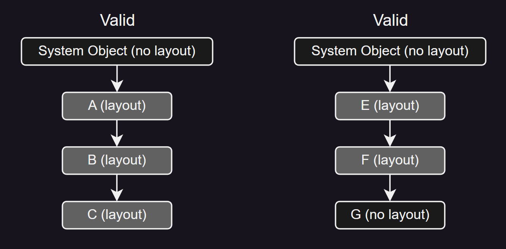

类 E，F 和 G 的情况类似。G 没有布局，这也是有效的。下图显示了两个无效的设置： 

 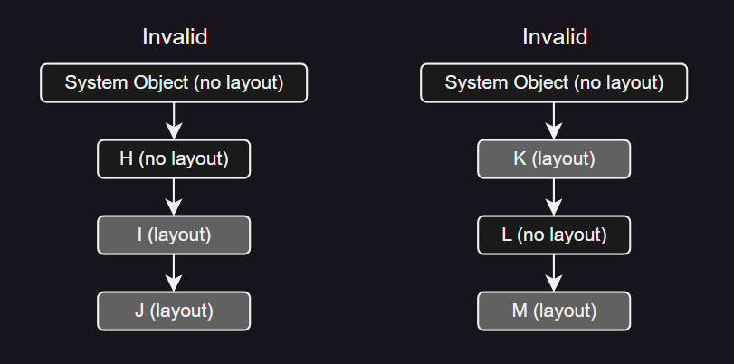

在左边，“具有布局的链” 并未从 “最高” 的类开始。在右边，“具有布局的链” 中有一个 “洞”。

类或值类型的布局信息保存在两个表 (**`ClassLayout`** 和 **`FieldLayout`**) 中，如下图所示：

 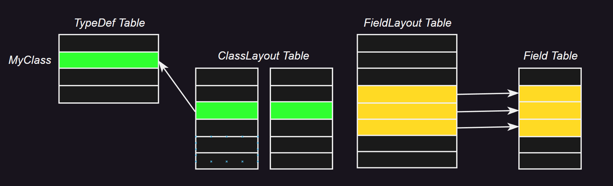

在此示例中，**`ClassLayout`** 表的第 3 行指向 **`TypeDef`** 表的第 2 行 (类的定义，称为 “MyClass”)。**`FieldLayout`** 表的第 4 ~ 6 行指向 **`Field`** 表中的相应行。这说明了 CLI 如何存储在 “MyClass” 中定义的三个字段的显式偏移 (对于拥有类或值类型的每个字段，**`FieldLayout`** 表中总是有一行) 因此，**`ClassLayout`** 表充当 **`TypeDef`** 表中具有布局信息的那些行的扩展；由于许多类没有布局信息，总的来说，这种设计节省了空间。

> *ClassLayout* 表有以下列：

| Column              |  Kind   | Size  | Value         | Description                                      | Link |
| :------------------ | :-----: | :---: | :------------ | :----------------------------------------------- | :--- |
| ***`Token`***       | Literal |   4   | 0FUUUUUU      | 行编号，高位字节表示表编号，低三位字节是行编号。 |      |
| ***`Parent`***      |  Index  |   4   | **`TypeDef`** | 索引具有布局特性的类型定义。                     |      |
| ***`PackingSize`*** | Literal |   2   | Number        | 表示该类型的对齐信息。                           |      |
| ***`ClassSize`***   | Literal |   4   | Number        | 表示该类型的大小。                               |      |

通过在此类型声明的类型声明主体上放置 **.pack** 和 **.size** 指令来定义 **`ClassLayout`** 表的行 [[↗]](#class-type-member)。当省略这些指令中的任何一个时，其对应的值为零。参见 [_控制实例布局_](#ctrl-layout)。 

***`ClassSize`*** 为零并不意味着类的大小为零。这意味着在定义时没有指定 **.size** 指令，在这种情况下，实际大小是从字段类型计算出来的，并考虑到打包大小 (默认或指定) 和目标运行时平台上的自然对齐。

> 元数据验证规则

| Order | Validation Rule                                                                                                                                                                | Level |
| :---: | :----------------------------------------------------------------------------------------------------------------------------------------------------------------------------- | :---: |
|  1.   | **`ClassLayout`** 表可以包含零行或多行。                                                                                                                                       |
|  2.   | ***`Parent`*** 应索引 **`TypeDef`** 表中的有效行，对应于类或值类型 (但不对应于接口)。                                                                                          | ERROR |
|  3.   | ***`Parent`*** 索引的类或值类型应为 *`SequentialLayout`* 或 *`ExplicitLayout`* [[↗]](#FieldAttributes)。也就是说，*`AutoLayout`* 类型不应拥有 **`ClassLayout`** 表中的任何行。 | ERROR |
|  4.   | 如果 ***`Parent`*** 索引了一个 *`SequentialLayout`* 类型，那么：                                                                                                               |
|       | * ***`PackingSize`*** 应为 {0, 1, 2, 4, 8, 16, 32, 64, 128} 中的一个。0 表示使用应用程序运行的平台的默认打包大小。                                                             | ERROR |
|       | * 如果 ***`Parent`*** 索引了一个 ValueType，那么 ***`ClassSize`*** 应小于 1 MByte (0x100000 字节)。                                                                            | ERROR |
|  5.   | 如果 ***`Parent`*** 索引了一个 *`ExplicitLayout`* 类型，那么                                                                                                                   |
|       | * 如果 ***`Parent`*** 索引了一个 *ValueType*，那么 ***`ClassSize`*** 应小于 1 MByte (0x100000 字节)。                                                                          | ERROR |
|       | * ***`PackingSize`*** 应为 0。为每个字段提供显式偏移以及打包大小是没有意义的。                                                                                                 | ERROR |
|  6.   | 注意，如果布局没有创建字段重叠的类型，那么 *`ExplicitLayout`* 类型可能会产生可验证的类型。                                                                                     |
|  7.   | 沿着继承链方向的布局应遵循上述规则 (从 “最高” 类型开始，没有 “孔” 等)。                                                                                                        | ERROR |

>---
### 20.15. FieldLayout: 0x10
<a id="FieldLayout_0x10"></a>

> *FieldLayout* 表有以下列：

| Column                                 |  Kind   | Size  | Value       | Description                                      | Link |
| :------------------------------------- | :-----: | :---: | :---------- | :----------------------------------------------- | :--- |
| ***`Token`***                          | Literal |   4   | 10UUUUUU    | 行编号，高位字节表示表编号，低三位字节是行编号。 |      |
| ***`Field`***                          |  Index  |   4   | **`Field`** | 索引具有布局特性的字段。                         |      |
| ***`Offset`***<br>/***`FieldOffSet`*** | Literal |   4   | Number      | 表示从类型开头起的偏移量。                       |      |

请注意，任何类型中的每个字段都由其签名定义。当 CLI 布局类型实例 (即，对象) 时，每个字段是四种类型之一：
 * ***Scalar***：用于任何内置类型的成员，例如 `int32`。字段的大小由该内在类型的实际大小给出，其大小在 1 到 8 字节之间变化。
 * ***ObjectRef***：用于 *`ELEMENT_TYPE_CLASS`*，*`ELEMENT_TYPE_STRING`*，*`ELEMENT_TYPE_OBJECT`*，*`ELEMENT_TYPE_ARRAY`*，*`ELEMENT_TYPE_SZARRAY`*
 * ***Pointer***：用于 *`ELEMENT_TYPE_PTR`*，*`ELEMENT_TYPE_FNPTR`*
 * ***ValueType***：用于 *`ELEMENT_TYPE_VALUETYPE`*。该 *ValueType* 的实例实际上是在此对象中布局的，因此字段的大小是该 *ValueType* 的大小。

请注意，指定显式结构布局的元数据可以在一个平台上有效地使用，但在另一个平台上可能无效，因为这里指定的一些规则取决于特定于平台的对齐规则。

如果父字段的 **.field** 指令已指定字段偏移，则将在 **`FieldLayout`** 表中创建一行。参见 [*字段定义和字段引用*](#field)。

> 元数据验证规则

| Order | Validation Rule                                                                                                                | Level |
| :---: | :----------------------------------------------------------------------------------------------------------------------------- | :---: |
|  1.   | **`FieldLayout`** 表可以包含零行或多行。                                                                                       |
|  2.   | **`FieldLayout`** 表中每行描述的字段的类型应设置 ***`Flags`***.*`ExplicitLayout`* (参见 [_TypeAttributes_](#TypeAttributes))。 | ERROR |
|  3.   | ***`Offset`*** 应为零值或比零大值。                                                                                            | ERROR |
|  4.   | **`Field`** 应索引 **`Field`** 表中的有效行。                                                                                  | ERROR |
|  5.   | **`Field`** 索引的 **`Field`** 表中的行的 ***`Flags`***.*`Static`* 应为非静态 (值为 0)。                                       | ERROR |
|  6.   | 在给定类型拥有的行中，基于 **`Field`** 不应有重复项。也就是说，类型的给定 **`Field`** 不能被赋予两个偏移。                     | ERROR |
|  7.   | 类型 ***ObjectRef*** 的每个字段应在类型内自然对齐。                                                                            | ERROR |
|  8.   | 在给定类型拥有的行中，完全有效的是有几行具有相同的 ***`Offset`*** 值。但是 ***ObjectRef*** 和值类型不能具有相同的偏移。        | ERROR |
|  9.   | *`ExplicitLayout`* 类型的每个字段都应给出偏移；也就是说，它应在 **`FieldLayout`** 表中有一行。                                 | ERROR |

>---
### 20.16. StandAloneSig: 0x11
<a id="StandAloneSig_0x11"></a>

签名存储在元数据 ***Blob Heap*** 中。在大多数情况下，它们由某个表的某个列索引 —— **`Field`**.***`Signature`***、***`Method`***.***`Signature`***、**`MemberRef`**.***`Signature`*** 等。然而，有两种情况需要一个元数据 **_token_** 来表示一个不由任何元数据表索引的签名。**`StandAloneSig`** 表满足了这个需求。它只有一列，该列指向 ***Blob Heap*** 中的一个 ***`Signature`***。

签名应描述以下之一：
 * **一个方法** — 代码生成器为每次 `calli` 指令的调用，在 **`StandAloneSig`** 表中创建一行。该行索引 `calli` 指令的函数指针操作数的调用点签名。
 * **局部变量** — 代码生成器为每个方法在 **`StandAloneSig`** 表中创建一行，以描述其所有的局部变量。ILAsm 中的 **.locals** 指令 [[↗]](#locals) 在 **`StandAloneSig`** 表中生成一行。

> *StandAloneSig* 表有以下列：

| Column            |  Kind   | Size  | Value           | Description                                      | Link |
| :---------------- | :-----: | :---: | :-------------- | :----------------------------------------------- | :--- |
| ***`Token`***     | Literal |   4   | 11UUUUUU        | 行编号，高位字节表示表编号，低三位字节是行编号。 |      |
| ***`Signature`*** |  Index  |   4   | ***Blob Heap*** | 索引其签名的二进制数据对象。                     |      |

```cil
// 在遇到 calli 指令时，ilasm 在 blob 堆中生成一个签名 (DEFAULT，ParamCount = 1，RetType = int32，Param1 = int32)，
// 并由 StandAloneSig 表索引：
.assembly Test {}
.method static int32 AddTen(int32)
{ 
    ldarg.0
    ldc.i4  10
    add
    ret
}
.class Test
{ 
    .method static void main()
    { 
        .entrypoint
        ldc.i4.1
        ldftn int32 AddTen(int32)
        calli int32(int32)
        pop
        ret
    }
}
```

> 元数据验证规则

| Order | Validation Rule                                                                           | Level |
| :---: | :---------------------------------------------------------------------------------------- | :---: |
|  1.   | **`StandAloneSig`** 表可以包含零行或多行。                                                |
|  2.   | ***`Signature`*** 应该索引 ***Blob Heap*** 中的有效签名。                                 | ERROR |
|  3.   | 由 ***`Signature`*** 索引的签名 '*blob*' 应该是一个有效的 *`METHOD`* 或 *`LOCALS`* 签名。 | ERROR |
|  4.   | 允许重复的行。                                                                            |

>---
### 20.17. EventMap: 0x12
<a id="EventMap_0x12"></a>

> *EventMap* 表有以下列：

| Column            |  Kind   | Size  | Value         | Description                                                                                                                                                                                          | Link |
| :---------------- | :-----: | :---: | :------------ | :--------------------------------------------------------------------------------------------------------------------------------------------------------------------------------------------------- | :--- |
| ***`Token`***     | Literal |   4   | 12UUUUUU      | 行编号，高位字节表示表编号，低三位字节是行编号。                                                                                                                                                     |      |
| ***`Parent`***    |  Index  |   4   | **`TypeDef`** | 索引声明事件的类型。                                                                                                                                                                                 |      |
| ***`EventList`*** |  Index  |   4   | **`Event`**   | 标记了由此类型拥有的一连串事件的第一个。该连续运行继续到以下较小者：<br>&emsp;i. **`Event`** 表的最后一行。<br>&emsp;ii. 通过检查 **`EventMap`** 表中下一行的 ***`EventList`*** 找到的下一连串事件。 |      |

请注意，**`EventMap`** 信息并不直接影响运行时行为；重要的是每个事件包含的方法的信息。**`EventMap`** 和 **`Event`** 表是将 **.event** 指令用于类上的结果 [[↗]](#event)。

> 元数据验证规则

| Order | Validation Rule                                                                     | Level |
| :---: | :---------------------------------------------------------------------------------- | :---: |
|  1.   | **`EventMap`** 表可以包含零行或多行。                                               |
|  2.   | 基于 ***`Parent`***，不应有重复的行 (给定的类只有一个指向其事件列表开始的 “指针”)。 | ERROR |
|  3.   | 基于 ***`EventList`***，不应有重复的行 (不同的类不能在 **`Event`** 表中共享行)。    | ERROR |

>---
### 20.18. Event: 0x14
<a id="Event_0x14"></a>

事件在元数据中的处理方式与属性非常相似；也就是说，它将定义关联到给定类上的一组方法。有两个必需的方法 (`add_` 和 `remove_`) 以及一个可选的方法 (`raise_`)；还允许其他名称的附加方法 [[↗]](#event)。作为事件聚集在一起的所有方法都应在包含事件的类上定义。

在 **`TypeDef`** 表的一行与构成给定事件的方法集合之间的关联关系保存在三个单独的表中 (这与属性类似)，如下所示：

 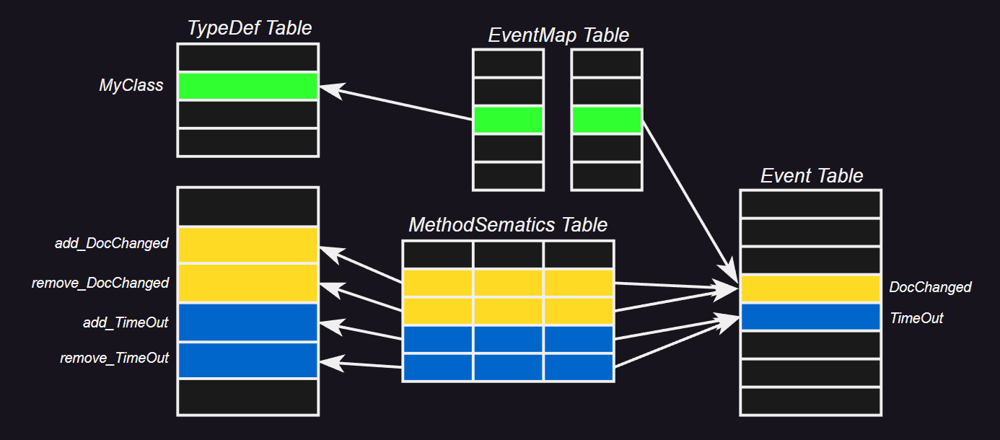

**`EventMap`** 表的第 3 行索引了左边 **`TypeDef`** 表的第 2 行 (`MyClass`)，同时索引了右边 **`Event`** 表的第 4 行 (一个名为 `DocChanged` 的事件)。这个设置构建了 `MyClass` 有一个名为 `DocChanged` 的事件。但是 **`MethodDef`** 表中的哪些方法被聚集在一起作为 “属于” 事件 `DocChanged`？该关联关系包含在 **`MethodSemantics`** 表中 —— 它的第 2 行索引了右边的事件 `DocChanged`，以及左边 **`MethodDef`** 表的第 2 行 (一个名为 `add_DocChanged` 的方法)。此外，**`MethodSemantics`** 表的第 3 行索引了右边的 `DocChanged`，以及左边 **`MethodDef`** 表的第 3 行 (一个名为 `remove_DocChanged` 的方法)。如图所示，`MyClass` 还有另一个事件，名为 `TimedOut`，有两个方法，`add_TimedOut` 和 `remove_TimedOut`。

**`Event`** 表不仅仅是将其他表中的现有行聚集在一起。**`Event`** 表有 ***`EventFlags`***，***`Name`*** (例如，这里的示例中的 `DocChanged` 和 `TimedOut`) 和 ***`EventType`*** 列。此外，**`MethodSemantics`** 表有一列用于记录它索引的方法是 `add_`，`remove_`，`raise_` 还是其他函数。

> *Event* 表有以下列：

| Column                                    |  Kind   | Size  | Value             | Description                                                                                              | Link                                  |
| :---------------------------------------- | :-----: | :---: | :---------------- | :------------------------------------------------------------------------------------------------------- | :------------------------------------ |
| ***`Token`***                             | Literal |   4   | 14UUUUUU          | 行编号，高位字节表示表编号，低三位字节是行编号。                                                         |                                       |
| ***`EventFlags`***<br>/***`Attributes`*** | BitMask |   2   | _EventAttributes_ | _EventAttributes_ 类型的位掩码。                                                                         | [_EventAttributes_](#EventAttributes) |
| ***`Name`***                              |  Index  |   4   | ***String Heap*** | 索引事件的名称标识。                                                                                     |
| ***`EventType`***<br>/***`Type`***        |  Index  |   4   | Tables            | 索引 **`TypeDef`**，**`TypeRef`** 或 **`TypeSpec`** 表。它对应于事件的类型，而不是对应拥有此事件的类型。 | [_TypeDefOrRef_](#FieldAttributes)    |

请注意，**`Event`** 信息并不直接影响运行时行为；重要的是事件包含的每个方法的信息。**`EventMap`** 和 **`Event`** 表是将 **.event** 指令放在类上的结果 (参见 [_事件定义_](#event))。

> 元数据验证规则

| Order | Validation Rule                                                                                                                 | Level |
| :---: | :------------------------------------------------------------------------------------------------------------------------------ | :---: |
|  1.   | **`Event`** 表可以包含零行或多行。                                                                                              |
|  2.   | **`EventMap`** 表中的每一行在都应有一个 ***`EventList`***，且只有一个。                                                         | ERROR |
|  3.   | ***`EventFlags`*** 只应设置指定的值 (所有组合有效)。                                                                            | ERROR |
|  4.   | ***`Name`*** 应索引 ***String Heap*** 中的 no-empty 字符串。                                                                    | ERROR |
|  5.   | ***`Name`*** 字符串应为有效的 CLS 标识符。                                                                                      |  CLS  |
|  6.   | ***`EventType`*** 可以为 null 或非 null。                                                                                       |
|  7.   | 如果 ***`EventType`*** 为非 null，则它应索引 **`TypeDef`** 或 **`TypeRef`** 表中的有效行。                                      | ERROR |
|  8.   | 如果 ***`EventType`*** 为非 null，则它索引的 **`TypeDef`**，**`TypeRef`** 或 **`TypeSpec`** 表中的行应为类 (不是接口或值类型)。 | ERROR |
|  9.   | 对于每一行，在 **`MethodSemantics`** 表中应有一个 `add_` 和一个 `remove_` 行。                                                  | ERROR |
|  10.  | 对于每一行，可以有零个或一个 `raise_` 行，以及 **`MethodSemantics`** 表中的零个或多个 `other` 行。                              | ERROR |
|  11.  | 在 **`TypeDef`** 表中的给定行拥有的行中，基于 ***`Name`*** 不应有重复项。                                                       | ERROR |
|  12.  | 基于 ***`Name`*** 不应有重复行，其中 ***`Name`*** 字段使用 CLS 冲突标识符规则进行比较。                                         |  CLS  |

>---
### 20.19. PropertyMap: 0x15
<a id="PropertyMap_0x15"></a>

> *PropertyMap* 表有以下列：

| Column               |  Kind   | Size  | Value          | Description                                                                                                                                                                                                           | Link |
| :------------------- | :-----: | :---: | :------------- | :-------------------------------------------------------------------------------------------------------------------------------------------------------------------------------------------------------------------- | :--- |
| ***`Token`***        | Literal |   4   | 15UUUUUU       | 行编号，高位字节表示表编号，低三位字节是行编号。                                                                                                                                                                      |      |
| ***`Parent`***       |  Index  |   4   | **`TypeDef`**  | 索引声明属性的类型。                                                                                                                                                                                                  |      |
| ***`PropertyList`*** |  Index  |   4   | **`Property`** | 标记了由 ***`Parent`*** 拥有的属性的连续运行的第一个。运行继续到以下较小者：<br>&emsp;i. **`Property`** 表的最后一行。<br>&emsp;ii. 通过检查此 **`PropertyMap`** 表中下一行的 ***`PropertyList`*** 找到的下一组属性。 |      |

**`PropertyMap`** 和 **`Property`** 表是将 **.property** 指令放在类上的结果 (参见 [*属性定义*](#property))。

> 元数据验证规则

| Order | Validation Rule                                                                     | Level |
| :---: | :---------------------------------------------------------------------------------- | :---: |
|  1.   | **`PropertyMap`** 表可以包含零行或多行。                                            |
|  2.   | 基于 ***`Parent`*** 不应有重复行 (给定类只有一个指向其属性列表开始的 “指针”)。      | ERROR |
|  3.   | 基于 ***`PropertyList`*** 不应有重复行 (不同的类不能在 **`Property`** 表中共享行)。 | ERROR |

>---
### 20.20. Property: 0x17
<a id="Property_0x17"></a>

在元数据中，属性最好被视为一种手段，用于将定义在类上的方法集合聚在一起，并给它们一个名字，而不是其他。这些方法通常是已经在类上定义的 *get_* 和 *set_* 方法，并像其他方法一样插入到 **`MethodDef`** 表中。这种关联是由三个独立的表维护在一起，如下图所示：

 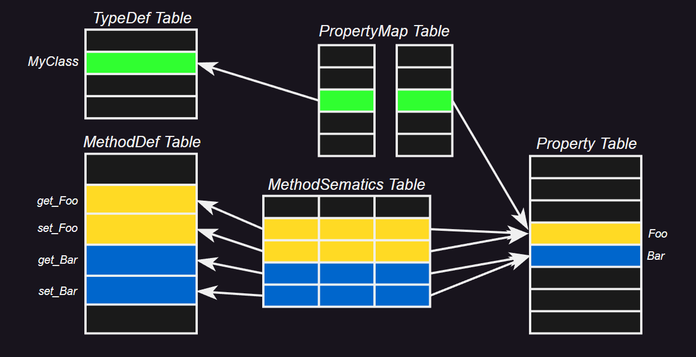

**`PropertyMap`** 表的第 3 行索引了左边 **`TypeDef`** 表的第 2 行 (`MyClass`)，同时索引了右边 **`Property`** 表的第 4 行 —— 一个名为 Foo 的属性的行。这个设置构建了 `MyClass` 有一个名为 `Foo` 的属性。但是在 **`MethodDef`** 表中，哪些方法被聚集在一起作为 “属于” 属性 `Foo`？这种关联包含在 **`MethodSemantics`** 表中 —— 它的第 2 行索引了右边的属性 `Foo`，和左边 **`MethodDef`** 表的第 2 行 (一个名为 `get_Foo` 的方法)。此外，**`MethodSemantics`** 表的第 3 行索引了右边的 `Foo`，和左边 **`MethodDef`** 表的第 3 行 (一个名为 `set_Foo` 的方法)。如图所示，`MyClass` 还有另一个属性叫 `Bar`，有两个方法，`get_Bar` 和 `set_Bar`。

属性表做的不仅仅是将其他表中已有的行聚集在一起。**`Property`** 表有 ***`Flags`***、***`Name`*** (例如这里的 `Foo` 和 `Bar`) 和 ***`Type`*** 的列。此外，**`MethodSemantics`** 表有一个列来记录它指向的方法是 *set_*、*get_* 还是 *other*。

CLS 引用了实例、虚拟和静态属性。属性的签名 (来自 ***`Type`*** 列) 可以用来区分静态属性，因为实例和虚拟属性在签名中会设置 "*`HASTHIS`*" 位 [[↗]](#MethodDefSig)，而静态属性则不会。实例和虚拟属性之间的区别取决于 *getter* 和 *setter* 方法的签名，CLS 要求它们要么都是虚拟的，要么都是实例的。

> *Property* (0x17) 表有以下列：

| *Token* |      |      |      |
| :------ | :--- | :--- | :--- |

| Column                               |  Kind   | Size  | Value                | Description                                      | Link                                     |
| :----------------------------------- | :-----: | :---: | :------------------- | :----------------------------------------------- | :--------------------------------------- |
| ***`Token`***                        | Literal |   4   | 17UUUUUU             | 行编号，高位字节表示表编号，低三位字节是行编号。 |                                          |
| ***`Flags`***<br>/***`Attributes`*** | BitMask |   2   | _PropertyAttributes_ | _PropertyAttributes_ 类型的位掩码。              | [_PropertyAttributes_](#EventAttributes) |
| ***`Name`***                         |  Index  |   4   | ***String Heap***    | 索引属性的名称标识。                             |                                          |
| ***`Type`***<br>/***`Signature`***   |  Index  |   4   | ***Blob Heap***      | 索引属性签名的二进制数据对象。                   |                                          |

> 元数据验证规则

| Order | Validation Rule                                                                                                                                                                                 | Level |
| :---: | :---------------------------------------------------------------------------------------------------------------------------------------------------------------------------------------------- | :---: |
|  1.   | **`Property`** 表可以包含零行或多行。                                                                                                                                                           |
|  2.   | 在 **`PropertyMap`** 表中的 *owner* 行，每一行应有一个 ***`PropertyList`***，且只有一个。                                                                                                       | ERROR |
|  3.   | _PropFlags_ 只应设置那些指定的值 (所有组合有效)。                                                                                                                                               | ERROR |
|  4.   | ***`Name`*** 应索引 ***String Heap*** 中的 no-empty 字符串。                                                                                                                                    | ERROR |
|  5.   | ***`Name`*** 字符串应是一个有效的 CLS 标识符。                                                                                                                                                  |  CLS  |
|  6.   | ***`Type`*** 应索引 ***Blob Heap*** 中的非空签名。                                                                                                                                              | ERROR |
|  7.   | 由 ***`Type`*** 索引的签名应是一个有效的属性签名 (即，前导字节的低四位是 0x8)。除了这个前导字节，签名与属性的 `get_` 方法相同。                                                                 | ERROR |
|  8.   | 在由 **`TypeDef`** 表中的给定行拥有的行中，基于 ***`Name`***+***`Type`*** 不应有重复的行。                                                                                                      | ERROR |
|  9.   | 基于 ***`Name`***，不应有重复的行，其中 ***`Name`*** 字段使用 CLS 冲突标识符规则进行比较。特别是，属性不能通过它们的类型进行重载 —— 例如，一个类不能有两个属性，"`int Foo`" 和 "`String Foo`"。 |  CLS  |
>---
### 20.21. MethodSemantics: 0x18
<a id="MethodSemantics_0x18"></a>

> *MethodSemantics* 表有以下列：

| Column              |  Kind   | Size  | Value                       | Description                                      | Link                                                      |
| :------------------ | :-----: | :---: | :-------------------------- | :----------------------------------------------- | :-------------------------------------------------------- |
| ***`Token`***       | Literal |   4   | 18UUUUUU                    | 行编号，高位字节表示表编号，低三位字节是行编号。 |                                                           |
| ***`Semantics`***   | BitMask |   2   | _MethodSemanticsAttributes_ | 描述方法的语义类别。                             | [*MethodSemanticsAttributes*](#MethodSemanticsAttributes) |
| ***`Method`***      |  Index  |   4   | **`MethodDef`**             | 索引关联语义的方法定义。                         |                                                           |
| ***`Association`*** |  Index  |   4   | Tables                      | 索引 **`Event`** 或 **`Property`** 表。          | [_HasSemantics_](#HasSemantics)                           |

**`MethodSemantics`** 表的行由 **.property** [[↗]](#property) 和 **.event** 指令 [[↗]](#event) 填充。有关更多信息，请参见 [_Event: 0x14_](#Event_0x14) 和 [*Property: 0x17*](#Property_0x17)。

> 元数据验证规则

| Order | Validation Rule                                                                                                                                                           | Level |
| :---: | :------------------------------------------------------------------------------------------------------------------------------------------------------------------------ | :---: |
|  1.   | **`MethodSemantics`** 表可以包含零行或多行。                                                                                                                              |
|  2.   | ***`Semantics`*** 只应设置那些指定的值。                                                                                                                                  | ERROR |
|  3.   | ***`Method`*** 应索引 **`MethodDef`** 表中的有效行，该行应为此行描述的属性或事件的同一类中定义的方法。                                                                    | ERROR |
|  4.   | 对于给定的属性或事件，所有方法应具有相同的可访问性 (即他们的 ***`Flags`*** 行的 *`MemberAccessMask`* 子字段) 并且不能是 *`CompilerControlled`*。                          |  CLS  |
|  5.   | ***`Semantics`***：受以下限制：                                                                                                                                           |
|       | * 如果此行是用于属性的，那么 *`Setter`*、*`Getter`* 或 *`Other`* 中的一个被设置。                                                                                         | ERROR |
|       | * 如果此行是用于事件的，那么 *`AddOn`*、*`RemoveOn`*、*`Fire`* 或 *`Other`* 中的一个被设置。                                                                              | ERROR |
|  6.   | 如果此行是用于事件的，并且其 ***`Semantics`*** 是 *`Addon`* 或 *`RemoveOn`*，那么由 ***`Method`*** 索引的 **`MethodDef`** 表中的行应接受一个委托作为参数，并返回 `void`。 | ERROR |
|  7.   | 如果此行是用于事件的，并且其 ***`Semantics`*** 是 *`Fire`*，那么由 ***`Method`*** 索引的 **`MethodDef`** 表中的行可以返回任何类型。                                       |
|  8.   | 对于每个属性，应有一个 *setter*，或一个 *getter*，或两者都有。                                                                                                            |  CLS  |
|  9.   | 其 ***`Name`*** 是 `xxx`的任何属性的 *getter* 方法，它应被称为 `get_xxx`。                                                                                                |  CLS  |
|  10.  | 其 ***`Name`*** 是 `xxx` 的任何属性的 *setter* 方法，它应被称为 `set_xxx`。                                                                                               |  CLS  |
|  11.  | 如果一个属性提供了 *getter* 和 *setter* 方法，那么这些方法应在 ***`Flags`***.*`MemberAccessMask`* 子字段中具有相同的值。                                                  |  CLS  |
|  12.  | 如果一个属性提供了 *getter* 和 *setter* 方法，那么这些方法应对于他们的 ***`Method`***.***`Flags`***.*`Virtual`* 具有相同的值。                                            |  CLS  |
|  13.  | 任何 *getter* 和 *setter* 方法应具有 ***`Method`***.***`Flags`***.*`SpecialName`* = 1。                                                                                   |  CLS  |
|  14.  | 任何 *getter* 方法应具有与 **`Property`**.***`Type`*** 字段索引的签名匹配的返回类型。                                                                                     |  CLS  |
|  15.  | 任何 *setter* 方法的最后一个参数应具有与 **`Property`**.***`Type`*** 字段索引的签名匹配的类型。                                                                           |  CLS  |
|  16.  | 任何 *setter* 方法应在 ***`Method`***.***`Signature`*** 中具有返回类型 *`ELEMENT_TYPE_VOID`* [[↗]](#ELEMENT_TYPE)。                                                       |  CLS  |
|  17.  | 如果属性被索引，那么 *getter* 和 *setter* 的索引在数量和类型上必须一致。                                                                                                  |  CLS  |
|  18.  | 任何事件的 *AddOn* 方法，其 ***`Name`*** 是 `xxx`，应具有签名：``void add_xxx (<DelegateType> handler)``。                                                                |  CLS  |
|  19.  | 任何事件的 *RemoveOn* 方法，其 ***`Name`*** 是 `xxx`，应具有签名：`void remove_xxx(<DelegateType> handler)`。                                                             |  CLS  |
|  20.  | 任何事件的 *Fire* 方法，其 ***`Name`*** 是 `xxx`，应具有签名：`void raise_xxx(Event e)`。                                                                                 |  CLS  |

>---
### 20.22. MethodImpl: 0x19
<a id="MethodImpl_0x19"></a>

**`MethodImpl`** 表允许编译器覆盖 CLI 提供的默认继承规则。它们最初的用途是允许一个类 `C`，它从接口 `I` 和 `J` 都继承了方法 `M`，为这两个方法提供实现 (而不是在其 ***vtable*** 中只有 `M` 的一个插槽)。然而，_MethodImpls_ 也可以出于其他原因使用，只受限于编译器编写者在下面定义的验证规则的约束内的独创性。

在上面的例子中，***`Class`*** 指定 `C`，***`MethodDeclaration`*** 指定 `I::M`，***`MethodBody`*** 指定为 `I::M` 提供实现的方法 (要么是 `C` 内的一个方法体，要么是 `C` 的基类实现的一个方法体)。

> *MethodImpl* 表有以下列：

| Column                         |  Kind   | Size  | Value         | Description                                      | Link                                |
| :----------------------------- | :-----: | :---: | :------------ | :----------------------------------------------- | :---------------------------------- |
| ***`Token`***                  | Literal |   4   | 19UUUUUU      | 行编号，高位字节表示表编号，低三位字节是行编号。 |                                     |
| ***`MethodDeclaration`***      |  Index  |   4   | Tables        | 索引 **`MethodDef`** 或 **`MemberRef`** 表。     | [_MethodDefOrRef_](#MethodDefOrRef) |
| ***`MethodBody`***             |  Index  |   4   | Tables        | 索引 **`MethodDef`** 或 **`MemberRef`** 表。     | [_MethodDefOrRef_](#MethodDefOrRef) |
| ***`Class`***<br>/***`Type`*** |  Index  |   4   | **`TypeDef`** | 索引实现方法的类型定义。                         |                                     |

ILAsm 使用 **.override** 指令来指定 **`MethodImpl`** 表的行，参考 [*Override*](#override) 和 [*MethodBody*](#MethodBody)。

> 元数据验证规则

| Order | Validation Rule                                                                                                                                                                     | Level |
| :---: | :---------------------------------------------------------------------------------------------------------------------------------------------------------------------------------- | :---: |
|  1.   | **`MethodImpl`** 表可以包含零行或多行。                                                                                                                                             |
|  2.   | ***`Class`*** 应该索引 **`TypeDef`** 表中的有效行。                                                                                                                                 | ERROR |
|  3.   | ***`MethodBody`*** 应该索引 **`MethodDef`** 或 **`MemberRef`** 表中的有效行。                                                                                                       | ERROR |
|  4.   | 由 ***`MethodDeclaration`*** 索引的方法应该设置 ***`Flags`***.*`Virtual`*。                                                                                                         | ERROR |
|  5.   | 由 ***`MethodDeclaration`*** 索引的方法的 *owner* 类型不应该有 ***`Flags`***.*`Sealed`* = 0。                                                                                       | ERROR |
|  6.   | 由 ***`MethodBody`*** 索引的方法应该是 ***`Class`*** 或 ***`Class`*** 的某个基类的成员 (*MethodImpls* 不允许编译器 “*hook*” 任意方法体)。                                           | ERROR |
|  7.   | 由 ***`MethodBody`*** 索引的方法应该是虚方法。                                                                                                                                      | ERROR |
|  8.   | 由 ***`MethodBody`*** 索引的方法其 ***`Method`***.***`RVA`*** ≠ 0 (例如，不能是通过 PInvoke 到达的非托管方法)。                                                                     | ERROR |
|  9.   | ***`MethodDeclaration`*** 应该索引 ***`Class`*** 的祖先链中的一个方法 (通过其 ***`Extends`*** 链到达) 或 ***`Class`*** 的接口树中的一个方法 (通过其 **`InterfaceImpl`** 条目到达)。 | ERROR |
|  10.  | 由 ***`MethodDeclaration`*** 索引的方法不应该是 **final** (其 ***`Flags`***.`Final` 应该是 0)。                                                                                     | ERROR |
|  11.  | 如果 ***`MethodDeclaration`*** 设置了 *`Strict`* 标志，那么由 ***`MethodDeclaration`*** 索引的方法应该对 ***`Class`*** 是可访问的。                                                 | ERROR |
|  12.  | 由 ***`MethodBody`*** 定义的方法签名应该与 ***`MethodDeclaration`*** 定义的方法签名匹配。                                                                                           | ERROR |
|  13.  | 基于 ***`Class`***+***`MethodDeclaration`*** 不应该有重复的行。                                                                                                                     | ERROR |

>---
### 20.23. ModuleRef: 0x1A
<a id="ModuleRef_0x1A"></a>

> *ModuleRef* 表有以下列：

| Column        |  Kind   | Size  | Value             | Description                                      | Link |
| :------------ | :-----: | :---: | :---------------- | :----------------------------------------------- | :--- |
| ***`Token`*** | Literal |   4   | 1AUUUUUU          | 行编号，高位字节表示表编号，低三位字节是行编号。 |      |
| ***`Name`***  |  Index  |   4   | ***String Heap*** | 索引引用的模块的名称标识。                       |      |

**`ModuleRef`** 表中的行是由 Assembly 中的 **.module extern** 指令 [[↗]](#module-extern) 产生的。

> 元数据验证规则

| Order | Validation Rule                                                                                                                              |  Level  |
| :---: | :------------------------------------------------------------------------------------------------------------------------------------------- | :-----: |
|  1.   | ***`Name`*** 应索引 ***String Heap*** 中的 no-empty 字符串。这个字符串应使 CLI 能够定位目标模块。通常，它可能命名用于保存模块的文件。        |  ERROR  |
|  2.   | ***`Name`*** 不应有重复的行。                                                                                                                | WARNING |
|  3.   | ***`Name`*** 应与 **`File`** 表的 ***`Name`*** 列中的一个条目匹配。此外，该条目应使 CLI 能够定位目标模块。通常它可能命名用于保存模块的文件。 |  ERROR  |

>---
### 20.24. TypeSpec: 0x1B
<a id="TypeSpec_0x1B"></a>

**`TypeSpec`** 表只有一列，它索引了存储在 ***Blob Heap*** 中的一个类型的规范。这为该类型提供了一个元数据 **_token_**  (而不是简单地索引 ***Blob Heap***)。这通常是必需的，例如，对数组操作，如创建或调用数组类的方法。

> *TypeSpec* 表有以下列：

| Column            |  Kind   | Size  | Value           | Description                                      | Link                           |
| :---------------- | :-----: | :---: | :-------------- | :----------------------------------------------- | :----------------------------- |
| ***`Token`***     | Literal |   4   | 1BUUUUUU        | 行编号，高位字节表示表编号，低三位字节是行编号。 |                                |
| ***`Signature`*** |  Index  |   4   | ***Blob Heap*** | 索引该类型特殊签名的二进制数据对象               | [*Type Spec*](#type-spec-blob) |

注意，**`TypeSpec`**  **_token_** 可以与任何接受 **`TypeDef`** 或 **`TypeRef`**  **_token_** 的 CIL 指令一起使用；具体来说，`castclass`，`cpobj`，`initobj`，`isinst`，`ldelema`，`ldobj`，`mkrefany`，`newarr`，`refanyval`，`sizeof`，`stobj`，`box`，和 `unbox`。

> 元数据验证规则

| Order | Validation Rule                                                     | Level |
| :---: | :------------------------------------------------------------------ | :---: |
|  1.   | **`TypeSpec`** 表可以包含零行或多行。                               |
|  2.   | ***`Signature`*** 应该索引 ***Blob Heap*** 中的一个有效的类型规范。 | ERROR |
|  3.   | 基于 ***`Signature`***，不应该有重复的行。                          | ERROR |
    

>---
### 20.25. ImplMap: 0x1C
<a id="ImplMap_0x1C"></a>

**`ImplMap`** 表保存了关于可以从托管代码通过 PInvoke 调度访问的非托管方法的信息。**`ImplMap`** 表的每一行将 ***`MemberForwarded`***(索引 **`MethodDef`** 表中的一行) 与 ***`ImportScope`*** 索引的 (**`ModuleRef`** 的) 某个非托管 DLL  中的例程 (***`ImportName`***) 的名称关联起来。

典型的例子是：将存储在 ***`Method`*** 表的第 N 行的托管方法 (所以 ***`MemberForwarded`*** 将有值 N) 与 DLL "`kernel32`" 中名为 "`GetEnvironmentVariable`" 的例程 (由 ***`ImportName`*** 索引的字符串) 关联起来 (***`ImportScope`*** 索引的 **`ModuleRef`** 表中的字符串)。CLI 拦截对托管方法编号 N 的调用，并将它们转发为对 "`kernel32.dll`" 中名为 "`GetEnvironmentVariable`" 的非托管例程的调用 (包括根据需要封送任何参数)。

CLI 不支持此机制来访问从 DLL 导出的字段，只支持方法。

> *ImplMap* 表有以下列：

| Column                  |  Kind   | Size  | Value                 | Description                                                                                              | Link                                      |
| :---------------------- | :-----: | :---: | :-------------------- | :------------------------------------------------------------------------------------------------------- | :---------------------------------------- |
| ***`Token`***           | Literal |   4   | 1CUUUUUU              | 行编号，高位字节表示表编号，低三位字节是行编号。                                                         |                                           |
| ***`MappingFlags`***    | BitMask |   2   | _PInvokeAttributes_， | _PInvokeAttributes_ 类型的位掩码。                                                                       | [_PInvokeAttributes_](#PInvokeAttributes) |
| ***`MemberForwarded`*** |  Index  |   4   | Tables                | 索引 **`Field`** 或 **`MethodDef`** 表。但是它只会索引 **`MethodDef`** 表，因为不支持 **`Field`** 导出。 | [*MemberForwarded*](#MemberForwarded)     |
| ***`ImportScope`***     |  Index  |   4   | **`ModuleRef`**       | 索引引入方法的模块引用。                                                                                 |                                           |
| ***`ImportName`***      |  Index  |   4   | ***String Heap***     | 索引引入方法的名称标识。                                                                                 |                                           |

对于每个定义了一个指定 ***`MappingFlags`***、***`ImportName`*** 和 ***`ImportScope`*** 的 **.pinvokeimpl** 互操作特性的父方法 [[↗]](#unmanaged-method)，都会在 **`ImplMap`** 表中生成一行。

> 元数据验证规则

| Order | Validation Rule                                                                                                                                                                                                                                          | Level |
| :---: | :------------------------------------------------------------------------------------------------------------------------------------------------------------------------------------------------------------------------------------------------------- | :---: |
|  1.   | **`ImplMap`** 可以包含零行或多行。                                                                                                                                                                                                                       |
|  2.   | ***`MappingFlags`*** 只应设置那些指定的值。                                                                                                                                                                                                              | ERROR |
|  3.   | ***`MemberForwarded`*** 应该索引 **`MethodDef`** 表中的有效行。                                                                                                                                                                                          | ERROR |
|  4.   | 在 **`MethodDef`** 表中由 ***`MemberForwarded`*** 索引的行中的 ***`MappingFlags`***.*`CharSetMask`* [[↗]](#PInvokeAttributes) 应该最多设置以下位之一：*`CharSetAnsi`*、*`CharSetUnicode`* 或 *`CharSetAuto`* (如果没有设置，默认为 *`CharSetNotSpec`*)。 | ERROR |
|  5.   | ***`ImportName`*** 应该索引 ***String Heap*** 中的 no-empty 字符串。                                                                                                                                                                                     | ERROR |
|  6.   | ***`ImportScope`*** 应该索引 **`ModuleRef`** 表中的有效行。                                                                                                                                                                                              | ERROR |
|  7.   | 由 ***`MemberForwarded`*** 在 **`MethodDef`** 表中索引的行应该有其 ***`Flags`***.*`PinvokeImpl`* = 1，并且 ***`Flags`***.*`Static`* = 1。                                                                                                                | ERROR |


>---
### 20.26. FieldRVA: 0x1D
<a id="FieldRVA_0x1D"></a>

> *FieldRVA* 表有以下列：

| Column                              |  Kind   | Size  | Value       | Description                                      | Link |
| :---------------------------------- | :-----: | :---: | :---------- | :----------------------------------------------- | :--- |
| ***`Token`***                       | Literal |   4   | 1DUUUUUU    | 行编号，高位字节表示表编号，低三位字节是行编号。 |      |
| ***`RVA`***<br>/***`FieldOffset`*** | Literal |   4   | Number      | 索引的字段的相对虚拟地址。                       |      |
| ***`Field`***                       |  Index  |   4   | **`Field`** | 索引的字段。                                     |      |

从概念上讲，**`FieldRVA`** 表中的每一行都是 **`Field`** 表中的确切一行的扩展，并记录了此字段的初始值存储在图像文件中的 RVA (相对虚拟地址)。

对于每个指定了可选的 **data** 标签的静态父字段，都会创建 **`FieldRVA`** 表中的一行 (参见 [_字段定义和字段引用_](#field))。RVA 列是 PE 文件中数据的相对虚拟地址 (参见 [_在 PE 文件中嵌入数据_](#data))。

> 元数据验证规则

| Order | Validation Rule                                                                                                                                                                                                                                          | Level |
| :---: | :------------------------------------------------------------------------------------------------------------------------------------------------------------------------------------------------------------------------------------------------------- | :---: |
|  1.   | ***`RVA`*** 应为非零。                                                                                                                                                                                                                                   | ERROR |
|  2.   | ***`RVA`*** 应指向当前模块的数据区域 (而不是其元数据区域)。                                                                                                                                                                                              | ERROR |
|  3.   | **`Field`** 应索引 **`Field`** 表中的有效行。                                                                                                                                                                                                            | ERROR |
|  4.   | 任何具有 RVA 的字段应为 *ValueType* (而不是类或接口)。此外，它不应有任何私有字段 (同样适用于其自身为 *ValueType* 的任何字段)。如果违反了这些条件，代码可以覆盖该全局静态并访问其私有字段。此外，该 *ValueType* 的任何字段都不能是对象引用 (进入 GC 堆)。 | ERROR |
|  5.   | 只要两个基于 RVA 的字段符合前面的条件，两个 *ValueType* 跨越的内存范围就可以重叠，没有进一步的约束。这实际上不是一个额外的规则；它只是澄清了关于重叠的基于 RVA 的字段的位置                                                                              |

>---
### 20.27. Assembly: 0x20
<a id="Assembly_0x20"></a>

> *Assembly* 表有以下列：

| Column                                      |  Kind   |  Size   | Value                   | Description                                                                               | Link                                                    |
| :------------------------------------------ | :-----: | :-----: | :---------------------- | :---------------------------------------------------------------------------------------- | :------------------------------------------------------ |
| ***`Token`***                               | Literal |    4    | 20UUUUUU                | 行编号，高位字节表示表编号，低三位字节是行编号。                                          |                                                         |
| ***`HashAlgId`***<br>/***`HashAlgorithm`*** | Literal |    4    | _AssemblyHashAlgorithm_ | 表示计算程序集哈希值的算法类型。                                                          | [_AssemblyHashAlgorithm_](#AssemblyHashAlgorithm-value) |
| ***`Flags`***                               | BitMask |    4    | _AssemblyFlags_         | _AssemblyFlags_ 类别的掩码。                                                              | [_AssemblyFlags_](#AssemblyFlags)                       |
| ***`Version`***                             | Literal | 2/2/2/2 | Number                  | ***`MajorVersion`***，***`MinorVersion`*****，***`BuildNumber`***，***`RevisionNumber`*** |                                                         |
| ***`PublicKey`***                           |  Index  |    4    | ***Blob Heap***         | 索引公钥的二进制数据对象。                                                                |                                                         |
| ***`Name`***                                |  Index  |    4    | ***String Heap***       | 索引程序集的名称标识。                                                                    |                                                         |
| ***`Culture`***                             |  Index  |    4    | ***String Heap***       | 索引该程序集的区域性名称标识。                                                            |                                                         |

**`Assembly`** 表使用 **.assembly** 指令定义 (参见 [_程序集定义_](#assembly) )；其列从相应的 **.hash** 算法，**.ver**，**.publickey** 和 **.culture** 中获取 [[↗]](#AsmDecl)。

> 元数据验证规则

| Order | Validation Rule                                                                                          | Level |
| :---: | :------------------------------------------------------------------------------------------------------- | :---: |
|  1.   | **`Assembly`** 表应包含零行或一行。                                                                      | ERROR |
|  2.   | ***`HashAlgId`*** 应为指定的值之一。                                                                     | ERROR |
|  3.   | ***`MajorVersion`***，***`MinorVersion`***，***`BuildNumber`*** 和 ***`RevisionNumber`*** 可以有任何值。 |
|  4.   | ***`Flags`*** 只应设置指定的值。                                                                         | ERROR |
|  5.   | ***`PublicKey`*** 可以为 null 或非 null。                                                                |
|  6.   | ***`Name`*** 应索引 ***String Heap*** 中的 non-empty 字符串。                                            | ERROR |
|  7.   | ***`Name`*** 索引的字符串可以是无限长度。                                                                |
|  8.   | ***`Culture`*** 可以为 null 或非 null。                                                                  |
|  9.   | 如果 ***`Culture`*** 为非 null，它应索引指定列表中的单个字符串 [[↗]](#Culture-values)。                  | ERROR |

***`Name`*** 是一个简单的名称 (例如，“Foo”，没有驱动器字母，没有路径，没有文件扩展名)；在符合 POSIX 的系统上，***`Name`*** 不包含冒号，不包含正斜杠，不包含反斜杠，也不包含句点。

>---
### 20.28. AssemblyProcessor: 0x21
<a id="AssemblyProcessor_0x21"></a>

> *AssemblyProcessor* 表有以下列：

| Column            |  Kind   | Size  | Value    | Description                                      | Link |
| :---------------- | :-----: | :---: | :------- | :----------------------------------------------- | :--- |
| ***`Token`***     | Literal |   4   | 21UUUUUU | 行编号，高位字节表示表编号，低三位字节是行编号。 |      |
| ***`Processor`*** | Literal |   4   | Number   |                                                  |      |  |

此记录不应被发出到任何 PE 文件中。然而，如果它出现在 PE 文件中，应该将其字段视为零。CLI 应该忽略它。

>---
### 20.29. AssemblyOS: 0x22
<a id="AssemblyOS_0x22"></a>

> *AssemblyOS* 表有以下列：

| Column                 |  Kind   | Size  | Value    | Description                                      | Link |
| :--------------------- | :-----: | :---: | :------- | :----------------------------------------------- | :--- |
| ***`Token`***          | Literal |   4   | 22UUUUUU | 行编号，高位字节表示表编号，低三位字节是行编号。 |      |
| ***`OSPlatformID`***   | Literal |   4   |          |                                                  |      |
| ***`OSMajorVersion`*** | Literal |   4   |          |                                                  |      |
| ***`OSMinorVersion`*** | Literal |   4   |          |                                                  |      |

此记录不应被发出到任何 PE 文件中。然而，如果它出现在 PE 文件中，它应被视为所有字段都为零。CLI 将忽略它。

>---
### 20.30. AssemblyRef: 0x23
<a id="AssemblyRef_0x23"></a>

> *AssemblyRef* 表有以下列：

| Column                   |  Kind   |  Size   | Value             | Description                                                                               | Link                              |
| :----------------------- | :-----: | :-----: | :---------------- | :---------------------------------------------------------------------------------------- | :-------------------------------- |
| ***`Token`***            | Literal |    4    | 23UUUUUU          | 行编号，高位字节表示表编号，低三位字节是行编号。                                          |                                   |
| ***`Version`***          | Literal | 2/2/2/2 | Number            | ***`MajorVersion`***，***`MinorVersion`***，***`BuildNumber`***，***`RevisionNumber`***。 |                                   |
| ***`Flags`***            | BitMask |    4    | _AssemblyFlags_   | _AssemblyFlags_ 类型的位掩码。                                                            | [_AssemblyFlags_](#AssemblyFlags) |
| ***`PublicKeyOrToken`*** |  Index  |    4    | ***Blob Heap***   | 指向它的二进制数据对象。表示标识此 *Assembly* 的发起者的公钥或 **_token_**。              |                                   |
| ***`Name`***             |  Index  |    4    | ***String Heap*** | 索引引用的程序集的名称标识。                                                              |                                   |
| ***`HashValue`***        |  Index  |    4    | ***Blob Heap***   | 索引引用的程序集的哈希值的二进制数据对象。                                                |                                   |

该表由 **.assembly extern** 指令定义 [[↗]](#assembly-extern)。其列使用与 **`Assembly`** 表类似的指令填充，除了 ***`PublicKeyOrToken`*** 列，该列使用 **.publickeytoken** 指令定义。

> 元数据验证规则

***`Name`*** 是一个简单的名称 (例如，“Foo”，没有驱动器字母，没有路径，没有文件扩展名) ；在符合 POSIX 的系统上，Name 不包含冒号，不包含正斜杠，不包含反斜杠，也不包含句点。

| Order | Validation Rule                                                                                                                                                                                                           |  Level  |
| :---: | :------------------------------------------------------------------------------------------------------------------------------------------------------------------------------------------------------------------------ | :-----: |
|  1.   | ***`MajorVersion`***，***`MinorVersion`***，***`BuildNumber`*** 和 ***`RevisionNumber`*** 可以有任何值。                                                                                                                  |
|  2.   | ***`Flags`*** 只应设置一个位，即 *`PublicKey`* 位 [[↗]](#AssemblyFlags)。所有其他位应为零。                                                                                                                               |  ERROR  |
|  3.   | ***`PublicKeyOrToken`*** 可以为 null 或非 null (注意 ***`Flags`***.*`PublicKey`* 位指定 '*blob*' 是完整的公钥还是短哈希 **_token_**)。                                                                                    |
|  4.   | 如果非 null，则 ***`PublicKeyOrToken`*** 应索引 ***Blob Heap*** 中的有效偏移。                                                                                                                                            |  ERROR  |
|  5.   | ***`Name`*** 应索引 ***String Heap*** 中的 non-empty 字符串 (其长度没有限制)。                                                                                                                                            |  ERROR  |
|  6.   | ***`Culture`*** 可以为 null 或非 null。                                                                                                                                                                                   |
|  7.   | 如果非 null，它应索引指定列表中的单个字符串 [[↗]](#Culture-values)。                                                                                                                                                      |  ERROR  |
|  8.   | ***`HashValue`*** 可以为 null 或非 null。                                                                                                                                                                                 |
|  9.   | 如果非 null，则 ***`HashValue`*** 应索引 ***Blob Heap*** 中的非空 '*blob*'。                                                                                                                                              |  ERROR  |
|  10.  | **`AssemblyRef`** 表不应包含重复项 (其中重复行被视为具有相同的 ***`MajorVersion`***，***`MinorVersion`***，***`BuildNumber`***，***`RevisionNumber`***，***`PublicKeyOrToken`***，***`Name`*** 和 ***`Culture`*** 的行)。 | WARNING |

>---
### 20.31. AssemblyRefProcessor: 0x24
<a id="AssemblyRefProcessor_0x24"></a>

> *AssemblyRefProcessor* 表有以下列：

| Column              |  Kind   | Size  | Value             | Description                                      | Link |
| :------------------ | :-----: | :---: | :---------------- | :----------------------------------------------- | :--- |
| ***`Token`***       | Literal |   4   | 24UUUUUU          | 行编号，高位字节表示表编号，低三位字节是行编号。 |      |
| ***`Processor`***   | Literal |   4   | Number            |                                                  |      |
| ***`AssemblyRef`*** |  Index  |   4   | **`AssemblyRef`** | 索引引用的程序集。                               |      |

这些记录不应被发出到任何 PE 文件中。然而，如果它们出现在 PE 文件中，应该将其字段视为零。CLI 应该忽略它们。

>---
### 20.32. AssemblyRefOS: 0x25
<a id="AssemblyRefOS_0x25"></a>

> *AssemblyRefOS* 表有以下列：

| Column                 |  Kind   | Size  | Value             | Description                                      | Link |
| :--------------------- | :-----: | :---: | :---------------- | :----------------------------------------------- | :--- |
| ***`Token`***          | Literal |   4   | 25UUUUUU          | 行编号，高位字节表示表编号，低三位字节是行编号。 |      |
| ***`OSPlatformId`***   | Literal |   4   | Number            |                                                  |      |
| ***`OSMajorVersion`*** | Literal |   4   | Number            |                                                  |      |
| ***`OSMinorVersion`*** | Literal |   4   | Number            |                                                  |      |
| ***`AssemblyRef`***    |  Index  |   4   | **`AssemblyRef`** | 索引引用的程序集。                               |      |

这些记录不应被发出到任何 PE 文件中。然而，如果它们出现在 PE 文件中，它们应被视为其字段都为零。CLI 应忽略它们。

>---
### 20.33. File: 0x26
<a id="File_0x26"></a>

> *File* 表有以下列：

| Column            |  Kind   | Size  | Value             | Description                                      | Link                                |
| :---------------- | :-----: | :---: | :---------------- | :----------------------------------------------- | :---------------------------------- |
| ***`Token`***     | Literal |   4   | 26UUUUUU          | 行编号，高位字节表示表编号，低三位字节是行编号。 |                                     |
| ***`Flags`***     | BitMask |   4   | _FileAttributes_  | _FileAttributes_ 类型的位掩码。                  | [_FileAttributes_](#FileAttributes) |
| ***`Name`***      |  Index  |   4   | ***String Heap*** | 索引引用文件的名称标识。                         |                                     |
| ***`HashValue`*** |  Index  |   4   | ***Blob Heap***   | 索引引用文件的哈希值二进制数据对象。             |                                     |

**`File`** 表的行是程序集中的 **.file** 指令的结果 [[↗]](#file)。 

> 元数据验证规则

| Order | Validation Rule                                                                                                                                            |  Level  |
| :---: | :--------------------------------------------------------------------------------------------------------------------------------------------------------- | :-----: |
|  1.   | ***`Flags`*** 只应设置那些指定的值 (所有组合有效)。                                                                                                        |  ERROR  |
|  2.   | ***`Name`*** 应该索引 ***String Heap*** 中的 non-empty 字符串。它应该是 `<filename>.<extension>` 的格式 (例如，"`foo.dll`"，但不是 "`c:\utils\foo.dll`")。 |  ERROR  |
|  3.   | ***`HashValue`*** 应该索引 ***Blob Heap*** 中的非空 '*blob*'。                                                                                             |  ERROR  |
|  4.   | 不应该有重复的具有相同 ***`Name`*** 值的行。                                                                                                               |  ERROR  |
|  5.   | 如果此模块包含 **`Assembly`** 表中的一行 (也就是说，如果此模块 “持有清单”)，那么 **`File`** 表中不应该有任何关于此模块的行；也就是说，没有自引用。         |  ERROR  |
|  6.   | 如果 **`File`** 表为空，那么按定义，这是一个单文件程序集。在这种情况下，**`ExportedType`** 表应该为空。                                                    | WARNING |

>---
### 20.34. ExportedType: 0x27
<a id="ExportedType_0x27"></a>

**`ExportedType`** 表为每种类型保存一行：

 1. 在此程序集的其他模块中定义；也就是说，从此程序集中导出。本质上，它存储了此程序集包含的其他模块中所有标记为公共的类型的 **`TypeDef`** 行号。
    
    实际的目标行在 **`TypeDef`** 表中由 ***`TypeDefId`*** (实际上是行号) 和 ***`Implementation`*** (实际上是持有目标 **`TypeDef`** 表的模块) 的组合给出。注意，这是元数据中外部 **_token_** 的唯一出现；也就是说， **_token_** 值在另一个模块中有意义。常规 **_token_** 值是对当前模块中的表的索引；或者

 2. 最初在此程序集中定义，但现在已移至另一个程序集。***`Flags`*** 必须设置 *`IsTypeForwarder`*，并且 ***`Implementation`*** 是一个 **`AssemblyRef`**，表示现在可以在另一个程序集中找到该类型。

类型的全名不需要直接存储。相反，它可以在任何包含的 "." 处分成两部分 (尽管通常这是在全名中的最后一个 "." 处完成的)。"." 前面的部分存储为 ***`TypeNamespace`***，"." 后面的部分存储为 ***`TypeName`***。如果全名中没有 "."，那么 ***`TypeNamespace`*** 应该是空字符串的索引。

> *ExportedType* 表有以下列：

| Column                 |  Kind   | Size  | Value             | Description                                                                                                                                                                                                                                                                                                                  | Link                                |
| :--------------------- | :-----: | :---: | :---------------- | :--------------------------------------------------------------------------------------------------------------------------------------------------------------------------------------------------------------------------------------------------------------------------------------------------------------------------- | :---------------------------------- |
| ***`Token`***          | Literal |   4   | 27UUUUUU          | 行编号，高位字节表示表编号，低三位字节是行编号。                                                                                                                                                                                                                                                                             |                                     |
| ***`Flags`***          | BitMask |   4   | _TypeAttributes_  | _TypeAttributes_ 类型的位掩码。                                                                                                                                                                                                                                                                                              | [_TypeAttributes_](#TypeAttributes) |
| ***`TypeDefId`***      |  Index  |   4   | **`TypeDef`**     | 指向此程序集的另一个模块中的 **`TypeDef`** 表。此列仅用作提示。如果目标 **`TypeDef`** 表中的条目与此表中的 ***`TypeName`*** 和 ***`TypeNamespace`*** 条目匹配，则解析成功。但是，如果不匹配，CLI 将回退到目标 **`TypeDef`** 表的搜索。如果 ***`Flags`*** 设置了 *`IsTypeForwarder`*，则忽略并应为零。                        |                                     |
| ***`TypeName`***       |  Index  |   4   | ***String Heap*** | 索引类型的名称标识。                                                                                                                                                                                                                                                                                                         |                                     |
| ***`TypeNamespace`***  |  Index  |   4   | ***String Heap*** | 索引类型所属空间的名称标识。                                                                                                                                                                                                                                                                                                 |                                     |
| ***`Implementation`*** |  Index  |   4   | Tables            | 这是一个指向以下表中的任何一个的索引：<br>&emsp;i. **`File`** 表，该条目说明当前程序集中的哪个模块持有 **`TypeDef`**。<br>&emsp;ii. **`ExportedType`** 表，该条目是当前嵌套类型的封闭类型。<br>&emsp;iii. **`AssemblyRef`** 表，该条目说明在哪个程序集中现在可以找到类型 (***`Flags`*** 必须设置 *`IsTypeForwarder`* 标志)。 | [*Implementation*](#Implementation) |

**`ExportedType`** 表中的行是 **.class extern** 指令的结果 [[↗]](#class-extern)。

> 元数据验证规则

术语 "_FullName_" 指的是以下方式创建的字符串：如果 ***`TypeNamespace`*** 为空，则使用 ***`TypeName`***，否则使用 ***`TypeNamespace`***"."***`TypeName`*** 的连接。

| Order | Validation Rule                                                                                                                                                                                                                                                                                         |  Level  |
| :---: | :------------------------------------------------------------------------------------------------------------------------------------------------------------------------------------------------------------------------------------------------------------------------------------------------------ | :-----: |
|  1.   | **`ExportedType`** 表可以包含零行或多行。                                                                                                                                                                                                                                                               |
|  2.   | **`ExportedType`** 表中不应该有在当前模块中定义的类型的条目 —— 只有在程序集中的其他模块中定义的类型。                                                                                                                                                                                                   |  ERROR  |
|  3.   | ***`Flags`*** 只应设置那些指定的值。                                                                                                                                                                                                                                                                    |  ERROR  |
|  4.   | 如果 ***`Implementation`*** 索引 **`File`** 表，那么 ***`Flags`***.*`VisibilityMask`* 应该是 *`Public`* [[↗]](#TypeAttributes)。                                                                                                                                                                        |  ERROR  |
|  5.   | 如果 ***`Implementation`*** 索引 **`ExportedType`** 表，那么 ***`Flags`***.*`VisibilityMask`* 应该是 *`NestedPublic`* [[↗]](#TypeAttributes)。                                                                                                                                                          |  ERROR  |
|  6.   | 如果非空，***`TypeDefId`*** 应该索引此程序集中的某个模块 (但不是此模块) 中的 **`TypeDef`** 表中的有效行，且所索引的行应该有其 ***`Flags`***.*`Public`* = 1 [[↗]](#TypeAttributes)。                                                                                                                     | WARNING |
|  7.   | ***`TypeName`*** 应该索引 ***String Heap*** 中的 non-empty 字符串。                                                                                                                                                                                                                                     |  ERROR  |
|  8.   | ***`TypeNamespace`*** 可以为空，或非空。                                                                                                                                                                                                                                                                |
|  9.   | 如果 ***`TypeNamespace`*** 是非空的，那么它应该索引 ***String Heap*** 中的 non-empty 字符串。                                                                                                                                                                                                           |  ERROR  |
|  10.  | _FullName_ 应该是一个有效的 CLS 标识符。                                                                                                                                                                                                                                                                |   CLS   |
|  11.  | 如果这是一个嵌套类型，那么 ***`TypeNamespace`*** 应该是空的，***`TypeName`*** 应该表示嵌套类型的未混淆的简单名称。                                                                                                                                                                                      |  ERROR  |
|  12.  | ***`Implementation`*** 应该是一个有效的索引，指向以下任何一个：                                                                                                                                                                                                                                         |  ERROR  |
|       | * **`File`** 表；该文件应该在其 **`TypeDef`** 表中持有目标类型的定义。                                                                                                                                                                                                                                  |
|       | * 当前 **`ExportedType`** 表中的不同行 —— 这标识了当前嵌套类型的封闭类型。                                                                                                                                                                                                                              |
|  13.  | **_FullName_** 应该与 ***`TypeDefId`*** 索引的 **`TypeDef`** 表中的行的相应 **_FullName_** 完全匹配。                                                                                                                                                                                                   |  ERROR  |
|  14.  | 忽略嵌套类型时，基于 **_FullName_** 不应该有重复的行。                                                                                                                                                                                                                                                  |  ERROR  |
|  15.  | 对于嵌套类型，基于 ***`TypeName`*** 和封闭类型不应该有重复的行。                                                                                                                                                                                                                                        |  ERROR  |
|  16.  | 从当前程序集导出的类型的完整列表是 **`ExportedType`** 表与当前 **`TypeDef`** 表中所有公共类型的连接，其中 "public" 指的是 ***`Flags`***.*`VisibilityMask`* 是 *`Public`* 或 *`NestedPublic`*。在这个连接表中，基于 **_FullName_** (如果这是一个嵌套类型，将封闭类型添加到重复检查中) 不应该有重复的行。 |  ERROR  |

>---
### 20.35. ManifestResource: 0x28
<a id="ManifestResource_0x28"></a>

> *ManifestResource* 表有以下列：

| Column                               |  Kind   | Size  | Value                        | Description                                       | Link                                                        |
| :----------------------------------- | :-----: | :---: | :--------------------------- | :------------------------------------------------ | :---------------------------------------------------------- |
| ***`Token`***                        | Literal |   4   | 28UUUUUU                     | 行编号，高位字节表示表编号，低三位字节是行编号。  |                                                             |
| ***`Offset`***                       | Literal |   4   | Offset                       | 此资源记录开始的引用文件内的字节偏移量。          |                                                             |
| ***`Flags`***<br>/***`Attributes`*** | BitMask |   4   | _ManifestResourceAttributes_ | _ManifestResourceAttributes_ 类型的位掩码。       | [_ManifestResourceAttributes_](#ManifestResourceAttributes) |
| ***`Name`***                         |         |   4   | ***String Heap***            | 索引清单资源的名称标识。                          |                                                             |
| ***`Implementation`***               |         |   4   | Tables                       | 索引 **`File`** 表、**`AssemblyRef`** 表或 null。 | [*Implementation*](#Implementation)                         |

***`Offset`*** 指定此资源记录开始的引用文件内的字节偏移量。***`Implementation`*** 指定哪个文件持有此资源。

表中的行是程序集上的 **.mresource** 指令的结果 [[↗]](#mresource)。

> 元数据验证规则

| Order | Validation Rule                                                                                                       | Level |
| :---: | :-------------------------------------------------------------------------------------------------------------------- | :---: |
|  1.   | **`ManifestResource`** 表可以包含零行或多行。                                                                         |
|  2.   | ***`Offset`*** 应该是目标文件中的有效偏移量，从 CLI 头部的资源条目开始。                                              | ERROR |
|  3.   | ***`Flags`*** 只应设置那些指定的值。                                                                                  | ERROR |
|  4.   | ***`Flags`*** 的 *`VisibilityMask`* 子字段 [[↗]](#ManifestResourceAttributes) 应该是 `Public` 或 `Private` 中的一个。 | ERROR |
|  5.   | ***`Name`*** 应该索引 ***String Heap*** 中的 non-empty 字符串。                                                       | ERROR |
|  6.   | ***`Implementation`*** 可以为空或非空 (如果为空，表示资源存储在当前文件中)。                                          |
|  7.   | 如果 ***`Implementation`*** 为空，那么 ***`Offset`*** 应该是当前文件中的有效偏移量，从 CLI 头部的资源条目开始。       | ERROR |
|  8.   | 如果 ***`Implementation`*** 非空，那么它应该索引 **`File`** 或 **`AssemblyRef`** 表中的有效行。                       | ERROR |
|  9.   | 基于 ***`Name`*** 不应该有重复的行。                                                                                  | ERROR |
|  10.  | 如果资源是 **`File`** 表中的索引，***`Offset`*** 应该为零。                                                           | ERROR |

>---
### 20.36. NestedClass: 0x29
<a id="NestedClass_0x29"></a>

> *NestedClass* 表有以下列：

| Column                 |  Kind   | Size  | Value         | Description                                      | Link |
| :--------------------- | :-----: | :---: | :------------ | :----------------------------------------------- | :--- |
| ***`Token`***          | Literal |   4   | 29UUUUUU      | 行编号，高位字节表示表编号，低三位字节是行编号。 |      |
| ***`NestedClass`***    |  Index  |   4   | **`TypeDef`** | 索引嵌套类型的类型定义。                         |      |
| ***`EnclosingClass`*** |  Index  |   4   | **`TypeDef`** | 索引嵌套类型的封闭类型定义 。                    |

***`NestedClass`*** 被定义为在其封闭类型的文本 “内部”。**`NestedClass`** 表记录哪些类型定义嵌套在哪些其他类型定义中。在典型的高级语言中，嵌套类被定义为在其封闭类型的文本  “内部”。

> 元数据验证规则

| Order | Validation Rule                                                                                                                                   |  Level  |
| :---: | :------------------------------------------------------------------------------------------------------------------------------------------------ | :-----: |
|  1.   | **`NestedClass`** 表可以包含零行或多行。                                                                                                          |
|  2.   | ***`NestedClass`*** 应索引 **`TypeDef`** 表中的有效行。                                                                                           |  ERROR  |
|  3.   | ***`EnclosingClass`*** 应索引 **`TypeDef`** 表中的有效行 (特别注意，不允许索引 **`TypeRef`** 表)。                                                |  ERROR  |
|  4.   | 不应有重复行 (即 ***`NestedClass`*** 和 ***`EnclosingClass`*** 的值相同)。                                                                        | WARNING |
|  5.   | 给定类型只能由一个封闭器嵌套。因此，不能有两行具有相同的 ***`NestedClass`*** 值，但它们的 ***`EnclosingClass`*** 值不同。                         |  ERROR  |
|  6.   | 给定类型可以 “拥有” 几种不同的嵌套类型，因此具有两行或多行具有相同的 ***`EnclosingClass`*** 值，但 ***`NestedClass`*** 值不同的情况是完全有效的。 |

>---
### 20.37. GenericParam: 0x2A
<a id="GenericParam_0x2A"></a>

> *GenericParam* 表有以下列：

| Column                               |  Kind   | Size  | Value                    | Description                                                                    | Link                                                |
| :----------------------------------- | :-----: | :---: | :----------------------- | :----------------------------------------------------------------------------- | :-------------------------------------------------- |
| ***`Token`***                        | Literal |   4   | 2AUUUUUU                 | 行编号，高位字节表示表编号，低三位字节是行编号。                               |                                                     |
| ***`Number`***                       | Literal |   2   | Number Index             | 表示泛型参数的索引编号。                                                       |                                                     |
| ***`Flags`***<br>/***`Attributes`*** | BitMask |   2   | _GenericParamAttributes_ | _GenericParamAttributes_ 类型的位掩码。                                        | [_GenericParamAttributes_](#GenericParamAttributes) |
| ***`Owner`***                        |  Index  |   4   | Tables                   | 索引 **`TypeDef`** 或 **`MethodDef`** 表，指定此泛型参数适用的类型或方法。     | [_TypeOrMethodDef_](#TypeOrMethodDef)               |
| ***`Name`***                         |  Index  |   4   | ***String Heap***        | 非空索引值。索引泛型参数的名称。这完全是描述性的，只由源语言编译器和反射使用。 |                                                     |

以下是其他的限制：

 * ***`Owner`*** 不能是非嵌套的枚举类型；并且
 * 如果 ***`Owner`*** 是嵌套的枚举类型，那么 ***`Number`*** 必须小于或等于封闭类的泛型参数的数量。

泛型枚举类型的作用很小，通常只存在于满足 CLS Rule 42。这些额外的限制约束了枚举类型的通用性，同时允许满足 CLS Rule 42。**`GenericParam`** 表存储了在泛型类型定义和泛型方法定义中使用的泛型参数。这些泛型参数可以被约束 (即，泛型参数应扩展某个类和 / 或实现某些接口) 或无约束。这样的约束存储在 **`GenericParamConstraint`** 表中。 

从概念上讲，**`GenericParam`** 表中的每一行都属于 **`TypeDef`** 或 **`MethodDef`** 表中的一行，且只有一行拥有。

 ```cil
 .class Dict`2<([mscorlib]System.IComparable) K, V>
 ```

类 `Dict` 的泛型参数 `K` 被约束为实现 `System.IComparable`。

 ```cil
 .method static void ReverseArray<T>(!!0[] 'array')
 ```

泛型方法 `ReverseArray` 的泛型参数 `T` 没有约束。 

> 元数据验证规则

| Order | Validation Rule                                                                                                             | Level |
| :---: | :-------------------------------------------------------------------------------------------------------------------------- | :---: |
|  1.   | **`GenericParam`** 表可以包含零行或多行。                                                                                   |
|  2.   | 每一行应有一个，且只有一个，在 **`TypeDef`** 或 **`MethodDef`** 表中的 *owner* 行 (即，没有行共享)。                        | ERROR |
|  3.   | 每个泛型类型应在 **`GenericParam`** 表中为其每个泛型参数拥有一行。                                                          | ERROR |
|  4.   | 每个泛型方法应在 **`GenericParam`** 表中为其每个泛型参数拥有一行。                                                          | ERROR |
|  5.   | ***`Flags`*** 可以持有 *`Covariant`* 或 *`Contravariant`* 的值，但只有当 *owner* 行对应于泛型接口或泛型委托类时才能这样做。 | ERROR |
|  6.   | 否则，***`Flags`*** 应持有 *`None`* 值，表示非变量 (即，参数是非变量或 *owner* 是非委托类、值类型或泛型方法)。              | ERROR |
|  7.   | 如果 ***`Flags`*** == *`Covariant`*，那么相应的泛型参数只能作为以下内容出现在类型定义中：                                   | ERROR |
|       | * 方法的结果类型                                                                                                            |
|       | * 继承接口的泛型参数                                                                                                        |
|  8.   | 如果 ***`Flags`*** == *`Contravariant`*，那么相应的泛型参数只能作为方法的参数出现在类型定义中。                             | ERROR |
|  9.   | ***`Number`*** 应有一个值 &ge; 0 且 <  *owner* 类型或方法的泛型参数的数量。                                                 | ERROR |
|  10.  | 同一方法拥有的 **`GenericParam`** 表中的连续行应按照 ***`Number`*** 值的增加顺序排序；***`Number`*** 序列中不应有间隙。     | ERROR |
|  11.  | ***`Name`*** 是索引 ***String Heap*** 中的 no-empty 字符串                                                                  | ERROR |
|  12.  | 基于 ***`Owner`***+***`Name`***，不应有重复的行 。                                                                          | ERROR |
|  13.  | 基于 ***`Owner`***+***`Number`***，不应有重复的行。                                                                         | ERROR |

>---
### 20.38. MethodSpec: 0x2B
<a id="MethodSpec0x2B"></a>

> *MethodSpec* 表有以下列：

| Column                                      |  Kind   | Size  | Value           | Description                                                                                            | Link                                |
| :------------------------------------------ | :-----: | :---: | :-------------- | :----------------------------------------------------------------------------------------------------- | :---------------------------------- |
| ***`Token`***                               | Literal |   4   | 2BUUUUUU        | 行编号，高位字节表示表编号，低三位字节是行编号。                                                       |                                     |
| ***`Method`***                              |  Index  |   4   | Tables          | 索引 **`MethodDef`** 或 **`MemberRef`** 表。指定此行引用的泛型方法；也就是说，此行是哪个泛型方法的实例 | [_MethodDefOrRef_](#MethodDefOrRef) |
| ***`Instantiation`***<br>/***`Signature`*** |  Index  |   4   | ***Blob Heap*** | 索引方法特殊签名的二进制数据对象。                                                                     | [*MethodSpec*](#MethodSpec-blob)    |

**`MethodSpec`** 表记录实例化泛型方法的签名。泛型方法的每个唯一实例 (即，***`Method`*** 和 ***`Instantiation`*** 的组合) 应由表中的单个行表示。

> 元数据验证规则

| Order | Validation Rule                                                                                      | Level |
| :---: | :--------------------------------------------------------------------------------------------------- | :---: |
|  1.   | **`MethodSpec`** 表可以包含零行或多行。                                                              |
|  2.   | 一个或多个行可以引用 **`MethodDef`** 或 **`MemberRef`** 表中的相同行。可以有同一泛型方法的多个实例。 |
|  3.   | 存储在 ***`Instantiation`*** 中的签名应为 ***`Method`*** 存储的泛型方法的签名的有效实例。            | ERROR |
|  4.   | 基于 ***`Method`***+***`Instantiation`*** 不应有重复行。                                             | ERROR |

>---
### 20.39. GenericParamConstraint: 0x2C
<a id="GenericParamConstraint_0x2C"></a>

> *GenericParamConstraint* 表有以下列：

| Column                              |  Kind   | Size  | Value              | Description                                                                                                                  | Link                            |
| :---------------------------------- | :-----: | :---: | :----------------- | :--------------------------------------------------------------------------------------------------------------------------- | :------------------------------ |
| ***`Token`***                       | Literal |   4   | 2CUUUUUU           | 行编号，高位字节表示表编号，低三位字节是行编号。                                                                             |                                 |
| ***`Owner`***                       |  Index  |   4   | **`GenericParam`** | 索引此行引用的泛型参数。                                                                                                     |                                 |
| ***`Constraint`***<br>/***`Type`*** |  Index  |   4   | Tables             | 索引 **`TypeDef`**，**`TypeRef`** 或 **`TypeSpec`** 表，指定此泛型参数受限于应从哪个类派生，或此泛型参数受限于实现哪个接口。 | [_TypeDefOrRef_](#TypeDefOrRef) |

**`GenericParamConstraint`** 表记录每个泛型参数的约束。每个泛型参数可以约束为从零个或一个类派生。每个泛型参数可以约束为实现零个或多个接口。

从概念上讲，**`GenericParamConstraint`** 表中的每一行都由 **`GenericParam`** 表中的一行 “拥有”。给定 ***`Owner`*** 的 **`GenericParamConstraint`** 表中的所有行应引用不同的约束。

请注意，如果 ***`Constraint`*** 是对 `System.ValueType` 的 **`TypeRef`**，那么它意味着约束类型应为 `System.ValueType`，或其子类型之一。然而，由于 `System.ValueType` 本身是引用类型，这种特定机制并不能保证类型是非引用类型。


> 元数据验证规则

| Order | Validation Rule                                                                                                            | Level |
| :---: | :------------------------------------------------------------------------------------------------------------------------- | :---: |
|  1.   | **`GenericParamConstraint`** 表可以包含零行或多行。                                                                        |
|  2.   | 每一行在 **`GenericParam`** 表中都应有一个且只有一个 *owner* 行 (即，没有行共享)  。                                       | ERROR |
|  3.   | **`GenericParam`** 表中的每一行应 “拥有” **`GenericParamConstraint`** 表中的一个单独行，对应于该泛型参数具有的每个约束。   | ERROR |
|  4.   | 在 **`GenericParam`** 表中的给定行拥有的 **`GenericParamConstraint`** 表中的所有行应形成一个连续的范围 (行)。              | ERROR |
|  5.   | 任何泛型参数 (对应于 **`GenericParam`** 表中的一行) 应拥有 **`GenericParamConstraint`** 表中的零行或一行，对应于类约束。   | ERROR |
|  6.   | 任何泛型参数 (对应于 **`GenericParam`** 表中的一行) 应拥有 **`GenericParamConstraint`** 表中的零行或多行，对应于接口约束。 | ERROR |
|  7.   | 基于 ***`Owner`***+***`Constraint`*** 不应有重复行。                                                                       | ERROR |
|  8.   | 约束不应引用 `System.Void`。                                                                                               | ERROR |

---
## 21. 元数据逻辑格式：子结构
<a id="metadata-format-others"></a>

>---
### 21.1. BitMasks & Flags

此小节解释了元数据表中使用的 ***Flags*** 和 ***BitMasks***。当符合规范的实现遇到未在此标准中指定的元数据结构 (如 *Flags*) 时，实现的行为是未指定的。

#### 21.1.1. AssemblyHashAlgorithm
<a id="AssemblyHashAlgorithm-value"></a>

 | Algorithm              | Value  |
 | :--------------------- | :----: |
 | *`None`*               | 0x0000 |
 | *`Reserved`* (*`MD5`*) | 0x8003 |
 | *`SHA1`*               | 0x8004 |

#### 21.1.2. AssemblyFlags
<a id="AssemblyFlags"></a>

 | Flag                           | Value  | Description                                                                                                                         |
 | :----------------------------- | :----: | :---------------------------------------------------------------------------------------------------------------------------------- |
 | *`PublicKey`*                  | 0x0001 | 程序集引用包含完整的 (未哈希的) 公钥。                                                                                              |
 | *`Retargetable`*               | 0x0100 | 运行时使用的此程序集的实现不预期与编译时看到的版本匹配。(参见此表后的文本。)                                                        |
 | *`DisableJITcompileOptimizer`* | 0x4000 | 保留 (符合 CLI 的规范的实现可以在读取时忽略此设置；一些实现可能使用此位来指示 CIL-to-native-code 编译器不应生成优化的代码)          |
 | *`EnableJITcompileTracking`*   | 0x8000 | 保留 (符合 CLI 的规范的实现可以在读取时忽略此设置；一些实现可能使用此位来指示 CIL-to-native-code 编译器应生成 CIL 到本地代码的映射) |

#### 21.1.3. Culture 
<a id="Culture-values"></a>

 |  Cultures  |   &nbsp;   | &nbsp;  |   &nbsp;   |   &nbsp;   |  &nbsp;  |   &nbsp;   | &nbsp;  |
 | :--------: | :--------: | :-----: | :--------: | :--------: | :------: | :--------: | :-----: |
 |  `ar-SA`   |  `ar-IQ`   | `ar-EG` |  `ar-LY`   |  `ar-DZ`   | `ar-MA`  |  `ar-TN`   | `ar-OM` |
 |  `ar-YE`   |  `ar-SY`   | `ar-JO` |  `ar-LB`   |  `ar-KW`   | `ar-AE`  |  `ar-BH`   | `ar-QA` |
 |  `bg-BG`   |  `ca-ES`   | `zh-TW` |  `zh-CN`   |  `zh-HK`   | `zh-SG`  |  `zh-MO`   | `cs-CZ` |
 |  `da-DK`   |  `de-DE`   | `de-CH` |  `de-AT`   |  `de-LU`   | `de-LI`  |  `el-GR`   | `en-US` |
 |  `en-GB`   |  `en-AU`   | `en-CA` |  `en-NZ`   |  `en-IE`   | `en-ZA`  |  `en-JM`   | `en-CB` |
 |  `en-BZ`   |  `en-TT`   | `en-ZW` |  `en-PH`   | `es-ES-Ts` | `es-MX`  | `es-ES-Is` | `es-GT` |
 |  `es-CR`   |  `es-PA`   | `es-DO` |  `es-VE`   |  `es-CO`   | `es-PE`  |  `es-AR`   | `es-EC` |
 |  `es-CL`   |  `es-UY`   | `es-PY` |  `es-BO`   |  `es-SV`   | `es-HN`  |  `es-NI`   | `es-PR` |
 |  `fi-FI`   |  `fr-FR`   | `fr-BE` |  `fr-CA`   |  `fr-CH`   | `fr-LU`  |  `fr-MC`   | `he-IL` |
 |  `hu-HU`   |  `is-IS`   | `it-IT` |  `it-CH`   |  `ja-JP`   | `ko-KR`  |  `nl-NL`   | `nl-BE` |
 |  `nb-NO`   |  `nn-NO`   | `pl-PL` |  `pt-BR`   |  `pt-PT`   | `ro-RO`  |  `ru-RU`   | `hr-HR` |
 | `lt-sr-SP` | `cy-sr-SP` | `sk-SK` |  `sq-AL`   |  `sv-SE`   | `sv-FI`  |  `th-TH`   | `tr-TR` |
 |  `ur-PK`   |  `id-ID`   | `uk-UA` |  `be-BY`   |  `sl-SI`   | `et-EE`  |  `lv-LV`   | `lt-LT` |
 |  `fa-IR`   |  `vi-VN`   | `hy-AM` | `lt-az-AZ` | `cy-az-AZ` | `eu-ES`  |  `mk-MK`   | `af-ZA` |
 |  `ka-GE`   |  `fo-FO`   | `hi-IN` |  `ms-MY`   |  `ms-BN`   | `kk-KZ`  |  `ky-KZ`   | `sw-KE` |
 | `lt-uz-UZ` | `cy-uz-UZ` | `tt-TA` |  `pa-IN`   |  `gu-IN`   | `ta-IN`  |  `te-IN`   | `kn-IN` |
 |  `mr-IN`   |  `sa-IN`   | `mn-MN` |  `gl-ES`   |  `kok-IN`  | `syr-SY` |  `div-MV`  |

**关于 RFC 1766，区域名称的注释**：典型的字符串将是 "``en-US``"。第一部分 (例子中的"`en`") 使用 ISO 639 字符 (小写的拉丁字母字符。不使用带有变音符号的或修改过的字符)。第二部分 (例子中的 "`US`") 使用 ISO 3166 字符 (类似于 ISO 639，但是大写) ；也就是说，ASCII 字符 `a` ~ `z` 和 `A` ~ `Z`。然而，虽然 RFC 1766 建议第一部分使用小写，第二部分使用大写，但它允许混合大小写。因此，验证规则只检查 ***`Culture`*** 是否是上面列表中的字符串之一 — 但是检查是完全 “不区分大小写” 的。

#### 21.1.4. Flags for Events [EventAttributes]
<a id="EventAttributes"></a>

 | Flag              | Value  | Description                            |
 | :---------------- | :----: | :------------------------------------- |
 | *`SpecialName`*   | 0x0200 | 事件是特殊的。                         |
 | *`RTSpecialName`* | 0x0400 | CLI 提供 '特殊' 行为，取决于事件的名称 |

#### 21.1.5. Fields [FieldAttributes]
<a id="FieldAttributes"></a>

  | Flag                         | Value  | Description                                       |
  | :--------------------------- | :----: | :------------------------------------------------ |
  | *`FieldAccessMask`*          | 0x0007 | 这 3 位包含以下 Value 之一：                      |
  | &emsp;*`CompilerControlled`* | 0x0000 | 成员不可引用                                      |
  | &emsp;*`Private`*            | 0x0001 | 仅父类型可访问                                    |
  | &emsp;*`FamANDAssem`*        | 0x0002 | 仅类型和此程序集内部的子类型可访问                |
  | &emsp;*`Assembly`*           | 0x0003 | 程序集内部可访问                                  |
  | &emsp;*`Family`*             | 0x0004 | 仅类型和子类型可访问                              |
  | &emsp;*`FamORAssem`*         | 0x0005 | 任意子类型或程序集内部可访问                      |
  | &emsp;*`Public`*             | 0x0006 | 公共可访问性                                      |
  | **Field modifiers**          | &nbsp; | &nbsp;                                            |
  | &emsp;*`Static`*             | 0x0010 | 在类型上定义静态                                  |
  | &emsp;*`InitOnly`*           | 0x0020 | 字段仅初始化，初始化后不能写入                    |
  | &emsp;*`Literal`*            | 0x0040 | 字段值是编译时常量                                |
  | &emsp;*`NotSerialized`*      | 0x0080 | 保留 (用于指示当类型被远程化时，不应序列化此字段) |
  | &emsp;*`SpecialName`*        | 0x0200 | 字段是特殊的                                      |
  | **Interop attributes**       | &nbsp; | &nbsp;                                            |
  | &emsp;*`PInvokeImpl`*        | 0x2000 | 实现通过 PInvoke 转发。                           |
  | **Additional flags**         | &nbsp; | &nbsp;                                            |
  | &emsp;*`RTSpecialName`*      | 0x0400 | CLI 提供 '特殊' 行为，取决于字段的名称            |
  | &emsp;*`HasFieldMarshal`*    | 0x1000 | 字段有封送处理信息                                |
  | &emsp;*`HasDefault`*         | 0x8000 | 字段有默认值                                      |
  | &emsp;*`HasFieldRVA`*        | 0x0100 | 字段有 RVA                                        |


#### 21.1.6. Files [FileAttributes]
<a id="FileAttributes"></a>

 | Flag                   | Value  | Description                              |
 | :--------------------- | :----: | :--------------------------------------- |
 | *`ContainsMetaData`*   | 0x0000 | 这不是一个资源文件                       |
 | *`ContainsNoMetaData`* | 0x0001 | 这是一个资源文件或其他不包含元数据的文件 |

#### 21.1.7. Generic Parameters [GenericParamAttributes]
<a id="GenericParamAttributes"></a>

| Flag                                     | Value  | Description                        |
| :--------------------------------------- | :----: | :--------------------------------- |
| *`VarianceMask`*                         | 0x0003 | 这两位包含以下 Value 之一：        |
| &emsp;*`None`*                           | 0x0000 | 泛型参数是非变体，并且没有特殊约束 |
| &emsp;*`Covariant`*                      | 0x0001 | 泛型参数是协变的                   |
| &emsp;*`Contravariant`*                  | 0x0002 | 泛型参数是逆变的                   |
| *`SpecialConstraintMask`*                | 0x001C | 这三位包含以下 Value 之一：        |
| &emsp;*`ReferenceTypeConstraint`*        | 0x0004 | 泛型参数具有 `class` 特殊约束      |
| &emsp;*`NotNullableValueTypeConstraint`* | 0x0008 | 泛型参数具有 `valuetype` 特殊约束  |
| &emsp;*`DefaultConstructorConstraint`*   | 0x0010 | 泛型参数具有 `.ctor` 特殊约束      |

#### 21.1.8. ImplMap [PInvokeAttributes]
<a id="PInvokeAttributes"></a>
 | Flag                          | Value  | Description                                                         |
 | :---------------------------- | :----: | :------------------------------------------------------------------ |
 | *`NoMangle`*                  | 0x0001 | PInvoke 将使用指定的成员名称                                        |
 | **Character set**             | &nbsp; | &nbsp;                                                              |
 | *`CharSetMask`*               | 0x0006 | 这是一个资源文件或其他不包含元数据的文件。这两位包含以下Value之一： |
 | &emsp;*`CharSetNotSpec`*      | 0x0000 | &nbsp;                                                              |
 | &emsp;*`CharSetAnsi`*         | 0x0002 | &nbsp;                                                              |
 | &emsp;*`CharSetUnicode`*      | 0x0004 | &nbsp;                                                              |
 | &emsp;*`CharSetAuto`*         | 0x0006 | &nbsp;                                                              |
 | *`SupportsLastError`*         | 0x0040 | 关于目标函数的信息。对字段不相关                                    |
 | **Calling convention**        | &nbsp; | &nbsp;                                                              |
 | *`CallConvMask`*              | 0x0700 | 这三位包含以下 Value 之一：                                         |
 | &emsp;*`CallConvPlatformapi`* | 0x0100 | &nbsp;                                                              |
 | &emsp;*`CallConvCdecl`*       | 0x0200 | &nbsp;                                                              |
 | &emsp;*`CallConvStdcall`*     | 0x0300 | &nbsp;                                                              |
 | &emsp;*`CallConvThiscall`*    | 0x0400 | &nbsp;                                                              |
 | &emsp;*`CallConvFastcall`*    | 0x0500 | &nbsp;                                                              |

#### 21.1.9. ManifestResource [ManifestResourceAttributes]
<a id="ManifestResourceAttributes"></a>

 | Flag               | Value  | Description                 |
 | :----------------- | :----: | :-------------------------- |
 | *`VisibilityMask`* | 0x0007 | 这三位包含以下 Value 之一： |
 | &emsp;*`Public`*   | 0x0001 | 资源从程序集中导出          |
 | &emsp;*`Private`*  | 0x0002 | 资源对程序集是私有的        |

#### 21.1.10. Methods [MethodAttributes]
<a id="MethodAttributes"></a>

 | Flag                         | Value  | Description                                                 |
 | :--------------------------- | :----: | :---------------------------------------------------------- |
 | *`MemberAccessMask`*         | 0x0007 | 这3位包含以下 Value 之一：                                  |
 | &emsp;*`CompilerControlled`* | 0x0000 | 成员不可引用                                                |
 | &emsp;*`Private`*            | 0x0001 | 仅父类型可访问                                              |
 | &emsp;*`FamANDAssem`*        | 0x0002 | 仅此程序集中的子类型可访问                                  |
 | &emsp;*`Assem`*              | 0x0003 | 程序集内部可访问                                            |
 | &emsp;*`Family`*             | 0x0004 | 仅类型和子类型可访问                                        |
 | &emsp;*`FamORAssem`*         | 0x0005 | 任意子类型或者程序集内部可访问                              |
 | &emsp;*`Public`*             | 0x0006 | 公共可访问性                                                |
 | **Member modifiers**         |        |                                                             |
 | *`Static`*                   | 0x0010 | 在类型上定义，否则每个实例                                  |
 | *`Final`*                    | 0x0020 | 方法不能被重写                                              |
 | *`Virtual`*                  | 0x0040 | 方法是虚拟的                                                |
 | *`HideBySig`*                | 0x0080 | 方法通过名称+签名隐藏，否则只通过名称隐藏                   |
 | *`Strict`*                   | 0x0200 | 方法只有在也可访问时才能被重写                              |
 | *`Abstract`*                 | 0x0400 | 方法不提供实现                                              |
 | *`SpecialName`*              | 0x0800 | 方法是特殊的                                                |
 | *`VtableLayoutMask`*         | 0x0100 | 使用此掩码检索 ***vtable*** 特性。此位包含以下 Value 之一： |
 | &emsp;*`ReuseSlot`*          | 0x0000 | 方法重用 ***vtable*** 中的现有槽                            |
 | &emsp;*`NewSlot`*            | 0x0100 | 方法总是在 ***vtable*** 中获取新槽                          |
 | **Interop attributes**       | &nbsp; | &nbsp;                                                      |
 | *`PInvokeImpl`*              | 0x2000 | 实现通过 PInvoke 转发                                       |
 | *`UnmanagedExport`*          | 0x0008 | 保留：对于符合规范的实现，应为零                            |
 | **Additional flags**         | &nbsp; | &nbsp;                                                      |
 | *`RTSpecialName`*            | 0x1000 | CLI 提供 '特殊' 行为，取决于方法的名称                      |
 | *`HasSecurity`*              | 0x4000 | 方法与其关联的安全性                                        |
 | *`RequireSecObject`*         | 0x8000 | 方法调用包含安全代码的另一种方法                            |

#### 21.1.11. MethodImpl [MethodImplAttributes]
<a id="MethodImplAttributes"></a>

 | Flag                                    | Value  | Description                                                 |
 | :-------------------------------------- | :----: | :---------------------------------------------------------- |
 | *`CodeTypeMask`*                        | 0x0003 | 这两位包含以下Value之一：                                   |
 | &emsp;*`IL`*                            | 0x0000 | 方法实现是 CIL                                              |
 | &emsp;*`Native`*                        | 0x0001 | 方法实现是本地的                                            |
 | &emsp;*`OPTIL`*                         | 0x0002 | 保留：在符合规范的实现中应为零                              |
 | &emsp;*`Runtime`*                       | 0x0003 | 方法实现由运行时提供                                        |
 | *`ManagedMask`*                         | 0x0004 | 指定代码是托管的还是非托管的标志。这一位包含以下Value之一： |
 | &emsp;*`Unmanaged`*                     | 0x0004 | 方法实现是非托管的，否则是托管的                            |
 | &emsp;*`Managed`*                       | 0x0000 | 方法实现是托管的                                            |
 | **Implementation info<br> and interop** | &nbsp; | &nbsp;                                                      |
 | *`ForwardRef`*                          | 0x0010 | 表示方法已定义；主要用于合并场景                            |
 | *`PreserveSig`*                         | 0x0080 | 保留：符合规范的实现可以忽略                                |
 | *`InternalCall`*                        | 0x1000 | 保留：在符合规范的实现中应为零                              |
 | *`Synchronized`*                        | 0x0020 | 方法在主体中是单线程的                                      |
 | *`NoInlining`*                          | 0x0008 | 方法不能内联                                                |
 | *`MaxMethodImplVal`*                    | 0xffff | 范围检查 Value                                              |
 | *`NoOptimization`*                      | 0x0040 | 在生成本地代码时，方法不会被优化                            |

####  21.1.12. MethodSemantics [MethodSemanticsAttributes]
<a id="MethodSemanticsAttributes"></a>

 | Flag         | Value  | Description                                                                  |
 | :----------- | :----: | :--------------------------------------------------------------------------- |
 | *`Setter`*   | 0x0001 | 属性的设置器                                                                 |
 | *`Getter`*   | 0x0002 | 属性的获取器                                                                 |
 | *`Other`*    | 0x0004 | 属性或事件的其他方法                                                         |
 | *`AddOn`*    | 0x0008 | 事件的 AddOn 方法。这指的是事件所需的 `add_` 方法。 [[↗]](#Event_0x14)       |
 | *`RemoveOn`* | 0x0010 | 事件的 RemoveOn 方法。这指的是事件所需的 `remove_` 方法。 [[↗]](#Event_0x14) |
 | *`Fire`*     | 0x0020 | 事件的 Fire 方法。这指的是事件的可选 `raise_` 方法。 [[↗]](#Event_0x14)      |

#### 21.1.13. Params [ParamAttributes]
<a id="ParamAttributes"></a>

 | Flag                | Value  | Description                    |
 | :------------------ | :----: | :----------------------------- |
 | *`In`*              | 0x0001 | 参数是 `[in]`                  |
 | *`Out`*             | 0x0002 | 参数是 `[out]`                 |
 | *`Optional`*        | 0x0010 | 参数是可选的                   |
 | *`HasDefault`*      | 0x1000 | 参数有默认 Value               |
 | *`HasFieldMarshal`* | 0x2000 | 参数有 ***`FieldMarshal`***    |
 | *`Unused`*          | 0xcfe0 | 保留：在符合规范的实现中应为零 |

#### 21.1.14. Properties [PropertyAttributes]
<a id="PropertyAttributes"></a>

 | Flag              | Value  | Description                            |
 | :---------------- | :----: | :------------------------------------- |
 | *`SpecialName`*   | 0x0200 | 属性是特殊的                           |
 | *`RTSpecialName`* | 0x0400 | 运行时 (元数据内部 API) 应检查名称编码 |
 | *`HasDefault`*    | 0x1000 | 属性有默认 Value                       |
 | *`Unused`*        | 0xe9ff | 保留：在符合规范的实现中应为零         |

#### 21.1.15. Types [TypeAttributes]
<a id="TypeAttributes"></a>

 | Flag                                                     |   Value    | Description                                                                      |
 | :------------------------------------------------------- | :--------: | :------------------------------------------------------------------------------- |
 | **Visibility attributes**                                |   &nbsp;   | &nbsp;                                                                           |
 | *`VisibilityMask`*                                       | 0x00000007 | 使用此掩码检索可见性信息。这 3 位包含以下 Value 之一：                           |
 | &emsp;*`NotPublic`*                                      | 0x00000000 | 类没有公共范围                                                                   |
 | &emsp;*`Public`*                                         | 0x00000001 | 类具有公共范围                                                                   |
 | &emsp;*`NestedPublic`*                                   | 0x00000002 | 类是具有公共可见性的嵌套类                                                       |
 | &emsp;*`NestedPrivate`*                                  | 0x00000003 | 类是具有私有可见性的嵌套类                                                       |
 | &emsp;*`NestedFamily`*                                   | 0x00000004 | 类是具有家族可见性的嵌套类                                                       |
 | &emsp;*`NestedAssembly`*                                 | 0x00000005 | 类是具有程序集可见性的嵌套类                                                     |
 | &emsp;*`NestedFamANDAssem`*                              | 0x00000006 | 类是具有家族和程序集可见性的嵌套类                                               |
 | &emsp;*`NestedFamORAssem`*                               | 0x00000007 | 类是具有家族或程序集可见性的嵌套类                                               |
 | **Class layout attributes**                              |   &nbsp;   | &nbsp;                                                                           |
 | *`LayoutMask`*                                           | 0x00000018 | 使用此掩码检索类布局信息。这 2 位包含以下 Value 之一：                           |
 | &emsp;*`AutoLayout`*                                     | 0x00000000 | 类字段是自动布局的                                                               |
 | &emsp;*`SequentialLayout`*                               | 0x00000008 | 类字段是顺序布局的                                                               |
 | &emsp;*`ExplicitLayout`*                                 | 0x00000010 | 布局是显式提供的                                                                 |
 | **Class semantics attributes**                           |   &nbsp;   | &nbsp;                                                                           |
 | *`ClassSemanticsMask`*                                   | 0x00000020 | 使用此掩码检索类语义信息。此位包含以下 Value 之一：                              |
 | &emsp;*`Class`*                                          | 0x00000000 | 类型是类                                                                         |
 | &emsp;*`Interface`*                                      | 0x00000020 | 类型是接口                                                                       |
 | **Special semantics in addition<br> to class semantics** |   &nbsp;   | &nbsp;                                                                           |
 | *`Abstract`*                                             | 0x00000080 | 类是抽象的                                                                       |
 | *`Sealed`*                                               | 0x00000100 | 类不能被扩展                                                                     |
 | *`SpecialName`*                                          | 0x00000400 | 类名是特殊的                                                                     |
 | **Implementation Attributes**                            |   &nbsp;   | &nbsp;                                                                           |
 | *`Import`*                                               | 0x00001000 | 类/接口是导入的                                                                  |
 | *`Serializable`*                                         | 0x00002000 | 保留 (类是可序列化的)                                                            |
 | **String formatting Attributes**                         |   &nbsp;   | &nbsp;                                                                           |
 | *`StringFormatMask`*                                     | 0x00030000 | 使用此掩码检索用于本地互操作的字符串信息。这 2 位包含以下 Value 之一：           |
 | &emsp;*`AnsiClass`*                                      | 0x00000000 | `LPSTR` 被解释为 ANSI                                                            |
 | &emsp;`UnicodeClaiss`                                    | 0x00010000 | `LPSTR` 被解释为 Unicode                                                         |
 | &emsp;*`AutoClass`*                                      | 0x00020000 | `LPSTR` 自动解释                                                                 |
 | &emsp;*`CustomFormatClass`*                              | 0x00030000 | 由 *`CustomStringFormatMask`* 指定的非标准编码                                   |
 | *`CustomStringFormatMask`*                               | 0x00C00000 | 使用此掩码检索用于本地互操作的非标准编码信息。这 2 位的 Value 的含义是未指定的。 |
 | **Class Initialization Attributes**                      |   &nbsp;   | &nbsp;                                                                           |
 | *`BeforeFieldInit`*                                      | 0x00100000 | 在第一次静态字段访问之前初始化类                                                 |
 | **Additional Flags**                                     |   &nbsp;   | &nbsp;                                                                           |
 | *`RTSpecialName`*                                        | 0x00000800 | CLI 提供 '特殊' 行为，取决于类型的名称                                           |
 | *`HasSecurity`*                                          | 0x00040000 | 类型具有与其关联的安全性                                                         |
 | *`IsTypeForwarder`*                                      | 0x00200000 | 此 **`ExportedType`** 条目是类型转发器                                           |

 #### 21.1.16. 签名中使用的元素类型
<a id="ELEMENT_TYPE"></a>

下表列出了 `ELEMENT_TYPE` 常量的值。这些在元数据签名的 *Blobs* 中被广泛使用。

 | Name                         | Value | 备注                                                                                                                               |
 | :--------------------------- | :---: | :--------------------------------------------------------------------------------------------------------------------------------- |
 | *`ELEMENT_TYPE_END`*         | 0x00  | 标记列表的结束                                                                                                                     |
 | *`ELEMENT_TYPE_VOID`*        | 0x01  | &nbsp;                                                                                                                             |
 | *`ELEMENT_TYPE_BOOLEAN`*     | 0x02  | &nbsp;                                                                                                                             |
 | *`ELEMENT_TYPE_CHAR`*        | 0x03  | &nbsp;                                                                                                                             |
 | *`ELEMENT_TYPE_I1`*          | 0x04  | &nbsp;                                                                                                                             |
 | *`ELEMENT_TYPE_U1`*          | 0x05  | &nbsp;                                                                                                                             |
 | *`ELEMENT_TYPE_I2`*          | 0x06  | &nbsp;                                                                                                                             |
 | *`ELEMENT_TYPE_U2`*          | 0x07  | &nbsp;                                                                                                                             |
 | *`ELEMENT_TYPE_I4`*          | 0x08  | &nbsp;                                                                                                                             |
 | *`ELEMENT_TYPE_U4`*          | 0x09  | &nbsp;                                                                                                                             |
 | *`ELEMENT_TYPE_I8`*          | 0x0a  | &nbsp;                                                                                                                             |
 | *`ELEMENT_TYPE_U8`*          | 0x0b  | &nbsp;                                                                                                                             |
 | *`ELEMENT_TYPE_R4`*          | 0x0c  | &nbsp;                                                                                                                             |
 | *`ELEMENT_TYPE_R8`*          | 0x0d  | &nbsp;                                                                                                                             |
 | *`ELEMENT_TYPE_STRING`*      | 0x0e  | &nbsp;                                                                                                                             |
 | *`ELEMENT_TYPE_PTR`*         | 0x0f  | 后跟 *type*                                                                                                                        |
 | *`ELEMENT_TYPE_BYREF`*       | 0x10  | 后跟 *type*                                                                                                                        |
 | *`ELEMENT_TYPE_VALUETYPE`*   | 0x11  | 后跟 _TypeDef_ 或 _TypeRef_  _token_                                                                                               |
 | *`ELEMENT_TYPE_CLASS`*       | 0x12  | 后跟 _TypeDef_ 或 _TypeRef_  _token_                                                                                               |
 | *`ELEMENT_TYPE_VAR`*         | 0x13  | 泛型类型定义中的泛型参数，表示为 _number_ (压缩的无符号整数)                                                                       |
 | *`ELEMENT_TYPE_ARRAY`*       | 0x14  | *type* *rank* *boundsCount* *bound1* &hellip; *loCount* *lo1* &hellip;                                                             |
 | *`ELEMENT_TYPE_GENERICINST`* | 0x15  | 泛型类型实例化。后跟 *type* *type-arg-count* *type-1* &hellip; *type-n*                                                            |
 | *`ELEMENT_TYPE_TYPEDBYREF`*  | 0x16  | &nbsp;                                                                                                                             |
 | *`ELEMENT_TYPE_I`*           | 0x18  | `System.IntPtr`                                                                                                                    |
 | *`ELEMENT_TYPE_U`*           | 0x19  | `System.UIntPtr`                                                                                                                   |
 | *`ELEMENT_TYPE_FNPTR`*       | 0x1b  | 后跟完整的方法签名                                                                                                                 |
 | *`ELEMENT_TYPE_OBJECT`*      | 0x1c  | `System.Object`                                                                                                                    |
 | *`ELEMENT_TYPE_SZARRAY`*     | 0x1d  | 单维数组，下界为0                                                                                                                  |
 | *`ELEMENT_TYPE_MVAR`*        | 0x1e  | 泛型方法定义中的泛型参数，表示为 *number* (压缩的无符号整数)                                                                       |
 | *`ELEMENT_TYPE_CMOD_REQD`*   | 0x1f  | 必需的修饰符：后跟 _TypeDef_ 或 _TypeRef_  _token_                                                                                 |
 | *`ELEMENT_TYPE_CMOD_OPT`*    | 0x20  | 可选的修饰符：后跟 _TypeDef_ 或 _TypeRef_  _token_                                                                                 |
 | *`ELEMENT_TYPE_INTERNAL`*    | 0x21  | 在 CLI 中实现                                                                                                                      |
 | *`ELEMENT_TYPE_MODIFIER`*    | 0x40  | 与后续元素类型进行或运算                                                                                                           |
 | *`ELEMENT_TYPE_SENTINEL`*    | 0x41  | ***vararg*** 方法签名的标志                                                                                                        |
 | *`ELEMENT_TYPE_PINNED`*      | 0x45  | 表示指向固定对象的局部变量                                                                                                         |
 | &nbsp;                       | 0x50  | 表示类型为 `System.Type` 的参数。                                                                                                  |
 | &nbsp;                       | 0x51  | 在自定义特性中用于指定装箱的对象 (§[*CustomAttribute*](#custom-attr-value))。                                                      |
 | &nbsp;                       | 0x52  | 保留                                                                                                                               |
 | &nbsp;                       | 0x53  | 在自定义特性中用于表示 *`FIELD`* (§[*CustomAttribute_0x0C*](#CustomAttribute_0x0C), §[*CustomAttribute*](#custom-attr-value))。    |
 | &nbsp;                       | 0x54  | 在自定义特性中用于表示 *`PROPERTY`* (§[*CustomAttribute_0x0C*](#CustomAttribute_0x0C), §[*CustomAttribute*](#custom-attr-value))。 |
 | &nbsp;                       | 0x55  | 在自定义特性中用于指定枚举 (§[*CustomAttribute*](#custom-attr-value))。                                                            |

### 21.2. Blobs & Signatures

***签名*** (***Signature***) 通常用来描述函数或方法的类型信息；也就是，它的每个参数的类型，以及返回值的类型。在元数据中，签名也用来描述字段、属性和局部变量的类型信息。每个签名都存储为 ***Blob Heap*** 中的一个 (计数) 字节数组。有几种类型的签名，如下：

 * _MethodRefSig_ (只有在 ***VARARG*** 调用中才与 _MethodDefSig_ 不同)
 * _MethodDefSig_
 * _FieldSig_
 * _PropertySig_
 * _LocalVarSig_
 * *TypeSpec*

 * *MethodSpec*

签名 '*blob*' 的第一个字节的值表示它是什么类型的签名。它的最低 4 位包含以下之一：
- *`C`*，*`DEFAULT`*，*`FASTCALL`*，*`STDCALL`*，*`THISCALL`*，或 *`VARARG`*  (其值在 §[*StandAloneMethodSig*](#StandAloneMethodSig) 中定义)，这些都是方法签名的限定符；
- *`FIELD`*，表示字段签名 (其值在 §[*FieldSig*](#FieldSig) 中定义)；
- 或 *`PROPERTY`*，表示属性签名 (其值在 §[*PropertySig*](#PropertySig) 中定义)。

本小节定义了每种类型的签名的二进制 '*blob*' 格式。在伴随许多定义的语法图中，使用灰色标记的阴影块将本来会是多个图的内容合并到一个图中；附带的文本描述了阴影块的使用。

在将签名存储到 ***Blob Heap*** 中之前，通过压缩签名中嵌入的整数来压缩签名 (如下所述)。可编码的无符号整数的最大长度为 29 位，0x1FFFFFFF。对于有符号整数，如在 *ArrayShape* (§[*ArrayShape*](#ArrayShape)) 中出现的，范围是 -2<sup>28</sup> (0xF0000000) 到 2<sup>28</sup> -1 (0x0FFFFFFF)。使用的压缩算法如下 (位 0 是最低有效位)：
<a id="blob-reduce"></a>

 * 对于无符号整数：
   * 如果 Value 在 0 (0x00) 和 127 (0x7F) 之间，包含两者，编码为一个字节的整数 (位 7 清零，Value 保存在位 6 到位 0)
   * 如果 Value 在 2<sup>8</sup> (0x80) 和 2<sup>14</sup> -1 (0x3FFF) 之间，包含两者，编码为一个 2 字节的整数，位 15 设为 1，位 14 清零 (Value 保存在位 13 到位 0)
   * 否则，编码为一个 4 字节的整数，位 31 设为 1，位 30 设为 1，位 29 清零 (Value 保存在位 28 到位 0)

 + 对于有符号整数：
   * 如果 Value 在 -2<sup>6</sup> 和 2<sup>6</sup> -1 之间，包含两者：
      * 将 Value 表示为一个 7 位的 2 的补数，给出 0x40 (-2<sup>6</sup>) 到 0x3F (2<sup>6</sup> -1)；
      * 将这个 Value 左移 1 位，给出 0x01 (-2<sup>6</sup>) 到 0x7E (2<sup>6</sup> -1)；
      * 编码为一个字节的整数，位 7 清零，旋转后的 Value 在位 6 到位 0，给出 0x01 (-2<sup>6</sup>) 到 0x7E (2<sup>6</sup> -1)。

   * 如果 Value 在 -2<sup>13</sup> 和 2<sup>13</sup> -1 之间，包含两者：

      * 将 Value 表示为一个 14 位的 2 的补数，给出 0x2000 (-2<sup>13</sup>) 到 0x1FFF (2<sup>13</sup> -1)；
      * 将这个 Value 左移 1 位，给出 0x0001 (-2<sup>13</sup>) 到 0x3FFE (2<sup>13</sup> -1)；
      * 编码为一个两字节的整数：位 15 设为 1，位 14 清零，旋转后的 Value 在位 13 到位 0，给出 0x8001 (-2<sup>13</sup>) 到 0xBFFE (2<sup>13</sup> -1)。

   * 如果 Value 在 -2<sup>28</sup> 和 2<sup>28</sup> -1 之间，包含两者：

      * 将 Value 表示为一个 29 位的 2 的补数，给出 0x10000000 (-2<sup>28</sup>) 到 0xFFFFFFF (2<sup>28</sup> -1)；
      * 将这个 Value 左移 1 位，给出 0x00000001 (-2<sup>28</sup>) 到 0x1FFFFFFE (2<sup>28</sup> -1)；
      * 编码为一个四字节的整数：位 31 设为 1，位 30 设为 1，位 29 清零，旋转后的 Value 在位 28 到位 0，给出 0xC0000001 (-2<sup>28</sup>) 到 0xDFFFFFFE (2<sup>28</sup> -1)。

* 空字符串应该用保留的单字节 0xFF 表示，后面没有跟随的数据。

下面的表格显示了几个例子。第一列给出了一个 Value，以熟悉的 (类 C) 十六进制表示法表示。第二列显示了相应的压缩结果，就像它会出现在 PE 文件中一样，结果的连续字节位于文件中逐渐增大的字节偏移处。这与在 PE 文件中布局常规二进制整数的顺序相反。

无符号示例：

 | 原始 Value  | 压缩表示      |
 | ----------- | ------------- |
 | 0x03        | 03            |
 | 0x7F        | 7F (7 位设定) |
 | 0x80        | 8080          |
 | 0x2E57      | AE57          |
 | 0x3FFF      | BFFF          |
 | 0x4000      | C000 4000     |
 | 0x1FFF FFFF | DFFF FFFF     |

有符号示例：

 | 原始 Value | 压缩表示  |
 | ---------- | --------- |
 | 3          | 06        |
 | -3         | 7B        |
 | 64         | 8080      |
 | -64        | 01        |
 | 8192       | C000 4000 |
 | -8192      | 8001      |
 | 268435455  | DFFF FFFE |
 | -268435456 | C000 0001 |


"压缩" 字段的最高有效位 (在 PE 文件中首次遇到的位) 可以揭示它占用 1、2 还是 4 个字节，以及它的 Value。为了使这个工作，如上所述，"压缩" Value 以大端顺序存储；即，最高有效字节位于文件中的最小偏移处。

签名广泛使用名为 *`ELEMENT_TYPE_xxx`* 的常量 Value [[↗]](#ELEMENT_TYPE)。特别地，签名包括两个修饰符，称为：
 * *`ELEMENT_TYPE_BYREF`* —— 这个元素是一个托管指针。这个修饰符只能出现在 _LocalVarSig_ [[↗]](#LocalVarSig)，*Param* [[↗]](#Param-image) 或 _RetType_ [[↗]](#RetType-image) 的定义中。它不应该出现在 *Field* [[↗]](#FieldSig) 的定义中。
 * *`ELEMENT_TYPE_PTR`* —— 这个元素是一个非托管指针。这个修饰符可以出现在 _LocalVarSig_ [[↗]](#LocalVarSig)，*Param* [[↗]](#Param-image)，_RetType_ [[↗]](#RetType-image) 或 *Field* [[↗]](#FieldSig) 的定义中。

#### 21.2.1. MethodDefSig
<a id="MethodDefSig"></a>

_MethodDefSig_ 由 **`MethodDef`**.***`Signature`*** 列索引。它捕获方法或全局函数的签名。_MethodDefSig_ 的语法图如下：

 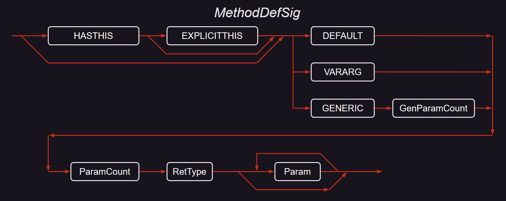

此图使用以下缩写：

 * *`HASTHIS`* = 0x20，用于在调用约定中编码关键字 **instance** [[↗]](#calling-convention)。
 * *`EXPLICITTHIS`* = 0x40，用于在调用约定中编码关键字 **explicit** [[↗]](#calling-convention)。
 * *`DEFAULT`* = 0x0，用于在调用约定中编码关键字 **default** [[↗]](#calling-convention)。
 * *`VARARG`* = 0x5，用于在调用约定中编码关键字 **vararg** [[↗]](#calling-convention)。
 * *`GENERIC`* = 0x10，用于表示方法有一个或多个泛型参数。

签名的第一个字节包含 *`HASTHIS`*，*`EXPLICITTHIS`* 和调用约定 (*`DEFAULT`*，*`VARARG`* 或 *`GENERIC`*) 的位。这些位一起进行 *OR* 运算。

_GenParamCount_ 是方法的泛型参数的数量。这是一个压缩的无符号整数。

对于泛型方法，**`MethodDef`** 和 **`MemberRef`** 都应包含 *`GENERIC`* 调用约定，以及 _GenParamCount_；这些对于绑定很重要 —— 它们使 CLI 能够根据泛型方法包含的泛型参数的数量进行重载。

_ParamCount_ 是一个无符号整数，它保存参数的数量 (0 个或更多)。它可以是 0 到 0x1FFFFFFF 之间的任何数字。编译器也会压缩它  —— 在存储到 '*blob*' 之前 (*ParamCount* 只计算方法参数 —— 它不包括方法的返回类型)

_RetType_ 项描述方法的返回值的类型 [[↗]](#RetType-image)。

*Param* 项描述每个方法参数的类型。应该有 _ParamCount_ 个 *Param* 项的实例 [[↗]](#Param-image)。

#### 21.2.2. MethodRefSig
<a id="MethodRefSig"></a>

_MethodRefSig_ 是由 **`MemberRef`**.***`Signature`*** 列索引的。这提供了方法的 *call site* 签名。通常，这个调用点签名应该与目标方法定义中指定的签名完全匹配。例如，如果定义了一个方法 `Foo`，它接受两个 `unsigned int32` 并返回 `void`；那么任何调用点都应该索引一个签名，该签名接受恰好两个 `unsigned int32` 并返回 `void`。在这种情况下，_MethodRefSig_ 的语法图与 _MethodDefSig_ 的语法图相同。

只有对于具有 *`VARARG`* 调用约定的方法，调用点的签名才会与其定义处的签名不同。在这种情况下，调用点签名被扩展以包含关于额外 *`VARARG`* 参数的信息 (例如，对应于 C 语法中的 "`...`")。这种情况的语法图如下：

 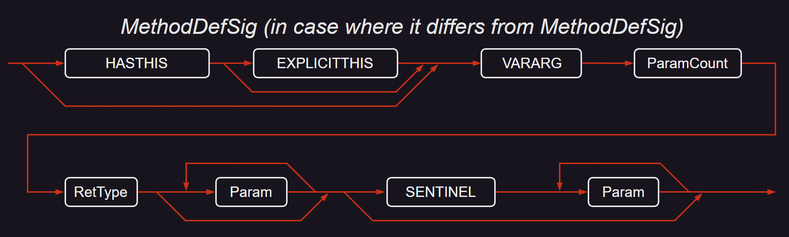

此图使用以下缩写：
 * *`HASTHIS`* = 0x20，用于在调用约定中编码关键字 **instance** [[↗]](#calling-convention)。
 * *`EXPLICITTHIS`* = 0x40，用于在调用约定中编码关键字 **explicit** [[↗]](#calling-convention)。
 * *`VARARG`* = 0x5，用于在调用约定中编码关键字 **vararg** [[↗]](#calling-convention)。
 * *`SENTINEL`* = 0x41 [[↗]](#ELEMENT_TYPE)，用于在参数列表中编码 "`...`"。

签名的第一个字节保存了 *`HASTHIS`*，*`EXPLICITTHIS`* 和调用约定 *`VARARG`* 的位。这些位一起进行 *OR* 运算。

_ParamCount_ 是一个无符号整数，保存了参数的数量 (0 或更多)。它可以是 0 到 0x1FFFFFFF 之间的任何数字。在存储到 '*blob*' 中之前，编译器会压缩它。_ParamCount_ 只计算方法参数的数量，它不包括方法的返回类型。

*Param* 项Description了每个方法参数的类型。应该有 _ParamCount_ 个 *Param* 项的实例。

*Param* 项描述了每个方法参数的类型。应该有 _ParamCount_ 个 *Param* 项的实例。这开始就像一个 *`VARARG`* 方法的 _MethodDefSig_。但随后附加了一个 *`SENTINEL`*  _token_ ，后跟额外的 *Param* 项来描述额外的 *`VARARG`* 参数。注意，_ParamCount_ 项应该指示签名中 *Param* 项的总数 — 在 *`SENTINEL`* 字节 (0x41) 之前和之后。

在罕见的情况下，如果调用点没有提供额外的参数，签名不应包含 *`SENTINEL`* (这是由下箭头显示的路径，它绕过 *`SENTINEL`* 并到达 _MethodRefSig_ 定义的末尾)。


#### 21.2.3. StandAloneMethodSig
<a id ="StandAloneMethodSig"></a>

_StandAloneMethodSig_ 由 **`StandAloneSig`**.***`Signature`*** 列索引。它通常在执行 `calli` 指令之前创建。它类似于 _MethodRefSig_，因为它表示一个调用点签名，但是它的调用约定可以指定一个非托管目标 (`calli` 指令调用托管代码或非托管代码)。它的语法图如下：

 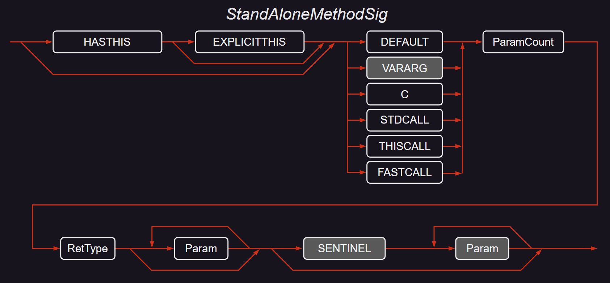

此图使用以下缩写 [[↗]](#calling-convention)：

 * *`HASTHIS`* 对应 0x20
 * *`EXPLICITTHIS`* 对应 0x40
 * *`DEFAULT`* 对应 0x0
 * *`VARARG`* 对应 0x5
 * *`C`* 对应 0x1
 * *`STDCALL`* 对应 0x2
 * *`THISCALL`* 对应 0x3
 * *`FASTCALL`* 对应 0x4
 * *`SENTINEL`* 对应 0x41 [[↗]](#ELEMENT_TYPE)。

签名的第一个字节包含 *`HASTHIS`*，*`EXPLICITTHIS`* 和调用约定的位 - *`DEFAULT`*，*`VARARG`*，*`C`*，*`STDCALL`*，*`THISCALL`* 或 *`FASTCALL`*。这些位一起进行 *OR* 运算。

_ParamCount_ 是一个无符号整数，它包含了非可变参数和可变参数的数量，并合并在一起。它可以是 0 到 0x1FFFFFFF 之间的任何数字。编译器在存储到 *blob* 之前会压缩它 (_ParamCount_ 只计算方法参数，它不包括方法的返回类型)。

第一个 *Param* 项描述了每个方法的非可变参数的类型。第二个 (可选的) *Param* 项描述了每个方法的可变参数的类型。应该有 _ParamCount_ 个 *Param* 实例 [[↗]](#Param-image)。

这是各种方法签名中最复杂的一个。在这个图中，两个单独的图被合并成一个，使用灰色颜色标记来区分它们。因此，对于以下的调用约定：*`DEFAULT`* (托管)，*`STDCALL`*，*`THISCALL`* 和 *`FASTCALL`* (非托管)，签名在 *`SENTINEL`* 项之前就结束了 (这些都是非可变参数签名)。然而，对于托管和非托管的可变参数调用约定：

*`VARARG`* (托管) 和 *`C`* (非托管)，签名可以包含 *`SENTINEL`* 和最后的 *Param* 项 (然而，它们并不是必需的)。这些选项由语法图中的框的阴影表示。

在罕见的情况下，如果调用点没有提供额外的参数，签名不应该包含 *`SENTINEL`* (这是由下箭头显示的路径，它绕过 *`SENTINEL`* 并到达 _StandAloneMethodSig_ 定义的结束)。

#### 21.2.4. FieldSig
<a id="FieldSig"></a>

_FieldSig_ 由 **`Field`**.***`Signature`*** 列索引，或由 **`MemberRef`**.***`Signature`*** 列索引 (当然，这是在它指定对字段的引用，而不是方法的情况下)。签名捕获了字段的定义。字段可以是类中的静态或实例字段，也可以是全局变量。_FieldSig_ 的语法图如下：

 

此图使用以下缩写：

 * *`FIELD`* 代表 0x6

_CustomMod_ 在 §[_CustomMod_](#CustomMod) 中定义。*Type* 在 §[_Type_](#Type-image) 中定义。

#### 21.2.5. PropertySig
<a id="PropertySig"></a>

_PropertySig_ 是由 **`Property`**.***`Type`*** 列索引的。它捕获了属性的类型信息 — 本质上，它是其 _getter_ 方法的签名：

 * 提供给其 *getter* 方法的参数数量
 * 属性的基类型 (_getter_ 方法返回的类型)
 * *getter* 方法中每个参数的类型信息 (即，索引参数)

注意，getter 和 setter 的签名之间的关系如下：
 * *getter* 的 _ParamCount_ 参数的类型与 *setter* 的前 _ParamCount_ 参数的类型完全相同
 * *getter* 的返回类型与提供给 *setter* 的最后一个参数的类型完全相同

_PropertySig_ 的语法图如下：

 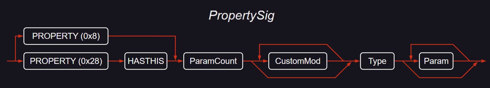

签名的第一个字节保存了 *`HASTHIS`* 和 *`PROPERTY`* 的位。这些位一起进行 *OR* 运算。

*Type* 指定了此属性的 *getter* 方法返回的类型。*Type* 在 §[*Type*](#Type-image) 中定义。

*Param* 在 §[*Param*](#Param-image) 中定义。

_ParamCount_ 是一个压缩的无符号整数，保存了 *getter* 方法中的索引参数数量 (0 或更多)。_ParamCount_ 只计算方法参数的数量，它不包括方法的属性的基类型。

#### 21.2.6. LocalVarSig
<a id="LocalVarSig"></a>

_LocalVarSig_ 由 **`StandAloneSig`**.***`Signature`*** 列索引。它捕获了方法中所有局部变量的类型。它的语法图如下：

 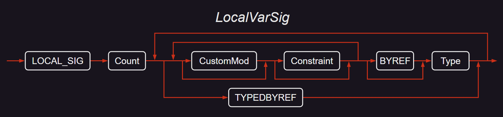

此图使用以下缩写：
 * *`LOCAL_SIG`* 代表 0x7，用于 **.locals** 指令 [[↗]](#locals)。
 * *`BYREF`* 代表 *`ELEMENT_TYPE_BYREF`* [[↗]](#ELEMENT_TYPE)。

*Constraint* 在 §[*Constraint*](#Constraint) 中定义。

*Type* 在 §[*Type*](#Type-image) 中定义。

_Count_ 是一个压缩的无符号整数，它保存了局部变量的数量。它可以是 1 到 0xFFFE 之间的任何数字。

_LocalVarSig_ 中应该有 _Count_ 个 *Type* 的实例。

#### 21.2.7. CustomMod
<a id="CustomMod"></a>

_Signatures_ 中的 _CustomMod_ (自定义修饰符) 项的语法图如下：

 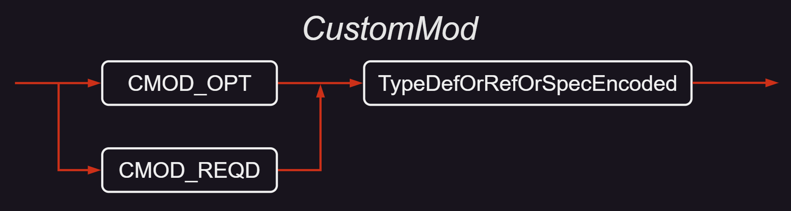

此图使用以下缩写：
 * *`CMOD_OPT`* 代表 *`ELEMENT_TYPE_CMOD_OPT`*。 
 * *`CMOD_REQD`* 代表 *`ELEMENT_TYPE_CMOD_REQD`*。

*`CMOD_OPT`* 或 *`CMOD_REQD`* 的值是压缩的。*`CMOD_OPT`* 或 *`CMOD_REQD`* 后面跟着一个元数据 _token_ ，该 _token_ 索引 **`TypeDef`** 表或 **`TypeRef`** 表中的一行。然而，这些 _token_ 是编码和压缩的 — 参见 §[*TypeDefOrRefOrSpecEncoded*](#TypeDefOrRefOrSpecEncoded)

如果 CustomModifier 标记为 *`CMOD_OPT`*，那么任何导入编译器都可以完全忽略它。相反，如果 CustomModifier 标记为 *`CMOD_REQD`*，任何导入编译器都应该 “识别” 此 CustomModifier 所暗示的语义，以便引用周围的 *Signature*。

#### 21.2.8. TypeDefOrRefOrSpecEncoded
<a id="TypeDefOrRefOrSpecEncoded"></a>

这些项是在签名中存储 _TypeDef_，_TypeRef_ 或 *TypeSpec*  _token_ 的紧凑方式 [[↗]](#Type-image)。考虑一个常规的 _TypeRef_  _token_ ，例如 0x01000012。最高字节 0x01 表示这是一个 _TypeRef_  _token_ 中支持的元数据 _token_ 类型列表。较低的 3 字节 (0x000012) 索引 **`TypeRef`** 表中的行号 0x12。

这个 _TypeRef_  _token_ 的编码版本如下构造：

 1. 将此 _token_ 索引的表编码为最低有效的 2 位。要使用的位 Value 是 0，1 和 2，分别指定目标表是 **`TypeDef`**，**`TypeRef`** 或 **`TypeSpec`** 表。
 2. 将 3 字节行索引 (在此示例中为 0x000012) 左移 2 位，并将其与步骤 1 中的 2 位编码进行 OR 操作。
 3. 压缩结果 Value。

此示例产生以下编码 Value：

 ```
 a)  编码 = TypeRef 表的 Value = 0x01 (来自上述 1.)
 b)  编码 = ( 0x000012 << 2 ) |  0x01
             = 0x48 | 0x01
             = 0x49
 c)  编码 = Compress (0x49)
             = 0x49
 ```

所以，与原始的常规 _TypeRef_ _token_ 值 0x01000012 不同，需要在签名 '*blob*' 中占用 4 字节的空间，这个 _TypeRef_ _token_ 被编码为一个单字节。

#### 21.2.9. Constraint
<a id="Constraint"></a>

在签名中，*Constraint* 项目前只有一个可能的 Value，即 *`ELEMENT_TYPE_PINNED`*，它指定目标类型在运行时堆中被固定，不会被垃圾收集的操作移动。

*Constraint* 只能在 _LocalVarSig_ 中应用 (不能在 _FieldSig_ 中应用)。局部变量的类型要么是引用类型 (换句话说，它指向实际的变量 — 例如，一个对象或一个字符串) ；要么包含 *`BYREF`* 项。原因是局部变量分配在运行时栈上 — 它们从不从运行时堆中分配；所以除非局部变量指向在 GC 堆中分配的对象，否则固定没有意义。

#### 21.2.10. Param
<a id="Param-image"></a>

签名中的 *Param*  (参数) 项有以下语法图：

 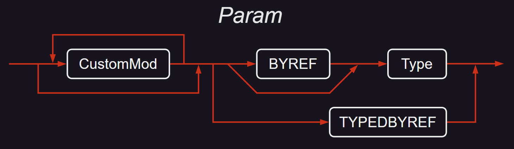

此图使用以下缩写：
 * *`BYREF`* 代表 0x10 [[↗]](#ELEMENT_TYPE)
 * *`TYPEDBYREF`* 代表 0x16 [[↗]](#ELEMENT_TYPE)

_CustomMod_ 在 §[*CustomMod*](#CustomMod) 中定义

*Type* 在 §[*Type*](#Type-image) 中定义。

#### 21.2.11. RetType
<a id="RetType-image"></a>

_RetType_ (返回类型) 项在签名中的语法图如下：

 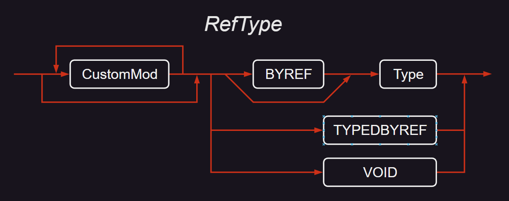

_RetType_ 与 *Param* 相同，除了它可以包含类型 *`VOID`* 的额外可能性。

此图使用以下缩写：

 * *`BYREF`* 对应 *`ELEMENT_TYPE_BYREF`*
 * *`TYPEDBYREF`* 对应 *`ELEMENT_TYPE_TYPEDBYREF`* 
 * *`VOID`* 对应 *`ELEMENT_TYPE_VOID`* 

#### 21.2.12. Type
<a id="Type-image"></a>

*Type* 在签名中的编码如下 (*`I1`* 是 *`ELEMENT_TYPE_I1`* 的缩写，*`U1`* 是 *`ELEMENT_TYPE_U1`* 的缩写，依此类推)：

 | *Type* ::= | 
 | :----
 | *`BOOLEAN`* \| *`CHAR`* \| *`I1`* \| *`U1`* \| *`I2`* \| *`U2`* \| *`I4`* \| *`U4`* \| *`I8`* \| *`U8`* \| *`R4`* \| *`R8`* \| *`I`* \| *`U`*
 | \| *`ARRAY`* *Type* _ArrayShape_ (通用数组，参见 §[*ArrayShape*](#ArrayShape))
 | \| *`CLASS`* _TypeDefOrRefOrSpecEncoded_
 | \| *`FNPTR`* _MethodDefSig_
 | \| *`FNPTR`* _MethodRefSig_
 | \| *`GENERICINST`* (*`CLASS`* \| *`VALUETYPE`*) _TypeDefOrRefOrSpecEncoded_ _GenArgCount_ *Type* *
 | \| *`MVAR`* _number_
 | \| *`OBJECT`*
 | \| *`PTR`* _CustomMod_* *Type*
 | \| *`PTR`* _CustomMod_* *`VOID`*
 | \| *`STRING`*
 | \| *`SZARRAY`* _CustomMod_* *Type* (单维，零基数组，即向量)
 | \| *`VALUETYPE`* _TypeDefOrRefOrSpecEncoded_
 | \| *`VAR`* _number_

_GenArgCount_ 非终结符是一个无符号整数 Value (压缩)，指定此签名中的泛型参数的数量。在 *`MVAR`* 或 *`VAR`* 后面的 number 非终结符是一个无符号整数 Value (压缩)。

#### 21.2.13. ArrayShape
<a id="ArrayShape"></a>

_ArrayShape_ 的语法图如下：

 

_Rank_ 是一个无符号整数 (以压缩形式存储)，它指定数组的维数 (应为 1 个或更多)。

_NumSizes_ 是一个压缩的无符号整数，表示有多少维度有指定的大小 (应为 0 个或更多)。

_Size_ 是一个压缩的无符号整数，指定该维度的大小 — 序列从第一维开始，总共有 _NumSizes_ 个项目。

类似地，_NumLoBounds_ 是一个压缩的无符号整数，表示有多少维度有指定的下界 (应为 0 个或更多)。

_LoBound_ 是一个压缩的有符号整数，指定该维度的下界 — 序列从第一维开始，总共有 _NumLoBounds_ 个项目。

这两个序列中的任何维度都不能被跳过，但指定的维度数量可以小于 _Rank_。

以下是一些示例，所有示例的元素类型都是 `int32`：

 | &nbsp;               | Type  | Rank  | NumSizes |  Size  | NumLoBounds | LoBound |
 | -------------------- | :---: | :---: | :------: | :----: | :---------: | :-----: |
 | `[0...2]`            | `I4`  |  `1`  |   `1`    |  `3`   |     `0`     | &nbsp;  |
 | [,,,,,,]             | `I4`  |  `7`  |   `0`    | &nbsp; |     `0`     | &nbsp;  |
 | `[0...3, 0...2,,,,]` | `I4`  |  `6`  |   `2`    | `4 3`  |     `2`     |  `0 0`  |
 | `[1...2, 6...8]`     | `I4`  |  `2`  |   `2`    | `2 3`  |     `2`     |  `1 6`  |
 | `[5, 3...5, , ]`     | `I4`  |  `4`  |   `2`    | `5 3`  |     `2`     |  `0 3`  |

数组定义可以嵌套，因为类型本身可以是数组。

#### 21.2.14. TypeSpec
<a id="type-spec-blob"></a>

在 ***Blob Heap*** 中，由 *TypeSpec* _token_ 索引的签名具有以下格式：

 | _TypeSpecBlob_ ::=
 | :----
 | *`PTR`* _CustomMod_* *`VOID`*
 |  \| *`PTR`* _CustomMod_* *Type*
 | \| *`FNPTR`* _MethodDefSig_
 | \| *`FNPTR`* _MethodRefSig_
 | \| *`ARRAY`* *Type* _ArrayShape_
 | \| *`SZARRAY`* _CustomMod_* *Type*
 | \| *`GENERICINST`* ( *`CLASS`* \| *`VALUETYPE`* ) _TypeDefOrRefOrSpecEncoded_ _GenArgCount_ *Type* *Type* *

为了紧凑，此列表省略了 *`ELEMENT_TYPE_`* 前缀。所以，例如，*`PTR`* 是 *`ELEMENT_TYPE_PTR`* 的简写。请注意，*TypeSpecBlob* 不以调用约定字节开始，因此它与存储到元数据中的各种其他签名不同。

#### 21.2.15. MethodSpec
<a id="MethodSpec-blob"></a>

由 *MethodSpec* _token_ 索引的 ***Blob Heap*** 中的签名具有以下格式

 | _MethodSpecBlob_ ::=
 | :----
 | *`GENERICINST`* _GenArgCount_ *Type* *Type* *

*`GENERICINST`* 的 Value 为 0x0A。在 Microsoft CLR 实现中，这个 Value 被称为 *`IMAGE_CEE_CS_CALLCONV_GENERICINST`*。 

_GenArgCount_ 是一个压缩的无符号整数，表示方法中的泛型参数的数量。然后，*blob* 指定了实例化的类型，重复 _GenArgCount_ 次。

#### 21.2.16. Short form signatures

签名的一般规范在如何编码某些项上留有一些余地。例如，将 String 编码为以下两种形式之一似乎是有效的：

 * 长格式：(*`ELEMENT_TYPE_CLASS`*, **TypeRef-to-**`System.String`)
 * 短格式：*`ELEMENT_TYPE_STRING`*

只有短格式是有效的。下表显示了应该使用哪些短格式来代替每个长格式项。通常，为了紧凑，这里省略了 *`ELEMENT_TYPE_`* 前缀 — 所以 *`VALUETYPE`* 是 *`ELEMENT_TYPE_VALUETYPE`* 的简写)

 | 长格式        | &nbsp;                  | 短格式         |
 | :------------ | :---------------------- | :------------- |
 | **Prefix**    | **TypeRef-to-**         |
 | *`CLASS`*     | `System.String`         | *`STRING`*     |
 | *`CLASS`*     | `System.Object`         | *`OBJECT`*     |
 | *`VALUETYPE`* | `System.Void`           | *`VOID`*       |
 | *`VALUETYPE`* | `System.Boolean`        | *`BOOLEAN`*    |
 | *`VALUETYPE`* | `System.Char`           | *`CHAR`*       |
 | *`VALUETYPE`* | `System.Byte`           | *`U1`*         |
 | *`VALUETYPE`* | `System.Sbyte`          | *`I1`*         |
 | *`VALUETYPE`* | `System.Int16`          | *`I2`*         |
 | *`VALUETYPE`* | `System.UInt16`         | *`U2`*         |
 | *`VALUETYPE`* | `System.Int32`          | *`I4`*         |
 | *`VALUETYPE`* | `System.UInt32`         | *`U4`*         |
 | *`VALUETYPE`* | `System.Int64`          | *`I8`*         |
 | *`VALUETYPE`* | `System.UInt64`         | *`U8`*         |
 | *`VALUETYPE`* | `System.IntPtr`         | *`I`*          |
 | *`VALUETYPE`* | `System.UIntPtr`        | *`U`*          |
 | *`VALUETYPE`* | `System.TypedReference` | *`TYPEDBYREF`* |

### 21.3. Custom attributes
<a id="custom-attr-value"></a>

自定义特性具有以下语法图：

 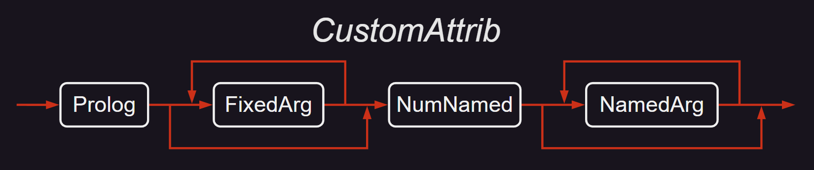

所有二进制 Value 都以小端格式存储 (除了 _PackedLen_ 项目，它们仅用作后续 UTF8 字符串中字节数的计数)。如果没有指定字段、参数或属性，则整个特性表示为空 *blob*。

_CustomAttrib_ 以 *Prolog* 开始 - 一个无符号的 *int16*，Value 为 0x0001。

接下来是构造方法的固定参数的描述。通过检查 **`MethodDef`** 表中该构造函数的行，可以找到它们的数量和类型；这些信息在 _CustomAttrib_ 本身中并未重复。如语法图所示，可以有零个或多个 _FixedArgs_。 (注意，*`VARARG`* 构造方法在自定义特性的定义中是不允许的。)

接下来是可选的 "命名" 字段和属性的描述。这开始于 _NumNamed_ — 一个无符号的 *int16*，给出后面跟随的 "命名" 属性或字段的数量。注意，_NumNamed_ 总是存在的。Value 为零表示没有要跟随的 "命名" 属性或字段 (当然，在这种情况下，_CustomAttrib_ 将在 _NumNamed_ 之后立即结束)。在 _NumNamed_ 为非零的情况下，它后面跟随 _NumNamed_ 重复的 _NamedArgs_。

 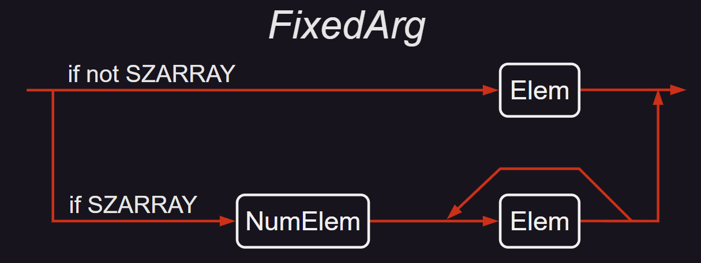

每个 _FixedArg_ 的格式取决于该参数是否为 *`SZARRAY`* — 这在语法图的下方和上方路径中分别显示。因此，每个 _FixedArg_ 要么是单个 _Elem_，要么是 _NumElem_ 重复的 _Elem_。

(*`SZARRAY`* 是单字节 0x1D，表示向量 - 即下界为零的单维数组。)

_NumElem_ 是一个无符号的 _int32_，指定 *`SZARRAY`* 中的元素数量，或者 0xFFFFFFFF 表示该 Value 为 null。

 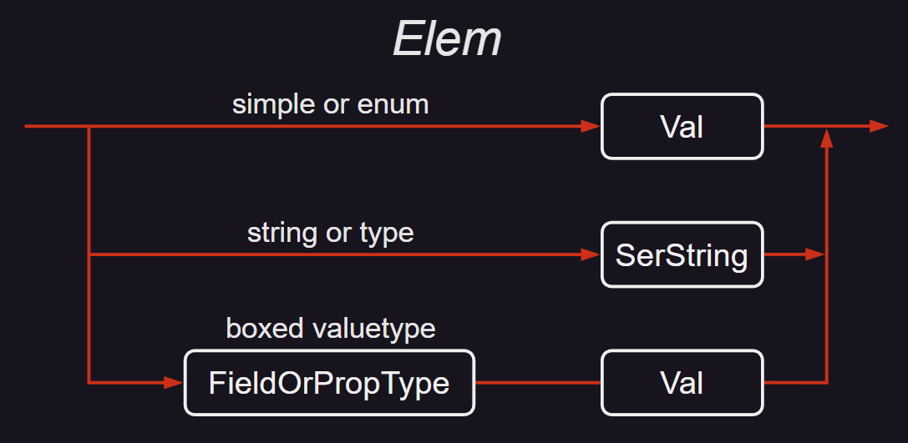

_Elem_ 采用此图中的一种形式，如下所示：

 * 如果参数种类是简单的 (上述图表的第一行)  (**bool**，**char**，**float32**，**float64**，**int8**，**int16**，**int32**，**int64**，**unsigned int8**，**unsigned int16**，**unsigned int32** 或 **unsigned int64**)，那么 '*blob*' 包含其二进制 Value (_Val_)。**bool** 是一个字节，Value 为 0 (假) 或 1 (真) ；**char** 是一个两字节的 Unicode 字符；其他的含义很明显。如果参数种类是 **enum**，也使用这种模式 - 只需存储枚举的底层整数类型的 Value。

 * 如果参数种类是 _string_， (上述图表的中间行) 那么 *blob* 包含一个 _SerString_ — 一个 _PackedLen_ 字节计数，后面跟着 UTF8 字符。如果字符串为 null，其 _PackedLen_ 的 Value 为 0xFF (没有后续字符)。如果字符串为空 ("")，那么 _PackedLen_ 的 Value 为 0x00 (没有后续字符)。

 * 如果参数种类是 `System.Type`， (同样，上述图表的中间行) 其 Value 以 _SerString_ 的形式存储 (如上一段所定义)，表示其规范名称。规范名称是其完整类型名称，后面可选地跟着定义它的程序集，其版本，区域性和公钥 _token_ 。如果省略了程序集名称，CLI 首先在当前程序集中查找，然后在系统库 (`mscorlib`) 中查找；在这两种特殊情况下，允许省略程序集名称，版本，区域性和公钥 _token_ 。

 * 如果参数种类是 `System.Object`，(上述图表的第三行) 存储的 Value 表示该值类型的 "装箱" 实例。在这种情况下，*blob* 包含实际类型的 _FieldOrPropType_ (见下文)，后面跟着参数的未装箱 Value。在这种情况下，不可能传递 nullValue。

* 如果类型是一个装箱的简单值类型 (**bool**，**char**，**float32**，**float64**，**int8**，**int16**，**int32**，**int64**，**unsigned int8**，**unsigned int16**，**unsigned int32** 或 **unsigned int64**)，那么 _FieldOrPropType_ 紧接着是一个字节，该字节包含 Value 0x51。_FieldOrPropType_ 必须恰好是以下之一：*`ELEMENT_TYPE_BOOLEAN`*，*`ELEMENT_TYPE_CHAR`*，*`ELEMENT_TYPE_I1`*，*`ELEMENT_TYPE_U1`*，*`ELEMENT_TYPE_I2`*，*`ELEMENT_TYPE_U2`*，*`ELEMENT_TYPE_I4`*，*`ELEMENT_TYPE_U4`*，*`ELEMENT_TYPE_I8`*，*`ELEMENT_TYPE_U8`*，*`ELEMENT_TYPE_R4`*，*`ELEMENT_TYPE_R8`*，*`ELEMENT_TYPE_STRING`*。单维零基数组被指定为一个字节 0x1D，后面跟着元素类型的 _FieldOrPropTypeof_。枚举被指定为一个字节 0x55，后面跟着一个 _SerString_。参见 [*ELEMENT_TYPE*](#ELEMENT_TYPE)。

 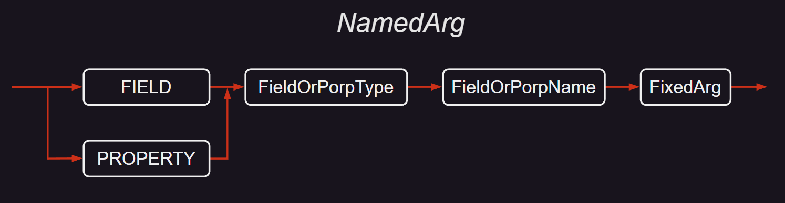

_NamedArg_ 只是一个 _FixedArg_ (上面讨论过)，前面有信息来标识它代表哪个字段或属性。记住，CLI 允许字段和属性具有相同的名称；所以我们需要一种方法来消除这种情况的歧义。

 * *`FIELD`* 是单字节 0x53。
 * *`PROPERTY`* 是单字节 0x54。

_FieldOrPropName_ 是字段或属性的名称，存储为 _SerString_ (上面定义)。

### 21.4. Marshalling descriptors
<a id="blob-description"></a>

***Marshalling*** 描述符类似于签名 — 它是二进制数据的 '*blob*'。它描述了当通过 PInvoke 调度调用到或从非托管代码时，应如何封送字段或参数 (通常情况下，作为参数编号 0 的方法返回也包括在内)。ILAsm 语法 **marshal** 可以用来创建 ***Marshalling*** 描述符，伪自定义特性 `MarshalAsAttribute` 也可以用来创建 ***Marshalling*** 描述符 [[↗]](#pseudo-custom-attr)。

注意，符合 CLI 规范的实现只需要支持封送前面指定的类型 [[↗]](#data-type-marshaling)。

***Marshalling*** 描述符使用名为 *`NATIVE_TYPE_xxx`* 的常量。它们的名称和值列在下表中：

 | Name                    | Value |
 | :---------------------- | :---: |
 | *`NATIVE_TYPE_BOOLEAN`* | 0x02  |
 | *`NATIVE_TYPE_I1`*      | 0x03  |
 | *`NATIVE_TYPE_U1`*      | 0x04  |
 | *`NATIVE_TYPE_I2`*      | 0x05  |
 | *`NATIVE_TYPE_U2`*      | 0x06  |
 | *`NATIVE_TYPE_I4`*      | 0x07  |
 | *`NATIVE_TYPE_U4`*      | 0x08  |
 | *`NATIVE_TYPE_I8`*      | 0x09  |
 | *`NATIVE_TYPE_U8`*      | 0x0a  |
 | *`NATIVE_TYPE_R4`*      | 0x0b  |
 | *`NATIVE_TYPE_R8`*      | 0x0c  |
 | *`NATIVE_TYPE_LPSTR`*   | 0x14  |
 | *`NATIVE_TYPE_LPWSTR`*  | 0x15  |
 | *`NATIVE_TYPE_INT`*     | 0x1f  |
 | *`NATIVE_TYPE_UINT`*    | 0x20  |
 | *`NATIVE_TYPE_FUNC`*    | 0x26  |
 | *`NATIVE_TYPE_ARRAY`*   | 0x2a  |

'*blob*' 的格式如下

 | _MarshalSpec_ ::=
 | :----
 | _NativeIntrinsic_
 | \| *`ARRAY`* _ArrayElemType_
 | \| *`ARRAY`* _ArrayElemType_ _ParamNum_
 | \| *`ARRAY`* _ArrayElemType_ _ParamNum_ _NumElem_

 | _NativeIntrinsic_ ::=
 | :----
 | *`BOOLEAN`* \| *`I1`* \| *`U1`* \| *`I2`* \| *`U2`* \| *`I4`* \| *`U4`* \| *`I8`* \| *`U8`* \| *`R4`* \| *`R8`* \| *`LPSTR`* \| *`LPSTR`* \| *`INT`* \| *`UINT`* \| *`FUNC`*

为了紧凑，上述列表中省略了 *`NATIVE_TYPE_`* 前缀；例如，*`ARRAY`* 是 *`NATIVE_TYPE_ARRAY`* 的简写。

 | _ArrayElemType_ ::=
 | :----
 | _NativeIntrinsic_

_ParamNum_ 是一个无符号整数 (以 §[*Blobs*](#blob-reduce) 描述的方式压缩)，指定在方法调用中提供数组中元素数量的参数 — 参见下文。

_NumElem_ 是一个无符号整数 (以 §[*Blobs*](#blob-reduce) 描述的方式压缩)，指定元素或附加元素的数量 — 参见下文。

例如，在方法声明中：

 ```cil
 .method void M(int32[] ar1, int32 size1, unsigned int8[] ar2, int32 size2) { … }
 ```

`ar1` 参数可能拥有 **`FieldMarshal`** 表中的一行，该行索引 ***Blob Heap*** 中的 _MarshalSpec_，格式为：

 ```
 ARRAY  MAX  2  1
 ```

这表示参数被编组为 *`NATIVE_TYPE_ARRAY`*。关于每个元素的类型没有额外的信息 (由 *`NATIVE_TYPE_MAX`* 表示)。_ParamNum_ 的 Value 为 2，这表示方法中的参数编号 2 (名为 `size1` 的参数) 将指定实际数组中的元素数量 — 假设在特定调用中其 Value 为 42。_NumElem_ 的 Value 为 0。数组的总大小 (以字节为单位) 由以下公式给出：

 ```csharp
 if ParamNum = 0
    SizeInBytes = NumElem * sizeof (elem)
 else
    SizeInBytes = ( @ParamNum +  NumElem ) * sizeof (elem)
 endif
 ```

这里使用 `@ParamNum` 语法表示传入参数编号 _ParamNum_ 的 Value — 在这个例子中，它将是 42。每个元素的大小是从 `Foo` 的签名中的 `ar1` 参数的元数据计算出来的 — 是大小为 4 字节的 *`ELEMENT_TYPE_I4`*。

---
## 22. 元数据物理布局
<a id="metadata-physical-layout"></a>

元数据的物理磁盘表示是对逻辑表示的直接反映，逻辑表示在 §[Tables](#MetadataTables) 和 §[Others](#metadata-format-others) 中描述。也就是说，数据存储在表示元数据表和堆的流中。主要的复杂性在于，逻辑表示从索引到表和列所需的字节数中抽象出来，而物理表示必须通过定义如何将逻辑元数据堆和表映射到它们的物理表示来明确处理这个问题。

除非另有说明，所有的二进制值都以小端格式存储。

>---
### 22.1. 固定字段
<a id="Fixed-Field"></a>

完整的 CLI 组件 (元数据和 CIL 指令) 存储在当前可移植可执行 (PE) 文件格式的一个子集中 [[↗]](#pe-extension)。由于这种传递，元数据的物理表示中的一些字段具有固定值。在写入这些字段时，最好将它们设置为指示的值，读取时应忽略它们。

>---
### 22.2. File headers

#### 22.2.1. 元数据根

物理元数据的根开始于一个 ***Magic Signature***，接着是几个字节的 *Version* 和其他杂项信息，然后是一个计数和一个 ***Stream Headers*** 数组，每个流对应一个 ***Header***。实际的编码表和堆存储在流中，这些流紧接着这个 ***Header*** 数组。

 | Offset   | Size    | Field             | Description                                                                                                                                                      |
 | :------- | :------ | :---------------- | :--------------------------------------------------------------------------------------------------------------------------------------------------------------- |
 | 0        | 4       | **Signature**     | 物理元数据的 ***Magic Signature***：0x424A5342。                                                                                                                 |
 | 4        | 2       | **MajorVersion**  | 主版本，1 (读取时忽略)                                                                                                                                           |
 | 6        | 2       | **MinorVersion**  | 次版本，1 (读取时忽略)                                                                                                                                           |
 | 8        | 4       | **Reserved**      | 保留，始终为 0 [[↗]](#Fixed-Field)。                                                                                                                             |
 | 12       | 4       | **Length**        | 分配用来保存版本字符串 (包括空终止符) 的字节数，称之为 *x*。<p>称字符串 (包括终止符) 的长度为 *m* (我们要求 *m* &le; 255) ；长度 *x* 是 *m* 向上舍入到四的倍数。 |
 | 16       | *m*     | **Version**       | 长度为 *m* 的 UTF8 编码的空终止版本字符串 (见上文)                                                                                                               |
 | 16+*m*   | *x*-*m* | &nbsp;            | 填充到下一个4字节边界。                                                                                                                                          |
 | 16+*x*   | 2       | **Flags**         | 保留，始终为 0 [[↗]](#Fixed-Field)。                                                                                                                             |
 | 16+*x*+2 | 2       | **Streams**       | 流的数量，比如说 *n*。                                                                                                                                           |
 | 16+*x*+4 | &nbsp;  | **StreamHeaders** | *n* 个 `StreamHdr` 结构的数组。                                                                                                                                  |

对于任何打算在任何符合规范的 CLI 实现上执行的文件，版本字符串应为 "`Standard CLI 2005`"，所有符合规范的 CLI 实现都应接受使用此版本字符串的文件。当文件受限于特定于供应商的 CLI 实现时，应使用其他字符串。此标准的未来版本将指定不同的字符串，但它们应以 "`Standard CLI`" 开始。指定附加功能的其他标准应指定以 "`Standard□`" 开始的特定版本字符串，其中 "`□`" 表示一个空格。提供实现特定扩展的供应商应提供一个不以 "`Standard□`" 开始的版本字符串。对于此标准的第一个版本，版本字符串是 "`Standard CLI 2002`"。

#### 22.2.2. Stream Header

流头提供了表或堆的名称，位置和长度。请注意，流头结构的长度不是固定的，而取决于其名称字段的长度 (一个可变长度的空终止字符串)。

 | Offset | Size   | Field      | Description                                                                                              |
 | :----- | :----- | :--------- | :------------------------------------------------------------------------------------------------------- |
 | 0      | 4      | **Offset** | 从元数据根的开始到此流的开始的内存偏移。                                                                 |
 | 4      | 4      | **Size**   | 此流的字节大小，应为 4 的倍数。                                                                          |
 | 8      | &nbsp; | **Name**   | 流的名称，为 ASCII 字符的空终止可变长度数组，用 `\0` 字符填充到下一个 4 字节边界。名称限制为 32 个字符。 |

逻辑表和堆都存储在流中。有五种可能的流。一个名为 "`#Strings`" 的流头，指向存储标识符字符串的 ***String Heap*** 的物理表示；一个名为 "`#US`" 的流头，指向 ***UserString Heap*** 的物理表示；一个名为 "`#Blob`" 的流头，指向 ***Blob Heap*** 的物理表示，一个名为 "`#GUID`" 的流头，指向 ***GUID Heap*** 的物理表示；以及一个名为"`#~`"的流头，指向一组表的物理表示。

每种类型的流最多只能出现一次，也就是说，元数据文件不应包含两个 "`#US`" 流，或五个 "`#Blob`" 流。如果流是空的，则不需要存在。

#### 22.2.3. #Strings Heap

由 "`#Strings`" 标头指向的字节流是逻辑 ***String Heap*** 的物理表示。物理堆可以包含垃圾，也就是说，它可以包含从任何表都无法访问的部分，但是从表可以访问的部分应该包含一个有效的空终止 UTF8 字符串。当 `#Strings` 堆存在时，第一个条目总是空字符串 (即，`\0`)。

#### 22.2.4. #US Heap 和 #Blob Heap

由 "`#US`" 或 "`#Blob`" 头指向的字节流分别是逻辑 ***UserString Heap*** 和 ***Blob Heap*** 的物理表示。只要从任何表中可达的任何部分包含有效的 '*blob*'，这两个堆都可以包含垃圾。单个 *blob* 的长度在前几个字节中编码：

 * 如果 '*blob*' 的第一个字节是 _0bbbbbbb<sub>2</sub>_，那么 '*blob*' 的其余部分包含 _bbbbbbb<sub>2</sub>_ 字节的实际数据。

 * 如果 '*blob*' 的前两个字节是 _10bbbbbb<sub>2</sub>_ 和 *x*，那么 '*blob*' 的其余部分包含 (_bbbbbb<sub>2</sub>_ << 8 + *x*) 字节的实际数据。

 * 如果 '*blob*' 的前四个字节是 _110bbbbb<sub>2</sub>_, *x*, *y*, 和 *z*，那么 '*blob*' 的其余部分包含 (_bbbbb<sub>2</sub>_ << 24 + *x* << 16 + *y* << 8 + *z*) 字节的实际数据。

这两个堆中的第一个条目是空的 '*blob*'，由单个字节 0x00 组成。

 `#US` (用户字符串) 堆中的字符串使用 16 位 Unicode 编码。每个字符串的计数是字符串中的字节数 (不是字符)。此外，还有一个额外的终止字节 (因此所有字节计数都是奇数，而不是偶数)。这个最后的字节只有在字符串中的任何 UTF16 字符的顶字节设置了任何位，或者其低字节是以下任何一个：0x01 ~ 0x08, 0x0E ~ 0x1F, 0x27, 0x2D, 0x7F 时，才持有值 1。否则，它持有 0。1 表示需要超出通常为 8 位编码集提供的处理的 Unicode 字符。

#### 22.2.5. #GUID 堆
<a id="guid-heap"></a>

"`#GUID`" 标头指向一系列 128 位的 GUID。在流中可能存储了无法访问的 GUID。

#### 22.2.6. #~ 流
<a id="physicalStream"></a>

"`#~`" 流包含逻辑元数据表的实际物理表示 [[↗]](#MetadataTables)。"`#~`" 流具有以下顶级结构：

 | Offset    | Size   | Field            | Description                                            |
 | :-------- | :----- | :--------------- | :----------------------------------------------------- |
 | 0         | 4      | **Reserved**     | 保留，始终为 0 [[↗]](#Fixed-Field)。                   |
 | 4         | 1      | **MajorVersion** | 表模式的主版本；应为 2 [[↗]](#Fixed-Field)。           |
 | 5         | 1      | **MinorVersion** | 表模式的次版本；应为 0 [[↗]](#Fixed-Field)。           |
 | 6         | 1      | **HeapSizes**    | 堆大小的位向量。                                       |
 | 7         | 1      | **Reserved**     | 保留，始终为 1 [[↗]](#Fixed-Field)。                   |
 | 8         | 8      | **Valid**        | 存在表的位向量，让 *n* 是 1 的位的数量。               |
 | 16        | 8      | **Sorted**       | 已排序表的位向量。                                     |
 | 24        | 4\**n* | **Rows**         | 指示每个存在表的行数的 *n* 个 4 字节无符号整数的数组。 |
 | 24+4\**n* | &nbsp; | **Tables**       | 物理表的序列。                                         |

_HeapSizes_ 字段是一个位向量，它编码了各种堆的索引的宽度。如果位 0 被设置，"`#Strings`" 堆的索引宽度为 4 字节；如果位 1 被设置，"`#GUID`" 堆的索引宽度为 4 字节；如果位 2 被设置，"`#Blob`" 堆的索引宽度为 4 字节。相反，如果未设置特定堆的 _HeapSizes_ 位，那么该堆的索引宽度为 2 字节。

 | Heap size flag | Description                                 |
 | :------------- | :------------------------------------------ |
 | 0x01           | "`#Strings`" 流的大小 &ge; 2<sup>16</sup>。 |
 | 0x02           | "`#GUID`" 流的大小 &ge; 2<sup>16</sup>。    |
 | 0x04           | "`#Blob`" 流的大小 &ge; 2<sup>16</sup>。    |

_Valid_ 字段是一个 64 位的位向量，对于存储在流中的每个表，都有一个特定的位被设置；表到索引的映射在 [_Metadata Tables_](#MetadataTables) 的开始处给出。例如，当 **`DeclSecurity`** 表在逻辑元数据中存在时，应在 *Valid* 向量中设置位 0x0e。在 _Valid_ 中包含不存在的表是无效的，因此所有位于 0x2c 以上的位都应为零。

_Rows_ 数组包含每个存在的表的行数。在将物理元数据解码为逻辑元数据时，_Valid_ 中 1 的数量表示 _Rows_ 数组中的元素数量。

在编码逻辑表的过程中，一个关键的方面是其模式。每个表的模式在 [_Metadata Tables_](#MetadataTables) 中给出。例如，分配索引 0x02 的表是一个 **`TypeDef`** 表，根据其在 [*TypeDef_0x02*](#TypeDef_0x02) 中的规范，它具有以下列：一个 4 字节宽的标志，一个指向 ***String Heap*** 的索引，另一个指向 ***String Heap*** 的索引，一个指向 **`TypeDef`**、**`TypeRef`** 或 **`TypeSpec`** 表的索引，一个指向 **`Field`** 表的索引，以及一个指向 **`MethodDef`** 表的索引。

具有 *n* 列和 *m* 行的表的物理表示，其模式为 (*C*<sub>0</sub>,&hellip;,*C*<sub>*n*-1</sub>)，由每个行的物理表示的连接组成。具有模式 (*C*<sub>0</sub>,&hellip;,*C*<sub>n-1</sub>) 的行的物理表示是每个元素的物理表示的连接。在类型为 *C* 的列中，行单元 *e* 的物理表示定义如下：
 * 如果 *e* 是一个常量，它使用其列类型 *C* 指定的字节数存储 (即，_PropertyAttributes_ 类型的2位掩码)
 * 如果 *e* 是一个指向 ***GUID Heap***、***Blob Heap*** 或 ***String Heap*** 的索引，它使用 _HeapSizes_ 字段定义的字节数存储。
 * 如果 *e* 是一个简单的指向索引为 *i* 的表的索引，如果表 *i* 的行数小于 216，则使用 2 字节存储，否则使用 4 字节存储。
 * 如果 *e* 是一个编码索引，它指向 *n* 个可能的表 *t*<sub>0</sub>,&hellip;*t*<sub>*n*-1</sub> 中的表 *t*<sub>*i*</sub>，那么它被存储为 *e* << (log *n*) | tag{ *t*<sub>0</sub>,&hellip;*t*<sub>*n*-1</sub> } [ *t*<sub>*i*</sub> ]，如果表 *t*<sub>0</sub>,&hellip;*t*<sub>*n*-1</sub> 的最大行数小于 2<sup>(16 – (log *n*))</sup>，则使用 2 字节存储，否则使用 4 字节存储。有限映射族 tag{ *t*<sub>0</sub>,&hellip;*t*<sub>*n*-1</sub> } 在下面定义。注意，解码物理行需要这个映射的逆。(例如，**`Constant`** 表的 ***`Parent`*** 列索引 **`Field`**、**`Param`** 或 **`Property`** 表中的一行。实际的表被编码到数字的低 2 位，使用值：0 => **`Field`**，1 => **`Param`**，2 => **`Property`**。剩余的位保存了被索引的实际行号。例如，值 0x321，索引 **`Param`** 表中的行号 0xC8。)

> *TypeDefOrRef*  <a id="TypeDefOrRef"></a>

 | TypeDefOrRef: 2 bits to encode tag |  Tag  |
 | :--------------------------------- | :---: |
 | **`TypeDef`**                      |   0   |
 | **`TypeRef`**                      |   1   |
 | **`TypeSpec`**                     |   2   |

> *HasConstant* <a id="HasConstant"></a>

 | HasConstant: 2 bits to encode tag |  Tag  |
 | :-------------------------------- | :---: |
 | **`Field`**                       |   0   |
 | **`Param`**                       |   1   |
 | **`Property`**                    |   2   |

> *HasCustomAttribute* <a id="HasCustomAttribute"></a>

| HasCustomAttribute: 5 bits to encode tag |  Tag  |
| :--------------------------------------- | :---: |
| **`MethodDef`**                          |   0   |
| **`Field`**                              |   1   |
| **`TypeRef`**                            |   2   |
| **`TypeDef`**                            |   3   |
| **`Param`**                              |   4   |
| **`InterfaceImpl`**                      |   5   |
| **`MemberRef`**                          |   6   |
| **`Module`**                             |   7   |
| **`Permission`**                         |   8   |
| **`Property`**                           |   9   |
| **`Event`**                              |  10   |
| **`StandAloneSig`**                      |  11   |
| **`ModuleRef`**                          |  12   |
| **`TypeSpec`**                           |  13   |
| **`Assembly`**                           |  14   |
| **`AssemblyRef`**                        |  15   |
| **`File`**                               |  16   |
| **`ExportedType`**                       |  17   |
| **`ManifestResource`**                   |  18   |
| **`GenericParam`**                       |  19   |
| **`GenericParamConstraint`**             |  20   |
| **`MethodSpec`**                         |  21   |

 _HasCustomAttributes_ 只有对应于用户源程序中的项目的表的值；例如，可以将特性附加到 **`TypeDef`** 表和 **`Field`** 表，但不能附加到 **`ClassLayout`** 表。因此，上面的枚举中缺少一些表类型。

> *HasFieldMarshall* <a id="HasFieldMarshall"></a>

 | HasFieldMarshall: 1 bit to encode tag |  Tag  |
 | :------------------------------------ | :---: |
 | **`Field`**                           |   0   |
 | **`Param`**                           |   1   |

> *HasDeclSecurity* <a id="HasDeclSecurity"></a>

 | HasDeclSecurity: 2 bits to encode tag |  Tag  |
 | :------------------------------------ | :---: |
 | **`TypeDef`**                         |   0   |
 | **`MethodDef`**                       |   1   |
 | **`Assembly`**                        |   2   |

> *MemberRefParent* <a id="MemberRefParent"></a>

 | MemberRefParent: 3 bits to encode tag |  Tag  |
 | :------------------------------------ | :---: |
 | **`TypeDef`**                         |   0   |
 | **`TypeRef`**                         |   1   |
 | **`ModuleRef`**                       |   2   |
 | **`MethodDef`**                       |   3   |
 | **`TypeSpec`**                        |   4   |

> *HasSemantics* <a id="HasSemantics"></a>

 | HasSemantics: 1 bit to encode tag |  Tag  |
 | :-------------------------------- | :---: |
 | **`Event`**                       |   0   |
 | **`Property`**                    |   1   |

> *MethodDefOrRef* <a id="MethodDefOrRef"></a>

 | MethodDefOrRef: 1 bit to encode tag |  Tag  |
 | :---------------------------------- | :---: |
 | **`MethodDef`**                     |   0   |
 | **`MemberRef`**                     |   1   |

> *MemberForwarded* <a id="MemberForwarded"></a>

 | MemberForwarded: 1 bit to encode tag |  Tag  |
 | :----------------------------------- | :---: |
 | **`Field`**                          |   0   |
 | **`MethodDef`**                      |   1   |

> *Implementation* <a id="Implementation"></a>

 | Implementation: 2 bits to encode tag |  Tag  |
 | :----------------------------------- | :---: |
 | **`File`**                           |   0   |
 | **`AssemblyRef`**                    |   1   |
 | **`ExportedType`**                   |   2   |

> *CustomAttributeType* <a id="CustomAttributeType"></a>

 | CustomAttributeType: 3 bits to encode tag |  Tag  |
 | :---------------------------------------- | :---: |
 | Not used                                  |   0   |
 | Not used                                  |   1   |
 | **`MethodDef`**                           |   2   |
 | **`MemberRef`**                           |   3   |
 | Not used                                  |   4   |

> *ResolutionScope* <a id="ResolutionScope"></a>

 | ResolutionScope: 2 bits to encode tag |  Tag  |
 | :------------------------------------ | :---: |
 | **`Module`**                          |   0   |
 | **`ModuleRef`**                       |   1   |
 | **`AssemblyRef`**                     |   2   |
 | **`TypeRef`**                         |   3   |

> *TypeOrMethodDef* <a id="TypeOrMethodDef"></a>

 | TypeOrMethodDef: 1 bit to encode tag |  Tag  |
 | :----------------------------------- | :---: |
 | **`TypeDef`**                        |   0   |
 | **`MethodDef`**                      |   1   |

---
## 23. PE 文件格式的扩展
<a id="pe-extension"></a>

CLI 组件的文件格式是当前可移植可执行 (PE) 文件格式的严格扩展。这种扩展的 PE 格式使操作系统能够识别运行时图像，适应以 CIL 或本地代码发出的代码，并将运行时元数据作为发出的代码的组成部分。还有一些关于完整的 Windows PE/COFF 文件格式子集的规范，详细到工具或编译器可以使用这些规范来发出有效的 CLI 图像。

PE 格式经常使用 RVA (相对虚拟地址) 这个术语。RVA 是一个项目 *加载到内存中* 的地址，从中减去了图像文件的基地址 (即，从文件加载的基地址开始的偏移)。一个项目的 RVA 几乎总是与其在磁盘上的文件位置不同。要计算某个具有  RVA *r*  的项的文件位置 *t*，首先搜索 PE 文件中的所有部分，找到 RVA 为 *s*、长度为 *l*、文件位置为 *p* 的 section。若 *s* &le; *r* < *s*+*l*，则该项的文件位置 *t* 为 *p*+(*r*-*s*)。

除非另有说明，否则所有二进制值都以小端格式存储。

>---
### 23.1. 运行时文件格式的结构

下图提供了 CLI 文件格式的高级视图。所有运行时图像都包含以下内容：
 * PE Header，其中包含如何在运行时文件中设置字段值的具体指南。
 * 一个 CLI Header，其中包含所有特定于运行时的数据条目。运行时头是只读的，应放置在任何只读部分中。
 * 包含头描述的实际数据的部分，包括导入 / 导出、数据和代码。

 

使用 PE Header 中的 CLI  Header 目录条目找到 CLI Header [[↗]](#CLIHeader)。CLI Header 反过来包含了图像其余部分的运行时数据的地址和大小 (对于元数据的物理布局，参见 [[↗]](#metadata-physical-layout)；对于 CIL 的物理布局，参见 [[↗]](#CIL-physical-layout))。请注意，基于部分特性 (如只读与执行等)，运行时数据可以与 PE 格式的其他数据合并到 PE 格式的其他区域中。

>---
### 23.2. PE Header

PE 图像以 MS-DOS Header 开始，接着是 PE 签名，然后是 PE file Header，然后是 PE optional Header，最后是 PE section Header。

#### 23.2.1. MS-DOS Header

PE 格式以一个 MS-DOS 存根开始，精确地放置在模块的前面的 128 字节。在 DOS Header 的偏移 0x3c 处是一个 4 字节的无符号整数偏移，_lfanew_，指向 PE 签名 (应为 "`PE\0\0`")，紧接着是 PE file Header。

| &nbsp; | &nbsp; | &nbsp; | &nbsp; | &nbsp;   | &nbsp; | &nbsp; | &nbsp; |
| ------ | ------ | ------ | ------ | -------- | ------ | ------ | ------ |
| 0x4d   | 0x5a   | 0x90   | 0x00   | 0x03     | 0x00   | 0x00   | 0x00   |
| 0x04   | 0x00   | 0x00   | 0x00   | 0xFF     | 0xFF   | 0x00   | 0x00   |
| 0xb8   | 0x00   | 0x00   | 0x00   | 0x00     | 0x00   | 0x00   | 0x00   |
| 0x40   | 0x00   | 0x00   | 0x00   | 0x00     | 0x00   | 0x00   | 0x00   |
| 0x00   | 0x00   | 0x00   | 0x00   | 0x00     | 0x00   | 0x00   | 0x00   |
| 0x00   | 0x00   | 0x00   | 0x00   | 0x00     | 0x00   | 0x00   | 0x00   |
| 0x00   | 0x00   | 0x00   | 0x00   | 0x00     | 0x00   | 0x00   | 0x00   |
| 0x00   | 0x00   | 0x00   | 0x00   | _lfanew_ | &nbsp; | &nbsp; | &nbsp; |
| 0x0e   | 0x1f   | 0xba   | 0x0e   | 0x00     | 0xb4   | 0x09   | 0xcd   |
| 0x21   | 0xb8   | 0x01   | 0x4c   | 0xcd     | 0x21   | 0x54   | 0x68   |
| 0x69   | 0x73   | 0x20   | 0x70   | 0x72     | 0x6f   | 0x67   | 0x72   |
| 0x61   | 0x6d   | 0x20   | 0x63   | 0x61     | 0x6e   | 0x6e   | 0x6f   |
| 0x74   | 0x20   | 0x62   | 0x65   | 0x20     | 0x72   | 0x75   | 0x6e   |
| 0x20   | 0x69   | 0x6e   | 0x20   | 0x44     | 0x4f   | 0x53   | 0x20   |
| 0x6d   | 0x6f   | 0x64   | 0x65   | 0x2e     | 0x0d   | 0x0d   | 0x0a   |
| 0x24   | 0x00   | 0x00   | 0x00   | 0x00     | 0x00   | 0x00   | 0x00   |

#### 23.2.2. PE file Header

在 PE 签名之后紧接着是 PE file Header，包括以下内容：

 | 偏移 | 大小 | 字段                    | 描述                                                                       |
 | ---- | ---- | ----------------------- | -------------------------------------------------------------------------- |
 | 0    | 2    | Machine                 | 总是 0x14C                                                                 |
 | 2    | 2    | Number of Sections      | 节的数量；表示紧接在头部之后的节表的大小                                   |
 | 4    | 4    | Time/Date Stamp         | 文件创建的时间和日期，以 1970 年 1 月 1 日 00:00:00 以来的秒数表示，或为 0 |
 | 8    | 4    | Pointer to Symbol Table | 总是 0                                                                     |
 | 12   | 4    | Number of Symbols       | 总是 0                                                                     |
 | 16   | 2    | Optional Header Size    | optional Header 的大小，格式在下面描述                                     |
 | 18   | 2    | Characteristics         | 标志，表示文件的特性                                                       |

##### 23.2.2.1. 特性

一个仅 CIL 的 DLL 将标志 0x2000 设置为 1，而一个仅 CIL 的 `.exe` 将标志 0x2000 设置为零：

 | 标志                          | 值     | 描述                                                                        |
 | ----------------------------- | ------ | --------------------------------------------------------------------------- |
 | `IMAGE_FILE_RELOCS_STRIPPED`  | 0x0001 | 应为 0                                                                      |
 | `IMAGE_FILE_EXECUTABLE_IMAGE` | 0x0002 | 应为 1                                                                      |
 | `IMAGE_FILE_32BIT_MACHINE`    | 0x0100 | 当且仅当 `COMIMAGE_FLAGS_32BITREQUIRED` 为 1 时，应为 1 [[↗]](#cli-rt-flag) |
 | `IMAGE_FILE_DLL`              | 0x2000 | 图像文件是一个动态链接库 (DLL)                                              |

对于上述未提到的标志，标志 0x0010，0x0020，0x0400 和 0x0800 是实现特定的，所有其他的应该为零。

#### 23.2.3. PE optional Header

紧接着 PE Header 是 PE optional Header。此 Header 包含以下信息：

 | 偏移 | 大小 | 头部分      | 描述                                                                         |
 | ---- | ---- | ----------- | ---------------------------------------------------------------------------- |
 | 0    | 28   | 标准字段    | 这些定义了 PE 文件的一般特性                                                 |
 | 28   | 68   | NT 特定字段 | 这些包括支持 Windows 的特定功能的附加字段                                    |
 | 96   | 128  | 数据目录    | 这些字段是地址 / 大小对，用于在图像文件中找到的特殊表 (例如，导入表和导出表) |

##### 23.2.3.1. PE Header 标准字段

所有 PE 文件都需要这些字段，并包含以下信息：

 | 偏移 | 大小 | 字段                    | 描述                                                                                                |
 | ---- | ---- | ----------------------- | --------------------------------------------------------------------------------------------------- |
 | 0    | 2    | Magic                   | 始终为 0x10B                                                                                        |
 | 2    | 1    | LMajor                  | 始终为 6                                                                                            |
 | 3    | 1    | LMinor                  | 始终为 0                                                                                            |
 | 4    | 4    | Code Size               | 代码 (文本) 部分的大小，或者如果有多个部分，则为所有代码部分的总和                                  |
 | 8    | 4    | Initialized Data Size   | 初始化数据部分的大小，或者如果有多个数据部分，则为所有这些部分的总和                                |
 | 12   | 4    | Uninitialized Data Size | 未初始化数据部分的大小，或者如果有多个未初始化的数据部分，则为所有这些部分的总和                    |
 | 16   | 4    | Entry Point RVA         | 入口点 RVA，需要指向字节 0xFF 0x25，后面跟着在标记为执行 / 读取的部分中的 RVA，对于 EXE 或 DLL 为 0 |
 | 20   | 4    | Base Of Code            | 代码部分的 RVA (这是对加载器的提示)                                                                 |
 | 24   | 4    | Base Of Data            | 数据部分的 RVA (这是对加载器的提示)                                                                 |

入口点 RVA 应始终是 x86 入口点存根或 0。在不支持 CLI 平台上，此存根将调用 `mscoree` 的入口点 API (`_CorExeMain` 或 `_CorDllMain`)。`mscoree` 入口点将使用模块句柄从图像加载元数据，并调用 CLI Header 中指定的入口点。

##### 23.2.3.2. PE Header Windows NT 特定字段

这些字段是 Windows NT 特定的：

 | 偏移量 | 大小 | 字段                       | 描述                                                                                                        |
 | ------ | ---- | -------------------------- | ----------------------------------------------------------------------------------------------------------- |
 | 28     | 4    | Image Base                 | 应为 0x10000 的倍数。                                                                                       |
 | 32     | 4    | Section Alignment          | 应大于 File Alignment。                                                                                     |
 | 36     | 4    | File Alignment             | 应为 0x200                                                                                                  |
 | 40     | 2    | OS Major                   | 应为 5                                                                                                      |
 | 42     | 2    | OS Minor                   | 应为 0                                                                                                      |
 | 44     | 2    | User Major                 | 应为 0                                                                                                      |
 | 46     | 2    | User Minor                 | 应为 0                                                                                                      |
 | 48     | 2    | SubSys Major               | 应为 5                                                                                                      |
 | 50     | 2    | SubSys Minor               | 应为 0                                                                                                      |
 | 52     | 4    | Reserved                   | 应为 0                                                                                                      |
 | 56     | 4    | Image Size                 | 图像的字节大小，包括所有 Header 和填充；应为 Section Alignment 的倍数                                       |
 | 60     | 4    | Header Size                | MS-DOS Header、PE Header、PE optional Header 和填充的组合大小；应为文件对齐的倍数                           |
 | 64     | 4    | File Checksum              | 应为 0                                                                                                      |
 | 68     | 2    | SubSystem                  | 运行此图像所需的子系统。应为 *`IMAGE_SUBSYSTEM_WINDOWS_CUI`* (0x3) 或 *`IMAGE_SUBSYSTEM_WINDOWS_GUI`* (0x2) |
 | 70     | 2    | DLL Flags                  | 位 0x100f 应为 0                                                                                            |
 | 72     | 4    | Stack Reserve Size         | 应为 0x100000 (1Mb)                                                                                         |
 | 76     | 4    | Stack Commit Size          | 应为 0x1000 (4Kb)                                                                                           |
 | 80     | 4    | Heap Reserve Size          | 应为 0x100000 (1Mb)                                                                                         |
 | 84     | 4    | Heap Commit Size           | 应为 0x1000 (4Kb)                                                                                           |
 | 88     | 4    | Loader Flags               | 应为 0                                                                                                      |
 | 92     | 4    | Number of Data Directories | 应为 0x10                                                                                                   |


##### 23.2.3.3. PE Header 数据目录

optional Header 数据目录给出了在 PE 文件的各个部分中出现的几个表的地址和大小。每个数据目录条目按顺序包含它所描述的结构的 RVA 和大小。

 | 偏移量 | 大小 | 字段                    | 描述                                               |
 | ------ | ---- | ----------------------- | -------------------------------------------------- |
 | 96     | 8    | Export Table            | 始终为 0                                           |
 | 104    | 8    | Import Table            | 导入表的 RVA 和大小 [[↗]](#IAT)                    |
 | 112    | 8    | Resource Table          | 始终为 0                                           |
 | 120    | 8    | Exception Table         | 始终为 0                                           |
 | 128    | 8    | Certificate Table       | 始终为 0                                           |
 | 136    | 8    | Base Relocation Table   | 重定位表；如果未使用则设置为 0 [[↗]](#Relocations) |
 | 144    | 8    | Debug                   | 始终为 0                                           |
 | 152    | 8    | Copyright               | 始终为 0                                           |
 | 160    | 8    | Global Ptr              | 始终为 0                                           |
 | 168    | 8    | TLS Table               | 始终为 0                                           |
 | 176    | 8    | Load Config Table       | 始终为 0                                           |
 | 184    | 8    | Bound Import            | 始终为 0                                           |
 | 192    | 8    | IAT                     | 导入地址表的 RVA 和大小 [[↗]](#IAT)                |
 | 200    | 8    | Delay Import Descriptor | 始终为 0                                           |
 | 208    | 8    | CLI Header              | 带有运行时数据目录的 CLI Header [[↗]](#IAT)        |
 | 216    | 8    | Reserved                | 始终为 0                                           |

由目录条目指向的表存储在 PE 文件的一个部分中；这些部分本身由部分头描述。

>---
### 23.3. Section Headers

紧接在 optional Header 之后的是 section 表，其中包含了许多 section Headers。这种位置是必需的，因为 file Header 并未包含指向 section 表的直接指针；section 表的位置是通过计算头部后的第一个字节的位置来确定的。

每个 section Header 都有以下格式，每个条目总共 40 字节：

 | 偏移量 | 大小 | 字段                 | 描述                                                                                                                                                                                                                                                                                      |
 | ------ | ---- | -------------------- | ----------------------------------------------------------------------------------------------------------------------------------------------------------------------------------------------------------------------------------------------------------------------------------------- |
 | 0      | 8    | Name                 | 一个 8 字节，空值填充的 ASCII 字符串。如果字符串正好是八个字符长，那么就没有终止空值。                                                                                                                                                                                                    |
 | 8      | 4    | VirtualSize          | 节的总字节大小。如果此值大于 SizeOfRawData，section 将被零填充。                                                                                                                                                                                                                          |
 | 12     | 4    | VirtualAddress       | 对于可执行图像，这是加载到内存中的 section 的第一个字节的地址，相对于图像基址。                                                                                                                                                                                                           |
 | 16     | 4    | SizeOfRawData        | 磁盘上初始化数据的大小，以字节为单位，应为 PE Header 中的 FileAlignment 的倍数。如果这个值小于 VirtualSize，那么 section 的剩余部分将被零填充。因为这个字段是四舍五入的，而 VirtualSize 字段不是，所以这个值可能大于 VirtualSize。当一个 section 只包含未初始化的数据时，这个字段应为 0。 |
 | 20     | 4    | PointerToRawData     | PE 文件中 section 的第一页的偏移量。这应该是 optional Header 中的 FileAlignment 的倍数。当一个 section 只包含未初始化的数据时，这个字段应为0。                                                                                                                                            |
 | 24     | 4    | PointerToRelocations | 应为 0                                                                                                                                                                                                                                                                                    |
 | 28     | 4    | PointerToLinenumbers | 应为 0                                                                                                                                                                                                                                                                                    |
 | 32     | 2    | NumberOfRelocations  | 应为 0                                                                                                                                                                                                                                                                                    |
 | 34     | 2    | NumberOfLinenumbers  | 应为 0                                                                                                                                                                                                                                                                                    |
 | 36     | 4    | Characteristics      | 描述 section 特性的标志；见下文。                                                                                                                                                                                                                                                         |

下表定义了 section 可能的特性。

 | 标志                               | 值         | 描述                         |
 | ---------------------------------- | ---------- | ---------------------------- |
 | `IMAGE_SCN_CNT_CODE`               | 0x00000020 | seciton 包含代码。           |
 | `IMAGE_SCN_CNT_INITIALIZED_DATA`   | 0x00000040 | section 包含初始化的数据。   |
 | `IMAGE_SCN_CNT_UNINITIALIZED_DATA` | 0x00000080 | section 包含未初始化的数据。 |
 | `IMAGE_SCN_MEM_EXECUTE`            | 0x20000000 | section 可以作为代码执行。   |
 | `IMAGE_SCN_MEM_READ`               | 0x40000000 | section 可以被读取。         |
 | `IMAGE_SCN_MEM_WRITE`              | 0x80000000 | section 可以被写入。         |

#### 23.3.1. 导入表和导入地址表 (IAT)
<a id="IAT"></a>

导入表和导入地址表 (IAT) 用于导入运行时引擎 (`mscoree.dll`) 的 `_CorExeMain` (对于 `.exe`) 或 `_CorDllMain` (对于 `.dll`) 条目。导入表目录条目指向一个元素零终止的导入目录条目数组 (在一般的 PE 文件中，每个导入的 DLL 有一个条目) ：

 | 偏移 | 大小 | 字段               | 描述                                                                 |
 | ---- | ---- | ------------------ | -------------------------------------------------------------------- |
 | 0    | 4    | ImportLookupTable  | 导入查找表的 RVA                                                     |
 | 4    | 4    | DateTimeStamp      | 始终为 0                                                             |
 | 8    | 4    | ForwarderChain     | 始终为 0                                                             |
 | 12   | 4    | Name               | 空终止 ASCII 字符串 "`mscoree.dll`" 的 RVA。                         |
 | 16   | 4    | ImportAddressTable | 导入地址表的 RVA (这与 optional Header 中的 IAT 描述符的 RVA 相同)。 |
 | 20   | 20   | &nbsp;             | 导入表的结束。应填充为零。                                           |

导入查找表和导入地址表 (IAT) 都是一个元素，零终止的 RVA 数组，指向 Hint/Name 表。RVA 的第 31 位应设置为 0。在一般的 PE 文件中，此表中每个导入的符号有一个条目。

 | 偏移 | 大小 | 字段                | 描述                                                                |
 | ---- | ---- | ------------------- | ------------------------------------------------------------------- |
 | 0    | 4    | Hint/Name Table RVA | 指向 Hint/Name 表的 31 位 RVA。第 31 位应设置为 0，表示按名称导入。 |
 | 4    | 4    | &nbsp;              | 表的结束，应填充为零。                                              |

IAT 应位于可执行和可写的部分，因为加载器将用导入符号的实际入口点替换指向 Hint/Name 表的指针。

Hint/Name 表包含导入的 dll-entry 的名称。

 | 偏移 | 大小     | 字段 | 描述                                                                                                                                |
 | ---- | -------- | ---- | ----------------------------------------------------------------------------------------------------------------------------------- |
 | 0    | 2        | Hint | 应为 0。                                                                                                                            |
 | 2    | variable | Name | 包含要导入的名称的区分大小写的空终止 ASCII 字符串。对于 `.exe` 文件，应为 "`_CorExeMain`"，对于 `.dll` 文件，应为 "`_CorDllMain`"。 |

#### 23.3.2. 重定位
<a id="Relocations"></a>

在纯 CIL 图像中，需要一个类型为 `IMAGE_REL_BASED_HIGHLOW` (0x3) 的修复，用于访问 IAT 加载运行时引擎的 x86 启动存根。当构建混合的 CIL / 本机图像或者当图像包含用户数据中的嵌入式 RVA 时，重定位部分也包含这些重定位。

重定位应该在它们自己的部分中，名为 "`.reloc`"，这应该是 PE 文件中的最后一个部分。重定位部分包含一个修复表。修复表被分解成多个修复块。每个块代表一个 4K 页面的修复，每个块应该从 32 位边界开始。

每个修复块开始于以下结构：

 | 偏移量 | 大小 | 字段       | 描述                                                                                                             |
 | ------ | ---- | ---------- | ---------------------------------------------------------------------------------------------------------------- |
 | 0      | 4    | PageRVA    | 需要应用修复的块的 RVA。低 12 位应为零。                                                                         |
 | 4      | 4    | Block Size | 修复块中的总字节数，包括 Page RVA 和 Block Size 字段，以及后面的 Type/Offset 字段，向上取整到最接近的 4 的倍数。 |

然后，Block Size 字段后面跟着 (BlockSize - 8)/2 Type/Offset。每个条目是一个字 (2 字节)，并具有以下结构 (如果需要，插入 2 字节的 0 以填充到 4 字节的长度的倍数) ：

 | 偏移量 | 大小    | 字段   | 描述                                                                                                 |
 | ------ | ------- | ------ | ---------------------------------------------------------------------------------------------------- |
 | 0      | 4 bits  | Type   | 存储在字的高 4 位。值表示要应用哪种类型的修复 (如上所述)                                             |
 | 0      | 12 bits | Offset | 存储在字的剩余 12 位。从块的 Page RVA 字段指定的起始地址的偏移量。此偏移量指定了修复应该应用的位置。 |

#### 23.3.3. CLI Header
<a id="CLIHeader"></a>

CLI 头包含所有特定于运行时的数据条目和其他信息。头应放置在图像的只读、可共享的部分。此头定义如下：

 | 偏移 | 大小 | 字段                    | 描述                                                                            |
 | ---- | ---- | ----------------------- | ------------------------------------------------------------------------------- |
 | 0    | 4    | Cb                      | Header 的字节大小                                                               |
 | 4    | 2    | MajorRuntimeVersion     | 运行此程序所需的运行时的最小版本，当前为 2。                                    |
 | 6    | 2    | MinorRuntimeVersion     | 版本的次要部分，当前为 0。                                                      |
 | 8    | 8    | MetaData                | 物理元数据的 RVA 和大小 [[↗]](#metadata-physical-layout)                        |
 | 16   | 4    | Flags                   | 描述此运行时图像的标志 [[↗]](#cli-rt-flag)                                      |
 | 20   | 4    | EntryPointToken         | 图像入口点的 _MethodDef_ 或 _File_ 的 _token_                                   |
 | 24   | 8    | Resources               | 实现特定资源的 RVA 和大小。                                                     |
 | 32   | 8    | StrongNameSignature     | 此 PE 文件的哈希数据的 RVA，由 CLI 加载器用于绑定和版本控制                     |
 | 40   | 8    | CodeManagerTable        | 始终为 0                                                                        |
 | 48   | 8    | VTableFixups            | 文件中包含函数指针数组 (例如，***vtable*** 插槽) 的位置的数组的 RVA，参见下文。 |
 | 56   | 8    | ExportAddressTableJumps | 始终为 0                                                                        |
 | 64   | 8    | ManagedNativeHeader     | 始终为 0                                                                        |

##### 23.3.3.1. 运行时标志
<a id="cli-rt-flag"></a>

以下标志描述了此运行时图像，并被加载器使用。所有未指定的位应为零。

 | 标志                               | 值         | 描述                                                                                                                                                                            |
 | ---------------------------------- | ---------- | ------------------------------------------------------------------------------------------------------------------------------------------------------------------------------- |
 | `COMIMAGE_FLAGS_ILONLY`            | 0x00000001 | 应为 1                                                                                                                                                                          |
 | `COMIMAGE_FLAGS_32BITREQUIRED`     | 0x00000002 | 图像只能加载到 32 位进程中，例如，如果有 32 位的 **VtableFixups**，或者从 `native integer` 到 `int32` 的转换。具有 64 位本地整数的 CLI 实现应拒绝加载设置了此标志的二进制文件。 |
 | `COMIMAGE_FLAGS_STRONGNAMESIGNED`  | 0x00000008 | 图像有强名称签名                                                                                                                                                                |
 | `COMIMAGE_FLAGS_NATIVE_ENTRYPOINT` | 0x00000010 | 应为 0                                                                                                                                                                          |
 | `COMIMAGE_FLAGS_TRACKDEBUGDATA`    | 0x00010000 | 应为 0                                                                                                                                                                          |

##### 23.3.3.2. 入口点元数据 _token_

 * 入口点 _token_  (§[*EntryPoint*](#entrypoint)) 在多模块程序集的入口点不在清单程序集中时，始终是 _MethodDef_  _token_  (§[II.22.26](ii.22.26-methoddef-0x06.md)) 或 _File_  _token_  (§[II.22.19](ii.22.19-file-0x26.md))。方法的元数据中的签名和实现标志指示如何运行入口。

##### 23.3.3.3. Vtable 修复

某些选择不遵循公共类型系统运行时模型的语言可以拥有需要在 v-table 中表示的虚函数。这些 v-table 是由编译器布局的，而不是由运行时布局的。找到正确的 v-table 插槽并通过该插槽中保存的值间接调用也是由编译器完成的。运行时头中的 **VtableFixups** 字段包含 Vtable 修复数组的位置和大小 (参见 §[*.vtfixup*](#method-transition-thunks))。V-table 应该被发射到 PE 文件的 *读-写* 部分。

此数组中的每个条目描述了指定大小的 v-table 插槽的连续数组。每个插槽开始时都初始化为它们需要调用的方法的元数据 _token_ 值。在图像加载时，运行时加载器将每个条目转换为 CPU 的机器代码的指针，并可以直接调用。

 | 偏移量 | 大小 | 字段               | 描述                     |
 | ------ | ---- | ------------------ | ------------------------ |
 | 0      | 4    | **VirtualAddress** | Vtable 的 RVA            |
 | 4      | 2    | **Size**           | Vtable 中的条目数        |
 | 6      | 2    | **Type**           | 条目的类型，如下表所定义 |

 | 常量                           | 值   | 描述                                                 |
 | ------------------------------ | ---- | ---------------------------------------------------- |
 | `COR_VTABLE_32BIT`             | 0x01 | Vtable 插槽是 32 位的。                              |
 | `COR_VTABLE_64BIT`             | 0x02 | Vtable 插槽是 64 位的。                              |
 | `COR_VTABLE_FROM_UNMANAGED`    | 0x04 | 从非托管代码转换到托管代码。                         |
 | `COR_VTABLE_CALL_MOST_DERIVED` | 0x10 | 调用由 _token_ 描述的最派生的方法 (仅对虚方法有效)。 |

##### 23.3.3.4. 强名称签名

此头部条目指向一个图像的强名称哈希，可以用来确定性地从引用点 [[↗]](#file) 识别一个模块。

>---
### 23.4. CIL 物理布局
<a id="CIL-physical-layout"></a>

本节包含用于描述 CIL 方法及其异常的数据结构的布局。方法体可以存储在 PE 文件的任何只读部分。元数据中的 **`MethodDef`** 记录 [[↗]](#MethodDef_0x06) 携带每个方法的 RVA。

一个方法由方法头紧接着方法体组成，可能后面还跟着额外的方法数据部分 [[↗]](#method-data-section)，通常是异常处理数据。如果存在异常处理数据，那么 `CorILMethod_MoreSects` 标志 [[↗]](#method-header) 应在 Method Header 和之后的每个链式项中指定。

方法头有两种形式 — tiny [[↗]](#tiny-format) 和 fat [[↗]](#fat-format)。Method Header 中的两个最低有效位指示哪种类型存在 [[↗]](#method-header-value)。tiny header 长 1 字节，只存储方法的代码大小。如果一个方法没有局部变量，maxstack 是 8 或更小，方法没有异常，方法大小小于 64 字节，并且方法没有高于 0x7 的标志，那么该方法将被赋予一个 tiny header。fat header 携带完整信息 — 局部变量签名 _token_ ，maxstack，代码大小，标志。tiny method header 可以开始于任何字节边界。fat method header 应开始于 4 字节边界。

#### 23.4.1. Method Header 类型值
<a id="method-header-value"></a>

Method Header 的第一个字节的最低有效位表示存在哪种类型的 Header。这两位将且只能是以下的一种：

 | 值                       | 值  | 描述                                      |
 | ------------------------ | --- | ----------------------------------------- |
 | `CorILMethod_TinyFormat` | 0x2 | Method Header 是 Tiny [[↗]](#tiny-format) |
 | `CorILMethod_FatFormat`  | 0x3 | Method Header 是 Fat [[↗]](#fat-format)   |

#### 23.4.2. Tiny 格式
<a id="tiny-format"></a>

Tiny 头使用 6 位长度编码。以下是所有 tiny header 的特性：
 * 不允许有局部变量
 * 没有异常
 * 没有额外的数据部分
 * 操作数栈的大小不得超过 8 个条目

Tiny format header 的编码如下：

 | 起始位 | 位数 | 描述                                                           |
 | ------ | ---- | -------------------------------------------------------------- |
 | 0      | 2    | 标志 (应设置 `CorILMethod_TinyFormat` [[↗]](#method-header))。 |
 | 2      | 6    | 紧随此 header 之后的方法体的字节大小。                         |

#### 23.4.3. Fat 格式
<a id="fat-format"></a>

当 Tiny 格式不足以满足需求时，就会使用 Fat 格式。这可能是由于以下一个或多个原因：

 * 方法过大，无法编码大小 (即，至少 64 字节)
 * 存在异常
 * 存在额外的数据段
 * 存在局部变量
 * 操作数栈需要超过 8 个条目

Fat format header 具有以下结构

 | 偏移量  | 大小    | 字段               | 描述                                                                   |
 | ------- | ------- | ------------------ | ---------------------------------------------------------------------- |
 | 0       | 12 (位) | **Flags**          | 标志 (`CorILMethod_FatFormat` 应在位 0:1 中设置 [[↗]](#method-header)) |
 | 12 (位) | 4 (位)  | **Size**           | 以占用的 4 字节整数的计数表示此 Header 的大小 (当前为 3)               |
 | 2       | 2       | **MaxStack**       | 操作数栈上的最大项数                                                   |
 | 4       | 4       | **CodeSize**       | 实际方法体的字节大小                                                   |
 | 8       | 4       | **LocalVarSigTok** | 描述方法的局部变量布局的签名的元数据 _token_。0 表示没有局部变量存在   |

#### 23.4.4. Method Header 标志
<a id="method-header"></a>

Method Header 的第一个字节也可以包含以下仅对 Fat 格式有效的标志，这些标志指示如何执行该方法：

 | 标志                     | 值   | 描述                                                     |
 | ------------------------ | ---- | -------------------------------------------------------- |
 | `CorILMethod_FatFormat`  | 0x3  | Method Header  是 fat。                                  |
 | `CorILMethod_TinyFormat` | 0x2  | Method Header  是 tiny。                                 |
 | `CorILMethod_MoreSects`  | 0x8  | 在此 Header 后面有更多的部分 [[↗]](#method-data-section) |
 | `CorILMethod_InitLocals` | 0x10 | 在所有局部变量上调用默认构造函数。                       |

#### 23.4.5. 方法数据部分
<a id="method-data-section"></a>

在方法体之后的下一个 4 字节边界处可以有额外的方法数据部分。这些方法数据部分以两字节头开始 (1 字节用于标志，1 字节用于实际数据的长度) 或 4 字节头 (1 字节用于标志，3 字节用于实际数据的长度)。第一个字节确定头的种类，以及实际部分中的数据是什么：

 | 标志                          | 值   | 描述                                                                                                      |
 | ----------------------------- | ---- | --------------------------------------------------------------------------------------------------------- |
 | `CorILMethod_Sect_EHTable`    | 0x1  | 异常处理数据。                                                                                            |
 | `CorILMethod_Sect_OptILTable` | 0x2  | 保留，应为 0。                                                                                            |
 | `CorILMethod_Sect_FatFormat`  | 0x40 | 数据格式是 fat 类型，意味着有一个 3 字节长度的最低有效字节优先格式。如果未设置，头部是小的，长度为 1 字节 |
 | `CorILMethod_Sect_MoreSects`  | 0x80 | 在此当前部分之后还有另一个数据部分                                                                        |

目前，方法数据部分仅用于异常表。Tiny 异常头结构的布局如下：

 | 偏移量 | 大小 | 字段         | 描述                                          |
 | ------ | ---- | ------------ | --------------------------------------------- |
 | 0      | 1    | **Kind**     | 如上所述的标志。                              |
 | 1      | 1    | **DataSize** | 块的数据大小，包括 Header，比如说 *n*\*12+4。 |
 | 2      | 2    | **Reserved** | 填充，始终为 0。                              |
 | 4      | *n*  | **Clauses**  | *n* 个小异常子句                              |

Fat 异常头结构的布局如下：

 | 偏移量 | 大小 | 字段         | 描述                                          |
 | ------ | ---- | ------------ | --------------------------------------------- |
 | 0      | 1    | **Kind**     | 使用的是哪种类型的异常块                      |
 | 1      | 3    | **DataSize** | 块的数据大小，包括 Header，比如说 *n*\*24+4。 |
 | 4      | *n*  | **Clauses**  | *n* 个 fat 异常子句                           |

#### 23.4.6. 异常处理子句
<a id="exception-clause"></a>

异常处理子句也有 Tiny 和 Fat 两种版本。

当 try 块和处理程序代码 [[↗]](#SEHBlock) 的大小都小于 256 字节，且它们的偏移量都小于 65536 时，应使用 Tiny 异常子句。Tiny 异常子句的格式如下：

 | 偏移量 | 大小 | 字段              | 描述                                         |
 | ------ | ---- | ----------------- | -------------------------------------------- |
 | 0      | 2    | **Flags**         | 标志，见下文。                               |
 | 2      | 2    | **TryOffset**     | 从方法体开始的 try 块的字节偏移量。          |
 | 4      | 1    | **TryLength**     | try 块的字节长度                             |
 | 5      | 2    | **HandlerOffset** | 此 try 块的处理程序的位置                    |
 | 7      | 1    | **HandlerLength** | 处理程序代码的字节大小                       |
 | 8      | 4    | **ClassToken**    | 基于类型的异常处理程序的元数据 _token_       |
 | 8      | 4    | **FilterOffset**  | 基于 Filter 的异常处理程序在方法体中的偏移量 |

Fat 异常处理子句的布局如下：

 | 偏移量 | 大小 | 字段              | 描述                                         |
 | ------ | ---- | ----------------- | -------------------------------------------- |
 | 0      | 4    | **Flags**         | 标志，见下文。                               |
 | 4      | 4    | **TryOffset**     | 从方法体开始的 try 块的字节偏移量。          |
 | 8      | 4    | **TryLength**     | try 块的字节长度                             |
 | 12     | 4    | **HandlerOffset** | 此 try 块的处理程序的位置                    |
 | 16     | 4    | **HandlerLength** | 处理程序代码的字节大小                       |
 | 20     | 4    | **ClassToken**    | 基于类型的异常处理程序的元数据 _token_       |
 | 20     | 4    | **FilterOffset**  | 基于 Filter 的异常处理程序在方法体中的偏移量 |

每个异常处理子句使用以下标志值：

 | 标志                               | 值     | 描述                        |
 | ---------------------------------- | ------ | --------------------------- |
 | `COR_ILEXCEPTION_CLAUSE_EXCEPTION` | 0x0000 | 类型化的异常子句            |
 | `COR_ILEXCEPTION_CLAUSE_FILTER`    | 0x0001 | 异常 Filter 和 Handler 子句 |
 | `COR_ILEXCEPTION_CLAUSE_FINALLY`   | 0x0002 | Finaly 子句                 |
 | `COR_ILEXCEPTION_CLAUSE_FAULT`     | 0x0004 | Fault 子句 (只在异常时调用) |


---