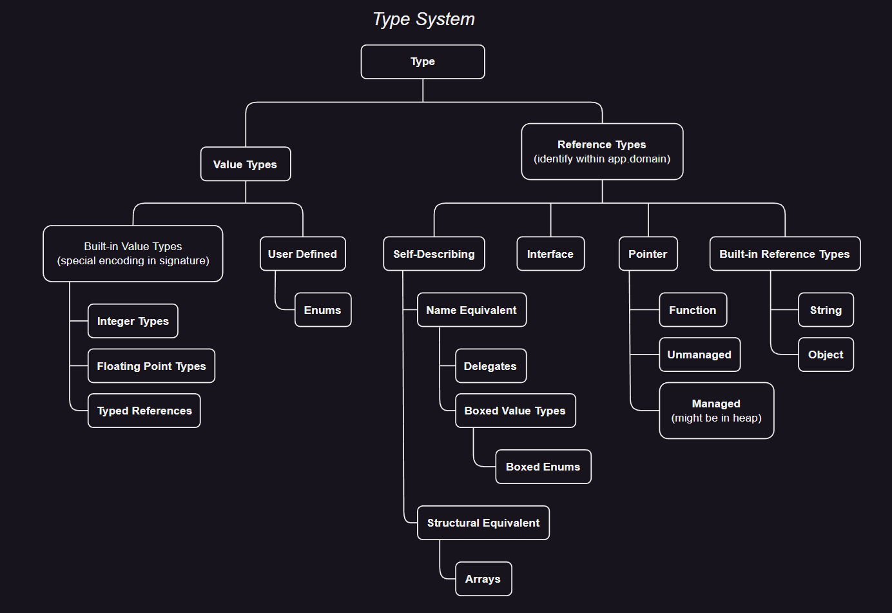
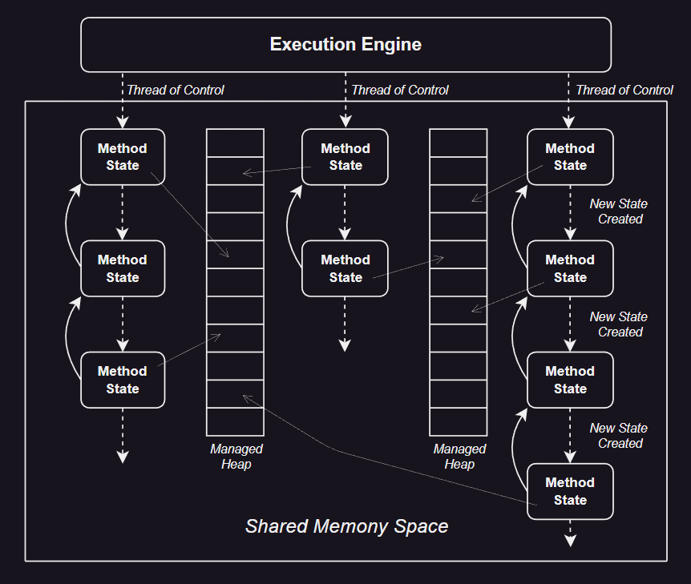
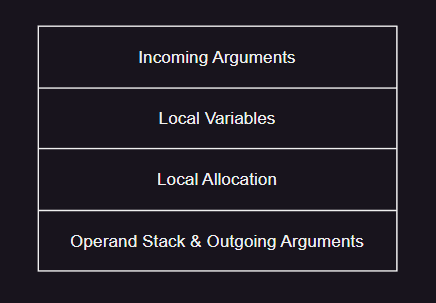

# CLI：基本概念和体系结构

---
## 1. Common Language Infrastructure 通用语言基础概述

公共语言基础结构 CLI 为可执行代码及其运行的执行环境 (虚拟执行系统，VES) 提供了规范。可执行代码以模块的形式呈现给 VES。CLI 的核心是一个统一的类型系统，由编译器、工具和 CLI 本身共享的公共类型系统。该模型定义了 CLI 在声明、使用和管理类型时遵从的规则。CTS 建立了一个支持跨语言集成、类型安全和高性能代码执行的框架。

CLI 主要包含四个方面：
- 公共类型系统 (*Common Type System*，CTS)：CTS 提供了一个丰富的类型系统支持许多编程语言中的类型和操作。CTS 旨在支持各种编程语言的完整实现。
+ 元数据 (*Metadata*)：CLI 使用元数据描述和引用 CTS 定义的类型。元数据以一种独立于任何特定编程语言的方式存储 (即持久化)。因此，元数据为操作程序的工具 (如编译器和调试器) 之间以及这些工具和 VES 之间提供了一种通用的数据交换机制。
- 公共语言规范 (*Common Language Specification*，CLS)：CLS 是语言设计者和框架 (类库) 设计者之间的协议。它指定了 CTS 的一个子集和一组使用协议。语言通过实现至少属于 CLS 的 CTS 部分，为其用户提供了访问框架的最大能力。如果框架的公开导出方面 (例如，类、接口、方法和字段) 只使用属于 CLS 的一部分并遵守 CLS 协议的类型，那么框架将得到最广泛的利用。
+ 虚拟执行系统 (*Virtual Execution System*，VES)：VES 实现并执行 CTS 模型。VES 负责加载和运行为 CLI 编写的程序。它提供执行托管代码和数据所需的服务，使用元数据在运行时将单独生成的模块连接在一起 (后期绑定)。

CLI 的这些方面共同构成了一个统一的基础结构，用于设计、开发、部署和执行分布式组件和应用程序。针对 CLI 的每种编程语言都有 CTS 的适当子集。基于语言的工具彼此通信，并使用元数据与 VES 通信，以定义和引用用于构造应用程序的类型。VES 使用元数据根据需求创建类型的实例，并向 CLI 的其他部分 (如远程服务、程序集下载和安全性) 提供数据类型信息。

>---
### 1.1. CLI 与类型安全的关系

类型安全通常是根据它所做的事情 (如，保证不同对象之间的封装) 或根据它所防止的事情 (例如，在不应该写的地方写内存损坏) 来讨论的。从 CTS 的角度来看，类型安全保证：

- ***References are what they say they are*** —— 每个引用都是有类型的，被引用的对象或值也有类型，这些类型是赋值兼容的。
- ***Identities are who they say they are*** —— 无法破坏或欺骗一个对象，对于用户方或安全域也是如此。通过可访问的函数和字段来访问一个对象。对象仍然可能会以一种危及安全性的方式被设计出来。但是，对类、类方法和它使用的内容进行局部分析，而非对类的所有内容进行全局分析，就足以评估其安全漏洞。
- ***Only appropriate operations can be invoked*** —— 引用类型定义了可访问的函数和字段，并根据引用的位置限制成员可见性。

CTS 提高了类型安全性，可以选择性地强制类型安全，难点在于如何确定实现是否符合类型安全声明。由于声明携带元数据并与程序编译在一起，因此从公共中间语言 CIL 到本地代码的编译器可以对实现进行类型检查

---
### 1.2. CLI 与托管元数据驱动执行的关系

元数据通过描述代码定义的类型及其外部引用的类型来描述代码。编译器在生成代码时生成元数据。元数据中存储了足够的信息，以便：
- **托管代码执行** (*Manage code execution*) —— 不仅是加载和执行，还有内存管理和执行状态检查。
- **管理代码** (*Administer the code*) —— 安装、解析和其他服务
- **代码中的引用类型** (*Reference types in the code*) —— 可以导入到其他语言和工具中，以及脚本和自动化支持。

CTS 假设执行环境是元数据驱动的。使用元数据以允许 CLI 支持：
- **多执行模型** (*Multiple execution models*) —— 元数据允许执行环境处理解释、JIT 编译、本地和遗留代码的混合，并且仍然为调试器和分析器等工具提供统一的服务、一致的异常处理和堆栈展开、可靠的代码访问安全性和高效的内存管理。
- **对服务的自动支持** (*Auto support for services*) —— 由于元数据在执行时可用，因此执行环境和基础库可以自动提供对反射、自动化、序列化、远程对象以及与现有非托管本地代码的互操作性支持。
- **更好的优化** (*Better optimization*) —— 使用元数据引用而不是物理偏移量、布局和大小，允许 CLI 优化成员和调度表的物理布局。此外允许优化生成的代码以匹配特定的 CPU 或环境。
- **降低绑定的脆弱性** (*Reduced binding brittleness*) —— 通过使用元数据引用，用加载的布局和按名称绑定取代编译时的对象布局，降低了版本间的脆弱性。
- **灵活的部署解析** (*Flexible deployment resolution*) —— 由于同时拥有一个类型的引用和定义的元数据，因此可以实现更健壮、更灵活的部署和解析机制。解析意味着通过查找适当的位置集，可以找到最能满足在此上下文中使用的这些需求的实现。包含五个要素：需求和上下文通过元数据提供；在哪里查找、如何找到实现以及如何决定来自于应用程序打包和部署的最佳匹配。

#### 1.2.1. 托管代码

**托管代码** (_managed code_) 是提供足够信息的代码，以允许 CLI 提供一组核心服务：
- 给定方法代码中的地址，定位描述该方法的元数据。
- 堆栈遍历。
- 异常处理。
- 存储和检索安全信息。

CLI 指定了一组特定的指令集、CIL 和特定文件格式，用来存储和传输托管代码。

#### 1.2.2. 托管数据

**托管数据** (_managed data_) 是由 CLI 通过 **垃圾回收器** (_garbage collection_) 的进程自动分配和释放的数据。

---
## 2. Common Language Specification 公共语言规范

CLS 是一组促进语言间互操作性的规范，CLS 遵从性是指在 CLI 实现上执行并生成的类型和特性必须符合 CLI 标准。这些附加规则仅适用于在程序集中可见的类型，以及可在程序集外部访问的成员。

>---
### 2.1. CLS 遵从性的分析角度

CLS 是一组应用于生成程序集的规则，它被设计为支持库和设计用于编写库的高级编程语言间的互操作性。从生成程序集过程中使用的高级语言源代码和工具 (如编译器) 的角度来考虑 CLS 规则是有用的。

#### 2.1.1. CLS Framework

由符合 CLS 的代码组成的库被称为框架 (*framework*)。框架是为广泛的编程语言和工具 (包括 CLS *Consumer* 和扩展语言) 使用而设计的。通过遵守 CLS 规则，库的作者可以确保库可以被更大的工具类使用。

符合 CLS 的框架应遵循的一般原则：
- 避免使用编程语言中常用的关键字名称。
- 不要期望框架的用户能够编写嵌套类型。
- 假设相同名称和签名的方法在不同接口上的实现是独立的。
- 不依赖于基于指定初始化设定项自动执行的值类型初始化。
- 假设用户可以实例化和使用泛型类型和方法，但不要求他们定义新的泛型类型或方法，或处理部分已构造的泛型类型。
- 不应要求用户定义新的泛型类型或方法，或重写现有的泛型方法，或以任何方式处理部分构造的泛型。

#### 2.1.2. CLS Consumer

CLS *Consumer* 是一种语言或工具，其设计目的是允许访问符合 CLS 的框架提供的所有特性，但不一定能够实现它们。

CLS *Consumer* 工具预计的部分功能支持：
- 支持调用任何符合 CLS 的方法或委托。
- 提供一种机制，用于调用其名称为语言关键字的方法。
- 支持调用用一种类型支持的不同方法，这些方法具有相同的名称和签名，但实现不同的接口。
- 创建任何符合 CLS 类型的实例。
- 读取和修改任何符合 CLS 的字段。
- 访问嵌套类型。
- 访问任何符合 CLS 的属性。除了能够调用属性的 *getter* 和 *setter* 方法外，不需要其他任何特殊的支持。
- 访问任何符合 CLS 的事件。除了能够调用为实现定义的方法外，不需要其他任何特殊支持。
- 具有导入、实例化和使用泛型类型和方法的机制。
-  (考虑支持) 使用语言定义的匹配规则，对泛型方法进行类型推断。
-  (考虑支持) 强制转换语法，用于澄清对公共超类型的模糊强制转换。

CLS *Consumer* 工具无需支持：
- 创建新的类型或接口。
- 初始化除静态字面字段以外的字段和参数的元数据。*Consumer* 可以选择使用初始化元数据，也可以安全地忽略除静态字面量字段之外的任何其他元数据。

#### 2.1.3. CLS Extender

CLS *extender* 是一种语言或工具，旨在允许程序员使用和扩展符合 CLS 的框架。CLS *extender* 支持 CLS *Consumer* 所支持的行为的超集 (即，适用于 CLS *Consumer* 的所有内容也适用于 CLS *extender*)。除了满足用户的要求外，CLS *extender* 还应支持：
- 定义新的 CLS-compliant 类型，扩展任何 (非密封的) CLS-compliant 基类。
- 具有某种机制来定义其名称为语言关键字的类型。
- 为一个类型支持的所有接口中的所有方法提供独立的实现，CLS 扩展要求单个代码体实现所有具有相同名称和签名的接口方法是不够的。
- 实现任何符合 CLS-compliant 的接口。
- 在元数据的所有适当元素上注释任何符合 CLS 的自定义特性。
- 定义新的 CLS-compliant (非泛型) 类型，扩展任何 (非密封的) CLS-compliant 基类型。有效的基类型包含普通非泛型类型和完全构造的泛型类型。
-  (考虑支持) 使用语言定义的匹配规则对泛型方法进行类型推断。
-  (考虑支持) 强制转换语法，用于澄清对公共超类型的模糊强制转换。

CLS *extender* 无需支持：
- 定义新的 CLS-compliant 接口。
- 嵌套类型的定义。
- 泛型类型和方法的定义。
- 重写现有的虚拟泛型方法。

>> <a id="R48"></a>CLS Rule 48：如果一个类型中声明的两个或多个符合 CLS 的方法具有相同的名称，并且对于一组特性的类型实例化，它们具有相同的参数和返回类型，那么所有这些方法在这些类型实例化中应该在语义上等效。

>---
### 2.2. CLS 遵从性

CLS 定义了语言互操作规则 (从 *framework*，*consumer*，*extender* 三个角度描述)，这些规则仅适用于 “外部可见” 的元素。该语言互操作性的 CLS 单元是程序集，在这个单个程序集内，可以使用的元素没有限制。

> > <a id="R1"></a>CLS Rule 1：CLS 规则仅适用于那些定义在程序集之外的可访问或可见类型的那些内容。
> 
> > For *consumer*：没有影响。
> 
> > For *extender*：在编译时进行 CLS 遵从性检查时，请确保仅将规则应用于将要导出到程序集外部的信息。
> 
> > For *framework*：CLS 规则不适用于程序集的内部实现。一个公开可访问的内容 (在另一个程序集的可执行代码：类型、接口、方法、字段、属性、事件等) 要么是只具有符合 CLS 的类型组成的签名，要么被特别标记为不符合 CLS，要么该类型符合 CLS。

CLS 指定如何注释程序集的外部可见部分，以指示它们是否符合 CLS 要求。`System.CLSCompliantAttribute` 指示哪些类型和类型成员是符合 CLS 的，它可以附加到程序集，以指定程序集包含的所有顶级类型的默认遵从级别。`CLSCompliantAttribute` 包含一个 `Boolean` 参数，用于指示与其关联的项是否符合 CLS，这允许显式地将任何项注释为是否符合 CLS。

确定 CLS 遵从性的一般规则：
- 当程序集不显式标记为 `[CLSCompliantAttribute]` 时，假定它是 `[CLSCompliantAttribute(false)]`。
- 默认情况下，类型继承其封闭类型的 CLS 遵从性级别，或者获取附加到其程序集的遵从性级别。
- 默认情况下，其他成员 (方法、字段、属性、事件) 继承其类型的 CLS 遵从性。可以显式 `[CLSCompliantAttribute(false)]` 标记为不符合 CLS。

> > <a id="R2"></a>CLS Rule 2：不符合 CLS 的类型的成员不应标记为 *CLS-compliant*。
> 
> > For *consumer*：可以使用上述规则忽略任何不符合 CLS 的成员。
> 
> > For *extender*：应该鼓励正确标记新编写的程序集和公开导出的类型和成员。强烈建议在编译时强制执行 CLS 规则。
> 
> > For *framework*：应正确标记所有公开导出的成员的 CLS 遵从性。这里指定的规则可用于最小化所需标记的数量 (例如，如果所有类型和成员都符合要求，或者只有少数例外需要标记，则对整个程序集进行标记)。

---
## 3. Common Type System 公共类型系统

类型描述值并指定该类型的所有值都应支持的协议。因为 CTS 支持面向对象编程 OOP 以及函数式和过程式编程语言，所以它处理两种实体：对象 (***Objects***) 和值 (***Values***)。

对于整数和浮点数，值是简单的位模式；每个值都有一个类型，该类型既描述了它所占用的存储空间和它的表示形式中 Bits 的含义，还描述了在该表示形式上可以执行的操作。值用于表示类似 C 等编程语言中对应的简单类型，也用于表示 C++、Java 等语言中的非对象。

对象具有比值更多的东西。每个对象都是自类型化的，它的类型显式地存储在它的表示中。它有一个区别于所有其他对象的标识，并且它有存储其他实体 (可以是对象或值) 的槽。虽然可以更改其槽的内容，但对象的标识永远不会更改。

有几种对象和值，如下面的图表所示：



泛型特性允许使用一个模式定义一整套类型和方法，其中包括称为泛型参数的占位符。根据需要，这些泛型参数被特定类型替换，以实例化实际需要的实例类型成员。泛型的设计要满足：
- **正交性** (*OrthogonalityWhere*)：泛型类型可以出现在任何可以出现现有 CLI 类型的上下文中。
- **语言独立性** (*Language independence*)：对源语言不做任何假设。但是 CLI 泛型尝试支持尽可能多的语言中现有的类似泛型的特性。此外，这种设计允许对目前缺乏泛型的语言进行纯净扩展。
- **实现独立性** (*Implementation independence*)：CLI 的实现可以根据具体情况对表示和代码进行专门化，或者共享所有表示和代码，也许可以通过装箱和拆箱值来实现这一点。
- **实现效率** (*Implementation efficiency*)：泛型的性能并不比使用 `Object` 来模拟泛型差；好的实现可以做得更好，避免对引用类型实例化进行强制转换，并为值类型实例化生成专门的代码。
- **在定义点静态检查** (*Statically checkable at point of definition*)：可以独立于其构造实体来验证泛型类型定义。因此，泛型类型是静态可验证的，并且它的方法可以保证对所有有效的构造实体进行 JIT 编译。
- **泛型参数的统一行为** (*Uniform behavior with respect to generic parameters*)：一般来说，参数化类型和泛型方法的行为在所有类型实例化中都是 “相同的”。

此外，CLI 还支持协变和逆变泛型类型参数，具有以下特点：
- 基于静态检查，它是类型安全的。
- 特别地，变体 (协变或逆变) 只允许在泛型接口和泛型委托上出现。
- 变体影响从变体接口调用方法的调用指令。对于非变体接口，必须存在与调用指令中指定的类型完全相同的方法，并调用该方法。对于变体接口，调用指令中指定的确切类型的方法不需要存在，只需是该变体的匹配类型。如果存在多个匹配项，则方法的声明顺序和继承的方法顺序决定调用哪一个，即使存在精确匹配项，也可能调用变体匹配项。所有针对 CLI 的语言系统都必须考虑源语言是否支持该特性的差异。
- 允许实现一些语言中使用的更复杂的协变方案。

>---
### 3.1. CTS 与面向对象编程的关系

在 *Value-Oriented* 编程中，术语类型通常用于表示数据表示。在面向对象编程中，它通常指的是行为而不是表示。在 CTS 中，类型用于表示：两个程序实体只有在当且仅当它们具有兼容的表示行为时被视为是存在兼容性的类型。因此，在 CTS 中，如果一种类型是从基类型派生的，那么派生类型的实例可以替换为基类型的实例，因为表示和行为都是兼容的。

与某些 OOP 语言不同，在 CTS 中，具有根本不同表示的两个对象具有不同的类型。一些 OOP 语言使用不同的类型概念。如果两个对象以相同的方式响应同一组消息，则认为它们具有相同的类型。这个概念在 CTS 中通过说对象实现相同的接口来捕获。

类似地，一些 OOP 语言认为消息传递是计算的基本模型。例如在 CTS 中调用虚方法相当于消息传递，其中虚方法的签名扮演消息的角色。

CTS 本身并不直接捕捉 “无类型编程” 的概念。也就是说，如果不知道对象的类型，就无法调用非静态方法。然而，无类型编程 (如果它被实现的话) 可以基于反射包提供的工具来实现。

>---
### 3.2. 值和类型的关系

在计算机编程中，**类型** 用于描述可以存储在变量中、作为参数传递或由函数返回的值。每个值都是类型的一个实例，每个值的使用都需要一个类型。类型定义了类型值支持的允许值和允许操作。所有运算符和函数都有访问或使用的每个值的预期类型。

每个值都有一个完全描述其类型属性的确切类型。每个值都是其确切类型的实例，也可以是其他类型的实例。特别地，如果一个值是继承自另一个类型的类型的实例，则它也是该另一个类型的实例。

#### 3.2.1. 值类型和引用类型
<a id= "valuetype-and-reference"></a>

CTS 有两种类型，值类型和引用类型：
- 值类型 —— 由值类型描述的值是自包含的。
- 引用类型 —— 引用类型描述的值表示另一个值的位置。有四种引用类型：
  - 对象类型 (*object type*) 是自我描述值的引用类型。某些对象类型 (例如，抽象类) 只是值的部分描述。
  - 一个接口类型总是对一个值的部分描述，该值可能受许多对象类型支持。
  - 指针类型是对值的编译时描述，其表示形式是某个位置的机器地址。指针可以是托管或非托管的。
  - 内置引用类型。

<a id="byref"></a>一个托管指针，或者称为 **byref**，可以指向一个局部变量、参数、复合类型的字段或数组的元素。然而，当一个调用跨越远程边界时，符合规范的实现可以使用 *copy-in* / *copy-out* 机制，而不是托管指针。因此，程序不应依赖真正指针的别名行为。托管指针类型只允许用于局部变量和参数签名；它们不能用于对象字段，或作为数组的元素类型，并且禁止对托管指针类型的值进行装箱。对于方法的返回类型使用托管指针类型是不可验证的。

出于性能原因，GC 堆上的项目可能不包含对其他 GC 对象内部的引用，这促使对字段和装箱施加限制。返回一个引用本地或参数变量的托管指针可能会导致引用比变量存在的时间更长，因此它是不可验证的。

基础类库中有三种值类型：`System.TypedReference`、`System.RuntimeArgumentHandle` 和 `System.ArgIterator`。

<a id="typedref"></a>值类型 `System.TypedReference`，或者称为类型引用 **typed reference** 或 **typedref**，包含一个指向位置的托管指针和一个可以存储在该位置的类型的运行时表示。**typed references** 具有与 **byref**s 相同的限制。**typed references** 是由 CIL 指令 `mkrefany` 创建的。

<a id= "byref-like"></a>值类型 `System.RuntimeArgumentHandle` 和 `System.ArgIterator`，包含指向 VES 堆栈的指针。它们可以用于局部变量和参数签名。这些类型用于字段、方法返回类型、数组的元素类型或装箱是不可验证的。这两种类型被称为 **byref-like** 类型。

#### 3.2.2. 内置的值类型和引用类型

以下数据类型是 CTS 的组成部分，并直接由 VES 支持。它们在持久化的元数据中有特殊的编码。

| Name in CIL assembler | CLS Type? | Name in class library   | Description                   |
| :-------------------- | :-------- | :---------------------- | :---------------------------- |
| `bool`                | Yes       | `System.Boolean`        | True/False value              |
| `char`                | Yes       | `System.Char`           | Unicode 16-bit char.          |
| `object`              | Yes       | `System.Object`         | Object or boxed value type    |
| `string`              | Yes       | `System.String`         | Unicode string                |
| `float32`             | Yes       | `System.Single`         | IEC 60559:1989 32-bit float   |
| `float64`             | Yes       | `System.Double`         | IEC 60559:1989 64-bit float   |
| `int8`                | No        | `System.SByte`          | Signed 8-bit integer          |
| `int16`               | Yes       | `System.Int16`          | Signed 16-bit integer         |
| `int32`               | Yes       | `System.Int32`          | Signed 32-bit integer         |
| `int64`               | Yes       | `System.Int64`          | Signed 64-bit integer         |
| `native int`          | Yes       | `System.IntPtr`         | Signed integer, native size   |
| `native unsigned int` | No        | `System.UIntPtr`        | Unsigned integer, native size |
| `typedref`            | No        | `System.TypedReference` | Pointer plus exact type       |
| `unsigned int8`       | Yes       | `System.Byte`           | Unsigned 8-bit integer        |
| `unsigned int16`      | No        | `System.UInt16`         | Unsigned 16-bit integer       |
| `unsigned int32`      | No        | `System.UInt32`         | Unsigned 32-bit integer       |
| `unsigned int64`      | No        | `System.UInt64`         | Unsigned 64-bit integer       |

#### 3.2.3. 类、接口和对象

如果一个类型能够明确无误地定义值的表示和在该值上定义的操作，那么它就完全描述了一个值。
- 对于值类型，定义表示意味着描述构成值表示的位模式。
- 对于引用类型，定义表示意味着描述构成值表示的位置和位模式。
- 方法描述了可以在精确类型的值上执行的操作。定义允许在精确类型的值上执行的操作集合需要为每个操作指定命名方法。

有些类型只是部分描述，例如接口类型。这些类型描述了没有实现定义的操作子集，因此，不能是任何值的精确类型。因此，虽然一个值只有一个精确类型，但它也可以是许多其他类型的值。由于精确类型完全描述了值，它也完全指定了精确类型的值可以具有的所有其他类型。

虽然每个值都有一个精确类型，但并不总是可以通过检查值的表示来确定精确类型。特别是，永远无法确定值类型的值的精确类型。例如两种内置的值类型，32 位有符号和无符号整数。虽然每种类型都是它们各自值的完全规范 (即，精确类型)，但无法从值的特定 32 位序列中推导出是哪个精确类型。

对于一些称为对象的值，总是可以从值中确定精确类型。对象的精确类型也被称为对象类型。对象是引用类型的值，但并非所有引用类型都描述对象。例如一个值，它是一个指向 32 位整数的指针，是一种引用类型。通过检查指针位无法发现值的类型；因此它不是一个对象。内置的 CTS 引用类型 `System.String`，这种类型的值的精确类型总是可以通过检查值来确定的，因此 `System.String` 类型的值是对象，而 `System.String` 是一个对象类型。

#### 3.2.4. 值的装箱和拆箱

对于每种值类型，CTS 都定义了一个相应的引用类型，称为装箱类型，反之则不然。一般来说，引用类型没有相应的值类型。装箱类型的值 (装箱值) 的表示形式是一个位置 (_location_)，这个位置用来存储值类型的值。装箱类型是对象类型，装箱值是对象。

一个装箱类型不能直接通过名称引用，因此没有这样一个装箱类型的字段或局部变量。装箱枚举值类型最接近的命名基类是 `System.Enum`；对于所有其他值类型，它是 `System.ValueType`。类型为 `System.ValueType` 的字段只能包含 null 值或一个装箱值类型的实例。类型为 `System.Enum` 的局部变量只能包含 `null` 值或一个装箱枚举类型的实例。

所有值类型都有一个名为 **box** 的操作。对任何值类型进行装箱都会产生其装箱值；即，包含原始值位序列副本的相应装箱类型的值。如果值类型是可空类型 —— 定义为值类型 `System.Nullable<T>` 的实例化 —— 结果是 `null` 引用或其 `Value` 属性的位序列副本，取决于其 `HasValue` 属性 (`false` 或 `true`)。所有装箱类型都有一个名为 **unbox** 的操作，该操作会产生一个指向值的位表示的托管指针。

**box** 指令可以应用于不仅仅是值类型的类型；这些类型被称为可装箱类型。如果一个类型满足以下条件之一，那么它就是可装箱的：
- 值类型 (包括泛型值类型的实例化)，但不包括类型引用。装箱一个类似 **byref** 的类型是不可验证的。排除了类型引用，以便 GC 堆中的对象不能包含对其他 GC 对象内部的引用。*byref-like* 类型包含指向 VES 堆栈条目的嵌入式指针。如果对 *byref-like* 类型进行装箱，这些嵌入式指针可能会比它们指向的内容存在的时间更长，因此这个操作是不可验证的。
- 一个引用类型 (包括类、数组、委托和泛型类的实例化)，但不包括托管指针 / **byref**s。
- 泛型参数 (由泛型类型定义或泛型方法定义)。泛型参数的装箱和拆箱会给 CLI 实现增加性能开销。在对由值类型定义的方法进行虚拟分派时，`constrained.` 前缀可以通过避免装箱值类型来提高性能。

`System.Void` 类型永远不会被装箱。接口和继承只在引用类型上定义。因此，虽然值类型定义可以指定由值类型实现的接口和它继承的类 (`System.ValueType` 或 `System.Enum`)，但这些只适用于装箱值。

> > <a id="R3"></a>CLS Rule 3：装箱的值类型不是 *CLS-compliant* 的。适当的情况下，可以使用 `System.Object`，`System.ValueType` 或 `System.Enum` 来代替装箱类型。
> 
> > For *consumer*：不需要导入装箱值类型。
> 
> > For *extender*：不需要提供定义或使用装箱值类型的语法。
> 
> > For *framework*：不能在其公开导出的部分中使用装箱值类型。

#### 3.2.5. 值的 Identity 和 Equality

所有的值都定义了两个二元操作：**identity** 身份比较和 **equality** 相等比较。它们返回一个 *Boolean* 值，包含以下运算性质：
- 自反性：`a op a = true`。
- 对称性：当前仅当 `b op a = true` 时 `a op b = true`。
- 传递性：如果 `a op b = true` 且 `b op c = true` 时，`a op c = true`。

虽然 *identity* 总是意味着 *equality*，反之则不然。例如考虑三个变量 `A,B -> "here's some text"` 和 `C -> "here's some text"`，它们的类型是 `System.String`，其中箭头意味着 “是对 `"here's some text"` 的引用”。

如果字符序列的位置相同 (即，实际上在内存中只有一个字符串)，那么变量的值是相同的。如果字符序列相同，那么存储在变量中的值是相等的。因此，变量 `A` 和 `B` 的值是 *identity* (指向同一对象)，变量 `A` 和 `C` 以及 `B` 和 `C` 的值不是 *identity* (指向不同对象)，但变量 `A`、`B` 和 `C` 的值内容是相等 (*equality*) 的。

##### 3.2.5.1. **Identity**

*Identity* 等价性运算的 CTS 定义：
- 如果值具有不同的确切类型，那么它们不是相同的。
- 否则，如果它们的确切类型是值类型，那么当且仅当值的位模式逐位相同时，它们才是相同的。
- 否则，如果它们的确切类型是引用类型，那么当且仅当值的位置相同时，它们才是相同的

`System.Object` 类提供了一个名为 `ReferenceEquals` 的方法，用于确定两个对象引用是否指向内存中的同一位置。

##### 3.2.5.2. **Equality**

对于值类型，等式运算符是确切类型定义的一部分。等式的定义应遵循以下规则：
- *Equality* 应该是一个等价运算符。
- *Identity* 应该隐含 *Equality*。
- 如果操作数中的一个 (或两个) 是装箱值，那么应该通过以下方式计算等式：
  - 首先拆箱任何装箱的操作数，然后
  - 对结果值应用通常的 *Equality* 规则。 

*Equality* 是通过 `System.Object.Equals` 方法实现的。 

虽然 IEC-60559:1989 定义了两个浮点 *NaN* 总是比较为不等，但 `System.Object.Equals` 要求必须重写满足等价运算符的要求。因此当比较两个 *NaN* 时，`System.Double.Equals` 和 `System.Single.Equals` 返回 `True`，而等式运算符在这种情况下返回 `False`。

>---
### 3.3. Locations 位置

值是存储在位置 (***Location***) 中的。一个位置一次只能存储一个值，所有的位置都是有类型的。位置的类型体现了存储在该位置的值必须满足的要求。*Locations* 例子包括局部变量和参数。

位置的类型指定了对从该位置加载的任何值的使用限制。例如，一个位置可以存储潜在的许多精确类型的值，只要所有的类型都可以赋值给该位置的类型。从位置加载的所有值都被视为该位置的类型。即使存储在位置中的值的精确类型能够进行额外的操作，也只能调用对位置的类型有效的操作。

#### 3.3.1. Assignment-compatible 兼容赋值

一个值只有在其类型之一与位置的类型兼容时，才能存储在该位置。一个类型总是可以赋值给自身。赋值兼容性通常可以在编译时确定，这样就无需在运行时进行测试。

#### 3.3.2. Coercion 强制转换

有时希望将一个类型的值 (该类型不能赋值给某个位置) 转换为可以赋值给该位置类型的值。这是通过对值进行强制转换来实现的。强制转换接受一个特定类型和期望类型的值，并试图创建一个期望类型的值，该值具有与原始值相同的含义。强制转换可能导致表示形式以及类型的改变；因此，强制转换不一定保留对象原有类型的身份信息。

强制转换有两种：扩大和缩小。扩大永远不会丢失信息，而缩小可能会丢失信息。一个扩大强制转换的例子是将一个 32 位有符号整数的值强制转换为一个 64 位有符号整数的值。一个缩小强制转换的例子是将一个 64 位有符号整数强制转换为一个 32 位有符号整数。

编程语言通常将扩大强制转换实现为隐式转换，而缩小强制转换通常需要显式转换。

一些强制转换的操作是直接包含在对内置类型的 VES 操作中的。所有其他的强制转换都应显式请求。对于内置类型，CTS 提供了操作来执行无运行时检查的扩大强制转换和有运行时检查或截断的缩小强制转换，这取决于操作的语义。

#### 3.3.3. Casting 转换

由于一个值可以有多种类型，所以在使用该值时需要明确识别出正在使用的是哪种类型。由于从已经定义类型的位置读取值，所以使用的值的类型就是该位置的定义类型。如果要使用不同的类型，那么值会被转换 (*Cast*) 为其他类型。

转换通常是一个编译时操作，但是如果编译器不能静态地知道值是否为目标类型，那么就会进行运行时的转换检查。与强制转换 (*Coercion*) 不同，转换并不会改变对象的实际类型，也不会改变它的表示。转换保留了对象的身份 (*Identity*)。

当从一个定义为持有特定接口值的位置对读取的值进行转换时，可能需要进行运行时检查。因为接口是对值的不完全描述，所以将该值转换为不同的接口类型通常会导致运行时的转换检查。

>---
### 3.4. 类型成员

类型定义了该类型的值可以具有的值和支持的操作。如果该类型的可允许值具有子结构，那么该子结构是通过该类型的字段或数组元素来描述的。如果有属于该类型的操作，那么这些操作是通过该类型的方法来描述的。字段、数组元素和方法被称为该类型的成员。属性和事件也是类型的成员。

#### 3.4.1. 字段和数组

一个值的表示 (除了内置类型) 可以被细分为子值。这些子值要么被命名，此时它们被称为字段，要么通过索引表达式访问，此时它们被称为数组元素。描述由数组元素组成的值的类型是数组类型。描述由字段组成的值的类型是复合类型。一个值不能同时包含字段和数组元素，尽管复合类型的一个字段可以是数组类型，而一个数组元素可以是复合类型。

数组元素和字段都是有类型的，这些类型永远不会改变。数组中的所有元素都应该具有相同的类型。复合类型的每个字段可以有不同的类型。

#### 3.4.2. 方法

一个类型可以将操作与该类型或该类型的每个实例关联起来，这样的操作被称为方法。一个方法有一个名称，并且有一个签名，该签名指定了其所有参数和返回值 (如果有) 的允许类型。

一个只与类型本身 (而不是类型的特定实例) 关联的方法被称为静态方法。

与类型的实例关联的方法要么是实例方法，要么是虚方法。当它们被调用时，实例方法和虚方法都会传递一个实例，这个实例就是此次调用要操作的对象 (被称为 **this** 或者 **this pointer**)。

实例方法和虚方法的基本区别在于如何定位实现。通过指定一个类和该类中的实例方法来调用实例方法。除了泛型类型的实例方法的情况外，作为 **this** 传递的对象可以是 `null` 或者是任何从定义该方法的类派生类型的实例。虚方法也可以以这种方式被调用。例如，当一个虚方法的实现希望调用其基类提供的实现时，就会发生这种情况。CTS 允许在虚方法的主体内部将 **this** 设为 `null`。

允许使用非虚拟调用来调用虚拟方法，这消除了对 “*call super*” 指令的需要，并允许在虚拟方法和非虚拟方法之间进行版本更改。如果不希望空的 **this pointer** 传递到被调用的方法，那么就需要 CIL 生成器插入对空指针的显式测试。

一个虚拟方法或实例方法也可以通过另一种机制来调用，即虚拟调用。任何从定义了虚拟方法的类型继承的类型都可以提供该方法的自身实现，根据对象的运行时类型来决定调用哪个实现。

#### 3.4.3. 静态字段和方法

类型可以声明与类型本身而不是类型的任何特定值相关联的字段，这样的字段是类型的静态字段。静态字段声明了一个由类型的所有值共享的位置。就像非静态 (实例) 字段一样，静态字段是有类型的，这个类型永远不会改变。静态字段总是限制在单个应用程序域的基础上，但它们也可以按线程分配。

同样，类型也可以声明与类型本身而不是类型的值关联的方法。这样的方法是类型的静态方法。由于静态方法的调用没有与之关联的值，因此在静态方法中没有可用的 **this pointer**。

#### 3.4.4. 虚方法

一个对象类型可以将其任何方法声明为虚方法。与其他方法不同，实现该类型的每个确切类型都可以提供虚方法的自身实现。虚方法可以通过普通的方法调用机制来调用，该机制使用静态类型、方法名和参数的类型来选择实现，在这种情况下，**this pointer** 可以为 `null`。

另外，虚方法还可以通过一种特殊的机制 (虚调用) 来调用，该机制根据动态检测到的用于进行虚调用的实例的类型，而不是在编译时静态已知的类型来选择实现。虚方法可以被标记为 **final**。

>---
### 3.5. 命名

类型系统的实体被赋予名称，以便可以被类型系统的其他部分或类型的实现引用。类型、字段、方法、属性和事件都有名称。在类型系统中，值、局部变量和参数没有名称。类型系统的实体被赋予一个单一的名称。

#### 3.5.1. 有效的名称

所有的名称比较都是按字节进行的 (区分大小写，独立于地区设置)。在使用名称来访问内置的 VES 提供的功能 (例如，类初始化方法) 时，定义中总是有相应的指示，以避免构建任何保留名称集。

> > <a id="R4"></a>CLS Rule 4：程序集应遵循附录 **Annex 7 of Technical Report 15 of the Unicode Standard 3.0**，该 [附录](http://www.unicode.org/unicode/reports/tr15/tr15-18.html) 规定了允许开始和包含在标识符中的字符集。标识符应采用 **Unicode Normalization Form C** 定义的规范格式。出于对 CLS 的支持，如果两个标识符的小写映射 (由 Unicode 不区分区域的一对一小写映射指定) 相同，那么这两个标识符就是相同的。要想在 CLS 下被认为是不同的，两个标识符在大小写上必须有所不同。但是，为了覆盖隐藏继承的定义，CLI 要求使用原始声明的精确编码。
> 
> > For *consumer*：不需要使用违反该规则的类型，但应有一种机制允许访问使用其自身关键字作为名称的命名项。
> 
> > For *extender*：不需要创建违反该规则的类型。应提供一种机制允许定义遵循这些规则的新名称，但这些新名称与语言中的关键字相同。
> 
> > For *framework*：不应导出违反该规则的类型。应避免使用常用编程语言中的关键字作为名称。

#### 3.5.2. 程序集和作用域

通常，名称并不是唯一的。名称被收集到称为范围 (作用域，**scopes**) 的分组中。在一个作用域内，只要它们是不同 **类别** (*kinds*，如方法、字段、嵌套类型、属性和事件) 或具有不同的签名，一个名称就可以引用多个实体。

> > <a id="R5"></a>CLS Rule 5：在遵循 CLS 的范围内引入的所有名称应该是独立的，且不依赖于类型，除非这些名称相同并通过重载进行解析。尽管 CTS 允许单个类型为方法和字段使用相同的名称，但 CLS 不允许这样做。
> 
> > <a id="R6"></a>CLS Rule 6：字段和嵌套类型应仅通过标识符比较来区分，尽管 CTS 允许区分不同的签名。具有相同名称 (通过标识符比较) 的方法、属性和事件应该不仅仅在返回类型上有所不同，除 CLS Rule 39 情况外。
> 
> > For *consumer*：不需要使用违反这些规则的类型，只需忽略任何被标记为不符合 *CLSCompliant* 的成员即可。
> 
> > For *extender*：不需要提供定义违反这些规则的类型的语法。
> 
> > For *framework*：如果类型违反了这些规则，那么就不应该将其标记为 *CLSCompliant*，除非他们将类型中足够多的违规项标记为不遵循 *CLSCompliant*，以使得剩余的成员之间不会发生冲突。

一个命名实体在一个范围中有其名称。因此要识别一个命名实体，需要提供一个范围和一个名称。范围被认为是对名称的限定 (**qualify**)，类型为类型中的名称提供了一个范围，因此，类型限定了类型中的名称。

由于类型是命名的，因此类型的名称也被分组到范围中。为了完全识别一个类型，类型名称应由包含类型名称的范围进行限定。类型名称的范围由包含类型实现的程序集 (**assembly**) 进行限定。程序集是一组可配置的、可加载的代码模块和其他资源的集合，这些模块和资源共同实现了一个功能单元。类型名称被认为在实现该类型的程序集的程序集范围 (**assembly scope**) 内。程序集本身有名称，这些名称构成了 CTS 命名层次结构的基础。

类型定义 (**Type definition**)：
- 为正在定义的类型 (即 **type name** 类型名称) 定义一个名称，并指定一个可以找到该名称的范围。
- 定义了一个成员范围 (**member scope**)，在这个范围内，不同种类的成员 (字段、方法、事件和属性) 的名称被绑定。在类型的成员范围内，`(成员名称, 成员种类, 成员签名)` 的元组是唯一的。
- 隐式地将类型分配给包含类型定义的程序集的程序集范围。

CTS 支持枚举 (**enum**)，也称为枚举类型 (**enumeration type**)。为了匹配签名，枚举不应该与底层类型相同。但是，枚举的实例应该可以赋值给底层类型，反之亦然。从枚举转换到底层类型，或者从底层类型转换到枚举，都不需要转换 (**cast**) 或强制转换 (**coercion**)。枚举类型受到更多的限制：
- 它应该有且仅有一个实例字段，该字段的类型定义了枚举的底层类型。
- 它不应该有自己的任何方法。
- 它应该从 `System.Enum` 派生。
- 它不应该实现自己的任何接口。
- 它不应该有自己的任何属性或事件。
- 它不应该有任何静态字段，除非它们是字面量。

枚举的底层类型应该是内置的整数类型。枚举应该从 `System.Enum` 派生，因此它们是值类型。像所有的值类型一样，它们应是密封的。

> > <a id="R7"></a>CLS Rule 7：枚举的底层类型应该是内置的 CLS 整数类型，字段的名称应该是 `"value__"`，并且该字段应该被标记为 `RTSpecialName`。
>  
> > <a id="R8"></a>CLS Rule 8：有两种不同的枚举，通过 `System.FlagsAttribute` <a id="enum-flags"></a>自定义特性的存在或缺失来表示。一种代表命名的整数值；另一种代表可以组合生成未命名值的命名位标志。枚举的值不限于指定的值。
> 
> > <a id="R9"></a>CLS Rule 9：枚举的文字静态字段应该具有枚举本身的类型。
> 
> > For *consumer*：应接受遵循这些规则的枚举的定义，但不需要区分标志 (`Flags`) 和命名值。
> 
> > For *extender*：与 *consumer* 相同。支持扩展的语言允许编写枚举，但不需要区分标志 (`Flags`) 和命名值。
> 
> > For *framework*：不应该暴露违反这些规则的枚举，也不应该假设枚举只有指定的值。

#### 3.5.3. 可见性、可访问性、安全性
<a id="visible"></a>

要引用作用域中的一个命名实体，作用域和作用域中的名称都必须是可见的 (**visible**)。可见性由包含引用的实体 (引用者，**referent**) 和包含被引用名称的实体 (引用实体，**referenced entity**) 之间的关系决定。参考以下伪代码：

```csharp
class A{
    int IntInsideA;
}
class B : A{
    void method() => IntInsideA = 15;
}
// 分析在 A 中对字段 IntInsideA 的引用：
// - B 是引用者，它有一个方法引用了该字段
// - A 中的 IntInsideA 是被引用实体
```

为了确认引用是否被允许访问被引用实体，需要确认被引用实体的名称是否对引用可见；如果可见，引用是否可访问。只有满足以下条件，才允许访问类型的成员：
- 类型是可见的，对于嵌套类型，还必须是可访问的。
- 成员是可访问的。
- 已经获得所有相关的安全权限。

一个实例化的泛型类型只有在其自身和每个组成部分 (泛型类型定义和泛型参数) 都可见的情况下，才能从某个程序集中可见。例如，如果 `List<T>` 从程序集 `A` 中导出，且 `MyClass` 在程序集 `B` 中定义但未导出，那么 `List<MyClass>` 只能在程序集 `B` 内部可见。

##### 3.5.3.1. 类型的可见性

只有类型名称而非成员名称具有可控制的可见性。类型名称分为：
- 从它们所定义的程序集中导出 (**Exported**)。虽然可以标记一个类型以允许它从程序集中导出，但是程序集的配置决定了是否提供类型名称。
- 没有从定义它们的程序集中导出 (**Not exported**) 到外部。
- 嵌套在另一个类型内部。在这种情况下，该类型本身具有其封闭类型 (**enclosing type**) 的可见性。

一个顶级命名类型只有在具有公共可见性时才会被导出。由类型定义器生成的类型只有在类型被构造时才会被导出。由类型定义器生成的类型，如果其生成的所有类型都可见，那么该类型就是可见的。

##### 3.5.3.2. 嵌套类型和成员的可见性

一个类型包含了它的所有成员，并且还指定了其成员的可访问性规则。除非特别指出，否则可访问性仅由基于被引用成员的静态可见类型以及正在进行引用的类型和程序集来决定。CTS 支持七种不同的可访问性规则：
- **compiler-controlled**：只能通过定义来访问，而不能通过引用来访问，因此只能在单个编译单元内访问，并且受编译器的控制。
- **public**：所有的引用都可访问。
- **assembly**：只有在包含类型实现的同一程序集中的引用才能访问。
- **family-or-assembly**：只有符合 **family** 或 **assembly** 的引用才能访问。
- **family**：对支持相同类型的引用可访问 (即，精确类型及其所有派生的类型)。对于可验证的代码，有一个额外的要求 (可能需要运行时) 检查：引用必需通过其精确类型支持引用的精确类型项进行。也就是说，正在访问其成员的项应继承自执行访问的类型。
- **family-and-assembly**：只有同时符合 **family** 和 **assembly** 的引用才能访问。
- **private**：只有在定义成员的确切类型的实现中的引用才能访问。

一个成员或嵌套类型只有在具有 **public**，**family-or-assembly**，或 **family** 可访问性时，并且其定义类型 (在成员的情况下) 或其封闭类型 (在嵌套类型的情况下) 被导出的情况下，才会被导出。

类型定义器的可访问性与生成它的类型的可访问性相同。一般来说，类型的成员可以被分配任何一种可访问性规则。然而，有三个例外：
- 由接口定义的成员 (除嵌套类型外) 应为公开的。
- 当一个类型定义了一个虚拟方法来重写一个继承的定义时，两个定义中的可访问性应该是相同的，或者重写的定义应该允许比原始定义更多的访问。例如，可以用一个新的实现来重写一个 **assembly virtual** 方法，这个新的实现是 **public virtual** 的，但不能用 **family virtual** 来重写。如果正在重写的基础定义有 **family-or-assembly** 访问权限，而重写的定义只有 **family** 访问权限，那么不会被认为是限制访问。
- 由嵌套类型定义的成员，或者在嵌套类型中定义的嵌套类型，其可访问性不应大于定义它的封闭类型。

包括 C++ 在内的语言允许这种 “扩大” 的访问权限。限制访问会提供一种错误的安全幻觉，因为简单地将一个对象转换为基类 (这在方法调用时隐式发生) 就可以调用该方法，尽管访问权限受到限制。为了防止虚拟方法被重写，应使用 **final** 而不是依赖于有限的可访问性。

> > <a id="R10"></a>CLS Rule 10：在重写继承的方法时，可访问性不应改变，除非重写从不同程序集继承的具有 **family-or-assembly** 可访问性的方法。在这种情况下，重写应具有 **family** 可访问性。
> 
> > For *consumer*：不需要接受继承的扩大访问的虚方法的类型。
> 
> > For *extender*：不需要提供语法来支持对继承虚拟方法的扩大访问。
> 
> > For *framework*：不应依赖于扩大对虚拟方法访问的能力，无论是在框架导出部分还是在框架内部的用户。

##### 3.5.3.3. 安全权限

对成员的访问也受到可以附加到程序集、类型、方法、属性或事件的安全需求的控制。安全需求不是类型协议的一部分，因此不会被继承。有两种类型的需求：
- 继承需求 (**inheritance demand**)：当附加到一个类型时，它要求任何可能从这个类型继承的类型都必须具有指定的安全权限。当附加到一个非最终的虚拟方法时，它要求任何可能重写此方法的类型都应具有指定的权限。它不应附加到任何其他成员。
- 引用需求 (**reference demand**)：任何试图解析对标记项的引用的尝试都应具有指定的安全权限。

每种需求只能附加到任何一项上。将安全需求附加到程序集意味着它被附加到程序集中的所有类型上，除非另一种相同类型的需求被附加到类型上。同样，附加到类型上的需求意味着对类型的所有成员都有相同的需求，除非另一种相同类型的需求被附加到成员上。

##### 3.5.3.4. 嵌套类型
<a id="nested-types"></a>

一个类型可以是封闭类型的成员，在这种情况下，它是一个嵌套类型。嵌套类型具有与封闭类型相同的可见性，并具有封闭类型的任何其他成员的可访问性。这种可访问性决定了哪些其他类型可以引用嵌套类型。也就是说，对于一个类来说，定义一个嵌套类型的字段或数组元素，有一个方法将嵌套类型作为参数或返回一个值等，嵌套类型应该对引用类型既可见又可访问。

嵌套类型是封闭类型的一部分，因此其方法可以访问封闭类型的所有成员，以及从其继承的类型的成员的 **family** 访问。嵌套类型的名称由其封闭类型限定，而不是其程序集 (只有顶级类型由其程序集限定)。不要求嵌套类型的名称在程序集中必须是唯一的。

>---
### 3.6. Contracts 协议

**协议** (_Contracts_) 是被命名的。它们是所有实现方和所有协议方之间对一组签名的共享假设。签名是协议的一部分，可以被检查和执行。

协议不是类型，它们指定了对类型实现的要求。类型声明了它们遵守的协定 (即，所有类型的实现应支持的协议)。可以验证一个类型的实现，以检查协议的可执行部分 “命名签名” 是否已经被实现。协议的种类有：
- **类协议** (**Class contract**)：类协议是用类定义来指定的。类定义既定义了类协议，也定义了 **类类型** (**class type**)。类协议的名称和类类型的名称是相同的。类协议指定了类类型值的表示。此外，类协议还指定了类类型支持的其他协议 (例如，应实现哪些接口、方法、属性和事件)。一个类类型如果支持另一个类类型的类协议，就被称为从那个类类型 **继承** (**inherit**)。
* **接口协议** (**Interface contract**)：接口协议是通过接口定义来指定的。接口定义既定义了接口协议，也定义了 **接口类型** (**interface type**)。接口协议的名称和接口类型的名称是相同的。许多类型可以支持同一个接口协议。像类协议一样，接口协议指定了接口支持的其他协议 (例如，应实现哪些接口、方法、属性和事件)。接口类型永远无法完全描述一个值的表示。因此接口类型永远无法支持类协议，也永远不能成为类类型或精确类型。
- **方法协议** (**Method contract**)：方法协议是通过方法定义来指定的。方法协议是一个命名的操作，它指定了方法的实现和方法的调用方之间的协议。方法协议总是类型协议 (类、值类型或接口) 的一部分，并描述了如何实现特定的命名操作。方法协议指定了方法的每个参数应支持的协议，返回值 (如果有) 应支持的协议。
* **属性协议** (**Property contract**)：属性协议是用属性定义来指定的。有一组可扩展的操作用于处理命名值，其中包括一对标准的读取值和更改值的操作。属性协议为这些操作的子集指定方法协议，这些操作应由支持属性协议的任何类型实现。一个类型可以支持许多属性协议，但任何给定的属性协议只能由一个类型支持。因此，属性定义是支持属性的类型的类型定义的一部分。
- **事件协议** (**Event contract**)：事件协议是通过事件定义来指定的。有一个可扩展的操作集用于管理一个命名的事件，其中包括三种标准方法 (注册对事件的关注，撤销对事件的关注，触发事件)。事件协议指定了所有由任何支持事件协议的类型实现的操作的方法协议。一个类型可以支持许多事件协议，但任何给定的事件协议只能由一个类型支持。因此，事件定义是支持事件的类型的类型定义的一部分。

#### 3.6.1. 签名

签名是协议的一部分，可以被检查和自动执行。签名是通过向类型和其他签名添加约束来形成的。约束是对值或位置 (_location_) 的使用或允许操作的限制。例如，约束可能是一个位置是否可以被覆盖为不同的值，或者一个值是否可以被改变。

所有位置都有签名，所有值也是如此。赋值兼容性要求值的签名 (包括约束) 与位置的签名 (包括约束) 兼容。有四种基本类型的签名：类型签名，位置签名，参数签名和方法签名。局部签名实际上是位置签名的一个版本。

> > <a id="R11"></a>CLS Rule 11：出现在签名中的所有类型都应该是 *CLS-compliant* 的。组成实例化泛型类型的所有类型都应该是 *CLS-compliant* 的。
> 
> > <a id="R12"></a>CLS Rule 12：类型和成员的可见性和可访问性应是：任何成员签名中的类型在成员本身可见和可访问时应该是可见和可访问的。例如，一个在其程序集外部可见的公共方法不应该有一个只在程序集内部可见的类型的参数。在任何成员的签名中使用的实例化泛型类型的组成类型的可见性和可访问性应该在成员本身可见和可访问时是可见和可访问的。一个在其程序集外部可见的成员的签名中存在的实例化泛型类型不应该有一个只在程序集内部可见的类型的泛型参数。
> 
> > For *consumer*：不需要接受那些包含违反规则成员的类型。
> 
> > For *extender*：不需要提供语法来违反这些规则。
> 
> > For *framework*：在其导出类型及其成员中不得违反此规则。

##### 3.6.1.1. 类型签名

类型签名定义了对值及其使用的约束。一个类型本身就是一个有效的类型签名。不能通过检查值或者定义值的类类型来确定值的类型签名。值的类型签名是从加载值位置的位置签名或计算它的操作中派生出来的。通常，值的类型签名是从其中加载值的位置签名中限定的类型。

之所以要区分类型签名和位置签名，是因为某些约束，如 “常量”，是对值而不是位置的约束。未来的标准版本或非标准扩展可以引入类型约束，从而使这种区别有意义。

##### 3.6.1.2. 位置签名

所有的位置都是有类型的。这意味着所有的位置都有一个位置签名，它定义了对位置、其使用以及存储在位置中的值的使用的约束。任何有效的类型签名都是一个有效的位置签名。因此，位置签名包含一个类型，并可以额外包含常量约束。位置签名还可以包含位置约束 (**location constraint**)，这些约束对位置的使用进行了进一步的限制。位置约束包括：
- **init-only constraint** 承诺一旦位置被初始化，其内容永远不会改变。也就是说，内容在任何访问之前被初始化，初始化后，位置中不能存储任何值。内容始终与初始化的值相同。虽然这个约束在逻辑上适用于任何位置，但只能放在复合类型的字段 (静态或实例) 上。
- **literal constraint** 保证位置的值实际上是内置类型的固定值。该值作为约束的一部分进行指定。编译器需要将所有对位置的引用替换为其值，因此 VES 不需要为位置分配空间。虽然从逻辑上看，这种约束适用于任何位置，但只能放在复合类型的静态字段上。标记为此的字段不允许从 CIL 中引用 (它们应在编译时内联到其常量值)，但可以使用反射和直接处理元数据的工具进行访问。

> > <a id="R13"></a>CLS Rule 13：字面量静态的值是通过使用字段初始化元数据来指定的。一个符合 CLS 的字面量必须在字段初始化元数据中指定一个与字面量完全相同类型的值 (或者，如果该字面量是枚举，则为底层类型)。
> 
> > For *consumer*：必须能够读取静态字面量字段的字段初始化元数据，并在引用时内联指定的值。*consumer* 可以假设字段初始化元数据的类型与字面量字段的类型完全相同 (即，*Consumer Tools* 不需要实现值的转换)。
> 
> > For *extender*：必须避免为静态字面量字段生成与字段类型不完全匹配的字段初始化元数据类型。
> 
> > For *framework*：应避免使用指定需要转换值的字面量的值的语法。编译器可以在持久化字段初始化元数据之前自行进行转换，从而产生符合 CLS 的框架，但鼓励框架不要依赖这种隐式转换。

在一个位置上提供一个易变 (**volatile**) 的约束，要求存储在该位置的值在访问之间不被缓存，这似乎是合理的。然而，CIL 在某些指令前加上了一个 `volatile.` 前缀，以指定该值既不被缓存，也不使用现有的缓存来计算。这样的约束可以使用自定义特性来编码，尽管这个标准没有指定这样的特性。

##### 3.6.1.3. 局部签名

局部签名 (**local signature**) 指定了在方法运行期间分配的局部变量的约束。局部签名包含完整的位置签名，另外还可以指定一个额外的约束：**byref** 约束声明相应位置的内容是一个托管指针。托管指针可以指向局部变量、参数、复合类型的字段或数组的元素。然而，当一个调用跨越远程边界时，符合规范的实现可以使用 *copy-in / copy-out* 机制，而不是托管指针。因此，程序不应依赖真正指针的别名行为。

另外，还有一个特殊的局部签名。类型引用局部变量的签名包含指向某个位置的托管指针和可以存储在该位置的类型的运行时表示。类型引用签名类似于 **byref** 约束，但是 **byref** 在 **byref** 约束的一部分 (作为类型描述的一部分) 中指定了类型，而类型引用动态地提供了类型信息。类型引用本身就是一个完整的签名，不能与其他约束组合。特别地，不可能指定类型为类型引用 (**typed reference**) 的 **byref**。

类型引用签名实际上被表示为一个内置的值类型，就像整数和浮点类型一样。在基类库中，这种类型被称为 `System.TypedReference`，在 CIL 汇编语言中，它被关键字 `typedref` 指定。这种类型只能用于参数和局部变量。它不应被装箱，也不应被用作字段、数组的元素或返回值的类型。

> > <a id="R14"></a>CLS Rule 14：类型引用不是 *CLS-compliant*。
> 
> > For *consumer*：无需接受此类型。
> 
> > For *extender*：无需提供定义此类型的语法，或扩展使用此类型的接口或类。
> 
> > For *framework*：此类型不应出现在导出的成员中。

##### 3.6.1.4. 参数签名

参数签名 (**parameter signature**) 定义了作为方法调用的一部分传递单个值的约束。参数签名由方法定义声明。任何有效的局部签名都是有效的参数签名。

##### 3.6.1.5. 方法签名
<a id="method-sign"></a>

方法签名 (**method signature**) 由以下部分组成：
- 调用约定。
- 如果方法是泛型，那么指明泛型参数的数量。
- 如果调用约定指定这是一个实例方法，并且包含方法定义的类型为 `T`，那么 `this` 指针的类型是：
    - 如果调用约定是 `instance explicit` 的，则由第一个参数签名给出；
    - 如果 `T` 是值类型并且方法定义是非虚拟的，则推断为 `&T`；
    - 如果 `T` 是值类型并且方法定义是虚拟的 (这包括由 `T` 实现的接口的方法定义)，则推断为 “装箱” `T`，
    - 否则，推断为 `T`。
- 一个包含零个或多个参数的列表，每个方法的参数都有一个签名，并且；
- 如果方法具有返回值，则它将包含有一个类型签名。

方法签名是由方法定义声明的。除参数签名的约束外，只能添加一个约束到方法签名：
- 可以包含 **vararg** 约束，以表明从这个位置开始的所有参数都是可选的。当它出现时，调用约定应该是支持可变参数列表的。

方法签名有两种不同的用途：作为方法定义的一部分，或作为通过函数指针调用时的调用点的描述。在后一种情况下，方法签名指示：
- 调用约定 (可以包括特定平台的调用约定) ；
- 正在传递的所有参数值的类型；
- 如果包含一个 **vararg** 标记，则用来指示固定参数列表结束和可变参数列表开始的位置。

当用作方法定义的一部分时，**vararg** 约束由调用约定选择来表示。

单个方法实现可以同时满足类型的方法定义和类型实现的接口的方法定义。如果类型是值类型 `T`，那么在类型自己的方法定义的方法签名中，`this` 指针是一个托管指针 `&T`，而在与接口的方法定义相关联的方法签名中，它是 “装箱” 了的 `T`。

`this` 指针的存在影响了 CIL 中参数签名和参数编号的配对。如果为 `this` 指针推断出参数签名，那么元数据中的第一个参数签名就是参数编号一。如果没有 `this` 指针，如静态方法，或者这是一个 `instance explicit` 方法，那么第一个参数签名就是参数编号零。

> > <a id="R15"></a>CLS Rule 15：**vararg** 约束不是 CLS 的一部分，CLS 支持的唯一调用约定是标准的托管调用约定。
> 
> > For *consumer*：无需接受具有可变参数列表或非托管调用约定的方法。
> 
> > For *extender*：无需提供声明 **vararg** 约束方法或非托管调用约定方法的语法。
> 
> > For *framework*：既不应导出具有 **vararg** 约束的方法，也不应导出具有非托管调用约定的方法。

##### 3.6.1.6. 签名匹配

对于方法签名以外的签名，只有当签名的每个组件类型在两个签名中都相同，才认为两个签名匹配。方法签名匹配用于确定隐藏和重写。只有在以下情况下，才认为两个方法签名匹配：
- 调用约定是相同的；
- 两个签名都是静态的或实例的；
- 如果方法是泛型的，泛型参数的数量是相同的；
- 对于实例签名，重写或隐藏签名的 `this` 指针的类型可以分配给被重写或隐藏签名的 `this` 指针的类型；
- 参数的数量和类型签名是相同的。
- 结果的类型签名是相同的。无返回值时，返回类型是 `Void`。

在重写或隐藏时，该元素的可访问性不需要相同。

>---
### 3.7. 赋值兼容性
<a id="assignment-compatibility"></a>

**赋值兼容性** (**assignment compatibility**) 是指将类型 `T` (由类型签名静态描述) 的值存储到类型 `U` (由位置签名描述) 的位置的能力，简写为 `U := T`。因为 `T` 的类型签名是静态描述的，所以值可能实际上并不是由签名描述的类型，而是与该类型兼容的某种内容。没有位置或值可以具有 `System.Void` 类型。

根据评估的上下文，确定类型兼容性的规则有所不同。赋值兼容性定义了以下关系：
- ***兼容*** (*compatible-with*)<a id= "compatible-with"></a>：是由 `castclass` 和 `isinst` 使用的关系，也用于确定变体泛型参数的有效性。基于此关系的操作不会改变值的表示。在转换时，源类型是值的动态类型。
- ***数组元素兼容*** (*array-element-compatible-with*)<a id="array-element-compatible-with"></a>：是用于确定对数组元素的赋值的有效性的辅助关系。
- ***可赋值给*** (*assignable-to*)<a id="assignable-to"></a>：是用于一般赋值的关系，包括加载和存储指令、隐式参数强制转换和方法返回。基于此关系的操作可能会改变值的表示。在赋值时，源类型是值的静态类型。
- ***指针元素兼容*** (*pointer-element-compatible-with*)<a id="pointer-element-compatible-with"></a>：是用于确定托管指针兼容性的辅助关系。

这些关系是根据六个类型子集定义的：
- *storage types*：这些存储类型可以作为位置 (*location*)，局部 (*local*) 和参数 (*parameter*) 签名而出现。不包含方法签名，因为没有可以被赋值的方法值，委托类型是引用类型并可能出现在上述签名中。
- *underlying types*：在 CTS 枚举中，枚举是一些现有类型的替代名称，称为它们的底层类型。除了签名匹配之外，枚举类型被视为其底层类型。这个子集是删除了枚举的 *storage types* 存储类型的集合。
- *reduced types*：当且仅当 `S` 和 `T` 具有相同的简化类型时，值类型 `S` 的值可以存储到值类型 `T` 的数组中，或从值类型 `T` 的数组中加载；并且值类型 `S` 的数组可以赋值给值类型 `T` 的数组。简化类型是 *underlying types* 底层类型的子集。
- *verification types*：验证算法将某些验证类型视为是可互换的，并为它们分配一个公共的验证类型。验证类型是 *reduced types* 简化类型的一个子集。
- *intermediate types*：只有一个内置值类型的子集可以在求值栈 (*evaluation stack*) 上表示。其他内置值类型的值在加载到 (或存储到) 求值栈时，转换为它们的中间类型 (或从中间类型转换)。中间类型是 *verification types* 验证类型的子集加上浮点类型 `F` (`F` 不是上述四个子集的成员)。
- *transient types*：瞬态类型只能出现在求值栈上：装箱类型、可控可变性托管指针类型，和 `null` 类型。

以下是对 *underlying types* 底层类型、*reduced types* 简化类型、*verification types* 验证类型和 *intermediate types* 中间类型的精确定义。

#### 3.7.1. 定义赋值兼容性

> ***对浮点类型的处理***
>> 浮点值有两种类型：名义类型 (*the nominal type*) 和表示类型 (*the representation type*)。有三种浮点类型：`float32`、`float64` 和 `F`。一个 (名义) 类型为 `float32` 或 `float64` 的值可能由使用类型 `F` 的值的实现来表示。除非明确指出，任何对浮点类型的引用都指的是名义类型，特别是在引用签名和赋值兼容性时。因此，当赋值兼容性规则指出基于 (名义) 类型的浮点表示可能会改变时，表示类型可能已经相同，实际上并未进行任何改变。
>> 
> ***符号预定义***
>>
>> * _S_, _T_, _U_, _V_, _W_ 表示任意类型表达式；
>> * _N_, _M_ 表示声明的类型名称；
>> * _X_, _Y_ 表示声明的 (正式) 类型参数。
>> _T_ 的某种定义形式 __N_\<{_X_<sub>_i_</sub> &larr; _T_<sub>_i_</sub>}\>_ 表示为 _T_ 是一个可能实例化的对象、接口、委托或形式为 _N_\<_T_<sub>1</sub>,&hellip;,_T_<sub>_n_</sub>>, _n_ &ge; 0 (_n_ = 0, <> 为空) 的值类型，其中 _N_ 用泛型参数 _X_<sub>1</sub>,&hellip;,_X_<sub>_n_</sub> 表示。


> 类型 _T_ 的 *底层类型* 如下：
 - 如果 _T_ 是枚举类型，那么其底层类型是在枚举的定义中声明的底层类型。
 - 否则，底层类型就是它本身。

> 类型 _T_ 的 *简化类型* 如下：
- 如果 _T_ 的底层类型是 `int8` 或 `unsigned int8`，那么它的简化类型是 `int8`。
- 如果 _T_ 的底层类型是 `int16` 或 `unsigned int16`，那么它的简化类型是 `int16`。
- 如果 _T_ 的底层类型是 `int32` 或 `unsigned int32`，那么它的简化类型是 `int32`。
- 如果 _T_ 的底层类型是 `int64` 或 `unsigned int64`，那么它的简化类型是 `int64`。
- 如果 _T_ 的底层类型是 `native int` 或 `unsigned native int`，那么它的简化类型是 `native int`。
- 否则，简化类型就是其本身。

简化类型忽略了枚举和有符号与无符号整数类型之间的语义差异；如果它们具有相同的位数，则将这些类型视为相同。

> 类型 *T* 的 *验证类型* 如下：

- 如果 _T_ 的简化类型是：
  - `int8` 或 `bool`，那么它的验证类型是 `int8`。
  - `int16` 或 `char`，那么它的验证类型是 `int16`。
  - `int32`，那么它的验证类型是 `int32`。
  - `int64`，那么它的验证类型是 `int64`。
  - `native int`，那么它的验证类型是 `native int`。

* 如果 _T_ 是托管指针类型 _S_& 并且 _S_ 的简化类型是：
  - `int8` 或 `bool`，那么它的验证类型是 `int8&`。
  - `int16` 或 `char`，那么它的验证类型是 `int16&`。
  - `int32`，那么它的验证类型是 `int32&`。
  - `int64`，那么它的验证类型是 `int64&`。
  - `native int`，那么它的验证类型是 `native int&`。

- 否则，验证类型就是其本身。

验证类型忽略了枚举、字符、布尔值、有符号和无符号整数类型以及指向这些类型的托管指针之间的语义差异；如果它们具有相同的位数或指向具有相同位数的类型，则将这些类型视为相同。

> 类型 _T_ 的 *中间类型* 如下：

- 如果 _T_ 的验证类型是 `int8`，`int16` 或 `int32`，那么它的中间类型是 `int32`。
- 如果 _T_ 的验证类型是浮点类型，那么它的中间类型是 `F`。
- 否则，中间类型就是 `T` 的验证类型。

中间类型与堆栈状态中的验证类型相似，仅对浮点类型有所不同。类型 _T_ 的中间类型可能与 _T_ 有不同的表示和含义。

> 类型 _T_ 的直接基类 (*direct class*) 如下：

- 如果 _T_ 是数组类型 (零基单维或一般数组)，那么它的直接基类是 `System.Array`。
- 如果 _T_ 是接口类型，那么它的直接基类是 `System.Object`。
- 如果 _T_ 是形式为 _N_\<{_X_<sub>_i_</sub> &larr; _T_<sub>_i_</sub>}\>，并且 _N_ 被声明为扩展形式为 _M_\<{_Y_<sub>_j_</sub> &larr; _S_<sub>_j_</sub>}\> 的类型 _U_，那么 _T_ 的直接基类是 _U_，其中 _S_<sub>1</sub>,&hellip;,_S_<sub>_m_</sub> 中的任何 _X_<sub>1</sub>,&hellip;,_X_<sub>_n_</sub> 出现都被相应的 _T_<sub>1</sub>,&hellip;,_T_<sub>_n_</sub> 替换。
- 对于任何其他形式的类型 _T_，没有直接基类。

根据这个定义，只有 `System.Object` 本身、值类型的非装箱形式和泛型参数没有直接基类。

> 类型 _T_ 直接实现的接口 (*interfaces directly implemented*) 如下：

- 如果 _T_ 的形式为 _N_\<{_X_<sub>_i_</sub> &larr; _T_<sub>_i_</sub>}\> 并且声明实现 (或如果 _N_ 是接口，则需要实现) 形式为 _M_<sub>_j_</sub>\<{_Y_<sub>_j_,_k_</sub> &larr; _S_<sub>_j_,_k_</sub>}\> 的接口 _U_<sub>1</sub>,&hellip;,_U_<sub>_m_</sub>，那么 _T_ 直接实现的接口是 _U_<sub>1</sub>,&hellip;,_U_<sub>_m_</sub>，其中 _S_<sub>_j_,_k_</sub> 中的 _X_<sub>_i_</sub> 被相应的 _T_<sub>_i_</sub> 替换。
- 对于任何其他形式的类型 _T_，没有直接实现的接口。

> 当且仅当满足以下条件之一时，类型 _T_ 是引用类型：

- _T_ 是可能实例化的对象、委托或接口，形式为 _N_\<_T_<sub>1</sub>,&hellip;,_T_<sub>_n_</sub>\> (_n_ &ge; 0)
- _T_ 是数组类型

泛型参数不是引用类型。因此，引用类型的兼容性规则不适用。对于装箱类型的特殊情况也是如此。

> 在确定签名的类型以实现类型兼容性时：

- 任何 **byref** (`&`) 约束被视为类型的一部分；
- 特殊签名类型引用是类型 **typedref**；
- 任何 **modopt**，**modreq**，或者 **pinned** 修饰符都会被忽略；并且
- 任何调用约定都被视为类型的一部分。

字面量约束不被视为字段，因此不能从 CIL 引用标记为此的字段。

#### 3.7.2. 签名类型的赋值兼容性

当且仅当满足以下至少一项条件，签名类型 T 与签名类型 _U_ 兼容 (*compatible-with*，兼容关系是在以下规则下封闭的最小关系)：
 1. _T_ 与 _U_ 等价 (*identify*，自反性)。
 2. 存在某个 _V_，使得 _T_ 与 _V_ 兼容，并且 _V_ 与 _U_ 兼容 (*identify*，传递性)。
 3. _T_ 是引用类型，而 _U_ 是 _T_ 的直接基类。
 4. _T_ 是引用类型，而 _U_ 是 _T_ 直接实现的接口。
 5. _T_ 是零基单维数组 `V[ ]`，而 _U_ 是零基单维数组 `W[]`，并且 _V_ 与 _W_ 数组元素兼容 (*array-element-compatible-with*)。
 6. _T_ 是秩为 _r_ 和元素类型为 _V_ 的数组，而 _U_ 是相同秩为 _r_ 和元素类型为 _W_ 的数组，且 _V_ 与 _W_ 数组元素兼容。
 7. _T_ 是零基单维数组 `V[]`，而 _U_ 是 `IList<W>`，并且 _V_ 与 _W_ 数组元素兼容。
 8. _T_ 是 _D_\<_T_<sub>1</sub>,&hellip;,_T_<sub>_n_</sub>\>，而 _U_ 是 _D_\<_U_<sub>1</sub>,&hellip;,_U_<sub>_n_</sub>\>，对于某个带有变体声明 _var_<sub>1</sub> 到 _var_<sub>_n_</sub> 的接口或委托类型 _D_，并且对于从 1 到 _n_ 的每个 _i_，满足以下条件之一：
     1. _var_<sub>_i_</sub> = none (无变化)，并且 _T_<sub>_i_</sub> 与 _U_<sub>_i_</sub> 相同
     2. _var_<sub>_i_</sub> = + (协变)，并且 _T_<sub>_i_</sub> 与 _U_<sub>_i_</sub> *兼容*
     3. _var_<sub>_i_</sub> = - (逆变)，并且 _U_<sub>_i_</sub> 与 _T_<sub>_i_</sub> *兼容*
 9. <a id="method-signature-compatible-with"></a>_T_ 和 _U_ 是方法签名，且 _T_ 是与 _U_ ***方法签名兼容*** (*method-signature-compatible-with*)。
  

只有当 _T_ 具有底层类型 _V_ 且 _U_ 具有底层类型 _W_ 时，并且满足以下条件之一，签名类型 _T_ 才与签名类型 _U_ 数组元素兼容：
 - _V_ 与 _W_ **兼容**；或
 - _V_ 和 _W_ 具有相同的简化类型。
  
当 `W[]` 与 `V[]` 兼容且 _V_ 和 _W_ 具有相同的简化类型时，不应执行从 _V_ 到 _W_ 的表示更改，而应根据类型 _W_ 而不是类型 _V_ 来解释值的位。

**数组元素兼容** (_ array-element-compatible-with_) 扩展了 **兼容** (_compatible-with_)，但与枚举和整数符号无关。


协变规则并不反映 **数组元素兼容** 的简化类型等价规则。依据规则 7：

```csharp
IList<int16> := int16[]
IList<uint16> := int16[]
```

在规则 8 则是：

```csharp
IList<int16> :≠ IList<uint16>
```

<br>

当且仅当满足以下条件时，方法签名类型 _T_ 与方法签名类型 _U_ 方法签名兼容：

 1. 对于每个签名，如果签名是实例方法，它携带 `this` 的类型。这对于由 `ldftn` 和 `ldvirtftn` 指令产生的实例方法指针的签名始终是的 `true`。然而，如果元数据中指定的变量 (与方法相对) 的签名设置了 `HASTHIS` 和 `EXPLICITTHIS`，则不能在验证的代码中使用，并且不受 *方法签名兼容* 的支持。
 2. _T_ 和 _U_ 的调用约定应完全匹配，忽略静态和实例方法之间的区别 (即，如果有，`this` 参数不被特别对待)。
 3. 对于 _T_ 的每个参数类型 _P_ 和 _U_ 的相应类型 _Q_，_P_ 是 *可赋值给*  (*assignable-to*) _Q_。
 4. 对于 _T_ 的返回类型 _P_ 和 _U_ 的返回类型 _Q_，_Q_ 是 *可赋值给* _P_。

#### 3.7.3. 位置类型的赋值兼容性

*兼容* 关系扩展到处理托管指针类型。当且仅当满足以下条件之一时，位置类型 _T_ 与位置类型 _U_ *兼容*：
 1. _T_ 和 _U_ 不是托管指针类型，并且根据签名类型赋值兼容性中的定义，_T_ 与 _U_ *兼容*。
 2. _T_ 和 _U_ 都是托管指针类型，并且 _T_ 与 _U_ 指针元素兼容 (*pointer-element-compatible-with*)。

当且仅当 _T_ 具有验证类型 _V_，_U_ 具有验证类型 _W_，并且 _V_ 与 _W_ 相同，托管指针类型 _T_ 与托管指针类型 _U_ *指针元素兼容*。

#### 3.7.4. 一般赋值兼容性
<a id="general-assignment-compatibility"></a>

*可赋值给* (*assignable-to*) 关系扩展了 *兼容*，以涵盖由各种加载和存储指令、隐式参数强制转换和方法返回等语义支持的原始值类型赋值。

当且仅当满足以下条件之一时，位置类型 T *可赋值给* 位置类型 _U_：

 1. _T_ 与 _U_ 等价 (*identify*，自反性)。
 2. 存在某个 _V_，使得 _T_ *可赋值给* _V_，并且 _V_ *可赋值给* _U_ (*identify*，传递性)。
 3. _T_ 具有中间类型 _V_，_U_ 具有中间类型 _W_，并且 _V_ 与 _W_ 相同。
 4. _T_ 具有中间类型 `native int`，并且 _U_ 具有中间类型 `int32`，反之亦然。
 5. _T_ 与 _U_ *兼容*。

由 *可赋值给* 控制的赋值，如果涉及使用中间类型的规则的应用，可能会改变被赋值的值的表示和含义，因为它被翻译 (被转换) 为中间类型，然后从中间类型翻译 (转换) 回来。

>---
### 3.8. 类型安全和类型验证

由于类型指定了协议 (*Contracts*)，因此了解给定实现是否符合这些协议是非常重要的。一个实现如果符合协议的可执行部分 (命名签名)，就被称为 **类型安全**。协议的重要部分涉及对命名项的可见性和可访问性的限制，以及名称到实现与内存位置的映射。

类型安全的实现只将类型签名所描述的值存储在一个 *可赋值* 的位置签名的位置。类型安全的实现永远不会对将操作应用于未由该值确切类型定义的值。类型安全的实现只访问对它们既可见又可访问的位置。在类型安全的实现中，值的确切类型不能改变。

**验证** 是一种检查实现并断言其类型安全的机械过程。如果该过程证明实现是类型安全的，则认为验证成功。如果该过程未能证明实现的类型安全性，则认为验证失败。验证必然是保守的：它可以报告某个类型安全的实现是验证失败的，但对于非类型安全的实现，它永远不会报告成功。例如，大多数验证过程都会报告执行基于指针的算术的实现是验证失败的，即使该实现实际上是类型安全的。

有许多不同的过程可以作为验证的基础。最简单的过程只是说所有的实现都不是类型安全的。通过花费更多的资源 (时间和空间)，一个过程可以正确地识别更多类型安全的实现。然而，已经证明，没有一个机械过程可以在有限的时间内且没有错误地，正确识别所有的实现是类型安全的还是非类型安全的。因此，选择特定的验证过程是一种工程问题，基于可用的资源来做决定，以及检测不同编程结构的类型安全的重要性。

>---
### 3.9. Type definers 类型定义器

类型定义器从现有类型构造新类型。**隐式类型** (例如，内置类型、数组和指针，包括函数指针) 在使用时被定义。在签名中提到，隐式类型本身就是类型的完整定义。隐式类型允许 VES 使用具有一套标准的成员、接口等构造实例。隐式类型不需要用户提供的名称。

所有其他类型都应使用显式类型定义进行显式定义。显式类型定义器包括：
 * 接口定义 &ndash; 用于定义接口类型
 * 类定义 &ndash; 用于定义类类型，可以是以下两者之一：
     * 对象类型 (包括委托) 
     * 值类型及其关联的装箱类型

虽然类定义总是定义类类型，但并非所有类类型都需要类定义。隐式定义的数组类型和指针类型也是类类型。

类似地，不是所有由类定义定义的类型都是对象类型。数组类型、显式定义的对象类型和装箱类型是对象类型。指针类型、函数指针类型和值类型不是对象类型。

类、接口和值类型的定义可以被参数化，这是一种被称为 *泛型类型定义* 的特性。也就是说，类、接口或值类型的定义可以包含泛型参数。在使用时会生成泛型类、接口或值类型的特定实例，此时泛型参数被绑定到特定的泛型实参。泛型参数可以被约束，因此只有匹配这些约束的泛型参数才能被用于实例化。

#### 3.9.1. 数组类型

**数组类型** 应通过指定数组的元素类型、数组的 **秩** (维数) 以及数组每个维度的上下界来定义。因此，不需要单独定义数组类型。边界 (以及数组的索引) 应为有符号整数。虽然每个维度的实际边界只在运行时才知道，但签名可以指定在编译时已知的信息 (例如，无边界、下界或上下界)。

数组元素应在数组对象中按行主序排列 (即，与最右边的数组维度关联的元素应从最低索引到最高索引连续排列)。为每个数组元素分配的实际存储可以包含特定于平台的填充。当 `sizeof` 指令应用于该数组元素的类型时，以字节为单位返回数组存储的大小。

数组类型的值是对象；因此，数组类型是一种对象类型。CTS 定义的数组对象是值的数组元素类型存储的位置重复。重复值的数量由数组的秩和边界决定。只允许将类型签名，而不是位置签名，用作数组元素类型。

当需要时，VES 会自动创建精确的数组类型。因此，CTS 定义了对数组类型的操作。这些操作通常是：根据大小和下界信息分配数组，索引数组以读取和写入值，计算数组元素的地址 (一个托管指针)，并查询秩、边界以及存储在数组中的值的总数。

此外，创建的元素类型为 `T` 的 **向量** (*Vector*)，实现了接口 `System.Collections.Generic.IList<U>`，其中 `U := T`。

> > <a id="R16"></a>CLS Rule 16：数组应具有符合 CLS 的元素类型，且数组的所有维度的下界应为零。仅要求一个项是数组以及数组的元素类型就可以区分重载。当重载基于两个或更多数组类型时，元素类型应为命名类型。
> 
> > 所谓的 “锯齿数组” 是符合 CLS 的，但是当对多个数组类型进行重载时，它们是类型为 `System.Array` 的零基单维数组。
> 
> > For *consumer*：即使处理 `System.Array` 的实例，也无需支持非 CLS 类型的数组。重载解析无需了解数组类型的全部复杂性。如果没有语言语法用于完整的数组类型范围，程序员应能够访问 `System.Array` 实例上的 `Get`、`Set` 和 `Address` 方法。
> 
> > For *extender*：无需提供定义非 CLS 数组类型的语法，或扩展使用非 CLS 数组类型的接口或类。应提供对类型 `System.Array` 的访问，但可以假设所有实例都具有符合 CLS 的类型。虽然必须使用完整的数组签名来覆盖具有数组参数的继承方法，但无需将数组类型的全部复杂性显示给程序员。如果没有语言语法用于完整的数组类型范围，程序员应能够访问 `System.Array` 实例上的 `Get`、`Set` 和 `Address` 方法。
> 
> > For *framework*：非 CLS 数组类型不应出现在导出的成员中。尽可能只使用简单命名类型的一维、零基数组 (向量，*Vector*)，因为这些在最广泛的编程语言中得到支持。应避免对数组类型进行重载，当使用时应遵守限制。

数组类型形成一个层次结构，所有的数组类型都继承自 `System.Array` 类型。这是一个抽象类，它表示所有的数组，无论它们的元素类型、秩或上下界如何。VES 为每个可区分的数组类型创建一个数组类型。一般来说，数组类型只通过它们的元素类型和秩来区分。然而，VES 特别对待单维、零基的数组 (也称为向量)。向量也通过它们的元素类型来区分，但是一个向量与具有非零下界的同一元素类型的单维数组是不同的。不支持零维数组。参考以下使用 CIL 语法的例子：

 | Static specification of type | Actual type constructed   | Allowed in CLS? |
 | ---------------------------- | ------------------------- | --------------- |
 | `int32[]`                    | vector of `int32`         | Yes             |
 | `int32[0...5]`               | vector of `int32`         | Yes             |
 | `int32[1...5]`               | array, rank 1, of `int32` | No              |
 | `int32[,]`                   | array, rank 2, of `int32` | Yes             |
 | `int32[0...3, 0...5]`        | array, rank 2, of `int32` | Yes             |
 | `int32[0..., 0...]`          | array, rank 2, of `int32` | Yes             |
 | `int32[1..., 0...]`          | array, rank 2, of `int32` | No              |

#### 3.9.2. 非托管指针类型
<a id="unmanaged-pointer"></a>

**非托管指针类型** (也简称为 "指针类型") 是通过指定指针引用的位置的位置签名来定义的。任何指针类型的签名都包含这个位置签名。因此，不需要单独定义指针类型。

虽然指针类型是引用类型，但指针类型的值不是对象，因此，给定一个指针类型的值，无法确定其确切类型。CTS 为指针类型提供了两种类型安全的操作：一种是从指针引用的位置加载值，另一种是将 *可赋值* 类型的值存储到指针引用的位置。CTS 还为指针类型提供了三种操作 (基于字节的地址算术)：向指针加减整数，以及从一个指针减去另一个指针。前两种操作的结果是指向与原始指针相同的类型签名的指针。

> > <a id="R17"></a>CLS Rule 17：非托管指针类型不兼容 CLS。
>
> > For *consumer*：无需支持非托管指针类型。
> 
> > For *extender*：无需提供定义或访问非托管指针类型的语法。
> 
> > For *framework*：非托管指针类型不应被外部导出。

#### 3.9.3. 委托类型
<a id="delegate-types"></a>

**委托** 是面向对象的函数指针等价物。与函数指针不同，委托是面向对象的、类型安全且可靠的。委托是通过定义一个从基类型 `System.Delegate` 派生的类来创建的。每个委托类型都应提供一个带有适当参数的名为 `Invoke` 的方法，每个委托实例都将对其 `Invoke` 方法的调用转发到兼容委托签名的特定对象上的一个或多个静态或实例方法。委托实例在创建时选择要委托的对象和方法。
  
除了实例构造器和 `Invoke` 方法外，委托还可以选择性地具有两个额外的方法：`BeginInvoke` 和 `EndInvoke`，它们用于异步调用。

虽然在大多数情况下，委托看起来只是另一种用户定义的类，但它们受到严格控制。方法的实现由 VES 提供，而不是用户代码。在委托类型上可以定义的额外成员只能是静态方法或实例方法。

#### 3.9.4. 接口类型定义
<a id="interface-definition"></a>

接口定义 (*interface-type-definitions*) 定义了一个接口类型。接口类型是一组命名的方法、位置和其他协议，任何支持同名接口协议的对象类型都应实现这些协议。接口定义总是对值的不完全描述，因此，它不能定义类类型或确切类型，也不能是对象类型。

零个或多个对象类型可以支持一个接口类型，只有对象类型可以支持接口类型。接口类型可以要求支持它的对象也必须支持其他 (指定的) 接口类型。支持命名接口协议的对象类型应提供接口类型指定 (但未由接口类型实现) 的方法、位置和其他协议的完整实现。因此，对象类型的一个值也是对象类型支持的所有接口类型的一个值。接口协议的支持是声明的，而不是推断的；即，存在实现接口类型所需的方法、位置和其他协议的实现并不意味着该对象类型支持接口协议。

> > <a id="R18"></a>CLS Rule 18：兼容 CLS 的接口不应要求为了实现它们而定义非 CLS 兼容的方法。
> 
> > For *consumer*：无需处理此类接口。
> 
> > For *extender*：无需提供定义此类接口的机制。
> 
> > For *framework*：无需提供定义此类接口的机制。

接口类型必然是不完全的，因为它们对接口类型的值的表示没有任何说明。因此，接口类型定义不应为接口类型的值提供字段定义 (即，实例字段)，尽管它可以声明静态字段。

同样，接口类型定义不应为其类型的值的任何方法提供实现。接口类型定义可以 (并且通常会) 定义由支持类型实现的方法协议 (方法名称和方法签名)。接口类型定义可以定义和实现静态方法，因为静态方法与接口类型本身相关，而不是与该类型的任何值相关。

接口可以有静态方法或虚方法，但不应有实例方法定义。

> > <a id="R19"></a>CLS Rule 19：兼容 CLS 的接口不应定义静态方法，也不应定义字段。
> 
> > *CLS-compliant* 的接口可以定义属性、事件和虚方法。
>  
> > For *consumer*：无需接受违反这些规则的接口。
> 
> > For *extender*：无需提供编写违反这些规则的接口的语法。
> 
> > For *framework*：不应向外部公开违反这些规则的接口。如果需要静态方法、实例方法或字段，可以定义一个单独的类来提供它们。

接口类型还可以定义对象类型必须实现的事件和属性协议。由于事件和属性协议可以归约为方法协议集，因此适用上述方法定义规则。接口类型定义可以指定接口类型的实现需要支持的其他接口协议。

接口类型被赋予一个可见性特性，该特性控制可以从哪里引用接口类型。接口类型定义与支持接口类型的任何对象类型定义是分开的。因此，通常可能并且希望接口类型和实现对象类型具有不同的可见性。然而，由于可访问性特性是相对于实现类型而不是接口本身的，接口的所有成员都应具有公共可访问性，并且不能将安全权限附加到接口成员或接口本身上。

#### 3.9.5. 类类型定义
<a id="class-definition"></a>

除接口和那些由 CTS 自动提供定义的类型外，所有类型都由类定义 (*class-type-definitions*) 定义。**类类型** (*class type*) 是类类型的值的表示以及类类型支持的所有协议 (类、接口、方法、属性和事件) 的完整规范。因此，类类型是一个确切的类型。除非它指定类是一个 **抽象对象类型** (*abstract object type*)，否则类定义不仅定义了类类型，还为类类型支持的所有协议提供了实现。

类定义以及类类型的实现总是驻留在某个程序集中。程序集是一组配置好的可加载代码模块和其他资源，它们共同实现一个功能单元。

虽然类定义总是定义类类型，但并非所有类类型都需要类定义。数组类型和指针类型，这些都是隐式定义的，也是类类型。

显式类定义用于定义：
 * 对象类型 (*Object type*)。
 * 值类型及其关联的装箱类型。

显式类定义：
 * 命名类类型。
 * 将类类型名称隐式分配给一个范围，即包含类定义的程序集。
 * 定义同名的类协议。
 * 使用字段、方法、属性和事件的成员定义来定义类类型的所有值的表示和有效操作。
 * 定义类类型的静态成员。
 * 指定类类型还支持的任何其他接口和类协议。
 * 为类类型支持的成员和接口协议提供实现。
 * 明确声明类型的可见性，公共或程序集。
 * 可以选择性地指定一个方法 (称为 `.cctor`) 来初始化类型。

<a id="cctor-init"></a>类型初始化方法的执行时机和触发条件的语义如下：
 1. 类型可以有一个类型初始化方法，也可以没有。
 2. 类型可以被指定为对其类型初始化方法具有宽松的语义 (为了方便，我们将这种宽松的语义称为 **BeforeFieldInit**)。
 3. 如果标记为 **BeforeFieldInit**，则在首次访问该类型定义的任何静态字段时或在此之前，执行类型的初始化方法。
 4. 如果未标记为 **BeforeFieldInit**，则在以下情况下执行该类型的初始化方法：
     1. 首次访问该类型的任何静态字段，或
     2. 首次调用该类型的任何静态方法，或
     3. 如果它是值类型，首次调用该类型的任何实例或虚方法，或
     4. 首次调用该类型的任何构造函数。
 5. 执行任何类型的初始化方法不会触发其基类型定义的任何初始化方法的自动执行，也不会触发该类型实现的任何接口。

对于引用类型，必须调用构造函数来创建非空实例。因此对于引用类型，在可以访问实例字段和在非空实例上调用方法之前，将调用 `.cctor`。对于值类型，可以创建一个 “全零” 实例而无需构造函数 (但只有这个值可以在没有构造函数的情况下创建)。因此，对于值类型，`.cctor` 只保证在值类型的非 “全零” 实例上被调用。

**BeforeFieldInit** 行为适用于没有副作用的初始化代码，其中精确的时间并不重要。此外，在 **BeforeFieldInit** 语义下，允许在首次访问该类型的任何静态字段时或在此之前执行类型初始化器，由 CLI 自行决定。如果一种语言希望提供更严格的行为，例如，类型初始化自动触发基类的初始化器的执行，按从上到下的顺序，那么它可以通过以下方式之一来实现：
 * 在每个类构造函数中定义隐藏的静态字段和代码、触及其基类和 / 或它实现的接口的隐藏静态字段，或
 * 通过显式调用 `System.Runtime.CompilerServices.RuntimeHelpers.RunClassConstructor`。
```csharp
// CSharp
class Test
{
    static void Main(string[] args)
    {
        classA[] arr = new classA[10];  // no calling .cctor
        classB[] brr = new classB[10];  // no calling .cctor
        genericA<int> gAarr = new genericA<int>();  // calling cctor
        var t = typeof(classA);
        Console.WriteLine("===== cctor test =====");
        System.Runtime.CompilerServices.RuntimeHelpers.RunClassConstructor(typeof(classA).TypeHandle);  // calling cctor
        System.Runtime.CompilerServices.RuntimeHelpers.RunClassConstructor(typeof(classB).TypeHandle);  // calling cctor
        System.Runtime.CompilerServices.RuntimeHelpers.RunClassConstructor(typeof(genericA<>).TypeHandle);  // do nothing
        System.Runtime.CompilerServices.RuntimeHelpers.RunClassConstructor(typeof(genericA<int>).TypeHandle);  // ccotr has called completely
        System.Runtime.CompilerServices.RuntimeHelpers.RunClassConstructor(typeof(genericA<string>).TypeHandle);  // calling cctor
    }
    /**
        generic System.Int32
        ===== cctor test =====
        A
        B
        generic System.String     
     */
}

class classA
{
    static classA() => Console.WriteLine("A");
  
}
class classB
{
    static classB() => Console.WriteLine("B");
}
class genericA<T>
{
    static genericA() => Console.WriteLine("generic " + typeof(T));
}
```

#### 3.9.6. 对象类型定义

所有对象都是 **对象类型** (*object type*) 的实例。对象的对象类型在创建对象时设置，并且是不可变的。对象类型描述了实例的物理结构和允许对其进行的操作。同一对象类型的所有实例具有相同的结构和相同的允许操作。对象类型由类类型定义显式声明，数组类型除外，数组类型由 VES 内部提供。

##### 3.9.6.1. 作用域和可见性

由于对象类型定义是类类型定义，对象类型定义隐式地指定对象类型名称的范围为包含对象类型定义的程序集。类似地，对象类型定义也应明确声明对象类型的可见性 (**public** 或 **assembly**)。

##### 3.9.6.2. 具体性

一个对象类型可以通过对象类型定义被标记为 **抽象** (*abstract*)。一个没有被标记为 **抽象** 的对象类型，按定义来说，是 **具体** (*concrete*) 的。只有对象类型可以被声明为抽象的。只有抽象对象类型才允许定义该类型或 VES 不提供实现的方法协议。这样的方法协议被称为 **抽象方法**。抽象类上的方法不必都是抽象的。

试图创建一个抽象对象类型的实例是错误的，无论该类型是否有抽象方法。如果一个从抽象对象类型派生的对象类型为基对象类型中的所有抽象方法提供了实现，并且它本身没有被标记为抽象的，那么该派生对象类型是具体的。可以创建这样一个具体派生类的实例。位置可以是一个抽象类型，而从抽象类型派生的具体类型的实例可以存储在这个位置。

##### 3.9.6.3. 类型成员

对象类型定义包括类型的所有成员的成员定义。简单来说，类型的成员包括存储值的字段、可以调用的方法、可用的属性和可以引发的事件。
 * 对象类型的字段通过指定组成对象类型的组件块来指定对象类型值的表示。静态字段指定与对象类型本身关联的字段。对象类型的字段通过位置签名来命名和类型化。类型成员的名称限定在该类型的范围内。使用字段定义声明字段。
 - 对象类型的方法指定对类型的值的操作。静态方法指定对类型本身的操作。方法是命名的，它们有一个方法签名。方法的名称限定在类型范围内。使用方法定义来声明方法。

 * 对象类型的属性指定可通过读写值的方法访问的命名值。属性的名称是方法的分组；方法本身也通过方法签名来命名和类型化。属性的名称限定在类型的范围内。使用属性定义来声明属性。

 - 对象类型的事件指定命名的状态转换，订阅者可以通过访问器方法注册 / 取消注册关注。当状态改变时，通知订阅者状态转换。事件的名称是访问器方法的分组；方法本身也通过方法签名进行命名和类型化。事件的名称限定在类型的范围内。使用事件定义进行声明事件。

##### 3.9.6.4. 支持接口协议

对象类型定义可以声明它们支持零个或多个接口协议。声明支持接口协议会要求对象类型的实现完全实现该接口协议。实现接口协议总是归结为实现所需的方法集，即接口类型所需的方法。

对象类型实现的不同类型 (即对象类型和任何实现的接口类型) 都是命名成员的单独逻辑分组。如果一个类 `Foo` 实现了一个接口 `IFoo`，并且 `IFoo` 声明了一个成员方法 `int a()`，并且 `Foo` 也声明了一个成员方法 `int a()`，那么就有两个成员，一个在 `IFoo` 接口类型中，一个在 `Foo` 类类型中。`Foo` 的实现将为两者都提供实现，可能是共享的。类似地，如果一个类实现了两个接口 `IFoo` 和 `IBar`，每个接口都定义了一个方法 `int a()`，那么类将提供两个方法实现，每个接口一个，尽管它们可以共享实现的实际代码。

> > <a id="R20"></a>CLS Rule 20：符合 CLS 的类、值类型和接口不应要求实现不符合 CLS 的成员。
> 
> > For *consumer*：无需接受违反此规则的类、值类型或接口。
> 
> > For *extender*：无需提供编写违反此规则的类、值类型或接口的语法。
> 
> > For *framework*：不应外部公开违反此规则的类、值类型或接口。如果符合 CLS 的框架公开了一个实现不符合 CLS 接口的类，框架应提供所有不符合 CLS 成员的具体实现。这确保了 CLS *extender* 不需要为实现不符合 CLS 的成员提供语法。

##### 3.9.6.5. 支持类协议

对象类型定义可以声明支持另一个类协议。声明支持另一个类协议等同于对象类型继承。

##### 3.9.6.6. 构造函数

对象类型的新值是通过 **构造函数** (*constructors*) 创建的。构造函数应该是实例方法，通过一种特殊形式的方法协议定义，它将方法协议定义为特定对象类型的构造函数。对象类型的构造函数是对象类型定义的一部分。虽然 CTS 和 VES 确保只有正确定义的构造函数用于创建对象类型的新值，但新构造的对象的最终正确性取决于构造函数的实现本身。

对象类型应定义至少一个构造函数方法，但该方法不必是公开的。通过调用构造函数创建对象类型的新值涉及以下步骤，按顺序进行：
 1. 在托管内存中为新值分配空间。
 2. 初始化新值的 VES 数据结构，并将用户可见的内存清零。
 3. 调用对象类型的指定构造函数。

在构造函数内部，对象类型可以选择进行任何初始化 (可能没有)。

> > <a id="R21"></a>CLS Rule 21：对象构造函数在访问继承的实例数据之前，必须调用其基类的某个实例构造器 (这不适用于值类型，构造它们时可以不需要调用构造函数)。
>
> > <a id="R22"></a>CLS Rule 22：对象构造函数只能在创建对象的过程中被调用，一个对象不应被初始化两次。
>
> > For *consumer*：应提供语法来选择创建对象时要调用的构造函数。
> 
> > For *extender*：应提供定义具有不同签名的构造函数方法的语法。如果构造函数不遵守这些规则，它可以发出编译器错误。
> 
> > For *framework*：可以假设对象创建包括对构造函数之一的调用，并且没有对象被初始化两次。`System.Object.MemberwiseClone` 和反序列化 (包括对象远程处理) 不应运行构造函数。

##### 3.9.6.7. 终结器
<a id= "finalizer"></a>

创建对象类型的类定义可以提供一个实例方法 (称为 *终结器* (*finalizer*) )，当类的实例不再可达时调用。类 `System.GC` 通过 `SuppressFinalize` 和 `ReRegisterForFinalize` 方法对终结器的行为提供了有限的控制。符合 CLI 的实现可以指定并提供影响终结器行为的额外机制。

符合 CLI 的实现不应自动为同一对象调用两次终结器，除非
 * 有一个干预的 `ReRegisterForFinalize` 调用 (没有后续的 `SuppressFinalize` 调用)，或者
 * 程序已经调用了一个明确指定会改变此行为的特定于实现的机制。

程序员期望终结器在任何给定的对象上只运行一次，除非他们采取明确的行动导致终结器运行多次。

为值类型定义终结器是有效的，该终结器只会在值类型的 *装箱* 实例上运行。

由于程序员可能依赖于终结器被调用，CLI 在关闭之前应尽可能确保所有没有通过调用 `SuppressFinalize` 而被免除终结化的对象的终结器都被调用。实现应指定无法保证此行为的任何条件。

由于如果终结器没有迅速被调用，资源可能会耗尽，CLI 应确保在实例变得不可访问后在之后的某个时间点调用终结器。虽然依赖内存压力来触发终结是可以接受的，但实现者应考虑使用额外的度量。

#### 3.9.7. 值类型定义

并非所有由类定义定义的类型都是对象类型；特别是，值类型不是对象类型，但它们是使用类定义来定义的。值类型的类定义定义了 (未装箱的) 值类型和关联的装箱类型。类定义的成员定义了两者的表示：
 1. 当在值类型上调用非静态方法 (即，实例或虚方法) 时，其 `this` 指针是对实例的托管引用，而当在关联的装箱类型上调用方法时，`this` 指针是对象引用。值类型上的实例方法接收一个指向未装箱类型的托管指针作为 **this** 指针，而虚方法 (包括由值类型实现的接口上的方法) 接收装箱类型的实例。
 2. 值类型不支持接口协议，但其关联的装箱类型支持。
 3. 值类型不继承；相反，类定义中指定的基类型定义了装箱类型的基类型。
 4. 装箱类型的基类型不应有任何字段。
 5. 与对象类型不同，创建值类型的实例时不需要调用构造函数。相反，验证规则要求可验证的代码将实例初始化为全位零 (对象字段为 `null`)。

#### 3.9.8. 类型继承
<a id="class-inherit"></a>

类型继承是派生类型保证支持基类型的所有类型协议的另一种说法。此外，派生类型通常提供额外的功能或专门化的行为。类型通过实现基类型的类型协议继承基类型。接口类型实现零个或多个其他接口。值类型不继承，尽管关联的装箱类型是对象类型并从其他类型继承。

派生类类型应支持其基类型的所有支持的接口协议、类协议、事件协议、方法协议和属性协议。此外，基类型定义的所有位置也在派生类型中定义。继承规则保证，编译为处理基类型值的代码在传递给派生类型的值时仍然有效。因此，派生类型也继承基类型的实现。派生类型可以扩展、重写或隐藏这些实现。

#### 3.9.9. 对象类型继承

除 `System.Object` 外，所有对象类型都应显式或隐式地声明支持 (继承自) 另一个对象类型。继承关系的图形应形成一个单根树，`System.Object` 在根位置；所有对象类型最终都继承自 `System.Object` 类型。引入泛型类型使得给出精确定义变得更加困难；

对象类型通过声明它是一个 **密封** (*sealed*) 类型，声明它不应被用作基类型 (被继承)。

> > <a id="R23"></a>CLS Rule 23：`System.Object` 符合 CLS。任何其他符合 CLS 的类应继承自符合 CLS 的类。

数组是对象类型，它继承自其他对象类型。由于数组对象类型是由 VES 制造的，数组的继承是固定的 (继承自 `System.Array`)。

#### 3.9.10. 值类型继承

在未装箱的形式下，值类型不从任何类型继承。装箱的值类型应直接从 `System.ValueType` 继承，除非它们是枚举，枚举应从 `System.Enum` 继承。装箱的值类型应被密封。

从逻辑上讲，对应于值类型的装箱类型
 * 是一个对象类型。
 * 将指定哪个对象类型是其基类型。
 * 将具有没有定义字段的基类型。
 * 将被密封以避免处理值切片的复杂性。

这里指定的更严格的规则允许更有效的实现，而不会严重损害功能性。

#### 3.9.11. 接口类型派生

接口类型可以要求实现一个或多个其他接口。任何实现了对接口类型的支持的类型也应该实现该接口指定的任何必需接口的支持。这与对象类型继承有两点不同：
 * 对象类型形成一个单一的继承树；接口类型则不然。
 * 对象类型继承指定了如何继承实现；必需接口则不然，因为接口不定义实现。必需接口指定了实现对象类型应支持的额外协议。

例如一个接口 `IFoo`，它有一个单一的方法。一个从它派生的接口 `IBar`，要求任何支持 `IBar` 的对象类型也支持 `IFoo`。它并没有说 `IBar` 本身将有哪些方法。

>---
### 3.10. 成员继承

只有对象类型可以继承实现，因此只有对象类型可以继承成员。虽然接口类型可以从其他接口类型派生，但它们只 “继承” 实现方法协议的要求，从不继承字段或方法实现。

#### 3.10.1. 字段继承

派生的对象类型继承其基对象类型的所有非静态字段。这允许在期望基类型实例的地方使用派生类型的实例 (实例的布局将是相同的)。静态字段不被继承。仅仅因为一个字段存在并不意味着它可以被读取或写入。字段定义的类型可见性、字段可访问性和安全特性决定一个字段是否对派生对象类型可访问。

#### 3.10.2. 方法继承

派生的对象类型继承其基对象类型的所有实例和虚方法。它不继承构造函数或静态方法。仅仅因为一个方法存在并不意味着它可以被调用。它应该通过正在被引用代码使用的类型引用来访问。方法定义的类型可见性、方法可访问性和安全特性决定一个方法是否对派生对象类型可访问。

派生的对象类型可以通过提供具有相同名称或相同名称和签名的新方法定义来隐藏其基类型的非虚拟 (静态或实例) 方法。只要符合方法可访问性规则，任一方法仍然可以被调用，因为包含该方法的类型总是符合方法引用。

虚方法可以被标记为 **final**，在这种情况下，它们不应在派生对象类型中被重写。这确保了方法的实现可以通过虚拟调用在任何支持基类协议的对象上使用，基类提供了最终的实现。如果一个虚方法不是 **final**，那么可以要求一个安全权限 (例如密封) 以重写虚方法，这样可以将提供实现的能力限制在具有特定权限的类中。当派生类型重写一个虚方法时，它可以为虚方法指定一个新的可访问性，但派生类中的可访问性应至少允许与被重写的方法一样的可访问性。

#### 3.10.3. 属性继承

从根本上讲，属性和事件是元数据的构造，旨在供针对 CLI 的工具使用，并且 VES 本身并不直接支持它们。因此，确定名称隐藏、继承等规则是源语言编译器和反射库的工作。源编译器应生成直接访问由事件和属性命名的方法的 CIL，而不是事件或属性本身。

#### 3.10.4. 隐藏、覆盖和布局

继承涉及两个独立的问题。第一个是类型应实现哪些协议，因此应提供哪些成员名称和签名。第二个是实例的布局，使得派生类型的实例可以替代其任何基类型的实例。只有派生类型的非静态字段和虚方法影响对象的布局。

CTS 对从基类型可见的名称 (**隐藏**，*hiding*) 和在派生类中的布局槽位共享 (**覆盖**，*overriding*) 提供了独立的控制。隐藏是通过将派生类中的成员标记为 **按名称隐藏** (*hide by name*) 或 **按名称和签名隐藏** (*hide by name-and-signature*) 来控制的。隐藏总是基于成员的种类进行的，也就是说，派生字段名称可以隐藏基字段名称，但不能隐藏方法名称、属性名称或事件名称。如果派生成员被标记为 **按名称隐藏**，那么在基类中与派生类同名的同种成员在派生类中不可见；如果成员被标记为 **按名称和签名隐藏**，那么只有与派生类完全相同的名称和类型 (对于字段) 或方法签名 (对于方法) 的同种成员被隐藏。这两种形式的隐藏的实现完全由源语言编译器和反射库提供；它对 VES 本身没有直接影响。

```cil
class Base
{ 
    field  int32         A;
    field  System.String A;
    method int32         A();
    method int32         A(int32);
}
class Derived inherits from Base
{ 
    field  int32 A;
    hidebysig method int32 A();
}
```

在类型 `Derived` 中可用的成员名称是：

 | 成员种类 | 成员类型 / 签名    | 成员名称 |
 | -------- | ------------------ | -------- |
 | 字段     | `int32`            | `A`      |
 | 方法     | `() -> int32`      | `A`      |
 | 方法     | `(int32) -> int32` | `A`      |

虽然隐藏适用于类型的所有成员，但覆盖处理对象布局，只适用于实例字段和虚方法。CTS 提供了两种形式的成员覆盖，**新槽位** (*new slot*) 和 **期望现有槽位** (*except existing slot*)。标记为 *新槽位* 的派生类型的成员将始终在对象的布局中获取新的槽位，通过使用将基类型的名称与成员的名称及其类型或签名相结合的限定引用来保证基本字段或方法在对象中可用。标记为 *期望现有槽位* 的派生类型的成员将重用 (即，共享或覆盖) 在基类型已经存在的相同类型 (字段或方法)、名称和类型的成员对应的槽位；如果没有这样的槽位存在，将分配并使用新的槽位。

用于确定类型中的名称和类型的对象的布局的一般算法大致如下：
 * 扁平化继承的名称 (使用 **按名称隐藏** 或 **按名称和签名隐藏** 规则)，忽略可访问性规则。
 * 对于每个标记为 **期望现有槽位** 的新成员，查看是否存在与种类 (即，字段或方法)、名称和签名完全匹配的成员，并在找到时使用该槽位，否则分配新的槽位。
 * 在为所有新成员执行完这个操作后，将这些新的成员种类 / 名称 / 签名添加到此类型的成员列表中。
 * 最后，根据 **按名称隐藏** 或 **按名称和签名隐藏** 规则，删除与新成员匹配的任何继承的名称。

>---
### 3.11. 成员定义

对象类型定义、接口类型定义和值类型定义可以包括成员定义：
- 字段定义通过指定值的子结构来定义类型值的表示。
- 方法定义定义了对类型值的操作以及对类型本身 (静态方法) 的操作。
- 属性和事件定义只能在对象类型上定义。属性和事件定义了实现命名事件或属性行为的访问器方法定义的命名组。
- 嵌套类型声明定义了其名称由封闭类型作用域的类型，其实例可以完全访问封闭类的所有成员。

根据类型定义的种类，对允许的成员定义有限制。

#### 3.11.1. 方法定义
<a id="method-difinition"></a>

方法定义由名称、方法签名和可选的方法实现组成。方法签名定义了调用约定、方法的参数类型和方法的返回类型。实现是当方法被调用时执行的代码。值类型或对象类型应只定义给定名称和签名的一个方法。然而，派生的对象类型可以有与其基对象类型相同的名称和签名的方法。

方法的名称限定在类型作用域内的。方法可以被赋予可访问性。方法只能用 *可分配* 类型的方法签名的参数类型的参数来调用。方法的返回值类型也应该是 *可分配给* 它被存储的位置的类型。

方法可以被标记为 **静态** (*static*)，表示该方法不是对类型的值的操作，而是与整个类型相关的操作。未标记为静态的方法定义了对类型的值的有效操作。当调用非静态方法时，类型的特定值 `this` (或 `this` 指针)，将作为第一个参数传递。

一个不包含方法实现的方法定义应被标记为 **抽象** (*abstract*)。接口定义的所有非静态方法都是抽象的。抽象方法定义只允许在被标记为抽象的对象类型中。

对象类型中的非静态方法定义可以被标记为 **虚拟** (*virtual*)，表示可以在派生类型中提供替代实现。接口定义中的所有非静态方法定义应为虚方法。虚方法可以被标记为 **final**，表示不允许派生对象类型重写方法实现。

方法定义可以被参数化，这是一种被称为 *泛型方法定义* 的特性。在使用时生成泛型方法的特定实例，此时泛型参数绑定到特定的泛型实参。泛型方法可以定义为非泛型类型的成员；也可以定义为泛型类型的成员，但可能由与其包含类型不同的泛型参数 (或参数) 参数化。例如，`Stack<T>` 类可能包含一个泛型方法 `S ConvertTo<S> ()`，其中 `S` 泛型参数与 `Stack<T>` 中的 `T` 泛型参数不同。

#### 3.11.2. 字段定义

字段定义由名称和位置签名组成。位置签名定义了字段的类型和访问约束。值类型或对象类型应只定义给定名称和类型的一个字段。派生的对象类型可以有与其基对象类型相同的名称和类型的字段。

字段的名称限定在类型作用域内。字段可以被赋予可访问性。字段只能存储其类型是 *可赋值给* 字段类型的值。

字段可以被标记为 **静态** (*static*)，表示该字段不是类型的值的一部分，而是与整个类型相关的位置。当类型被加载时创建静态字段的位置，并在类型初始化时初始化。

未标记为静态的字段通过定义值的子结构来定义类型的值的表示。这样的字段的位置在每次构造新值时都在类型的每个值内创建。它们在构造新值期间初始化。给定名称的非静态字段总是位于类型的每个值的相同位置。

标记为 **可序列化** (*serializable*)  的字段将被序列化为该类型值的持久状态的一部分。这个标准不要求符合规范的实现提供对序列化 (或反序列化) 的支持，也不指定完成这些操作的机制。

#### 3.11.3. 属性定义

属性定义定义了一个命名值和访问该值的方法。属性定义定义了对该值的访问协议。因此，属性定义指定了哪些访问方法存在以及它们各自的方法协议。声明支持属性协议的类型的实现应实现属性协议所需的访问方法。访问方法的实现定义了如何检索和存储值。

属性定义总是属于接口定义或类定义的一部分。属性定义的名称和值的范围是包含属性定义的类型。CTS 要求构成属性的方法协议应与方法实现匹配，就像任何其他方法协议一样。属性没有与之关联的 CIL 指令，只有元数据。

按照惯例，属性定义了一个 **getter** 方法 (用于访问属性的当前值) 和可选的一个 **setter** 方法 (用于修改属性的当前值)。CTS 对与属性关联的方法集、它们的名称或它们的使用没有限制。

> > <a id="R24"></a>CLS Rule 24：实现属性的 *getter* 和 *setter* 方法的方法应在元数据中标记为 `SpecialName`。
> 
> > <a id="R25"></a>CLS Rule 25：不再使用。在这个标准的早期版本中，这个规则声明 “属性和它的访问器的可访问性应相同”。删除这条规则以允许例如 “对 *getter* 的公共访问，同时限制对 *setter* 的访问” 的情景。
> 
> > <a id="R26"></a>CLS Rule 26：属性的访问器应全部为静态的，全部为虚拟的，或全部为实例的。
>
> > <a id="R27"></a>CLS Rule 27：属性的类型应为 *getter* 的返回类型和 *setter* 的最后一个参数的类型。属性的参数类型应为 *getter* 的参数类型和 *setter* 除最后一个参数外的所有参数的类型。所有这些类型都应符合 CLS，且不应为托管指针 (不应按引用传递)。
>
> > <a id="R28"></a>CLS Rule 28：属性应遵循特定的命名模式。在 CLS Rule 24 中引用的 `SpecialName` 特性应在适当的名称比较中被忽略，并应遵循标识符规则。属性应有一个 *getter* 方法，或一个 *setter* 方法，或两者都有。
>
> > For *consumer*：应在适当的名称比较中忽略 `SpecialName` 位，并应遵循标识符规则。否则，除了通常访问定义属性的方法外，没有直接支持。
> 
> > For *extender*：应在适当的名称比较中忽略 `SpecialName` 位，并应遵循标识符规则。否则，除了通常访问定义属性的方法外，没有直接支持。特别是，*extender* 不需要能够定义属性。
> 
> > For *framework*：应基于并非所有 CLS 语言都将使用特殊语法来对访问属性的识别进行设计。

#### 3.11.4. 事件定义

CTS 以与支持属性完全相同的方式支持事件。与常规方法不同的是，事件包含订阅和取消订阅事件以及触发事件的方法。

> > <a id="R29"></a>CLS Rule 29：实现事件的方法应在元数据中标记为 `SpecialName`。
>
> > <a id="R30"></a>CLS Rule 30：事件及其访问器的可访问性应相同。
>
> > <a id="R31"></a>CLS Rule 31：事件的 `add` 和 `remove` 方法应同时存在或不存在。
>
> > <a id="R32"></a>CLS Rule 32：事件的 `add` 和 `remove` 方法应各自接受一个参数，其类型定义了事件的类型，并且应派生自 `System.Delegate`。
>
> > <a id="R33"></a>CLS Rule 33：事件应遵循特定的命名模式。在 CLS Rule 29 中引用的 `SpecialName` 特性应在适当的名称比较中被忽略，并应遵循标识符规则。
> 
> > For *consumer*：应在适当的名称比较中忽略 `SpecialName` 位，并应遵循标识符规则。否则，除了通常访问定义事件的方法外，没有直接支持。
> 
> > For *extender*：应在适当的名称比较中忽略 `SpecialName` 位，并应遵循标识符规则。否则，除了通常访问定义事件的方法外，没有直接支持。特别是，扩展者不需要能够定义事件。
> 
> > For *framework*：应基于并非所有 CLS 语言都将使用特殊语法来对访问事件的原则进行设计。

#### 3.11.5. 嵌套类型定义

嵌套类型定义与顶级类型定义相同，只有一点例外：顶级类型具有可见性属性，而嵌套类型的可见性与封闭类型的可见性相同。

---
## 4. Metadata 元数据

值类型和引用类型通过在 **元数据** (*metadata*) 表示的类型声明引入到 CTS。元数据是一种结构化的方式来表示 CLI 用于定位和加载类、在内存中布局实例、解析方法调用、解释 CIL 为本地代码、加强安全性和设置运行时上下文边界的所有信息。每个 CLI PE/COFF 模块都携带一个由支持 CLI 的开发工具或编译器发出到模块中的压缩元数据二进制文件。

每种支持 CLI 的语言都将公开一种适合该语言的语法，用于声明类型和成员，并于特性注释它们，这些特性表示它们需要 CLI 的哪些服务。类型导入也以适合语言的方式处理，并且是开发工具或编译器使用元数据来公开开发者看到的类型。

>---
### 4.1. Components & assemblies 组件与程序集

每个 CLI 组件都携带了针对该组件的声明、实现和引用的元数据。因此，特定于组件的元数据被称为 **组件元数据** (*component metadata*)，并且生成的组件被称为 **自描述** (*self-describing*)。在 COM 或 CORBA 这样的对象模型中，这些信息由 **typelibs**、**IDL 文件**、**DLLRegisterServer** 以及一系列格式各异、与实际可执行文件分离的自定义文件组合表示。相比之下，元数据是 CLI 组件的基本部分。

CLI 组件和其他文件的集合被打包在一起，用于部署到 **程序集**。程序集是一个逻辑功能单元，它是 CLI 中重用的主要单元。程序集为类型建立了名称范围。

在单个组件中声明和实现的类型通过组件参与的程序集导出，供其他实现使用。对类型的所有引用都由使用该类型的上下文中的程序集的标识限定范围。CLI 提供服务来定位引用的程序集并请求解析类型引用。正是这种机制为应用程序提供了隔离范围：程序集单独控制其组成。

>---
### 4.2. 访问元数据

元数据被写入到 CLI 模块，并直接从 CLI 模块中读取，或者通过反射库访问。可以创建一个在开发过程中验证 CLI 模块 (包括元数据) 的工具。

当一个类在运行时被加载，CLI 加载器将元数据导入到其自身的内存数据结构中，可以通过 CLI 反射服务进行浏览。反射服务应被视为类似于编译器；它们自动遍历继承层次结构以获取有关继承方法和字段的信息，这些信息有关于通过名称隐藏或通过名称和签名隐藏的规则，以及关于方法和属性的继承规则等等。

#### 4.2.1. 元数据 _token_ 

元数据标记 (*metadata tokens*) 是一种依赖于实现的编码机制。元数据 _token_ 被嵌入到 CIL 和本地代码中，以在调用点编码方法调用和字段访问；各种 CLI 服务使用元数据 _token_  (*tokens*) 在元数据中检索有关引用和其作用域的类型的信息，以便解析引用。

元数据 _token_ 是元数据对象 (如类型声明和成员声明) 的类型标识符。给定一个 _token_ ，可以确定其类型，并且可以检索该元数据对象的特定元数据特性。然而，元数据 _token_ 不是一个持久的标识符，它是针对特定元数据二进制文件的范围。元数据 _token_ 被表示为元数据数据结构的索引，因此访问是快速和直接的。

#### 4.2.2. 元数据中的成员签名

每个位置——包括字段、参数、方法返回值和属性都有一个类型，其类型的规范在元数据中进行了描述。

值类型描述了以位序列表示的值。引用类型描述了以位序列位置表示的值。CLI 提供了一组明确的内置类型，每种类型在运行时都有一个默认的形式，可以是值类型或引用类型。元数据 API 可以用来声明额外的类型，变量的类型规范的一部分编码了类型的标识以及该类型在运行时采取的形式 (值或引用)。

表示编码类型的元数据 _token_ 被传递给接受类型的 CIL 指令 (`newobj`、`newarr`、`ldtoken`)。这些编码类型的元数据 _token_ 也嵌入在成员签名中。为了优化字段访问和方法调用的运行时绑定，与字段和方法相关的类型和位置签名被编码到元数据的成员签名中。成员签名包含了所有的协议信息，这些信息用于决定对成员的引用是成功或还是失败。

>---
### 4.3. 非托管代码

可以将数据从 CLI 管理的代码传递到非托管代码。这总是涉及从托管代码到非托管代码的转换，这有一些运行时成本，但数据通常可以在不复制的情况下传输。当数据必须被重新格式化时，VES 提供了一个合理的默认行为规范，但可以使用元数据来明确要求其他形式的 **封送处理** (*marshalling*，数据类型重新格式化的副本)。元数据还允许通过实现特定的预先存在的机制来访问非托管方法。

>---
### 4.4. 方法实现的元数据

对于在当前 CLI 模块中提供实现的每个方法，工具或编译器将发出由 CIL 到本地代码编译器、CLI 加载器和其他 CLI 服务使用的信息。这些信息包括：
 * 代码是托管的还是非托管的。
 * 实现是在本地代码中还是在 CIL 中 (所有的 CIL 代码都是托管的)。
 * 方法体在当前模块中的位置，作为相对于其所在模块文件开始的地址 (**相对虚拟地址**，*Relative Virtual Address*，RVA)。或者，RVA 被编码为 0，使用其他元数据来告诉 CLI 在哪里可以找到方法实现，包括：
    * 通过此标准之外描述的特定于实现的方法来定位的方法实现。
    * 通过导入的全局静态方法转发调用。

>---
### 4.5. 类布局

在一般情况下，CLI 加载器可以自由地按照它选择的任何方式布局一个类的实例，这与 CTS 的规则一致。然而，有时候工具或编译器需要对布局有更多的控制。在元数据中，一个类可以标记有一个特性用来指示其布局规则：
 * **auto** 自动布局：标记为 `auto` 的类表示加载器可以自由地按照它认为合适的方式布局类；任何可能已经指定的布局信息都会被忽略。这是默认的。
 * **sequential** 顺序布局：标记为 `sequential` 的类指示加载器保留字段的顺序，但是具体的偏移量是基于字段的 CLI 类型计算的；这些可以通过显式偏移、填充和 (或) 对齐信息进行调整。
 * **explicit** 显式布局：标记为 `explicit` 的类使得加载器忽略字段序列，并使用提供的显式布局规则，以字段偏移和 (或) 整体类大小或对齐的形式。

也可以为一个类指定一个总体大小。这使得工具或编译器可以发出一个值类型规范，其中只提供了类型的大小，这在声明 CLI 内置类型 (如 32 位整数) 时很有用。在结构化值类型成员的数据类型在 CLI 元数据中没有表示 (例如，C++ 位字段) 的情况下也很有用。在后一种情况下，只要工具或编译器控制布局，CLI 不需要知道细节或在布局中发挥作用。这意味着 VES 可以移动位，但不能跨机器封送 —— *Emitting* 发出工具或编译器将需要处理封送 (*marshalling*)。

可选地，开发者可以为一个类指定一个打包大小。这是不常用的布局信息，但它允许开发者控制字段的对齐。它本身不是对齐规范，而是作为一个修饰符，对所有对齐设置一个上限。典型的值是 1、2、4、8 或 16。泛型类型不应被标记为 `explicit` 布局。

>---
### 4.6. 程序集中的类型名称范围

一个程序集是一组资源的集合，这些资源被构建为一起工作，以提供一套连贯的功能。程序集包含了确保这种连贯性所必需的所有规则，它是 CLI 中访问资源的单元。

从外部来看，程序集是一组导出资源的集合，包括类型在内。资源是通过名称导出的。从内部来看，程序集是一组公共 (导出) 和私有 (程序集内部) 资源的集合。是程序集决定哪些资源将被导出到程序集之外，哪些资源只在当前程序集范围内可访问。是程序集控制如何将对资源 (公共或私有) 的引用映射到实现资源的位上。对于类型来说，程序集还可以提供运行时配置信息。CLI 模块可以被认为是类型声明和实现的打包，其中打包决策可以在不影响程序集客户端的情况下在幕后改变。

类型的标识是其程序集范围和其声明的名称。在两个不同的程序集中定义的相同的类型被认为是两种不同的类型。

**程序集依赖** (*Assembly Dependencies*)：一个程序集可以依赖于其他程序集。例如在一个程序集的范围内的实现引用了在另一个程序集的范围内的实现或资源。
 * 所有对其他程序集的引用都在当前程序集范围的控制下解析。程序集可以控制如何将对另一个程序集的引用映射到该引用程序集的特定版本 (或其他特性) 上 (尽管目标程序集对 “如何将引用的资源解析为实现” 具有唯一的控制权)。
 * 总是可以确定一个特定的实现正在运行在哪个程序集范围内。所有来自该程序集范围的请求都相对于该范围进行解析。

从部署的角度来看，可以单独部署一个程序集，假设在部署的环境中有任何其他引用的程序集可用。或者，它可以与其依赖的程序集一起部署。

**清单** (*Manifests*)：每个程序集都有一个清单，声明程序集由哪些文件组成，可以导出哪些类型，以及在程序集内解析类型引用时需要哪些其他的程序集。就像 CLI 组件通过 CLI 组件中的元数据进行自描述一样，程序集也通过它们的清单进行自描述。当一个文件组成一个程序集时，它既包含描述程序集中定义的类型的元数据，也包含描述程序集本身的元数据。当一个程序集包含多个带有元数据的文件时，每个文件都描述了在文件中定义的类型 (如果有的话)，其中一个文件还包含描述程序集的元数据 (包括其他文件的名称、它们的加密哈希以及它们导出到程序集外的类型)。

**应用程序** (*Applications*)：程序集为应用程序引入了隔离语义。一个应用程序只是一个程序集，它有一个外部入口点，该入口点触发 (或导致托管环境 “如浏览器” 触发) 创建新的**应用程序域** (*Application Domain*)。这个入口点实际上是请求调用和解析树的根。有些应用程序是一个单一的、自包含的程序集。另一些程序集则需要其他程序集提供它所需的资源。无论是哪种情况下，当一个请求被解析为要加载的模块时，该模块被加载到该请求发出的同一个应用程序域中。可以通过应用程序域监视或停止应用程序。

**引用** (*References*)：对类型的引用总是将类型名称限定在要解析引用的程序集范围内；也就是说，程序集建立了可用资源的名称范围。但是，不是在单个模块和引用的程序集之间建立关系，而是通过当前程序集解析每个引用。这使得每个程序集对如何解析引用具有绝对的控制权。

>---
### 4.7. 元数据的可扩展性

CLI 元数据是可扩展的。这有三个重要的原因：
 * CLS 是一种规范，语言和工具同意以统一的方式支持这些规范，以实现更好的语言集成。CLS 约束了 CTS 模型的部分内容，并在 CTS 之上引入了更高级的抽象。元数据能够捕获这些开发时抽象，即使它们没有被 CLI 明确识别或支持。
 * 应该可以在元数据中表示既不是 CLI 也不是 CLS 语言抽象的特定于语言的抽象。例如，随着时间的推移，应该有可能使像 C++ 这样的语言不需要单独的头文件或 IDL 文件就可以使用由编译模块导出的类型、方法和数据成员。
 * 在成员签名中，应该可以对特定于语言的重载中使用的类型和类型修饰符进行编码。例如，即使在 `int` 和 `long` 都映射到底层类型 `int32` 的 32 位机器上，也应该允许 C++ 区分 `int` 和 `long`。

这种可扩展性以以下形式存在：
 * 每个元数据对象都可以包含自定义特性，元数据 API 提供了一种声明、枚举和检索自定义特性的方法。自定义特性可以通过一个简单的名称来标识，其中值编码是不透明的，只有定义它的特定工具、语言或服务知道。或者说，自定义特性可以通过类型引用来标识，其中特性的结构是自描述的 (通过在类型上声明的数据成员)，任何工具包括 CLI 反射服务都可以浏览其值编码。

    > > <a id="R34"></a>CLS Rule 34：CLS 只允许自定义特性的一部分编码。在这些编码中仅支持的类型是 `System.Type`、`System.String`、`System.Char`、`System.Boolean`、`System.Byte`、`System.Int16`、`System.Int32`、`System.Int64`、`System.Single`、`System.Double`，以及任何基于 CLS 的基础整数类型的枚举类型。
    > 
    > > For *consumer*：应该能够读取使用受限方案编码的特性。
    > 
    > > For *extender*：必须满足所有 CLS *consumer* 的要求，并能够创建新的类和新的特性。应该能够将基于现有特性类的特性附加到发出的任何元数据上。应该实现 `System.AttributeUsageAttribute`。
    > 
    > > For *framework*：只应该外部暴露那些在 CLS 规则内编码的特性，并遵循 `System.AttributeUsageAttribute` 指定的约定。

  - 除了 CTS 类型的可扩展性，还可以将自定义修饰符发出 (*Emit*) 到成员签名中。CLI 将尊重这些修饰符用于方法重载和隐藏、以及绑定，但不会强制执行任何语言特定的语义。这些修饰符可以引用方法的返回类型或任何参数，或字段的类型。它们有两种类型：**必需修饰符** (*required modifiers*)，任何使用成员的人都必须能够识别它才能正确使用它；**可选修饰符** (*optional modifiers*)，可以忽略那些不被识别的修饰符。
    > > <a id="R35"></a>CLS Rule 35：CLS 不允许公开可见的必需修饰符 (**modreq**)，但是允许它不识别的可选修饰符 (**modopt**)。
    > 
    > > For *consumer*：应该能够读取包含可选修饰符的元数据，并正确地复制包含它们的签名。可以在类型匹配和重载解析中忽略这些修饰符。可以忽略在可选修饰符时变得模糊不清的类型。
    > 
    > > For *extender*：应该能够为包含可选修饰符的签名的继承方法编写重写。因此，*extender* 必须能够从它导入的元数据中复制这样的修饰符。不要求支持必需修饰符，也不要求在它们的签名中编写具有任何类型的修饰符的新方法。
    > 
    > > For *framework*：除非它们被标记为不符合 CLS，否则不应在外部可见的签名中使用必需修饰符。不应该暴露一个类上仅在 “其签名中是否使用可选修饰符” 有区别的两个成员，除非它们中只有一个被标记为 *CLS-compliant*。

>---
### 4.8. 全局，导入和导出

CTS 没有 **全局静态** (*global statics*) 的概念：所有的静态都与特定的类相关联。然而，元数据被设计为支持依赖于静态数据的语言，这些静态数据 (通过其相对虚拟地址进行访问) 直接存储在 PE / COFF 文件中。此外，虽然对托管数据和托管函数的访问完全通过元数据本身进行，但元数据提供了一种访问非托管数据和非托管代码的机制。


> > <a id="R36"></a>CLS Rule 36：全局静态字段和方法不符合 CLS。
> 
> > For *consumer*：不需要支持全局静态字段或方法。
> 
> > For *extender*：不需要编写全局静态字段或方法。
> 
> > For *framework*：不应定义全局静态字段或方法。

>---
### 4.9. 范围静态

CTS 并没有包含针对文件或函数作用域内的静态函数或数据成员的模型。然而，有时候编译器需要一个元数据 _token_ ，来为作用域内的函数或数据成员发出 CIL。元数据允许标记成员，使它们永远不会在声明它们的 PE/COFF 文件外可见或可访问，编译器确保执行所有的访问规则。

---
## 5. CLS 的名称和类型规则
### 5.1. 标识符

无论是区分大小写还是不区分大小写的语言都可以支持 CLS。由于其规则仅适用于导出给其他语言的项目，因此未从程序集中导出的 **私有** 成员或类型可以使用它们选择的任何名称。然而对于互操作性，有一些限制。

为了使工具能够很好地与区分大小写的语言一起工作，保持标识符的确切大小写是很重要的。当处理以 Unicode 编码的非英语语言时，可能有多种方式来表示包含组合字符的完全相同的标识符。CLS 要求标识符遵守适当的 Unicode 标准的限制，并以规范形式 C (*Normalization Form C*，NFC) 保存下来，该形式保留大小写，但强制将组合字符转换为标准表示。

同时，在不区分大小写的编程语言中使用外部可见的名称时，应确保它们之间不产生冲突。因此，所有的标识符比较都应该在符合 CLS 且内部使用规范形式 KC (*Normalization Form KC*，NFKC) 的工具内部进行，该形式首先将字符转换为它们的 KC 规范表示。

当一个符合 CLS 语言的编译器支持与不符合 CLS 语言的互操作性时，它必须意识到 CTS 和 VES 使用代码点 (字节对字节) 比较执行所有比较。因此，即使 CLS 要求持久化的标识符使用规范形式 C，对非 CLS 标识符的引用也必须使用非 CLS 语言选择使用的任何编码进行持久化。这是一个语言设计问题，CTS 和 CLS 并未涵盖如何精确处理这个问题。

>---
### 5.2. 重载

尽管 CTS 描述了继承、对象布局、名称隐藏和虚方法的重写，但它并没有讨论重载。这是因为重载完全由针对 CTS 的编译器处理，而不是类型系统本身。在元数据中，所有对类型和类型成员的引用都被完全解析，并包含预期的精确签名。这个选择是因为每种编程语言都有自己的一套强制类型转换的规则，而 VES 并没有提供表达这些规则的方法。

遵循 CTS 的规则，只要它们在种类 (字段、方法等) 或签名上有所不同，就可以在同一范围内定义重复的名称。CLS 对重载方法施加了更强的限制。在单一的范围内，给定的名称可以引用任意数量的方法，只要它们在以下任何一点上有所不同：
 * 参数的数量
 * 任何参数的类型

签名可以包含更多的信息，但符合 CLS 的语言不需要生成或使用只由以下额外信息区分的类：
 * 调用约定
 * 自定义修饰符
 * 返回类型
 * 参数是按值还是按引用传递

这个规则有一个例外。对于 `op_Implicit` 和 `op_Explicit` 方法，可以提供只由返回类型不同的方法。这些方法被特别标记，可以被不支持运算符重载的编译器忽略。

属性不应该根据类型 (根据 **getter** 方法的返回类型) 进行重载，但它们可以根据不同的数量或类型的索引 (根据 **getter** 方法的参数的数量和类型) 进行重载。属性的重载规则与方法的重载规则相同。

> > <a id="R37"></a>CLS Rule 37：只有属性和方法可以被重载。
>  
> > <a id="R38"></a>CLS Rule 38：属性和方法的重载只能基于它们的参数的数量和类型，除了名为 `op_Implicit` 和 `op_Explicit` 的转换运算符，它们也可以根据它们的返回类型进行重载。
> 
> > For *consumer*：可以假设只有属性和方法是重载的，并且不需要支持基于返回类型的重载，除非提供了操作符重载的特殊语法。如果不支持返回类型重载，那么 `op_Implicit` 和 `op_Explicit` 可以被忽略，因为功能应该由符合 CLS 的框架以其他方式提供。*consumer* 必须首先应用隐藏名称 (*hide-by-name*) 和隐藏签名和名称 (*hide-by-signature-and-name*) 的规则，以避免任何歧义。
> 
> > For *extender*：不应允许编写除这里指定的重载之外的重载。完全不需要支持运算符重载，因此可以完全避免支持基于返回类型的重载。
> 
> > For *framework*：不应公开暴露除此处指定的重载之外的重载。框架作者应该记住，包括面向对象的语言在内的许多编程语言都不支持重载，并且还会通过混淆的名称暴露重载的方法或属性。大多数语言既不支持运算符重载，也不支持基于返回类型的重载，所以 `op_Implicit` 和 `op_Explicit` 应该总是用一些替代的方式来获得相同的功能。

在任何类 `C` 上可见的名称，是在该类及其基类中可见的名称。因此，仅通过 *MethodImpls* 在 `C` 实现的接口方法的名称在类 `C` 上不可见。在接口 `I` 上可见的名称仅由直接在此接口上定义的名称组成。因此，来自其他接口 (接口派生) 的方法的名称在 `I` 本身上不可见。

>---
### 5.3. 运算符重载

CLS-compliant 的 *consumer* 和 *extender* 工具没有义务必须允许定义运算符重载，*consumer* 和 *extender* 工具也不必提供调用这些方法的特殊机制。

这些内容由 CLS 处理，以便：
 * 提供运算符重载的语言可以以其它语言可以识别的方式描述它们的规则，以及
 * 不提供运算符重载的语言仍然可以访问底层功能，而无需添加特殊的语法。

运算符重载是通过使用下面指定的名称，并在元数据中设置一个特殊的位 (`SpecialName`)，以便它们不与用户的名称空间冲突来描述的。一个符合 CLS 的生产工具应该提供某种方式来设置这个位。如果使用了这些名称，那么它们应该完全符合这里描述的语义。

#### 5.3.1. 一元运算符

一元运算符接受一个操作数，对其执行某些操作，并返回结果。它们被表示为类上的静态方法，该类定义了这些方法唯一操作数的类型。下面列出了已定义的名称：

 | 名称                    | ISO/IEC 14882:2003 C++ 运算符符号 |
 | ----------------------- | --------------------------------- |
 | `op_Decrement`          | 类似于 `--`<sup>1</sup>           |
 | `op_Increment`          | 类似于 `++`<sup>1</sup>           |
 | `op_UnaryNegation`      | `-` (一元)                        |
 | `op_UnaryPlus`          | `+` (一元)                        |
 | `op_LogicalNot`         | `!`                               |
 | `op_True` <sup>2</sup>  | 未定义                            |
 | `op_False` <sup>2</sup> | 未定义                            |
 | `op_AddressOf`          | `&` (一元)                        |
 | `op_OnesComplement`     | `~`                               |
 | `op_PointerDereference` | `*` (一元)                        |

 <sup>1</sup> 从纯粹的 C++ 观点来看，为 CLI 编写这些函数的方式在一个非常重要的方面有所不同。在 C++ 中，这些方法必须直接增加或减少它们的操作数，而在 CLI 中，它们不必这样做；相反，它们可以设计成只是返回它们操作数 +/- 1 的值，而不修改它们的操作数。操作数必须由生成 `++`/`--` 运算符代码的编译器执行增加或减少操作，与这些方法的调用分开。

 <sup>2</sup> `op_True` 和 `op_False` 运算符在 C++ 中不存在。它们是为了支持三态布尔类型而提供的，比如那些在数据库语言中使用的类型。

#### 5.3.2. 二元运算符

二元运算符接受两个操作数，对它们执行某些操作，并返回一个值。它们被表示为类上的静态方法，该类定义了这些方法操作数的类型。下面列出了已定义的名称：

 | 名称                              | ISO/IEC 14882:2003 C++ 运算符符号 |
 | --------------------------------- | --------------------------------- |
 | `op_Addition`                     | `+` (二元)                        |
 | `op_Subtraction`                  | `-` (二元)                        |
 | `op_Multiply`                     | `*` (二元)                        |
 | `op_Division`                     | `/`                               |
 | `op_Modulus`                      | `%`                               |
 | `op_ExclusiveOr`                  | `^`                               |
 | `op_BitwiseAnd`                   | `&` (二元)                        |
 | `op_BitwiseOr`                    | `\|`                              |
 | `op_LogicalAnd`                   | `&&`                              |
 | `op_LogicalOr`                    | `\|\|`                            |
 | `op_Assign`                       | 未定义 (`=` 不同)                 |
 | `op_LeftShift`                    | `<<`                              |
 | `op_RightShift`                   | `>>`                              |
 | `op_SignedRightShift`             | 未定义                            |
 | `op_UnsignedRightShift`           | 未定义                            |
 | `op_Equality`                     | `==`                              |
 | `op_GreaterThan`                  | `>`                               |
 | `op_LessThan`                     | `<`                               |
 | `op_Inequality`                   | `!=`                              |
 | `op_GreaterThanOrEqual`           | `>=`                              |
 | `op_LessThanOrEqual`              | `<=`                              |
 | `op_UnsignedRightShiftAssignment` | 未定义                            |
 | `op_MemberSelection`              | `->`                              |
 | `op_RightShiftAssignment`         | `>>=`                             |
 | `op_MultiplicationAssignment`     | `*=`                              |
 | `op_PointerToMemberSelection`     | `->*`                             |
 | `op_SubtractionAssignment`        | `-=`                              |
 | `op_ExclusiveOrAssignment`        | `^=`                              |
 | `op_LeftShiftAssignment`          | `<<=`                             |
 | `op_ModulusAssignment`            | `%=`                              |
 | `op_AdditionAssignment`           | `+=`                              |
 | `op_BitwiseAndAssignment`         | `&=`                              |
 | `op_BitwiseOrAssignment`          | `\|=`                             |
 | `op_Comma`                        | `,`                               |
 | `op_DivisionAssignment`           | `/=`                              |


#### 5.3.3. 转换运算符

转换运算符是一元运算，允许从一种类型转换为另一种类型。转换运算符方法应定义为操作数或返回类型的静态方法。有两种类型的转换：
 * 隐式 (**扩大**，*widening*) 强制转换不应丢失任何大小或精度。它们应由使用名为 `op_Implicit` 的方法提供。
 * 显式 (**缩小**，*narrowing*) 强制转换可以丢失大小或精度。它们应由使用名为 `op_Explicit` 的方法提供。

转换提供了无法通过其他方式生成的功能，许多语言不支持通过特殊语法使用转换运算符。因此，CLS 规则要求通过替代机制提供相同的功能。建议使用常见的 `ToXxx` (其中 `Xxx` 是目标类型) 和 `FromYyy` (其中 `Yyy` 是源类型) 命名模式。

因为这些操作可以存在于它们操作数类型的类 (所谓的 *from* 转换) 上，并且因此只会在它们的返回类型上有所不同，CLS 特别允许这两个运算符基于它们的返回类型进行重载。但是 CLS 也要求，如果使用了这种形式的重载，那么语言应该提供一种替代的方法来提供相同的功能，因为并非所有的 CLS 语言都会实现具有特殊语法的运算符。

> > <a id="R39"></a>CLS Rule 39：如果提供了 `op_Implicit` 或 `op_Explicit`，则应提供提供强制转换的替代方法。
> 
> > For *consumer*：在适合语言设计的地方，使用 `op_Implicit` 和 (或)  `op_Explicit` 来选择方法重载和生成自动强制转换。
> 
> > For *extender*：在适合语言设计的地方，使用相应的 `op_Implicit`、`op_Explicit`、`ToXxx` 和 (或) `FromXxx` 方法实现用户定义的隐式或显式强制转换运算符。
> 
> > For *framework*：如果支持强制转换操作，它们应由 `FromXxx` 和 `ToXxx` 提供，也可以选择性地提供 `op_Implicit` 和 `op_Explicit`。鼓励 CLS 框架提供这样的强制转换操作。

>---
### 5.4. 命名模式
<a id="naming-patterns"></a>

虽然 CTS 并未规定属性或事件的命名，但 CLS 确实规定了一个需要遵循的模式。

对于事件，通过选择或定义用于表示事件的委托类型来创建单个事件。然后根据事件的名称和固定签名创建三个方法。例如，我们定义了一个名为 `Click` 的事件，它使用名为 `EventHandler` 的委托类型。

```cil
EventAdd，用于添加事件处理程序
    模式：void add_<EventName> (<DelegateType> handler)
    示例：void add_Click (EventHandler handler);

EventRemove，用于移除事件处理程序
    模式：void remove_<EventName> (<DelegateType> handler)
    示例：void remove_Click (EventHandler handler); 

EventRaise，用于表示事件已经发生
    模式：void family raise_<EventName> (Event e)
```

对于属性，通过确定 *getter* 方法返回的类型以及 *getter* 的参数类型 (如果有) 来创建单个属性。然后，根据属性的名称和这些类型创建两个方法。例如，我们定义了两个属性：`Name` 不接受参数并返回 `System.String`，`Item` 接受一个 `System.Object` 参数并返回 `System.Object`。`Item` 被称为索引属性，意味着它可以接受参数，因此对用户来说，它就像是带有索引的数组。

```
PropertyGet，用于读取属性的值
    模式：<PropType> get_<PropName> (<Indices>)
    示例：System.String get_Name ();
    示例：System.Object get_Item (System.Object key); 

PropertySet，用于修改属性的值
    模式：void set_<PropName> (<Indices>, <PropType>)
    示例：void set_Name (System.String name);
    示例：void set_Item (System.Object key, System.Object value);
```

>---
### 5.5. 异常

CLI 支持一个异常处理模型。符合 CLS 的框架可以定义和抛出外部可见的异常，但对抛出的对象类型有限制：

> > <a id="R40"></a>CLS Rule 40：抛出的对象应该是 `System.Exception` 类型或从它继承的类型。但是，符合 CLS 的方法不需要阻止其他类型的异常的传播。
> 
> > For *consumer*：不需要支持抛出或捕获不是指定类型的对象。
> 
> > For *extender*：必须支持抛出 `System.Exception` 类型或从它继承的类型的对象。不需要支持抛出其他类型的对象。
> 
> > For *framework*：不应公开抛出不是 `System.Exception` 类型或从它继承的类型的对象。

>---
### 5.6. 自定义特性

为了让各种语言能够在语言边界上提供一致的自定义特性视图，基类库 (BCL) 提供了对以下 CLS 定义的规则的支持：

> > <a id="R41"></a>CLS Rule 41：特性应该是 `System.Attribute` 类型，或者从它继承的类型。
> 
> > For *consumer*：不需要支持不是指定类型的特性。
> 
> > For *extender*：必须支持自定义特性的编写。
> 
> > For *framework*：不应公开不是 `System.Attribute` 类型或从它继承的类型的特性。

通过在特性类上放置一个特性，可以以各种方式限制特定特性类的使用。`System.AttributeUsageAttribute` 用于指定这些限制。`System.AttributeUsageAttribute` 支持的限制包括：
 * 可以将特性应用到哪些构造 (类型、方法、程序集等)。默认情况下，特性类的实例可以应用到任何构造上。这是通过设置 `System.AttributeUsageAttribute` 的 `ValidOn` 属性的值来指定的。可以组合多个构造。
 * 可以将特性类的多个实例应用到给定的元数据。默认情况下，任何给定的特性类的一个实例只能应用到单个元数据项。`AttributeUsageAttribute` 的 `AllowMultiple` 属性用于指定是否可以将特性的多个实例应用到单个元数据项。
 * 当应用到类型时，一般不继承特性。默认情况下，任何附加到类型的特性应该由它派生的类型继承。如果允许特性类的多个实例，那么继承将应用从基类继承的特性和显式应用到派生类类型的特性的并集。如果不允许多个实例，那么直接应用附加派生类对应类型的特性并覆盖基类提供的属性。这是通过设置 `System.AttributeUsageAttribute` 的 `Inherited` 属性来为指定所需的值。

由于这些是 CLS 规则，而不是 CTS 本身的一部分，因此工具需要明确指定应用到任意给定元数据项的自定义特性。也就是说，生成元数据的编译器或其他工具必须实现 `AllowMultiple` 和 `Inherit` 规则。CLI 不会自动提供特性。

>---
### 5.7. 泛型类型和泛型方法
#### 5.7.1. 内嵌类型参数的重声明

任何由符合 CLS 的框架导出的、嵌套在泛型类型中的类型，都可以按位置声明该封闭类型的所有泛型参数。嵌套类型也可以引入新的泛型参数。因此，任何嵌套在泛型类型内部的符合 CLS 的类型本身都是泛型的。这样重新声明的泛型参数应该在任何新引入的泛型参数之前。

```csharp
public class A<T> {
    public class B {}
    public class C<U,V> {
        public class D<W> {}
    }
}
public class X {
    public class Y<T> {}
}
```

对应 ILAsm 代码是：

```cil
.class … A`1<T> … {                           // 引入 T
    .class … nested … B<T> … { }              // 重新声明 T
    .class … nested … C`2<T,U,V> … {          // 重新声明 T，并引入 U 和 V
        .class … nested … D`1<T,U,V,W> … { }  // 重新声明 T、U 和 V，并引入 W
    }
}
.class … X … {
    .class … nested Y`1<T> … { }              // 没有重新声明；引入 T
}
```

由于泛型参数重新声明是基于参数位置匹配，而不是参数名称匹配，所以重新声明的泛型参数的名称不必与它重新声明的参数相同。例如：

```cil
.class … A`1<T> … {                               // 引入 T
    .class … nested … B<Q> … { }                  // 重新声明 T (作为 Q) 
    .class … nested … C`2<T1,U,V> … {             // 重新声明 T (作为 T1) ；引入 U 和 V
        .class … nested … D`1<R1,R2,R3,W> … { }   // 重新声明 T1、U 和 V (作为 R1、R2 和 R3) ；引入 W
    }
}
```

因此，符合 CLS 的框架应该公开以下类型：

| 词法名称           | 总泛型参数          | 重新声明的泛型参数 | 引入的泛型参数 |
| ------------------ | ------------------- | ------------------ | -------------- |
| `A<T>`             | 1 (`T`)             | 0                  | 1 `T`          |
| `A<T>.B`           | 1 (`T`)             | 1 `T`              | 0              |
| `A<T>.C<U,V>`      | 3 (`T`,`U`,`V`)     | 1 `T`              | 2 `U`,`V`      |
| `A<T>.C<U,V>.D<W>` | 4 (`T`,`U`,`V`,`W`) | 3 `T`,`U`,`V`      | 1 `W`          |
| `X`                | 0                   | 0                  | 0              |
| `X.Y<T>`           | 1 (`T`)             | 0                  | 1 `T`          |

> > <a id="R42"></a>CLS Rule 42：嵌套类型应该至少有与封闭类型一样多的泛型参数。嵌套类型中的泛型参数按位置对应于其封闭类型中的泛型参数。
> 
> > For *consumer*：不需要使用违反此规则的类型。
> 
> > For *extender*：与 *consumer* 相同。选择支持定义嵌套在泛型类型中的类型的 *extender*，对于外部可见的类型应遵循此规则。
> 
> > For *framework*：不应公开违反此规则的类型。

#### 5.7.2. 泛型类型名称编码

符合 CLS 的泛型类型名称使用 ``name[`arity]`` 格式进行编码，其中 `[...]` 表示中的 "`` `arity ``" 是可选的。编码的名称应遵循以下规则：
 1. *name* 应该是一个 ID，不包含 "`` ` ``" 字符。
 2. *arity* 是指定为无前导零或空格的无符号十进制数。
 3. 对于普通的泛型类型，*arity* 是在类型上声明的类型参数的数量。
 4. 对于嵌套的泛型类型，*arity* 是新引入的类型参数的数量。

```csharp
public class A<T> {
    public class B {}
    public class C<U,V> {
        public class D<W> {}
    }
}
public class X {
    public class Y<T> {}
}
```

相关的对应 ILAsm 代码是：

```cil
.class … A`1<T> … {                           // 引入 T
    .class … nested … B<T> … { }              // 重新声明 T
    .class … nested … C`2<T,U,V> … {          // 重新声明 T；引入 U 和 V
        .class … nested … D`1<T,U,V,W> … { }  // 重新声明 T、U 和 V；引入 W
    }
}
.class … X … {
    .class … nested Y`1<T> … { }                // 没有重新声明；引入 T
}
```

遵从 CLS 的框架应该公开以下类型：

 | 词法名称           | 总泛型参数          | 重新声明的泛型参数 | 引入的泛型参数 | 元数据编码 |
 | ------------------ | ------------------- | ------------------ | -------------- | ---------- |
 | `A<T>`             | 1 (`T`)             | 0                  | 1 `T`          | ``A`1``    |
 | `A<T>.B`           | 1 (`T`)             | 1 `T`              | 0              | `B`        |
 | `A<T>.C<U,V>`      | 3 (`T`,`U`,`V`)     | 1 `T`              | 2 `U`,`V`      | ``C`2``    |
 | `A<T>.C<U,V>.D<W>` | 4 (`T`,`U`,`V`,`W`) | 3 `T`,`U`,`V`      | 1 `W`          | ``D`1``    |
 | `X`                | 0                   | 0                  | 0              | `X`        |
 | `X.Y<T>`           | 1 (`T`)             | 0                  | 1 `T`          | ``Y`1``    |
 
虽然在元数据中编码的类型名称并没有明确提到其封闭类型，但 CIL 和反射类型名称语法确实包含了这个细节：

 | 词法名称           | 元数据编码 | CIL             | 反射                     |
 | ------------------ | ---------- | --------------- | ------------------------ |
 | `A<T>`             | ``A`1``    | ``A`1``         | ``A`1[T]``               |
 | `A<T>.B`           | `B`        | ``A`1/B``       | ``A`1+B[T]``             |
 | `A<T>.C<U,V>`      | ``C`2``    | ``A`1/C`2``     | ``A`1+C`2[T,U,V]``       |
 | `A<T>.C<U,V>.D<W>` | ``D`1``    | ``A`1/C`2/D`1`` | ``A`1+C`2+D`1[T,U,V,W]`` |
 | `X`                | `X`        | `X`             | `X`                      |
 | `X.Y<T>`           | ``Y`1``    | ``X/Y`1``       | ``X+Y`1[T]``             |

> > <a id="R43"></a>CLS Rule 43：泛型类型的名称应根据上述规则，编码非嵌套类型上声明的类型参数的数量，或者如果嵌套，则编码新引入到类型的类型参数的数量。
> 
> > For *consumer*：不需要使用违反此规则的类型。
> 
> > For *extender*：与 *consumer* 相同。对于外部可见的类型，选择支持定义泛型类型的 *extender* 应该遵循此规则。
> 
> > For *framework*：不应公开违反此规则的类型。

#### 5.7.3. 类型约束的重声明

符合 CLS 的框架应确保泛型类型显式地重新声明其基类和所有实现的接口中的泛型参数上存在的任何约束。CLS *extender* 和 *consumer* 应该能够只检查特定的类型，以确定需要满足的约束集合。

> > <a id="R44"></a>CLS Rule 44：泛型类型应重新声明足够的约束，以保证基类型或接口上的任何约束都能被泛型类型约束满足。
> 
> > For *consumer*：不需要使用违反此规则的类型。检查约束的 *consumer* 只需要查看正在实例化的类型，以确定适用的约束。
> 
> > For *extender*：与 *consumer* 相同。选择支持定义泛型类型的 *extender* 应遵循此规则。
> 
> > For *framework*：不应公开违反此规则的类型。

#### 5.7.4. 约束类型限制

> > <a id="R45"></a>CLS Rule 45：用作泛型参数约束的类型本身应符合 CLS。
> 
> > For *consumer*：不需要使用违反此规则的类型。
> 
> > For *extender*：与 *consumer* 相同。选择支持定义泛型类型的 *extender* 在检查 CLS 遵从性时应遵循此规则，并且不需要提供违反此规则的语法。
> 
> > For *framework*：不应公开违反此规则的类型。

#### 5.7.5. CLS 框架和嵌套类型的可访问性

CLI 泛型将泛型类型声明和该泛型类型的所有实例视为具有相同的可访问性范围。然而，语言的可访问性规则在这方面可能有所不同，有些选择遵循 CLI 的可访问性模型，而有些则使用更为严格的、单实例化模型。为了使所有 CLS 语言都能使用，CLS 框架的设计应该考虑到保守的单实例化可访问性模型，并且不暴露嵌套类型受保护的成员，或要求基于泛型类型的特定替代实例来访问受保护的成员。

这对于包含具有 **family** 可访问性的嵌套类型的签名有影响。开放的泛型类型不应公开包含具有 **family** 可访问性的嵌套泛型类型特定实例的字段或成员的签名。非泛型类型扩展泛型基类或接口的特定实例，不应公开包含嵌套泛型类型不同实例的字段或成员的签名。

```csharp
public class C<T>
{
    protected class N {…}
    protected void M1(C<int>.N n) {…}  // 不符合 CLS - 在所有语言中，C<int>.N 在 C<T> 内部不可访问
    protected void M2(C<T>.N n) {…}    // 符合 CLS – C<T>.N 在 C<T> 内部可访问
}
public class D : C<long>
{
    protected void M3(C<int>.N n) {…}  // 不符合 CLS – C<int>.N 在 D (扩展 C<long>) 中不可访问
    protected void M4(C<long>.N n) {…} // 符合 CLS，C<long>.N 在 D (扩展 C<long>) 中可访问
}
```

相关的对应 ILASM 代码是：

```cil
.class public … C`1<T> … {
    .class … nested … N<T> … {}
    .method family hidebysig instance void  M1(class C`1/N<int32> n) … {}
    // 不符合 CLS - C<int>.N 在所有语言中，C<T> 内部不可访问
    .method family hidebysig instance void  M2(class C`1/N<!0> n) … {}
    // 符合 CLS – C<T>.N 在 C<T> 内部可访问
}
.class public … D extends class C`1<int64> {
    .method family hidebysig instance void  M3(class C`1/N<int32> n) … {}
    // 不符合 CLS – C<int>.N 在 D (扩展 C<long>) 中不可访问
    .method family hidebysig instance void  M4(class C`1/N<int64> n) … {}
    // 符合 CLS，C<long>.N 在 D (扩展 C<long>) 中可访问
}
```

> > <a id="R46"></a>CLS Rule 46：在实例化的泛型类型中，成员 (包括嵌套类型) 的可见性和可访问性应被视为限定在特定实例，而不是整个泛型类型声明。假设这一点，CLS Rule 12 的可见性和可访问性规则仍然适用。
> 
> > For *consumer*：不需要使用违反此规则的类型。
> 
> > For *extender*：在确定 CLS 遵从性时，应使用这种更为严格的可访问性概念。
> 
> > For *framework*：不应公开违反此规则的成员。

#### 5.7.6. CLS 框架和抽象或虚方法

CLS 框架不应公开需要 CLS *extenders* 重写或实现泛型方法以使用框架的库。这并不意味着虚拟或抽象的泛型方法不符合规范；相反，框架还应提供具有适当默认行为的具体实现。

> > <a id="R47"></a>CLS Rule 47：对于每个抽象或虚泛型方法，应该有一个默认的具体 (非抽象) 实现。
> 
> > For *consumer*：没有影响。
> 
> > For *extender*：不需要提供重写泛型方法的语法。
> 
> > For *framework*：不应公开违反此规则的泛型方法，除非也提供了适当的具体实现。

---
## 6. Virtual Execution System 虚拟执行系统

虚拟执行系统 (VES) 为执行托管代码提供了一个环境。它直接支持一组内置数据类型，定义了一个带有关联机器模型和状态的假想机器，一组控制流构造，以及一个异常处理模型。在很大程度上，VES 的目的是提供执行 CIL 指令集所需的支持。

>---
### 6.1. VES 支持的数据类型

CLI 直接支持下表中显示的数据类型，这些数据类型可以使用 CIL 指令集进行操作。

 | 数据类型              | 描述                                           |
 | --------------------- | ---------------------------------------------- |
 | `int8`                | 8 位二进制补码有符号值                         |
 | `unsigned int8`       | 8 位无符号二进制值                             |
 | `int16`               | 16 位二进制补码有符号值                        |
 | `unsigned int16`      | 16 位无符号二进制值                            |
 | `int32`               | 32 位二进制补码有符号值                        |
 | `unsigned int32`      | 32 位无符号二进制值                            |
 | `int64`               | 64 位二进制补码有符号值                        |
 | `unsigned int64`      | 64 位无符号二进制值                            |
 | `float32`             | 32 位 IEC 60559:1989 浮点值                    |
 | `float64`             | 64 位 IEC 60559:1989 浮点值                    |
 | `native int`          | 本地大小二进制补码有符号值                     |
 | `native unsigned int` | 本地大小无符号二进制值，也是非托管指针         |
 | `F`                   | 本地大小浮点数 (对 VES 内部可见，对用户不可见) |
 | `O`                   | 本地大小对象引用到托管内存                     |
 | `&`                   | 本地大小托管指针 (可以指向托管内存)            |

CLI 模型使用一个求值栈。将值从内存复制到求值栈的指令是 “*loads*”；将值从栈复制回内存的指令是 “*stores*”。上表中的全部数据类型均可以在内存中表示。然而，CLI 在对存储在求值栈上的值进行操作时，只支持 `int32`、`int64` 和 `native int` 的子集。CLI 还支持一个内部数据类型来表示内部求值栈上的浮点值。内部数据类型的大小取决于实现。

短数值 (`int8`、`int16`、`unsigned int8`和`unsigned int16`) 在加载时扩宽，在存储时缩小。这反映了一个计算机模型，该模型假设，对于数值和对象引用，内存单元是 1、2、4 或 8 字节宽，但栈位置的内存单元是 4 或 8 字节宽。用户定义的值类型可以出现在内存位置或堆栈上，并且没有大小限制；对它们的唯一内置操作是计算它们的地址并在堆栈和内存之间复制它们。

特别支持短数值的 CIL 指令 (而不是简单地支持 4 字节或 8 字节整数值) 是：
 * 从内存加载和存储指令：`ldelem`、`ldind`、`stelem`、`stind`
 * 数据转换：`conv`、`conv.ovf`
 * 数组创建：`newarr`

有符号整数类型 (`int8`、`int16`、`int32`、`int64` 和 `native int`) 及其对应的无符号整数类型 (`unsigned int8`、`unsigned int16`、`unsigned int32`、`unsigned int64` 和 `native unsigned int`) 的区别仅在于如何解释整数的位。对于无符号整数与有符号整数那些不同的处理操作 (例如，在比较或溢出算术中)，有单独的指令用于将整数视为无符号 (例如，`cgt.un`和`add.ovf.un`)。

这种指令集设计简化了 CIL 到本地代码 (例如，JIT) 的编译器和 CIL 的解释器，允许在它们内部跟踪较少数量的数据类型。CIL 指令不指定其操作数类型。相反，CLI 根据数据流跟踪操作数类型，并得到 *堆栈一致性要求* 的协助。例如，单个 `add` 指令将从堆栈中添加两个整数或两个浮点数。

#### 6.1.1. native int，native unsigned int，O 和 &

本地大小的类型 (`native int`，`native unsigned int`，`O` 和 `&`) 是 CLI 中推迟选择值大小的一种机制。这些数据类型作为 CIL 类型存在；然而，CLI 将每个类型映射到特定处理器的本地大小。例如，数据类型 _I_ 在 Pentium 处理器上映射为 `int32`，但在 IA64 处理器上映射为`int64`。因此，大小的选择被推迟到 JIT 编译或运行时，此时 CLI 已经初始化并且已知本地架构。这意味着字段和堆栈帧偏移量在编译时也是未知的。对于像 Visual Basic 这样的语言，其中字段偏移量无论如何都不会提前计算，这并不是一个困难。在像 C 或 C++ 这样的语言中，源代码编译时必须知道大小，允许在布局编译时存储的时候假设它们占用 8 字节。

##### 6.1.1.1. 类型为 native unsigned int 的非托管指针

对于像 C 这样的语言，当编译到本地代码时，指针的大小在编译时就已知，并且没有托管对象，固定大小的无符号整数类型 (`unsigned int32` 或 `unsigned int64`) 可以作为指针。然而，在编译时选择指针大小有其缺点。如果在编译时选择指针为 32 位量，那么即使在 64 位机器上运行，代码也将被限制在 4GB 的地址空间内。此外，64 位 CLI 需要特别小心，以便那些传回到 32 位代码的指针总是适合在 32 位内。如果在编译时选择指针为 64 位，并在 32 位机器上运行，那么每个数据结构中的指针将是 CLI 所需的两倍大。

对于其他语言，其中数据类型的大小在编译时不需要知道，希望将指针大小的选择从编译时推迟到 CLI 初始化时。因此，相同的 CIL 代码可以处理那些需要它们的应用程序的大地址空间，同时也能够从那些不需要大地址空间的应用程序中获得 32 位指针的大小优势。

`native unsigned int` 类型用于表示与 VES 一起使用的非托管指针。元数据允许以强类型的方式表示非托管指针，但这些指针类型被转换为 `native unsigned int` 类型供 VES 使用。

##### 6.1.1.2. 对象引用和托管指针类型：O 和 &

`O` 数据类型表示由 CLI 管理的对象引用，指定的操作数量被严重限制。特别是，引用只能用于那些表明它们操作引用类型的操作 (例如，`ceq` 和 `ldind.ref`)，或者在元数据中指定的允许引用的操作 (例如，`call`，`ldsfld` 和 `stfld`)。

`&` 数据类型 (托管指针) 类似于 `O` 类型，但指向对象的内部。托管指针被允许指向对象内的字段或数组内的元素，而不是指向对象或数组的 “开始”。

在垃圾收集期间，可以更改对象引用 (`O`) 和托管指针 (`&`)，因为它们引用的数据可能会被移动。

总的来说，对象引用 (`O`) 引用对象的 “外部”，或者指向作为一个整体的对象。但是托管指针 (`&`) 引用对象的内部。`&` 类型有时在源语言中被称为 “**byref** 类型”，因为通过引用传递对象的字段在 VES 中是用 `&` 类型来表示参数类型。

为了允许更灵活地使用托管指针，它们也被允许指向不受 CLI 垃圾收集器控制的区域，例如求值栈，静态变量和非托管内存。这使得它们可以与非托管指针 (`U`) 以相同的方式使用。如果所有代码都是可验证的，那么指向求值栈上的值的托管指针不会超过它指向的位置的生命周期。

##### 6.1.1.3. 可移植性：在内存中存储指针

包括 `calli`、`cpblk`、`initblk`、`ldind.*` 和 `stind.*` 在内的几个指令，都期望在堆栈顶部有一个地址。如果这个地址是从存储在内存中的指针派生出来的，那么就必须考虑指针的可移植性。
 1. 将指针存储在本地大小的整数或指针位置 (类型 `native int`、`O`、`native unsigned int` 或 `&`) 的代码总是完全可移植的。
 2. 将指针存储在 8 字节整数 (类型 `int64` 或 `unsigned int64`) 的代码可以是可移植的。首先需要使用 `conv.ovf.un` 指令将指针从其内存格式转换为指针，然后再使用。如果在 32 位机器上运行，可能会导致运行时异常。
 3. 使用任何较小的整数类型在内存中存储指针 (`int8`、`unsigned int8`、`int16`、`unsigned int16`、`int32`、`unsigned int32`) 的代码永远不是可移植的，即使在 32 位机器上正确使用 `unsigned int32` 或 `int32` 也是如此。

#### 6.1.2. 处理短整数数据类型

CLI 定义了一个包含 4 字节或 8 字节整数的求值堆栈，但它也有一个包含 1 字节和 2 字节整数的内存模型。更准确地说，以下规则是 CLI 模型的一部分：
 * 从 1 字节或 2 字节的位置 (参数，局部变量，字段，静态变量，指针) 加载会扩展为 4 字节的值。对于已知类型的位置 (例如，局部变量)，正在访问的类型决定加载是否进行符号扩展 (有符号位置) 或零扩展 (无符号位置)。对于指针解引用 (`ldind.*`)，指令本身标识了位置的类型 (例如，`ldind.u1` 表示无符号位置，而 `ldind.i1` 表示有符号位置)。
 * 存储到 1 字节或 2 字节的位置会截断以适应大小，并且不会生成溢出错误。可以使用特定的指令 (`conv.ovf.*`) 在存储之前测试溢出。
 * 调用方法将求值堆栈的值分配给该方法的参数，若实参大于形参时，它会像任何其他存储一样截断。
 * 从方法返回将值分配给一个不可见的返回变量，若返回值的类型大于方法的返回类型时，它也会像其他存储一样截断。由于此返回变量的值随后会放在求值堆栈上，因此它会像任何其他加载一样进行符号扩展或零扩展。这种截断后的扩展并不等同于简单地保留计算值不变。

从 CIL 到本地机器指令的任何解释器都有责任确保这些规则可以通过目标机器的本地约定得到忠实地建模。例如，CLI 并未指定短整数参数的截断是发生在调用点还是在目标方法中。

#### 6.1.3. 处理浮点数据类型

浮点计算应按照 IEC 60559:1989 中的描述进行处理。这个标准描述了浮点数的编码、基本操作和转换的定义、舍入控制、以及异常处理。

该标准定义了一些特殊值：**NaN** (非数字)、**+infinity**、**-infinity**。这些值在某些溢出条件下返回。一个通用的原则是，在极限的操作中返回一个适当的无穷大，而在某些无效值的操作中返回 **NaN**。

```
X rem 0 = NaN
0 *  +infinity = 0 * -infinity = NaN
(X / 0) =    +infinity, if X > 0
             NaN, if X = 0
             -infinity, if X < 0
NaN op X = X op NaN = NaN for all operations
(+infinity) + (+infinity) = (+infinity)
X / (+infinity) = 0
X mod (-infinity) = -X
(+infinity) - (+infinity) = NaN
```

这个标准并未规定对非规范化浮点数算术操作的行为，也没有规定何时或是否应该创建这样的表示。这与 IEC 60559:1989 保持一致。此外，这个标准并未规定如何访问创建的 **NaN** 的确切位模式，也没有规定在 32 位和 64 位表示之间转换 **NaN** 时的行为。所有这些行为都被故意保留为特定于实现。

无穷大值在与有限值比较时，表现得像一个符号正确但幅度非常大的数字。对于比较目的，**NaN** 被视为是 “无序的” (`clt`，`clt.un`)。

虽然 IEC 60559:1989 标准也允许在异常情况下 (如溢出和无效操作数) 抛出异常，但 CLI 并不生成这些异常。相反，CLI 使用 **NaN**、**+infinity**、**-infinity** 返回值，并提供 `ckfinite` 指令，以允许用户在结果为 **NaN**、**+infinity**、**-infinity** 时生成异常。

IEC 60559:1989 定义的舍入模式应由 CLI 设置为 “舍入到最近的数字”，CIL 和类库都不提供修改此设置的机制。CLI 的一致性实现不需要对此设置的外部干扰具有弹性。也就是说，它们不需要在执行浮点操作之前恢复模式，而是可以依赖于它已经作为初始化的一部分被设置。

对于转换为整数，CIL 提供的默认操作是 “向零截断”。类库提供了允许浮点数转换为整数的方法，使用其他三种传统操作：**round** 到最近的整数，**floor** (向 **-infinity** 截断)，**ceiling** (向 **+infinity** 截断)。

浮点数的存储位置 (静态变量，数组元素和类的字段) 是固定大小的。支持的存储大小是 `float32` 和 `float64`。在其他所有地方 (在求值堆栈上，作为参数，作为返回类型和作为局部变量)，浮点数使用内部浮点类型表示。在每个这样的实例中，变量或表达式的名义类型是 `float32` 或 `float64`，但其值可以在内部用额外的范围和 (或) 精度表示。内部浮点表示的大小取决于实现，可以变化，并且应至少具有与被表示的变量或表达式相同的精度。当从存储中加载 `float32` 或 `float64` 这些类型时，会执行到内部表示的隐式扩宽转换。内部表示通常是硬件的本地大小，或者是执行操作所需的有效实现。内部表示应具有以下特性：
 * 内部表示应具有大于或等于名义类型的精度和范围。
 * 到内部表示和从内部表示的转换应保留值。

这意味着从 `float32` (或 `float64`) 隐式扩宽转换到内部表示，然后再从内部表示显式转换到 `float32` (或`float64`)，总是得到一个与原始 `float32` (或`float64`) 值相同的值。

这种设计允许 CLI 为浮点数选择一种特定于平台的高性能表示法，直到它们被放入在存储位置。例如，它可以在硬件寄存器中保留浮点变量，以提供比用户所要求的更高的精度。同时，CIL 生成器可以通过使用转换指令强制操作遵守特定于语言的浮点数表示规则。

当一个浮点值的内部表示的范围和 (或) 精度大于其名义类型时，在放入存储位置时，它会自动强制转换为存储位置的类型。这可能会导致精度的损失或创建超出范围的值 (**NaN**，**+infinity**，或 **-infinity**)。如果它从其存储位置重新加载且没有被修改，那么该值可以保留到内部表示以供将来使用。考虑到混淆和其他执行线程的影响，编译器有责任确保在后续加载时，保留的值仍然有效。然而在执行显式转换 (`conv.r4` 或 `conv.r8`) 后，这种包含额外精度的自由是不允许的，此时内部表示必须能够在关联类型中精确表示。

为了检测不能转换为特定存储类型的值，可以使用转换指令 (`conv.r4` 或 `conv.r8`)，然后使用 `ckfinite` 检查非有限值。可以通过转换为特定的存储类型，并在转换前后的值与零进行比较来检测下溢。

当开发者对他们的代码做出看似无关的修改时，使用比 `float32` 或 `float64` 宽的内部表示可能会导致计算结果的差异，计算的结果可能是一个值从内部表示 (例如，在寄存器中) 溢出到堆栈上的位置。

#### 6.1.4. CIL 指令和数值类型

大多数处理数字的 CIL 指令从求值堆栈获取操作数，这些输入具有 VES 已知的关联类型。因此，像 `add` 这样的单个操作可以接受任何数值数据类型的输入，尽管并非所有指令都可以处理所有操作数类型的组合。除加法和减法之外的二元操作要求两个操作数必须具有相同的类型。加法和减法允许从托管指针 (类型 `&` 和 `O`) 中加上或减去一个整数。

指令分为以下几类：
 * **Numeric** (数值)：这些指令处理整数和浮点数，并将整数视为有符号。简单的算术、条件分支和比较指令属于此类别。
 * **Integer** (整数)：这些指令仅处理整数。位操作和无符号整数的除法 / 余数属于此类别。
 * **Floating-point** (浮点数)：这些指令仅处理浮点数。
 * **Specific** (特定)：这些指令处理整数和 (或) 浮点数，有专门处理不同大小和无符号整数的变体。具有溢出检测的整数操作、数据转换指令、以及在求值堆栈和内存的其他部分之间传数据输的操作属于此类别。
 * **Unsigned / Unordered** (无符号 / 无序)：有特殊的比较和分支指令将整数视为无符号，并特别考虑无序浮点数 (如 “大于或无序的分支”)：
 * **Load constant** (加载常量)：加载常量 (`ldc.*`) 指令用于加载类型为 `int32`、`int64`、`float32` 或 `float64` 的常量。使用 `conv.i` 或 `conv.u` 从 `int32` (`int64` 转换不可移植) 转换并创建本地大小整数常量 (类型 `native int`)。下表显示了处理数值的 CIL 指令，以及它们所属的类别。以 `.*` 结尾的指令表示指令的所有变体 (基于数据大小和数据是否被视为有符号或无符号)。符号 `[.s]` 表示这些指令的长短形式。

> 数字类别的 CIL 指令

 | Instruction  | Category           | Instruction | Category      |
 | ------------ | ------------------ | ----------- | ------------- |
 | `add`        | Numeric            | `div`       | Numeric       |
 | `add.ovf.*`  | Specific           | `div.un`    | Integer       |
 | `and`        | Integer            | `ldc.*`     | Load constant |
 | `beq[.s]`    | Numeric            | `ldelem.*`  | Specific      |
 | `bge[.s]`    | Numeric            | `ldind.*`   | Specific      |
 | `bge.un[.s]` | Unsigned/Unordered | `mul`       | Numeric       |
 | `bgt[.s]`    | Numeric            | `mul.ovf.*` | Specific      |
 | `bgt.un[.s]` | Unsigned/Unordered | `neg`       | Integer       |
 | `ble[.s]`    | Numeric            | `newarr.*`  | Specific      |
 | `ble.un[.s]` | Unsigned/Unordered | `not`       | Integer       |
 | `blt[.s]`    | Numeric            | `or`        | Integer       |
 | `blt.un[.s]` | Unsigned/Unordered | `rem`       | Numeric       |
 | `bne.un[.s]` | Unsigned/Unordered | `rem.un`    | Integer       |
 | `ceq`        | Numeric            | `shl`       | Integer       |
 | `cgt`        | Numeric            | `shr`       | Integer       |
 | `cgt.un`     | Unsigned/Unordered | `shr.un`    | Specific      |
 | `ckfinite`   | Floating-point     | `stelem.*`  | Specific      |
 | `clt`        | Numeric            | `stind.*`   | Specific      |
 | `clt.un`     | Unsigned/Unordered | `sub`       | Numeric       |
 | `conv.*`     | Specific           | `sub.ovf.*` | Specific      |
 | `conv.ovf.*` | Specific           | `xor`       | Integer       |

#### 6.1.5. CIL 指令和指针类型

某些 CLI 的实现将需要跟踪对象的指针，并收集不再可达的对象 (从而通过 “垃圾收集器” 提供内存管理)。此过程会移动对象以减少工作量，因此将修改所有指向这些对象的指针。为了使这个过程正确工作，只能以某种方式使用对象的指针。`O` (对象引用) 和 `&` (托管指针) 数据类型是这些限制的形式化。

在 CIL 中，对象引用的使用受到严格限制。它们几乎只与 “虚拟对象系统” 指令一起使用，这些指令专门设计用来处理对象。此外，CIL 的一些基本指令也处理对象引用。特别地，对象引用可以：
 1. 加载到求值堆栈上，作为方法的参数传递 (`ldloc`，`ldarg`)，并从堆栈存储到它们的主位置 (`stloc`，`starg`) 
 2. 从求值堆栈上复制或弹出 (`dup`，`pop`) 
 3. 测试彼此的相等性，但不能与其他数据类型进行比较 (`beq`，`beq.s`，`bne`，`bne.s`，`ceq`) 
 4. 仅在非托管代码类型中，从非托管内存加载 / 存储 (`ldind.ref`，`stind.ref`) 
 5. 创建为 null 引用 (`ldnull`) 
 6. 作为值返回 (`ret`) 

托管指针有几个额外的基本操作：
 1. 整数的加法和减法，以字节为单位，返回一个托管指针 (`add`，`add.ovf.u`，`sub`，`sub.ovf.u`) 
 2. 两个托管指针的减法，指向同一数组的元素，返回它们之间的字节数 (`sub`，`sub.ovf.u`) 
 3. 基于两个托管指针的无符号比较和条件分支 (`bge.un`，`bge.un.s`，`bgt.un`，`bgt.un.s`，`ble.un`，`ble.un.s`，`blt.un`，`blt.un.s`，`cgt.un`，`clt.un`) 

对托管指针的算术运算仅用于指向同一数组的元素的指针。如果对其他托管指针进行算术运算，行为是未指定的。

由于内存管理器与程序异步运行并更新托管指针，因此不同对象之间的距离和它们的相对位置都可能改变。

#### 6.1.6. 聚合数据

CLI 支持 _聚合数据_，一种包含子组件 (数组、结构或对象实例，仅通过复制值进行传递) 的数据项。子组件可以包含对托管内存的引用。聚合数据使用值类型表示，可以以两种不同的方式实例化：
 * **Boxed** (装箱)：作为一个对象，包含完整的运行时类型信息，通常由 CLI 内存管理器在堆上分配。
 * **Unboxed** (未装箱)：作为一个 “值类型实例”，在运行时不包含类型信息，且永远不会直接在堆上分配。它可以是堆上较大结构的一部分 (类的字段、装箱值类型的字段或数组的元素)。或者，它可以是在局部变量或传入参数数组中；或者，它可以作为类的静态变量或静态成员，或另一个值类型的静态成员分配。

因为在方法调用时复制了指定为方法参数的值类型实例，因此它们没有像对象 (类的装箱实例) 那样的 “身份” (*identify*)。

##### 6.1.6.1. Homes of values 

数据值的 **home** 是指它可能被重用的存储地点。CLI 直接支持以下 **home location** ：
 * 传入的 **参数** (*argument*) 
 * 方法的 **局部变量** (*local variable*) 
 * 对象或值类型的实例 **字段** (*field*) 
 * 类、接口或模块的 **静态** 字段 (*static field*) 
 * **数组元素** (*array element*) 

对于每个存储位置，都有一种方法可以在运行时计算存储位置的地址，并有一种方法可以在 JIT 编译时确定存储位置的类型。

> <a id="Home_location"></a>存储位置的地址和类型

 | Type of Home         | Runtime Address Computation                                                | JIT compile time Type Determination |
 | -------------------- | -------------------------------------------------------------------------- | ----------------------------------- |
 | ***argument***       | 对于按值参数使用 `ldarga`，对于按引用 (**byref**) 参数使用 `ldarg`         | 方法签名                            |
 | ***local variable*** | 对于按值局部变量使用 `ldloca`，对于按引用 (**byref**) 局部变量使用 `ldloc` | 方法头中的局部变量签名              |
 | ***field***          | `ldflda`                                                                   | 类、接口或模块中字段的类型          |
 | ***static***         | `ldsflda`                                                                  | 类、接口或模块中字段的类型          |
 | ***array element***  | 对于单维零基数组使用 `ldelema`，或者调用实例方法 **Address**               | 数组的元素类型                      |

除了 **homes**，内置值还可以以两种额外的方式存在 (即，没有 **home**)：
 1. 作为常量值 (通常使用 `ldc.*` 指令嵌入到 CIL 指令流中) 
 2. 作为求值堆栈上的中间值，当由方法或 CIL 指令返回时。

##### 6.1.6.2. 值类型实例的操作

值类型实例可以被 **创建** (*created*)，或作为参数 **传递** (*passed*)，或作为值 **返回** (*returned*)，或存储到局部变量、字段和数组元素中（或从这些位置提取出来，即 **复制**，*copied*）。像类一样，值类型可以有静态和非静态成员 (方法和字段)。但是，因为它们在运行时不携带类型信息，值类型实例不能替代 `System.Object` 类型的项；它们像内置类型 `int32`、`int64` 等一样。有两个操作，**装箱** (*box*) 和 **拆箱** (*unbox*)，以在值类型实例和对象之间转换。

> 初始化值类型的实例

 有三种方式初始化值类型实例的 **home**：
 - 可以通过加载 **home** 的地址并使用 `initobj` 指令将其归零 (对于局部变量，也可以通过在方法的头部设置 **localsinit** 位来实现)。
 - 或者，可以通过加载 **home** 的地址来调用用户定义的构造函数，然后直接调用它。
 - 或者，可以将现有的实例复制到 **home**。

> 加载和存储值类型的实例

有两种方式可以将值类型加载到求值堆栈上：
 * 直接从具有适当类型的 **home** 加载值，使用 `ldarg`、`ldloc`、`ldfld` 或 `ldsfld` 指令。
 * 计算值类型的地址，然后使用 `ldobj` 指令。

同样，有两种方式可以从求值堆栈存储值类型：
 * 直接将值存储到具有适当类型的 **home**，使用 `starg`、`stloc`、`stfld` 或 `stsfld` 指令。
 * 计算值类型的地址，然后使用 `stobj` 指令。

> 传递和返回值类型

值类型的处理方式与其他任何值的处理方式相同：
 * **按值传递值类型** (*To pass a value type by value*)，只需像处理任何其他参数一样将其加载到堆栈上：使用 `ldloc`、`ldarg` 等指令，或者调用返回值类型的方法。要访问按值传递的值类型参数，使用 `ldarga` 指令计算其地址，或者使用 `ldarg` 指令将值加载到求值堆栈上。
 * **按引用传递值类型** (*To pass a value type by reference*)，像往常一样加载值类型的地址。要访问按引用传递的值类型参数，使用 `ldarg` 指令加载值类型的地址，然后使用 `ldobj` 指令将值类型加载到求值堆栈上。
 * **返回值类型** (*To return a value type*)，只需将值加载到一个空的求值堆栈上，然后发出一个 `ret` 指令。

> 调用方法

值类型上静态方法的处理方式与普通类上的静态方法无异：使用 `call` 指令和一个元数据标记，该标记将值类型指定为方法的类。值类型上支持非静态方法 (即实例和虚方法)，但它们被特别处理。引用类型 (而不是值类型) 上的非静态方法期望一个 `this` 指针，该指针是该类的实例。这对于引用类型是有意义的，因为它们具有身份 (*identify*)，而 `this` 指针代表了那个身份。值类型只有在装箱时才具有身份。为了解决这个问题，值类型的非静态方法上的 `this` 指针是值类型的 **byref** 参数，而不是普通的按值参数。

可以通过以下方式调用值类型上的非静态方法：
 * 对于未装箱的值类型实例，精确类型在静态上已知。可以使用 `call` 指令调用函数，将值类型实例的地址作为第一个参数 (`this` 指针) 传递。与 `call` 指令一起使用的元数据标记应将值类型本身指定为方法的类。
 * 给定一个值类型的装箱实例，有三种情况需要考虑：
   * 值类型本身上引入的实例或虚方法：对实例进行拆箱，并直接使用值类型作为方法的类调用方法。
   * 从基类继承的虚方法：使用 `callvirt` 指令，并根据需要在 `System.Object`、`System.ValueType` 或 `System.Enum` 类上指定方法。
   * 值类型实现的接口上的虚方法：使用 `callvirt` 指令，并在接口类型上指定方法。

> 装箱和拆箱

**装箱** 和 **拆箱** 在概念上等同于 (并且可以在高级语言中看作) 在值类型实例和 `System.Object` 之间的类型转换。然而，由于它们改变了数据表示，装箱和拆箱类似于整数的各种大小的扩宽和缩小 (`conv` 和 `conv.ovf` 指令)，而不是引用类型的类型转换 (`isinst` 和 `castclass` 指令)。`box` 指令是一个扩宽 (始终是类型安全的) 操作，它通过复制实例并将其嵌入到新分配的对象中，将值类型实例转换为 `System.Object`。`unbox` 是一个缩小 (可以生成运行时异常) 操作，它将 `System.Object` (其确切类型是值类型) 转换为值类型实例。这是通过计算嵌入的值类型实例的地址而不复制实例来完成的。

> 对值类型的 `castclass` 和 `isinst`

不允许对值类型实例进行强制类型转换 (`castclass`，等效的操作是 `box` 和 `unbox`)。然而，当进行装箱时，可以使用 `isinst` 指令来查看 `System.Object` 类型的值是否是特定类的装箱表示。

##### 6.1.6.3. 不透明类

一些语言提供了多字节数据结构，其内容直接通过地址运算和间接操作进行操作。为了支持这个特性，CLI 允许创建具有指定大小但没有关于其数据成员的信息的值类型。这些 “不透明类” 的实例的处理方式与任何其他类的实例的处理方式完全相同，但是 `ldfld`、`stfld`、`ldflda`、`ldsfld` 和 `stsfld` 指令不应用于访问它们的内容。

>---
### 6.2. 模块信息

CLI 依赖于在 PE 文件中定义的每个方法的以下信息：
 * 组成方法体的 **指令** (_instructions_)，包括所有异常处理程序。
 * 方法的 **签名** (_signature_)，它指定返回类型以及每个参数的数量、顺序、参数传递约定和内置数据类型。它还指定本地调用约定 (这不影响 CIL 虚拟调用约定，只影响本地代码)。
 * **异常处理数组** (_exception handling array_)，此数组包含信息，并划定了过滤和捕获异常的范围。
 * 方法所需的求值堆栈的大小。
 * 方法所需的局部变量数组的大小。
 * 一个 **localsinit**  _token_ ，指示是否应由 CLI 初始化局部变量和内存池。
 * 以局部变量数组的签名形式表示的每个局部变量的类型 (称为"局部签名")。

此外，文件格式能够指示文件的可移植性程度。可以描述一种限制：
 * 对整数的特定 32 位大小的限制。

通过声明对代码执行哪些限制，CLI 类加载器可以防止不可移植的代码在不支持的架构上运行。

>---
### 6.3. 机器状态

CLI 的设计目标之一是隐藏方法调用帧的细节，使其对 CIL 代码生成器不可见。这允许 CLI  (而不是 CIL 代码生成器) 选择最有效的调用约定和堆栈布局。为了实现这种抽象，调用帧被集成到 CLI 中。下面的机器状态定义反映了这些设计选择，其中机器状态主要由全局状态和方法状态组成。

#### 6.3.1. 全局状态

CLI 管理多个并发的控制线程 (不一定与主机操作系统提供的线程相同)、多个托管堆和一个共享的内存地址空间。

控制线程可以被简单地看作是 *方法状态* 的单链表，其中通过方法调用指令创建新的状态并链接回当前状态，这是基于堆栈的调用序列的传统模型。这种对控制线程的模型并不能正确解释 `tail.`、`jmp` 或 `throw` 指令的操作。

[_机器状态模型图_](#IMG_1) 说明了机器状态模型，该模型包括控制线程、方法状态和共享地址空间中的多个堆。[_方法状态_](#IMG_2) 是堆栈帧的抽象。参数和局部变量是方法状态的一部分，但它们可以包含指向存储在任何托管堆中的数据的对象引用。一般来说，参数和局部变量只对执行线程可见，而实例和静态字段以及数组元素可以对多个线程可见，修改这些值被视为副作用。

> 机器状态模型图<a id="IMG_1"></a>



> 方法状态<a id="IMG_2"></a>



#### 6.3.2. 方法状态

方法状态描述了一个方法执行的环境。在传统的编译器术语中，它对应于在 “调用堆栈帧” 中捕获的信息的超集。CLI 方法状态包括以下项目：
 * 一个 **指令指针** (_instruction pointer_，**IP**) —— 这指向当前方法中 CLI 要执行的下一个 CIL 指令。
 
 - 一个 **求值堆栈** (_evaluation stack_) —— 在方法入口时堆栈为空。它的内容完全是该方法的局部内容，并在调用指令中保留 (也就是说，当此方法调用另一个方法时，一旦那个方法返回，该方法局部内容仍在求值堆栈中保留)。求值堆栈不可寻址。在任何时候，都可以推断出在某个 CIL 指令流特定点的任何堆栈位置存储的简化类型集合中的哪一个。
 
 * 一个 **局部变量数组** (_local variable array_，从索引 0 开始) —— 局部变量的值在调用中保留 (与求值堆栈的含义相同)。局部变量可以保存任何数据类型。然而，特定的槽位应以类型一致的方式使用。如果方法设置了 **localsinit**  _token_ ，则在入口前将局部变量初始化为零。可以使用 `ldloca` 指令获取单个局部变量的地址。

 - 一个 **参数数组** (_argument array_) —— 当前方法的传入参数的值 (从索引 0 开始)。这些值可以通过逻辑索引进行读取和写入。可以使用 `ldarga` 指令获取参数的地址。`arglist` 指令也会隐式地获取参数的地址，以便与类型安全的可变长度参数迭代列表一起使用。

 * 一个 **方法信息** (_methodInfo_) 句柄 —— 这包含关于方法的只读信息。它保存了方法的签名、局部变量的类型和关于其异常处理程序的数据。

 - 一个 **局部内存池** (_local memory pool_)  —— CLI 包含从局部内存池 (`localloc`) 动态分配对象的指令。在局部内存池中分配的内存是可寻址的。在方法上下文终止时回收在局部内存池中分配的内存。

 * 一个 **返回状态** (_return state_) 句柄 —— 这个句柄用于在从当前方法返回时恢复方法状态。通常，这将是方法调用方的状态。这对应于在传统的编译器术语中将是 **动态链接** (_dynamic link_)。

 - 一个 **安全描述符** (_security descriptor_) —— 这个描述符不能被托管代码直接访问，但是 CLI 安全系统使用它来记录安全覆盖 (**assert**、**permit-only** 和 **deny**)。

方法状态的四个区域 —— 传入参数数组、局部变量数组、局部内存池和求值堆栈 —— 在逻辑上指定为不同的区域。CLI 的一个符合规范的实现可以将这些区域映射到一个连续的内存数组中，并作为底层目标架构上的一个传统堆栈帧，或使用其他任何等效的表示技术。

##### 6.3.2.1. 求值堆栈

与每个方法状态关联的是一个求值堆栈。大多数 CLI 指令从求值堆栈中获取它们的参数，并将它们的返回值放在堆栈上。其他方法的参数和返回值也被放在求值堆栈上。当进行过程调用时，被调用方法的参数成为方法的传入参数数组。这可能需要内存复制，或者只是通过两个方法共享这两个区域。

求值堆栈由可以容纳任何数据类型的槽组成，包括未装箱的值类型实例。在程序的任何给定点，堆栈的类型状态 (堆栈深度和堆栈上每个元素的类型) 对于所有可能的控制流路径应该是相同的。例如，一个循环次数未知并在每次迭代时在堆栈上推入新元素的程序将被禁止。

虽然 CLI 通常支持在 VES 支持的所有数据类型，但 CLI 以一种特殊的方式处理求值堆栈。虽然一些 JIT 编译器可能会更详细地跟踪堆栈上的类型，但 CLI 只要求值是以下之一：
 * `int64`，一个 8 字节的有符号整数
 * `int32`，一个 4 字节的有符号整数
 * `native int`，一个 4 字节或 8 字节的有符号整数，取决于目标架构
 * `F`，一个浮点值 (`float32`，`float64`，或者底层硬件支持的其他表示) 
 * `&`，一个托管指针
 * `O`，一个对象引用
 * `*`，一个 **瞬态指针** (*transient pointer*)，只能在单个方法的主体中使用，指向已知在非托管内存中的值。`*` 类型是在 CLI 内部生成的；它们不是由用户创建的。
 * 用户定义的值类型

其他类型是通过一种组合技术合成的：
 * 其他内存位置中的较短整数类型在加载到求值堆栈时被零扩展或符号扩展；这些值在存回它们的存储位置时被截断。
 * 特殊指令执行介于不同大小以及有符号和无符号整数之间的带 (或不带) 溢出检测的数字转换。
 * 特殊指令将堆栈上的整数视为无符号。
 * 创建指针的指令，这些指针保证不指向内存管理器的堆 (例如，`ldloca`、`ldarga` 和 `ldsflda`) 产生瞬态指针 (类型 `*`)，可以在期望托管指针 (类型 `&`) 或非托管指针 (类型 `native unsigned int`) 的任何地方使用。
 * 当调用一个方法时，允许非托管指针 (类型 `native unsigned int` 或 `*`) 匹配需要托管指针 (类型 `&`) 的参数。反过来则不允许，因为这可能会导致内存管理器 “丢失” 一个托管指针。
 * 托管指针 (类型 `&` ) 可以显式地转换为非托管指针 (类型 `native unsigned int`)，尽管这是不可验证的，并且可能产生运行时异常。

##### 6.3.2.2. 局部变量和方法实参

每个方法状态的一部分是一个保存局部变量的数组和一个保存参数的数组。就像求值栈一样，这些数组的每个元素都可以保存任何单一的数据类型或值类型的实例。这两个数组都从索引零开始 (也就是说，第一个参数或局部变量的编号是零)。可以使用 `ldloca` 指令计算局部变量的地址，使用 `ldarga` 指令计算参数的地址。与每个方法相关联的元数据指定：
 * 当进入方法时，是否会初始化局部变量和内存池内存。
 * 每个参数的类型和参数数组的长度 (固定参数的数组长度)。
 * 每个局部变量的类型和局部变量数组的长度。

CLI 会根据目标架构适当地插入填充。在一些 64 位架构上，所有局部变量都可以进行 64 位对齐，而在其他架构上，它们可以进行 8 位、16 位或 32 位对齐。CIL 生成器不应对局部变量数组内的偏移量做任何假设。实际上，CLI 可以自由地重新排序局部变量数组中的元素，不同的实现可能会选择以不同的方式排序它们。

##### 6.3.2.3. 可变参数列表

CLI 与类库协同工作，实现接受未知长度和类型的参数列表 (**vararg** 方法) 的方法。通过库中的一种类型安全的迭代器 `System.ArgIterator` 来访问这些参数。

CIL 包含一个专门用于支持参数迭代器的指令，`arglist`。这个指令只能在声明为接受可变数量参数的方法中使用。它返回一个由 `System.ArgIterator` 对象构造函数所需的值。基本上，`arglist` 创建的值既提供了传递给方法的参数列表的地址，也提供了一个运行时数据结构，该结构指定了提供的参数的数量和类型。从 CLI 的角度看，_vararg_ 方法有一个像其它方法一样的参数数组。但是只有数组的初始部分有固定的类型集，只有这些可以直接使用 `ldarg`，`starg` 和 `ldarga` 指令访问。参数迭代器允许访问这个初始段和数组中的剩余条目。

##### 6.3.2.4. 局部内存池

每个方法状态的一部分是局部内存池。可以使用 `localloc` 指令从局部内存池中显式分配内存。所有在局部内存池中的内存都会在方法退出时被回收，这是回收局部内存池内存的唯一方式，没有提供指令来 **释放** (*free*) 在此方法调用期间分配的局部内存。局部内存池用于分配在编译时类型或大小未知的对象，以及程序员不希望在托管堆中分配的对象。

因为局部内存池在方法的生命周期内不能被缩小，所以语言的实现不能使用局部内存池进行任何通用目的的内存分配。

>---
### 6.4. 控制流

CIL 指令集提供了一套丰富的指令，用于改变从一个 CIL 指令到下一个的正常控制流。

 * **条件和无条件分支** (*Conditional and Unconditional Branch*) 指令，用于在方法内部，前提是控制权转移时不跨越受保护区域的边界。

 + **方法调用** (*Method call*) 指令，用于计算新的参数，将它们和控制权转移到已知或计算出的目标方法。

 * **尾调用** (*Tail call*) 前缀，表示在执行方法调用之前，方法应放弃其堆栈帧。

 + **方法返回** (*Return*)，如果需要，返回一个值。

 * **方法跳转** (*Method jump*) 指令，将当前方法的参数转移到已知或计算出的目标方法。

 + **与异常相关的** (*Exception-related*) 指令，包括启动异常、从受保护区域中转移控制以及结束过滤器、捕获子句或最终子句的指令。

虽然 CLI 支持在方法内部进行控制转移，但有几个限制必须遵守：

 1. 控制转移永远不允许进入捕获处理程序或最终子句，除非通过异常处理机制。
 2. 从受保护区域中转移控制在 **异常解决** 中有所涵盖。
 3. 在 `ret` 指令弹出返回值后，求值栈应为空。
 4. 无论是哪种控制流使执行到达那里，每个堆栈槽在方法体内的任何给定点都应具有相同的数据类型。
 5. 为了让 JIT 编译器能有效地跟踪存储在堆栈上的数据类型，堆栈在无条件控制转移指令 (`br`、`br.s`、`ret`、`jmp`、`throw`、`endfilter`、`endfault` 或 `endfinally`) 后面的指令处通常应为空。只有在方法内的某个早期位置有向该指令的前向分支时，堆栈才能在这样的指令处非空。
 6. 控制不允许简单地 “穿过” 方法的结束。所有路径都应以以下指令之一结束：`ret`、`throw`、`jmp` 或 `tail.call`、`tail.calli`、`tail.callvirt`。

#### 6.4.1. 方法调用

由 CIL 代码生成器发出的指令包含足够的信息，供 CLI 的不同实现使用不同的本地调用约定。所有方法调用都按照以下方式初始化方法状态区域：
 1. 传入参数数组由调用方设置为所需的值。
 2. 局部变量数组对于对象类型以及值类型中包含对象的字段始终为 `null`。此外，如果在方法头中设置了 **localsinit**  _token_ ，则对所有整数类型，局部变量数组初始化为 `0`，对所有浮点类型，初始化为 `0.0`。值类型不由 CLI 初始化，但经过验证的代码将在方法的入口点代码中提供对初始化器的调用。
 3. 求值栈为空。

##### 6.4.1.1. 调用点描述符

调用点指定了额外的信息，使解释器或 JIT 编译器能够合成任何本地调用约定。所有 CIL 调用指令 (`call`，`calli` 和 `callvirt`) 都包含对调用点的描述。这个描述可以采取两种形式之一：
- 较简单的形式，用于 `calli` 指令，是一个 “调用点描述” (表示为独立调用签名的元数据 _token_ )，它提供：
   * 正在传递的参数数量。
   * 每个参数的数据类型。
   * 它们在调用堆栈中的放置顺序。
   * 要使用的本地调用约定

+ 更复杂的形式，用于 `call` 和 `callvirt` 指令，是一个 “方法引用” (元数据 **methodref**  _token_ )，它通过为调用指令的目标添加标识符来增强 _调用点描述_。

##### 6.4.1.2. 调用指令

CIL 有三个调用指令用于将参数值传递给目标方法。在正常情况下，被调用的方法将终止并将控制权返回给调用方法。
 * `call` 指令设计用于在链接 CIL 时目标地址已固定的情况。在这种情况下，方法引用直接放在指令中。这可以与 C 语言中对静态函数的直接调用进行比较。它可以用于调用静态或实例方法，或在实例方法体内调用 (静态已知的) 基类方法。

 + `calli` 指令设计用于在运行时计算目标地址的情况。一个方法指针被传递到堆栈上，指令只包含调用点描述。

 * `callvirt` 指令作为 CIL 公共类型系统指令集的一部分，使用对象的类 (只在运行时知道) 来确定要调用的方法。指令包含一个方法引用，但是特定的方法直到实际调用时才被计算。这允许提供一个派生类的实例，并调用适合该派生类的方法。`callvirt` 指令既用于实例方法，也用于接口上的方法。

此外，这些指令中的每一个都可以立即前置一个 `tail.` 指令前缀。这指定调用方法以此方法调用终止 (并返回被调用方法返回的任何值)。`tail.` 前缀指示 JIT 编译器在进行调用之前丢弃调用方的方法状态 (如果从不受信任的代码到受信任的代码进行调用，出于安全原因不能完全丢弃帧)。当被调用的方法执行一个 `ret` 指令时，控制权不返回到调用方法，而是返回到该方法本身将返回的任何地方 (通常，返回到调用方的调用方)。`tail.` 指令缩短了调用方帧的生命周期，因此将托管指针 (类型 `&`) 作为参数传递是不安全的。

有两个指令表示对 `tail.` 情况的优化：`jmp` 后跟一个 **methodref** 或 **methoddef**  _token_ ，表示应丢弃当前方法的状态，将其参数完整地传递给目标方法，并将控制权转移到目标方法。调用方法的签名应与目标方法的签名完全匹配。

##### 6.4.1.3. 计算目标
<a id="computed-destinations"></a>

方法调用的目标可以直接在 CIL 指令流中编码 (`call` 和 `jmp` 指令)，也可以计算 (`callvirt` 和 `calli` 指令)。`callvirt` 指令的目标地址由 CLI 根据方法 _token_ 和第一个参数 (`this` 指针) 的值自动计算。方法 _token_ 应引用一个类的虚拟方法，该类是第一个参数类型的直接基类。CLI 通过定位第一个参数类型的直接基类，该基类提供了所需方法的实现，用来计算正确的目标。

对于 `calli` 指令，CIL 代码负责计算目标地址并将其推入堆栈。这通常是使用 `ldftn` 或 `ldvirtfn` 指令完成的。`ldftn` 指令在 CIL 流中包含一个元数据 _token_ ，该 _token_ 指定一个方法，并由该指令推送该方法的地址到堆栈。`ldvirtfn` 指令在 CIL 流中获取一个虚拟方法的元数据 _token_ 和堆栈上的一个对象。它执行与 `callvirt` 指令相同的计算，但是将结果目标推入堆栈，而不是调用方法。

`calli` 指令包含一个调用点描述，其中包含有关应用于调用方法本地调用约定的信息。正确的 CIL 代码应在 `calli` 指令中指定一个调用约定，该约定与正在调用方法的调用约定匹配。

##### 6.4.1.4. 虚拟调用约定

CIL 提供了一个 “虚拟调用约定”，由 JIT 编译器转换为本地调用约定。JIT 编译器确定目标架构的最优本地调用约定。这允许本地调用约定在不同的机器之间有所不同，包括寄存器使用的细节、局部变量的位置、大型 (*large*) 按值传递对象的复制约定 (以及基于目标机器决定什么被认为是 “大型”)。这也允许 JIT 编译器重新排序放在 CIL 虚拟栈上的值，以匹配在本地调用约定中传递的参数位置和顺序。

CLI 对所有方法调用使用单一的统一调用约定。将此转换为适当的本地调用约定是实现的责任。在调用指令 (`call`、`calli` 或 `callvirt`，任何一个都可以由 `tail.` 作为前缀) 时，栈的内容如下：
 1. 如果被调用的方法是实例方法 (类或接口) 或虚拟方法，那么 `this` 指针是调用指令时栈上的第一个对象。对于对象上的方法 (包括装箱的值类型)，`this` 指针的类型是 `O` (对象引用)。对于值类型上的方法，`this` 指针作为 **byref** 参数提供；也就是说，该值是一个指向实例的指针 (托管的 `&`，或非托管的 `*` 或 `native int`)。
 2. 其余的参数按从左到右的顺序出现在栈上。也就是说，(如果有的话) 词法上最左边的参数在栈上的位置最低，紧跟在 `this` 指针后面。

##### 6.4.1.5. 参数传递

CLI 支持三种类型的参数传递，所有这些都在方法的签名的元数据中指示。每个方法的参数都有自己的传递约定 (例如，第一个参数可以按值传递，而所有其他参数都按引用传递)。参数应以以下方式之一传递：
 
 * **按值** (_By-value_)：对象的值从调用方传递给被调用方。
 
 + **按引用** (_By-reference_)：数据的地址从调用方传递给被调用方，因此参数的类型可以是托管或非托管指针。
 
 * **类型引用** (_Typed reference_)：数据类型的运行时表示与数据地址一起传递，因此参数的类型是专门为此目的提供的类型。遵循这些约定是 CIL 生成器的责任。验证检查参数的类型是否与传递的值的类型匹配，但不知道调用约定的细节。

> 按值传递的参数

对于内置类型 (整数、浮点数等)，调用方在调用之前将值复制到栈上。对于对象，对象引用 (类型 `O`) 被推入栈中。对于托管指针 (类型 `&`) 或非托管指针 (类型 `native unsigned int`)，地址从调用方传递给被调用方。对于值类型，参照 ***聚合数据*** 中的 ***值类型实例的操作***。

> 按引用传递的参数

按引用传递的参数 (由 **byref** 约束的存在来识别) 等同于 C++ 的引用参数或 PASCAL 的 `var` 参数：不是将变量、字段或数组元素的值作为参数传递，而是传递其地址；并且对应参数的任何赋值实际上都会修改对应的调用方的变量、字段或数组元素。这项工作大部分由高级语言完成，它向用户隐藏了 _如何计算地址以传递值_ 和 _如何使用间接引用来引用或更新值_ 的细节。

按引用传递值要求该值有一个 **home location**，并且传递的是这个 **home** 的地址。常量和求值栈上的中间值不能作为 **byref** 参数传递，因为它们没有 **home location**。

CLI 提供了支持 **byref** 参数的指令：

 * 计算 **home location** 的地址，参考 [_存储位置的地址和类型_](#Home_location)。
 * 通过这些地址指针 (`ldind.*`、`stind.*`、`ldfld` 等) 加载和存储内置数据类型。
 * 复制值类型 (`ldobj` 和 `cpobj`)。

一些地址 (例如，局部变量和参数) 的生命周期与该方法调用绑定。这些地址不应在其生命周期之外被引用，因此它们不应被存储在超出其生命周期的位置。CIL 不能 (也不会) 强制执行这个限制，所以 CIL 生成器应该强制执行这个限制，否则生成的 CIL 将无法正确工作。为了使代码可验证，按引用参数只能通过适当的 `stind` 或 `ldind` 指令引用，或被传递给其他方法。

> 类型引用参数

按引用传递参数和值类型足以支持静态类型语言 (如 C++、Pascal 等)。它们也支持动态类型语言，这些语言在将值类型传递给多态方法之前需要对值类型进行装箱，从而付出性能代价 (如 Lisp、Scheme、Smalltalk 等)。不幸的是，它们不足以支持像 Visual Basic 这样的语言，这些语言需要将未装箱的数据按引用传递给不受静态数据类型限制的方法。这些语言需要一种既可以传递数据的 **home** 的地址，又可以传递 **home** 静态类型的方式。这正是数据被装箱且不需要装箱操作所需的堆分配时所需要提供的信息。

**类型引用参数** (_Typed Reference parameters_) 解决了这个需求。类型引用参数与标准的按引用参数非常相似，但是除了数据的地址外，还传递了静态数据类型。像按引用参数一样，对应于类型引用参数的参数将有一个 **home**。

如果不是因为验证和内存管理器需要知道数据类型和相应的地址，按引用参数可以实现为具有两个字段的标准值类型：数据的地址和数据的类型。

像常规的按引用参数一样，类型引用参数可以引用位于栈上的 **home**，而该 **home** 的生命周期将受到调用栈的限制。因此，CIL 生成器应对按引用参数的生命周期进行适当的检查；并且验证对类型引用参数的使用施加了与按引用参数相同的限制。

可以通过创建一个新的类型引用 (使用 `mkrefany` 指令) 或复制现有的类型引用来进行传递。给定一个类型引用参数，可以使用 `refanyval` 指令提取它引用的地址；可以使用 `refanytype` 指令提取它引用的类型。

> 参数交互

给定的参数可以使用任何一种参数传递约定：按值、按引用或类型引用。单个参数不允许使用这些约定的组合，尽管一个方法可以有不同的参数与不同的调用机制。

一个类型引用的参数不能在没有进行运行时检查和 (发生在按值传递) 复制的情况下，作为按引用或按值传递参数。通过附加静态类型，可以将按引用参数作为类型引用传递。

下表说明了每种数据类型使用的参数传递约定：

 | 数据类型                       | 传递方式 | 数据如何发送                                                                     |
 | ------------------------------ | -------- | -------------------------------------------------------------------------------- |
 | 内置值类型 (`int`、`float` 等) | 值       | 复制到被调用的方法，类型在双方都是静态已知的                                     |
 | 内置值类型 (`int`、`float` 等) | 引用     | 地址发送到被调用的方法，类型在双方都是静态已知的                                 |
 | 内置值类型 (`int`、`float` 等) | 类型引用 | 地址与类型信息一起发送到被调用的方法                                             |
 | 用户定义的值类型               | 值       | 被调用的方法接收一个副本；类型在双方都是静态已知的                               |
 | 用户定义的值类型               | 引用     | 地址发送到被调用的方法，类型在双方都是静态已知的                                 |
 | 用户定义的值类型               | 类型引用 | 地址与类型信息一起发送到被调用的方法                                             |
 | 对象                           | 值       | 数据的引用发送到被调用的方法，类型静态已知并且可以从引用中获取类                 |
 | 对象                           | 引用     | 引用的地址发送到被调用的方法，类型静态已知并且可以从引用中获取类                 |
 | 对象                           | 类型引用 | 引用的地址与静态类型信息一起发送到被调用的方法，类 (即动态类型) 可以从引用中获取 |

#### 6.4.2. 异常处理
<a id="exception-handle"></a>

CLI 通过异常对象和受保护的代码块支持异常处理。当发生异常时，会创建一个对象来表示该异常。所有的异常对象都是某个类的实例 (即，它们可以是装箱的值类型，但不能是指针、未装箱的值类型等)。用户可以创建自己的异常类，通常是通过从 `System.Exception` 派生。

对于受保护的块，有四种处理程序。单个受保护的块应该只有一个与之关联的处理程序：

 * 一个 **最终处理程序** (_finally handler_)，无论块是通过正常的控制流程还是未处理的异常退出，都应该执行。

 + 一个 **错误处理程序** (_fault handler_)，如果发生异常就执行，但在正常控制流程完成时不执行。

 * 一个 **捕获处理程序** (_catch handler_)，处理指定类或其任何子类的任何异常。

 + 一个 **过滤处理程序** (_filter handler_)，运行用户指定的一组 CIL 指令，以确定是否应由关联的处理程序处理异常，或者传递给下一个受保护的块。

受保护区域、关联处理程序的类型、关联处理程序的位置以及 (如果需要) 用户提供的过滤代码，通过与每个方法关联的异常处理程序表进行描述。

##### 6.4.2.1. 异常抛出

CLI 指令可以在执行单个指令的过程中抛出以下异常。每个指令的文档都列出了该指令可以抛出的所有异常 (除了下面描述的，可以由所有指令生成的通用 `System.ExecutionEngineException`)。

基础指令：

 * `System.ArithmeticException`
 * `System.DivideByZeroException`
 * `System.ExecutionEngineException`
 * `System.InvalidAddressException`
 * `System.OverflowException`
 * `System.SecurityException`
 * `System.StackOverflowException`

对象模型指令

 * `System.TypeLoadException`
 * `System.IndexOutOfRangeException`
 * `System.InvalidAddressException`
 * `System.InvalidCastException`
 * `System.MissingFieldException`
 * `System.MissingMethodException`
 * `System.NullReferenceException`
 * `System.OutOfMemoryException`
 * `System.SecurityException`
 * `System.StackOverflowException`

`System.ExecutionEngineException` (***已过时*** ) 可以由任何指令抛出，并表示 CLI 中出现了意外的不一致 (不符合预期的情况)。运行完全验证的代码永远不会导致符合 CLI 的实现抛出此异常。未经验证的代码 (即使该代码是符合 CIL 的) 如果可能损坏内存，也可能会导致此异常抛出。任何尝试执行不符合 CIL 或不符合文件格式的操作都可能导致未指定的行为：符合 CLI 的实现不需要为这些情况提供任何规定。

类似 ***MetaDataTokenNotFound*** 这样的情况，CIL 验证将在执行指令之前检测到这种不一致，并导致验证违规。如果没有经过 CIL 验证，这种类型的不一致应引发 `System.ExecutionEngineException`。

异常也可以由 CLI 以及用户代码使用 `throw` 指令抛出。无论异常的源头如何，处理异常的方式都是相同的。

##### 6.4.2.2. 从异常类派生

CLI 抛出的某些类型的异常可以被派生，以向用户提供更多信息。这些描述类型的对象或该描述类型派生类的对象由符合规范的实现抛出。

例如，`ckfinite` 指令的规范要求 CLI 抛出 `System.ArithmeticException` 类型的异常，或者 `ArithmeticException` 派生类的异常。符合规范的实现可能只是简单地抛出 `ArithmeticException` 类型的异常，但它也可能选择通过抛出 `NotFiniteNumberException` 类型的异常，并附带有问题的数字，以向程序员提供更多信息和异常描述。

##### 6.4.2.3. 解析异常

CIL 允许类型引用接口、类、方法和字段等。当引用未找到或不匹配时，会发生解析错误。解析异常可以由 CIL 指令的引用、对基类的引用、对实现的接口的引用，以及由字段、方法和其他类成员的签名的引用生成。

为了允许优化的可扩展性，解析异常的检测被赋予了一定的自由度，可能在安装时就发生，也可能在执行时发生。

除 CIL 指令外，所有引用的解析异常的最后时机是作为引用类型正在初始化的一部分。如果检测到这样的解析异常，那么该类型的静态初始化器 (如果存在) 将不会被执行。

在 CIL 指令中检查解析异常的最后时机是在首次执行相关联 CIL 指令的过程中。当一个实现选择尽可能晚地在 CIL 指令中执行解析异常检查时，这些解析异常 (如果发生) 应在 VES 可能为该指令抛出的其他任何非解析异常之前被抛出。一旦一个 CIL 指令通过了抛出解析错误的点 (它在完成时没有解析异常抛出，或者已经通过抛出非解析异常完成)，那么该指令的后续执行将不再抛出解析异常。

如果一个实现选择在某种引用的最后时机之前检测出某些解析错误，那么它将不需要提前检测所有可能的解析异常。

早期检测解析错误的实现可以阻止由于在类本身或类型的传递闭包中检测到的解析异常而被安装、加载或初始化类的操作。

例如，以下每一种都代表了一个允许的场景。一个安装程序可以抛出解析异常 (从而导致安装失败)，作为在被安装的项目集中检查 CIL 指令的解析错误的结果。一个实现由于在引用的类中检查出 CIL指令的解析错误而无法被加载。一个实现被允许加载和初始化一个类，该类在其CIL指令中有解析错误。

例如，以下每一种都代表一个允许的场景。由于检查正在安装的项目集中的 CIL 指令中的解析错误，安装程序可能会抛出解析异常 (从而导致安装失败)。允许一个实现因 “引用类中检查的 CIL 指令存在解析错误” 而导致引用类无法被加载。允许实现加载和初始化在其 CIL 指令中有解析错误的类。

以下异常被认为是解析异常：
 * `BadImageFormatException`
 * `EntryPointNotFoundException`
 * `MissingFieldException`
 * `MissingMemberException`
 * `MissingMethodException`
 * `NotSupportedException`
 * `TypeLoadException`
 * `TypeUnloadedException`

例如，当找不到引用的类时，会抛出 `TypeLoadException`。当找不到引用的方法 (其类被找到) 时，会抛出 `MissingMethodException`。如果一个正在使用的匹配方法是可访问的，但违反了声明的安全策略，就会抛出 `SecurityException`。

>---
### 6.5. 代理和远程处理

如果无法直接跨边界共享对象的身份，那么它们之间存在一个 **远程边界** (_remoting boundary_)。例如，如果两个对象存在于物理上分离的、不共享公共地址空间的机器上，那么它们之间就会存在一个远程边界。还有其他的管理机制用于创建远程边界。

VES 提供了一种称为 **应用程序域** (_application domain_) 的机制，用于隔离在同一操作系统进程中运行的应用程序。加载到一个应用程序域中的类型与加载到另一个应用程序域中的相同类型是不同的，对象的实例不能直接从一个应用程序域共享到另一个应用程序域。因此，应用程序域本身形成了一个远程边界。

VES 基于 **代理** (_proxy_) 的概念实现远程边界。代理是存在于边界一侧并代表边界另一侧的对象。代理将对实例字段和方法的引用转发给实际对象进行解释。代理不转发对静态字段的引用或对静态方法的调用。

对于从 `System.MarshalByRefObject` 派生的类型的实例，代理的实现是自动提供的。

>---
### 6.6. 内存模型和内存优化
#### 6.6.1. 内存存储

**内存存储** (*memory store*) 是指 CLI 操作的常规进程内存。从概念上讲，这个存储就是一个简单的字节数组。这个数组的索引是数据对象的地址。CLI 通过 `ldind.*` 和 `stind.*` 指令访问内存存储中的数据对象。

#### 6.6.2. 对齐 

内置数据类型应该被 **正确对齐** (_properly aligned_)，其定义如下：
 * 1 字节、2 字节和 4 字节的数据在存储在 1 字节、2 字节或 4 字节的边界时，被认为是正确对齐的。
 * 8 字节的数据存储在底层硬件对 `native int` 进行原子访问所需的相同边界上时，被认为是正确对齐的。

因此，`int16` 和 `unsigned int16` 开始于偶数地址；`int32`、`unsigned int32` 和 `float32` 开始于可被 4 整除的地址；`int64`、`unsigned int64` 和 `float64` 开始于可被 4 或 8 整除的地址，具体取决于目标架构。本地大小类型 (`native int`、`native unsigned int` 和 `&`) 总是自然对齐的 (根据架构，为 4 字节或 8 字节)。当外部生成这些类型时，它们也应该对齐到它们的自然大小，尽管可移植的代码可以使用 8 字节对齐来保证架构独立性。强烈建议 `float64` 在 8 字节边界上对齐，即使 `native int` 的大小是 32 位。

有一个特殊的前缀指令，`unaligned.`，可以前缀在 `ldind`、`stind`、`initblk` 或 `cpblk` 指令之前。这个前缀表示数据可以有任意对齐；无论实际对齐如何，JIT 编译器需要生成能够正确执行指令效果的代码。否则，如果数据没有正确对齐，并且没有指定 `unaligned.` 前缀，执行指令可能会产生未对齐的内存错误或错误的数据。

#### 6.6.3. 字节顺序

对于大于 1 字节的数据类型，字节顺序取决于目标 CPU。依赖于字节顺序的代码可能无法在所有平台上运行。PE 文件格式允许标记文件，以指示它依赖于特定类型的排序。

#### 6.6.4. 优化

符合 CLI 规范的实现可以自由地使用任何技术来执行程序，只要在单个执行线程中，线程生成的副作用和异常按照 CIL 指定的顺序可见。为此，只有易失性操作 (包括易失性读取) 构成可见的副作用。虽然只有易失性操作构成可见的副作用，但易失性操作也影响非易失性引用的可见性。对于由另一个线程注入到一个线程的异常 (有时被称为 “异步异常”，例如 `System.Threading.ThreadAbortException`)，没有顺序保证。

一个优化编译器可以自由地重新排序副作用和同步异常，只要这种重新排序不改变任何可观察的程序行为。

CLI 的实现可以使用优化编译器，例如，将 CIL 转换为本地机器代码，只要编译器保持 (在每个单独执行线程种的) 副作用和同步异常的相同顺序。

这是一个比 ISO C++ (允许在一对序列点之间重新排序) 或 ISO Scheme (允许重新排序函数的参数) 更强的限制条件。

优化器被授予了额外的自由度来处理方法中的宽松异常。如果一个方法对于一种异常是 *E-relaxed*，如果一个方法的 _最内层_ 的自定义特性 `System.Runtime.CompilerServices.CompilationRelaxationsAttribute` 就与类别为 *E* 的异常有关，并指定了类别 *E* 的宽松异常，那么该方法是针对类别 *E* 异常的 *E-relaxed*。 (这里的 _最内层_ 是指按顺序检查方法、其类和其程序集。) 

一个 *E-relaxed* 序列是一个线程执行的一系列指令，其中：
 * 每个导致可见副作用或异常的指令都在 *E-relaxed* 的方法中。
 * 该序列不跨越 _有意义_ (*non-trivial*) 的受保护区域或处理程序区域的边界。如果一个区域可以根据非宽松方法的规则被优化掉，那么它就是 _不重要的_ (*trivial*)。

*E-check* 被定义为一个由 CIL 指令执行的测试，如果测试失败，将抛出一个类别为 *E* 的异常。此外，由设置或获取数组元素值的方法、或获取数组元素地址的方法来执行的类型和范围测试被认为是检查的。

相对于其他检查和指令，只要程序的可观察行为只在宽松的 *E-checks* 失败的情况下发生改变，那么符合 CLI 的实现可以自由地改变在 *E-relaxed* 序列中宽松的 *E-checks* 的时序。如果在 *E-relaxed* 序列中一个*E-check* 失败时：
 * 为了保持可验证性，关联指令的其余部分必须被抑制。如果该指令被期望将一个值推入 VES 堆栈，那么任何使用该值的后续指令都不应该被可见地执行。
 * 在 *E-relaxed* 序列中的任何或所有副作用是否被 VES 可见是未指定的。
 * 检查的异常在序列中的某个时间点被抛出，除非序列抛出了另一个异常。当多个宽松检查失败时，VES 该抛出哪个异常是未指定的。

宽松检查保留了可验证性，但不一定保留了安全性。因为宽松检查的异常可能被推迟，后续的代码可能被允许执行，所以程序员永远不应该依赖隐式检查来保护安全性，而应该在安全性可能存在问题时使用显式检查和抛出。

不同的程序员有不同的目标。对于一些人来说，放弃精确的异常行为是无法接受的。对于其他人来说优化更重要。程序员必须指定他们的偏好。不同种类的异常可能会被划分为宽松或不宽松，因为不同的程序员对哪种类型的异常必须精确计时有不同的看法。

#### 6.6.5. 线程与锁

逻辑上的控制线程被类库中的 `System.Threading.Thread` 对象实例捕获。以 `System.Threading` 为前缀的类提供了大部分对用户可见的支持这种抽象的功能。为了在执行线程之间创建一致性，CLI 提供了以下机制：

1. **同步方法** (_Synchronized methods_)：一个在线程之间可见的锁控制着进入同步方法体的权限。对于实例和虚方法，锁与 `this` 指针关联。对于静态方法，锁与方法所属的类型关联。锁由逻辑线程获取，并且可以被同一个线程进入任意次数；当第一个线程仍然持有锁时，其他线程的进入是被禁止的。当控制退出 (通过任何方式) 首次获取锁的方法调用时，CLI 应该释放锁。

2. **显式锁和监视器** (_Explicit locks and monitors_)：这些是在类库中提供的，参见 `System.Threading.Monitor`。`System.Threading.Monitor` 类中的许多方法接受一个 `Object` 作为参数，允许直接访问由同步方法使用的相同的锁。当这个锁仅由同步方法使用时，CLI 负责确保正确的协议，当在这些相同的对象上使用显式监视器时，用户必须接受这个责任。

3. **易失性读写** (_Volatile reads and writes_)：CIL 包含一个前缀，`volatile.`，它指定随后的操作应该按照 **跨线程可见性约束** 进行。此外，类库提供了执行显式易失性读取 (`System.Thread.VolatileRead`) 和写入 (`System.Thread.VolatileWrite`)，以及屏障同步 (`System.Thread.MemoryBarrier`) 的方法。

4. **内置原子读写** (_Built-in atomic reads and writes_)：确保所有对某些正确对齐的数据类型的读取和写入都是原子的。

5. **显式原子操作** (_Explicit atomic operations_)：类库在 `System.Threading.Interlocked` 类中提供了各种原子操作。这些操作 (例如，`Increment`、`Decrement`、`Exchange` 和 `CompareExchange`) 执行隐式的获取 / 释放操作。

获取锁 (`System.Threading.Monitor.Enter` 或进入同步方法) 应该隐式地执行一个易失性读操作，释放锁 (`System.Threading.Monitor.Exit` 或离开同步方法) 应该隐式地执行一个易失性写操作。

#### 6.6.6. 原子读写

当所有对一个位置的写访问都是相同的大小时，符合 CLI 规范的实现应该保证对 *正确对齐* 的内存位置 (大小不超过 `native int`) 的读和写访问是原子的。原子写应该只改变被写入的位。除非使用显式布局控制来改变默认行为，否则任何不大于本地字大小 (`native int` 的大小) 的数据元素应该被正确对齐。对象引用应该被视为以本地字大小存储。

不能保证对内存的原子更新 (读 - 修改 - 写)，除非类库中提供了这样的方法。例如，若要在不支持直接写入 “小数据项” (不大于本地字长) 的硬件上进行 “小数据项” 的原子写入，必须提供 *read* / *modify* / *write* 原子方法。

当 `native int` 的大小为 32 位时，即使某些实现可能在数据对齐在 8 字节边界时执行原子操作，也不能保证对 8 字节数据的访问是原子的。

#### 6.6.7. 易失性读写

在某些指令上的 `volatile.` 前缀将保证跨线程内存排序规则。它们不提供原子性，除了由 ***原子读写*** 规范保证的原子性。

易失性读具有 “获取语义”，意味着确保易失性读是在 CIL 指令序列中读取指令后发生的任何内存引用之前发生。易失性写具有 “释放语义”，意味着确保易失性写是在 CIL 指令序列中写入指令之前的任何内存引用之后发生。

符合 CLI 的实现应该保证易失性操作的这种语义。这确保所有线程将按照执行的顺序可以观察到任何其他线程执行的易失性写入。但是，一个符合标准的实现不需要提供从所有执行线程中看到的易失性写入的单一总排序。

将 CIL 转换为本地代码的优化编译器不应删除任何易失性操作，也不应将多个易失性操作合并为一个操作。

易失性操作的一个传统用途是模拟通过 _直接内存_ (本地物理内存) 访问可见的硬件寄存器。在这些情况下，删除或合并操作可能会改变程序的行为。

#### 6.6.8. 其他内存模型问题

所有为静态变量（除了在 PE 文件中分配了 RVA 的那些静态变量）和对象分配的内存在被任何用户代码看到之前都应该被清零。

符合 CLI 规范的实现应确保，即使在没有适当的用户同步的多线程环境中，也应该 _以防止未经授权的内存访问_ 和 _防止发生无效操作_ 的方式分配对象。特别是在多处理器内存系统中，需要显式同步以确保所有相关数据结构都可见（例如，vtable 指针），执行引擎应负责自动执行此同步，或者将由于缺乏同步而导致的错误转换为非致命的、不会导致损坏的、用户可见的异常。

明确地说，符合 CLI 规范的实现不需要保证在构造函数完成之前，所有的状态更新都一致可见。CIL 生成器可以通过插入适当的调用到内存屏障或易失性写入指令来确保自身符合这个要求。

---