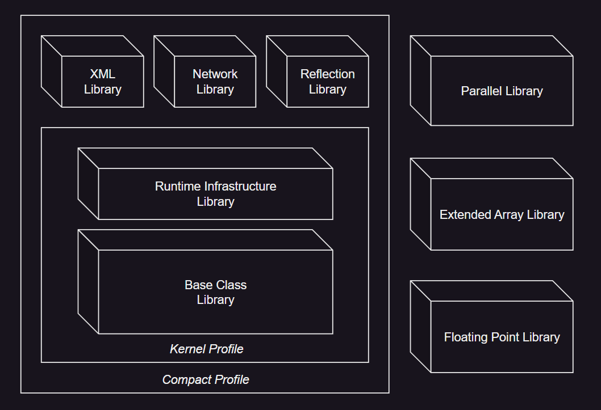

# CLI：配置文件和库

---
## 1. 概述

编译器编写者最关心的是文件格式、指令集设计和通用类型系统的问题，而应用程序员最感兴趣的是他们在使用的语言中可用的编程库。公共语言基础设施（CLI）规定了一个公共语言规范（CLS），该规范应用于定义外部可见方面（如方法签名），并打算在广泛的编程语言中使用。由于 CLI 库的目标是尽可能多的编程语言都可以使用，所有的库功能都通过符合 CLS 的类型和类型成员使用。

CLI 库的设计目标如下：
 * 支持各种编程语言。
 * 始终保持一致的设计模式。
 * 与 1990 年的 ISO/IEC C 标准库的功能相匹配。
 * 支持最新的编程范式，特别是网络、XML、运行时类型检查、实例创建和动态方法调度。
 * 被分解成具有最小相互依赖性的自洽库。

此分区提供了 CLI 库的概述，以及它们如何分解为配置文件和库的规范。一个配套文件被认为是这个分区的一部分，但以 XML 格式分发，并提供了 CLI 库中每种类型的详细信息。虽然 CLI 库的规范性规范是以 XML 形式存在的，但可以使用 XSL 转换来生成关于类库的易于浏览的信息。

此分区包含一个信息性附录，描述了在定义 CLI 库时使用的编程约定。这些约定显著简化了库的使用。实现者在创建额外的（非标准）库时，鼓励遵循这些约定。

---
## 2. 库和配置文件

库和配置文件，如下定义，是为了符合标准而创建的构造。它们规定了 CLI 的实现中应存在的一组功能，以及 CLI 运行的程序可用的一组类型。

在虚拟执行系统（VES）中不需要直接支持库和配置文件。它们在元数据中没有表示，对 CLI 的实现的结构或性能没有影响。库和配置文件可以跨越程序集（部署单元），并且单个库或配置文件中的类型名称不需要有一个公共前缀（“命名空间”）。

一般来说，没有办法在运行时测试是否有功能可用，也没有办法查询是否有特定的配置文件或库可用。然而，如果存在，反射库使得在运行时可以测试特定类型和成员的存在。

>---
### 2.1. 库

库指定了三件事：
 1. 提供可用的一组类型，包括它们在程序集中的分组。标准库类型包含在三个程序集中：`mscorlib`，`System` 和 `System.Xml`。每种类型的规范都指明了它所在的程序集。
 2. 提供可用的 CLI 的一组特性。对于任何特定库所需的特性集是 CLI 特性的子集。在 §[*标准库*](#standard-lib) 中描述的每个库都有文本定义了支持该库实现所需的 CLI 特性。
 3. 对其他库中定义的类型的修改。这些修改通常涉及向属于其他库的类型添加方法和接口，以及可以由该其他库类型的方法抛出的额外异常类型。这些修改应只提供额外的功能或在之前未指定的地方指定行为；它们不应该用于改变先前指定的行为。

例如扩展数值库。它提供了一个基础数据类型 `Double`，还指定了将 `ToDouble` 方法添加到属于基础类库的 `System.Convert` 类。它还定义了一个新的异常类型 `System.NotFiniteNumberException`，并指定了其他库中可以抛出它的现有方法（事实上，没有这样的方法）。

在库的 XML 规范中，每种类型都指定了它所属的库。对于那些是一个库（如扩展数值 [[↗]](#extended-numeric-lib)）的一部分，但其类型又是在另一个库（如基础类库 [[↗]](#base-class-lib)）中的成员（例如，`Console.WriteLine(float)`），XML 指定了定义该方法的库。参见 §[*XML 规范*](#xml-norm)。

>---
### 2.2. 配置文件

配置文件只是一组库，它们被组合在一起形成一个一致的整体，提供固定级别的功能。符合 CLI 规范的实现应指定它实现的配置文件，以及它提供的任何额外的库。核心配置文件 [[↗]](#kernel-profile) 应包含在所有符合 CLI 规范的实现中。因此，核心配置文件的所有库和 CLI 特性都在所有符合规范的实现中可用。这个最小特性集在 §[_核心配置文件特性要求_](#kernel-feature-requirements) 中描述。

将库组合在一起的规则是复杂的，因为每个库都可以向其他库中定义的类型添加成员。通过标准化少量的配置文件，作为每个配置文件的部分库的交互被完全指定。配置文件为设备、编译器、工具和应用程序的供应商提供了一致的目标。每个配置文件都指定了 CLI 特性和实现复杂性对资源约束的权衡。通过定义非常少量的配置文件，增加每个配置文件的供应，使每个配置文件都成为跨广泛的实现和工具集的一类应用的理想目标。

>---
### 2.3. 库和配置文件之间的关系

此标准指定了两个标准配置文件 [[↗]](#Standard-Profiles) 和七个标准库 [[↗]](#standard-lib)。下图显示了库和配置文件之间的关系：

 

扩展数组和扩展数值库不是任何配置文件的一部分，但可以与它们中的任何一个组合。这样做可以将适当的方法、异常和接口添加到配置文件中指定的类型中。

---
## 3. 标准配置文件
<a id="Standard-Profiles"></a>

有两个标准配置文件。符合 CLI 规范的的最小实现是 _核心配置文件_ ( _Kernel Profile_)，而 _精简配置文件_ (_Compact Profile_) 包含了针对资源丰富设备的应用程序有用的额外特性。

符合 CLI 规范的实现在遇到本标准中指定但特定配置文件不支持的特性时，应抛出适当的异常（例如，`System.NotImplementedException`，`System.MissingMethodException` 或 `System.ExecutionEngineException`）。

实现者应考虑提供静态检测他们不支持的特性的工具，这样用户在运行程序之前就有选择检查程序中是否存在这样的特性。符合 CLI 实现的供应商应明确指定他们支持哪些标准库和标准配置文件的配置。

"特性" 可以是类似在 CLI 不支持扩展数值库的情况下在方法的实现中使用浮点 CIL 指令。或者，"特性" 可能是对一个方法的调用，本标准指定该方法只在实现了特定库时存在，而进行调用的代码运行在一个不支持该特定库的 CLI 实现上。

>---
### 3.1. 核心配置文件
<a id="kernel-profile"></a>

此配置文件是符合 CLI 规范的最小可能实现。它包含了现代编程语言类库中常见的类型，以及编译器针对 CLI 所需的类型。核心配置文件包含基础类库和运行时基础设施库。

>---
### 3.2. 精简配置文件

此配置文件被设计成允许在只有少量物理内存的设备上实现，但提供了比单独的核心配置文件更多的功能。它还包含了实现所提议的 ECMAScript 精简配置文件所需的所有内容。精简配置文件包含核心配置文件，XML 库，网络库，反射库。

---
## 4. 核心配置文件特性要求
<a id="kernel-feature-requirements"></a>

所有符合 CLI 规范的实现至少支持核心配置文件。因此，所有由核心配置文件所需的 CLI 特性应由所有符合规范的实现来实现。本节通过列举不需要的特性集来定义该最小特性集；也就是说，最小符合规范的实现应实现本节剩余部分指定的所有 CLI 特性。在 [_标准库_](#standard-lib) 中指定的各个库的特性要求是通过引用本节中描述的受限项目来定义的。如果库没有指定任何额外的特性要求，那么应假定只需要本节中描述的核心配置文件的特性。

>---
### 4.1. 从核心配置文件中排除的特性

以下在本标准的其他地方指定的内部数据类型和构造，不要求只符合核心配置文件的 CLI 实现。所有其他 CLI 特性都是必需的。

#### 4.1.1. 浮点数
<a id="floating-point-feature"></a>

***浮点数特性集*** 包括用户可见的浮点数据类型 `float32` 和 `float64`，以及对浮点数的内部表示的支持。

***如果省略***，专门处理这些数据类型的 CIL 指令将抛出 `System.NotImplementedException` 异常。这些指令是：`ckfinite`，`conv.r.un`，`conv.r4`，`conv.r8`，`ldc.r4`，`ldc.r8`，`ldelem.r4`，`ldelem.r8`，`ldind.r4`，`ldind.r8`，`stelem.r4`，`stelem.r8`，`stind.r4`，`stind.r8`。任何试图引用包含浮点数据类型的签名都将抛出 `System.NotImplementedException` 异常。异常的明确时机没有指定。

这些限制保证 VES 不会遇到任何浮点数据。因此，算术指令（如 `add`）的实现不需要处理这些类型。

***库的一部分*** ：扩展数值 [[↗]](#extended-numeric-lib)

#### 4.1.2. 非向量数组
<a id="Non-vector-arrays"></a>

***非向量数组特性集*** 包括对具有多于一个维度或下界不为零的数组的支持。这包括对引用这类数组的签名、这类数组的运行时表示以及这类数组与本地数据类型之间的封送处理的支持。

***如果省略***，任何试图引用包含非向量数组的签名都将抛出 `System.NotImplementedException` 异常。异常的确切时机没有指定。

类型 `System.Array` 是核心配置文件的一部分，可在所有符合 CLI 实现的实现中使用。一个不提供非向量数组特性集的实现可以正确地假设该类型的所有实例都是向量。

***库的一部分*** ：扩展数组 [[↗]](#extended-array-lib)。

#### 4.1.3. 反射

***反射特性集*** 支持对数据类型的完全反射。它的所有功能都可以通过反射库中的方法暴露出来。

***如果省略***，核心配置文件指定了一个不透明类型 `System.Type`，其实例可以唯一地表示系统中的任何类型，并提供对类型名称的访问。

例如，如果只有核心配置文件，就不需要确定类型的成员，动态创建类型的实例，或者调用给定 `System.Type` 的实例的类型方法。与支持反射库的所需实现相比，这可以简化 CLI 的实现。

***库的一部分*** ：反射 [[↗]](#reflection-lib)。

#### 4.1.4. 应用程序域

***应用程序域特性集*** 支持多个应用程序域。核心配置文件要求存在一个单一的应用程序域。

***如果省略***，创建应用程序域的方法（基础类库的一部分 [[↗]](#base-class-lib)）将抛出 `System.NotImplementedException` 异常。

#### 4.1.5. 远程处理

***远程处理特性集*** 支持远程方法调用。它主要通过类 `System.MarshalByRefObject` 的特殊语义提供。

***如果省略***，类 `System.MarshalByRefObject` 应被视为一个没有特殊含义的简单类。

#### 4.1.6. Vararg

***vararg* *特性集*** 支持变长参数列表和运行时类型指针。

***如果省略***，任何试图引用具有 **vararg** 调用约定或与 **vararg** 方法相关的签名编码的方法都将抛出 `System.NotImplementedException` 异常。使用 CIL 指令 `arglist`，`refanytype`，`mkrefany` 和 `refanyval` 的方法将抛出 `System.NotImplementedException` 异常。异常的确切时机没有指定。不需要定义类型 `System.TypedReference`。

***库的一部分*** ： Vararg [[↗]](#vararg-lib)。

#### 4.1.7. 帧增长

***帧增长特性集*** 支持动态扩展堆栈帧。

***如果省略***，使用 CIL `localloc` 指令的方法将抛出 `System.NotImplementedException` 异常。异常的确切时机没有指定。

#### 4.1.8. IV.4.1.8 过滤异常

***过滤异常特性集*** 支持用户提供的异常过滤器。

***如果省略***，使用 CIL `endfilter` 指令或具有非空 **Filter Start** 的 **Exception Entry** 的方法将抛出 `System.NotImplementedException` 异常。异常的确切时机没有指定。

---
## 5. 标准库
<a id="standard-lib"></a>

每个库的详细内容，包括它提供的类型和它对其他库中类型的更改，以 XML 形式提供。本节提供了每个库的设计目的简要描述，以及指定了每个库除核心配置文件所需之外其他所需的 CLI 特性。

>---
### 5.1. 一般性意见
<a id="General-comments"></a>

除非在方法的文档中另有说明，否则所有的拷贝 (复制) 操作都是浅拷贝，而不是深拷贝。一些方法处理 "默认值"。对于引用类型，默认值是 `null`；对于可空值类型，默认值是 `HasValue` 返回 `false`；对于非可空值类型，默认值是全零位（对于布尔型表示 `false`，对于所有算术类型表示零）。

>---
### 5.2. 运行时基础设施库

运行时基础设施库是核心配置文件的一部分。它提供了编译器针对 CLI 所需的服务，以及从文件格式指定的流中动态加载类型的设施。例如，它提供了 `System.BadImageFormatException`，当加载的流格式不正确时会抛出此异常。

***在 XML 中使用的名称：*** ***RuntimeInfrastructure***

***CLI 特性要求：*** 无

>---
### 5.3. 基础类库（BCL）
<a id="base-class-lib"></a>

基础类库是核心配置文件的一部分。它是现代编程语言的简单运行时库。它作为 C# 语言的运行时库的标准，也是 CLI 标准库之一。它提供了表示 CLI 的内置数据类型的类型、简单的文件访问、自定义特性、安全特性、字符串操作、格式化、流、集合等。

***在 XML 中使用的名称：*** ***BCL***

***CLI 特性要求：*** 无

>---
### 5.4. 网络库

网络库是精简配置文件的一部分。它提供了简单的网络服务，包括直接访问网络端口以及 HTTP 支持。

***在 XML 中使用的名称：*** ***Networking***

***CLI 特性要求：*** 无

>---
### 5.5. 反射库
<a id="reflection-lib"></a>

反射库是精简配置文件的一部分。它提供了检查类型结构，创建类型实例，以及基于类型描述调用类型方法的能力。

***在XML中使用的名称：*** ***Reflection***

***CLI 特性要求：*** 必须支持反射，参见 §[*一般性意见*](#General-comments)。

>---
### 5.6. XML 库

XML 库是精简配置文件的一部分。它提供了一个简单的 "拉式" XML 解析器。它设计用于资源受限的设备，但提供了一个简单的用户模型。一个符合 CLI 的实现，如果包含 XML 库，也应实现网络库。

***在 XML 中使用的名称：*** ***XML***

***CLI 特性要求：*** 无

>---
### 5.7. 扩展数值库
<a id="extended-numeric-lib"></a>

扩展数值库不是任何配置文件的一部分，但可以作为任何 CLI 实现的一部分提供。它提供了对浮点数（`System.Single`，`System.Double`）和扩展精度（`System.Decimal`）数据类型的支持。像基础类库一样，这个库直接被 C# 标准引用。

实现这些数据类型上指定的算术操作主要通过硬件支持，使用这个库的程序员可以从中受益。

扩展数值库被单独保留，因为一些常见的处理器不直接支持这些数据类型。虽然可以提供软件模拟，但性能差异通常很大（1000 倍或更多），因此在不知道底层实现是否基于硬件的情况下，使用浮点操作构建软件是不合理的。

***在 XML 中使用的名称：*** ***ExtendedNumerics***

***CLI 特性要求：*** 浮点数 [[↗]](#floating-point-feature)。

>---
### 5.8. 扩展数组库
<a id="extended-array-lib"></a>

这个库不是任何配置文件的一部分，但可以作为任何 CLI 实现的一部分提供。它提供了对非向量数组的支持，即具有多于一个维度的数组，或者具有非零下界的数组。

***CLI 特性要求：*** 非向量数组 [[↗]](#Non-vector-arrays)。

>---
### 5.9. Vararg 库
<a id="vararg-lib"></a>

Vararg 库不是任何配置文件的一部分。它提供了处理变长参数列表的支持。

***在 XML 中使用的名称：*** ***Vararg***

***CLI 特性要求：*** 无

>---
### 5.10. 并行库

这个库不是任何配置文件的一部分，但可以作为任何 CLI 实现的一部分提供。扩展线程库的目的有两个：
 1. 为非专业程序员提供简单的并行性，以便可以利用多线程 CPU。配置文件强调简单性而不是大规模可扩展性。
 2. 不需要改变虚拟机或源语言。配置文件的所有特性都可以作为现有 CLI 之上的库来实现。配置文件可以与支持委托的任何 CLI 语言一起使用。

下面总结了循环类层次结构：

 ```
 ParallelLoop
        ParallelWhile
        ParallelForEach
        ParallelFor
 ```

基类 `ParallelLoop` 提取了对一组值进行并行循环的公共功能。三个派生类区分了三种常见的并行循环。如果在处理过程中集合可能会增长，那么使用 `ParallelWhile`。否则，如果集合实现了 `IEnumerable`，使用 `ParallelForEach`。如果集合可以通过 `int32` 进行索引，使用 `ParallelFor`。要选择在特定情况下使用哪种循环，可以考虑如何顺序编写循环。

如果循环可以使用 "`for (int i=0; i<n; ++i )`" 编写，并且 `n` 在循环执行之前就已知，那么使用 `ParallelFor`。如果循环可以用 `foreach` 语句编写，对在 `foreach` 运行时不会改变的集合进行操作，那么使用 `ParallelForEach`。如果循环可以写成 "`while (collection is not yet empty) {remove item from collection and process it}`"，那么使用 `ParallelWhile`。当有选择时，如果可能，使用 `ParallelFor`，因为它更显著有效。

***在 XML 中使用的名称：*** ***Parallel***

***CLI 特性要求：*** ***BCL***

---
## 6. 针对系统库的实现特定修改

鼓励实现者扩展或修改本标准中指定的类型以提供额外的功能。然而，实现者应注意，以 "`System.`" 开头并带有特殊标准公钥的类型名称是为标准库使用的：这些当前未使用的名称可能会在本标准的未来版本中定义。

为了允许针对标准库编译的程序能够在已经扩展或修改了标准库实现的运行时上工作，这些扩展或修改应遵守以下规则：
 * 新类重写的虚方法应保持由虚方法指定的协议。
 * 可以抛出新的异常，但在可能的情况下，它们应该是已指定抛出的异常的派生类，而不是完全新的异常类型。由标准库中定义的类型的方法引发的异常应派生自 `System.Exception`。
 * 接口和虚方法不应添加到现有的接口中。也不应添加到抽象类中，除非该类提供了实现。只有在它包含实现的地方才能添加接口或虚方法。这允许在接口或方法不存在时编写的程序继续工作。
 * 实例方法不应实现为虚方法。本标准中指定为实例（非静态，非虚拟）的方法不允许作为虚方法实现，以减少通过在编译时使用实现提供的库创建不可移植文件的可能性。尽管编译器不需要依赖虚方法和实例方法之间的区别，但用户很容易无意中重写虚方法，从而创建不可移植的代码。提供与本标准对应的特殊文件以供编译时使用的替代方案容易出现用户错误。
 * 字段和非虚方法的可访问性可以比本标准中指定的更宽。

这些规则允许以下常见的扩展。
 * 向现有类型添加新成员。
 * 具体（非抽象）类可以实现本标准中未定义的接口。
 * 向枚举添加字段（值）。
 * 实现可以在本标准指定的类型和指定为其基类型的类型之间的层次结构中插入新类型。也就是说，本标准指定了类型之间的继承关系，但没有指定直接基类型。
 * 实现可以添加对现有虚方法的重写，前提是新的重写满足现有的协议。

实现可能希望将功能分散到几个类型中，以提供非标准的扩展机制，或者可能希望通过新的基类型提供额外的非标准功能。只要程序不引用这些非标准类型，它们将在符合 CLI 的实现中保持可移植性。

---
## 7. XML 规范
<a id="xml-norm"></a>

### 7.1. 语义

XML 规范符合 [Figure 0 - 4](#Figure0-4) 中的文档类型定义（DTD）。只有包含在指定库中的类型才包含在 XML 中。

有三种类型的元素 / 特性：

 * **规范性 (Normative)**：如果没有元素或特性，XML 规范将不完整，那么这个元素或特性就是规范性的。
 * **信息性 (Informative)**：如果元素或特性指定了有助于澄清 XML 规范的信息，但没有它，规范仍然是独立的，那么这个元素或特性就是信息性的。
 * **渲染 / 格式化 (Rendering / Formatting)**：如果元素或特性指定了有助于 XML 渲染工具的信息，那么这个元素或特性就是用于渲染或格式化的。

除非另有明确说明，否则与元素或特性（例如，`#PCDATA`，`#CDATA`）关联的文本是规范性的或信息性的，取决于与其关联的元素或特性。DTD 中的许多元素和特性都是用于渲染的。

> **Figure 0 - 4：XML DTD**
<a id="Figure0-4"></a>

```xml
<!ELEMENT AssemblyCulture (#PCDATA)>
```

(Normative) 指定定义当前类型的程序集的区域性。目前这个值总是 “none”。它被保留以备将来使用。

```xml
<!ELEMENT AssemblyInfo (AssemblyName, ((AssemblyPublicKey, AssemblyVersion) 
| (AssemblyVersion, AssemblyPublicKey)), AssemblyCulture, Attributes)>
```

(Normative) 指定有关给定类型的程序集的信息。此信息对应于第二部分中描述的程序集元数据的部分，并包括来自 `AssemblyName`、`AssemblyPublicKey`、`AssemblyVersion`、`AssemblyCulture` 和 `Attributes` 元素的信息。

```xml
<!ELEMENT AssemblyName (#PCDATA)>
```

(Normative) 指定给定类型所属的程序集的名称。例如，BCL 中的所有类型都是 “`mscorlib`” 程序集的成员。
 
```xml
<!ELEMENT AssemblyPublicKey (#PCDATA)>
```

(Normative) 指定程序集的公钥。公钥表示为 128 位的值。

```xml
<!ELEMENT AssemblyVersion (#PCDATA)>
```

(Normative) 例如以 2.0.x.y 的形式指定程序集的版本。其中 x 是构建号，y 是修订号。

```xml
<!ELEMENT Attribute (AttributeName, Excluded?, ExcludedTypeName?, ExcludedLibraryName?)>
```

(Normative) 指定类型或类型成员上的自定义特性的文本。这包括特性名称以及特性类型本身是否包含在另一个库中。如果省略了 `Excluded` 元素，则假定它的值为 0。

```xml
<!ELEMENT AttributeName (#PCDATA)>
```

(Normative) 指定与类型或类型成员关联的自定义特性的名称。还包含实例化特性所需的数据。

```xml
<!ELEMENT Attributes (Attribute*)>
```

 (Normative) 指定给定类型或类型成员的特性列表。

```xml
<!ELEMENT Base (BaseTypeName?, ExcludedBaseTypeName?, ExcludedLibraryName?)>
```

 (Normative) 指定与当前类型的基类型相关的信息。虽然 `ExcludedBaseTypeName` 和 `ExcludedLibraryName` 元素在此元素中很少找到，但当类型继承自当前库中未找到的类型时，它们是必需的。

```xml
<!ELEMENT BaseTypeName (#PCDATA)>
```

 (Normative) 指定类型继承的类的完全限定名（即，类型的基类）。

```xml
<!ELEMENT Constraints (ParameterAttribute+, BaseTypeName?) >
```

 (Normative) 指定协变或逆变类型参数的约束。

```xml
<!ELEMENT Docs ((summary?, altmember?, altcompliant?, typeparam*, param*, returns?, value?, exception*, threadsafe?, remarks?, example?, permission?) 
| (typeparam*, param*, summary?, altmember?, altcompliant?, returns?, value?, exception*, threadsafe?, remarks?, example?, permission?) 
| (summary?, altmember?, altcompliant?, typeparam*, param*, returns?, value?, remarks?, threadsafe?, exception*, example?, permission?) 
| (typeparam*, param*, summary?, altmember?, altcompliant?, returns?, value?, remarks?, threadsafe?, exception*, example?, permission?))>
```

 (Normative) 指定给定类型或类型成员的文本文档。


```xml
<!ELEMENT Excluded (#PCDATA)>
```

 (Normative) 在没有给定库的情况下，通过 ‘0’ 或 ‘1’ 指定是否可以从当前类型中排除给定成员。‘0’ 指定不能排除。

```xml
<!ELEMENT ExcludedBaseTypeName (#PCDATA)>
```

 (Normative) 指定如果在实现中存在给定库，则当前类型必须继承的类型的完全限定名。库名在 `ExcludedLibraryName` 元素中指定。一个例子是 `System.Type` 类继承自 `System.Object`，但如果反射库存在，它必须继承自 `System.Reflection.MemberInfo`。

```xml
<!ELEMENT ExcludedLibrary (#PCDATA)>
```

 (Normative) 指定必须存在的库，以便需要实现给定类型的成员。例如，只有在 `ExtendedNumerics` 库可用时，才需要实现 `System.Console.WriteLine(double)`。

```xml
<!ELEMENT ExcludedLibraryName (#PCDATA)>
```

 (Normative) 此元素仅出现在自定义特性的描述中。它指定定义描述的特性的库的名称。例如，当为 `System.Text.StringBuilder` 指定没有成员名时调用的成员（在 C# 中，这是索引器）被称为 “Chars”。需要的特性是 `System.Reflection.DefaultMemberAttribute`。这在 **RuntimeInfrastructure** 库中找到。此元素与 `ExcludedTypeName` 元素一起使用。

```xml
<!ELEMENT ExcludedTypeName (#PCDATA)>
```

 (Normative) 指定成功指定给定特性的成员所需的特性的完全限定名。此元素与 `ExcludedLibraryName` 元素相关，并用于特性。

```xml
<!ELEMENT Interface (InterfaceName, Excluded?)>
```

 (Normative) 指定类型实现的接口的信息。此元素包含子元素，指定接口名称以及在当前库中需要接口是否需要另一个库。如果省略了 `Excluded` 元素，假定其值为 0。

```xml
<!ELEMENT InterfaceName (#PCDATA)>
```

 (Normative) 表示类型实现的完全限定接口名称。

```xml
<!ELEMENT Interfaces (Interface*)>
```

 (Normative) 指定类型实现的接口（如果有）的信息。每个由类型实现的接口都有一个 `Interface` 元素。

```xml
<!ELEMENT Libraries (Types+)>
```

 (Normative) 这是根元素。指定标准的所有类库所需的所有信息。这包括所有类型和所有子元素。

```xml
<!ELEMENT Member (MemberSignature+, MemberType, Attributes?, ReturnValue, TypeParameters?, Parameters, MemberValue?, Docs, Excluded?, ExcludedLibrary*)>
```

 (Normative) 指定类型成员的信息。这些信息包括签名、成员类型、协变/逆变类型参数、参数等，所有这些都是 XML 规范中的元素。如果省略了 `Excluded` 元素，假定其值为 0。

```xml
<!ATTLIST Member 
    MemberName NMTOKEN #REQUIRED
>
```

`MemberName`： (Normative) `MemberName` 指定当前成员的名称。


```xml
<!ELEMENT MemberOfLibrary (#PCDATA)>
```

 (Normative) PCDATA 是包含类型的库的名称。


```xml
<!ELEMENT MemberSignature EMPTY>
```

 (Normative) 指定给定类型成员的签名的文本（以源代码格式）。

```xml
<!ATTLIST MemberSignature
    Language CDATA #REQUIRED
    Value CDATA #REQUIRED
>
```

`Language`： (Normative) CDATA是编写签名的编程语言。所有成员都用 ILAsm 和 C# 描述。
`Value`： (Normative) CDATA 是给定语言中成员签名的文本。

```xml
<!ELEMENT MemberType (#PCDATA)>
```

 (Normative) 指定当前成员的种类。成员种类有：方法、属性、构造函数、字段和事件。

```xml
<!ELEMENT MemberValue (#PCDATA)>
```

 (Normative) 指定静态文字字段的值。

```xml
<!ELEMENT Members (Member*)>
```

 (Normative) 指定给定类型的所有成员的信息。

```xml
<!ELEMENT PRE EMPTY>
```

 (Rendering / Formatting) 此元素仅用于渲染目的，例如指定未来的文本应与前面的文本分开。

```xml
<!ELEMENT Parameter (Attributes?)>
```

 (Normative) 指定方法或属性的特定参数的信息。

```xml
<!ATTLIST Parameter
    Name NMTOKEN #REQUIRED
    Type CDATA #REQUIRED
    RefType CDATA #IMPLIED
>
```

`Name`： (Normative) 指定参数的名称。
`Type`： (Normative) 指定参数类型的完全限定名。
`RefType`： (Informative) 指定参数是否为 `ref`、`out` 或 `in` 参数。

```xml
<!ELEMENT ParameterAttribute (#PCDATA) >
```

 (Normative) 指定类型参数的约束特性。

```xml
<!ELEMENT Parameters (Parameter*)>
```

 (Normative) 指定给定方法或属性的参数的信息。指定的信息包含在此元素的每个 `Parameter` 元素中。此元素将包含方法或属性的每个参数的一个 `Parameter`。

```xml
<!ELEMENT ReturnType (#PCDATA)>
```

 (Normative) 指定当前成员返回的类型的完全限定名。

```xml
<!ELEMENT ReturnValue (ReturnType?)>
```

 (Normative) 指定成员的返回类型。`ReturnType` 应出现在除构造函数外的所有类型的成员中。

```xml
<!ELEMENT SPAN (#PCDATA | para | paramref | SPAN | see | block)*>
```

 (Rendering / Formatting) 此元素指定文本应与其他文本分段（例如，用回车符）。可以在 `SPAN` 元素内包含对参数、其他类型甚至文本块的引用。

```xml
<!ELEMENT ThreadingSafetyStatement (#PCDATA)>
```

 (Normative) 指定给定类型的线程安全声明。

```xml
<!ELEMENT Type (TypeSignature+, MemberOfLibrary, AssemblyInfo, ThreadingSafetyStatement?, TypeParameters?, 
((Docs, Parameters?, ReturnValue?, Base, Interfaces?) | (Base, Interfaces?, Parameters?, ReturnValue?, Docs)),
 Attributes?, Members?, TypeExcluded)>
```

 (Normative) 指定给定类型的所有信息。

```xml
<!ATTLIST Type
    Name CDATA #REQUIRED
    FullName CDATA #REQUIRED
    FullNameSP CDATA #REQUIRED
>
```

`Name`： (Informative) 指定给定类型的简单名称（例如，“`String`” 而不是 “`System.String`”）。
`FullName`： (Normative) 指定给定类型的完全限定名。对于泛型类型，这包括泛型参数名的拼写。
`FullNameSP`： (Informative) 指定完全限定名，其中完全限定名的每个 ‘`.`’ 都被 ‘`_`’ 替换。

```xml
<!ELEMENT TypeExcluded (#PCDATA)>
```

 (Normative) PCDATA 应为 ‘0’。

```xml
<!ELEMENT TypeParameter (Constraints*) >
```

 (Normative) 指定类成员中特定类型参数的信息。

```xml
<!ATTLIST TypeParameter
    Name CDATA #REQUIRED
>
```

`Name`： (Normative) 指定特定类型参数的名称。

```xml
<!ELEMENT TypeParameters (TypeParameter*)>
```

 (Normative) 指定类成员中所有类型参数的信息。

```xml
<!ELEMENT TypeSignature EMPTY>
```

 (Normative) 指定给定类型的签名（以代码表示）的文本。

```xml
<!ATTLIST TypeSignature
    Language CDATA #REQUIRED
    Value CDATA #REQUIRED
>
```

`Language`： (Normative) 指定指定的类型签名的编写语言。所有类型签名都用 ILAsm 和 C# 指定。
`Value`： (Normative) CDATA 是指定语言中的类型签名。

```xml
<!ELEMENT Types (Type+)>
```

 (Normative) 指定库的所有类型的信息。

```xml
<!ATTLIST Types
    Library NMTOKEN #REQUIRED
>
```

`Library`： (Normative) 指定定义所有类型的库。这样的库的一个例子是 “BCL”。

```xml
<!ELEMENT altcompliant EMPTY>
```

 (Informative) 指定当前非 CLS 兼容方法存在替代的 CLS 兼容方法调用。例如，此元素存在于 `System.IO.TextWriter.WriteLine(ulong)` 方法中，以显示`System.IO.TextWriter.WriteLine(long)` 是一个替代的 CLS 兼容方法。

```xml
<!ATTLIST altcompliant
    cref CDATA #REQUIRED
>
```

`cref`： (Informative) 指定替代 CLS 兼容方法的实际文档的链接。在此规范中，CDATA 与 C# 语言标准的附录 E 中指定的文档注释格式匹配。

```xml
<!ELEMENT altmember EMPTY>
```

 (Informative) 指定当前方法存在替代的等效成员调用。此元素用于运算符重载。

```xml
<!ATTLIST altmember
    cref CDATA #REQUIRED
>
```

`cref`： (Informative) 指定替代成员调用的实际文档的链接。在此规范中，CDATA 与 C# 语言标准的附录E中指定的文档注释格式匹配。

```xml
<!ELEMENT block (#PCDATA | see | para | paramref | list | block | c | subscript | code | sup | pi)*>
```

 (Rendering / Formatting) 指定子元素应根据作为特性指定的类型进行格式化。

```xml
<!ATTLIST block
    subset CDATA #REQUIRED
    type NMTOKEN #REQUIRED
>
```

`subset`： (Rendering / Formatting) 此特性保留供将来使用，目前只有 ‘no ne’ 的值。
`type`： (Rendering / Formatting) 指定接下来的块的类型，其中包括：`usage`、`overrides`、`note`、`example`、`default`、`behaviors`。

```xml
<!ELEMENT c (#PCDATA | para | paramref | code | see)*>
```

 (Rendering / Formatting) 指定文本是代码示例的输出。

```xml
<!ELEMENT code (#PCDATA)>
```

 (Informative) 指定文本是代码示例。

```xml
<!ATTLIST code
    lang CDATA #IMPLIED
>
```

`lang`： (Informative) 指定代码示例的编程语言。此规范使用 C# 作为示例的语言。

```xml
<!ELEMENT codelink EMPTY>
```

 (Informative) 指定可能从另一个示例链接到的一段代码。这里指定的 XML 格式不提供创建此类链接的方法。


```xml
<!ATTLIST codelink
    SampleID CDATA #REQUIRED
    SnippetID CDATA #REQUIRED
>
```

`SampleID`： (Informative) `SampleID` 是分配给此代码示例的唯一 ID。
`SnippetID`： (Informative) `SnippetID` 是分配给示例代码中的一段文本的唯一 ID。

```xml
<!ELEMENT description (#PCDATA | SPAN | paramref | para | see | c | permille | block | sub)*>
```

 (Normative) 指定列表或表中给定术语元素的描述的文本。此元素还指定表的列标题的文本。

```xml
<!ELEMENT example (#PCDATA | para | code | c | codelink | see)*>
```

 (Informative) 指定文本将是关于类型或给定类型的成员的使用的示例。

```xml
<!ELEMENT exception (#PCDATA | paramref | see | para | SPAN | block)*>
```

 (Normative) 指定提供类型成员应抛出的异常的信息的文本，除非另有规定。此元素可以只包含文本或其他渲染选项，如块等。

```xml
<!ATTLIST exception
    cref CDATA #REQUIRED
>
```

`cref`： (Rendering / Formatting) 指定到异常文档的链接。在此规范中，CDATA 与 C# 语言标准的附录 E 中指定的文档注释格式匹配。

```xml
<!ELEMENT i (#PCDATA)>
```

 (Rendering / Formatting) 指定文本应以斜体显示。

```xml
<!ELEMENT item (term, description*)>
```

 (Rendering / Formatting) 指定列表或表的特定项目。

```xml
<!ELEMENT list (listheader?, item*)>
```

 (Rendering / Formatting) 指定文本应以列表格式显示。

```xml
<!ATTLIST list
    type NMTOKEN #REQUIRED
>
```

`type`： (Rendering / Formatting) 指定将以何种形式表示接下来的文本的列表类型。规范中的值有：`bullet`、`number` 和 `table`。

```xnl
<!ELEMENT listheader (term, description+)>
```

 (Rendering / Formatting) 指定给定列表或表的所有列的标题。

```xml
<!ELEMENT onequarter EMPTY>
```

 (Rendering / Formatting) 指定文本，以 ¼ 的形式显示。

```xml
<!ELEMENT para (#PCDATA | see | block | paramref | c | onequarter | superscript | sup | permille | SPAN | list | pi | theta | sub)*>
```

 (Rendering / Formatting) 指定文本是可以被视为自己的段落的一部分。

```xml
<!ELEMENT param (#PCDATA | c | paramref | see | block | para | SPAN)*>
```

 (Normative) 指定参数的含义或目的的信息。参数的名称和文本描述将与此元素关联。

```xml
<!ATTLIST param
    name CDATA #REQUIRED
>
```
 
`name`： (Normative) 指定正在描述的参数的名称。

```xml
<!ELEMENT paramref EMPTY>
```

 (Rendering / Formatting) 指定对类型成员的参数的引用。

```xml
<!ATTLIST paramref
    name CDATA #REQUIRED
>
```
 
`name`： (Rendering / Formatting) 指定 `paramref` 元素引用的参数的名称。

```xml
<!ELEMENT permille EMPTY>
```

 (Rendering / Formatting) 表示当前文本应显示为 ‘‰’ 符号。

```xml
<!ELEMENT permission (#PCDATA | see | paramref | para | block)*>
```

 (Normative) 指定需要调用类型的成员的权限，以完全限定的类型名称和支持文本的形式给出。

```xml
<!ATTLIST permission
    cref CDATA #REQUIRED
>
```

`cref`： (Rendering / Formatting) 指定到权限文档的链接。在此规范中，CDATA 与 C# 语言标准的附录 E 中指定的文档注释格式匹配。

```xml
<!ELEMENT pi EMPTY>
```

 (Rendering / Formatting) 表示当前文本应显示为 ‘π’ 符号。

```xml
<!ELEMENT pre EMPTY>
```

 (Rendering / Formatting) 指定在前面和后面的文本之间的断开。

```xml
<!ELEMENT remarks (#PCDATA | para | block | list | c | paramref | see | pre | SPAN | code | PRE)*>
```

 (Normative) 指定关于类型或类型成员的额外信息，超出了摘要提供的信息。

```xml
<!ELEMENT returns (#PCDATA | para | list | paramref | see)*>
```

 (Normative) 指定描述给定类型成员的返回值的文本。

```xml
<!ELEMENT see EMPTY>
```

 (Informative) 指定到另一个类型或成员的链接。

```xml
<!ATTLIST see
    cref CDATA #IMPLIED
    langword CDATA #IMPLIED
    qualify CDATA #IMPLIED
>
```

`cref`： (Informative) `cref` 指定要链接到的类型或成员的完全限定名。在此规范中，CDATA 与 C# 语言标准的附录 E 中指定的文档注释格式匹配。
`langword`： (Informative) `langword` 指定链接是到一个语言不可知的关键字，如 “`null`”。
`qualify`： (Informative) `qualify` 表示链接中指定的类型或成员必须显示为完全限定的。此特性的值为 ‘`true`’ 或 ‘`false`’，默认值为 ‘`false`’。


```xml
<!ELEMENT sub (#PCDATA | paramref)*>
```

 (Rendering / Formatting) 指定当前文本应以下标表示法显示。

```xml
<!ELEMENT subscript EMPTY>
```

 (Rendering / Formatting) 指定当前文本应以下标表示法显示。

```xml
<!ATTLIST subscript
    term CDATA #REQUIRED
>
```

`term`： (Rendering / Formatting) 指定要作为下标渲染的值。

```xml
<!ELEMENT summary (#PCDATA | para | see | block | list)*>
```

 (Normative) 指定给定类型或类型成员的摘要描述。

```xml
<!ELEMENT sup (#PCDATA | i | paramref)*>
```

 (Normative) 指定给定类型或类型成员的摘要描述。

```xml
<!ELEMENT superscript EMPTY>
```

 (Rendering / Formatting) 指定当前文本应以上标表示法显示。

```xml
<!ATTLIST superscript
    term CDATA #REQUIRED
>
```

`term`： (Rendering / Formatting) 指定要作为上标渲染的值。

```xml
<!ELEMENT term (#PCDATA | block | see | paramref | para | c | sup | pi | theta)*>
```

 (Rendering / Formatting) 指定文本是列表项或表的主列中的项。

```xml
<!ELEMENT theta EMPTY>
```

 (Rendering / Formatting) 指定文本，以 ‘θ’ 的形式显示。

```xml
<!ELEMENT threadsafe (para+)>
```

 (Normative) 指定文本描述了当前类型的线程安全性的额外细节，超出了 `ThreadingSafetyStatement` 指定的内容。例如，文本将描述实现必须在同步方面做什么。

```xml
<!ELEMENT typeparam (#PCDATA | c | paramref | see | block | para | SPAN | geq | leq | whitespace)*>
```

(Normative) 指定类成员中给定类型参数的描述信息。

```xml
<!ATTLIST typeparam
    name CDATA #REQUIRED
> 
```

`name`： (Normative) 指定将被描述的类型参数的名称。

```xml
<!ELEMENT value (#PCDATA | para | list | see)*>
```

 (Normative) 指定描述传入属性的 `set` 方法的 “`value`” 的信息。

>---
#### 7.1.1. 值类型作为对象

在 XML 中的方法的文本描述中，有些地方期望一个 `object` 类型或接口类型的参数，但描述中提到传递一个值类型作为该参数。在这些情况下，调用方在进行调用之前应该对值类型进行装箱。

#### 7.1.2. 异常

在 XML 中定义的类型的许多成员都有关联的异常条件。除非在成员的定义中另有说明，否则任何给定成员的列出的异常应在发生声明的条件时抛出。

>---
### 7.2. XML 签名表示问题

对于 XML 中描述的每个类型和成员，都有一个 ILAsm 和 C# 签名对。这些签名对旨在等效，并提供足够的信息来允许正确地实现这些类型和成员。每个签名对都显示了这些签名的低级和高级视图。然而，如在 XML 中所写，给定的签名对的成员并不总是以等效的方式编写，即使它们旨在产生相同的行为。这个小节描述了签名表示法的差异。

#### 7.2.1. 序列化

如 ILAsm 签名所示，标准库中的许多类型都附加了预定义的 **serializable** 特性。标记有此特性的类型将被序列化为类型值的持久状态的一部分。这个标准并不要求符合规范的实现提供对序列化（或其对应的反序列化）的支持，也不指定完成这些操作的机制。

考虑 XML 中的 `System.String` 的 ILAsm 和 C# 签名：

```csharp
// CSharp 
public sealed class String …
```
```cil
// [ILAsm]
.class public sealed serializable String …
```

尽管 C# 标准没有处理序列化的问题，但如果这个库类型是用 C# 编写的，当上面的 C# 声明被编译时，意图是为类生成的代码包含如上所示的 **serializable** 特性。一些实现提供了一个特性类型 `System.SerializableAttribute` 用于此目的。

#### 7.2.2. 委托

标准库包含了许多委托类型。然而，如在 XML 中记录的，它们的 ILAsm 签名是不完整的。以 `System.EventHandler` 为例；它的 ILAsm 签名在 XML 中定义如下：

```cil
.class public sealed serializable EventHandler extends System.Delegate
{
    .method public hidebysig newslot virtual instance 
        void Invoke(object sender, class System.EventArgs e) 
}
```

然而，这个类型还有一个构造函数和两个可选的异步方法，`BeginInvoke` 和 `EndInvoke`。`System.EventHandler` 的这三个成员的签名如下：

```cil
.method public hidebysig specialname rtspecialname 
    void .ctor(object 'object', native int 'method')

.method public hidebysig newslot virtual 
    class System.IAsyncResult BeginInvoke(object sender, class System.EventArgs e, class System.AsyncCallback callback, object object')

.method public hidebysig newslot virtual 
    void EndInvoke(class System.IAsyncResult result)
```

其他标准委托类型有一个对应的构造函数和方法对，其签名可以从 XML 中的 ILAsm 和 [*Delegates*](./02_CLI%20元数据定义和语义.md/#delegate) 中的信息中推导出来。除非另有说明，标准委托类型提供两个可选的异步方法，`BeginInvoke`和`EndInvoke`。

#### 7.2.3. 属性

标准库包含许多具有属性的类型。然而，如在 XML 中记录的那样，它们的 ILAsm 签名是不完整的。考虑可读写的实例属性 `System.Collections.ArrayList.Capacity`。它的 ILAsm 签名在 XML 中定义如下：

```cil
.property int32 Capacity 
{
   public hidebysig virtual specialname int32 get_Capacity()
   public hidebysig virtual specialname void set_Capacity(int32 value)
}
```

然而，这是 ILAsm 语法的缩写。这个属性的完整（和正确）签名如下：

```cil
.property instance int32 Capacity() 
{
   .get instance int32 ArrayList::get_Capacity()
   .set instance void ArrayList::set_Capacity(int32)
}
.method public hidebysig newslot specialname virtual instance int32
       get_Capacity() { … }
.method public hidebysig newslot specialname virtual instance void
       set_Capacity(int32 'value') { … }
```

作为第二个例子，考虑只读的静态属性 `System.DateTime.Now`；它的 ILAsm 签名在 XML 中定义如下：

```cil
.property valuetype System.DateTime Now 
{
   public hidebysig static specialname valuetype System.DateTime get_Now()
}
```

然而，这个属性的完整（和正确）签名是：

```cil
.property valuetype System.DateTime Now() 
{
   .get valuetype System.DateTime DateTime::get_Now()
}
.method public hidebysig specialname static valuetype System.DateTime
   get_Now() { ... }
```

所有其他属性（包括那些被索引的）在 XML 中的格式化方式都类似。

#### 7.2.4. 嵌套类型

除了一个例外，任何给定类型的所有成员的定义都包含在该类型的 XML 中。例外的是嵌套类型。嵌套类型在 XML 中有自己的定义，其中它们的名称由它们所嵌套的类型的名称来限定。类型 `System.Collections.Generic.List<T>` 包含嵌套类型 `Enumerator`。这些类型在 XML 的 BCL 库中描述为 `List<T>` 和 `List<T>.Enumerator`。

---